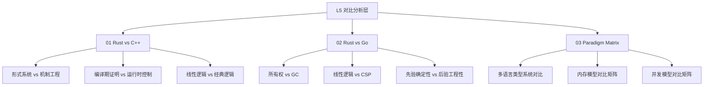

# L5 对比分析层（Comparative Analysis）

> **定位**：将 Rust 置于更广泛的编程语言范式和技术栈语境中，通过多维对比揭示其设计本体论、形式化优势与工程权衡。本层是原有 `01.md` 核心内容的结构化重组与扩展。

---

## 一、本层概念图谱

---

## 二、文件索引

| 文件 | 概念 | 核心内容 | 状态 |
|:---|:---|:---|:---|
| [01_rust_vs_cpp.md](./01_rust_vs_cpp.md) | Rust vs C++ | 形式系统模型 vs 机制工程模型、多维矩阵、决策树、AI时代分析 | ✅ v1.0（原 `01.md`） |
| `02_rust_vs_go.md` | Rust vs Go | CSP vs 所有权、服务编排语义、确定性对比 | ✅ v1.0 |
| `03_paradigm_matrix.md` | 范式矩阵 | 多语言形式化对比、类型系统谱系、设计哲学 | ✅ v1.0 |

---

## 三、原 `01.md` 的结构化索引

原文件 [01_rust_vs_cpp.md](./01_rust_vs_cpp.md) 包含以下核心内容，可按需引用：

| 章节 | 内容摘要 | 推荐用途 |
|:---|:---|:---|
| 核心命题 | 两种编程本体论对比 | 哲学层面理解 Rust 设计 |
| 思维导图 | 设计哲学的层级展开 | 快速建立认知框架 |
| 多维概念矩阵 | 12 维度形式系统 vs 机制工程对比 | 精确对比参考 |
| 决策树 | 技术选型判断 | 工程决策支持 |
| 历史必然性 | 从 CS 到 SE 的两种路径 | 历史语境理解 |
| 编译模型对比 | 证明检查 vs 代码生成 | 编译器行为理解 |
| 形式化边界 | Pin、FFI、循环引用 | 能力边界认知 |
| 五层扩展模型 | L0-L5 形式化层级 | 架构设计参考 |
| 技术栈哲学 | PG18+/Rust/Go/Temporal/TS/AI | 全栈技术选型 |
| 秩序与语义 | 欧氏几何模式论证 | 深层设计哲学 |

---

## 四、待创建内容（按 Phase 3 计划）

详见 [PLAN.md](../PLAN.md) Phase 3 部分。
