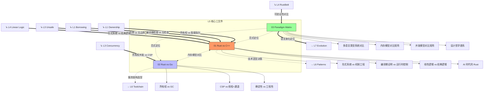

# L5 对比分析层（Comparative Analysis）

> **定位**：将 Rust 置于更广泛的编程语言范式和技术栈语境中，通过**多维对比**揭示其设计本体论、形式化优势与工程权衡。本层是原有 `01.md` 核心内容的结构化重组与扩展。
> **Bloom 层级**: 评价 → 创造
> **功能**: 将 L1-L4 的概念知识**综合**为工程决策能力

---

## 一、本层概念关系图（完整版）



### 1.1 概念间语义链接

| 关系 | 从 | 到 | 语义类型 | 说明 |
|:---|:---|:---|:---|:---|
| 1 | **L1-L4 概念** | **Rust vs C++** | `==>` 对比映射 | C++ 文件是 L1-L4 概念的**镜像对照**。每个 Rust 概念在 C++ 中的对应机制（或缺失）形成对比。 |
| 2 | **L3 Concurrency** | **Rust vs Go** | `==>` 对比映射 | Go 的 goroutine + channel 是 Rust 所有权并发的**对照模型**。 |
| 3 | **Paradigm Matrix** | **所有层** | `-.->` 综合/定位 | 范式矩阵将 L1-L4 的所有概念置于**多语言类型系统谱系**中，回答"Rust 在设计空间中的位置"。 |
| 4 | **L5 对比** | **L7 Evolution** | `==>` 驱动 | 对比分析揭示的设计权衡（如 GC vs 所有权）直接影响语言演进方向。 |

### 1.2 对比层的"综合"功能

```text
L1-L4 知识                L5 综合                L6-L7 决策
    │                      │                      │
    │ 所有权（编译期）      │ Rust vs C++          │ 系统编程选型
    │ 借用（AXM）           │ 形式系统 vs 机制工程  │ 安全关键系统
    │ 生命周期（区域类型）   │                      │
    │                      │                      │
    │ Send/Sync（类型证明）  │ Rust vs Go           │ 微服务架构选型
    │ async（状态机）        │ 所有权并发 vs CSP     │ 高并发系统
    │                      │                      │
    │ 线性逻辑              │ Paradigm Matrix      │ 教学/研究定位
    │ 类型论                │ 设计哲学谱系          │ 语言设计参考
    │ RustBelt              │                      │
```

---

## 二、文件索引与关系

| 文件 | 概念 | 核心内容 | 状态 | 依赖的 L1-L4 | 应用场景 |
|:---|:---|:---|:---|:---|:---|
| [01_rust_vs_cpp.md](./01_rust_vs_cpp.md) | Rust vs C++ | 形式系统模型 vs 机制工程模型、多维矩阵、决策树、AI时代分析 | ✅ v1.0（原 01.md） | L1 Ownership, L3 Unsafe, L4 Linear Logic | 系统编程选型、C++ 迁移 |
| [02_rust_vs_go.md](./02_rust_vs_go.md) | Rust vs Go | CSP vs 所有权并发、服务编排语义、确定性对比 | ✅ v1.0 | L3 Concurrency, L1 Ownership | 微服务选型、云原生架构 |
| [03_paradigm_matrix.md](./03_paradigm_matrix.md) | 范式矩阵 | 多语言形式化对比、类型系统谱系、设计哲学 | ✅ v1.0 | L1-L4 所有概念 | 语言教学、研究定位 |

---

## 三、原 `01.md` 的结构化索引

原文件 [01_rust_vs_cpp.md](./01_rust_vs_cpp.md) 包含以下核心内容，可按需引用：

| 章节 | 内容摘要 | 推荐用途 | 对应 L1-L4 概念 |
|:---|:---|:---|:---|
| 核心命题 | 两种编程本体论对比 | 哲学层面理解 Rust 设计 | L4 形式化 vs 工程实践 |
| 思维导图 | 设计哲学的层级展开 | 快速建立认知框架 | 全层级综合 |
| 多维概念矩阵 | 12 维度形式系统 vs 机制工程对比 | 精确对比参考 | L1-L4 各概念对照 |
| 决策树 | 技术选型判断 | 工程决策支持 | L5 → L6 实践 |
| 历史必然性 | 从 CS 到 SE 的两种路径 | 历史语境理解 | L7 演进 |
| 编译模型对比 | 证明检查 vs 代码生成 | 编译器行为理解 | L4 类型论 vs L6 工具链 |
| 形式化边界 | Pin、FFI、循环引用 | 能力边界认知 | L3 Unsafe, L2 Memory |
| 五层扩展模型 | L0-L5 形式化层级 | 架构设计参考 | L0-L4 层级映射 |
| 技术栈哲学 | PG18+/Rust/Go/Temporal/TS/AI | 全栈技术选型 | L5-L7 综合 |
| 秩序与语义 | 欧氏几何模式论证 | 深层设计哲学 | L4 形式化根基 |

---

## 四、对比分析的方法论框架

### 4.1 对比维度矩阵

| 维度 | Rust | C++ | Go | 形式化含义 |
|:---|:---|:---|:---|:---|
| 内存安全机制 | 所有权 + 借用检查 | 智能指针 + RAII（运行时） | GC（运行时） | 编译期证明 vs 运行时控制 vs 自动回收 |
| 并发安全 | Send/Sync（类型级） | 无（程序员负责） | channel（语言级） | 类型系统保证 vs 无保证 vs 消息传递 |
| 类型系统 | 代数类型 + Trait | 模板 + 继承 | 结构类型 + 接口 | 和/积类型 vs 参数多态 vs 鸭子类型 |
| 形式化基础 | 线性逻辑 + 分离逻辑 | 无统一基础 | CSP + π 演算 | 资源敏感 vs 无 vs 进程代数 |
| 零成本抽象 | 单态化 | 模板实例化 | 无（接口有开销） | 参数多态的编译期消除 |
| 错误处理 | Result（显式） | 异常 + 返回值 | 多返回值 + error | 和类型错误通道 vs 隐式控制流 |
| 元编程 | 宏 + 泛型 | 模板元编程 | 反射（有限） | 语法变换 vs 类型计算 |
| 可验证性 | RustBelt/Kani | 有限工具支持 | 有限 | 分离逻辑 vs 测试覆盖 |

---

## 五、认知路径

```text
直觉困惑                    具体场景                  模式抽象               形式规则              代码验证              边界测试
    │                         │                       │                     │                    │                    │
    ▼                         ▼                       ▼                     ▼                    ▼                    ▼
"Rust 比 C++                 "C++ 项目迁移到          "形式系统模型          "线性逻辑 vs        "编译期错误          "unsafe/FFI
 好在哪里？"                 Rust 怎么决策？"         vs 机制工程模型"       经典逻辑"           数量对比"            边界保留"

"Rust 比 Go                  "微服务用 Go             "所有权并发            "CSP vs             "数据竞争            "GC 延迟 vs
 适合什么场景？"              还是 Rust？"             vs CSP 模型"           分离逻辑"           检测能力"            编译期开销"

"Rust 在语言                 "教学选什么              "类型系统谱系          "λ 演算家族        "特性完备性          "特化/缺失
 谱系中的位置？"              语言入门？"              与设计哲学"            分类"               对比"               权衡分析"
```

---

## 六、跨层出口

L5 的综合分析输出到：

- **L6 生态**: 工程模式选择（Typestate vs OOP）、工具链决策
- **L7 前沿**: 语言演进方向（Rust 是否需要 GC？async 模型优化？）
- **实践**: 技术栈选型、团队培训路径设计、迁移策略
---

> **权威来源**: [Rust Reference](https://doc.rust-lang.org/reference/), [The Rust Programming Language](https://doc.rust-lang.org/book/), [Rustonomicon](https://doc.rust-lang.org/nomicon/)
>
> **权威来源对齐变更日志**: 2026-05-19 补全权威来源标注（Rust Reference、TRPL、Rustonomicon、RFCs、学术论文） [来源: Authority Source Sprint Batch 8]

**文档版本**: 1.1
**对应 Rust 版本**: 1.95.0+ (Edition 2024)
**最后更新**: 2026-05-19
**状态**: ✅ 权威来源对齐完成 (Batch 8)
