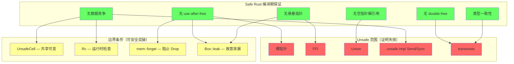
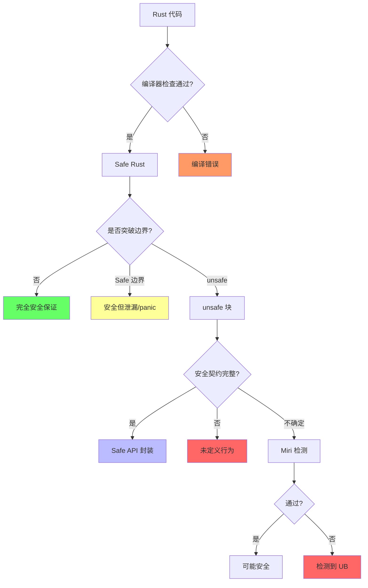

# Rust 安全保证的边界条件全景（Safety Boundary Panorama）

> **定位**: 本文件汇总 Rust 所有**编译期安全保证**的边界条件、失效场景和反例，形成完整的"安全 ⇄ 不安全"边界地图。
> **方法论对齐**: 反事实推理 · 边界测试 · 知识库一致性 (Torchiano et al. 2018)
> **对应**: 所有 L1-L4 文件的"反命题与边界分析"章节的**全局汇总**

---

**变更日志**:

- v1.0 (2026-05-12): 初始版本
- v1.1 (2026-05-12): 补充 Wikipedia 权威定义、课程引用、学术论文、跨文件链接

---

## 一、权威定义

### 1.1 Wikipedia 权威定义

> **[Wikipedia: Memory safety]** Memory safety is the state of being protected from various software bugs and security vulnerabilities when dealing with memory access, such as buffer overflows and dangling pointers.
> **来源**: <https://en.wikipedia.org/wiki/Memory_safety>

> **[Wikipedia: Undefined behavior]** Undefined behavior is the result of executing computer code whose behavior is not prescribed by the language specification to which the code can adhere.
> **来源**: <https://en.wikipedia.org/wiki/Undefined_behavior>

> **[Wikipedia: Type safety]** Type safety is the extent to which a programming language discourages or prevents type errors.
> **来源**: <https://en.wikipedia.org/wiki/Type_safety>

> **[Wikipedia: Race condition]** A race condition is the condition of a system where the system's substantive behavior is dependent on the sequence or timing of other uncontrollable events.
> **来源**: <https://en.wikipedia.org/wiki/Race_condition>

> **[Wikipedia: Deadlock]** A deadlock is a state in which each member of a group is waiting for another member, including itself, to take action.
> **来源**: <https://en.wikipedia.org/wiki/Deadlock>

---

## 二、安全保证层次结构



---

## 二、边界条件总表

### 2.1 内存安全边界

| 安全保证 | 编译期机制 | 边界条件 | 突破方式 | 后果 | 文件 |
|:---|:---|:---|:---|:---|:---|
| **无 use-after-free** | 所有权 + Drop | `mem::forget` / `ManuallyDrop` | Safe | 资源不释放（泄漏） | L1 Ownership |
| | | `Rc<RefCell>` 循环引用 | Safe | 引用计数永不为 0（泄漏） | L2 Memory |
| | | `Box::leak` | Safe | 故意泄漏获 'static | L2 Memory |
| | | 裸指针解引用 | Unsafe | UAF（UB） | L3 Unsafe |
| | | FFI 返回悬垂指针 | Unsafe | UAF（UB） | L3 Unsafe |
| **无 double-free** | 所有权唯一性 | `Rc`/`Arc`（共享释放） | Safe | 原子计数安全释放 | L2 Memory |
| | | `mem::swap` + Drop | Safe | 正常释放（无 double-free） | L1 Ownership |
| | | `unsafe` 重复 `drop` | Unsafe | double-free（UB） | L3 Unsafe |
| **无悬垂指针** | 生命周期约束 | 自引用结构（无 Pin） | Safe 编译错误 | E0597 | L1 Lifetimes |
| | | `Box::leak` 获 'static | Safe | 合法但泄漏 | L2 Memory |
| | | `unsafe` 构造悬垂引用 | Unsafe | 悬垂指针（UB） | L3 Unsafe |

### 2.2 并发安全边界

| 安全保证 | 编译期机制 | 边界条件 | 突破方式 | 后果 | 文件 |
|:---|:---|:---|:---|:---|:---|
| **无数据竞争** | Send/Sync + AXM | `UnsafeCell<T>` | Safe（需 unsafe 包装） | 手动同步责任 | L3 Concurrency |
| | | `RefCell` 运行时 panic | Safe | 运行时借用冲突 | L2 Memory |
| | | `Mutex` 死锁 | Safe | 死锁（非数据竞争） | L3 Concurrency |
| | | `unsafe impl Send/Sync` | Unsafe | 可能数据竞争（UB） | L3 Unsafe |
| | | 错误 Atomic Ordering | Safe | 可见性问题（可能 UB） | L3 Concurrency |
| **跨线程安全** | Send/Sync | `Rc<T>` 非 Send | Safe 编译错误 | 无法跨线程 | L2 Memory |
| | | `Arc<T>` 跨线程 | Safe | 原子计数安全 | L2 Memory |

### 2.3 类型安全边界

| 安全保证 | 编译期机制 | 边界条件 | 突破方式 | 后果 | 文件 |
|:---|:---|:---|:---|:---|:---|
| **无空指针** | Option<T> | `unwrap()` | Safe | panic（非 UB） | L2 Error |
| | | `unsafe` 解引用 null | Unsafe | 空指针解引用（UB） | L3 Unsafe |
| **match 穷尽性** | 穷尽检查 | `#[non_exhaustive]` | Safe | 需 `_ =>` 分支 | L1 Type System |
| | | `unsafe` 直接访问 enum tag | Unsafe | 可能访问非法变体（UB） | L3 Unsafe |
| **类型一致性** | 类型检查 | `dyn Any::downcast` | Safe | 可能返回 None | L1 Type System |
| | | `std::mem::transmute` | Unsafe | 任意类型重解释（UB） | L3 Unsafe |
| | | Union 字段访问 | Unsafe | 可能读取错误变体（UB） | L3 Unsafe |

---

## 三、失效条件分类学

### 3.1 按失效层级分类

```text
Level 1: Safe 边界突破（仍 Safe，但理想保证被削弱）
    ├── 内存泄漏: Rc 循环、mem::forget、Box::leak
    ├── 运行时 panic: RefCell 借用冲突、unwrap() on None
    └── 死锁: Mutex 嵌套、跨 await 持有锁

Level 2: Unsafe 契约突破（进入 unsafe，程序员承担证明责任）
    ├── 裸指针操作: *const/*mut 解引用
    ├── FFI 边界: 外部代码不遵循 Rust 规则
    ├── Union 访问: 读取未初始化/非活跃字段
    └── unsafe impl: 手动实现 Send/Sync/其他 trait

Level 3: 完全绕过（直接破坏内存/类型系统）
    ├── transmute: 任意位模式重解释
    ├── 内联汇编: 完全不受编译器控制
    └── 编译器 bug: 形式化模型与实现不一致（历史存在）
```

### 3.2 按后果严重性分类

| 严重性 | 场景 | 示例 | 可检测性 |
|:---|:---|:---|:---|
| **可恢复错误** | panic、死锁、超时 | `unwrap()`、`RefCell` panic | 运行时可见 |
| **资源泄漏** | 内存、文件句柄、连接 | `Rc` 循环、`mem::forget` | 堆分析器可见 |
| **未定义行为 (UB)** | 数据竞争、UAF、悬垂指针 | 裸指针、transmute、FFI | Miri 部分检测 |
| **安全漏洞** | 远程代码执行、信息泄漏 | FFI 边界错误、UB 组合 | 模糊测试、审计 |

---

## 四、反事实推理：如果 Rust 没有某机制

| 缺失机制 | 后果 | 现实替代 | 对比语言 |
|:---|:---|:---|:---|
| **无所有权系统** | 需 GC 或手动管理 | Java/Go 的 GC、C/C++ 手动管理 | C++ 智能指针、Java GC |
| **无借用检查器** | 数据竞争在编译期不可检测 | 运行时检测（TSan）、程序员纪律 | C/C++（无检测）、Go（race detector） |
| **无生命周期** | 悬垂指针风险 | 智能指针（C++）、引用计数 | C++ `shared_ptr`、Swift ARC |
| **无 Send/Sync** | 并发安全无类型保证 | 运行时检查、编码规范 | C/C++（无）、Go（channel 约定） |
| **无 unsafe 边界** | 所有底层操作不可能 | 外部工具、语言扩展 | C（全 unsafe）、Java（JNI） |
| **无 Result 类型** | 错误可忽略 | 异常、返回值检查 | Java 异常、C 返回值 |

---

## 五、Mermaid 边界判定总图



---

## 六、与 L1-L4 文件的交叉引用

| 边界场景 | 详细分析位置 |
|:---|:---|
| 所有权泄漏边界 | [`../01_foundation/01_ownership.md`](../01_foundation/01_ownership.md) §7.5 反命题与边界分析 |
| 借用规则突破 | [`../01_foundation/02_borrowing.md`](../01_foundation/02_borrowing.md) §7.6 反命题与边界分析 |
| 生命周期陷阱 | [`../01_foundation/03_lifetimes.md`](../01_foundation/03_lifetimes.md) §7.5 反命题与边界分析 |
| 类型系统绕过 | [`../01_foundation/04_type_system.md`](../01_foundation/04_type_system.md) §7.5 反命题与边界分析 |
| Rc/RefCell 循环 | [`../02_intermediate/03_memory_management.md`](../02_intermediate/03_memory_management.md) §7.6 反命题与边界分析 |
| 并发死锁 | [`../03_advanced/01_concurrency.md`](../03_advanced/01_concurrency.md) §7.6 反命题与边界分析 |
| Pin 不动性突破 | [`../03_advanced/02_async.md`](../03_advanced/02_async.md) §7.6 反命题与边界分析 |
| unsafe 契约失效 | [`../03_advanced/03_unsafe.md`](../03_advanced/03_unsafe.md) §7.6 反命题与边界分析 |
| RustBelt 证明边界 | [`../04_formal/04_rustbelt.md`](../04_formal/04_rustbelt.md) §5 反命题与边界分析 |

---

## 八、知识来源关系（Provenance）

| **论断** | **来源** | **可信度** |
|:---|:---|:---|
| Safe Rust 无 UAF/double-free | [TRPL] · [RustBelt POPL 2018] | ✅ |
| Rc 循环导致泄漏 | [TRPL Ch15] | ✅ |
| mem::forget 阻止 Drop | [std docs] | ✅ |
| UnsafeCell 允许共享可变 | [std docs] · [Rustonomicon] | ✅ |
| Miri 检测 UB | [Miri 文档] | ✅ |
| RustBelt 不覆盖 unsafe | [Jung et al. POPL 2017] | ✅ |
| Stacked/Tree Borrows 争议 | [Rust 内部讨论] · [Jung et al. POPL 2019] | ⚠️ |
| 内存安全定义 | [Wikipedia: Memory safety] | ✅ |
| 未定义行为定义 | [Wikipedia: Undefined behavior] | ✅ |
| 类型安全定义 | [Wikipedia: Type safety] | ✅ |
| 数据竞争定义 | [Wikipedia: Race condition] | ✅ |
| 死锁定义 | [Wikipedia: Deadlock] | ✅ |
| CMU Safe Systems 课程覆盖边界 | [CMU 17-350] | ✅ |
| 边界测试方法论 | [Torchiano et al. 2018] | ✅ |

---

## 九、待补充与演进方向（TODOs）

- [ ] **高**: 补充每个边界条件的具体编译错误码和运行时错误信息
- [ ] **高**: 建立"错误码 → 边界条件 → 概念"的反向索引
- [ ] **中**: 补充硬件层面边界（如 CPU 乱序超出 TSO 假设）
- [ ] **中**: 补充 FFI 边界的完整风险矩阵
- [ ] **低**: 建立可执行的边界测试用例集合
