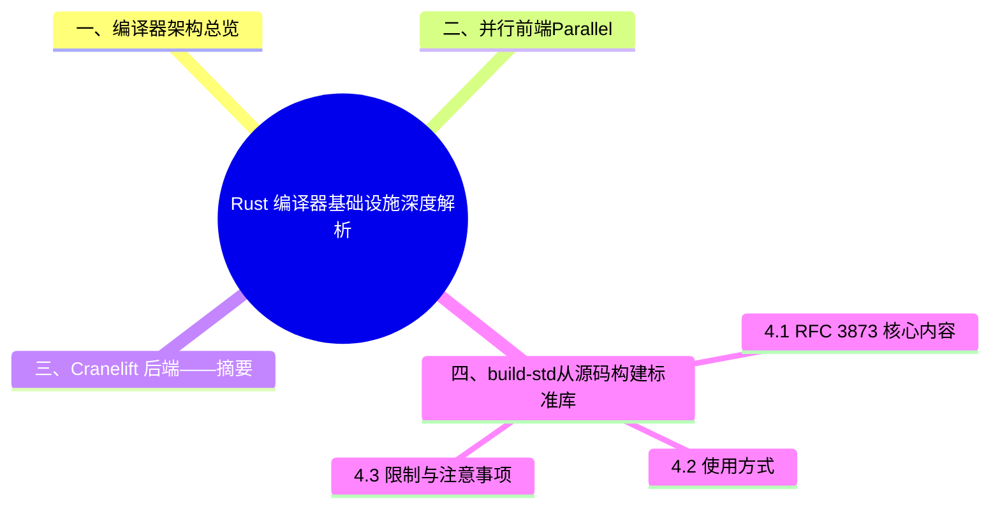

> **内容分级**: [专家级]
> **代码状态**: ✅ 含可编译示例
>
> **定理链**: N/A — 描述性/综述性/导航性文档，不涉及形式化定理链
>
# Rust 编译器基础设施深度解析
>
> **EN**: Compiler Internals
> **Summary**: Compiler Internals: Rust ecosystem tools, crates, and engineering practices.
> **Rust 版本**: 1.97.0+ (nightly for Cranelift/build-std/sanitizer)
> **权威来源**: 本文件为 `concept/` 权威页。
Compiler Internals. Core Rust concept covering mechanism analysis, parallel programming, compiler internals.
> **受众**: [专家]
> **Bloom 层级**: L4-L5
> **定位**: 系统梳理 Rust 编译器（rustc）的核心基础设施——并行前端、Cranelift 后端（两主题深度正文分别以 [04_parallel_frontend_preview](../../07_future/02_preview_features/04_parallel_frontend_preview.md)、[16_cranelift_backend_preview](../../07_future/02_preview_features/16_cranelift_backend_preview.md) 为权威页，本页仅保留摘要）、build-std、Sanitizer——分析其对编译速度、目标平台和开发体验的影响。
> **前置概念**: [Toolchain](01_toolchain.md) · [Unsafe Rust](../../03_advanced/02_unsafe/01_unsafe.md)
> **后置延伸**: [Rust 1.97.0 前沿特性预览（Beta）](../../07_future/00_version_tracking/rust_1_97_preview.md) · [Performance Optimization](../10_performance/01_performance_optimization.md)

---

> **来源**: [Rustc Dev Guide](https://rustc-dev-guide.rust-lang.org/) · [rustc_driver](https://doc.rust-lang.org/nightly/nightly-rustc/rustc_driver/) · [TRPL](https://doc.rust-lang.org/book/title-page.html) · [Brown University — Interactive Rust Book](https://rust-book.cs.brown.edu/) · [Jung et al. — RustBelt: Securing the Foundations of Rust](https://plv.mpi-sws.org/rustbelt/popl18/) · [Itanium C++ ABI](https://itanium-cxx-abi.github.io/cxx-abi/abi.html)
> **后置概念**: [Future Roadmap](../../07_future/01_edition_roadmap/04_roadmap.md)
> **前置依赖**: [Type Theory](../../04_formal/00_type_theory/01_type_theory.md)
> **前置依赖**: [Rust vs C++](../../05_comparative/01_systems_languages/01_rust_vs_cpp.md)

## 一、编译器架构总览

```text
Rust 编译器（rustc）流水线:
┌─────────────────────────────────────────────────────────────────┐
│  源代码 (.rs)                                                   │
│     ↓                                                           │
│  词法分析 (Lexer)                                               │
│     ↓                                                           │
│  语法分析 (Parser) ─────────────────┐                           │
│     ↓                               │                           │
│  AST → HIR (High-level IR)          │   并行前端 (Parallel)     │
│     ↓                               │   · 多线程解析            │
│  类型检查 (Typeck)                  │   · 增量编译              │
│     ↓                               │   · 查询系统 (Query)      │
│  Trait 求解 (Trait Solver)          │                           │
│     ↓                               └───────────────────────────┤
│  MIR (Mid-level IR) ──→  borrowck ──→  const eval              │
│     ↓                                                           │
│  代码生成后端 (Codegen Backend)                                  │
│     ├─> LLVM (默认，优化极致)                                   │
│     └─> Cranelift (开发构建，速度优先)                           │
│     ↓                                                           │
│  机器码 / WASM / 目标平台二进制                                  │
└─────────────────────────────────────────────────────────────────┘
```

---

## 二、并行前端（Parallel Frontend）——摘要

rustc 前端（解析 → HIR → 类型检查 → 借用（Borrowing）检查）传统上为单线程执行，大型 crate 中前端阶段约占编译时间的 40–60%。并行前端通过 Salsa 风格查询系统的并行化（`-Z threads=N`）与增量编译协同缩短构建时间：大型 crate 约 1.3–1.5x，小型 crate 可能因同步开销无收益甚至负优化。

> **权威页裁定**（AGENTS.md §3.3 深度优先）：本主题的深度正文（nightly 状态、里程碑路线、反命题树、边界测试集）以
> [并行前端预研（`concept/07_future/02_preview_features/04_parallel_frontend_preview.md`）](../../07_future/02_preview_features/04_parallel_frontend_preview.md)
> 为权威页；本节仅保留概述与指针，不重复其正文。

---

## 三、Cranelift 后端——摘要

Cranelift 是 [Bytecode Alliance](https://bytecodealliance.org/) 开发的替代代码生成后端，设计哲学是"足够快，而非足够优"：debug 构建编译速度约为 LLVM 的 2–5x（运行时（Runtime）性能约为 LLVM debug 的 80%），与 LLVM 形成互补——开发迭代用 Cranelift（`rustup component add rustc-codegen-cranelift` + `-Z codegen-backend=cranelift`），CI/发布用 LLVM。注意 2026-05 Rust Project Goals 已因资金不足将该项目标记为停滞（Not completed）。

> **权威页裁定**（AGENTS.md §3.3 深度优先）：本主题的深度正文（架构对比、平台/LTO 限制、边界测试集、演进路线）以
> [Cranelift 后端预研（`concept/07_future/02_preview_features/16_cranelift_backend_preview.md`）](../../07_future/02_preview_features/16_cranelift_backend_preview.md)
> 为权威页；本节仅保留概述与指针，不重复其正文。

---

## 四、build-std（从源码构建标准库）

build-std 解决的是“预编译标准库不满足目标平台需求”的问题：嵌入式自定义目标、修改过的 panic 策略、启用 `-Zbuild-std-features` 的实验特性（如 `panic_immediate_abort`）都需要从源码重编 core/alloc/std。它至今是 nightly 专属（`-Z build-std`），代价是每次构建都重编标准库、显著拉长编译时间，且与预编译 rlib 混用受限。RFC 3873 讨论的是其稳定化路径与上下文配置。

### 4.1 [RFC 3873](https://rust-lang.github.io/rfcs//3873-build-std-context.html) 核心内容

`build-std` 允许从源码重新编译 `core`/`std`/`alloc`/`panic_abort`/`panic_unwind`，而非使用预编译的标准库。

**使用场景**:

1. **嵌入式开发**: 标准库需针对特定目标平台重新编译（如自定义内存分配器）
2. **Sanitizer**: MemorySanitizer 要求标准库也使用 MSan 插桩编译
3. **优化**: 对标准库启用 LTO（Link Time Optimization），跨 crate 边界内联
4. **定制化**: 修改 panic 行为、移除浮点支持（`no_std` + 自定义 `core`）

### 4.2 使用方式

```bash
#  nightly 必需
RUSTFLAGS="-Z build-std" cargo build --target thumbv7m-none-eabi

# 指定仅构建需要的 crate:
RUSTFLAGS="-Z build-std=core,alloc" cargo build --target x86_64-unknown-none

# 与 Sanitizer 联用:
RUSTFLAGS="-Z build-std -Z sanitizer=memory" cargo build --target x86_64-unknown-linux-gnu
```

### 4.3 限制与注意事项

- **编译时间**: 从零构建 `std` 需额外 30-60 秒
- **nightly 必需**: `-Z build-std` 尚未稳定
- **目标平台限制**: 并非所有目标都支持 build-std

---

## 五、Sanitizer 生态

Sanitizer 与 Miri 覆盖 Rust 未定义行为检测的两个互补面：Sanitizer（ASan/MSan/TSan）基于 LLVM 插桩，运行在真实硬件上、速度快，但只能检测实际执行到的路径；Miri 是 MIR 解释器，能检测更细的 UB（如 stacked borrows 违反、未初始化读取）且无需复现路径，但慢 10-100 倍且不支持 FFI。工程分工：CI 用 Sanitizer 跑全量测试做回归，用 Miri 跑 unsafe 密集模块（Module）做深度验证。

### 5.1 Rust 支持的 Sanitizer

| Sanitizer | 检测目标 | 启用方式 | 平台限制 |
|:---|:---|:---|:---|
| **AddressSanitizer (ASan)** | 堆缓冲区溢出、Use-after-free | `-Z sanitizer=address` | Linux/macOS |
| **MemorySanitizer (MSan)** | 未初始化内存读取 | `-Z sanitizer=memory` | Linux only |
| **ThreadSanitizer (TSan)** | 数据竞争 | `-Z sanitizer=thread` | Linux/macOS |
| **LeakSanitizer (LSan)** | 内存泄漏 | 与 ASan 捆绑 | Linux/macOS |
| **UndefinedBehaviorSanitizer (UBSan)** | 整数溢出、对齐错误等 | `-Z sanitizer=undefined` | 广泛支持 |

### 5.2 与 Miri 的分工

```text
Miri:     解释执行 → 检测所有 UB（最严格）→ 极慢 → 用于小代码验证
Sanitizer: 编译期插桩 → 检测运行时可见的 UB → 中等开销 → 用于集成测试
```

### 5.3 实战示例

```bash
# 检测堆溢出
RUSTFLAGS="-Z sanitizer=address" cargo test --target x86_64-unknown-linux-gnu

# 检测数据竞争（多线程测试）
RUSTFLAGS="-Z sanitizer=thread" cargo test --target x86_64-unknown-linux-gnu

# 检测未初始化内存（需 build-std）
RUSTFLAGS="-Z sanitizer=memory -Z build-std" \
  cargo test --target x86_64-unknown-linux-gnu
```

---

## 六、反命题与选型建议

编译基础设施选型的核心权衡是编译速度 vs 运行性能：开发迭代期 Cranelift 后端（nightly）可比 LLVM debug 快 20-30%，发布构建则必须 LLVM + LTO。反命题提醒两点——“换后端就能解决编译慢”忽略了依赖编译才是大头（应配合 sccache 缓存）；“build-std 是银弹”忽略了其 nightly 绑定与重编成本，只有自定义目标或 std 特性裁剪时才值得启用。

### 6.1 编译后端选型决策树

```text
构建场景?
    ├─> 开发迭代 (cargo build)
    │   ├─> 追求极致编译速度? → Cranelift (nightly) 或 sccache
    │   └─> 默认方案 → LLVM debug (稳定工具链默认；并行前端需 nightly `-Z threads=N`)
    ├─> CI 测试
    │   ├─> 内存安全测试 → LLVM + AddressSanitizer
    │   └─> 常规测试 → LLVM release (与生产一致)
    └─> 生产发布 (cargo build --release)
        └─> 必选 LLVM (LTO + 全优化 Pass)
```

### 6.2 build-std 适用场景

- ✅ 自定义嵌入式目标
- ✅ Sanitizer 集成测试
- ✅ 对 `std` 进行 LTO 全链接优化
- ❌ 常规开发（编译时间过长，收益有限）

---

## 七、来源与延伸阅读

| 来源 | 可信度 | 说明 |
|:---|:---:|:---|
| [rustc-dev-guide](https://rustc-dev-guide.rust-lang.org/) | ✅ 一级 | 编译器开发权威文档 |
| [Rust Compiler Team](https://rust-lang.github.io/compiler-team/) | ✅ 一级 | 官方编译器团队 |
| [Cranelift Docs](https://github.com/bytecodealliance/wasmtime/tree/main/cranelift) | ✅ 一级 | Cranelift 后端文档 |
| [RFC 3873 — build-std](https://github.com/rust-lang/rfcs/pull/3873) | ✅ 一级 | build-std 设计 RFC |
| [Sanitizer Docs](https://doc.rust-lang.org/nightly/unstable-book/compiler-flags/sanitizer.html) | ✅ 一级 | Sanitizer 官方文档 |

---

**文档版本**: 1.0
**最后更新**: 2026-06-01
**状态**: ✅ 概念文档创建完成

> **权威来源**: [Rust Compiler Team](https://rust-lang.github.io/compiler-team/), [rustc-dev-guide](https://rustc-dev-guide.rust-lang.org/)
>
> **权威来源对齐变更日志**: 2026-06-01 创建 来源: rustc-dev-guide, Cranelift README, [RFC 3873](https://github.com/rust-lang/rfcs/pull/3873)

## 嵌入式测验（Embedded Quiz）

本节围绕「嵌入式测验（Embedded Quiz）」展开，依次讨论测验 1：`syn` crate 在 Rust 过程宏（Procedural Macro）开发中起什么作用…、测验 2：`quote!` 宏在过程宏中的用途是什么？（理解层）、测验 3：为什么过程宏必须在独立的 crate 中定义？（理解层）、测验 4：`proc-macro2` 与标准库 `proc_macro…等5个方面。

### 测验 1：`syn` crate 在 Rust 过程宏开发中起什么作用？（理解层）

**题目**: `syn` crate 在 Rust 过程宏（Procedural Macro）开发中起什么作用？

<details>
<summary>✅ 答案与解析</summary>

`syn` 将 `proc_macro::TokenStream` 解析为 AST（如 `DeriveInput`、`Expr`），使过程宏（Procedural Macro）可以操作结构化语法而非原始 token。是几乎所有 derive 宏的基础依赖。
</details>

---

### 测验 2：`quote!` 宏在过程宏中的用途是什么？（理解层）

**题目**: `quote!` 宏在过程宏（Procedural Macro）中的用途是什么？

<details>
<summary>✅ 答案与解析</summary>

`quote!` 从模板生成 `TokenStream`，支持变量插值（`#var`）。它是过程宏（Procedural Macro）输出代码的主要方式，比手动拼接 token 更安全、更易读。
</details>

---

### 测验 3：为什么过程宏必须在独立的 crate 中定义？（理解层）

**题目**: 为什么过程宏（Procedural Macro）必须在独立的 crate 中定义？

<details>
<summary>✅ 答案与解析</summary>

过程宏（Procedural Macro）在编译器解析阶段运行，必须在依赖它的 crate 之前编译完成。Rust 的编译模型要求 proc macro crate 是独立的编译单元。
</details>

---

### 测验 4：`proc-macro2` 与标准库 `proc_macro` 有什么区别？（理解层）

**题目**: `proc-macro2` 与标准库 `proc_macro` 有什么区别？

<details>
<summary>✅ 答案与解析</summary>

`proc_macro` 只能在 proc macro crate 中使用。`proc-macro2` 提供相同的 API 但可在任何 crate 中使用，支持测试和工具开发，且跨平台行为更一致。
</details>

---

### 测验 5：编译期代码生成（Code Generation）在 Rust 中有哪些常见应用场景？（理解层）

**题目**: 编译期代码生成（Code Generation）在 Rust 中有哪些常见应用场景？

<details>
<summary>✅ 答案与解析</summary>

1) `derive` 宏（Macro）自动生成 trait 实现；2) 构建脚本（`build.rs`）生成绑定代码；3) 常量求值计算查找表；4) 过程宏（Procedural Macro）从 schema 生成类型（如 `prost` 从 protobuf 生成 Rust 代码）。

</details>

## 认知路径

> **认知路径**: 从 Rust 核心语言特性出发，经由 **Rust 编译器基础设施深度解析** 的生态/前沿实践，通向系统化工程能力与未来语言演进方向。

### 核心推理链

| 定理 | 前提 | 结论 | 置信度 |
|:---|:---|:---|:---|
| Rust 编译器基础设施深度解析 基础原理 ⟹ 正确选型 | 理解核心概念与适用边界 | 能在实际项目中做出合理决策 | 高 |
| Rust 编译器基础设施深度解析 选型实践 ⟹ 常见陷阱 | 忽视版本兼容性与生态成熟度 | 技术债务或迁移成本 | 中 |
| Rust 编译器基础设施深度解析 陷阱规避 ⟹ 深度掌握 | 持续跟踪社区演进与最佳实践 | 能进行架构设计与技术预研 | 高 |

### 实践示例：条件编译与目标特性检测

```rust
// 根据目标平台启用不同实现
#[cfg(target_arch = "x86_64")]
fn optimized_add(a: i32, b: i32) -> i32 {
    // x86_64 特定优化路径
    a.wrapping_add(b)
}

#[cfg(not(target_arch = "x86_64"))]
fn optimized_add(a: i32, b: i32) -> i32 {
    // 通用回退路径
    a.saturating_add(b)
}

fn main() {
    println!("2 + 3 = {}", optimized_add(2, 3));
}
```

---

## ⚠️ 反例与陷阱

**反例：在 stable 工具链上使用 `-Z` 编译器内部标志。**

```bash
# rustc 1.97 stable 实测拒绝：
# error: the option `Z` is only accepted on the nightly compiler
rustc -Ztime-passes main.rs
```

绕过手段 `RUSTC_BOOTSTRAP=1` 虽能解锁，但属于无保证的 hack：`-Z` 选项名、语义、输出格式随时变更，依赖它的构建脚本会在下次工具链升级时无声失效。

**修正对照**：

1. 需要 `-Z` 功能时显式声明 nightly 工具链（`rust-toolchain.toml`）；
2. CI 中固定 nightly 日期版本，升级时人工复核所用 `-Z` 标志；
3. 生产构建禁止 `RUSTC_BOOTSTRAP`——它同时绕过 stable 的 feature gate 保护。

**陷阱要点**：`-Z` 是编译器开发接口而非用户接口；「能用」与「受支持」之间的鸿沟由使用者自行承担。

---

## 国际权威参考 / International Authority References（P1 学术 · P2 生态）

> 依据 `AGENTS.md` §2「对齐网络国际化权威内容」补充：仅追加已验证可达的权威链接，不改动正文事实。

- **P2 生态/社区**: [verus-lang/verus — SMT 验证器](https://github.com/verus-lang/verus) · [creusot-rs/creusot — Rust 演绎验证](https://github.com/creusot-rs/creusot)

## 🧭 思维导图（Mindmap）


