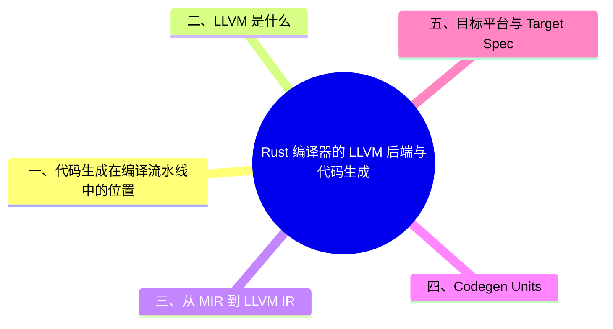

> **内容分级**: [综述级]
> **本节关键术语**: LLVM · Codegen · LLVM IR · Codegen Unit · Monomorphization · Target Spec · LTO · `rustc_codegen_llvm` · `rustc_codegen_ssa` — [完整对照表](../../00_meta/01_terminology/01_terminology_glossary.md)
>
# Rust 编译器的 LLVM 后端与代码生成

> **EN**: LLVM Backend and Code Generation in rustc
> **Summary**: Explains how rustc lowers MIR to LLVM IR, forms codegen units, uses target specifications, and performs LTO; also covers alternative backends like Cranelift and GCC.
> **Rust 版本**: 1.97.0+ (Edition 2024)
> **受众**: [专家]
> **Bloom 层级**: L2-L4
> **权威来源**: 本文件为 `concept/` 权威页。
> **A/S/P 标记**: **F** — Formal
> **双维定位**: F×Inf — 编译器后端基础设施
> **定位**: 把“MIR 之后发生了什么”讲清楚：从 LLVM IR 生成、代码优化到目标文件与链接，覆盖 rustc 代码生成层的核心机制。
> **前置概念**: [安全边界](../../05_comparative/03_domain_comparisons/01_safety_boundaries.md)
> **后置概念**: [Rustc Driver and Stable MIR](10_rustc_driver_and_stable_mir.md) · [Compiler Infrastructure](05_compiler_infrastructure.md)

---

> **来源**: [Rustc Dev Guide — Backend](https://rustc-dev-guide.rust-lang.org/overview.html) · [LLVM Documentation](https://llvm.org/docs/) · [TRPL](https://doc.rust-lang.org/book/title-page.html) · [Brown University — Interactive Rust Book](https://rust-book.cs.brown.edu/) · [Jung et al. — RustBelt: Securing the Foundations of Rust](https://plv.mpi-sws.org/rustbelt/popl18/) · [Itanium C++ ABI](https://itanium-cxx-abi.github.io/cxx-abi/abi.html)
> [Rustc Dev Guide — The MIR](https://rustc-dev-guide.rust-lang.org/mir/index.html) ·
> [Rustc Dev Guide — Backend Agnostic Codegen](https://rustc-dev-guide.rust-lang.org/overview.html) ·
> [Rust Reference — Linkage](https://doc.rust-lang.org/reference/linkage.html)

---

## 📑 目录

- [Rust 编译器的 LLVM 后端与代码生成](#rust-编译器的-llvm-后端与代码生成)
  - [📑 目录](#-目录)
  - [一、代码生成在编译流水线中的位置](#一代码生成在编译流水线中的位置)
  - [二、LLVM 是什么](#二llvm-是什么)
  - [三、从 MIR 到 LLVM IR](#三从-mir-到-llvm-ir)
  - [四、Codegen Units](#四codegen-units)
  - [五、目标平台与 Target Spec](#五目标平台与-target-spec)
  - [六、链接与 LTO](#六链接与-lto)
    - [6.1 链接](#61-链接)
    - [6.2 LTO（Link Time Optimization）](#62-ltolink-time-optimization)
  - [七、替代后端：Cranelift 与 GCC](#七替代后端cranelift-与-gcc)
  - [八、如何观察 LLVM IR](#八如何观察-llvm-ir)
  - [嵌入式测验](#嵌入式测验)
    - [测验 1：`rustc` 默认使用哪个后端生成机器码？](#测验-1rustc-默认使用哪个后端生成机器码)
    - [测验 2：Codegen unit 的作用是什么？](#测验-2codegen-unit-的作用是什么)
    - [测验 3：Fat LTO 和 Thin LTO 的主要权衡是什么？](#测验-3fat-lto-和-thin-lto-的主要权衡是什么)
    - [测验 4：Cranelift 后端适合什么场景？](#测验-4cranelift-后端适合什么场景)
  - [权威来源索引](#权威来源索引)
  - [⚠️ 反例与陷阱](#️-反例与陷阱)
  - [版本兼容性 / Version Compatibility](#版本兼容性--version-compatibility)
  - [国际权威参考 / International Authority References（P1 学术 · P2 生态）](#国际权威参考--international-authority-referencesp1-学术--p2-生态)
  - [🧭 思维导图（Mindmap）](#-思维导图mindmap)

---

## 一、代码生成在编译流水线中的位置

```text
源代码
  → AST → HIR → THIR → MIR
  → MIR optimizations
  → Monomorphization（单态化）
  → Codegen（代码生成：MIR → LLVM IR / Cranelift / GCC）
  → Linking（链接）
  → 可执行文件 / 库
```

Code generation 是编译器把高层 IR 真正转换成机器可执行形式的关键阶段。

---

## 二、LLVM 是什么

LLVM 是一套模块（Module）化的编译器工具链，核心是**可插拔的后端（backend）**。`rustc` 默认使用 LLVM 后端：

- 输入：**LLVM IR**（带类型和注解的底层中间表示）；
- 输出：目标平台的机器码（ELF、PE、Wasm 等）。

使用 LLVM 的好处：

- 复用成熟优化 pass；
- 自动支持 LLVM 支持的所有平台；
- 安全漏洞（如 Spectre/Meltdown）只需更新 LLVM。

> [Rustc Dev Guide — What is LLVM?](https://rustc-dev-guide.rust-lang.org/overview.html)(<https://rustc-dev-guide.rust-lang.org/overview.html>)

---

## 三、从 MIR 到 LLVM IR

`rustc` 通过两个主要 crate 与 LLVM 交互：

| Crate | 作用 |
|:---|:---|
| `rustc_codegen_ssa` | 后端无关的代码生成接口与共享逻辑 |
| `rustc_codegen_llvm` | 针对 LLVM 的具体实现，生成 LLVM IR 并调用 LLVM C++ API |

关键步骤：

1. 对 MIR 做**单态化**（monomorphization）：把泛型（Generics）函数实例化为具体类型版本；
2. 收集所有需要 codegen 的项，分配到 **codegen units**；
3. 把每个 codegen unit 翻译成 LLVM IR module；
4. 调用 LLVM 运行优化 pass 并生成目标文件。

```rust,ignore
// MIR 中可能是泛型
fn foo<T>(x: T) { ... }

// codegen 前会被单态化为多个具体副本
fn foo_i32(x: i32) { ... }
fn foo_u64(x: u64) { ... }
```

---

## 四、Codegen Units

Codegen unit 是可以**并行编译**的最小 LLVM module 单元。它们在单态化（Monomorphization）收集阶段就已经划分好：

- 每个 unit 包含一组函数/静态项；
- 多个 units 可同时在多核上编译；
- unit 越多并行度越高，但可能牺牲内联机会；
- unit 越少越利于优化，但并行度越低。

可通过 `-C codegen-units=N` 控制：

```bash
# 发布构建时通常设 1 以获得最佳优化
cargo build --release --config 'profile.release.codegen-units=1'
```

> **关键洞察**: Codegen unit 是编译时间与运行时（Runtime）性能之间的调优杠杆。
>
> [Rustc Dev Guide — Code generation — Codegen units](https://rustc-dev-guide.rust-lang.org/overview.html)(<https://rustc-dev-guide.rust-lang.org/overview.html>)

---

## 五、目标平台与 Target Spec

Rust 通过 **target triple** 标识编译目标：

```bash
# 列出已安装目标
rustup target list

# 为 ARM Cortex-M4 编译
cargo build --target thumbv7em-none-eabihf
```

Target spec 包含 ABI、数据布局、调用约定、可用特性等。自定义目标可通过 JSON target spec 文件指定：

```bash
rustc --target my-target.json
```

> [Rustc Dev Guide — Adding a new target](https://rustc-dev-guide.rust-lang.org/overview.html)(<https://rustc-dev-guide.rust-lang.org/overview.html>)

---

## 六、链接与 LTO

链接是编译管线的最后阶段，也是 LTO 的发挥场所。默认链接器（GNU ld）是大型项目编译时间瓶颈之一，换用 `mold`/`lld` 可提速数倍；LTO 则跨 crate 边界内联与去死代码：`thin` LTO 在编译时间与优化效果间平衡（发布构建推荐），`fat` LTO 效果最佳但编译时间成倍增长，配合 `codegen-units = 1` 是极致优化的标准组合。注意 LTO 与增量编译互斥，开发期应保持关闭。

### 6.1 链接

LLVM 生成 `.o` 目标文件后，rustc 调用系统链接器（如 `ld`、`lld`、`link.exe`），传入：

- crate metadata object；
- 标准库/运行时（Runtime）（如 `libstd`）；
- 原生库（通过 `build.rs` 或 `-l` 指定）。

### 6.2 LTO（Link Time Optimization）

LTO 把优化推迟到链接阶段，可跨 codegen unit 内联：

```bash
# Fat LTO：全程序 IR 合并后优化
cargo rustc --release -- -C lto=fat

# Thin LTO：分区并行，编译更快，优化接近 Fat LTO
cargo rustc --release -- -C lto=thin
```

| LTO 类型 | 速度 | 优化效果 |
|:---|:---|:---|
| `fat` | 慢 | 最佳 |
| `thin` | 快 | 接近 fat |
| `off` | 最快 | 无跨 crate 优化 |

> [Rustc Dev Guide — Code generation — LTO](https://rustc-dev-guide.rust-lang.org/overview.html)(<https://rustc-dev-guide.rust-lang.org/overview.html>)

---

## 七、替代后端：Cranelift 与 GCC

`rustc` 不只有 LLVM 一个后端：

| 后端 | 状态 | 特点 |
|:---|:---|:---|
| **LLVM** | stable 默认 | 优化强、平台多 |
| **Cranelift** | 每日构建版（`rustc_codegen_cranelift`） | 编译速度快，适合 debug 构建 |
| **GCC** | 开发中 | 支持 LLVM 不支持的平台 |

启用 Cranelift（每日构建版）：

```bash
rustup component add rustc-codegen-cranelift --toolchain <每日构建版工具链>
cargo +<每日构建版工具链> build -Zcodegen-backend=cranelift
```

> [Rustc Dev Guide — Codegen backend testing](https://rustc-dev-guide.rust-lang.org/overview.html)(<https://rustc-dev-guide.rust-lang.org/overview.html>)

---

## 八、如何观察 LLVM IR

```bash
# 生成当前 crate 的 LLVM IR
cargo rustc -- --emit=llvm-ir

# 生成 LLVM bitcode
cargo rustc -- --emit=llvm-bc

# 查看特定函数的汇编
cargo rustc -- --emit=asm -C llvm-args=-x86-asm-syntax=intel
```

输出通常位于 `target/debug/deps/` 或 `target/release/deps/`。

---

## 嵌入式测验

本节围绕「嵌入式测验」展开，依次讨论测验 1：`rustc` 默认使用哪个后端生成机器码？、测验 2：Codegen unit 的作用是什么？、测验 3：Fat LTO 和 Thin LTO 的主要权衡是什么？与测验 4：Cranelift 后端适合什么场景？。

### 测验 1：`rustc` 默认使用哪个后端生成机器码？

<details>
<summary>✅ 答案与解析</summary>

LLVM。`rustc_codegen_llvm` 负责把 MIR 翻译成 LLVM IR 并调用 LLVM 生成目标文件。

</details>

---

### 测验 2：Codegen unit 的作用是什么？

<details>
<summary>✅ 答案与解析</summary>

Codegen unit 是可以独立并行编译的最小 LLVM module，影响编译并行度和跨 unit 内联/优化机会。

</details>

---

### 测验 3：Fat LTO 和 Thin LTO 的主要权衡是什么？

<details>
<summary>✅ 答案与解析</summary>

Fat LTO 把所有 IR 合并后优化，效果最好但编译慢；Thin LTO 分区并行，编译快且优化效果接近 Fat LTO。

</details>

---

### 测验 4：Cranelift 后端适合什么场景？

<details>
<summary>✅ 答案与解析</summary>

Cranelift 编译速度快但优化较弱，适合 debug 构建或需要快速反馈的开发场景。目前仍为每日构建版实验性。

</details>

---

## 权威来源索引

| 来源 | 可信度 | 说明 |
|:---|:---:|:---|
| [Rustc Dev Guide — Code generation](https://rustc-dev-guide.rust-lang.org/overview.html) | ✅ 一级 | 代码生成官方文档 |
| [Rustc Dev Guide — Backend Agnostic Codegen](https://rustc-dev-guide.rust-lang.org/overview.html) | ✅ 一级 | 后端无关代码生成 |
| [Rustc Dev Guide — The MIR](https://rustc-dev-guide.rust-lang.org/mir/index.html) | ✅ 一级 | MIR 官方文档 |
| [Rust Reference — Linkage](https://doc.rust-lang.org/reference/linkage.html) | ✅ 一级 | 链接规则 |

---

> **权威来源**: [Rustc Dev Guide](https://rustc-dev-guide.rust-lang.org/), [The Rust Reference](https://doc.rust-lang.org/reference/introduction.html)
> **权威来源对齐变更日志**: 2026-06-21 创建，对齐 Rust 1.97.0 / LLVM 21

**文档版本**: 1.0
**最后更新**: 2026-06-21
**状态**: ✅ 已对齐 Rustc Dev Guide 代码生成文档

---

## ⚠️ 反例与陷阱

**反例：跨工具链版本混合链接 LLVM bitcode。**

用 rustc 1.96（LLVM A）编译的 rlib 与 rustc 1.97（LLVM B）编译的 rlib 做全程序 LTO 或 `-C linker-plugin-lto` 时，bitcode 版本不兼容会在链接期报 opaque error；即使侥幸链接成功，内联跨版本边界的行为也无任何保证。

**修正对照**：

1. 同一工作区锁定单一工具链（`rust-toolchain.toml`）；
2. 需要预编译二进制依赖时用 C ABI 边界（`extern "C"` + 静态/动态库）隔离，而非 Rust 原生 rlib 混链；
3. `-C linker-plugin-lto` 要求链接器插件与 rustc 内置 LLVM 版本对齐。

**陷阱要点**：Rust 没有稳定的 rlib ABI——「同语言混链」的安全性以「同编译器版本」为前提，这与 C/C++ 的跨编译器链接习惯直接冲突。

---

## 版本兼容性 / Version Compatibility

> 本节汇总与本概念相关的 Rust 稳定版本变更。完整列表见对应版本跟踪页。

- **[Rust 1.97.1](../../07_future/00_version_tracking/rust_1_97_1.md)**
  - 修复 LLVM 优化导致的误编译；回退 1.97.0 中提高触发概率的 IR 变更
- **[Rust 1.91](../../07_future/00_version_tracking/rust_1_91_stabilized.md)**
  - 内部升级 LLVM 21

## 国际权威参考 / International Authority References（P1 学术 · P2 生态）

> 依据 `AGENTS.md` §2「对齐网络国际化权威内容」补充：仅追加已验证可达的权威链接，不改动正文事实。

- **P2 生态/社区**: [model-checking/kani — 模型检查器](https://github.com/model-checking/kani) · [model-checking/verify-rust-std](https://github.com/model-checking/verify-rust-std)

## 🧭 思维导图（Mindmap）


