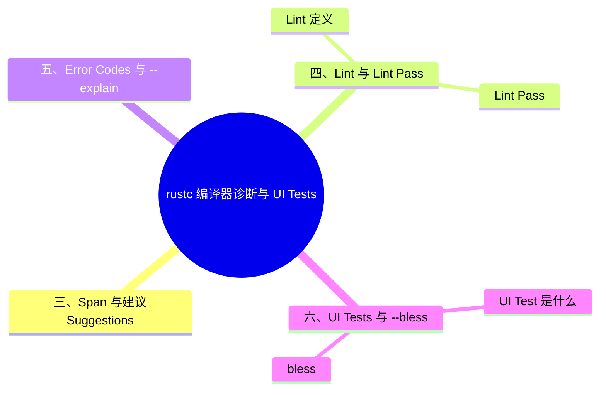

> **内容分级**: [综述级]
> **本节关键术语**: Diagnostic · `Diag` · Span · Error Code · Lint · Lint Pass · UI Test · Compiletest · `--bless` · Applicability — [完整对照表](../../00_meta/01_terminology/01_terminology_glossary.md)
>
# rustc 编译器诊断与 UI Tests

> **EN**: Compiler Diagnostics and UI Tests
> **Summary**: Explains the structure of rustc diagnostics, how lints are defined and emitted, and how UI tests in compiletest verify compiler output.
> **Rust 版本**: 1.97.0+ (Edition 2024)
> **受众**: [专家 / 研究者]
> **Bloom 层级**: L2-L3
> **权威来源**: 本文件为 `concept/` 权威页。
> **A/S/P 标记**: **F** — Formal
> **双维定位**: F×Inf — 编译器基础设施
> **定位**: 把“rustc 的错误信息是怎么构造的、如何测试错误输出”讲清楚，为贡献 rustc 或编写自定义 lint 打下基础。
> **前置概念**: [安全边界](../../05_comparative/03_domain_comparisons/01_safety_boundaries.md)
> **后置概念**: [Rustc Bootstrap](12_rustc_bootstrap.md) · [Compiler Infrastructure](05_compiler_infrastructure.md)

---

> **来源**: [Rustc Dev Guide — Diagnostics](https://rustc-dev-guide.rust-lang.org/overview.html) · [compiletest](https://rustc-dev-guide.rust-lang.org/overview.html) · [TRPL](https://doc.rust-lang.org/book/title-page.html) · [Brown University — Interactive Rust Book](https://rust-book.cs.brown.edu/) · [Jung et al. — RustBelt: Securing the Foundations of Rust](https://plv.mpi-sws.org/rustbelt/popl18/) · [Itanium C++ ABI](https://itanium-cxx-abi.github.io/cxx-abi/abi.html)
> [Rustc Dev Guide — UI tests](https://rustc-dev-guide.rust-lang.org/overview.html) ·
> [Rustc Dev Guide — Compiletest](https://rustc-dev-guide.rust-lang.org/overview.html) ·
> [Rust Reference — Lint Levels](https://doc.rust-lang.org/reference/attributes/diagnostics.html#lint-check-attributes)

---

## 📑 目录

- [rustc 编译器诊断与 UI Tests](#rustc-编译器诊断与-ui-tests)
  - [📑 目录](#-目录)
  - [一、诊断的组成部分](#一诊断的组成部分)
  - [二、`Diag` 与诊断等级](#二diag-与诊断等级)
  - [三、Span 与建议（Suggestions）](#三span-与建议suggestions)
  - [四、Lint 与 Lint Pass](#四lint-与-lint-pass)
    - [Lint 定义](#lint-定义)
    - [Lint Pass](#lint-pass)
  - [五、Error Codes 与 `--explain`](#五error-codes-与---explain)
  - [六、UI Tests 与 `--bless`](#六ui-tests-与---bless)
    - [UI Test 是什么](#ui-test-是什么)
    - [`--bless`](#--bless)
  - [嵌入式测验](#嵌入式测验)
    - [测验 1：一条 rustc 诊断至少包含哪三个核心部分？](#测验-1一条-rustc-诊断至少包含哪三个核心部分)
    - [测验 2：`Applicability::MachineApplicable` 表示什么？](#测验-2applicabilitymachineapplicable-表示什么)
    - [测验 3：Late lint pass 相比 Early lint pass 的主要优势是什么？](#测验-3late-lint-pass-相比-early-lint-pass-的主要优势是什么)
    - [测验 4：`--bless` 在 UI testing 中的作用是什么？](#测验-4--bless-在-ui-testing-中的作用是什么)
  - [权威来源索引](#权威来源索引)
  - [国际权威参考 / International Authority References（P1 学术 · P2 生态）](#国际权威参考--international-authority-referencesp1-学术--p2-生态)
  - [🧭 思维导图（Mindmap）](#-思维导图mindmap)

---

## 一、诊断的组成部分

一条 rustc 诊断通常包含：

```text
error[E0308]: mismatched types
 --> src/main.rs:3:9
  |
3 |     let x: u32 = "hello";
  |                  ^^^^^^^ expected `u32`, found `&str`
  |
  = note: expected type `u32`
             found type `&str`
```

| 部分 | 说明 |
|:---|:---|
| **Level** | `error` / `warning` / `note` / `help` |
| **Error Code** | 如 `E0308`，可通过 `rustc --explain E0308` 查看长说明 |
| **Message** | 问题的主描述 |
| **Span** | 指向源码位置的 `Span`，包含主次 label |
| **Sub-diagnostics** | `note`、`help`、建议等补充信息 |

> [Rustc Dev Guide — Diagnostic structure](https://rustc-dev-guide.rust-lang.org/diagnostics/diagnostic-structs.html)(<https://rustc-dev-guide.rust-lang.org/overview.html>)

---

## 二、`Diag` 与诊断等级

`rustc_errors` crate 提供诊断 API。推荐方式是用 `Diagnostic` trait / derive 宏（Macro）定义结构化诊断：

```rust,ignore
let mut err = sess.dcx().struct_span_err(sp, fluent::my_lint::my_error);
err.span_label(sp, fluent::my_lint::label);
err.emit();
```

诊断等级：

| 等级 | 含义 |
|:---|:---|
| `error` | 编译失败 |
| `warning` | 警告但不阻止编译 |
| `note` | 补充上下文 |
| `help` | 给出修复建议 |

Lint 等级（用户可控）：

| 等级 | 行为 |
|:---|:---|
| `forbid` | 完全禁止，不能覆盖 |
| `deny` | 视为 error |
| `warn` | 视为 warning |
| `allow` | 忽略 |

---

## 三、Span 与建议（Suggestions）

`Span` 表示源码中的位置，用于精确指向问题代码：

```rust,ignore
err.span_suggestion(
    sp,
    fluent::my_lint::try_this,
    "fix".to_string(),
    Applicability::MachineApplicable,
);
```

`Applicability` 表示建议的可靠程度：

| 值 | 含义 |
|:---|:---|
| `MachineApplicable` | 可机械应用 |
| `HasPlaceholders` | 需要用户填写占位符 |
| `MaybeIncorrect` | 可能不正确 |
| `Unspecified` | 不确定 |

> 结构化建议是 `cargo fix` 和 IDE 自动修复的基础。
>
> [Rustc Dev Guide — Suggestions](https://rustc-dev-guide.rust-lang.org/diagnostics/diagnostic-structs.html)(<https://rustc-dev-guide.rust-lang.org/overview.html>)

---

## 四、Lint 与 Lint Pass

Lint 是编译器对“合法但可疑”代码的诊断机制：按严重级分 allow/warn/deny/forbid 四档，按检查阶段分 early lint（AST 级，语法模式）与 late lint（HIR/类型级，语义模式）。Lint Pass 是 lint 的执行单元，注册在编译管线的特定阶段遍历相应 IR。理解 pass 分层的实践意义：early lint 无法做类型相关判断（如 Clippy 的多数 lint 是 late pass），自定义 lint 工具（dylint）也按此分层选择插入点。

### Lint 定义

```rust,ignore
declare_lint! {
    WHILE_TRUE,
    Warn,
    "suggest using `loop { }` instead of `while true { }`"
}
```

### Lint Pass

```rust,ignore
declare_lint_pass!(WhileTrue => [WHILE_TRUE]);

impl EarlyLintPass for WhileTrue {
    fn check_expr(&mut self, cx: &EarlyContext<'_>, e: &ast::Expr) {
        // 检查 while true { ... }
    }
}
```

Lint 运行的时机：

| Pass | 时机 | 信息可用性 |
|:---|:---|:---|
| Pre-expansion | 宏（Macro）展开前 | 最少 |
| Early | AST 后、HIR lowering 前 | 语法级 |
| Late | HIR 后、类型检查等分析后 | 完整类型信息 |
| MIR | MIR 上 | 控制流 |

> [Rustc Dev Guide — Lints](https://rustc-dev-guide.rust-lang.org/overview.html)(<https://rustc-dev-guide.rust-lang.org/overview.html>)

---

## 五、Error Codes 与 `--explain`

每个主要错误都有唯一代码：

```bash
rustc --explain E0308
```

错误代码的长说明存放在 `compiler/rustc_error_codes/src/error_codes/`。新增错误代码需要同步添加说明文档。

---

## 六、UI Tests 与 `--bless`

UI Test 是编译器诊断的回归测试机制：每个用例是一段代码 + 期望的诊断输出快照（`.stderr` 文件），测试比较实际输出与快照是否一致。这保证了错误信息的措辞、span 标注、help 建议不会在重构中意外退化。`--bless` 是快照更新命令——当有意修改诊断输出时运行它批量刷新快照，审查 diff 确认变更符合预期后提交。该机制已被 trybuild crate 移植到普通 crate 的编译错误测试。

### UI Test 是什么

UI test 是 rustc 测试的一种，验证编译器对特定代码产生的诊断输出。测试文件放在 `tests/ui/` 目录：

```rust,compile_fail
// tests/ui/my_feature/error.rs
fn main() {
    let x: u32 = "hello";
    //~^ ERROR mismatched types
}
```

`//~^ ERROR` 等注释标记期望的诊断。

### `--bless`

当诊断输出格式发生变化时，可自动更新期望文件：

```bash
./x test tests/ui/my_feature --bless
```

> **警告**: `--bless` 会覆盖 `.stderr` 文件，应仔细审查变更。
>
> [Rustc Dev Guide — UI tests](https://rustc-dev-guide.rust-lang.org/overview.html)(<https://rustc-dev-guide.rust-lang.org/overview.html>)

---

## 嵌入式测验

理解「嵌入式测验」需要把握测验 1：一条 rustc 诊断至少包含哪三个核心部分？、测验 2：`Applicability::MachineApplica…、测验 3：Late lint pass 相比 Early lint p…与测验 4：`--bless` 在 UI testing 中的作用是什么？，本节依次展开。

### 测验 1：一条 rustc 诊断至少包含哪三个核心部分？

<details>
<summary>✅ 答案与解析</summary>

Level（如 error/warning）、Message（问题描述）、Span（指向源码位置）。

</details>

---

### 测验 2：`Applicability::MachineApplicable` 表示什么？

<details>
<summary>✅ 答案与解析</summary>

表示该建议可以机械地、安全地自动应用到源码中。

</details>

---

### 测验 3：Late lint pass 相比 Early lint pass 的主要优势是什么？

<details>
<summary>✅ 答案与解析</summary>

Late lint pass 在类型检查等分析之后运行，可以使用完整的类型信息。

</details>

---

### 测验 4：`--bless` 在 UI testing 中的作用是什么？

<details>
<summary>✅ 答案与解析</summary>

当编译器输出格式变化时，`--bless` 自动更新 `.stderr` 等期望文件，但应人工审查。

</details>

---

## 权威来源索引

| 来源 | 可信度 | 说明 |
|:---|:---:|:---|
| [Rustc Dev Guide — Errors and lints](https://rustc-dev-guide.rust-lang.org/overview.html) | ✅ 一级 | 诊断官方文档 |
| [Rustc Dev Guide — UI tests](https://rustc-dev-guide.rust-lang.org/overview.html) | ✅ 一级 | UI 测试官方文档 |
| [Rustc Dev Guide — Compiletest](https://rustc-dev-guide.rust-lang.org/overview.html) | ✅ 一级 | compiletest 官方文档 |
| [Rust Reference — Lint Levels](https://doc.rust-lang.org/reference/attributes/diagnostics.html#lint-check-attributes) | ✅ 一级 | lint 等级语言规则 |

---

> **权威来源**: [Rustc Dev Guide](https://rustc-dev-guide.rust-lang.org/), [The Rust Reference](https://doc.rust-lang.org/reference/introduction.html)
> **权威来源对齐变更日志**: 2026-06-21 创建，对齐 Rust 1.97.0 / rustc 诊断与 UI tests

**文档版本**: 1.0
**最后更新**: 2026-06-21
**状态**: ✅ 已对齐 Rustc Dev Guide diagnostics / UI tests 文档

---

## 国际权威参考 / International Authority References（P1 学术 · P2 生态）

> 依据 `AGENTS.md` §2「对齐网络国际化权威内容」补充：仅追加已验证可达的权威链接，不改动正文事实。

- **P2 生态/社区**: [formal-land/coq-of-rust](https://github.com/formal-land/coq-of-rust) · [AeneasVerif/aeneas](https://github.com/AeneasVerif/aeneas)

## 🧭 思维导图（Mindmap）


