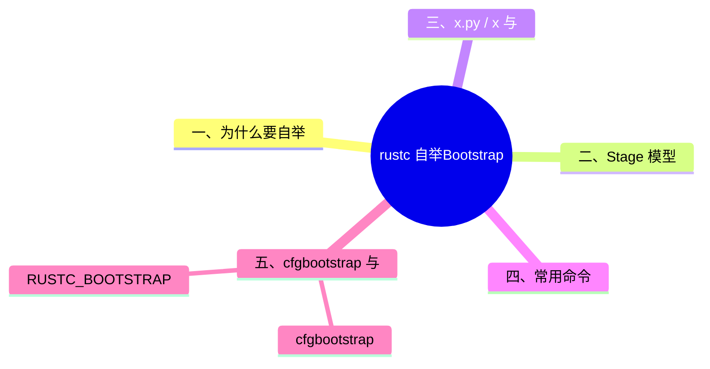

> **内容分级**: [综述级]
> **本节关键术语**: Bootstrap · `x.py` · `x` · Stage0 · Stage1 · Stage2 · `bootstrap.toml` · `cfg(bootstrap)` · `RUSTC_BOOTSTRAP` — [完整对照表](../../00_meta/01_terminology/01_terminology_glossary.md)
>
# rustc 自举（Bootstrap）

> **EN**: Bootstrapping the Rust Compiler
> **Summary**: Explains how rustc builds itself in stages using `x.py`/`x`, the role of stage0/stage1/stage2, `cfg(bootstrap)`, and the bootstrap tool modes.
> **Rust 版本**: 1.97.0+ (Edition 2024)
> **受众**: [专家]
> **Bloom 层级**: L2-L4
> **权威来源**: 本文件为 `concept/` 权威页。
> **A/S/P 标记**: **F** — Formal
> **双维定位**: F×Inf — 编译器基础设施
> **定位**: 把“Rust 编译器如何用 Rust 写、又用 Rust 编译自己”这一自举过程讲清楚，帮助理解 rustc 开发工作流。
> **前置概念**: [安全边界](../../05_comparative/03_domain_comparisons/01_safety_boundaries.md)
> **后置概念**: [Compiler Testing](13_compiler_testing.md)（待补）
> **来源**: [Rustc Dev Guide — Bootstrapping](https://rustc-dev-guide.rust-lang.org/overview.html) · [TRPL](https://doc.rust-lang.org/book/title-page.html) · [Brown University — Interactive Rust Book](https://rust-book.cs.brown.edu/) · [Jung et al. — RustBelt: Securing the Foundations of Rust](https://plv.mpi-sws.org/rustbelt/popl18/) · [Itanium C++ ABI](https://itanium-cxx-abi.github.io/cxx-abi/abi.html)

---

> **来源**: [Rustc Dev Guide — How to build and run the compiler](https://rustc-dev-guide.rust-lang.org/overview.html) ·
> [Rustc Dev Guide — What Bootstrapping does](https://rustc-dev-guide.rust-lang.org/overview.html) ·
> [Rustc Dev Guide — cfg(bootstrap) in dependencies](https://rustc-dev-guide.rust-lang.org/overview.html) ·
> [Rustc Dev Guide — Writing tools in Bootstrap](https://rustc-dev-guide.rust-lang.org/overview.html)

---

## 📑 目录

- [rustc 自举（Bootstrap）](#rustc-自举bootstrap)
  - [📑 目录](#-目录)
  - [一、为什么要自举](#一为什么要自举)
  - [二、Stage 模型](#二stage-模型)
  - [三、`x.py` / `x` 与 `bootstrap.toml`](#三xpy--x-与-bootstraptoml)
  - [四、常用命令](#四常用命令)
  - [五、`cfg(bootstrap)` 与 `RUSTC_BOOTSTRAP`](#五cfgbootstrap-与-rustc_bootstrap)
    - [`cfg(bootstrap)`](#cfgbootstrap)
    - [`RUSTC_BOOTSTRAP`](#rustc_bootstrap)
  - [六、Bootstrap 中的工具类型](#六bootstrap-中的工具类型)
  - [嵌入式测验](#嵌入式测验)
    - [测验 1：日常 rustc 开发通常需要构建到哪个 stage？](#测验-1日常-rustc-开发通常需要构建到哪个-stage)
    - [测验 2：Stage 2 编译器与 Stage 1 编译器的主要区别是什么？](#测验-2stage-2-编译器与-stage-1-编译器的主要区别是什么)
    - [测验 3：`cfg(bootstrap)` 的典型用途是什么？](#测验-3cfgbootstrap-的典型用途是什么)
    - [测验 4：为什么普通项目不应该设置 `RUSTC_BOOTSTRAP=1`？](#测验-4为什么普通项目不应该设置-rustc_bootstrap1)
  - [权威来源索引](#权威来源索引)
  - [国际权威参考 / International Authority References（P1 学术 · P2 生态）](#国际权威参考--international-authority-referencesp1-学术--p2-生态)
  - [🧭 思维导图（Mindmap）](#-思维导图mindmap)
  - [⚠️ 反例与陷阱](#️-反例与陷阱)
    - [反例：引用未声明的模块/crate（rustc 1.97.0，--edition 2024 实测）](#反例引用未声明的模块craterustc-1970--edition-2024-实测)
    - [✅ 修正：声明对应模块；外部 crate 需先加入依赖](#-修正声明对应模块外部-crate-需先加入依赖)

---

## 一、为什么要自举

`rustc` 本身是用 Rust 编写的。要编译它，需要另一个 Rust 编译器——这就是**自举（bootstrapping）**：

- 用已有的旧编译器（stage0）编译源码，生成新编译器；
- 再用新编译器编译自己，验证一致性（Coherence）和正确性；
- 最终发布 stage2 编译器。

> **关键洞察**: 自举让 Rust 编译器“吃自己的狗粮”，同时也确保编译器能稳定地构建自身。
>
> [Rustc Dev Guide — Bootstrapping](https://rustc-dev-guide.rust-lang.org/overview.html)(<https://rustc-dev-guide.rust-lang.org/overview.html>)

---

## 二、Stage 模型

```text
Stage 0: 下载的 beta 编译器 + 标准库（预编译）
    ↓
Stage 0 artifacts: 用 stage0 编译当前 rustc 源码
    ↓
Stage 1 compiler: 复制 stage0 artifacts 得到
    ↓
Stage 1 std: 用 stage1 编译器编译源码中的标准库
    ↓
Stage 1 artifacts: 用 stage1 编译器再次编译 rustc
    ↓
Stage 2 compiler: 复制 stage1 artifacts 得到（发布版）
    ↓
Stage 3: 可选，验证 stage2 输出与 stage1 一致
```

| Stage | 说明 | 用途 |
|:---|:---|:---|
| **Stage 0** | 从 rustup 下载的 beta 编译器 | 启动自举 |
| **Stage 1** | 用 stage0 编译当前源码得到的编译器 | 日常开发 |
| **Stage 2** | 用 stage1 编译当前源码得到的编译器 | 正式发布 |
| **Stage 3** | 用 stage2 再编译一次 | 一致性（Coherence）验证 |

> **定理**: 日常开发通常只需 `./x build library`（得到 stage1），完整发布才需要 stage2。
>
> [Rustc Dev Guide — What Bootstrapping does](https://rustc-dev-guide.rust-lang.org/overview.html)(<https://rustc-dev-guide.rust-lang.org/overview.html>)

---

## 三、`x.py` / `x` 与 `bootstrap.toml`

Rust 仓库使用 `x.py`（或别名 `x`）作为构建入口：

```bash
# 创建配置文件
cp config.example.toml bootstrap.toml

# 构建 stage1 标准库和编译器
./x build library

# 运行 UI 测试
./x test tests/ui
```

`bootstrap.toml` 常用配置：

```toml
[llvm]
download-ci-llvm = true

[rust]
# 启用 debug 断言，开发时常开
debug-assertions = true
```

---

## 四、常用命令

| 命令 | 作用 |
|:---|:---|
| `./x check` | 快速类型检查，不生成二进制 |
| `./x build library` | 构建 stage1 编译器 + 标准库 |
| `./x build --stage 2 rustc` | 构建 stage2 编译器 |
| `./x test tests/ui` | 运行 UI 测试 |
| `./x test tidy` | 运行格式与整洁检查 |
| `./x clean` | 清理构建目录 |

---

## 五、`cfg(bootstrap)` 与 `RUSTC_BOOTSTRAP`

rustc 自举（bootstrap）需要区分“正在构建的编译器”与“用于构建的编译器”：`cfg(bootstrap)` 标记仅在使用上一阶段编译器构建时生效的代码路径，用于处理自举期间的特性缺口（新特性尚不可用于构建自身）。`RUSTC_BOOTSTRAP=1` 环境变量则解锁 stable 工具链上的 nightly 特性——它是生态工具（如某些 proc macro）的灰色地带，使构建依赖不稳定内部行为，rustup 升级即可能破坏，生产项目应避免。

### `cfg(bootstrap)`

Stage0 使用较旧的 beta 编译器，可能不支持某些新特性。`cfg(bootstrap)` 用于区分 stage0 与 stage1+ 构建：

```rust,ignore
#[cfg(bootstrap)]
fn old_impl() { ... }

#[cfg(not(bootstrap))]
fn new_impl() { ... }
```

### `RUSTC_BOOTSTRAP`

环境变量 `RUSTC_BOOTSTRAP=1` 允许在非 nightly 编译器上使用 `#![feature(...)]`：

> **警告**: `RUSTC_BOOTSTRAP=1` 只在自举 rustc 时使用，**永远不要**在普通项目中使用，因为它会破坏稳定性保证。
>
> [Rustc Dev Guide — What Bootstrapping does](https://rustc-dev-guide.rust-lang.org/overview.html)(<https://rustc-dev-guide.rust-lang.org/overview.html>)

---

## 六、Bootstrap 中的工具类型

Bootstrap 支持三种工具构建模式：

| 模式 | 说明 |
|:---|:---|
| `ToolBootstrap` | 仅用 stage0 编译器，不需要本地 rustc 产物 |
| `ToolStd` | 依赖本地构建的 std，如 `compiletest` |
| `ToolRustcPrivate` | 使用 `rustc_private`，依赖本地 rustc 产物，如 Clippy |

> [Rustc Dev Guide — Writing tools in Bootstrap](https://rustc-dev-guide.rust-lang.org/overview.html)(<https://rustc-dev-guide.rust-lang.org/overview.html>)

---

## 嵌入式测验

本节将「嵌入式测验」分解为若干主题：测验 1：日常 rustc 开发通常需要构建到哪个 stage？、测验 2：Stage 2 编译器与 Stage 1 编译器的主要区别是…、测验 3：`cfg(bootstrap)` 的典型用途是什么？与测验 4：为什么普通项目不应该设置 `RUSTC_BOOTSTRAP=…。

### 测验 1：日常 rustc 开发通常需要构建到哪个 stage？

<details>
<summary>✅ 答案与解析</summary>

Stage 1。`./x build library` 即可得到可用的 stage1 编译器 + 标准库。

</details>

---

### 测验 2：Stage 2 编译器与 Stage 1 编译器的主要区别是什么？

<details>
<summary>✅ 答案与解析</summary>

Stage 1 是用 stage0（旧 beta）编译当前源码得到的；Stage 2 是用 stage1 编译当前源码得到的，使用本地构建的 std，是发布给用户使用的版本。

</details>

---

### 测验 3：`cfg(bootstrap)` 的典型用途是什么？

<details>
<summary>✅ 答案与解析</summary>

当某个新特性尚未进入 stage0 的 beta 编译器时，用 `cfg(bootstrap)` 提供兼容实现，stage1+ 使用新实现。

</details>

---

### 测验 4：为什么普通项目不应该设置 `RUSTC_BOOTSTRAP=1`？

<details>
<summary>✅ 答案与解析</summary>

`RUSTC_BOOTSTRAP=1` 会绕过 Rust 的稳定性保证，允许在非 nightly 编译器上使用 unstable feature，导致代码无法在未来稳定版上编译。

</details>

---

## 权威来源索引

| 来源 | 可信度 | 说明 |
|:---|:---:|:---|
| [Rustc Dev Guide — How to build and run the compiler](https://rustc-dev-guide.rust-lang.org/overview.html) | ✅ 一级 | 构建 rustc 官方文档 |
| [Rustc Dev Guide — What Bootstrapping does](https://rustc-dev-guide.rust-lang.org/overview.html) | ✅ 一级 | 自举 stage 官方文档 |
| [Rustc Dev Guide — cfg(bootstrap) in dependencies](https://rustc-dev-guide.rust-lang.org/overview.html) | ✅ 一级 | `cfg(bootstrap)` 官方文档 |
| [Rustc Dev Guide — Writing tools in Bootstrap](https://rustc-dev-guide.rust-lang.org/overview.html) | ✅ 一级 | Bootstrap 工具类型 |

---

> **权威来源**: [Rustc Dev Guide](https://rustc-dev-guide.rust-lang.org/)
> **权威来源对齐变更日志**: 2026-06-21 创建，对齐 Rust 1.97.0 / rustc bootstrap 文档

**文档版本**: 1.0
**最后更新**: 2026-06-21
**状态**: ✅ 已对齐 Rustc Dev Guide bootstrapping 文档

---

## 国际权威参考 / International Authority References（P1 学术 · P2 生态）

> 依据 `AGENTS.md` §2「对齐网络国际化权威内容」补充：仅追加已验证可达的权威链接，不改动正文事实。

- **P2 生态/社区**: [formal-land/coq-of-rust](https://github.com/formal-land/coq-of-rust) · [AeneasVerif/aeneas](https://github.com/AeneasVerif/aeneas)

## 🧭 思维导图（Mindmap）



## ⚠️ 反例与陷阱

自举（bootstrap）构建中，stage 之间最容易出现“引用了尚未构建的 crate”这类解析失败，等价的 rustc 诊断如下。

### 反例：引用未声明的模块/crate（rustc 1.97.0，--edition 2024 实测）

```rust,compile_fail,E0433
fn main() {
    let _ = foo_crate::bar(); // ❌ 未声明的依赖/模块
}
```

**实测错误**：`error[E0433]: cannot find module or crate`foo_crate`in this scope`。

### ✅ 修正：声明对应模块；外部 crate 需先加入依赖

```rust
mod foo_crate { // ✅ 声明模块（外部 crate 则需在 Cargo.toml 添加依赖）
    pub fn bar() -> i32 { 1 }
}

fn main() {
    let _ = foo_crate::bar();
}
```
