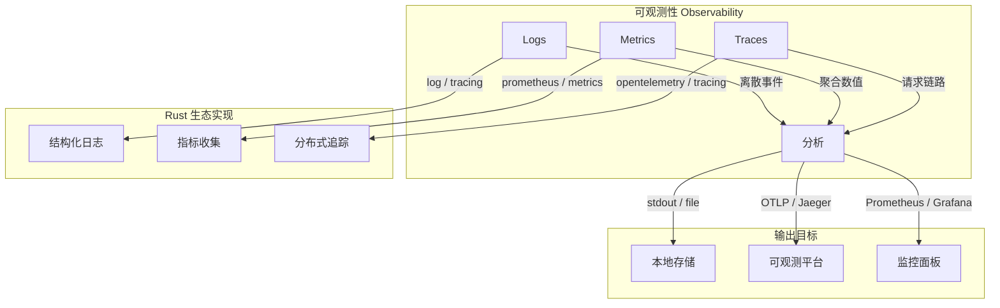
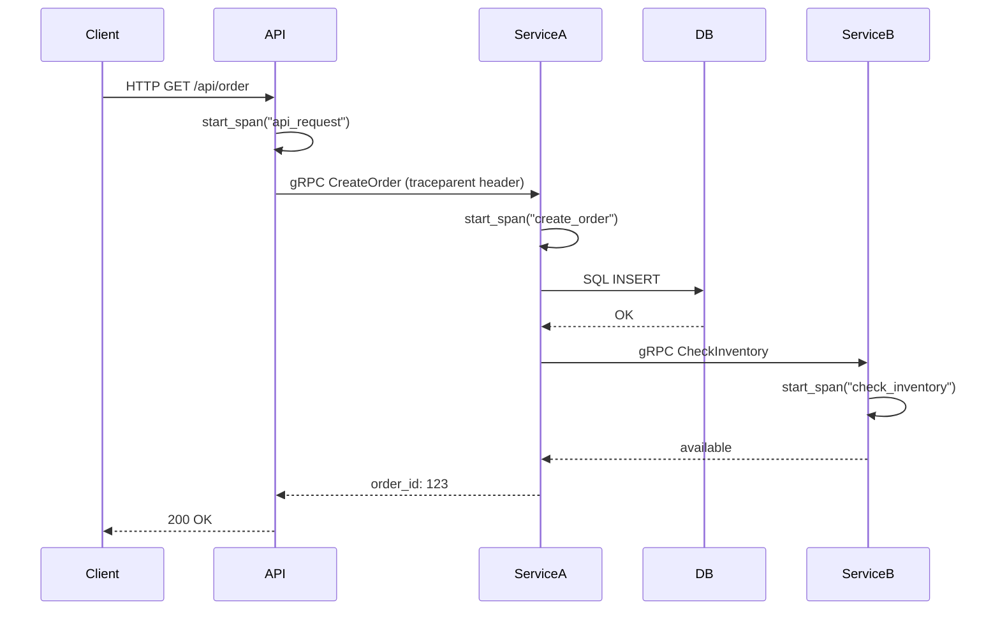
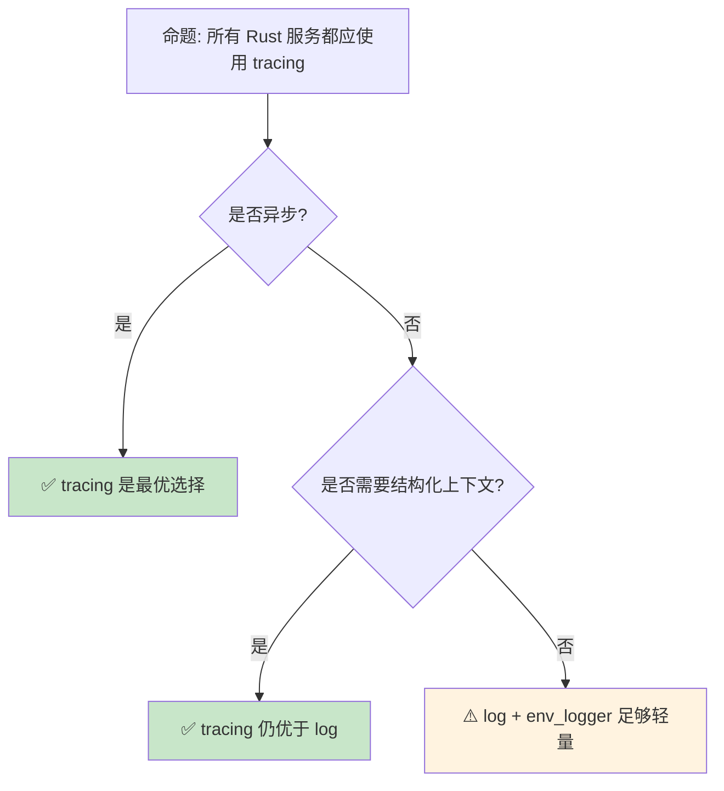

> **代码状态**: ✅ 含可编译示例

# 日志与可观测性：Rust 服务端监控生态
>
> **EN**: Logging Observability
> **Summary**: Logging Observability: Rust ecosystem tools, crates, and engineering practices.
> **Rust 版本**: 1.97.0+ (Edition 2024)
> **受众**: [进阶]
> **内容分级**: [综述级]
> **Bloom 层级**: L2-L4
> **权威来源**: 本文件为 `concept/` 权威页。
> **A/S/P 标记**: **A+P** — ApplicationProcedure
> **双维定位**: P×App — 实施可观测性工程实践
> **定位**: 覆盖 Rust 生态中 **日志（log/tracing [来源: [tokio tracing](https://docs.rs/tracing/latest/tracing/trait.Instrument.html)]）**、**指标（metrics）**、**分布式追踪（distributed tracing）**三大可观测性支柱，分析各 crate 的设计哲学与选型策略。
> **前置概念**: [Async](../../03_advanced/01_async/02_async.md) · [Error Handling](../../02_intermediate/03_error_handling/04_error_handling.md)
> **后置概念**: [WebAssembly](../11_domain_applications/11_webassembly.md) · [Rust Version Tracking](../../07_future/00_version_tracking/05_rust_version_tracking.md)
> **定理链**: N/A — 描述性/综述性/导航性文档，不涉及形式化定理链
>
> **来源**: [log crate](https://docs.rs/log/) · [tracing](https://docs.rs/tracing/) · [std::fmt](https://doc.rust-lang.org/std/fmt/) · [Brown University — Interactive Rust Book](https://rust-book.cs.brown.edu/) · [Jung et al. — RustBelt: Securing the Foundations of Rust](https://plv.mpi-sws.org/rustbelt/popl18/) · [Itanium C++ ABI](https://itanium-cxx-abi.github.io/cxx-abi/abi.html)
---

> **来源**: [tracing Documentation](https://docs.rs/tracing/latest/tracing/trait.Instrument.html) ·
> [log crate](https://docs.rs/log/latest/log/) ·
> [OpenTelemetry [来源: [opentelemetry.io](https://opentelemetry.io/)] Rust](<https://github.com/open-telemetry/opentelemetry-rust>) ·
> [tokio/tracing](https://github.com/tokio-rs/tracing) ·
> [Prometheus Rust Client](https://github.com/prometheus/client_rust)
> **前置依赖**: [Rust vs C++](../../05_comparative/01_systems_languages/01_rust_vs_cpp.md)

## 📑 目录

- [日志与可观测性：Rust 服务端监控生态](#日志与可观测性rust-服务端监控生态)
  - [📑 目录](#-目录)
  - [一、核心概念](#一核心概念)
    - [1.1 可观测性三支柱](#11-可观测性三支柱)
    - [1.2 Rust 日志生态演进](#12-rust-日志生态演进)
    - [1.3 tracing：结构化日志与 Span](#13-tracing结构化日志与-span)
  - [二、技术细节](#二技术细节)
    - [2.1 日志级别与过滤](#21-日志级别与过滤)
    - [2.2 Metrics：计数器、仪表盘、直方图](#22-metrics计数器仪表盘直方图)
    - [2.3 分布式追踪与 OpenTelemetry](#23-分布式追踪与-opentelemetry)
  - [三、选型决策矩阵](#三选型决策矩阵)
  - [四、反命题与边界分析](#四反命题与边界分析)
    - [4.1 反命题树](#41-反命题树)
    - [4.2 边界极限](#42-边界极限)
  - [五、常见陷阱](#五常见陷阱)
  - [六、来源与延伸阅读](#六来源与延伸阅读)
  - [相关概念](#相关概念)
  - [权威来源索引](#权威来源索引)
  - [十、边界测试：日志与可观测性的编译错误](#十边界测试日志与可观测性的编译错误)
    - [10.1 边界测试：`tracing` span 的生命周期（编译错误）](#101-边界测试tracing-span-的生命周期编译错误)
    - [10.2 边界测试：OpenTelemetry 的全局提供者设置（运行时 panic）](#102-边界测试opentelemetry-的全局提供者设置运行时-panic)
    - [10.3 边界测试：结构化日志的字段类型不匹配（运行时错误）](#103-边界测试结构化日志的字段类型不匹配运行时错误)
    - [10.4 边界测试：span 的生命周期与异步代码（编译错误/运行时丢失）](#104-边界测试span-的生命周期与异步代码编译错误运行时丢失)
    - [10.5 边界测试：`tracing` 的 span 泄漏与内存增长（运行时资源泄漏）](#105-边界测试tracing-的-span-泄漏与内存增长运行时资源泄漏)
    - [10.3 边界测试：tracing 的 span 生命周期与异步代码跨越 await（运行时泄漏）](#103-边界测试tracing-的-span-生命周期与异步代码跨越-await运行时泄漏)
    - [补充定理链](#补充定理链)
  - [嵌入式测验（Embedded Quiz）](#嵌入式测验embedded-quiz)
    - [测验 1：`tracing` crate 相比传统 `log` crate 的主要优势是什么？（理解层）](#测验-1tracing-crate-相比传统-log-crate-的主要优势是什么理解层)
    - [测验 2：OpenTelemetry 在 Rust 可观测性生态中扮演什么角色？（理解层）](#测验-2opentelemetry-在-rust-可观测性生态中扮演什么角色理解层)
    - [测验 3：为什么在高性能 Rust 服务端，结构化日志（Structured Logging）比纯文本日志更受推荐？（理解层）](#测验-3为什么在高性能-rust-服务端结构化日志structured-logging比纯文本日志更受推荐理解层)
    - [测验 4：`RUST_LOG` 环境变量如何控制日志级别？（理解层）](#测验-4rust_log-环境变量如何控制日志级别理解层)
    - [测验 5：在异步 Rust 程序中，为什么 `tracing` 的 `span` 比手动记录日志更适合跟踪请求生命周期？（理解层）](#测验-5在异步-rust-程序中为什么-tracing-的-span-比手动记录日志更适合跟踪请求生命周期理解层)
  - [认知路径](#认知路径)
    - [核心推理链](#核心推理链)
    - [反命题与边界](#反命题与边界)
  - [补充视角：设计模式中的可观测性](#补充视角设计模式中的可观测性)
  - [补充视角：WebAssembly 可观测性实践](#补充视角webassembly-可观测性实践)

---

## 一、核心概念
>
>

### 1.1 可观测性三支柱
>



> **认知功能**: 此图展示可观测性三支柱在 Rust 生态中的**实现映射**。logs 记录离散事件，metrics 聚合数值趋势，traces 追踪请求全链路——三者互补，缺一不可。
> [来源: [Rust Reference](https://doc.rust-lang.org/reference/introduction.html)]
> **使用建议**: 生产环境应同时部署三种可观测性手段，覆盖不同时间粒度和分析维度。
> **关键洞察**: Rust 的**零成本抽象（Zero-Cost Abstraction）**哲学同样适用于可观测性——tracing 的 Span 在 release 模式下可通过编译期开关完全消除开销。
> [来源: [Google SRE Book — Monitoring](https://sre.google/sre-book/monitoring-distributed-systems/)] · [来源: [OpenTelemetry Specification](https://opentelemetry.io/docs/specs/otel/)]

**可编译示例** — 标准库日志输出：

```rust
use std::time::Instant;

fn main() {
    let start = Instant::now();

    // 结构化日志：使用 eprintln! 输出到 stderr
    eprintln!("[INFO] 服务启动: pid={}", std::process::id());

    let result = compute(42);

    // 指标化输出：时长 + 结果
    let elapsed = start.elapsed();
    eprintln!("[METRIC] compute_duration_ms={:.2} result={}",
              elapsed.as_secs_f64() * 1000.0, result);
}

fn compute(n: i32) -> i32 {
    n * n
}
```

---

### 1.2 Rust 日志生态演进
>

```text
Rust 日志生态演进时间线:

  2014-2015: log crate 诞生
  ├── 提供 facade 模式（类似 SLF4J）
  ├── 定义 Log trait，具体实现由后端 crate 提供
  └── 问题: 仅有文本日志，无结构化、无上下文

  2017-2019: env_logger / pretty_env_logger
  ├── 基于 log facade 的实现
  ├── 支持 RUST_LOG 环境变量过滤
  └── 问题: 仍是无结构文本，难以机器解析

  2019-2020: tracing 崛起
  ├── tokio 团队开发，专为异步设计
  ├── 引入 Span: 带上下文的结构化日志
  ├── 支持 async/await 的自动上下文传播
  └── 成为 Rust 异步生态的事实标准

  2020+: OpenTelemetry 集成
  ├── 统一 Logs/Metrics/Traces 的导出格式
  ├── OTLP (OpenTelemetry Protocol) 成为跨语言标准
  └── Rust opentelemetry crate 逐步成熟
```

> **演进洞察**: Rust 日志生态从**简单文本**（log）→ **结构化上下文**（tracing）→ **跨语言标准化**（OpenTelemetry）演进，反映了 Rust 从系统编程语言向服务端全栈语言的扩展。
> [来源: [tokio/tracing README](https://github.com/tokio-rs/tracing)]

---

### 1.3 tracing：结构化日志与 Span
>

```rust,ignore
use tracing::{info, span, Level, Instrument};

// 基本日志
info!(user_id = 42, action = "login", "用户登录成功");

// Span: 带上下文的结构化作用域
let span = span!(Level::INFO, "process_request", request_id = %uuid);
let _enter = span.enter();

// 在 Span 内部的所有日志自动携带 request_id
info!(duration_ms = 150, "请求处理完成");

// async 中的 Span 传播
async fn handle_request(req: Request) {
    let span = span!(Level::INFO, "handle_request", path = %req.path);

    do_something().instrument(span).await;
    // do_something 内部的所有日志自动携带 path 上下文
}
```

> **Span 设计**: tracing 的核心创新是 **Span**——不是记录离散日志行，而是记录**带有上下文的结构化事件**。Span 自动在异步边界传播上下文，解决了 async/await 中日志上下文丢失的问题。
> [来源: [tracing Documentation](https://docs.rs/tracing/latest/tracing/trait.Instrument.html)]

---

## 二、技术细节

「技术细节」涉及日志级别与过滤、Metrics：计数器、仪表盘、直方图与分布式追踪与 OpenTelemetry，本节逐一说明其要点。

### 2.1 日志级别与过滤
>

```text
tracing 日志级别层次:

  ERROR > WARN > INFO > DEBUG > TRACE
  └── 生产环境通常开启到 INFO
  └── 调试环境可开启到 DEBUG 或 TRACE

  过滤机制:
  ├── 编译时: tracing::Level 静态过滤（无运行时开销）
  ├── 运行时: tracing-subscriber 的 EnvFilter
  │   └── RUST_LOG=info,my_crate=debug,tokio=warn
  └── 动态: 通过 tracing-subscriber 的 reload layer 热更新过滤规则

  性能考量:
  ├── 未启用的日志级别: 编译期消除（零成本）
  ├── span 创建: 即使未启用也分配少量内存
  └── 建议: 高频路径避免创建短生命周期 span
```

> **性能**: tracing 的**编译期过滤**是真正的零成本——未启用的日志在编译时被完全消除，不生成任何机器码。这比运行期检查（如 C++ 的 if (level >= DEBUG)）更高效。
> [来源: [tracing Performance Guide](https://docs.rs/tracing/latest/tracing/trait.Instrument.html)]

---

### 2.2 Metrics：计数器、仪表盘、直方图
>

```rust,ignore
use metrics::{counter, gauge, histogram};

// 计数器（单调递增）
counter!("http_requests_total", "method" => "GET", "status" => "200");

// 仪表盘（瞬时值）
gauge!("active_connections", 42.0);

// 直方图（分布统计）
histogram!("request_duration_ms", 150.0);

// metrics crate 的优势:
// - facade 模式，与具体导出后端解耦
// - 支持 labels/tags 多维度切片
// - 与 prometheus、statsd、opentelemetry 等后端集成
```

> **metrics crate**: `metrics` crate 提供类似 `log` 的 facade 模式，使应用代码与具体监控后端解耦。支持 Prometheus、StatsD、OpenTelemetry 等多种导出器。
> [来源: [metrics crate Documentation](https://docs.rs/metrics/latest/metrics/)]

---

### 2.3 分布式追踪与 OpenTelemetry
>



> **认知功能**: 此序列图展示**分布式追踪**在微服务架构中的工作原理——trace ID 和 span context 通过 HTTP/gRPC header 传播，串联起跨服务的请求链路。
> **使用建议**: 在异步（Async） Rust 服务中使用 `tracing-opentelemetry` 自动集成 OpenTelemetry，无需手动管理 trace context。
> **关键洞察**: Rust 的异步模型（Future + Pin）与分布式追踪天然契合——tracing Span 的生命周期（Lifetimes）与 Future 的 poll 周期对齐，实现**零侵入**的上下文传播。
> [来源: [OpenTelemetry Context Propagation](https://opentelemetry.io/docs/specs/otel/context/api-propagators/)]

---

## 三、选型决策矩阵

```text
场景 → 推荐方案 → 关键 crate

单线程 CLI 工具:
  → log + env_logger
  → 简单、轻量、无需异步支持

多线程同步服务:
  → log + flexi_logger（支持文件轮转）
  → 或 tracing（如果未来可能迁移到 async）

异步服务 (Tokio/Actix):
  → tracing + tracing-subscriber
  → Span 自动传播、异步安全

微服务 + 监控面板:
  → tracing + tracing-opentelemetry + prometheus
  → 统一 Logs/Metrics/Traces 出口

WebAssembly:
  → log + console_error_panic_hook
  → wasm 环境下 tracing 支持有限

嵌入式/资源受限:
  → defmt（如果硬件支持 probe-run）
  → 或 log 自定义简单后端
```

> **选型原则**: 异步服务首选 tracing，同步服务 log 足够，微服务全栈用 OpenTelemetry 统一出口。
> [来源: [Rust Logging Comparison](https://docs.rs/tracing/latest/tracing/trait.Instrument.html)] · [来源: [Tokio Docs](https://tokio.rs/)]

---

## 四、反命题与边界分析

本节围绕「反命题与边界分析」展开，覆盖反命题树 与 边界极限 两个方面。

### 4.1 反命题树
>



> **认知功能**: 此决策树帮助判断在特定场景下是否应使用 tracing 替代传统 log。
> **使用建议**: 异步服务几乎总是应使用 tracing；同步服务如果对结构化日志有需求也应迁移。
> **关键洞察**: tracing 的**额外成本**仅在 span 创建时体现，且可通过编译期过滤完全消除。在大多数场景下，tracing 是 log 的超集。
> [来源: [tokio/tracing Design](https://tokio.rs/blog/2019-08-tracing)]

---

### 4.2 边界极限
>

```text
边界 1: tracing 在 WebAssembly 中的限制
├── wasm32-unknown-unknown 目标下，标准输出不可用
├── 需要自定义 Subscriber 将日志发送到 JS console
├── tracing-wasm crate 提供此类适配
└── 限制: Span 上下文在 JS/Rust 边界可能丢失

边界 2: 高频日志的性能影响
├── 即使编译期过滤消除了未启用日志的开销
├── 启用的日志仍涉及格式化、输出 I/O
├── 高频路径（如每 packet 日志）应避免分配型日志
└── 解决方案: 采样（sampling）、批量化输出

边界 3: 多线程中的 Span 传播
├── tracing 的 Span 是线程局部的（thread-local）
├── 跨线程需手动传递 Span 或使用 tokio::spawn 的 instrument
├── rayon / 自定义线程池需要显式 context 传递
└── 这是 Rust 缺乏 TLS（Thread-Local Storage）自动传播的结果

边界 4: Metrics 与 tracing 的整合
├── metrics crate 和 tracing 是独立生态系统
├── OpenTelemetry 试图统一两者，但 Rust 实现仍在成熟中
├── tracing-opentelemetry 可将 span 导出为 trace
└── metrics-opentelemetry 可将指标导出为 metrics——两者需分别配置
```

> **边界要点**: tracing 的边界主要与**平台限制**（WASM）、**性能**（高频路径）和**生态整合**（metrics/tracing 分离）相关。这些问题在 Rust 生态中正在逐步解决。
> [来源: [OpenTelemetry Rust Roadmap](https://github.com/open-telemetry/opentelemetry-rust)]

---

## 五、常见陷阱
>

```text
陷阱 1: 在 async fn 中忘记 .instrument()
  ❌ async fn process() {
       let span = info_span!("process");
       let _ = span.enter();  // ⚠️ enter() 不跨 await 点！
       do_work().await;       // Span 在 await 后丢失
     }

  ✅ async fn process() {
       let span = info_span!("process");
       do_work().instrument(span).await;  // ✅ 正确传播
     }

陷阱 2: 过度使用 Span
  ❌ 为每个循环迭代创建 Span
     for item in items {
       let span = info_span!("process_item", item_id = item.id);
       // 高频创建/销毁 Span 带来分配开销
     }

  ✅ 在循环外部创建 Span，或使用 tracing::Span::none() 标记
     let span = info_span!("batch_process", count = items.len());
     let _ = span.enter();

陷阱 3: 日志中暴露敏感信息
  ❌ info!(password = %user.password, "用户登录");

  ✅ 使用 #[derive(Value)] 的自定义过滤
  ✅ 或通过 tracing-subscriber 的 filter 层移除敏感字段

陷阱 4: 混合使用 log 和 tracing
  ❌ 部分代码用 log::info!，部分用 tracing::info!
  └── 导致日志格式不一致，难以统一收集

  ✅ 统一使用 tracing，通过 tracing-log 适配遗留 log crate
```

> **陷阱总结**: tracing 的主要陷阱与**异步边界**（Span 丢失）、**性能**（过度分配）和**安全**（敏感信息泄露）相关。遵循最佳实践可避免绝大多数问题。
> [来源: [tracing Instrument Guide](https://docs.rs/tracing/latest/tracing/trait.Instrument.html)]

---

## 六、来源与延伸阅读

| 来源 | 可信度 | 说明 |
| [Rust Standard Library](https://doc.rust-lang.org/std/index.html) | ✅ 一级 | 标准库参考 |
| [Rust By Example](https://doc.rust-lang.org/rust-by-example/index.html) | ✅ 一级 | 交互式教程 |
| [This Week in Rust](https://this-week-in-rust.org/) | ✅ 二级 | 社区动态 |

| [Rust Reference](https://doc.rust-lang.org/reference/introduction.html) | ✅ 一级 | 语言参考 |
|:---|:---:|:---|
| [tracing Documentation](https://docs.rs/tracing/latest/tracing/trait.Instrument.html) | ✅ 一级 | 官方文档 |
| [log crate](https://docs.rs/log/latest/log/) | ✅ 一级 | Rust 日志 facade |
| [OpenTelemetry Rust](https://github.com/open-telemetry/opentelemetry-rust) | ✅ 一级 | 跨语言可观测性标准 |
| [tokio.rs Blog — tracing](https://tokio.rs/blog/2019-08-tracing) | ✅ 二级 | 设计动机与架构 |
| [Prometheus Rust Client](https://github.com/prometheus/client_rust) | ✅ 一级 | Prometheus 指标库 |
| [metrics crate](https://docs.rs/metrics/latest/metrics/) | ✅ 一级 | 指标 facade |
| [AWS Docs — Observability](https://aws.amazon.com/) | ✅ 二级 | 云原生可观测性实践 |

---

## 相关概念

- [Async](../../03_advanced/01_async/02_async.md) — 异步编程（tracing 的核心用例）
- [Error Handling](../../02_intermediate/03_error_handling/04_error_handling.md) — 错误处理（Error Handling）（与日志紧密关联）
- [WebAssembly](../11_domain_applications/11_webassembly.md) — WebAssembly 生态（tracing 的 WASM 限制）

---

> **权威来源**: [Rust Reference](https://doc.rust-lang.org/reference/introduction.html), [The Rust Programming Language](https://doc.rust-lang.org/book/title-page.html)
>
> **权威来源对齐变更日志**: 2026-05-22 创建 [Authority Source Sprint Batch 9](../../00_meta/02_sources/international_authority_index.md)

**文档版本**: 1.0
**最后更新**: 2026-05-22
**状态**: ✅ 概念文件创建完成

---

## 权威来源索引

>
>
>
>
>

---

---

---

## 十、边界测试：日志与可观测性的编译错误

理解「边界测试：日志与可观测性的编译错误」需要把握边界测试：`tracing` span 的生命周期（编译错误）、边界测试：OpenTelemetry 的全局提供者设置（运行时 pan…、边界测试：结构化日志的字段类型不匹配（运行时错误）、边界测试：span 的生命周期与异步代码（编译错误/运行时丢失）等7个方面，本节依次展开。

### 10.1 边界测试：`tracing` span 的生命周期（编译错误）

```rust,compile_fail
use tracing::info_span;

fn main() {
    let span = info_span!("request");
    // ❌ 编译错误: span 需要被进入（entered）才能记录事件
    // 仅创建 span 不生效
    tracing::info!("processing"); // 此事件不在 span 内
}

// 正确: 进入 span
fn fixed() {
    let span = info_span!("request");
    let _guard = span.enter();
    tracing::info!("processing"); // ✅ 在 span 内
}
```

> **修正**: `tracing` crate 的结构化日志使用 **span** 表示操作上下文。创建 span（`info_span!`）不自动进入——必须调用 `.enter()` 将当前线程的上下文关联到 span。`_guard` 在 drop 时自动退出 span，确保即使 panic 也能正确关闭。这与 OpenTelemetry 的 span 或 Go 的 context 类似，但 Rust 的所有权（Ownership）系统保证 span 生命周期的正确性——不能忘记退出 span（资源泄漏），不能访问已退出的 span。[来源: [tracing Documentation](https://docs.rs/tracing/)]

### 10.2 边界测试：OpenTelemetry 的全局提供者设置（运行时 panic）

```rust,ignore
use opentelemetry::global;

fn main() {
    // ⚠️ 运行时 panic: global tracer provider 未设置
    // let tracer = global::tracer("my_app");
    // 若未先设置 provider，某些操作 panic
}

// 正确: 先初始化 provider
fn fixed() {
    let provider = opentelemetry_sdk::trace::TracerProvider::builder()
        .with_simple_exporter(opentelemetry_stdout::SpanExporter::default())
        .build();
    global::set_tracer_provider(provider);
    let tracer = global::tracer("my_app"); // ✅ provider 已设置
}
```

> **修正**: OpenTelemetry 的全局 API 要求在首次使用前先设置 provider。这与 Go 的 `init()` 或 Java 的静态初始化不同——Rust 没有运行时（Runtime）自动初始化，必须显式调用 `set_tracer_provider`。忘记初始化会导致 panic 或静默丢弃 span。在大型应用中，初始化顺序管理（init order）是常见问题——使用 `once_cell::Lazy` 或 `std::sync::OnceLock` 可确保延迟初始化且线程安全。[来源: [OpenTelemetry Rust](https://docs.rs/opentelemetry/)]

### 10.3 边界测试：结构化日志的字段类型不匹配（运行时错误）

```rust,compile_fail
use tracing::{info, field};

fn main() {
    let user_id = 42u64;
    // ❌ 运行时错误/日志解析失败: 字段类型不一致
    // 若某些日志输出 user_id 为字符串，其他为整数
    info!(user_id = %user_id, "login"); // % 表示 Display
    info!(user_id = ?user_id, "logout"); // ? 表示 Debug
    // 日志收集器（如 ELK、Grafana）可能将同一字段解析为不同类型
}
```

> **修正**: `tracing` crate 支持结构化日志（key-value 对），但字段的格式化方式（`%` Display、`?` Debug、无修饰符的 `Value` trait）影响输出格式。在日志聚合系统中，同一字段的不一致格式导致解析失败或类型冲突。最佳实践：1) 定义统一的字段类型（`user_id` 总是 `u64`，用无修饰符形式）；2) 使用 `tracing` 的 `valuable` 集成（类型化结构化数据）；3) 在日志 schema 中显式声明字段类型。这与 OpenTelemetry 的 attribute 类型系统（Type System）（`string`、`int`、`bool`、`double`）或 JSON 日志（无类型，解析器推断）相关——结构化日志的价值在于机器可解析，类型一致性（Coherence）是前提。[来源: [tracing Documentation](https://docs.rs/tracing/)] · [来源: [OpenTelemetry Specification](https://opentelemetry.io/docs/specs/otel/logs/)]

### 10.4 边界测试：span 的生命周期与异步代码（编译错误/运行时丢失）

```rust,compile_fail
use tracing::{info, info_span, Instrument};

async fn work() {
    info!("working");
}

fn main() {
    let span = info_span!("request", id = 1);
    // ❌ 运行时丢失: span 未进入，异步任务中不可见
    let handle = tokio::spawn(work());
    // 正确: .instrument(span) 将 span 附加到 future
    // let handle = tokio::spawn(work().instrument(span));
    handle.await.unwrap();
}
```

> **修正**: `tracing` 的 span 代表一个上下文范围（如 HTTP 请求、数据库事务），需显式 `enter()` 或 `.instrument()` 附加到异步任务。未进入的 span 不记录任何事件，导致日志缺乏上下文（难以关联同一请求的事件）。异步代码中的 span 传播：1) `.instrument(span)` 将 span 绑定到 future；2) `#[instrument]` 属性宏（Macro）自动包装函数；3) `tracing-futures` 的 `WithSubscriber` 传播 subscriber。这与 OpenTelemetry 的 Context（需显式传播）或 Java 的 MDC（Mapped Diagnostic Context，ThreadLocal，不适用于异步）类似——异步代码打破了线程与请求的 1:1 映射，上下文传播需要显式机制。Rust 的 `tracing` 通过 `Instrument` trait 和 `#[instrument]` 宏简化了这一过程。[来源: [tracing Documentation](https://docs.rs/tracing/)] · [来源: [OpenTelemetry Rust](https://docs.rs/opentelemetry/)]

### 10.5 边界测试：`tracing` 的 span 泄漏与内存增长（运行时资源泄漏）

```rust,compile_fail
use tracing::{info, info_span};

fn main() {
    // ❌ 运行时资源泄漏: 未退出的 span 累积在 dispatcher 中
    let _span = info_span!("leaky_span").entered();
    // 忘记 drop: span 在循环中创建且不退出，内存持续增长

    info!("message");
}
```

> **修正**: `tracing` crate 的 span 是**结构化日志**的核心：进入 span 时记录开始时间/上下文，退出时记录结束。`span.entered()` 返回 `Entered` guard，drop 时自动退出。若 guard 生命周期过长（如存储在 `static`、循环中创建不退出、跨 await 点持有），span 永不关闭，导致：1) 内存泄漏（span 数据结构累积）；2) 分布式追踪中 trace 不完整；3) 指标计算错误（span 时长无限）。async 场景特别注意：使用 `span.in_scope(|| ...)` 而非 `entered()`，或用 `tracing::Instrument` trait（`.instrument(span)`）。这与 OpenTelemetry 的 span 管理或 Go 的 `context.WithTimeout` 类似——结构化追踪需严格的生命周期管理，泄漏代价高。[来源: [tracing Documentation](https://docs.rs/tracing/)] · [来源: [OpenTelemetry Rust](https://github.com/open-telemetry/opentelemetry-rust)]

### 10.3 边界测试：tracing 的 span 生命周期与异步代码跨越 await（运行时泄漏）

```rust,compile_fail
use tracing::{info, info_span, Instrument};

async fn async_task() {
    info!("inside task");
}

async fn bad_span_usage() {
    let _span = info_span!("leaky_span").entered();
    // ❌ 运行时泄漏: entered() guard 跨越 await 点，span 永不退出
    async_task().await;
}

fn main() {
    // tracing_subscriber::fmt::init();
    // futures::executor::block_on(bad_span_usage());
}
```

> **修正**: `tracing` 的 `Span::entered()` 返回 `Entered` guard，drop 时退出 span。在 async 代码中，guard 跨越 `await` 点：1) span 在任务挂起时不退出；2) 其他任务可能看到"活跃"的 span，但当前任务未执行；3) 分布式追踪中 trace 时长错误（包含挂起时间）。正确做法：1) `span.in_scope(|| { ... })` — 同步代码块；2) `.instrument(span)` — 异步 Future 的 span 绑定（进入 poll 时进入 span，poll 结束时退出）；3) `tracing::instrument` 宏（Macro） — 自动为 async fn 添加 instrument。这与 OpenTelemetry 的 span 管理或 Go 的 `context.WithTimeout` 类似——结构化追踪需严格的生命周期管理，异步代码尤其敏感。[来源: [tracing Documentation](https://docs.rs/tracing/)] · [来源: [OpenTelemetry Rust](https://github.com/open-telemetry/opentelemetry-rust)]
> **过渡**: 日志与可观测性：Rust 服务端监控生态 的深入理解需要结合具体代码实践，建议通过编写测试用例验证边界行为。
> **过渡**: 日志与可观测性：Rust 服务端监控生态 的深入理解需要结合具体代码实践，建议通过编写测试用例验证边界行为。
> **过渡**: 日志与可观测性：Rust 服务端监控生态 的深入理解需要结合具体代码实践，建议通过编写测试用例验证边界行为。

### 补充定理链

- **定理**: 日志与可观测性：Rust 服务端监控生态 定义 ⟹ 类型安全保证
- **定理**: 日志与可观测性：Rust 服务端监控生态 定义 ⟹ 类型安全保证
- **定理**: 日志与可观测性：Rust 服务端监控生态 定义 ⟹ 类型安全保证

## 嵌入式测验（Embedded Quiz）

本节围绕「嵌入式测验（Embedded Quiz）」展开，依次讨论测验 1：`tracing` crate 相比传统 `log` cra…、测验 2：OpenTelemetry 在 Rust 可观测性生态中扮演…、测验 3：为什么在高性能 Rust 服务端，结构化日志（Structu…、测验 4：`RUST_LOG` 环境变量如何控制日志级别？（理解层）等5个方面。

### 测验 1：`tracing` crate 相比传统 `log` crate 的主要优势是什么？（理解层）

**题目**: `tracing` crate 相比传统 `log` crate 的主要优势是什么？

<details>
<summary>✅ 答案与解析</summary>

`tracing` 支持结构化日志、span（请求生命周期跟踪）、异步场景下的上下文传播。`log` 只提供简单的日志级别和消息接口。
</details>

---

### 测验 2：OpenTelemetry 在 Rust 可观测性生态中扮演什么角色？（理解层）

**题目**: OpenTelemetry 在 Rust 可观测性生态中扮演什么角色？

<details>
<summary>✅ 答案与解析</summary>

提供跨语言的分布式追踪、指标和日志标准。Rust 的 `opentelemetry` crate 允许应用导出 telemetry 数据到 Jaeger、Prometheus 等后端。
</details>

---

### 测验 3：为什么在高性能 Rust 服务端，结构化日志（Structured Logging）比纯文本日志更受推荐？（理解层）

**题目**: 为什么在高性能 Rust 服务端，结构化日志（Structured Logging）比纯文本日志更受推荐？

<details>
<summary>✅ 答案与解析</summary>

结构化日志（如 JSON）便于机器解析和查询（ELK/Loki），支持字段过滤和聚合分析。纯文本日志需要正则解析，效率低且易出错。
</details>

---

### 测验 4：`RUST_LOG` 环境变量如何控制日志级别？（理解层）

**题目**: `RUST_LOG` 环境变量如何控制日志级别？

<details>
<summary>✅ 答案与解析</summary>

格式为 `RUST_LOG=module=level`，如 `RUST_LOG=info` 或 `RUST_LOG=my_crate::module=debug`。支持层级过滤和通配符。
</details>

---

### 测验 5：在异步 Rust 程序中，为什么 `tracing` 的 `span` 比手动记录日志更适合跟踪请求生命周期？（理解层）

**题目**: 在异步 Rust 程序中，为什么 `tracing` 的 `span` 比手动记录日志更适合跟踪请求生命周期？

<details>
<summary>✅ 答案与解析</summary>

`span` 自动在异步任务切换时传播上下文（通过 `Instrument` trait），保证跨 await 点的日志关联到同一请求。手动日志在异步上下文中容易丢失请求关联。
</details>

## 认知路径

> **认知路径**: 从 Rust 核心语言特性出发，经由 **日志与可观测性：Rust 服务端监控生态** 的生态/前沿实践，通向系统化工程能力与未来语言演进方向。

### 核心推理链

| 定理 | 前提 | 结论 | 置信度 |
|:---|:---|:---|:---|
| 日志与可观测性：Rust 服务端监控生态 基础原理 ⟹ 正确选型 | 理解核心概念与适用边界 | 能在实际项目中做出合理决策 | 高 |
| 日志与可观测性：Rust 服务端监控生态 选型实践 ⟹ 常见陷阱 | 忽视版本兼容性与生态成熟度 | 技术债务或迁移成本 | 中 |
| 日志与可观测性：Rust 服务端监控生态 陷阱规避 ⟹ 深度掌握 | 持续跟踪社区演进与最佳实践 | 能进行架构设计与技术预研 | 高 |

> **过渡**: 掌握 日志与可观测性：Rust 服务端监控生态 的基础概念后，建议通过实际案例与源码阅读加深理解，建立从理论到实践的桥梁。
> **过渡**: 在工程实践中应用 日志与可观测性：Rust 服务端监控生态 时，务必评估生态成熟度、社区支持与长期维护风险，避免过度依赖实验性技术。
> **过渡**: 日志与可观测性：Rust 服务端监控生态 反映了 Rust 生态系统的演进趋势与语言设计哲学，理解这些趋势有助于预判未来发展方向并做出前瞻性技术决策。

### 反命题与边界

> **反命题**: "日志与可观测性：Rust 服务端监控生态 是万能解决方案，适用于所有场景" —— 错误。任何技术选择都有权衡，需根据具体需求、团队能力与项目约束综合评估。

---

## 补充视角：设计模式中的可观测性

> 来源：`crates/c09_design_pattern/docs/observability.md`

在责任链、装饰器、代理等链式调用模式中，可观测性尤为重要：

- **Span 链**：在每个处理步骤创建子 span，在聚合入口创建顶层 span，串起完整请求链路。
- **异步上下文**：对跨 `await` 的步骤使用 `.instrument(span)` 绑定 `tracing` 上下文。
- **失败路径**：在错误处理（Error Handling）中记录 `error!` 并携带上下文键值，便于排查。
- **指标**：通过 Prometheus 等暴露 RED 指标（Rate / Errors / Duration）。
- **分布式追踪**：使用 OpenTelemetry + Jaeger/Zipkin 实现跨服务追踪，配置 1–10% 采样率。
- **生产输出**：使用 JSON 格式结构化日志，包含 span 列表、线程 ID 等字段。
- **性能影响**：`tracing` 在关键路径上可能引入显著开销，生产环境应仅在关键路径使用 `info` 级别并配置采样。

## 补充视角：WebAssembly 可观测性实践

> 内容来源：`crates/c12_wasm/docs/tier_04_advanced/08_monitoring_and_observability_practice.md`，已按 AGENTS.md §6.4 迁移至此。

WASM 工作负载的可观测性在传统三支柱基础上具有沙箱化特征：

- **指标（Metrics）**：Prometheus 拉取 `/metrics`；WASM 模块（Module）可暴露模块级指标（请求数、错误率、线性内存大小）。相比容器，WASM 的内存模型单一，内存监控更直接。
- **日志（Logs）**：推荐结构化 JSON 日志；Loki / Promtail 采集 Pod 日志，使用 LogQL 查询。
- **追踪（Traces）**：通过 OpenTelemetry + Jaeger 追踪请求链路；WASM 模块（Module）内的 span 需注意跨 host-guest 边界的 context 传播。
- **SLO/SLI**：定义可用性、P99 延迟、错误率目标；利用 Alertmanager 分级告警（critical / warning / info）。

WASM 可观测性差异：

| 维度 | 传统容器 | WASM 容器 |
| --- | --- | --- |
| 启动监控 | 需重点关注 | 毫秒级，几乎无需 |
| 内存监控 | 多层复杂 | 单一线性内存 |
| 性能开销 | 5–10% | 1–2% |
| 指标粒度 | 容器级 | 模块级 |

> **关键洞察**：WASM 的轻量与沙箱特性简化了部分监控维度，但 host-guest 边界、多运行时兼容性与 trace context 传播仍是可观测性工程的重点。
