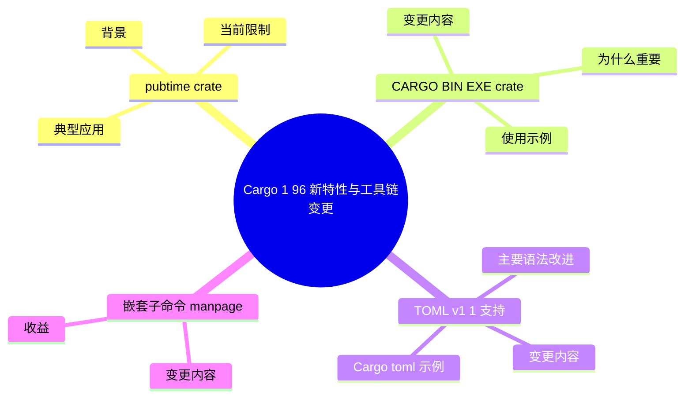

> **内容分级**: [专家级]

# Cargo 1.96 新特性与工具链变更

> **EN**: Cargo 1.96 Feature Highlights
> **Summary**: Systematic coverage of Cargo and toolchain changes stabilized in Rust 1.96: `pubtime` registry field, runtime `CARGO_BIN_EXE_<crate>`, TOML v1.1 support, nested subcommand manpages, and related security fixes.
> **Rust 版本**: 1.96.0+ (Edition 2024)
> **受众**: [进阶]
> **Bloom 层级**: L2-L3
> **权威来源**: 本文件为 `concept/` 权威页。
> **A/S/P 标记**: **A** — Application
> **双维定位**: P×App — 将 Cargo 1.96 工具链变更应用于构建、发布与依赖治理
> **前置概念**: · [Rust vs Go](../../05_comparative/01_systems_languages/03_rust_vs_go.md) [Toolchain](../00_toolchain/01_toolchain.md) · [Public/Private Dependencies](02_public_private_deps.md) · [Cargo Security](13_cargo_security_cves.md) · [Security Practices](../07_security_and_cryptography/01_security_practices.md)
> **后置概念**: [Rust Version Tracking](../../07_future/00_version_tracking/01_rust_version_tracking.md) · [Rust 1.96 Stabilized](../../07_future/00_version_tracking/rust_1_96_stabilized.md)
> **版本状态**: 当前稳定 patch 为 **1.97.0**；特性集与 Rust 1.96.0 一致。

---

> **来源**: [Cargo 1.96 CHANGELOG](https://github.com/rust-lang/cargo/blob/master/CHANGELOG.md) · · [Rust Reference](https://doc.rust-lang.org/reference/introduction.html) · [TRPL](https://doc.rust-lang.org/book/title-page.html) · [Brown University — Interactive Rust Book](https://rust-book.cs.brown.edu/) · [Jung et al. — RustBelt: Securing the Foundations of Rust](https://plv.mpi-sws.org/rustbelt/popl18/) · [Itanium C++ ABI](https://itanium-cxx-abi.github.io/cxx-abi/abi.html)
> Rust 1.96.0 Release Notes ·
> [Cargo Book — Environment Variables](https://doc.rust-lang.org/cargo/reference/environment-variables.html) ·
> [Cargo Book — Manifest Format](https://doc.rust-lang.org/cargo/reference/manifest.html) ·
> [TOML v1.1 Specification](https://toml.io/en/v1.1.0)

---

## 📑 目录

- [Cargo 1.96 新特性与工具链变更](#cargo-196-新特性与工具链变更)
  - [📑 目录](#-目录)
  - [一、特性总览](#一特性总览)
  - [二、`pubtime`：crate 版本发布时间字段](#二pubtimecrate-版本发布时间字段)
    - [2.1 背景](#21-背景)
    - [2.2 数据来源](#22-数据来源)
    - [2.3 典型应用](#23-典型应用)
    - [2.4 当前限制](#24-当前限制)
  - [三、`CARGO_BIN_EXE_<crate>` 运行时可用](#三cargo_bin_exe_crate-运行时可用)
    - [3.1 变更内容](#31-变更内容)
    - [3.2 使用示例](#32-使用示例)
    - [3.3 为什么重要](#33-为什么重要)
    - [3.4 与 Build Dir Layout v2 的关系](#34-与-build-dir-layout-v2-的关系)
  - [四、TOML v1.1 支持](#四toml-v11-支持)
    - [4.1 变更内容](#41-变更内容)
    - [4.2 主要语法改进](#42-主要语法改进)
    - [4.3 Cargo.toml 示例](#43-cargotoml-示例)
    - [4.4 发布兼容性注意](#44-发布兼容性注意)
  - [五、嵌套子命令 manpage](#五嵌套子命令-manpage)
    - [5.1 变更内容](#51-变更内容)
    - [5.2 收益](#52-收益)
  - [六、相关安全修复](#六相关安全修复)
  - [七、迁移建议与陷阱](#七迁移建议与陷阱)
    - [7.1 推荐迁移路径](#71-推荐迁移路径)
    - [7.2 常见陷阱](#72-常见陷阱)
  - [🧭 思维导图（Mindmap）](#-思维导图mindmap)
  - [⚠️ 反例与陷阱](#️-反例与陷阱)
    - [反例：借用存活期间修改容器（rustc 1.97.0，--edition 2024 实测）](#反例借用存活期间修改容器rustc-1970--edition-2024-实测)
    - [✅ 修正：用 Copy 复制或收窄借用作用域](#-修正用-copy-复制或收窄借用作用域)

---

## 一、特性总览

Rust 1.96 在 Cargo 与工具链层面的核心变更可归纳为四类：

| 特性 | 用户可见变化 | 典型应用场景 |
|:---|:---|:---|
| **`pubtime` 字段** | crate index 与 lockfile 可记录版本发布时间 | 依赖冷却策略、Renovate/Dependabot 时间规则、历史依赖重放 |
| **`CARGO_BIN_EXE_<crate>` 运行时（Runtime）可用** | 测试运行时可读取 `env!("CARGO_BIN_EXE_foo")` / `std::env::var` | 集成测试调用 `[[bin]]` 目标，替代从 `[[test]]` 路径推断 |
| **TOML v1.1 解析** | `Cargo.toml` 与 `.cargo/config.toml` 支持多行 inline table、新转义序列等 | 更紧凑的依赖表、跨行 inline 配置 |
| **嵌套子命令 manpage** | `cargo help report future-incompat` 等可展示完整 manpage | CI 文档化、离线工具链参考 |

> **关键洞察**: Cargo 正在从"构建执行器"演进为"构建可观测平台"——`pubtime`、结构化日志、细粒度锁共同支持大规模 Rust monorepo 和企业 CI 的可预测性。

---

## 二、`pubtime`：crate 版本发布时间字段

`pubtime` 字段为 crate 版本记录发布时间，补上了依赖审计中长期缺失的时间维度。四个视角按“为什么有 → 数据从哪来 → 能做什么 → 还不能做什么”组织：

- **背景**: 供应链攻击（如 typosquatting 抢注、账号接管后恶意发版）的判别常依赖发布时间异常——“沉寂三年的包突然发版”是经典风险信号，此前该信息只能在 registry API 之外拼凑。
- **数据来源**: registry 索引中每个版本的 `pubtime` 字段，由 registry 服务端在发布时写入，客户端只读。
- **典型应用**: 依赖审查工具按“发布时间 < 阈值的版本拒绝引入”实现供应链年龄策略（cool-down），降低零日恶意版本命中率。
- **当前限制**: 仅新索引格式提供；私有 registry 需升级服务端才回填该字段。

判定依据：启用 cool-down 策略前先确认私有 registry 已支持 `pubtime`，否则策略会误伤内部包。

### 2.1 背景

`pubtime` 是 Cargo 1.96 在 crate index 与 lockfile 中新增的**版本发布时间字段**。它允许工具基于"该版本已发布多久"做决策，而不只是基于语义版本号。

### 2.2 数据来源

- crates.io 在 crate 发布时记录 UTC 时间。
- index 条目中的 `pubtime` 以 RFC 3339 / ISO 8601 格式呈现。
- lockfile（`Cargo.lock`）在重新生成时可保留该字段（取决于 Cargo 版本与格式版本）。

### 2.3 典型应用

| 场景 | 说明 |
|:---|:---|
| **依赖冷却（cooldown）** | 团队可配置"新版本发布 N 天后才允许自动升级"，降低恶意发布或回归的即时影响 |
| **Renovate/Dependabot 规则** | 基于 `pubtime` 设置最小发布年龄（`minimumReleaseAge`），过滤过新的补丁 |
| **审计与合规** | 追溯某个依赖版本在特定时间点是否已可用 |
| **可复现构建** | 结合 lockfile 历史快照，重放构建时的依赖时间线 |

```toml
# Cargo.lock 片段（概念示例，格式以实际 Cargo 版本为准）
[[package]]
name = "serde"
version = "1.0.228"
source = "registry+https://github.com/rust-lang/crates.io-index"
pubtime = "2026-05-20T12:34:56Z"
```

### 2.4 当前限制

- `pubtime` 本身**不强制**冷却策略；需要外部工具或 CI 策略消费该字段。
- 第三方 registry 需要实现该字段才能与 crates.io 行为一致。

---

## 三、`CARGO_BIN_EXE_<crate>` 运行时可用

构建脚本此前只能在编译期通过 `cargo:rustc-env` 传递二进制路径，运行时测试/集成代码获取同 crate 二进制位置需要脆弱的相对路径猜测。该变更是让 `CARGO_BIN_EXE_<name>` 在更多场景下可用：

- **变更内容**: Cargo 在构建时为二进制目标生成绝对路径环境变量，集成测试可直接 `env!("CARGO_BIN_EXE_mycmd")` 获得可执行文件路径，无需 `assert_cmd` 的查找逻辑（后者本质仍依赖此变量）。
- **为什么重要**: 跨平台路径处理（Windows 的 `.exe` 后缀、交叉编译目标目录差异）由 Cargo 统一解决，测试代码不再硬编码 `target/debug/`。
- **与 Build Dir Layout v2 的关系**: 新的构建目录布局改变产物位置，硬编码路径的代码会随布局升级而失效——使用该变量是唯一与布局解耦的写法。

判定依据：存量测试中所有 `target/debug/xxx` 字面量都应替换为该变量，这是布局升级前的必修项。

### 3.1 变更内容

在 Rust 1.96 之前，`CARGO_BIN_EXE_<crate>` 环境变量仅在**编译时**通过 `env!()` 使用；运行时（Runtime） `std::env::var` 无法读取到。

Rust 1.96 将其扩展为**运行时（Runtime）也可用**，方便集成测试在运行时定位同 workspace 中的二进制产物。

### 3.2 使用示例

```rust
// 在 integration test 中调用 workspace 内的 foo binary
#[test]
fn test_cli_help() {
    let bin_path = std::env::var("CARGO_BIN_EXE_foo")
        .expect("CARGO_BIN_EXE_foo should be set by cargo");

    let output = std::process::Command::new(&bin_path)
        .arg("--help")
        .output()
        .expect("failed to execute foo");

    assert!(output.status.success());
    let stdout = String::from_utf8_lossy(&output.stdout);
    assert!(stdout.contains("Usage:"));
}
```

### 3.3 为什么重要

| 旧做法 | 新做法 |
|:---|:---|
| 通过 `std::env::current_exe()` 或 `[[test]]` 路径推断 binary 位置 | 直接使用 `std::env::var("CARGO_BIN_EXE_<name>")` |
| 容易在 Build Dir Layout v2 等变更后失效 | 使用 Cargo 提供的稳定接口 |
| 只能在编译期通过 `env!(...)` 嵌入 | 运行时可动态获取 |

### 3.4 与 Build Dir Layout v2 的关系

Rust 1.96 继续推进 Build Dir Layout v2（中间产物按构建单元哈希隔离）。`CARGO_BIN_EXE_*` 的运行时可用性降低了工具直接依赖 `target/` 内部路径的风险，是迁移到 Layout v2 的配套稳定接口。

---

## 四、TOML v1.1 支持

Cargo 的 TOML 解析升级至 TOML v1.1 规范，影响所有 `Cargo.toml`/`config.toml` 的解析行为：

- **变更内容**: 解析器从 v1.0 语义切到 v1.1，保持对既有合法文件的兼容，同时解锁新语法。
- **主要语法改进**: 多行内联表（`{ a = 1,\n b = 2 }`）、更宽松的转义与 Unicode 处理等；对 Cargo 用户最实际的价值是长依赖配置可以内联换行，减少 `[dependencies]` 段的重复表头。
- **发布兼容性注意**: 发布到 registry 的包若使用 v1.1 新语法，旧版 Cargo（< 1.96）将无法解析其清单——库的最低支持工具链（MSRV 工具链维度）需同步上调，或暂缓使用新语法。

判定依据：应用（binary crate）可立即采用；库（library crate）需评估下游用户的工具链分布后再启用。

### 4.1 变更内容

Cargo 1.96 合并了 TOML v1.1 解析支持（cargo#16415）。主要影响 `Cargo.toml` 与 `.cargo/config.toml` 的写法。

### 4.2 主要语法改进

| 特性 | TOML v1.0 | TOML v1.1 | 说明 |
|:---|:---|:---|:---|
| 多行 inline table | 不允许 | 允许 | inline table 内可换行，提高可读性 |
| 新转义序列 | `\uXXXX` | 增加 `\xHH`、`\e` 等 | 更灵活的字符串表示 |
| 可选秒 | 必须写秒 | 时间可省略秒 | `2026-05-28T12:34` 合法 |

### 4.3 Cargo.toml 示例

```toml
# TOML v1.1 允许多行 inline table
[dependencies]
serde = { version = "1.0", features = [
    "derive",
    "std",
] }

[package.metadata.my-cfg]
# 多行 inline table 使复杂元数据更易读
extra = { name = "demo", flags = ["a", "b"] }
```

### 4.4 发布兼容性注意

- `cargo package` 在生成发布 tarball 时，会**将 TOML v1.1 特性重写为 TOML 0.5 兼容格式**，以保证旧版 Cargo 能解析。
- 如果你的 MSRV 对应的 Cargo 版本不支持 TOML v1.1，仍建议保持保守写法，或验证 `cargo package` 后的清单。

---

## 五、嵌套子命令 manpage

Cargo 1.96 补齐了嵌套子命令的 manpage 生成：`cargo help <cmd> <subcmd>` 与 `man cargo-<cmd>-<subcmd>` 现在对 `cargo install`、`cargo publish` 等带嵌套结构的命令提供完整文档，不再只有顶层帮助。收益主要在离线环境与脚本化场景：CI 镜像中无需联网查文档，`--help` 输出与 manpage 内容对齐减少了文档版本漂移。这是工具链文档工程化的收尾性改进。

### 5.1 变更内容

Rust 1.96 为 Cargo 的**嵌套子命令**提供了完整的 manpage 支持。例如：

```bash
# 之前：help 可能只有简短提示
# 之后：可查看完整 manpage
$ cargo help report future-incompat
$ cargo help report
```

### 5.2 收益

- **CI 文档化**: 可在无网络环境下查阅完整子命令文档。
- **诊断工具**: `cargo report` 系列子命令（`future-incompat`、`timings` 等）的用法更易于离线获取。
- **shell 补全与 apropos**: manpage 索引改善命令发现性。

---

## 六、相关安全修复

Rust 1.96 修复了两个 Cargo CVE，这些修复与工具链行为直接相关：

| CVE | 影响 | 修复 |
|:---|:---|:---|
| **CVE-2026-5222** | `.git` 后缀 URL 规范化可能导致非预期协议选择 | 限制 `.git` 后缀规范化到 git 协议 |
| **CVE-2026-5223** | 含 symlink 的 tarball 可能逃逸目标目录 | 拒绝包含 symlink 的 tarball |

详见 [Cargo 安全公告：CVE-2026-5222 与 CVE-2026-5223](13_cargo_security_cves.md)。

---

## 七、迁移建议与陷阱

迁移到 Cargo 1.96 的推荐路径：先在 CI 固定新版本跑全量构建（lockfile 兼容性是第一验证点），再逐项启用新特性而非一次性切换。常见陷阱三个：lockfile 格式变更导致旧版 cargo 无法读取（团队需同步升级）；新默认行为（如解析器告警升级）使旧警告变错误；嵌套 manpage 等文档特性需要重新生成本地文档缓存。迁移窗口建议留一个迭代周期观察 nightly CI。

### 7.1 推荐迁移路径

1. **审计直接依赖 `target/` 内部路径的脚本**
   - 搜索 `target/debug/deps`、`target/release` 等硬编码路径。
   - 替换为 `CARGO_BIN_EXE_*`、`OUT_DIR`、`env!()` 等稳定接口。

2. **消费 `pubtime`**
   - 在 Renovate/Dependabot 配置中引入 `minimumReleaseAge`。
   - 在内部 registry 或审计工具中记录 `pubtime`。

3. **谨慎使用 TOML v1.1**
   - 确认团队 MSRV 的 Cargo 版本。
   - 对关键 crate，执行 `cargo package --allow-dirty` 并检查生成的 `Cargo.toml`。

4. **更新 CI 文档**
   - 将 `cargo help report future-incompat` 加入 CI 诊断步骤。

### 7.2 常见陷阱

| 陷阱 | 说明 |
|:---|:---|
| 假设 `pubtime` 一定存在 | 第三方 registry 或旧 lockfile 可能缺失该字段 |
| 运行时读取旧版 Cargo 设置的 `CARGO_BIN_EXE_*` | Rust < 1.96 的运行时不可用；需加 fallback |
| 在 `Cargo.toml` 中使用 TOML v1.1 后未验证 MSRV | 旧 Cargo 会解析失败 |
| 直接解析 `target/` 目录结构 | Build Dir Layout v2 会改变目录结构 |

---

> **对应练习**: [`exercises/src/cargo_196/`](../../exercises/src/cargo_196)

---

## 🧭 思维导图（Mindmap）



> **认知功能**: 本 mindmap 从本页「Cargo 1 96 新特性与工具链变更」的章节结构提炼，一级分支对应核心主题，叶子节点为关键子概念，可作为本页的快速导航与复习索引。

## ⚠️ 反例与陷阱

升级 Cargo/Rust 版本不会放宽借用规则；新旧版本下此代码一律被拒。

### 反例：借用存活期间修改容器（rustc 1.97.0，--edition 2024 实测）

```rust,compile_fail,E0502
fn main() {
    let mut v = vec![1, 2];
    let r = &v[0];
    v.push(3);   // ❌ 不可变借用存活期间修改
    let _ = *r;
}
```

**实测错误**：`error[E0502]: cannot borrow`v`as mutable because it is also borrowed as immutable`。

### ✅ 修正：用 Copy 复制或收窄借用作用域

```rust
fn main() {
    let mut v = vec![1, 2];
    let r = v[0]; // ✅ 复制 Copy 元素，缩短借用期
    v.push(3);
    let _ = r;
}
```
