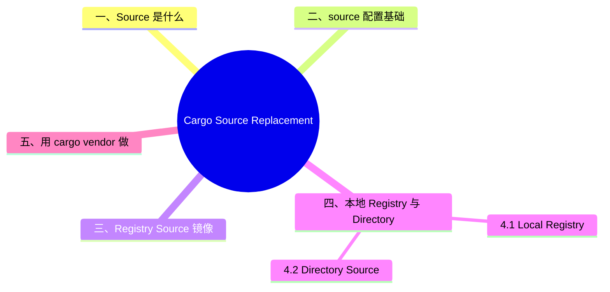

> **内容分级**: [综述级]
> **本节关键术语**: Source Replacement · `[source]` · `replace-with` · Vendoring · `cargo vendor` · Local Registry · Directory Source · Offline Mode — [完整对照表](../../00_meta/01_terminology/01_terminology_glossary.md)
>
# Cargo Source Replacement 与 Vendoring

> **EN**: Cargo Source Replacement
> **Summary**: Explains how to redirect Cargo's dependency sources to mirrors, local registries, or vendored directories; covers `[source]` configuration, `cargo vendor`, and offline mode.
> **Rust 版本**: 1.97.0+ (Edition 2024)
> **受众**: [进阶]
> **Bloom 层级**: L2-L3
> **权威来源**: 本文件为 `concept/` 权威页。
> **A/S/P 标记**: **A** — Application
> **双维定位**: E×Tool — 工具链与生态系统
> **定位**: 把“怎么让 Cargo 从镜像/本地目录/离线缓存下载依赖”系统化，区分 source replacement、`[patch]` 与私有 registry 的适用边界。
> **前置概念**: [Rust vs C++](../../05_comparative/01_systems_languages/01_rust_vs_cpp.md)
> **后置概念**: [Cargo Authentication and Cache](09_cargo_authentication_and_cache.md) · [DevOps and CI/CD](../00_toolchain/03_devops_and_ci_cd.md)

---

> **来源**: [Cargo — Source Replacement](https://doc.rust-lang.org/cargo/reference/source-replacement.html) · [TRPL](https://doc.rust-lang.org/book/title-page.html) · [Brown University — Interactive Rust Book](https://rust-book.cs.brown.edu/) · [Jung et al. — RustBelt: Securing the Foundations of Rust](https://plv.mpi-sws.org/rustbelt/popl18/) · [Itanium C++ ABI](https://itanium-cxx-abi.github.io/cxx-abi/abi.html)
> [Cargo Book — Overriding Dependencies](https://doc.rust-lang.org/cargo/reference/overriding-dependencies.html) ·
> [Cargo Book — cargo vendor](https://doc.rust-lang.org/cargo/commands/cargo-vendor.html) ·
> [Cargo Book — Build Cache](https://doc.rust-lang.org/cargo/reference/build-cache.html)

---

## 📑 目录

- [Cargo Source Replacement 与 Vendoring](#cargo-source-replacement-与-vendoring)
  - [📑 目录](#-目录)
  - [一、Source 是什么](#一source-是什么)
  - [二、`[source]` 配置基础](#二source-配置基础)
  - [三、Registry Source 镜像](#三registry-source-镜像)
  - [四、本地 Registry 与 Directory Source](#四本地-registry-与-directory-source)
    - [4.1 Local Registry](#41-local-registry)
    - [4.2 Directory Source](#42-directory-source)
  - [五、用 `cargo vendor` 做 Vendoring](#五用-cargo-vendor-做-vendoring)
  - [六、Git Source 替换](#六git-source-替换)
  - [七、Offline Mode](#七offline-mode)
  - [八、与 `[patch]`、私有 Registry 的区别](#八与-patch私有-registry-的区别)
  - [嵌入式测验](#嵌入式测验)
    - [测验 1：Source replacement 的核心约束是什么？](#测验-1source-replacement-的核心约束是什么)
    - [测验 2：`cargo vendor` 生成的 vendor 目录属于哪种 source 类型？](#测验-2cargo-vendor-生成的-vendor-目录属于哪种-source-类型)
    - [测验 3：Source replacement 与 `[patch]` 的主要区别是什么？](#测验-3source-replacement-与-patch-的主要区别是什么)
    - [测验 4：Git source replacement 能替换 crates.io 吗？](#测验-4git-source-replacement-能替换-cratesio-吗)
  - [权威来源索引](#权威来源索引)
  - [⚠️ 反例与陷阱](#️-反例与陷阱)
  - [🧭 思维导图（Mindmap）](#-思维导图mindmap)

---

## 一、Source 是什么

在 Cargo 中，**source** 是提供依赖 crate 的“源”。默认的 source 是 crates.io（sparse 索引）。Source replacement 允许你**把某个 source 替换成另一个等价的 source**，常见用途：

- **镜像**: 把 crates.io 替换为国内/企业镜像，加速下载；
- **Vendoring**: 把所有依赖源码下载到本地目录，离线或审计；
- **本地 Registry**: 在内网维护一个 crates.io 子集。

> **关键约束**: Source replacement 假设两个 source 的源码**完全一致**。它不能用来打补丁，也不能当作私有 registry。
>
> [Cargo Book — Source Replacement](https://doc.rust-lang.org/cargo/reference/source-replacement.html)(<https://doc.rust-lang.org/cargo/reference/source-replacement.html>)

---

## 二、`[source]` 配置基础

配置写在 `.cargo/config.toml` 中：

```toml
[source.crates-io]
replace-with = 'my-mirror'

[source.my-mirror]
registry = "sparse+https://mirrors.example.com/crates.io-index/"
```

核心键：

| 键 | 含义 |
|:---|:---|
| `replace-with` | 指定用哪个 source 替换当前 source |
| `registry` | registry 索引地址（git 或 sparse） |
| `local-registry` | 本地 registry 目录 |
| `directory` | directory source（`cargo vendor` 生成） |
| `git` | 替换 git 依赖的源 |

> **定理**: `replace-with` 只能引用（Reference）已定义的 source 名称或 `[registries]` 中注册的替代 registry。

---

## 三、Registry Source 镜像

把 crates.io 换成企业镜像：

```toml
# ~/.cargo/config.toml
[source.crates-io]
replace-with = 'company-mirror'

[source.company-mirror]
registry = "sparse+https://crates.company.com/index/"
```

- 索引格式必须符合 [registry index 规范](https://doc.rust-lang.org/cargo/reference/registry-index.html)；
- 镜像必须包含原 source 中所有被依赖的 crate；
- 发布到 crates.io 的命令需要 `--registry crates.io` 来避免歧义。

---

## 四、本地 Registry 与 Directory Source

两种本地源的适用场景不同：local registry（`registry = "local-registry"` 格式，带索引与 .crate 文件）模拟真实 registry 行为，支持版本解析与校验和验证，适合严格离线环境；directory source（`directory = "vendor/"`）直接指向 vendor 展开的源码目录，配置最简单但牺牲了版本解析（锁文件决定版本）。选择判据：需要离线 `cargo update` 能力选 local registry，只需冻结构建选 directory + `cargo vendor`。

### 4.1 Local Registry

Local registry 是一个预下载的 `.crate` 文件集合 + 索引目录，适合内网或审计场景：

```toml
[source.crates-io]
replace-with = 'local-registry'

[source.local-registry]
local-registry = "/path/to/local/registry"
```

通常用 [`cargo-local-registry`](https://crates.io/crates/cargo-local-registry) 维护。

### 4.2 Directory Source

Directory source 是**解压后的源码目录**，便于直接提交到版本控制：

```toml
[source.crates-io]
replace-with = 'vendored'

[source.vendored]
directory = "vendor"
```

每个 crate 一个目录，Cargo 会校验 `.cargo-checksum.json` 防止意外修改。

---

## 五、用 `cargo vendor` 做 Vendoring

```bash
# 把所有依赖下载到 vendor/ 目录
cargo vendor

# 生成可直接使用的 config.toml 片段
cargo vendor > .cargo/config.toml
```

执行后项目结构示例：

```text
my-project/
├── Cargo.toml
├── Cargo.lock
├── src/
└── vendor/
    ├── serde/
    ├── tokio/
    └── ...
```

`.cargo/config.toml` 会自动包含 `directory = "vendor"` 的 source replacement。

> **注意**: 提交 `vendor/` 到仓库会显著增大体积，但能保证完全离线构建。
>
> [Cargo Book — cargo vendor](https://doc.rust-lang.org/cargo/commands/cargo-vendor.html)(<https://doc.rust-lang.org/cargo/commands/cargo-vendor.html>)

---

## 六、Git Source 替换

Git source 用于替换基于 git 的依赖：

```toml
[source."https://github.com/rust-lang/rust"]
git = "https://github.com/my-mirror/rust"
# branch = "master"
```

> **边界**: Git source replacement 不能替换 registry source，只能替换 git 依赖本身。

---

## 七、Offline Mode

```bash
# 只使用本地缓存，禁止网络请求
cargo build --offline
```

- 依赖必须已经在 `CARGO_HOME` 缓存中；
- 常与 `cargo vendor` 或 CI 缓存配合使用；
- 如果缓存缺失，离线构建会失败。

---

## 八、与 `[patch]`、私有 Registry 的区别

| 机制 | 用途 | 是否改变 crate 身份 |
|:---|:---|:---:|
| **Source Replacement** | 整体替换下载源（镜像/vendoring） | 否 |
| **`[patch]`** | 临时替换单个依赖为本地/git/另一个版本 | 是 |
| **私有 Registry** | 发布/消费私有 crate，拥有独立命名空间 | 是 |

```toml
# [patch] 示例：临时把 serde 替换为本地修复版
[patch.crates-io]
serde = { path = "../serde-fix" }
```

> **反模式**: 用 source replacement 来“给依赖打补丁”会违反 Cargo 的等价性假设，应使用 `[patch]`。
>
> [Cargo Book — Overriding Dependencies](https://doc.rust-lang.org/cargo/reference/overriding-dependencies.html)(<https://doc.rust-lang.org/cargo/reference/overriding-dependencies.html>)

---

## 嵌入式测验

「嵌入式测验」涉及测验 1：Source replacement 的核心约束是什么？、测验 2：`cargo vendor` 生成的 vendor 目录属于…、测验 3：Source replacement 与 `[patch]`…与测验 4：Git source replacement 能替换 cra…，本节逐一说明其要点。

### 测验 1：Source replacement 的核心约束是什么？

<details>
<summary>✅ 答案与解析</summary>

两个 source 必须提供完全相同的源码；replacement source 不能包含原 source 中没有的 crate，也不能用于打补丁。

</details>

---

### 测验 2：`cargo vendor` 生成的 vendor 目录属于哪种 source 类型？

<details>
<summary>✅ 答案与解析</summary>

Directory source。它是解压后的源码目录，配合 `[source.vendored] directory = "vendor"` 使用。

</details>

---

### 测验 3：Source replacement 与 `[patch]` 的主要区别是什么？

<details>
<summary>✅ 答案与解析</summary>

Source replacement 改变下载源，不改变 crate 身份；`[patch]` 临时替换具体依赖的版本或来源，会改变解析结果。

</details>

---

### 测验 4：Git source replacement 能替换 crates.io 吗？

<details>
<summary>✅ 答案与解析</summary>

不能。Git source replacement 只针对 git 依赖；要替换 crates.io 应使用 registry source replacement。

</details>

---

## 权威来源索引

| 来源 | 可信度 | 说明 |
|:---|:---:|:---|
| [Cargo Book — Source Replacement](https://doc.rust-lang.org/cargo/reference/source-replacement.html) | ✅ 一级 | Source replacement 官方文档 |
| [Cargo Book — Overriding Dependencies](https://doc.rust-lang.org/cargo/reference/overriding-dependencies.html) | ✅ 一级 | `[patch]` 官方文档 |
| [Cargo Book — cargo vendor](https://doc.rust-lang.org/cargo/commands/cargo-vendor.html) | ✅ 一级 | Vendoring 官方文档 |
| [Cargo Book — Build Cache](https://doc.rust-lang.org/cargo/reference/build-cache.html) | ✅ 一级 | 缓存与构建目录官方文档 |

---

> **权威来源**: [Cargo Book](https://doc.rust-lang.org/cargo/index.html), [The Rust Reference](https://doc.rust-lang.org/reference/introduction.html)
> **权威来源对齐变更日志**: 2026-06-21 创建，对齐 Rust 1.97.0 / Cargo source replacement

**文档版本**: 1.0
**最后更新**: 2026-06-21
**状态**: ✅ 已对齐 Cargo Book source replacement 文档

## ⚠️ 反例与陷阱

**反例：直接修改 vendor 目录内容。**

```text
$ cargo vendor vendor
$ echo "// hotfix" >> vendor/serde/src/lib.rs
$ cargo build --offline
error: the listed checksum of `vendor/serde/src/lib.rs` has changed
```

vendored 源码附带 `.cargo-checksum.json`，cargo 逐文件校验，任何手改都会导致构建失败——这是供应链完整性的有意设计，不是 bug。

**修正对照**：

1. 需要补丁时用 `[patch.crates-io]` 指向 fork 仓库，而非手改 vendor；
2. 确需本地补丁时同步更新 `.cargo-checksum.json` 的 `files` 项（脆弱，不推荐）；
3. vendor 目录纳入版本控制时标记为只读区域，补丁流程文档化。

**陷阱要点**：source replacement 的安全模型建立在「vendor 内容逐字节可信且不可变」上；绕过校验等于放弃 cargo 的供应链校验。

---

## 🧭 思维导图（Mindmap）


