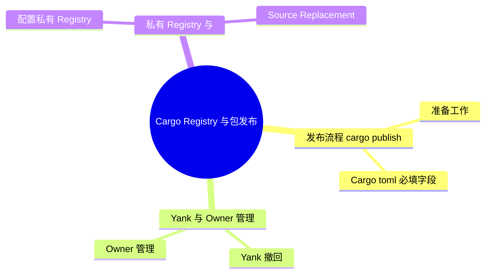

> **内容分级**: [综述级]
> **本节关键术语**: Registry · crates.io · Cargo Index · Sparse Protocol · Git Protocol · `cargo publish` · `cargo yank` · `cargo owner` · Authentication Token — [完整对照表](../../00_meta/01_terminology/01_terminology_glossary.md)
>
# Cargo Registry 与包发布

> **EN**: Cargo Registries and Publishing
> **Summary**: Explains how Cargo registries work, the sparse vs git index protocols, publishing workflow, yank/owner commands, authentication, and private registry setup.
> **Rust 版本**: 1.97.0+ (Edition 2024)
> **受众**: [进阶]
> **Bloom 层级**: L2-L3
> **权威来源**: 本文件为 `concept/` 权威页。
> **A/S/P 标记**: **A** — Application
> **双维定位**: E×Tool — 工具链与生态系统
> **定位**: 把“怎么把 crate 发布到 crates.io / 私有 registry、registry 内部如何索引、认证如何工作”系统化。
> **前置概念**: [Rust vs C++](../../05_comparative/01_systems_languages/01_rust_vs_cpp.md)
> **后置概念**: [Supply Chain Security](13_cargo_security_cves.md) · [Cargo Toolchain](../00_toolchain/01_toolchain.md)

---

> **来源**: [Cargo — Registries](https://doc.rust-lang.org/cargo/reference/registries.html) · [TRPL](https://doc.rust-lang.org/book/title-page.html) · [Brown University — Interactive Rust Book](https://rust-book.cs.brown.edu/) · [Jung et al. — RustBelt: Securing the Foundations of Rust](https://plv.mpi-sws.org/rustbelt/popl18/) · [Itanium C++ ABI](https://itanium-cxx-abi.github.io/cxx-abi/abi.html)
> [Cargo Book — Cargo Registries](https://doc.rust-lang.org/cargo/reference/registries.html) ·
> [Cargo Book — Alternative Registries](https://doc.rust-lang.org/cargo/reference/registries.html#using-an-alternate-registry) ·
> [Cargo Book — config.toml — Registries](https://doc.rust-lang.org/cargo/reference/config.html#registries)

---

## 📑 目录

- [Cargo Registry 与包发布](#cargo-registry-与包发布)
  - [📑 目录](#-目录)
  - [一、Registry 是什么](#一registry-是什么)
  - [二、Registry 索引协议](#二registry-索引协议)
  - [三、发布流程：cargo publish](#三发布流程cargo-publish)
    - [3.1 准备工作](#31-准备工作)
    - [3.2 Cargo.toml 必填字段](#32-cargotoml-必填字段)
  - [四、Yank 与 Owner 管理](#四yank-与-owner-管理)
    - [4.1 Yank（撤回）](#41-yank撤回)
    - [4.2 Owner 管理](#42-owner-管理)
  - [五、认证与 Token](#五认证与-token)
  - [六、私有 Registry 与 Source Replacement](#六私有-registry-与-source-replacement)
    - [6.1 配置私有 Registry](#61-配置私有-registry)
    - [6.2 Source Replacement（源替换）](#62-source-replacement源替换)
  - [七、发布前的检查清单](#七发布前的检查清单)
  - [八、依赖冷却：最小发布时间（RFC 3923）](#八依赖冷却最小发布时间rfc-3923)
  - [嵌入式测验](#嵌入式测验)
    - [测验 1：sparse 协议相比 git 协议的主要优势是什么？](#测验-1sparse-协议相比-git-协议的主要优势是什么)
    - [测验 2：`cargo yank` 会删除已经发布的 crate 源码吗？](#测验-2cargo-yank-会删除已经发布的-crate-源码吗)
    - [测验 3：发布 crate 到 crates.io 时，`license` 字段是必须的吗？](#测验-3发布-crate-到-cratesio-时license-字段是必须的吗)
    - [测验 4：Source replacement 会改变 crate 名称或版本要求吗？](#测验-4source-replacement-会改变-crate-名称或版本要求吗)
  - [权威来源索引](#权威来源索引)
  - [🧭 思维导图（Mindmap）](#-思维导图mindmap)
  - [⚠️ 反例与陷阱](#️-反例与陷阱)
    - [反例：trait 实现漏项无法发布（rustc 1.97.0，--edition 2024 实测）](#反例trait-实现漏项无法发布rustc-1970--edition-2024-实测)
    - [✅ 修正：补齐所有无默认实现的 trait 项](#-修正补齐所有无默认实现的-trait-项)

---

## 一、Registry 是什么

Registry 是托管 Rust crate 包与元数据的服务。最权威、最常用的 registry 是 **crates.io**。

一个 registry 至少提供：

- **Index（索引）**: 包含所有 crate 的版本、依赖、features 等元数据；
- **Crate Storage**: 实际的 `.crate` 文件（tar.gz 格式）。

Cargo 通过索引找到可用版本，通过 crate 存储下载源码。

---

## 二、Registry 索引协议

从 Cargo 1.70 开始，默认使用 **sparse 协议**，替代了旧的 git 协议：

| 协议 | 机制 | 优点 |
|:---|:---|:---|
| **Sparse (HTTP)** | 按需下载 `index.crates.io/...` 下的单个索引文件 | 更快、无需完整 git clone |
| **Git** | 克隆整个 git 仓库作为索引 | 完整历史、离线可用 |

```toml
# ~/.cargo/config.toml 中切换回 git 协议（通常不需要）
[registries.crates-io]
protocol = "git"
```

> **状态**: Rust 1.96 默认使用 sparse 协议。
>
> [Cargo Book — Registry Protocols](https://doc.rust-lang.org/cargo/reference/registry-index.html)(<https://doc.rust-lang.org/cargo/reference/registries.html#registry-protocols>)

---

## 三、发布流程：cargo publish

crates.io 发布的关键约束是**不可变性**：版本一旦发布即永久存在（只能 yank 不能删除），因此发布前的检查比发布动作本身重要。准备三步：`cargo login` 配置 token、`cargo package --list` 审查打包内容（避免误带大文件/私密文件）、`cargo publish --dry-run` 完整验证。Cargo.toml 必填字段（description、license、repository 等）缺一个就会被拒绝，这些是 crates.io 的元数据质量底线。

### 3.1 准备工作

```bash
# 1. 登录 crates.io（浏览器打开获取 API token）
cargo login <your-api-token>

# 2. 检查包内容
cargo package --list

# 3. 本地预发布检查
cargo publish --dry-run

# 4. 正式发布
cargo publish
```

### 3.2 Cargo.toml 必填字段

```toml
[package]
name = "my-crate"
version = "0.1.0"
edition = "2024"
license = "MIT OR Apache-2.0"
description = "A short description"
authors = ["Your Name <you@example.com>"]
repository = "https://github.com/you/my-crate"
rust-version = "1.97.0"
```

> **注意**: crates.io 要求 `license` 或 `license-file` 至少一个。
>
> [Cargo Book — Publishing on crates.io](https://doc.rust-lang.org/cargo/reference/publishing.html)(<https://doc.rust-lang.org/cargo/reference/publishing.html>)

---

## 四、Yank 与 Owner 管理

yank 与删除的本质区别：yank 只是让 Cargo 的依赖解析**不再新选**该版本，已锁定该版本的 Cargo.lock 项目仍可构建——这让“撤回有缺陷版本”不会破坏下游可重复构建。Owner 管理则关乎供应链安全：单人 owner 是单点故障（账号丢失即 crate 失控），团队 owner 应通过 GitHub team 同步，且新 owner 接受邀请后才生效。

### 4.1 Yank（撤回）

```bash
# 撤回某个版本
cargo yank --vers 0.1.0

# 撤销撤回（24 小时内可恢复）
cargo yank --vers 0.1.0 --undo
```

- Yank 不会删除源码或已下载的 crate；
- 已有 `Cargo.lock` 的项目仍可继续构建；
- 新项目执行解析时不会再选择 yanked 版本。

### 4.2 Owner 管理

```bash
# 添加 owner（用户或团队）
cargo owner --add github:rust-lang:libs

# 移除 owner
cargo owner --remove github:rust-lang:libs

# 列出 owner
cargo owner --list
```

---

## 五、认证与 Token

Cargo 支持多种 token 存储方式：

| 方式 | 命令/配置 |
|:---|:---|
| 明文存储在 `~/.cargo/credentials.toml` | `cargo login <token>` |
| 使用凭据提供者 | `[registry.global-credential-providers]` |
| 通过 `CARGO_REGISTRY_TOKEN` 环境变量 |  CI/CD 常用 |

> **安全建议**: 在 CI 中使用环境变量或凭据提供者，避免把 token 提交到仓库。
>
> [Cargo Book — Authentication](https://doc.rust-lang.org/cargo/reference/registry-authentication.html)(<https://doc.rust-lang.org/cargo/reference/config.html#credentials>)

---

## 六、私有 Registry 与 Source Replacement

企业场景的两种依赖治理手段适用不同目的：私有 registry（`[registries.xxx]` + sparse index）用于发布与消费内部 crate，是长期方案；source replacement（`[source.crates-io] replace-with`）用于把 crates.io 流量重定向到内部镜像或 vendor 目录，解决网络隔离/离线构建/审计固化问题。两者可组合：内部 crate 走私有 registry，公开依赖走镜像替换。

### 6.1 配置私有 Registry

```toml
# ~/.cargo/config.toml
[registries.my-company]
index = "sparse+https://crates.my-company.com/git/index/"
```

在 `Cargo.toml` 中引用（Reference）：

```toml
[dependencies]
internal-utils = { version = "1.0", registry = "my-company" }
```

### 6.2 Source Replacement（源替换）

可以把 crates.io 替换为镜像或本地路径：

```toml
# ~/.cargo/config.toml
[source.crates-io]
replace-with = 'my-mirror'

[source.my-mirror]
registry = "sparse+https://mirrors.my-company.com/crates.io-index/"
```

> **注意**: Source replacement 只影响索引和下载位置，不改变 crate 名称或版本要求。
>
> [Cargo Book — Source Replacement](https://doc.rust-lang.org/cargo/reference/source-replacement.html)(<https://doc.rust-lang.org/cargo/reference/source-replacement.html>)

---

## 七、发布前的检查清单

```markdown
- [ ] `Cargo.toml` 包含 `name`、`version`、`edition`、`license`、`description`
- [ ] `README.md` 和 CHANGELOG 已更新
- [ ] 已运行 `cargo test` 并通过
- [ ] 已运行 `cargo clippy` 无警告
- [ ] 已运行 `cargo publish --dry-run` 成功
- [ ] API 文档 `cargo doc` 无 broken intra-doc links
- [ ] 版本号符合 SemVer 规范
- [ ] 若存在破坏性变更，已升级主版本号
```

---

## 八、依赖冷却：最小发布时间（RFC 3923）

> **来源**: [RFC 3923 — Cargo minimum publish age](https://rust-lang.github.io/rfcs/3923-cargo-min-publish-age.html) · [Cargo 1.96 新特性与工具链变更 — `pubtime`](04_cargo_196_features.md)

针对“发布即投毒”类供应链攻击（恶意版本发布后数小时内被大量拉取），RFC 3923 为 Cargo 引入**最小发布时间（minimum publish age）**机制：解析器在选择依赖版本时，跳过发布时间晚于阈值的版本，使新发布版本经过社区审查“冷却期”后才进入默认解析结果。

- **数据基础**：依赖 registry index 中的 `pubtime` 字段（见 [Cargo 1.96 新特性](04_cargo_196_features.md) §二），锁文件同样记录发布时间供审计；
- **与 yank 的关系**：yank 是事后撤回，min-publish-age 是事前缓冲，二者与 [Cargo 安全公告](13_cargo_security_cves.md) 中的投毒响应流程互补；
- **策略形态**：组织级策略（如“仅使用发布超过 7 天的版本”）可通过配置启用，紧急修复可用显式覆盖。

该机制不改变 SemVer 解析语义（见 [Cargo 依赖解析](06_cargo_dependency_resolution.md)），只是在候选版本集合上增加时间过滤。

---

## 嵌入式测验

本节将「嵌入式测验」分解为若干主题：测验 1：sparse 协议相比 git 协议的主要优势是什么？、测验 2：`cargo yank` 会删除已经发布的 crate 源码…、测验 3：发布 crate 到 crates.io 时，`licens…与测验 4：Source replacement 会改变 crate 名…。

### 测验 1：sparse 协议相比 git 协议的主要优势是什么？

<details>
<summary>✅ 答案与解析</summary>

Sparse 协议按需下载单个索引文件，无需克隆整个 git 仓库，速度更快、占用空间更少。

</details>

---

### 测验 2：`cargo yank` 会删除已经发布的 crate 源码吗？

<details>
<summary>✅ 答案与解析</summary>

不会。Yank 只是标记该版本不再用于新的依赖解析，已有 `Cargo.lock` 的项目仍可继续下载和构建。

</details>

---

### 测验 3：发布 crate 到 crates.io 时，`license` 字段是必须的吗？

<details>
<summary>✅ 答案与解析</summary>

是的，必须提供 `license` 或 `license-file` 之一，否则 `cargo publish` 会被拒绝。

</details>

---

### 测验 4：Source replacement 会改变 crate 名称或版本要求吗？

<details>
<summary>✅ 答案与解析</summary>

不会。Source replacement 只改变索引和下载源的位置，crate 名称、版本要求和依赖解析逻辑保持不变。

</details>

---

## 权威来源索引

| 来源 | 可信度 | 说明 |
|:---|:---:|:---|
| [Cargo Book — Publishing on crates.io](https://doc.rust-lang.org/cargo/reference/publishing.html) | ✅ 一级 | 发布流程官方文档 |
| [Cargo Book — Cargo Registries](https://doc.rust-lang.org/cargo/reference/registries.html) | ✅ 一级 | Registry 官方文档 |
| [Cargo Book — Source Replacement](https://doc.rust-lang.org/cargo/reference/source-replacement.html) | ✅ 一级 | 源替换官方文档 |
| [Cargo Book — Authentication](https://doc.rust-lang.org/cargo/reference/config.html#credentials) | ✅ 一级 | 认证官方文档 |

---

> **权威来源**: [Cargo Book](https://doc.rust-lang.org/cargo/index.html), [crates.io policies](https://crates.io/policies), [The Rust Reference](https://doc.rust-lang.org/reference/introduction.html)
> **权威来源对齐变更日志**: 2026-06-21 创建，对齐 Rust 1.97.0 / sparse registry 默认

**文档版本**: 1.0
**最后更新**: 2026-06-21
**状态**: ✅ 已对齐 Cargo Book registry/publishing 文档

---

## 🧭 思维导图（Mindmap）



> **认知功能**: 本 mindmap 从本页「Cargo Registry 与包发布」的章节结构提炼，一级分支对应核心主题，叶子节点为关键子概念，可作为本页的快速导航与复习索引。

## ⚠️ 反例与陷阱

发布到 registry 前 `cargo publish` 会先完整编译；漏实现 trait 必需项会直接失败。

### 反例：trait 实现漏项无法发布（rustc 1.97.0，--edition 2024 实测）

```rust,compile_fail,E0046
trait Job {
    fn run(&self);
}

struct Worker;

impl Job for Worker {} // ❌ 漏实现必需方法

fn main() {
    let _ = Worker;
}
```

**实测错误**：`error[E0046]: not all trait items implemented, missing:`run``。

### ✅ 修正：补齐所有无默认实现的 trait 项

```rust
trait Job {
    fn run(&self);
}

struct Worker;

impl Job for Worker {
    fn run(&self) {} // ✅ 补齐全部必需项
}

fn main() {
    let _ = Worker;
}
```
