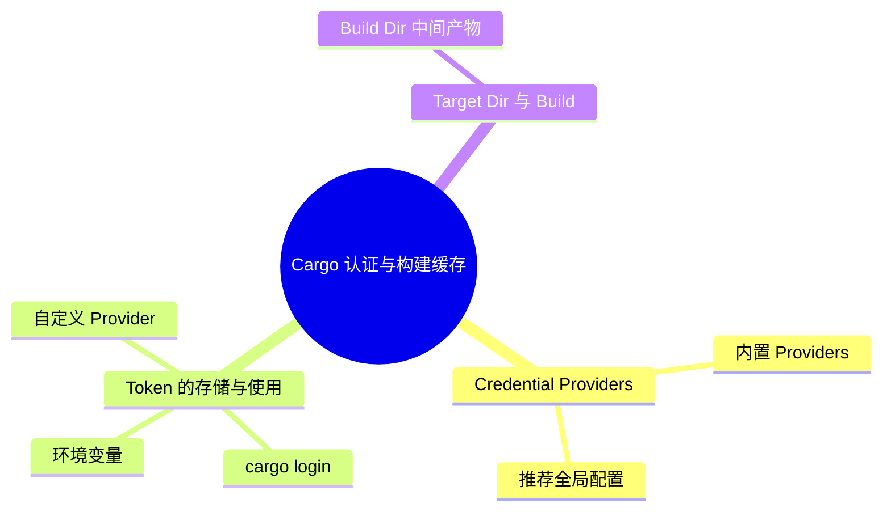

> **内容分级**: [综述级]
> **本节关键术语**: Credential Provider · `cargo:token` · `CARGO_HOME` · Build Cache · Target Dir · Build Dir · Dep-info · `sccache` · Registry Token — [完整对照表](../../00_meta/01_terminology/01_terminology_glossary.md)
>
# Cargo 认证与构建缓存

> **EN**: Cargo Authentication and Build Cache
> **Summary**: Explains Cargo's credential provider system, token storage options, registry authentication, and the layout of `CARGO_HOME`, target/build directories, dep-info files, and shared caches like sccache.
> **Rust 版本**: 1.97.0+ (Edition 2024)
> **受众**: [中级 → 高级]
> **Bloom 层级**: L2-L3
> **权威来源**: 本文件为 `concept/` 权威页。
> **A/S/P 标记**: **A** — Application
> **双维定位**: E×Tool — 工具链与生态系统
> **定位**: 把“Cargo 如何安全地存 token、如何组织缓存、如何加速构建”系统化，补齐 registry 之后的工程实践闭环。
> **前置概念**: [Rust vs C++](../../05_comparative/01_systems_languages/01_rust_vs_cpp.md)
> **后置概念**: [Cargo Security CVEs](13_cargo_security_cves.md) · [DevOps and CI/CD](../00_toolchain/03_devops_and_ci_cd.md)

---

> **来源**: [Cargo — Registry Authentication](https://doc.rust-lang.org/cargo/reference/registry-authentication.html) · [Cargo — Configuration](https://doc.rust-lang.org/cargo/reference/config.html) · [TRPL](https://doc.rust-lang.org/book/title-page.html) · [Brown University — Interactive Rust Book](https://rust-book.cs.brown.edu/) · [Jung et al. — RustBelt: Securing the Foundations of Rust](https://plv.mpi-sws.org/rustbelt/popl18/) · [Itanium C++ ABI](https://itanium-cxx-abi.github.io/cxx-abi/abi.html)
> [Cargo Book — Cargo Home](https://doc.rust-lang.org/cargo/guide/cargo-home.html) ·
> [Cargo Book — Build Cache](https://doc.rust-lang.org/cargo/reference/build-cache.html) ·
> [Cargo Book — Config — Credentials](https://doc.rust-lang.org/cargo/reference/config.html#credentials)

---

## 📑 目录

- [Cargo 认证与构建缓存](#cargo-认证与构建缓存)
  - [📑 目录](#-目录)
  - [一、Registry 认证概述](#一registry-认证概述)
  - [二、Credential Providers](#二credential-providers)
    - [2.1 内置 Providers](#21-内置-providers)
    - [2.2 推荐全局配置](#22-推荐全局配置)
  - [三、Token 的存储与使用](#三token-的存储与使用)
    - [3.1 `cargo login`](#31-cargo-login)
    - [3.2 环境变量](#32-环境变量)
    - [3.3 自定义 Provider](#33-自定义-provider)
  - [四、`CARGO_HOME` 目录结构](#四cargo_home-目录结构)
  - [五、Target Dir 与 Build Dir](#五target-dir-与-build-dir)
    - [5.1 `target/` 目录](#51-target-目录)
    - [5.2 目录布局](#52-目录布局)
    - [5.3 Build Dir（中间产物）](#53-build-dir中间产物)
  - [六、Dep-info 文件](#六dep-info-文件)
  - [七、共享缓存：`sccache`](#七共享缓存sccache)
  - [嵌入式测验](#嵌入式测验)
    - [测验 1：为什么认证 registry 必须配置 credential provider？](#测验-1为什么认证-registry-必须配置-credential-provider)
    - [测验 2：`cargo:token` provider 有什么安全注意事项？](#测验-2cargotoken-provider-有什么安全注意事项)
    - [测验 3：`CARGO_REGISTRIES_<NAME>_TOKEN` 环境变量什么时候生效？](#测验-3cargo_registries_name_token-环境变量什么时候生效)
    - [测验 4：`sccache` 与普通 Cargo 缓存有什么区别？](#测验-4sccache-与普通-cargo-缓存有什么区别)
  - [权威来源索引](#权威来源索引)
  - [🧭 思维导图（Mindmap）](#-思维导图mindmap)
  - [⚠️ 反例与陷阱](#️-反例与陷阱)
    - [反例：同名函数重复定义（rustc 1.97.0，--edition 2024 实测）](#反例同名函数重复定义rustc-1970--edition-2024-实测)
    - [✅ 修正：用模块划分命名空间，消除重复定义](#-修正用模块划分命名空间消除重复定义)

---

## 一、Registry 认证概述

访问需要认证的 registry（如私有 registry 或 crates.io 发布）时，Cargo 需要 token。Cargo 通过 **credential providers** 来存取 token：

- 每个 provider 是一个可执行程序或内置 provider；
- provider 负责安全地存储和检索 token；
- 使用认证 registry **必须**配置 credential provider（公共 registry 除外）。

> [Cargo Book — Registry Authentication](https://doc.rust-lang.org/cargo/reference/registry-authentication.html)(<https://doc.rust-lang.org/cargo/reference/registry-authentication.html>)

---

## 二、Credential Providers

Credential provider 机制（1.74+）把 token 存储从“明文 credentials.toml”抽象为可插拔后端：`cargo:token` 保持旧行为（明文文件），`cargo:wincred`/`cargo:macos-keychain`/`cargo:libsecret` 接入各平台系统密钥环，`cargo:1password` 等外部进程 provider 支持企业密钥管理。推荐全局配置按平台选系统密钥环 provider——明文 token 文件是 CI 镜像泄露的常见源头。

### 2.1 内置 Providers

| Provider | 平台 | 说明 |
|:---|:---|:---|
| `cargo:token` | 全平台 | 明文存储在 `credentials.toml`，环境变量也走它 |
| `cargo:wincred` | Windows | Windows Credential Manager |
| `cargo:macos-keychain` | macOS | macOS Keychain |
| `cargo:libsecret` | Linux | GNOME Keyring / KDE Wallet / KeePassXC 等 |
| `cargo:token-from-stdout <cmd>` | 全平台 | 从子进程 stdout 读取 token |

### 2.2 推荐全局配置

```toml
# ~/.cargo/config.toml
[registry]
global-credential-providers = [
    "cargo:token",
    "cargo:libsecret",
    "cargo:macos-keychain",
    "cargo:wincred",
]
```

> **注意**: 列表中越靠后的 provider 优先级越高。
>
> [Cargo Book — Recommended configuration](https://doc.rust-lang.org/cargo/reference/config.html)(<https://doc.rust-lang.org/cargo/reference/registry-authentication.html#recommended-configuration>)

---

## 三、Token 的存储与使用

token 的三种注入途径有明确优先级：环境变量（`CARGO_REGISTRY_TOKEN`）优先级最高，适合 CI 注入且不落盘；`cargo login` 写入当前配置的 credential provider，适合开发者本机；自定义 provider 适合企业统一密钥分发。安全要点：token 是 publish 权限凭证，CI 中应使用最小权限的独立 token 并启用过期轮换，避免复用个人 token。

### 3.1 `cargo login`

```bash
# 登录 crates.io，token 会写入当前 credential provider
cargo login <token>

# 登出
cargo logout
```

### 3.2 环境变量

```bash
export CARGO_REGISTRIES_MYREGISTRY_TOKEN="my-token"
```

> **重要**: 只有 `cargo:token` provider 被配置时，环境变量才会生效。

### 3.3 自定义 Provider

```toml
[registry]
global-credential-providers = ["cargo-credential-1password --account my.1password.com"]
```

自定义 provider 必须实现 [Credential Provider Protocol](https://doc.rust-lang.org/cargo/reference/credential-provider-protocol.html)。

---

## 四、`CARGO_HOME` 目录结构

`CARGO_HOME` 默认是 `~/.cargo`（Windows: `%USERPROFILE%\.cargo`）：

```text
~/.cargo/
├── bin/              # cargo install 安装的二进制
├── config.toml       # 全局配置
├── credentials.toml  # cargo:token 明文凭证（如使用）
├── registry/
│   ├── cache/        # 下载的 .crate 文件
│   ├── index/        # registry 索引（sparse 或 git）
│   └── src/          # 解压后的 crate 源码
└── git/
    ├── checkouts/    # git 依赖的检出目录
    └── db/           # git 依赖的 bare 仓库
```

> [Cargo Book — Cargo Home](https://doc.rust-lang.org/cargo/reference/config.html#credentialstransport)(<https://doc.rust-lang.org/cargo/guide/cargo-home.html>)

---

## 五、Target Dir 与 Build Dir

`target/` 目录是 Cargo 增量编译的缓存本体：debug/release profile 分离、依赖与本地 crate 分层存储、指纹文件记录重建条件。工程上两个要点：`CARGO_TARGET_DIR` 可让多 workspace 共享编译缓存（monorepo 提速显著）；build dir（中间产物）与最终产物分离的实验特性允许把大体积中间文件放到快盘、最终产物放到慢盘。CI 缓存 `target/` 时须包含指纹文件，否则缓存形同虚设。

### 5.1 `target/` 目录

默认位于工作区根目录，可通过以下方式修改：

- `CARGO_TARGET_DIR` 环境变量
- `build.target-dir` 配置
- `--target-dir` 命令行参数

### 5.2 目录布局

```text
target/
├── debug/            # dev / test profile
├── release/          # release / bench profile
├── doc/              # cargo doc 输出
├── package/          # cargo package 输出
└── <triple>/         # 指定 --target 时
    ├── debug/
    └── release/
```

### 5.3 Build Dir（中间产物）

Rust 1.96+ 把中间产物（如 `deps/`、`incremental/`、`build/`）放到独立的 build dir，默认与 target dir 相同。可通过 `CARGO_BUILD_BUILD_DIR` 或 `build.build-dir` 单独配置。

> [Cargo Book — Build Cache](https://doc.rust-lang.org/cargo/reference/build-cache.html)(<https://doc.rust-lang.org/cargo/reference/build-cache.html>)

---

## 六、Dep-info 文件

每个编译产物旁边都有一个 `.d` 文件，记录该产物的所有源文件依赖：

```makefile
# target/debug/foo.d
/path/to/myproj/target/debug/foo: /path/to/myproj/src/lib.rs /path/to/myproj/src/main.rs
```

用途：

- 外部构建系统判断是否需要重新调用 Cargo；
- 可通过 `build.dep-info-basedir` 改成相对路径。

---

## 七、共享缓存：`sccache`

`sccache` 是 Mozilla 提供的编译缓存，可跨工作区共享构建结果：

```bash
# 安装
cargo install sccache

# 启用（bash 可放入 .bashrc）
export RUSTC_WRAPPER=sccache

# 或通过 Cargo 配置
[build]
rustc-wrapper = "sccache"
```

> **收益**: 在 CI 或多项目开发中显著减少重复编译时间。

---

## 嵌入式测验

「嵌入式测验」涉及测验 1：为什么认证 registry 必须配置 credential…、测验 2：`cargo:token` provider 有什么安全注意…、测验 3：`CARGO_REGISTRIES_<NAME>_TOKEN…与测验 4：`sccache` 与普通 Cargo 缓存有什么区别？，本节逐一说明其要点。

### 测验 1：为什么认证 registry 必须配置 credential provider？

<details>
<summary>✅ 答案与解析</summary>

为了避免 token 被无意中以明文形式存储在磁盘上。Credential provider 负责安全地存取 token。

</details>

---

### 测验 2：`cargo:token` provider 有什么安全注意事项？

<details>
<summary>✅ 答案与解析</summary>

`cargo:token` 把 token 以明文形式存储在 `credentials.toml` 中，不如 OS keychain/libsecret 安全，但兼容性最好，也支持环境变量。

</details>

---

### 测验 3：`CARGO_REGISTRIES_<NAME>_TOKEN` 环境变量什么时候生效？

<details>
<summary>✅ 答案与解析</summary>

只有 `cargo:token` provider 被配置在 `global-credential-providers` 中时，对应的环境变量才会被读取。

</details>

---

### 测验 4：`sccache` 与普通 Cargo 缓存有什么区别？

<details>
<summary>✅ 答案与解析</summary>

普通 Cargo 缓存只在一个工作区内共享；`sccache` 作为 `RUSTC_WRAPPER` 可跨多个工作区甚至 CI 环境共享编译结果。

</details>

---

## 权威来源索引

| 来源 | 可信度 | 说明 |
|:---|:---:|:---|
| [Cargo Book — Registry Authentication](https://doc.rust-lang.org/cargo/reference/registry-authentication.html) | ✅ 一级 | Registry 认证官方文档 |
| [Cargo Book — Cargo Home](https://doc.rust-lang.org/cargo/guide/cargo-home.html) | ✅ 一级 | CARGO_HOME 官方文档 |
| [Cargo Book — Build Cache](https://doc.rust-lang.org/cargo/reference/build-cache.html) | ✅ 一级 | 构建缓存官方文档 |
| [Cargo Book — Config — Credentials](https://doc.rust-lang.org/cargo/reference/config.html#credentials) | ✅ 一级 | 凭证配置官方文档 |

---

> **权威来源**: [Cargo Book](https://doc.rust-lang.org/cargo/index.html), [The Rust Reference](https://doc.rust-lang.org/reference/introduction.html)
> **权威来源对齐变更日志**: 2026-06-21 创建，对齐 Rust 1.97.0 / Cargo 认证与缓存文档

**文档版本**: 1.0
**最后更新**: 2026-06-21
**状态**: ✅ 已对齐 Cargo Book authentication/cache 文档

---

## 🧭 思维导图（Mindmap）



> **认知功能**: 本 mindmap 从本页「Cargo 认证与构建缓存」的章节结构提炼，一级分支对应核心主题，叶子节点为关键子概念，可作为本页的快速导航与复习索引。

## ⚠️ 反例与陷阱

合并多个缓存/认证辅助模块时，同名顶层函数冲突是常见编译错误。

### 反例：同名函数重复定义（rustc 1.97.0，--edition 2024 实测）

```rust,compile_fail,E0428
fn dup() {}
fn dup() {} // ❌ 同一命名空间重复定义

fn main() {
    dup();
}
```

**实测错误**：`error[E0428]: the name`dup`is defined multiple times`。

### ✅ 修正：用模块划分命名空间，消除重复定义

```rust
fn dup() {}

mod inner {
    pub fn dup() {} // ✅ 不同模块各自命名空间
}

fn main() {
    dup();
    inner::dup();
}
```
