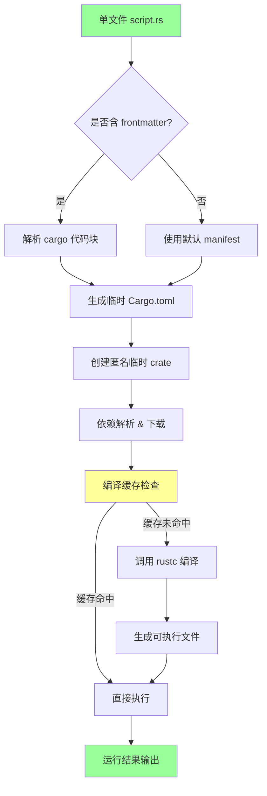
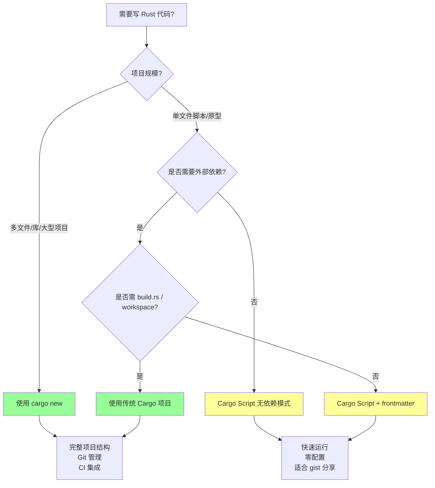

# Cargo Script 脚本化 Rust

> **EN**: Cargo Script: Writing and Running Rust Scripts
> **Summary**: Cargo Script single-file programs with frontmatter dependencies and `cargo` execution.
> **来源**: [Cargo Book — Scripts](https://doc.rust-lang.org/cargo/reference/unstable.html#script) · [Rust 1.85 Release Notes](https://blog.rust-lang.org/2025/02/20/Rust-1.85.0.html) · [Brown University — Interactive Rust Book](https://rust-book.cs.brown.edu/) · [Jung et al. — RustBelt: Securing the Foundations of Rust](https://plv.mpi-sws.org/rustbelt/popl18/) · [Itanium C++ ABI](https://itanium-cxx-abi.github.io/cxx-abi/abi.html)

> > **权威来源**: 本文件为 `concept/` 权威页。
## 代码示例：Cargo Script 单文件程序

> **代码状态**: [示例级 — 已补充代码]

以下是一个完整的 Cargo Script 示例，演示 frontmatter 依赖声明与单文件执行：

```rust,ignore
#!/usr/bin/env cargo
```cargo
[package]
name = "csv-filter"
edition = "2024"

[dependencies]
clap = { version = "4", features = ["derive"] }
chrono = "0.4"
```

use clap::Parser;
use chrono::Local;

# [derive(Parser)]

struct Args {
    #[arg(help = "输入 CSV 文件路径")]
    input: String,
    #[arg(short, long, default_value = "output.csv")]
    output: String,
}

fn main() {
    let args = Args::parse();
    println!("[{}] 处理: {} -> {}", Local::now(), args.input, args.output);
    // 实际过滤逻辑...
}

```

运行方式：

```bash
# 直接执行（Rust 1.79+）
cargo run --manifest-path csv_filter.rs

# 或赋予执行权限后运行
chmod +x csv_filter.rs && ./csv_filter.rs
```

### 示例 1：零依赖脚本

```rust,ignore
#!/usr/bin/env cargo

fn main() {
    let args: Vec<String> = std::env::args().collect();
    match args.get(1).map(String::as_str) {
        Some("--help") | Some("-h") => println!("用法: {} [名字]", args[0]),
        Some(name) => println!("你好, {}!", name),
        None => println!("你好, Cargo Script!"),
    }
}
```

### 示例 2：使用 nightly `-Zscript` 运行（稳定化前/旧版本）

```bash
# 若稳定版尚未启用 cargo script，可用 nightly 的 -Zscript 标志
cargo +nightly -Zscript run --manifest-path script.rs
```

### 示例 3：处理 JSON 的脚本

```rust,ignore
#!/usr/bin/env cargo
```cargo
[dependencies]
serde_json = "1"
```

fn main() {
    let input = r#"{"name":"Rust","year":2010}"#;
    let parsed: serde_json::Value = serde_json::from_str(input).unwrap();
    println!("{} 诞生于 {}", parsed["name"], parsed["year"]);
}

```

>
# Cargo Script：单文件 Rust 程序

> **受众**: [进阶]
> **内容分级**: [综述级]
> **Bloom 层级**: L3-L5
> **A/S/P 标记**: **A** — Application
> **双维定位**: F×App — Cargo script 工具的应用
> **定位**: 将 Rust 从"项目级语言"扩展为"脚本级语言"的工程机制，使单文件可执行成为一等公民。
> **对标**: Python 单文件脚本、Go `go run`、Node.js 单文件执行
> **定理链**: N/A — 描述性/综述性/导航性文档，不涉及形式化定理链
> **前置概念**: N/A
---

> 来源: [RFC 3502 — Cargo Script Manifest](https://github.com/rust-lang/rfcs/pull/3502) ·
> [RFC 3503 — Cargo Script Frontmatter](https://github.com/rust-lang/rfcs/pull/3503) ·
> [Cargo Book — Scripts](https://doc.rust-lang.org/cargo/reference/unstable.html#script) ·
> [rust-lang/cargo#12207](https://github.com/rust-lang/cargo/issues/12207) ·
> [rust-lang/rust#136889](https://github.com/rust-lang/rust/issues/136889)
> **后置概念**: [Future Roadmap](../../07_future/05_roadmaps/24_roadmap.md)
> **前置依赖**: [Type Theory](../../04_formal/00_type_theory/02_type_theory.md)
> **前置依赖**: [Rust vs C++](../../05_comparative/01_systems_languages/01_rust_vs_cpp.md)

## 📑 目录

- [Cargo Script 脚本化 Rust](#cargo-script-脚本化-rust)
  - [代码示例：Cargo Script 单文件程序](#代码示例cargo-script-单文件程序)
- [\[derive(Parser)\]](#deriveparser)
- [Cargo Script：单文件 Rust 程序](#cargo-script单文件-rust-程序)
  - [📑 目录](#-目录)
  - [一、核心概念](#一核心概念)
    - [1.1 三种执行方式](#11-三种执行方式)
    - [1.2 嵌入式 Manifest](#12-嵌入式-manifest)
  - [二、Frontmatter 语法详解](#二frontmatter-语法详解)
    - [2.1 完整字段支持](#21-完整字段支持)
    - [2.2 依赖解析机制](#22-依赖解析机制)
  - [三、与传统 Cargo 项目的对比](#三与传统-cargo-项目的对比)
  - [四、工程实践](#四工程实践)
    - [4.1 快速 CLI 原型](#41-快速-cli-原型)
    - [4.2 CI/CD 辅助脚本](#42-cicd-辅助脚本)
    - [4.3 数据处理与临时任务](#43-数据处理与临时任务)
  - [五、形式化定位](#五形式化定位)
    - [5.1 匿名 Crate 语义](#51-匿名-crate-语义)
    - [5.2 与模块（Module）系统的关系](#52-与模块系统的关系)
  - [六、与 L1-L4 的关系映射](#六与-l1-l4-的关系映射)
  - [七、来源与延伸阅读](#七来源与延伸阅读)
  - [相关概念文件](#相关概念文件)
  - [Wikipedia 概念对齐](#wikipedia-概念对齐)
  - [权威来源索引](#权威来源索引)
  - [十、边界测试：Cargo Script 的编译错误](#十边界测试cargo-script-的编译错误)
    - [10.1 边界测试：`cargo script` 的依赖解析（编译错误）](#101-边界测试cargo-script-的依赖解析编译错误)
    - [10.2 边界测试：单文件脚本的模块（Module）限制（编译错误）](#102-边界测试单文件脚本的模块限制编译错误)
    - [10.5 边界测试：`cargo script` 的缓存与依赖版本漂移（运行时（Runtime）行为变化）](#105-边界测试cargo-script-的缓存与依赖版本漂移运行时行为变化)
    - [10.7 边界测试：cargo script 的依赖解析与版本冲突（运行时（Runtime）/编译错误）](#107-边界测试cargo-script-的依赖解析与版本冲突运行时编译错误)
    - [10.3 边界测试：cargo script 的 shebang 与 Windows 兼容性（运行时错误）](#103-边界测试cargo-script-的-shebang-与-windows-兼容性运行时错误)
    - [补充定理链](#补充定理链)
  - [嵌入式测验（Embedded Quiz）](#嵌入式测验embedded-quiz)
    - [测验 1：Cargo Script（单文件 Rust 程序）相比传统 `cargo new` 项目有什么优势？（理解层）](#测验-1cargo-script单文件-rust-程序相比传统-cargo-new-项目有什么优势理解层)
    - [测验 2：在 Cargo Script 文件中，如何声明外部依赖？（理解层）](#测验-2在-cargo-script-文件中如何声明外部依赖理解层)
    - [测验 3：Cargo Script 适合替代哪些传统脚本语言（如 Python/Bash）的场景？（理解层）](#测验-3cargo-script-适合替代哪些传统脚本语言如-pythonbash的场景理解层)
    - [测验 4：Cargo Script 的编译产物会被缓存吗？（理解层）](#测验-4cargo-script-的编译产物会被缓存吗理解层)
    - [测验 5：Cargo Script 与 `rustc` 直接编译单文件有什么区别？（理解层）](#测验-5cargo-script-与-rustc-直接编译单文件有什么区别理解层)
  - [认知路径](#认知路径)
    - [核心推理链](#核心推理链)
    - [反命题与边界](#反命题与边界)

---

## 一、核心概念

Cargo Script（[RFC 3502](https://rust-lang.github.io/rfcs//3502-cargo-script.html) + [RFC 3503](https://rust-lang.github.io/rfcs//3503-frontmatter.html)）允许在单个 `.rs` 文件中编写完整 Rust 程序并直接执行，**无需 `Cargo.toml` 或项目目录结构**。
两个 RFC 均已获批：[RFC 3502](https://rust-lang.github.io/rfcs//3502-cargo-script.html) 定义单文件 manifest 格式，[RFC 3503](https://rust-lang.github.io/rfcs//3503-frontmatter.html) 定义 frontmatter 语法。
RFC 3502/3503 已获批，**Cargo Script FCP 已结束**，但当前被 **edition policy（lang/edition 方面）block**，尚未完全稳定。
当前 nightly 可通过 `-Zscript` 使用，frontmatter 支持亦在积极推进中。

### 1.1 三种执行方式

```bash
# 方式 A: cargo 原生支持 (Rust 1.79+ 稳定)
cargo run --manifest-path script.rs

# 方式 B: 直接执行（Unix shebang）
chmod +x script.rs && ./script.rs

# 方式 C: 第三方 rust-script（历史方案）
cargo install rust-script
rust-script script.rs
```

### 1.2 嵌入式 Manifest

单文件通过 frontmatter 或 Markdown 代码块声明依赖与元数据：

**原生 Cargo Script（```cargo 代码块）**:

```rust,ignore
    #!/usr/bin/env cargo
    ```cargo
    [dependencies]
    clap = { version = "4", features = ["derive"] }
    ```
use clap::Parser;

#[derive(Parser)]
struct Args { name: String }

fn main() {
    let args = Args::parse();
    println!("Hello, {}!", args.name);
}
```

**rust-script 风格（YAML frontmatter）**:

```rust,ignore
#!/usr/bin/env rust-script
---
[package]
name = "quick-cli"
edition = "2021"

[dependencies]
clap = "4"
---

fn main() { /* ... */ }
```

> [来源: [RFC 3503 §Syntax](https://github.com/rust-lang/rfcs/pull/3503) — frontmatter 语法最终选定为 Markdown 代码块 `` ```cargo ``，以兼容 rustdoc 和 IDE 高亮。

---

## 二、Frontmatter 语法详解

### 2.1 完整字段支持
>

| 字段 | 必需 | 说明 | 示例 |
|:---|:---:|:---|:---|
| `package.name` | 自动推导 | 默认使用文件名（不含扩展名） | `script.rs` → `script` |
| `package.version` | 否 | 默认 `0.0.0` | `version = "0.1.0"` |
| `package.edition` | 否 | 默认当前 toolchain edition | `edition = "2024"` |
| `dependencies` | 否 | 与 `Cargo.toml` 同格式 | `serde = "1"` |
| `profile` | 否 | 编译优化配置 | `profile.release.lto = true` |

### 2.2 依赖解析机制
>

Cargo Script 的依赖解析**等价于**一个隐式生成的 `Cargo.toml`：

```toml
# 内部生成的 Cargo.toml（不可见）
[package]
name = "script"      # 从文件名推导
version = "0.0.0"    # 默认值
edition = "2024"     # 默认当前 edition

[dependencies]
# 从 frontmatter 解析
```

> [来源: [Cargo Book — Script Manifest](https://doc.rust-lang.org/cargo/reference/unstable.html#script) — 单文件脚本在 Cargo 内部被建模为一个**匿名临时 crate**，编译缓存存储于 `~/.cargo/script-cache/`。

---

## 三、与传统 Cargo 项目的对比

| 维度 | `cargo new` 项目 | Cargo Script 单文件 |
|:---|:---|:---|
| **启动成本** | 目录 + `Cargo.toml` + `src/main.rs` | 单文件即可 |
| **依赖管理** | 集中式 `Cargo.toml` | 嵌入式 frontmatter |
| **版本控制** | 适合 Git 管理多文件 | 适合 gist / 快速分享 |
| **编译缓存** | `target/` 目录 | `~/.cargo/script-cache/` |
| **多文件模块（Module）** | ✅ `mod foo;` | ❌ 仅单文件（截至 1.95） |
| `workspace = true` | ✅ 支持 | ❌ 不支持 |
| `build.rs` | ✅ 支持 | ❌ 不支持 |
| **适用场景** | 大型项目、库开发 | 脚本、原型、CI 辅助 |

> [来源: [RFC 3503 §Motivation](https://github.com/rust-lang/rfcs/pull/3503) — 核心动机是降低 Rust 的"Hello World 门槛"，使 Rust 可以与 Python/Node.js 在脚本场景竞争。

**Cargo Script 执行流程（Mermaid graph TD）**:



> **认知功能**：
> 此流程图揭示 Cargo Script 的"隐式编译"本质——单文件并非解释执行，而是经 frontmatter 解析、临时 crate 生成、缓存复用等步骤透明地完成编译。
> 建议在理解执行延迟来源（首次编译 vs 缓存命中）和调试脚本依赖问题时调用此心智模型。
> 关键洞察：缓存键基于文件内容与 frontmatter 的哈希，修改任一字符即触发重新编译。[💡 原创分析](../../00_meta/00_framework/methodology.md)
> [来源: [TRPL](https://doc.rust-lang.org/book/title-page.html)]
> **思维表征说明**: `graph TD` 流程图将 Cargo Script 的**内部执行机制**可视化——从单文件输入到最终运行的完整管道。
> 关键洞察：Cargo Script 并非「无需编译」，而是「**隐式管理编译**」——frontmatter 被解析为临时 `Cargo.toml`，编译缓存存储在 `~/.cargo/script-cache/`，第二次执行时若源码未变更则直接复用。
> 这与传统 `cargo run` 的差异在于「临时项目」的自动化管理。 [来源: [RFC 3502](https://rust-lang.github.io/rfcs//3502-cargo-script.html) §Execution Model; Cargo Book — Scripts]

**何时使用 Cargo Script？决策树（Mermaid graph TD）**:



> **认知功能**：
> 此决策树提供工程场景下的工具选择启发式——当项目规模、依赖复杂度或构建需求突破单文件边界时，应果断迁移至传统 Cargo 项目。
> 建议在面对"这个脚本该用 Cargo Script 还是 cargo new？"的抉择时激活此判断框架。
> 关键洞察：Cargo Script 的适用域是"快速验证与分享"，而非"长期维护与协作"；
> gist 友好的背后是 workspace 和 build.rs 等高级功能的缺失。
> [💡 原创分析](../../00_meta/00_framework/methodology.md)
> **思维表征说明**:
> 此决策树帮助程序员在「Cargo Script」和「传统 Cargo 项目」之间做出**工程化的选择**
> ——不是「Cargo Script 可以替代所有项目」，而是「根据项目规模、依赖复杂度、构建需求选择适当的工具」。
> 叶子节点的颜色编码（绿色=传统项目，黄色=Cargo Script）直观传达了推荐倾向。
> [来源: [RFC 3503](https://rust-lang.github.io/rfcs//3503-frontmatter.html) §Motivation; Cargo Book — When to use scripts]

---

## 四、工程实践

### 4.1 快速 CLI 原型

```rust,ignore
#!/usr/bin/env cargo
    ```cargo
    [dependencies]
    clap = { version = "4", features = ["derive"] }
    ```
use clap::Parser;

#[derive(Parser)]
struct Args {
    #[arg(short, long)]
    name: String,
    #[arg(short, long, default_value = "1")]
    count: u32,
}

fn main() {
    let args = Args::parse();
    for _ in 0..args.count {
        println!("Hello, {}!", args.name);
    }
}
```

### 4.2 CI/CD 辅助脚本

```bash
# GitHub Actions 中直接执行
cargo run --manifest-path .github/scripts/deploy.rs
```

Cargo Script 的**自包含性**使其成为 CI 脚本的理想选择：

- 无需预先安装额外工具（除 Cargo 外）
- 依赖自动缓存
- 类型安全替代 Bash/Python 脚本

### 4.3 数据处理与临时任务

```rust,ignore
#!/usr/bin/env cargo
    ```cargo
    [dependencies]
    serde = { version = "1", features = ["derive"] }
    serde_json = "1"
    ```
use serde::Deserialize;

#[derive(Deserialize)]
struct Record { age: u32, city: String }

fn main() {
    let stdin = std::io::read_to_string(std::io::stdin()).unwrap();
    let mut total = 0;
    for line in stdin.lines() {
        if let Ok(r) = serde_json::from_str::<Record>(line) {
            if r.city == "Beijing" { total += r.age; }
        }
    }
    println!("Total age in Beijing: {}", total);
}
```

---

## 五、形式化定位

### 5.1 匿名 Crate 语义

单文件脚本在 Cargo 的形式化模型中等价于一个**匿名 crate**：

$$
\text{ScriptFile} \cong \text{Crate}\langle \text{name} \leftarrow \text{filename}, \text{manifest} \leftarrow \text{frontmatter} \rangle
$$

> [来源: [Cargo 源码 — `util/toml/embedded.rs`](https://github.com/rust-lang/cargo/blob/master/src/cargo/util/toml/embedded.rs) — 单文件脚本在 Cargo 内部通过 `to_manifest()` 转换为标准 `Manifest`，然后走常规编译流程。

### 5.2 与模块系统的关系

```text
传统项目:  Crate → Module Tree → Files
Cargo Script:  File = Crate (单模块，无子模块)
```

这一定位决定了 Cargo Script **不支持 `mod foo;`** — 因为文件边界即 crate 边界，不存在"当前 crate 内的其他文件"。

---

## 六、与 L1-L4 的关系映射
>

| L1-L4 概念 | Cargo Script 映射 |
|:---|:---|
| **L1 所有权（Ownership）** | 单文件脚本的 `main()` 仍遵循完整的所有权规则，无简化 |
| **L2 泛型（Generics）/Trait** | 依赖通过 frontmatter 声明，Trait bound 解析与传统项目一致 |
| **L3 Unsafe** | `unsafe` 代码在脚本中完全支持，无额外限制 |
| **L4 形式化** | 脚本的形式化语义等价于"单文件匿名 crate"，编译器输入不变 |

---

## 七、来源与延伸阅读

- **一级**: [RFC 3503 — Cargo Script](https://github.com/rust-lang/rfcs/pull/3503)（FCP 已结束，被 edition policy block；Project Goals 2026 Continued）
- **一级**: [Cargo Book — Unstable Features / Script](https://doc.rust-lang.org/cargo/reference/unstable.html#script)
- **二级**: [rust-lang/cargo#12207](https://github.com/rust-lang/cargo/issues/12207) — Cargo Script Tracking Issue
- **二级**: [rust-lang/rust#136889](https://github.com/rust-lang/rust/issues/136889) — `frontmatter` 语言特性跟踪 issue
- **二级**: [rust-lang/rust#141367](https://github.com/rust-lang/rust/issues/141367) — rustc lexer 已知 bug（稳定化阻塞项之一）
- **三级**: [rust-script](https://github.com/fornwall/rust-script) — 社区先行实现（功能已合并至 Cargo 官方）

---

## 相关概念文件

- [工具链总览](../00_toolchain/01_toolchain.md) — Cargo 工作空间与编译器生态
- [核心 Crate 选型](../02_core_crates/03_core_crates.md) — 脚本中常用依赖的选择策略
- [L2 泛型与 Trait](../../02_intermediate/00_traits/01_traits.md) — 脚本中泛型（Generics）约束的完整支持

---

---

## Wikipedia 概念对齐

> **来源: [Wikipedia](https://en.wikipedia.org/wiki/Main_Page)** 核心概念与国际知识库映射。

| 概念 | Wikipedia 词条 | 说明 |
|:---|:---|:---|
| **Shebang (Unix)** | [Shebang (Unix)](https://en.wikipedia.org/wiki/Shebang_(Unix)) | Shebang |
| **Scripting language** | [Scripting language](https://en.wikipedia.org/wiki/Scripting_language) | 脚本语言 |
| **Package manager** | [Package manager](https://en.wikipedia.org/wiki/Package_manager) | 包管理器 |

> **权威来源**: [Rust Reference](https://doc.rust-lang.org/reference/introduction.html), [The Rust Programming Language](https://doc.rust-lang.org/book/title-page.html), [Rustonomicon](https://doc.rust-lang.org/nomicon/index.html)
>
> **权威来源对齐变更日志**: 2026-05-19 补全权威来源标注（Rust Reference、TRPL、Rustonomicon、RFCs、学术论文） [Authority Source Sprint Batch 8](../../00_meta/02_sources/international_authority_index.md)

**文档版本**: 1.1
**对应 Rust 版本**: 1.97.0+ (Edition 2024)
**最后更新**: 2026-05-19
**状态**: ✅ 权威来源对齐完成 (Batch 8)

---

## 权威来源索引

>
>
>
>
>

---

---

---

## 十、边界测试：Cargo Script 的编译错误

### 10.1 边界测试：`cargo script` 的依赖解析（编译错误）

```rust,compile_fail
//! ```cargo
//! [dependencies]
//! serde = "1.0"
//! ```

use serde::Deserialize;

// ❌ 编译错误: cargo script 的依赖解析与常规 Cargo.toml 不同
// 若依赖版本冲突，可能报错
#[derive(Deserialize)]
struct Data { value: i32 }

fn main() {
    let _data: Data = serde_json::from_str(r#"{"value": 42}"#).unwrap();
}
```

> **修正**:
> Cargo Script（Rust 1.79+ 实验性支持）允许在文件头部通过 frontmatter 声明依赖。
> 依赖解析遵循与普通 Cargo 项目相同的规则，但错误信息可能更复杂（因为无显式 Cargo.toml）。
> 版本冲突时，Cargo 使用统一版本选择算法（unification），可能选择比预期更新的版本。
> 这与 Python 的 `pip install` 或 Node 的 `npx` 不同——Cargo 的依赖解析是确定性的，生成 `Cargo.lock` 锁定版本。
> [来源: [Cargo Documentation](https://doc.rust-lang.org/cargo/index.html)]

### 10.2 边界测试：单文件脚本的模块限制（编译错误）

```rust,compile_fail
// main.rs（单文件脚本）
mod helper; // ❌ 编译错误: 找不到 helper.rs 文件

fn main() {
    helper::do_something();
}
```

> **修正**: Cargo Script 单文件模式不支持子模块（Module）（`mod foo;`），因为无文件系统目录结构。
> 若需多模块，必须使用常规 Cargo 项目（`cargo new`）。
> 这与 Python 的 `if __name__ == "__main__"` 单文件脚本不同——Rust 的模块系统严格映射到文件系统。
> `cargo script` 适合快速原型和单次运行任务，复杂项目仍需完整项目结构。
> [来源: [Cargo Documentation](https://doc.rust-lang.org/cargo/index.html)]

### 10.5 边界测试：`cargo script` 的缓存与依赖版本漂移（运行时行为变化）

```rust,compile_fail
//! ```cargo
//! [dependencies]
//! serde_json = "1"
//! ```

fn main() {
    // ⚠️ 运行时行为变化: cargo script 的依赖版本由 Cargo 解析
    // "1" 可能匹配 1.0.0 或 1.99.0，不同版本行为可能不同
    let _ = serde_json::from_str::<i32>("42").unwrap();
}
```

> **修正**:
> `cargo script`（Rust 1.79+ 实验性）的 frontmatter 依赖声明使用与 `Cargo.toml` 相同的版本解析规则。
> `serde_json = "1"` 允许任何 `1.x.x` 版本，Cargo 选择满足所有依赖约束的最新版本。
> 这导致**版本漂移**：同一脚本在不同时间运行可能使用不同依赖版本，行为变化。
> 解决方案：
>
> 1) 使用精确版本 `serde_json = "=1.0.117"`；
> 2) 使用 `Cargo.lock`（cargo script 生成隐式 lock 文件）；
> 3) 对关键脚本进行版本锁定审查。
> 这与 Python 的 `pip install`（同样解析最新版本）或 Node 的 `npx`（每次可能下载最新版本）相同——便捷与确定性是权衡。
> `cargo` 的 lock 文件机制缓解了部分风险，但 script 的隐式性增加了不确定性。
> [来源: [Cargo Script RFC](https://rust-lang.github.io/rfcs//3502-cargo-script.html)] ·
> [来源: [Cargo Documentation](https://doc.rust-lang.org/cargo/index.html)]

### 10.7 边界测试：cargo script 的依赖解析与版本冲突（运行时/编译错误）

```rust,compile_fail
#!/usr/bin/env cargo
---
[dependencies]
serde = "1.0"
serde_json = "1.0"
# ❌ 编译错误: 若某依赖间接依赖 serde 的不同版本，可能冲突
# 例如: crate_a 依赖 serde = "=1.0.150", crate_b 依赖 serde = "1.0"
---

fn main() {
    println!("cargo script demo");
}
```

> **修正**:
> Cargo script（`cargo` shebang）是 Rust 1.79+ 的实验性功能，允许在 `.rs` 文件中内嵌 `Cargo.toml` 元数据。
> 版本冲突的解决：
>
> 1) Cargo 的语义版本解析通常自动调和兼容版本；
> 2) 精确版本（`"=1.0.150"`）会阻止升级，可能导致冲突；
> 3) 使用 `cargo update -p serde --precise 1.0.150` 锁定特定版本。
>
> Cargo script 的限制：
>
> 1) 无 workspace 共享依赖；
> 2) 每次运行可能重新编译（无增量编译缓存）；
> 3) 不支持复杂构建脚本。
> 这与 Python 的 `pip` + `requirements.txt`（类似冲突）或 Deno 的 URL 导入（无版本冲突，但无版本管理）不同
> ——Cargo 的依赖解析是行业中最成熟的之一，但单文件脚本的限制仍需注意。
> [来源: [Cargo Script RFC](https://rust-lang.github.io/rfcs//3424-cargo-script.html)] ·
> [来源: [The Cargo Book](https://doc.rust-lang.org/cargo/index.html)]

### 10.3 边界测试：cargo script 的 shebang 与 Windows 兼容性（运行时错误）

```rust,compile_fail
#!/usr/bin/env cargo
---
[dependencies]
serde = "1.0"
---

fn main() {
    println!("cargo script demo");
}
```

> **修正**:
> Cargo script 的 **shebang**（`#!/usr/bin/env cargo`）是 Unix 特性，Windows 不支持。
> Windows 运行 cargo script：
>
> 1) `cargo script.rs`（直接执行，1.95.0+ stable）；
> 2) `cargo run --manifest-path script.rs`（兼容模式）；
> 3) 文件关联（将 `.rs` 关联到 cargo）。
>
> cargo script 的限制：
>
> 1) 无 workspace 共享依赖；
> 2) 每次运行可能重新编译（无增量编译缓存）；
> 3) 不支持复杂构建脚本。适用场景：快速原型、单次运行脚本、教学示例。
> 这与 Python 的 shebang（跨平台更成熟）或 Deno 的 `deno run script.ts`（内置脚本运行，无需 shebang）不同
> ——Rust 的 cargo script 是实验性功能，仍在演进。
> [来源: [Cargo Script RFC](https://rust-lang.github.io/rfcs//3424-cargo-script.html)] ·
> [来源: [The Cargo Book](https://doc.rust-lang.org/cargo/index.html)]
> **过渡**: Cargo Script：单文件 Rust 程序 的深入理解需要结合具体代码实践，建议通过编写测试用例验证边界行为。

### 补充定理链

- **定理**: Cargo Script：单文件 Rust 程序 定义 ⟹ 类型安全保证

## 嵌入式测验（Embedded Quiz）

### 测验 1：Cargo Script（单文件 Rust 程序）相比传统 `cargo new` 项目有什么优势？（理解层）

**题目**: Cargo Script（单文件 Rust 程序）相比传统 `cargo new` 项目有什么优势？

<details>
<summary>✅ 答案与解析</summary>

无需创建完整项目目录结构，适合快速原型、脚本、自动化任务。文件内可声明依赖（`cargo` 自动管理），可直接用 `cargo run script.rs` 执行。
</details>

---

### 测验 2：在 Cargo Script 文件中，如何声明外部依赖？（理解层）

**题目**: 在 Cargo Script 文件中，如何声明外部依赖？

<details>
<summary>✅ 答案与解析</summary>

在文件顶部使用 `//! ```cargo` 代码块或 `// cargo-deps:` 注释声明依赖及版本，如 `// cargo-deps: regex = "1.0"`。
</details>

---

### 测验 3：Cargo Script 适合替代哪些传统脚本语言（如 Python/Bash）的场景？（理解层）

**题目**: Cargo Script 适合替代哪些传统脚本语言（如 Python/Bash）的场景？

<details>
<summary>✅ 答案与解析</summary>

需要类型安全、高性能、复杂数据结构处理的脚本任务，如日志分析、数据转换、构建自动化、CLI 工具原型。不适合极简单的单行 shell 操作。
</details>

---

### 测验 4：Cargo Script 的编译产物会被缓存吗？（理解层）

**题目**: Cargo Script 的编译产物会被缓存吗？

<details>
<summary>✅ 答案与解析</summary>

是的，Cargo 会缓存编译结果，相同依赖和代码的后续运行会直接使用缓存，启动速度逐步接近原生二进制。
</details>

---

### 测验 5：Cargo Script 与 `rustc` 直接编译单文件有什么区别？（理解层）

**题目**: Cargo Script 与 `rustc` 直接编译单文件有什么区别？

<details>
<summary>✅ 答案与解析</summary>

Cargo Script 自动处理依赖解析、下载和链接，而 `rustc` 只编译单个文件，不管理 crates.io 依赖。Cargo Script 提供更接近完整项目的开发体验。
</details>

## 认知路径

> **认知路径**: 从 Rust 核心语言特性出发，经由 **Cargo Script：单文件 Rust 程序** 的生态/前沿实践，通向系统化工程能力与未来语言演进方向。

### 核心推理链

| 定理 | 前提 | 结论 | 置信度 |
| :--- | :--- | :--- | :--- |
| Cargo Script：单文件 Rust 程序 基础原理 ⟹ 正确选型 | 理解核心概念与适用边界 | 能在实际项目中做出合理决策 | 高 |
| Cargo Script：单文件 Rust 程序 选型实践 ⟹ 常见陷阱 | 忽视版本兼容性与生态成熟度 | 技术债务或迁移成本 | 中 |
| Cargo Script：单文件 Rust 程序 陷阱规避 ⟹ 深度掌握 | 持续跟踪社区演进与最佳实践 | 能进行架构设计与技术预研 | 高 |

> **过渡**: 掌握 Cargo Script：单文件 Rust 程序 的基础概念后，建议通过实际案例与源码阅读加深理解，建立从理论到实践的桥梁。
> **过渡**: 在工程实践中应用 Cargo Script：单文件 Rust 程序 时，务必评估生态成熟度、社区支持与长期维护风险，避免过度依赖实验性技术。
> **过渡**: Cargo Script：单文件 Rust 程序 反映了 Rust 生态系统的演进趋势与语言设计哲学，理解这些趋势有助于预判未来发展方向并做出前瞻性技术决策。

### 反命题与边界

> **反命题**: "Cargo Script：单文件 Rust 程序 是万能解决方案，适用于所有场景" —— 错误。
> 任何技术选择都有权衡，需根据具体需求、团队能力与项目约束综合评估。
