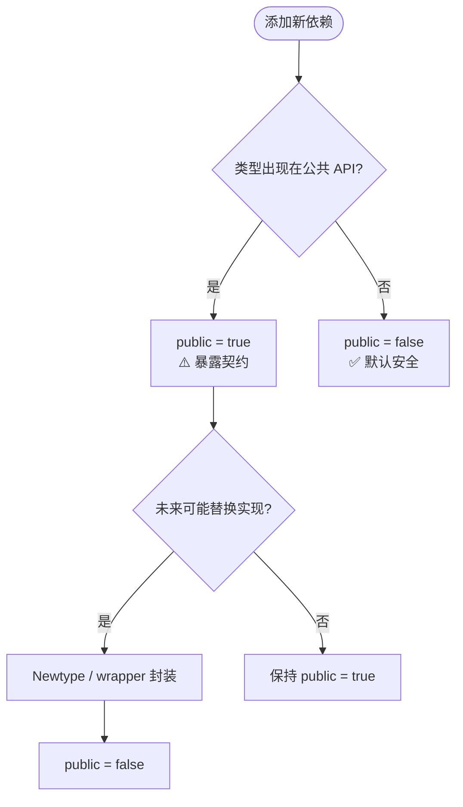

# Cargo `public = true` 与 Resolver v3

> **EN**: Cargo `public = true` Dependency Visibility and Resolver v3
> **Summary**: Declaring dependency visibility with `public = true/false`, resolver v3's MSRV-aware fallback, and their impact on API stability and feature unification.
> **来源**: [Cargo Book — Dependency Resolution](https://doc.rust-lang.org/cargo/reference/resolver.html) · [Cargo Book — Specifying Dependencies](https://doc.rust-lang.org/cargo/reference/specifying-dependencies.html) · [RFC 3516 — Public & Private Dependencies](https://github.com/rust-lang/rfcs/pull/3516) · [rust-lang/cargo#6129](https://github.com/rust-lang/cargo/issues/6129)

> > **权威来源**: 本文件为 `concept/` 权威页。
> >
## 代码示例：声明公共与私有依赖

```toml
[dependencies]
# public = true: 该依赖的类型会出现在本 crate 的公共 API 中
bitflags = { version = "2", public = true }
serde = { version = "1", features = ["derive"], public = true }

# public = false（默认）: 仅内部使用，不暴露给下游
indexmap = { version = "2", public = false }
```

```rust,ignore
// 下游 crate 可以合法使用 bitflags 类型，因为本 crate 已将其声明为 public
pub fn flags() -> MyFlags { /* ... */ }

// 错误：indexmap 是 private dependency，其类型不能出现在 pub API 中
// pub fn map() -> indexmap::IndexMap<String, i32> { ... }
```

> 完整可运行示例见 [`examples/resolver_v3_practice`](../../../examples/resolver_v3_practice/)。

---

# Cargo `public = true` 与 Resolver v3：依赖可见性的工程化

> **受众**: [进阶]
> **内容分级**: [综述级]
> **Bloom 层级**: L4-L5
> **A/S/P 标记**: **S+A** — Structure + Application
> **双维定位**: C×App — 应用依赖可见性规则
> **定位**: 解决 Rust crate 图中“依赖泄漏”问题的核心机制，使 API 稳定性与依赖演进解耦；同时说明 resolver v3 在版本选择上的 MSRV-aware 行为。
> **对标**: [Java 模块（Module）系统](https://docs.oracle.com/javase/specs/jls/se17/html/jls-7.html) `requires transitive` / `requires` · [C++ 前置声明 vs 完整包含](../../05_comparative/01_systems_languages/01_rust_vs_cpp.md)
> **定理链**: 见“五、定理链”
> **前置概念**: [Cargo Workspaces](78_cargo_workspaces.md) · [Cargo Dependency Resolution](60_cargo_dependency_resolution.md)

---

> 来源: [RFC 3516 — Public & Private Dependencies](https://github.com/rust-lang/rfcs/pull/3516) · [Cargo Book — Resolver](https://doc.rust-lang.org/cargo/reference/resolver.html) · [Cargo Book — SemVer Compatibility](https://doc.rust-lang.org/cargo/reference/semver.html) · [rust-lang/cargo#6129](https://github.com/rust-lang/cargo/issues/6129)
> **后置概念**: [Cargo Workspaces](78_cargo_workspaces.md)
> **前置依赖**: [SemVer Compatibility](https://doc.rust-lang.org/cargo/reference/semver.html)

## 📑 目录

- [Cargo `public = true` 与 Resolver v3](#cargo-public--true-与-resolver-v3)
  - [代码示例：声明公共与私有依赖](#代码示例声明公共与私有依赖)
- [Cargo `public = true` 与 Resolver v3：依赖可见性的工程化](#cargo-public--true-与-resolver-v3依赖可见性的工程化)
  - [📑 目录](#-目录)
  - [一、Resolver v3 与 v2 的差异](#一resolver-v3-与-v2-的差异)
    - [1.1 MSRV-aware 解析](#11-msrv-aware-解析)
  - [二、`public = true/false` 的语义](#二public--truefalse-的语义)
    - [2.1 默认与显式声明](#21-默认与显式声明)
    - [2.2 编译器可见性检查](#22-编译器可见性检查)
    - [2.3 SemVer 影响](#23-semver-影响)
  - [三、传递依赖可见性与 feature 统一](#三传递依赖可见性与-feature-统一)
    - [3.1 传递可见性](#31-传递可见性)
    - [3.2 feature 统一规则](#32-feature-统一规则)
  - [四、何时使用 `public = true`](#四何时使用-public--true)
  - [五、定理链](#五定理链)
  - [六、反命题与边界（反向推理）](#六反命题与边界反向推理)
  - [七、迁移与实践](#七迁移与实践)
    - [7.1 在现有 workspace 中逐步标注](#71-在现有-workspace-中逐步标注)
    - [7.2 与 `workspace.dependencies` 协同](#72-与-workspacedependencies-协同)
    - [7.3 可运行示例](#73-可运行示例)
  - [八、来源与延伸阅读](#八来源与延伸阅读)

---

## 一、Resolver v3 与 v2 的差异

Cargo 的 resolver 版本通过 `Cargo.toml` 中的 `resolver` 字段或 edition 隐式选择：

| 版本 | 默认场景 | 核心行为变化 |
|:---:|:---|:---|
| v1 | edition 2015/2018 | 全局统一 feature，不区分目标/依赖种类 |
| v2 | edition 2021 | 避免跨目标、build-dep/dev-dep、proc-macro 的 feature 统一 |
| v3 | edition 2024 / 显式 `resolver = "3"` | v2 行为 + 默认启用 MSRV-aware fallback；为 `public` 依赖语义提供基础 |

### 1.1 MSRV-aware 解析

Resolver v3 将配置项 `resolver.incompatible-rust-versions` 的默认值从 `allow` 改为 `fallback`：

- `allow`：忽略依赖的 `rust-version`，优先选最高 SemVer 兼容版本。
- `fallback`：若当前工具链或 workspace 成员的 MSRV 低于某个候选版本的 `rust-version`，则回退到更旧的兼容版本。

例如，workspace 中某个成员声明 `rust-version = "1.70"`，而最新 `serde_json` 需要 Rust 1.71+，则 resolver v3 会优先选择满足 1.70 的 `serde_json` 版本。这减少了“本地最新稳定版编译通过，但用户旧工具链失败”的问题。

> **过渡**: 理解 resolver v3 的 MSRV 行为后，下一步需要明确：resolver 选出的版本如何与 crate 的公共 API 边界交互？这正是 `public = true/false` 要回答的问题。

---

## 二、`public = true/false` 的语义

[RFC 3516](https://github.com/rust-lang/rfcs/pull/3516) 引入 `public` 字段，用于显式声明依赖是否属于 crate 的**公共 API 契约**。

### 2.1 默认与显式声明

```toml
[dependencies]
# 公共依赖：类型会出现在本 crate 的公共 API 中
bitflags = { version = "2", public = true }

# 私有依赖：仅内部实现使用（默认即为 false）
indexmap = { version = "2", public = false }
```

### 2.2 编译器可见性检查

当使用 nightly 并传入 `-Zpublic-dependency` 时，编译器会启用 `exported_private_dependencies` lint：

- `public = true` 的依赖类型可出现在 `pub` / `pub(crate)` API 中。
- `public = false` 的依赖类型**仅限私有模块（Module）**使用；若出现在公共接口中，则产生警告。

截至 Rust 1.97.0，stable Cargo 已接受 `public` 字段的语法，但会发出“ignoring `public` … pass `-Zpublic-dependency`”警告并忽略其语义；完整强制执行仍依赖 nightly。

### 2.3 SemVer 影响

| 变更 | `public = true` | `public = false` |
|:---|:---:|:---:|
| 升级 major 版本 | 🔴 Breaking | 🟢 Non-breaking（对下游不可见） |
| 移除依赖 | 🔴 Breaking | 🟢 Non-breaking |
| 新增依赖 | 🟢 Non-breaking | 🟢 Non-breaking |
| 改变 feature 集合 | 🔴 可能 Breaking | 🟢 通常 Non-breaking |

> **过渡**: `public` 标记不仅改变单 crate 的 API 边界，还会通过依赖链传播可见性；理解传播规则才能正确设计多层 workspace。

---

## 三、传递依赖可见性与 feature 统一

### 3.1 传递可见性

```text
modern-app ──public──► legacy-lib ──public──► bitflags
```

- 因为 `legacy-lib` 将 `bitflags` 声明为 `public = true`，`legacy-lib` 的公共 API 可以暴露 `bitflags` 类型。
- 因为 `modern-app` 将 `legacy-lib` 声明为 `public = true`，`modern-app` 的公共 API 可以进一步暴露 `legacy_lib::LegacyFlags`。
- 若 `modern-app` 将 `legacy-lib` 标为 `public = false`，则 `modern-app` 的公共 API 中出现 `LegacyFlags` 会触发 lint。

### 3.2 feature 统一规则

Cargo 的 feature 系统默认采用**并集统一**：若多个 crate 对同一依赖启用不同 feature，则该依赖被构建为所有 feature 的并集。

> **过渡**: 从“公共/私有类型可见性”推进到“feature 统一”，需要意识到：公共依赖的类型跨 crate 传递时，必须保证编译单元一致；而私有依赖的 feature 不应污染无关子树。

Resolver v3 配合 `public-dependency` 启用后，统一规则进一步细化：

- **公共依赖**：其 feature 集合在整个公共依赖链中统一。因为公共类型在不同 crate 间传递，必须保证是同一个编译单元。
- **私有依赖**：其 feature 集合仅在“拥有”该私有依赖的子树中统一；不同子树可以拥有不同的 feature 集合，从而允许依赖被构建多次以避免非局部 feature 污染。

在 stable 上，由于 `public` 字段被忽略，当前行为等价于“全部统一”。

---

## 四、何时使用 `public = true`

使用决策流程：



**原则**：默认私有，只在类型确实进入公共 API 时显式公开。对频繁变更的实现细节，优先用 newtype 封装，保持依赖私有。

---

## 五、定理链

| 定理 | 前提 | 结论 | 置信度 |
|:---|:---|:---|:---:|
| Resolver v3 启用 `fallback` ⟹ MSRV 兼容版本优先 | workspace 存在 `rust-version` 约束 | 依赖解析不会选择超过成员 MSRV 的版本 | 高 |
| `public = true` 声明 ⟹ 依赖类型可进入公共 API | 依赖被显式标记为 public | 编译器允许在 `pub` 项中使用该依赖类型 | 高（nightly 完整启用） |
| `public = false` 声明 ⟹ 内部实现自由演进 | 依赖类型未进入公共 API | 升级/移除该依赖不会破坏下游编译 | 高 |
| 公共依赖链传递 ⟹ 版本与 feature 统一 | 上游 crate 将依赖标为 public | 下游使用同一版本与 feature 集合，避免类型不匹配 | 中（待 stable 完全启用） |

---

## 六、反命题与边界（反向推理）

从“结论”倒推边界，避免误用：

1. **不是“所有依赖都应该 public = true”**。过度公开会把内部实现细节锁定为公共契约，导致微小升级也变成 SemVer breaking change。
2. **不是“public = false 就能阻止所有泄漏”**。如果通过 `pub use`、`pub fn` 参数或返回类型间接暴露了私有依赖的类型，lint 仍会触发；必须配合 newtype 或 wrapper 真正隐藏类型。
3. **不是“resolver v3 自动解决版本冲突”**。MSRV-aware fallback 只是在满足约束的前提下优先选低版本；若多个成员要求不兼容的版本范围，resolver 仍会报错。
4. **不是“stable 已启用 public 依赖检查”**。当前 stable 仅解析语法并忽略语义，CI 若要强制检查需使用 nightly + `-Zpublic-dependency`。

---

## 七、迁移与实践

### 7.1 在现有 workspace 中逐步标注

1. 先用 nightly 运行 `cargo check -Zpublic-dependency --workspace` 收集 `exported_private_dependencies` 警告。
2. 对确实进入公共 API 的依赖，在 `Cargo.toml` 中加上 `public = true`。
3. 对内部实现依赖，显式保留 `public = false`，并重构公共 API 中意外暴露的私有类型。

### 7.2 与 `workspace.dependencies` 协同

```toml
[workspace.dependencies]
bitflags = { version = "2" }
serde = { version = "1" }

[dependencies]
bitflags = { workspace = true, public = true }
serde = { workspace = true, public = false, features = ["derive"] }
```

`public` 可以在成员 crate 的依赖声明中覆盖，不影响 workspace 级别的统一版本。

### 7.3 可运行示例

- **feature unification 与 `public = true` 的最小可运行演示**：[`crates/c17_resolver_v3_public_demo`](../../../crates/c17_resolver_v3_public_demo/)，配套概念说明见 [Resolver v3 与 `public = true` 的 feature unification 演示](11_resolver_v3_public_feature_unification.md)。
- **resolver v3 MSRV-aware 解析演示**：[`examples/resolver_v3_practice`](../../../examples/resolver_v3_practice/)。

---

## 八、来源与延伸阅读

- **一级**: [RFC 3516 — Public & Private Dependencies](https://github.com/rust-lang/rfcs/pull/3516)
- **一级**: [Cargo Book — Dependency Resolution](https://doc.rust-lang.org/cargo/reference/resolver.html)
- **二级**: [rust-lang/cargo#6129](https://github.com/rust-lang/cargo/issues/6129) — Public/Private Dependencies Tracking Issue
- **二级**: [Cargo Book — SemVer Compatibility](https://doc.rust-lang.org/cargo/reference/semver.html)
- **三级**: [cargo-semver-checks 文档](https://docs.rs/cargo-semver-checks) — SemVer 自动化检查工具

**文档版本**: 1.0
**Rust 版本**: 1.97.0 (stable) / nightly with `-Zpublic-dependency`
**最后更新**: 2026-07-09

---

## 国际权威参考 / International Authority References（P0 官方 · P1 学术 · P2 生态）

> 依据 `AGENTS.md` §2「对齐网络国际化权威内容」补充：仅追加已验证可达的权威链接，不改动正文事实。

- **P1 学术/形式化**: [Rudra: Finding Memory Safety Bugs in Rust at the Ecosystem Scale (SOSP 2021)](https://dl.acm.org/doi/10.1145/3477132.3483570)
