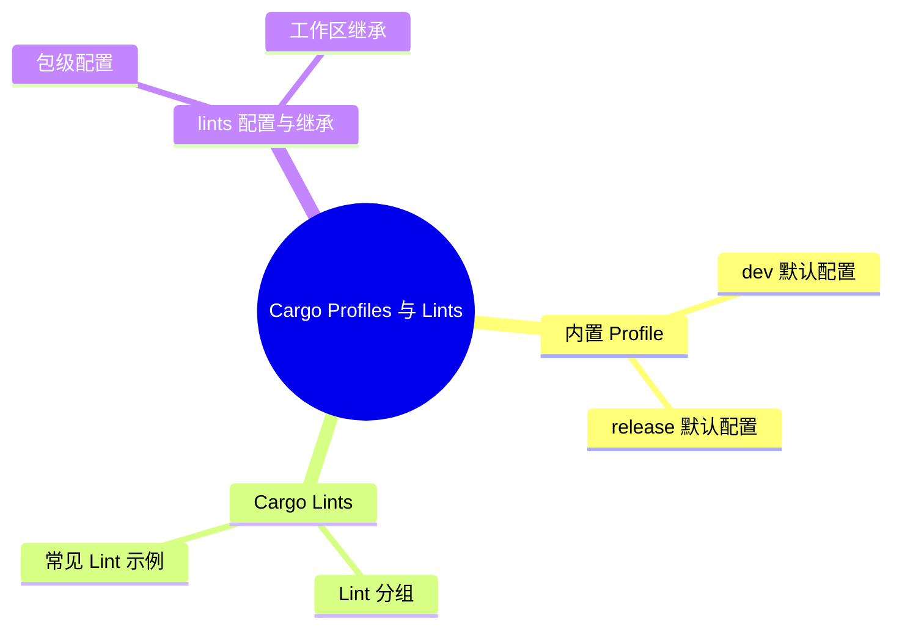

> **内容分级**: [综述级]
> **本节关键术语**: Profile · `opt-level` · LTO · `codegen-units` · Custom Profile · Build Override · Cargo Lint · Lint Group · `[lints]` — [完整对照表](../../00_meta/01_terminology/01_terminology_glossary.md)
>
# Cargo Profiles 与 Lints

> **EN**: Cargo Profiles and Lints
> **Summary**: Explains Cargo's built-in and custom profiles, profile overrides, and the Cargo `[lints]` table including lint groups and workspace inheritance.
> **Rust 版本**: 1.97.0+ (Edition 2024)
> **受众**: [中级 → 高级]
> **Bloom 层级**: L2-L3
> **权威来源**: 本文件为 `concept/` 权威页。
> **A/S/P 标记**: **A** — Application
> **双维定位**: E×Tool — 工具链与生态系统
> **定位**: 把“如何调优编译参数”和“如何在 Cargo.toml 中统一管理 lint”讲清楚，覆盖 Profile 与 Cargo 自有 lint 两层机制。
> **前置概念**: [Rust vs C++](../../05_comparative/01_systems_languages/01_rust_vs_cpp.md)
> **后置概念**: [Cargo Authentication and Cache](09_cargo_authentication_and_cache.md) · [DevOps and CI/CD](../00_toolchain/03_devops_and_ci_cd.md)

---

> **来源**: [Cargo — Profiles](https://doc.rust-lang.org/cargo/reference/profiles.html) · [Cargo — Lints](https://doc.rust-lang.org/cargo/reference/manifest.html#the-lints-table) · [Rust Reference](https://doc.rust-lang.org/reference/introduction.html) · [TRPL](https://doc.rust-lang.org/book/title-page.html) · [Brown University — Interactive Rust Book](https://rust-book.cs.brown.edu/) · [Jung et al. — RustBelt: Securing the Foundations of Rust](https://plv.mpi-sws.org/rustbelt/popl18/) · [Itanium C++ ABI](https://itanium-cxx-abi.github.io/cxx-abi/abi.html)
> [Cargo Book — Lints](https://doc.rust-lang.org/cargo/reference/lints.html) ·
> [The Cargo Book](https://doc.rust-lang.org/cargo/index.html)`](<https://doc.rust-lang.org/cargo/reference/manifest.html#the-lints-section>)

---

## 📑 目录

- [Cargo Profiles 与 Lints](#cargo-profiles-与-lints)
  - [📑 目录](#-目录)
  - [一、Profile 是什么](#一profile-是什么)
  - [二、内置 Profile](#二内置-profile)
    - [`dev` 默认配置](#dev-默认配置)
    - [`release` 默认配置](#release-默认配置)
  - [三、Profile 常用设置](#三profile-常用设置)
  - [四、自定义 Profile](#四自定义-profile)
  - [五、Profile Overrides](#五profile-overrides)
  - [六、Cargo Lints](#六cargo-lints)
    - [Lint 分组](#lint-分组)
    - [常见 Lint 示例](#常见-lint-示例)
  - [七、`[lints]` 配置与继承](#七lints-配置与继承)
    - [包级配置](#包级配置)
    - [工作区继承](#工作区继承)
  - [嵌入式测验](#嵌入式测验)
    - [测验 1：`cargo test` 默认使用哪个 profile？](#测验-1cargo-test-默认使用哪个-profile)
    - [测验 2：自定义 profile 必须指定哪个字段？](#测验-2自定义-profile-必须指定哪个字段)
    - [测验 3：Profile override 不能设置哪三个字段？](#测验-3profile-override-不能设置哪三个字段)
    - [测验 4：Cargo lints 在 Rust 1.96 上是什么状态？](#测验-4cargo-lints-在-rust-196-上是什么状态)
  - [权威来源索引](#权威来源索引)
  - [⚠️ 反例与陷阱](#️-反例与陷阱)
  - [国际权威参考 / International Authority References（P1 学术 · P2 生态）](#国际权威参考--international-authority-referencesp1-学术--p2-生态)

---

## 一、Profile 是什么

Profile 是 Cargo 中一组编译器设置，控制优化级别、调试信息、LTO、panic 策略等。Cargo 根据命令自动选择 profile：

| 命令 | 默认 Profile |
|:---|:---|
| `cargo build` | `dev` |
| `cargo build --release` | `release` |
| `cargo test` | `test`（继承 `dev`） |
| `cargo bench` | `bench`（继承 `release`） |

> [Cargo Book — Profiles](https://doc.rust-lang.org/cargo/index.html)(<https://doc.rust-lang.org/cargo/reference/profiles.html>)

---

## 二、内置 Profile

内置 profile 的默认配置反映用途差异：`dev` 默认 `opt-level = 0` + `debug = true` + 增量编译开启（编译速度优先）；`release` 默认 `opt-level = 3` + `debug = false` + 增量关闭（运行性能优先）。另有 `test`（继承 dev + 测试 harness）与 `bench`（继承 release）。理解默认值的意义：多数“release 比 debug 快 N 倍”的差异来自 opt-level 与 debug assertions，调优时应逐项覆盖默认而非整体重写 profile。

### `dev` 默认配置

```toml
[profile.dev]
opt-level = 0
debug = true
overflow-checks = true
lto = false
panic = "unwind"
incremental = true
codegen-units = 256
```

### `release` 默认配置

```toml
[profile.release]
opt-level = 3
debug = false
overflow-checks = false
lto = false
panic = "unwind"
incremental = false
codegen-units = 16
```

> **关键洞察**: `dev` 追求编译速度，`release` 追求运行时（Runtime）性能；两者是日常开发中最常用的 profile。

---

## 三、Profile 常用设置

| 设置 | 作用 | 常见取值 |
|:---|:---|:---|
| `opt-level` | 优化级别 | `0`/`1`/`2`/`3`/`"s"`/`"z"` |
| `debug` | 调试信息 | `true`/`false`/`"full"`/`"line-tables-only"` |
| `lto` | 链接时优化 | `true`/`"fat"`/`"thin"`/`false`/`"off"` |
| `panic` | panic 策略 | `"unwind"`/`"abort"` |
| `codegen-units` | 代码生成单元数 | 正整数 |
| `incremental` | 增量编译 | `true`/`false` |
| `overflow-checks` | 整数溢出检查 | `true`/`false` |
| `strip` | 剥离符号/调试信息 | `"none"`/`"debuginfo"`/`"symbols"` |

> **注意**: Profile 只在 workspace 根的 `Cargo.toml` 生效；依赖中的 profile 设置会被忽略。

---

## 四、自定义 Profile

```toml
[profile.release-lto]
inherits = "release"
lto = true
codegen-units = 1
```

使用：

```bash
cargo build --profile release-lto
# 输出到 target/release-lto/
```

- 必须指定 `inherits`；
- 输出目录名与 profile 名相同；
- 适合为 CI、部署、调试等场景定制专门配置。

---

## 五、Profile Overrides

可以对特定包或构建时依赖单独设置：

```toml
# 只对 foo 包提高优化级别
[profile.dev.package.foo]
opt-level = 3

# 对所有非工作区依赖设置
[profile.dev.package."*"]
opt-level = 2

# 对 build scripts / proc macros 设置
[profile.dev.build-override]
opt-level = 3
```

优先级（从高到低）：

1. 命名包 `[profile.dev.package.name]`
2. 通配非工作区成员 `[profile.dev.package."*"]`
3. `build-override`
4. 当前 profile 默认设置
5. Cargo 内置默认值

> **限制**: Override 不能设置 `panic`、`lto`、`rpath`。
>
> [Cargo Book — Overrides](https://doc.rust-lang.org/cargo/index.html)(<https://doc.rust-lang.org/cargo/reference/profiles.html#overrides>)

---

## 六、Cargo Lints

Cargo 自带一套 lint，用于检查 `Cargo.toml` 本身的问题。截至 Rust 1.96，Cargo lints 仍为**仅每日构建版**。

### Lint 分组

| 组 | 说明 | 默认级别 |
|:---|:---|:---:|
| `cargo::complexity` | 把简单事情复杂化 | warn |
| `cargo::correctness` | 明显错误或无用的配置 | deny |
| `cargo::perf` | 可提升性能的配置 | warn |
| `cargo::style` | 不符合惯用法的配置 | warn |
| `cargo::suspicious` | 很可能错误的配置 | warn |
| `cargo::pedantic` | 严格或可能有误报 | allow |
| `cargo::nursery` | 开发中 | allow |
| `cargo::restriction` | 限制 Cargo 特性使用 | allow |

### 常见 Lint 示例

- `unused_dependencies`: 未使用的依赖；
- `unused_workspace_dependencies`: 工作区声明但未继承的依赖；
- `implicit_minimum_version_req`: 版本要求未显式写全 `major.minor.patch`；
- `redundant_readme`: `readme = "README.md"` 可推断。

---

## 七、`[lints]` 配置与继承

`[lints]` 的两层配置有明确分工：包级 `[lints.clippy] all = "warn"` 只影响当前 crate；工作区根 `[workspace.lints]` 定义基线，成员以 `[lints] workspace = true` 继承。继承模型的关键规则：成员不能在继承后逐项覆盖单个 lint（要么全继承要么全自定义），因此基线应定义为团队共识的最低集，个别 crate 的额外要求用包级全量定义。这与 `[package] version.workspace = true` 的继承机制一致。

### 包级配置

```toml
[lints.rust]
unsafe_code = "forbid"

[lints.clippy]
enum_glob_use = "deny"

[lints.cargo]
unused_dependencies = "warn"
```

### 工作区继承

工作区根：

```toml
[workspace.lints.rust]
unsafe_code = "forbid"
```

成员包：

```toml
[lints]
workspace = true
```

> **注意**: `lints.rust` 控制 rustc lint；`lints.clippy` 控制 Clippy；`lints.cargo` 控制 Cargo 自身 lint。Cargo lints 目前需每日构建版工具链。
>
> [Cargo Book — Lints](https://doc.rust-lang.org/cargo/index.html)(<https://doc.rust-lang.org/cargo/reference/lints.html>)

---

## 嵌入式测验

本节将「嵌入式测验」分解为若干主题：测验 1：`cargo test` 默认使用哪个 profile？、测验 2：自定义 profile 必须指定哪个字段？、测验 3：Profile override 不能设置哪三个字段？与测验 4：Cargo lints 在 Rust 1.96 上是什么状态？。

### 测验 1：`cargo test` 默认使用哪个 profile？

<details>
<summary>✅ 答案与解析</summary>

`test` profile，它继承自 `dev` profile。

</details>

---

### 测验 2：自定义 profile 必须指定哪个字段？

<details>
<summary>✅ 答案与解析</summary>

`inherits`，用于指定继承哪个内置 profile 的默认设置。

</details>

---

### 测验 3：Profile override 不能设置哪三个字段？

<details>
<summary>✅ 答案与解析</summary>

不能设置 `panic`、`lto`、`rpath`。

</details>

---

### 测验 4：Cargo lints 在 Rust 1.96 上是什么状态？

<details>
<summary>✅ 答案与解析</summary>

Cargo lints 目前仍为仅每日构建版的不稳定特性，需要在每日构建版工具链上使用。

</details>

---

## 权威来源索引

| 来源 | 可信度 | 说明 |
|:---|:---:|:---|
| [Cargo Book — Profiles](https://doc.rust-lang.org/cargo/reference/profiles.html) | ✅ 一级 | Profile 官方文档 |
| [Cargo Book — Lints](https://doc.rust-lang.org/cargo/reference/lints.html) | ✅ 一级 | Cargo lints 官方文档 |
| [The Cargo Book](https://doc.rust-lang.org/cargo/index.html)`](<https://doc.rust-lang.org/cargo/reference/manifest.html#the-lints-section>) | ✅ 一级 | `[lints]` 官方文档 |

---

> **权威来源**: [Cargo Book](https://doc.rust-lang.org/cargo/index.html)
> **权威来源对齐变更日志**: 2026-06-21 创建，对齐 Rust 1.97.0 / Cargo profiles & lints

**文档版本**: 1.0
**最后更新**: 2026-06-21
**状态**: ✅ 已对齐 Cargo Book profiles / lints 文档

---

## ⚠️ 反例与陷阱

**反例：在非 workspace 根的成员 crate 中配置 `[profile]`。**

```toml
# crates/member/Cargo.toml —— 此配置被静默忽略！
[profile.release]
opt-level = 2
```

cargo 只认 **workspace 根**的 `[profile]`；成员 crate 中的同名节在较新版本会发 warning（旧版本完全静默），导致「优化级别改了但没生效」的排查陷阱。`[lints]` 同理：成员 crate 必须用 `[lints] workspace = true` 继承根的 `[workspace.lints]`。

**修正对照**：

```toml
# workspace 根 Cargo.toml
[profile.release]
opt-level = 2

[workspace.lints.rust]
unsafe_code = "deny"

# 成员 crate
[lints]
workspace = true
```

**陷阱要点**：profile/lints 的「根唯一」规则是 workspace 一致性的保证；排查优化或 lint 未生效时，第一嫌疑永远是配置写错了文件。

---

## 国际权威参考 / International Authority References（P1 学术 · P2 生态）

> 依据 `AGENTS.md` §2「对齐网络国际化权威内容」补充：仅追加已验证可达的权威链接，不改动正文事实。

- **P2 生态/社区**: [docs.rs/semver — 生态权威 API 文档](https://docs.rs/semver) · [docs.rs/toml — 生态权威 API 文档](https://docs.rs/toml)

---

## 🧭 思维导图（Mindmap）



> **认知功能**: 本 mindmap 从本页「Cargo Profiles 与 Lints」的章节结构提炼，一级分支对应核心主题，叶子节点为关键子概念，可作为本页的快速导航与复习索引。
