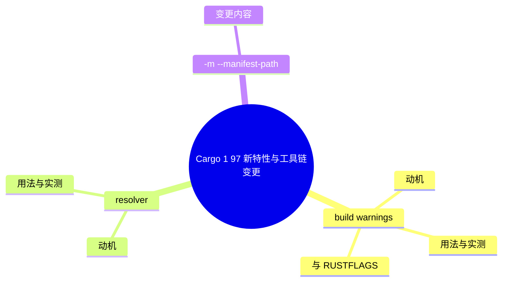

# Cargo 1.97 新特性与工具链变更

> **EN**: Cargo 1.97 Feature Highlights
> **Summary**: Systematic coverage of Cargo changes stabilized in Rust 1.97: `build.warnings` configuration, `resolver.lockfile-path`, the `-m` short flag for `--manifest-path`, `cargo clean` target-directory validation, and removal of the `curl` dependency from `crates-io`. All examples verified against local Cargo 1.97.0.
> **Rust 版本**: 1.97.0+ (Edition 2024)
> **受众**: [进阶 / 工程]
> **内容分级**: [专家级]
> **Bloom 层级**: L2-L3
> **权威来源**: 本文件为 `concept/` 权威页。
> **A/S/P 标记**: **A** — Application
> **双维定位**: P×App — 将 Cargo 1.97 工具链变更应用于 CI 强化、锁文件治理与误删防护
> **前置概念**: · [Rust vs Go](../../05_comparative/01_systems_languages/03_rust_vs_go.md) [Toolchain](../00_toolchain/01_toolchain.md) · [Cargo 1.96 新特性](04_cargo_196_features.md) · [Cargo Configuration](18_cargo_configuration.md) · [Cargo Commands Reference](19_cargo_commands_reference.md)
> **后置概念**: [Rust Version Tracking](../../07_future/00_version_tracking/01_rust_version_tracking.md) · [Rust 1.97 Stabilized](../../07_future/00_version_tracking/rust_1_97_stabilized.md)
> **版本状态**: 当前稳定 patch 为 **1.97.0**；本页特性集即 Rust 1.97.0 的 Cargo 变更。
> **实测环境**: `cargo 1.97.0 (c980f4866 2026-06-30)`，Windows x86_64，2026-07-12 实测。

---

> **来源**: [Rust 1.97.0 Release Notes](../../07_future/00_version_tracking/rust_1_97_stabilized.md)（本库权威汇总） · [Cargo CHANGELOG](https://github.com/rust-lang/cargo/blob/master/CHANGELOG.md) · [Cargo Book — Configuration](https://doc.rust-lang.org/cargo/reference/config.html) · [Cargo Book — Environment Variables](https://doc.rust-lang.org/cargo/reference/environment-variables.html)
> **国际权威来源（2026-07-13 补录）**: **P1** [Bae et al. — RUDRA（SOSP 2021）](https://dl.acm.org/doi/10.1145/3477132.3483570)（以 crates.io 全量包为对象的生态级分析） · **P2** [Rust Blog — Announcing Rust 1.97.0](https://blog.rust-lang.org/2026/07/09/Rust-1.97.0/)（curl 200 实测 2026-07-13，ACM 反爬注记同前页）

---

## 📑 目录

- [Cargo 1.97 新特性与工具链变更](#cargo-197-新特性与工具链变更)
  - [📑 目录](#-目录)
  - [一、特性总览](#一特性总览)
  - [二、`build.warnings`：不失效缓存的警告级别控制](#二buildwarnings不失效缓存的警告级别控制)
    - [2.1 动机](#21-动机)
    - [2.2 用法与实测](#22-用法与实测)
    - [2.3 与 `RUSTFLAGS="-Dwarnings"` 的对比](#23-与-rustflags-dwarnings-的对比)
  - [三、`resolver.lockfile-path`：自定义锁文件路径](#三resolverlockfile-path自定义锁文件路径)
    - [3.1 动机](#31-动机)
    - [3.2 用法与实测](#32-用法与实测)
  - [四、`-m`：`--manifest-path` 的短旗标](#四-m--manifest-path-的短旗标)
    - [4.1 变更内容](#41-变更内容)
    - [4.2 实测与位置陷阱](#42-实测与位置陷阱)
  - [五、`cargo clean` 目标目录校验](#五cargo-clean-目标目录校验)
    - [5.1 动机](#51-动机)
    - [5.2 实测行为](#52-实测行为)
  - [六、`crates-io` 移除 `curl` 依赖](#六crates-io-移除-curl-依赖)
  - [七、迁移建议与陷阱](#七迁移建议与陷阱)
  - [🧭 思维导图（Mindmap）](#-思维导图mindmap)
  - [⚠️ 反例与陷阱](#️-反例与陷阱)
    - [反例：常量求值溢出（rustc 1.97.0，--edition 2024 实测）](#反例常量求值溢出rustc-1970--edition-2024-实测)
    - [✅ 修正：拓宽整数类型或使用 checked 运算](#-修正拓宽整数类型或使用-checked-运算)

---

## 一、特性总览

Rust 1.97 的 Cargo 变更集中在"CI 可控性"与"防误操作"两条主线：

| 特性 | 用户可见变化 | 典型应用场景 |
|:---|:---|:---|
| **`build.warnings` 配置** | `[build] warnings = "deny"` 或 `CARGO_BUILD_WARNINGS` 统一控制本地包警告级别 | CI 强制零警告，且不使构建缓存失效 |
| **`resolver.lockfile-path` 配置** | 锁文件可放在 `Cargo.toml` 之外的路径 | 只读源码目录、单仓库多 lockfile（如按通道分离） |
| **`-m` 短旗标** | `cargo check -m path/to/Cargo.toml` 等价于 `--manifest-path` | 脚本与 monorepo 中跨 crate 调用的简写 |
| **`cargo clean` 目标目录校验** | `--target-dir` 指向非 Cargo 产物目录时拒绝执行 | 防止 `cargo clean` 误删无关目录 |
| **`crates-io` 移除 `curl`** | Cargo 内部网络栈不再依赖 libcurl | 减少构建依赖与平台行为差异 |

> **关键洞察**: 1.97 的 Cargo 没有引入新的解析模型或清单字段，而是把既有实践（CI deny warnings、多 lockfile、防误删）沉淀为一等配置——这是对大规模 monorepo 与企业 CI 反馈的直接回应。

---

## 二、`build.warnings`：不失效缓存的警告级别控制

本节解析 `build.warnings`：2.1 说明「警告不失效增量缓存」的动机，2.2 给出用法与 rustc 实测行为。

### 2.1 动机

在 1.97 之前，CI 中强制"零警告"的标准做法是 `RUSTFLAGS="-Dwarnings"`。这有两个副作用：

1. **构建缓存失效**：`RUSTFLAGS` 参与构建指纹计算，改一次 flags 全量重编，包括所有依赖；
2. **波及依赖 crate**：`-Dwarnings` 通过 rustc 作用于整个编译单元集合，第三方依赖的警告也会使构建失败（实践中只能靠 cap-lints 兜底）。

`build.warnings` 由 Cargo 在**驱动层**实现：只对本地包（path/workspace 成员）提升警告级别，不改动 rustc 调用指纹，因此不冲刷缓存，也不影响依赖。

### 2.2 用法与实测

```toml
# .cargo/config.toml
[build]
warnings = "deny"   # 取值: "allow" | "warn"（默认） | "deny"
```

环境变量 `CARGO_BUILD_WARNINGS` 可覆盖配置，适合 CI 与本地临时切换：

```bash
# CI：拒绝本地包的所有警告，--keep-going 收集全部结果而非停在第一个失败包
CARGO_BUILD_WARNINGS=deny cargo check --keep-going

# 本地开发：临时静默警告
CARGO_BUILD_WARNINGS=allow cargo check
```

实测（cargo 1.97.0，含 `unused_variables` 警告的 lib crate）：

```text
$ CARGO_BUILD_WARNINGS=deny cargo check
warning: unused variable: `unused_var`
...
error: `demo` (lib) generated 1 warning
error: warnings are denied by `build.warnings` configuration
```

```text
$ CARGO_BUILD_WARNINGS=allow cargo check
    Finished `dev` profile [unoptimized + debuginfo] target(s) in 0.00s
```

### 2.3 与 `RUSTFLAGS="-Dwarnings"` 的对比

| 维度 | `RUSTFLAGS="-Dwarnings"` | `build.warnings = "deny"` |
|:---|:---|:---|
| 作用范围 | 所有编译单元（含依赖，受 cap-lints 限制） | 仅本地包 |
| 构建缓存 | flags 变化即全量失效 | 不影响指纹 |
| 配置位置 | 环境变量 / `build.rustflags` | `[build]` 配置 / `CARGO_BUILD_WARNINGS` |
| 推荐场景 | 快速 smoke check | CI 常驻零警告策略 |

> 本项目的 CI 质量门 3（`cargo clippy --workspace -- -D warnings`）属于前者；`build.warnings` 提供的是仓库级、低缓存成本的补充手段。

---

## 三、`resolver.lockfile-path`：自定义锁文件路径

本节解析 `resolver.lockfile-path`：3.1 说明多锁文件场景的动机，3.2 给出用法与实测效果。

### 3.1 动机

Cargo 历来把 `Cargo.lock` 固定放在 workspace 根（与根 `Cargo.toml` 同级）。两类场景因此受限：

- **只读源码目录**：源码挂载为只读（容器、打包系统）时无法写锁文件；
- **单仓库多 lockfile**：例如为不同工具链通道或不同部署目标各维护一份锁文件做差异审计。

`resolver.lockfile-path` 允许把锁文件路径改为配置项。

### 3.2 用法与实测

```toml
# .cargo/config.toml
[resolver]
lockfile-path = "alt/Cargo.lock"
```

实测（cargo 1.97.0）：

```text
$ cargo generate-lockfile
$ ls alt/
Cargo.lock
```

锁文件按配置写入 `alt/Cargo.lock` 而非 workspace 根。注意该路径相对**工作目录**解析，在 CI 中建议用绝对路径或固定在仓库根执行。

> 与 1.96 的 `pubtime`（[Cargo 1.96 新特性](04_cargo_196_features.md)）配合时，多份 lockfile 可分别记录依赖发布时间线，用于按通道做冷却策略审计。

---

## 四、`-m`：`--manifest-path` 的短旗标

本节介绍 `-m` 短旗标：4.1 列出变更内容，4.2 实测并指出与 shell 解析相关的位置陷阱。

### 4.1 变更内容

1.97 为各 Cargo 子命令的 `--manifest-path <PATH>` 增加短旗标 `-m`。对 monorepo 脚本和跨 crate 调用是高频简写。

### 4.2 实测与位置陷阱

```text
$ cargo check -m Cargo.toml
    Finished `dev` profile [unoptimized + debuginfo] target(s) in 0.00s
```

**位置陷阱**：`-m` 是**子命令级**旗标，必须放在子命令之后。把它放在 `cargo` 与子命令之间不会被接受：

```text
$ cargo -m Cargo.toml check
error: unexpected argument ...
       cargo [+toolchain] [OPTIONS] -Zscript <MANIFEST_RS> [ARGS]...
```

正确形式：

```bash
cargo check -m ./crates/foo/Cargo.toml     # ✅ 子命令之后
cargo build --manifest-path Cargo.toml     # ✅ 长形式仍然可用
```

---

## 五、`cargo clean` 目标目录校验

本节解析 `cargo clean` 的目标目录校验：5.1 说明防误删的动机，5.2 实测校验触发与豁免行为。

### 5.1 动机

`cargo clean --target-dir <dir>` 会直接删除 `<dir>`。在脚本拼接路径出错（变量为空、拼接错位）时，历史上可能删掉与构建无关的目录。1.97 增加了"该目录是否确为 Cargo target 目录"的校验。

### 5.2 实测行为

对一个手工创建、只含 `file.txt` 的目录执行清理（cargo 1.97.0 实测）：

```text
$ cargo clean --target-dir /tmp/c197/notatarget
error: cannot clean `.../notatarget`: missing or invalid `CACHEDIR.TAG` file
  |
  = note: cleaning has been aborted to prevent accidental deletion of unrelated files
```

校验依据是 Cargo 写入 target 目录根的 `CACHEDIR.TAG` 标记文件（该文件同时向备份工具声明"此目录可跳过"）。缺失或损坏即拒绝清理。

> **迁移注意**：极少数把 target 目录内容复制/迁移到新路径的部署脚本，若漏掉 `CACHEDIR.TAG`，1.97 起 `cargo clean` 会拒绝工作——保留该文件即可。

---

## 六、`crates-io` 移除 `curl` 依赖

Cargo 内部的 `crates-io` crate 在 1.97 不再依赖 `curl`，网络请求统一走 Cargo 自身的 HTTP 实现。这是**内部重构**，用户可见的影响是间接的：

| 影响面 | 说明 |
|:---|:---|
| 构建依赖 | 源码编译 Cargo 时不再需要 libcurl/OpenSSL 的系统绑定 |
| 平台行为 | 减少了因系统 curl 版本差异导致的 TLS/代理行为分叉 |
| 排障 | `CARGO_HTTP_*` 系列配置与 `net.*` 配置项语义不变，但"用 curl 复现 registry 请求"的调试习惯不再反映 Cargo 实际网络栈 |

---

## 七、迁移建议与陷阱

| 建议 / 陷阱 | 说明 |
|:---|:---|
| CI 引入 `CARGO_BUILD_WARNINGS=deny` | 与 `cargo clippy -- -D warnings` 互补：前者零缓存成本，后者覆盖 clippy lint |
| 多 lockfile 先小范围试点 | `lockfile-path` 改变后，`--locked` CI 检查要同步指向新路径 |
| `-m` 只放在子命令后 | `cargo -m ... check` 不合法；脚本中统一用 `cargo <cmd> -m <path>` |
| 保留 `CACHEDIR.TAG` | 迁移/缓存 target 目录时连同标记文件一起复制，否则 `cargo clean` 拒绝执行 |
| curl 复现网络问题的旧脚本 | 1.97 起 Cargo 不走 libcurl，改用 `CARGO_LOG=cargo::sources::registry=debug` 观察请求 |

---

> **关联阅读**: [Cargo 1.96 新特性](04_cargo_196_features.md) · [Cargo Configuration](18_cargo_configuration.md) · [Rust 1.97 稳定特性](../../07_future/00_version_tracking/rust_1_97_stabilized.md)
>
> **向下对比（L5）**: [Rust vs Go — 工具链与模块代理的工程哲学对比](../../05_comparative/01_systems_languages/03_rust_vs_go.md)（Cargo vs Go Modules 在依赖解析与供应链治理上的设计取舍）

---

## 🧭 思维导图（Mindmap）



> **认知功能**: 本 mindmap 从本页「Cargo 1 97 新特性与工具链变更」的章节结构提炼，一级分支对应核心主题，叶子节点为关键子概念，可作为本页的快速导航与复习索引。

## ⚠️ 反例与陷阱

新版本对常量求值的检查只严不松：编译期溢出是硬错误。

### 反例：常量求值溢出（rustc 1.97.0，--edition 2024 实测）

```rust,compile_fail,E0080
const X: u8 = 255 + 1; // ❌ 常量求值溢出

fn main() {
    let _ = X;
}
```

**实测错误**：`error[E0080]: attempt to compute`u8::MAX + 1_u8`, which would overflow`。

### ✅ 修正：拓宽整数类型或使用 checked 运算

```rust
const X: u16 = 255 + 1; // ✅ 拓宽类型容纳结果

fn main() {
    let _ = X;
}
```
