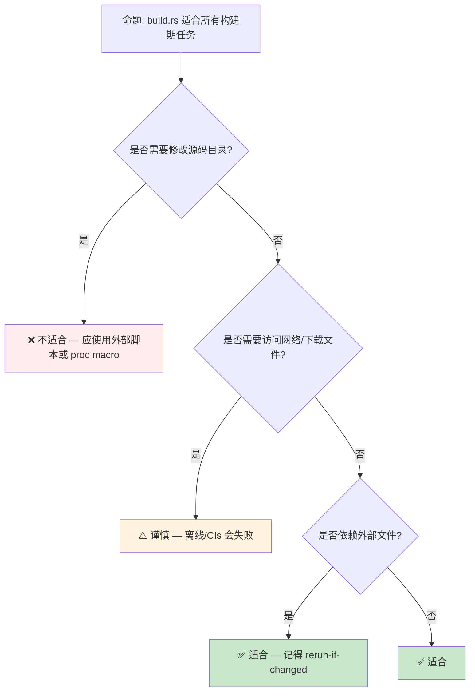

> **内容分级**: [综述级]
> [综述级]
> **本节关键术语**: Build Script · `build.rs` · `OUT_DIR` · `rerun-if-changed` · `links` · Native Dependency · `build-dependencies` — [完整对照表](../../00_meta/01_terminology/terminology_glossary.md)
>
# Cargo Build Scripts（`build.rs`）

> **EN**: Cargo Build Scripts (`build.rs`)
> **Summary**: A comprehensive guide to `build.rs`: when it runs, how to pass `cfg`/env vars to the main crate, how to link native libraries, and common pitfalls.
> **受众**: [进阶 / 工程]
> **Bloom 层级**: 理解 → 应用
> **A/S/P 标记**: **A** — Application
> **双维定位**: T×Ops — 工具链与运维构建
> **定位**: 把 `build.rs` 从“神秘的编译前脚本”还原为可预测、可调试、可重用的构建阶段工具。
> **前置概念**: [Rust vs C++](../../05_comparative/01_systems_languages/01_rust_vs_cpp.md)
> **后置概念**: [Cargo Registries and Publishing](62_cargo_registries_and_publishing.md) · [DevOps and CI/CD](../00_toolchain/28_devops_and_ci_cd.md)

---

> **来源**:
>
> [Cargo — Build Scripts](https://doc.rust-lang.org/cargo/reference/build-scripts.html) ·
> [TRPL](https://doc.rust-lang.org/book/title-page.html) ·
> [Brown University — Interactive Rust Book](https://rust-book.cs.brown.edu/) ·
> [Jung et al. — RustBelt: Securing the Foundations of Rust](https://plv.mpi-sws.org/rustbelt/popl18/) ·
> [Itanium C++ ABI](https://itanium-cxx-abi.github.io/cxx-abi/abi.html)
>
> [Cargo Book — Build Script Examples](https://doc.rust-lang.org/cargo/reference/build-script-examples.html) ·
> [Cargo Book — Environment Variables](https://doc.rust-lang.org/cargo/reference/environment-variables.html) ·
> [The `links` Manifest Key](https://doc.rust-lang.org/cargo/reference/build-scripts.html#the-links-manifest-key)


---

> **过渡**: 从 Cargo Build Scripts（`build.rs` 的直观描述转向其形式化定义，需要先把日常经验中的模糊直觉转化为可验证的术语。

> **过渡**: 在建立 Cargo Build Scripts（`build.rs` 的核心命题之后，下一步是审视这些命题在边界条件下的稳定性——这正是反命题与反例的价值所在。

> **过渡**: 最后，将 Cargo Build Scripts（`build.rs` 与相邻概念连接，形成从 L1 到 L7 的纵向认知路径，避免孤立记忆。


---

> **定理 1** [Tier 2]: Cargo Build Scripts（`build.rs` 的核心约束 ⟹ 编译器可以在编译期排除一整类运行时（Runtime）错误。
>
> **定理 2** [Tier 2]: 正确理解 Cargo Build Scripts（`build.rs` 的语义 ⟹ 开发者能够写出既安全又零成本抽象（Zero-Cost Abstraction）的代码。
>
> **定理 3** [Tier 3]: 将 Cargo Build Scripts（`build.rs` 与 Rust 的所有权（Ownership）/生命周期（Lifetimes）模型结合 ⟹ 可以在更大系统中进行可扩展的推理。


## 📑 目录

- [Cargo Build Scripts（`build.rs`）](#cargo-build-scriptsbuildrs)
  - [📑 目录](#-目录)
  - [一、什么是 Build Script](#一什么是-build-script)
  - [二、生命周期（Lifetimes）与执行时机](#二生命周期与执行时机)
    - [2.1 默认执行条件](#21-默认执行条件)
    - [2.2 `rerun-if-changed`](#22-rerun-if-changed)
  - [三、向主 crate 传递信息](#三向主-crate-传递信息)
    - [3.1 设置 `cfg` 标志](#31-设置-cfg-标志)
    - [3.2 设置环境变量](#32-设置环境变量)
    - [3.3 添加链接搜索路径与库](#33-添加链接搜索路径与库)
  - [四、链接原生库](#四链接原生库)
    - [4.1 使用 `links` 字段](#41-使用-links-字段)
    - [4.2 一个完整示例](#42-一个完整示例)
  - [五、常见模式与最佳实践](#五常见模式与最佳实践)
    - [5.1 生成代码到 `OUT_DIR`](#51-生成代码到-out_dir)
    - [5.2 探测目标平台特性](#52-探测目标平台特性)
    - [5.3 避免常见陷阱](#53-避免常见陷阱)
  - [六、反命题与边界](#六反命题与边界)
    - [6.1 反命题树](#61-反命题树)
    - [6.2 边界极限](#62-边界极限)
  - [七、实践：版本注入 + FFI 最小项目](#七实践版本注入--ffi-最小项目)
    - [7.1 目录结构](#71-目录结构)
    - [7.2 `Cargo.toml`](#72-cargotoml)
    - [7.3 `build.rs`](#73-buildrs)
    - [7.4 `native/math.c`](#74-nativemathc)
    - [7.5 `src/lib.rs`](#75-srclibrs)
    - [7.6 运行与验证](#76-运行与验证)
    - [7.7 练习](#77-练习)
  - [嵌入式测验](#嵌入式测验)
    - [测验 1：`build.rs` 运行在目标平台还是构建主机？](#测验-1buildrs-运行在目标平台还是构建主机)
    - [测验 2：如何让 Cargo 在 `src/config.json` 改变时重新运行 `build.rs`？](#测验-2如何让-cargo-在-srcconfigjson-改变时重新运行-buildrs)
    - [测验 3：`links = "mylib"` 的作用是什么？](#测验-3links--mylib-的作用是什么)
    - [测验 4：生成的代码应该放在哪个目录？](#测验-4生成的代码应该放在哪个目录)
  - [权威来源索引](#权威来源索引)

---

## 一、什么是 Build Script

Cargo 允许 package 包含一个 **`build.rs`** 文件（默认路径，可在 `Cargo.toml` 的 `[package]` 中通过 `build = "build.rs"` 指定）。它在编译主 crate 之前运行，用于：

- 生成代码（如协议缓冲、绑定生成）；
- 编译并链接原生 C/C++ 库；
- 探测系统特性并设置 `cfg` 标志；
- 将构建信息注入到编译期常量中。

> **关键洞察**: `build.rs` 本身是一个独立的二进制 crate，运行在**构建主机**上，而不是目标平台。跨平台编译时需要特别注意环境变量。
>
> [来源: Cargo Book — Build Scripts](https://doc.rust-lang.org/cargo/reference/build-scripts.html)

---

## 二、生命周期与执行时机


### 2.1 默认执行条件

Cargo 默认在以下情况重新运行 `build.rs`：

- 任何 `build.rs` 依赖（`build-dependencies`）发生变化；
- `Cargo.toml` 或 `Cargo.lock` 发生变化；
- `build.rs` 文件本身发生变化。

> **注意**: 如果 `build.rs` 读取了其他文件（如 `.proto`、C 源码），必须显式告诉 Cargo，否则不会触发重新运行。

### 2.2 `rerun-if-changed`

```rust
fn main() {
    println!("cargo:rerun-if-changed=src/hello.proto");
}
```

这样，只有当 `src/hello.proto` 改变时，Cargo 才会重新运行 `build.rs`。

---

## 三、向主 crate 传递信息

`build.rs` 通过 `println!("cargo:...")` 向 Cargo 输出指令。

### 3.1 设置 `cfg` 标志

```rust
fn main() {
    println!("cargo:rustc-cfg=feature=\"custom_alloc\"");
}
```

主 crate 中可用：

```rust
#[cfg(feature = "custom_alloc")]
mod alloc;
```

### 3.2 设置环境变量

```rust
fn main() {
    println!("cargo:rustc-env=BUILD_TIMESTAMP=2026-06-21T10:52:42Z");
}
```

主 crate 中：

```rust
const BUILD_TIMESTAMP: &str = env!("BUILD_TIMESTAMP");
```

### 3.3 添加链接搜索路径与库

```rust
fn main() {
    println!("cargo:rustc-link-search=native=/usr/local/lib");
    println!("cargo:rustc-link-lib=static=mylib");
}
```

> [来源: Cargo Book — Build Script Outputs](https://doc.rust-lang.org/cargo/reference/build-scripts.html#outputs-of-the-build-script)

---

## 四、链接原生库

### 4.1 使用 `links` 字段

如果 package 链接原生库，应在 `Cargo.toml` 中声明：

```toml
[package]
name = "my-crate"
version = "0.1.0"
links = "mylib"
```

这有两个作用：

1. 防止同一依赖图中两个 crate 同时链接同名的原生库（Cargo 会报错）；
2. 允许依赖该 crate 的 `build.rs` 通过 `DEP_MYLIB_*` 环境变量读取链接信息。

### 4.2 一个完整示例

`Cargo.toml`:

```toml
[package]
name = "my-crate"
version = "0.1.0"
edition = "2024"
links = "mylib"

[build-dependencies]
cc = "1.2"
```

`build.rs`:

```rust,ignore
fn main() {
    cc::Build::new()
        .file("src/mylib.c")
        .compile("mylib");

    println!("cargo:rerun-if-changed=src/mylib.c");
}
```

`src/mylib.c`:

```c
int mylib_add(int a, int b) { return a + b; }
```

`src/lib.rs`:

```rust,ignore
extern "C" {
    fn mylib_add(a: i32, b: i32) -> i32;
}

pub fn add(a: i32, b: i32) -> i32 {
    unsafe { mylib_add(a, b) }
}
```

> **注意**: `cc` crate 会自动处理 `cargo:rustc-link-lib` 等输出。

---

## 五、常见模式与最佳实践

### 5.1 生成代码到 `OUT_DIR`

```rust,ignore
use std::env;
use std::fs::File;
use std::io::Write;
use std::path::Path;

fn main() {
    let out_dir = env::var("OUT_DIR").unwrap();
    let dest_path = Path::new(&out_dir).join("generated.rs");
    let mut f = File::create(&dest_path).unwrap();

    writeln!(&mut f, "pub const VERSION: &str = \"{}\";", env!("CARGO_PKG_VERSION")).unwrap();

    println!("cargo:rerun-if-changed=build.rs");
}
```

主 crate 中通过 `include!` 引入：

```rust
include!(concat!(env!("OUT_DIR"), "/generated.rs"));
```

### 5.2 探测目标平台特性

```rust
fn main() {
    let target = std::env::var("TARGET").unwrap();

    if target.contains("windows") {
        println!("cargo:rustc-cfg=platform=\"windows\"");
    } else if target.contains("linux") {
        println!("cargo:rustc-cfg=platform=\"linux\"");
    }
}
```

### 5.3 避免常见陷阱

| 反模式 | 问题 | 推荐做法 |
|:---|:---|:---|
| 不声明 `rerun-if-changed` | 修改被读文件后 build.rs 不重新运行 | 对所有外部输入文件声明 |
| 在 `build.rs` 中直接 `panic!` | 错误信息不可控 | 使用 `std::process::exit` 或 `cargo:warning=` |
| 写死绝对路径 | 跨平台/CI 失败 | 使用 `OUT_DIR`、`CARGO_MANIFEST_DIR` 等环境变量 |
| 链接同名库不声明 `links` | 依赖图中出现重复链接 | 在 `Cargo.toml` 中声明 `links` |

---

## 六、反命题与边界

### 6.1 反命题树



### 6.2 边界极限

- `build.rs` 运行在**构建主机**，不能假设目标平台文件系统布局。
- `build.rs` 的 `rerun-if-changed` 只监控文件内容，不监控目录列表变化。
- 如果 `build.rs` 失败，主 crate 不会编译；错误信息会出现在 Cargo 输出中。

---

## 七、实践：版本注入 + FFI 最小项目

本节提供一个**完整可运行**的最小项目，演示 `build.rs` 的两个高频场景：

1. **代码生成**：读取 `build-info.json` 并向 `OUT_DIR` 注入常量；
2. **原生库链接**：使用 `cc` crate 编译 C 文件并链接到 Rust。

项目路径：`examples/build_script_practice/`

### 7.1 目录结构

```text
examples/build_script_practice/
├── Cargo.toml
├── build.rs
├── build-info.json
├── native/
│   └── math.c
└── src/
    └── lib.rs
```

### 7.2 `Cargo.toml`

```toml
[package]
name = "build_script_practice"
version = "0.1.0"
edition = "2024"
rust-version = "1.96.1"

[dependencies]

[build-dependencies]
cc = "1.2"
serde_json = "1.0"

# 本示例为独立包，避免与根 workspace 冲突。
[workspace]
```

### 7.3 `build.rs`

```rust
use std::env;
use std::fs;
use std::path::{Path, PathBuf};

fn main() {
    // 监控 build-info.json，变化时重新运行 build.rs
    let info_path = Path::new("build-info.json");
    println!("cargo:rerun-if-changed={}", info_path.display());

    // 读取 JSON 并生成 Rust 常量到 OUT_DIR
    let out_dir = PathBuf::from(env::var("OUT_DIR").expect("OUT_DIR not set"));
    let info: serde_json::Value = serde_json::from_str(
        &fs::read_to_string(info_path).expect("failed to read build-info.json"),
    )
    .expect("failed to parse build-info.json");

    let generated = format!(
        "pub const PROJECT_NAME: &str = \"{}\";\n\
         pub const MAINTAINER: &str = \"{}\";\n\
         pub const LICENSE: &str = \"{}\";\n",
        info["project"].as_str().unwrap_or("unknown"),
        info["maintainer"].as_str().unwrap_or("unknown"),
        info["license"].as_str().unwrap_or("unknown"),
    );
    fs::write(out_dir.join("build_info.rs"), generated)
        .expect("failed to write build_info.rs");

    // 编译 native/math.c
    println!("cargo:rerun-if-changed=native/math.c");
    cc::Build::new().file("native/math.c").compile("mymath");
}
```

### 7.4 `native/math.c`

```c
int mylib_add(int a, int b) {
    return a + b;
}
```

### 7.5 `src/lib.rs`

```rust
// 引入 build.rs 生成的代码
include!(concat!(env!("OUT_DIR"), "/build_info.rs"));

// Rust 2024 Edition 要求 extern 块标记为 unsafe
unsafe extern "C" {
    fn mylib_add(a: i32, b: i32) -> i32;
}

pub fn add_via_c(a: i32, b: i32) -> i32 {
    // SAFETY: mylib_add 是无副作用的纯函数。
    unsafe { mylib_add(a, b) }
}
```

### 7.6 运行与验证

```bash
cd examples/build_script_practice
cargo build
cargo test
```

预期结果：

- `cargo build` 成功编译 C 文件并生成 `build_info.rs`；
- `cargo test` 通过 2 个测试：`generated_constants_are_present` 和 `c_addition_works`。

### 7.7 练习

1. 修改 `build-info.json` 中的 `maintainer` 字段，观察 `cargo build` 是否重新运行 `build.rs`。
2. 在 `native/math.c` 中新增一个 `mylib_mul` 函数，并在 `src/lib.rs` 中暴露安全包装。
3. 尝试删除 `println!("cargo:rerun-if-changed=...")` 后修改 `build-info.json`，验证 Cargo 不会自动重新运行 `build.rs`。

---

## 嵌入式测验

### 测验 1：`build.rs` 运行在目标平台还是构建主机？

<details>
<summary>✅ 答案与解析</summary>

运行在**构建主机**（host）。因此跨平台编译时，`build.rs` 中不能直接使用目标平台的库路径或工具链。

</details>

---

### 测验 2：如何让 Cargo 在 `src/config.json` 改变时重新运行 `build.rs`？

<details>
<summary>✅ 答案与解析</summary>

在 `build.rs` 中输出：

```rust
println!("cargo:rerun-if-changed=src/config.json");
```

</details>

---

### 测验 3：`links = "mylib"` 的作用是什么？

<details>
<summary>✅ 答案与解析</summary>

- 声明本 crate 会链接名为 `mylib` 的原生库；
- 防止依赖图中多个 crate 重复链接同名原生库；
- 允许下游 `build.rs` 通过 `DEP_MYLIB_*` 环境变量读取构建信息。

</details>

---

### 测验 4：生成的代码应该放在哪个目录？

<details>
<summary>✅ 答案与解析</summary>

应放在 `OUT_DIR` 环境变量指向的目录，并通过 `include!(concat!(env!("OUT_DIR"), "/generated.rs"));` 引入。不要直接写入 `src/`。

</details>

---

## 权威来源索引

| 来源 | 可信度 | 说明 |
|:---|:---:|:---|
| [Cargo Book — Build Scripts](https://doc.rust-lang.org/cargo/reference/build-scripts.html) | ✅ 一级 | 官方 build.rs 参考 |
| [Cargo Book — Build Script Examples](https://doc.rust-lang.org/cargo/reference/build-script-examples.html) | ✅ 一级 | 官方示例 |
| [Cargo Book — Environment Variables](https://doc.rust-lang.org/cargo/reference/environment-variables.html) | ✅ 一级 | build.rs 可用环境变量 |
| [`cc` crate docs](https://docs.rs/cc) | ✅ 二级 | 编译 C/C++ 原生代码 |

---

> **权威来源**: [The Cargo Book](https://doc.rust-lang.org/cargo/), [The Rust Reference](https://doc.rust-lang.org/reference/), [Rust Standard Library](https://doc.rust-lang.org/std/)
> **权威来源对齐变更日志**: 2026-06-21 创建，对齐 Cargo 1.96+ 官方文档

**文档版本**: 1.0
**对应 Rust 版本**: 1.96.1+ (Edition 2024)
**最后更新**: 2026-06-21
**状态**: ✅ 已对齐 Cargo 官方文档
