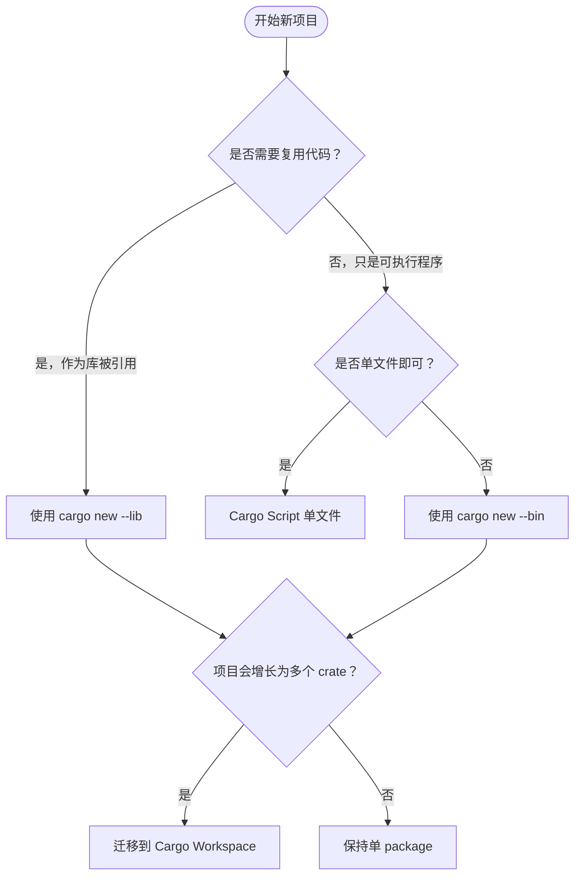

# Cargo 入门（Cargo Getting Started）

> **内容分级**: [参考级]
> **本节关键术语**: Cargo · Crate · Package · Manifest · `Cargo.toml` — [完整对照表](../../00_meta/01_terminology/terminology_glossary.md)
>
> **EN**: Cargo Getting Started
> **Summary**: A beginner-oriented guide to Cargo 1.97.0+: verifying the toolchain, creating a package with `cargo new`/`cargo init`, building/running/checking, adding dependencies, and choosing between binary, library, script, and workspace projects.
> **受众**: [初学者]
> **Bloom 层级**: L1-L3
> **权威来源**: 本文件为 `concept/` 权威页。
> **A/S/P 标记**: **P** — Practice
> **双维定位**: E×Tool — 工具链与生态系统
> **定位**: 让初学者在 5 分钟内理解 Cargo 是什么、能做什么、如何创建并运行第一个 Rust package。
> **前置概念**: [Toolchain](../00_toolchain/01_toolchain.md) · [Rust Installation](../../00_meta/04_navigation/learning_mvp_path.md)
> **后置概念**: [Cargo Workflow](81_cargo_workflow.md) · [Cargo Dependency Resolution](60_cargo_dependency_resolution.md) · [Cargo Manifest Reference](64_cargo_manifest_reference.md)

---

> **来源**: [Cargo Book — Getting Started](https://doc.rust-lang.org/cargo/getting-started/index.html) · [Cargo Book — First Steps with Cargo](https://doc.rust-lang.org/cargo/getting-started/first-steps.html) · [Cargo Book — Why Cargo Exists](https://doc.rust-lang.org/cargo/index.html)

---

## 一、Cargo 是什么

**Cargo** 是 Rust 的官方构建系统、包管理器和项目编排工具。它与 `rustc` 一起随 Rust 工具链发布，负责：

| 职责 | 说明 |
|:---|:---|
| 构建 | 调用 `rustc` 编译 package 及其依赖 |
| 依赖管理 | 从 crates.io 或其他 registry 下载并解析依赖 |
| 项目脚手架 | 通过 `cargo new`/`cargo init` 创建标准项目结构 |
| 测试与文档 | `cargo test`、`cargo doc`、`cargo bench` |
| 发布 | `cargo publish` 将 package 发布到 crates.io |

## 二、安装验证

安装 Rust 后，确认工具链版本：

```bash
rustc --version   # rustc 1.97.0 (or newer)
cargo --version   # cargo 1.97.0 (or newer)
```

建议使用 `rustup` 管理工具链，并通过 `rustup update` 保持最新稳定版。

## 三、创建第一个 Package

```bash
# 创建二进制（可执行）package
cargo new hello_cargo --bin
cd hello_cargo
cargo run
```

生成的标准结构：

```text
hello_cargo/
├── Cargo.toml
├── Cargo.lock
└── src/
    └── main.rs
```

如果想在现有目录中初始化，可使用 `cargo init`：

```bash
mkdir my_project && cd my_project
cargo init --name my_project
```

## 四、二进制 vs 库 vs 其他形态

| 形态 | 创建命令 | 入口文件 | 典型用途 |
|:---|:---|:---|:---|
| 二进制 | `cargo new --bin` | `src/main.rs` | CLI、服务、应用 |
| 库 | `cargo new --lib` | `src/lib.rs` | 可被其他 crate 依赖 |
| Cargo Script | 单文件 `*.rs` | 文件本身 | 快速脚本、原型 |
| Workspace | 多 crate | 见 [Cargo Workspaces](78_cargo_workspaces.md) | 大型项目、monorepo |

## 五、核心命令速览

| 命令 | 作用 |
|:---|:---|
| `cargo build` | 编译当前 package |
| `cargo run` | 编译并运行 |
| `cargo check` | 快速检查语法/类型，不生成二进制 |
| `cargo test` | 运行测试 |
| `cargo doc` | 生成 rustdoc 文档 |
| `cargo add <crate>` | 添加依赖 |
| `cargo clippy` | 运行 lint 检查 |
| `cargo fmt` | 格式化代码 |

## 六、Cargo.toml 初识

```toml
[package]
name = "hello_cargo"
version = "0.1.0"
edition = "2024"
rust-version = "1.97.0"
license = "MIT OR Apache-2.0"
description = "A minimal Cargo getting-started package"

[dependencies]
```

- `[package]` 描述当前 package 元数据。
- `[dependencies]` 声明外部依赖。
- `edition = "2024"` 指定 Rust 语言版本；Edition 2024 隐式使用 **resolver v3**。
- `rust-version` 声明最低支持的 Rust 版本（MSRV）。

显式声明 resolver 也是允许的：

```toml
[package]
name = "hello_cargo"
version = "0.1.0"
edition = "2024"
resolver = "3"
```

## 七、添加依赖

```bash
# 添加 serde 并启用 derive feature
cargo add serde --features derive

# 添加 tokio 并启用 full feature
cargo add tokio --features full
```

执行后 `Cargo.toml` 会自动更新：

```toml
[dependencies]
serde = { version = "1.0", features = ["derive"] }
tokio = { version = "1.40", features = ["full"] }
```

## 八、Lockfile 与可复现构建

首次构建后 Cargo 会生成 `Cargo.lock`，记录解析出的精确版本。对于二进制项目，应将 `Cargo.lock` 提交到版本控制；对于纯库项目，通常不提交。详见 [Cargo Workflow](81_cargo_workflow.md)。

## 九、何时选择哪种项目形态？



- Cargo Script 详情见 [Cargo Script](09_cargo_script.md)。
- 多 crate 管理见 [Cargo Workspaces](78_cargo_workspaces.md)。
- resolver v3 与 `public = true` 示例见 [`crates/c17_resolver_v3_public_demo`](../../../crates/c17_resolver_v3_public_demo/)。

> **L5 对比**: [Rust vs C++](../../05_comparative/01_systems_languages/01_rust_vs_cpp.md) · [Rust vs Go](../../05_comparative/01_systems_languages/02_rust_vs_go.md)

---

> **权威来源**: [Cargo Book — Getting Started](https://doc.rust-lang.org/cargo/getting-started/index.html)

---

## 国际权威参考 / International Authority References（P0 官方 · P1 学术 · P2 生态）

> 依据 `AGENTS.md` §2「对齐网络国际化权威内容」补充：仅追加已验证可达的权威链接，不改动正文事实。

- **P1 学术/形式化**: [Rudra: Finding Memory Safety Bugs in Rust at the Ecosystem Scale (SOSP 2021)](https://dl.acm.org/doi/10.1145/3477132.3483570)
