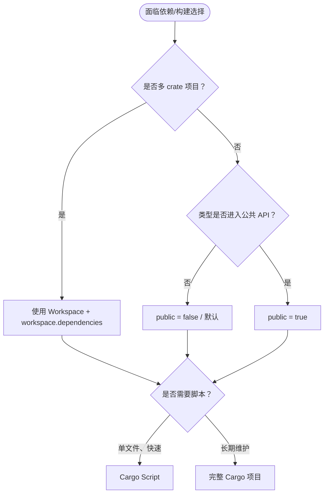

# Cargo 指南实践（Cargo Guide Practices）

> **内容分级**: [参考级]
> **本节关键术语**: Dependencies · Features · CI · Build Performance · Cache · `CARGO_TARGET_DIR` — [完整对照表](../../00_meta/01_terminology/terminology_glossary.md)
>
> **EN**: Cargo Guide Practices
> **Summary**: Practical Cargo guidance for Rust 1.96.1+: dependency versioning, feature design, test organization, CI pipelines, build performance, MSRV/resolver v3, public/private dependencies, and supply-chain auditing.
> **受众**: [进阶]
> **Bloom 层级**: 理解 → 应用
> **A/S/P 标记**: **P** — Practice
> **双维定位**: E×Tool — 工具链与生态系统
> **定位**: 把 Cargo 官方指南中散落在多章的“怎么做”聚合为一份实践速查。
> **前置概念**: [Cargo Workflow](81_cargo_workflow.md) · [Cargo Dependency Resolution](60_cargo_dependency_resolution.md) · [Testing Strategies](../09_testing_and_quality/12_testing_strategies.md)
> **后置概念**: [Cargo Configuration](83_cargo_configuration.md) · [DevOps and CI/CD](../00_toolchain/28_devops_and_ci_cd.md) · [Performance Optimization](../10_performance/15_performance_optimization.md)

---

> **来源**: [Cargo Book — Dependencies](https://doc.rust-lang.org/cargo/guide/dependencies.html) · [Cargo Book — Tests](https://doc.rust-lang.org/cargo/guide/tests.html) · [Cargo Book — Continuous Integration](https://doc.rust-lang.org/cargo/guide/continuous-integration.html) · [Cargo Book — Build Performance](https://doc.rust-lang.org/cargo/guide/build-cache.html)

---

## 一、依赖管理实践

### 添加依赖

```bash
cargo add serde --features derive
cargo add tokio --features full
```

### 版本语义

`Cargo.toml` 中使用 SemVer 范围：

| 写法 | 含义 |
|:---|:---|
| `1.2.3` | `^1.2.3`，兼容 1.x.x 且 ≥1.2.3 |
| `~1.2.3` | ≥1.2.3 且 <1.3.0 |
| `=1.2.3` | 精确锁定 |
| `>=1.2, <2.0` | 显式范围 |

### 依赖分类

```toml
[dependencies]          # 运行时依赖
[dev-dependencies]      # 测试/示例/基准
[build-dependencies]    # build.rs
[target.'cfg(unix)'.dependencies]  # 平台特定
```

## 二、Features 设计

```toml
[features]
default = ["std"]
std = []
serde = ["dep:serde", "bitflags/serde"]
```

- Features 必须是**可加性（additive）**的：启用更多 feature 不应破坏已有代码。
- 默认 features 会自动启用，可通过 `default-features = false` 关闭。
- 使用 `dep:crate` 显式声明可选依赖；使用 `?` 弱依赖避免强制启用。

## 三、测试组织

Cargo 自动识别四类测试：

| 类型 | 位置 | 运行方式 |
|:---|:---|:---|
| 单元测试 | 内联于 `src/*.rs` 的 `#[cfg(test)]` 模块 | `cargo test` |
| 集成测试 | `tests/*.rs` | `cargo test --test <name>` |
| 文档测试 | `///` 示例代码 | `cargo test --doc` |
| 基准测试 | `benches/*.rs` | `cargo bench` |

## 四、持续集成

典型 CI 步骤：

```yaml
- cargo check --workspace
- cargo test --workspace
- cargo clippy --workspace -- -D warnings
- cargo fmt --check
- cargo doc --workspace --no-deps
- cargo audit
```

## 五、构建性能优化

| 策略 | 说明 |
|:---|:---|
| 共享构建缓存 | 设置 `CARGO_TARGET_DIR` 或 sccache |
| 增量编译 | 默认开启，`cargo check` 优先 |
| 并行编译 | `cargo build -j<N>` 控制并行度 |
| 减少依赖 | 审计并移除不必要依赖 |
| Profile 调优 | 见 [Cargo Profiles and Lints](65_cargo_profiles_and_lints.md) |

启用 `sccache`：

```bash
export RUSTC_WRAPPER=sccache
# 或在 .cargo/config.toml 中
[build]
rustc-wrapper = "sccache"
```

## 六、MSRV 与 Resolver v3

Rust 1.96.1 配合 Edition 2024 默认使用 **resolver v3**，其关键行为是 **MSRV-aware fallback**：

```toml
[workspace]
resolver = "3"
members = ["crates/*"]
```

- 当 workspace 成员声明 `rust-version = "1.70"` 时，Cargo 会优先选择满足该 MSRV 的依赖版本。
- 如需验证最新依赖，使用 `cargo update --ignore-rust-version`。

## 七、公共/私有依赖与 Feature Unification

从 Rust 1.96.1 开始，可以在 `Cargo.toml` 中声明 `public = true/false`（语法已稳定，完整语义检查需 nightly `-Zpublic-dependency`）：

```toml
[dependencies]
bitflags = { version = "2", public = true }
indexmap = { version = "2", public = false }
```

详细解释见 [Cargo `public = true` 与 Resolver v3](10_public_private_deps.md)，可运行示例见 [Resolver v3 与 `public = true` 的 feature unification 演示](11_resolver_v3_public_feature_unification.md) 与 [`crates/c17_resolver_v3_public_demo`](../../../crates/c17_resolver_v3_public_demo/)。

## 八、安全与审计

```bash
# 检查已知漏洞
cargo audit

# 许可证与依赖策略检查
cargo deny check
```

详见 [Cargo Security CVEs](72_cargo_security_cves.md)。

## 九、实践决策树



> **L5 对比**: [Rust vs C++](../../05_comparative/01_systems_languages/01_rust_vs_cpp.md) · [Rust vs Go](../../05_comparative/01_systems_languages/02_rust_vs_go.md)

---

> **权威来源**: [Cargo Book — Guide](https://doc.rust-lang.org/cargo/guide/index.html)
> **内容分级**: [参考级]
