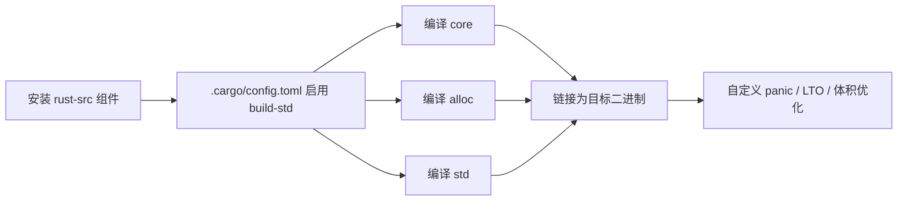
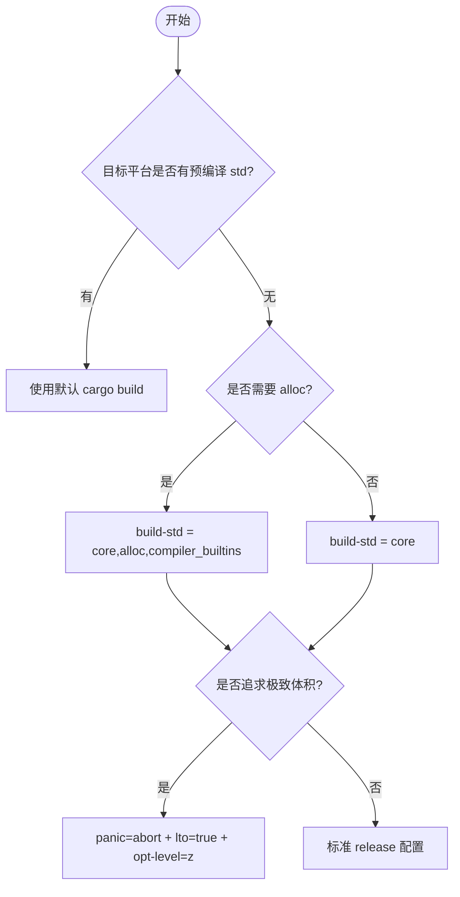

# Cargo build-std

> **EN**: Cargo `build-std`
> **Summary**: Cargo's unstable `-Zbuild-std` flag compiles the standard library (`std`/`core`/`alloc`) from source instead of linking prebuilt binaries — enabling custom targets without shipped std, `no_std` + `alloc` setups, custom panic handlers (`panic=abort`/immediates), `build-std-features` tuning, and LTO-based size optimization for embedded systems.
> **Rust 版本**: 1.97.0+ (Edition 2024)
> **权威来源**: [Cargo build-std 文档](https://doc.rust-lang.org/cargo/reference/unstable.html#build-std) · [The Rust Programming Language](https://doc.rust-lang.org/book/title-page.html) · [Rust Reference](https://doc.rust-lang.org/reference/)
>
> **受众**: [进阶 / 工程]
> **Bloom 层级**: L2-L3
> **权威来源**: 本文件为 `concept/` 权威页。
> **A/S/P 标记**: **A** — Application
> **前置概念**: [Rust 嵌入式系统开发](../05_systems_and_embedded/22_embedded_systems.md) · [Cargo 配置与环境变量](83_cargo_configuration.md) · [所有权（Ownership）系统](../../01_foundation/01_ownership_borrow_lifetime/01_ownership.md)
> **后置概念**: [交叉编译](../05_systems_and_embedded/17_cross_compilation.md) · [unsafe Rust](../../03_advanced/02_unsafe/03_unsafe.md)

---

## 什么是 build-std

`build-std` 是 Cargo 的一个实验性功能，允许在构建时从源码编译 Rust 标准库（`std`、`core`、`alloc`），而不是使用预编译的发行版标准库。

## 为什么需要 build-std

### 嵌入式场景

- **定制标准库**: 为特定目标裁剪 `std` 功能
- **no_std + alloc**: 在没有完整操作系统的环境中使用 `Vec`、`Box` 等
- **panic 策略**: 自定义 panic handler，避免栈展开开销
- **LTO 优化**: 对整个程序（包括标准库）进行链接时优化

### 体积优化

通过 `build-std` 配合 `panic = "abort"` 和 LTO，可以显著减小二进制体积：

- 去除未使用的 `std` 代码
- 内联标准库函数
- 自定义内存分配器

## build-std 工作流程

`build-std` 本质上是把 `rust-src` 组件中的标准库源码作为当前 workspace 的依赖重新编译。



## 使用方法

### 1. 安装 nightly 工具链

```bash
rustup toolchain install nightly
rustup component add rust-src --toolchain nightly
```

### 2. 配置 cargo

在项目根目录的 `.cargo/config.toml` 中：

```toml
[unstable]
build-std = ["core", "alloc", "compiler_builtins"]
build-std-features = ["compiler-builtins-mem"]  # 使用 compiler-builtins 的 memcpy
```

### 3. 指定目标

```bash
cargo +nightly build -Z build-std=core,alloc --target thumbv7m-none-eabi
```

### 4. Cargo.toml 配置

```toml
[profile.release]
panic = "abort"
lto = true
opt-level = "z"
codegen-units = 1
```

## 何时选择 build-std（决策树）



## 典型配置示例

### 自定义 target JSON

自定义内核或固件常需要自定义 target 描述文件：

```json
{
  "llvm-target": "x86_64-unknown-none",
  "data-layout": "e-m:e-i64:64-f80:128-n8:16:32:64-S128",
  "arch": "x86_64",
  "target-endian": "little",
  "target-pointer-width": "64",
  "target-c-int-width": "32",
  "os": "none",
  "executables": true,
  "linker-flavor": "ld.lld",
  "panic-strategy": "abort"
}
```

配合 `.cargo/config.toml`：

```toml
[build]
target = "x86_64-unknown-none.json"

[unstable]
build-std = ["core", "compiler_builtins"]
build-std-features = ["compiler-builtins-mem"]
```

### no_std + 全局分配器

在 `build-std` 开启 `alloc` 后，即使 `#![no_std]` 也能使用 `Vec`、`Box` 等数据结构：

```rust
#![no_std]
#![no_main]

extern crate alloc;

use alloc::vec::Vec;
use core::panic::PanicInfo;

#[global_allocator]
static ALLOCATOR: MyAllocator = MyAllocator;

struct MyAllocator;

unsafe impl alloc::alloc::GlobalAlloc for MyAllocator {
    unsafe fn alloc(&self, _layout: core::alloc::Layout) -> *mut u8 { core::ptr::null_mut() }
    unsafe fn dealloc(&self, _ptr: *mut u8, _layout: core::alloc::Layout) {}
}

#[panic_handler]
fn panic(_info: &PanicInfo) -> ! { loop {} }
```

## build-std-features 速查表

| feature | 作用 | 典型场景 |
|:---|:---|:---|
| `compiler-builtins-mem` | 使用 `compiler_builtins` 提供 `memcpy` 等 | 大多数裸机目标 |
| `compiler-builtins-c` | 使用 C 实现的部分 builtins | 需要与 C 库混编 |
| `panic-immediate-abort` | panic 直接 abort，不输出信息 | 体积极度敏感 |
| `optimize_for_size` | 针对代码体积极致优化 | `opt-level = z` 时配合 |

## HAL 设计模式深化

### 类型状态模式（Type State）

利用泛型（Generics）将外设状态编码到类型中，编译时防止错误操作：

```rust
use core::marker::PhantomData;

pub struct Uninitialized;
pub struct Initialized;

pub struct Uart<STATE> {
    _state: PhantomData<STATE>,
}

impl Uart<Uninitialized> {
    pub fn new() -> Self { /* ... */ }
    pub fn init(self, baud: u32) -> Uart<Initialized> { /* ... */ }
}

impl Uart<Initialized> {
    pub fn send(&mut self, data: &[u8]) { /* ... */ }
}
```

### 寄存器访问模式

```rust
/// 类型安全的寄存器包装
pub struct Register<T> {
    ptr: *mut T,
}

impl<T> Register<T> {
    /// Volatile 读取
    pub unsafe fn read(&self) -> T {
        core::ptr::read_volatile(self.ptr)
    }

    /// Volatile 写入
    pub unsafe fn write(&mut self, value: T) {
        core::ptr::write_volatile(self.ptr, value);
    }

    /// 修改特定位
    pub unsafe fn modify<F>(&mut self, f: F)
    where
        F: FnOnce(T) -> T,
    {
        let current = self.read();
        self.write(f(current));
    }
}
```

## 常见陷阱与排查

| 现象 | 可能原因 | 解决方案 |
|:---|:---|:---|
| `error: failed to read cargo metadata` | 未安装 `rust-src` | `rustup component add rust-src --toolchain nightly` |
| `could not find std` | target 不支持完整 std | 改用 `core`/`alloc` 或自定义 target |
| 二进制体积未减小 | 未开启 `panic=abort` 或 LTO | 检查 `Cargo.toml` profile |
| panic 信息输出占用空间 | 默认 panic handler 含格式化 | 使用 `panic-immediate-abort` |

## 稳定化进度跟踪

| 里程碑 | 状态 | 说明 |
|--------|------|------|
| 功能引入 | ✅ | 已作为 unstable 功能可用多年 |
| rust-src 组件 | ✅ | `rustup component add rust-src` 稳定可用 |
| Cargo.toml 原生支持 | ⏳ | 需在 `.cargo/config.toml` 中配置 |
| 无需 nightly | ⏳ | 仍需要 nightly toolchain 启用 `-Z build-std` |
| 完全稳定化 | 🔮 | 无明确时间表，依赖 Cargo 团队规划 |

### 当前替代方案

- **`#![no_std]` + `#![no_main]`**: 最稳定的方式，完全绕过标准库
- **`embedded-hal` 生态**: 提供跨平台 HAL 抽象
- **`cortex-m-rt`**: 提供启动代码和向量表

## 相关权威页

- [Rust 嵌入式系统开发](../05_systems_and_embedded/22_embedded_systems.md)
- [交叉编译](../05_systems_and_embedded/17_cross_compilation.md)
- [Cargo 配置与环境变量](83_cargo_configuration.md)
- [所有权（Ownership）系统](../../01_foundation/01_ownership_borrow_lifetime/01_ownership.md)
- [泛型（Generics）与 Trait Bounds](../../02_intermediate/01_generics/02_generics.md)
- [unsafe 与裸机内存](../../03_advanced/02_unsafe/03_unsafe.md)

## 参考

- [Cargo build-std 文档](https://doc.rust-lang.org/cargo/reference/unstable.html#build-std)
- [The Embedonomicon - build-std](https://docs.rust-embedded.org/embedonomicon/build-std.html)
- [Rust Embedded Working Group](https://github.com/rust-embedded/wg)

> **L5 对比**: [Rust vs C++](../../05_comparative/01_systems_languages/01_rust_vs_cpp.md)

## 过渡段

> **过渡**: 从 `no_std` 场景过渡到 `build-std` 动机，可以理解为什么需要从源码编译标准库。
>
> **过渡**: 从 `build-std` 配置过渡到 panic 策略与 LTO，可以建立完整的体积优化方案。
>
> **过渡**: 从本地优化过渡到嵌入式部署，可以将构建配置与目标硬件需求对齐。
>

## 定理链

| 定理 | 前提 | 结论 |
|:---|:---|:---|
| 源码构建 std ⟹ 自定义目标支持 | 编译目标平台未预编译的标准库 | 支持新硬件与操作系统 |
| 跨 crate LTO ⟹ 更小二进制 | 链接时优化覆盖 std | 显著减少体积 |
| 自定义 panic ⟹ 减少运行时（Runtime）开销 | 使用 `panic = "abort"` | 避免栈展开代码 |

---

## 国际权威参考 / International Authority References（P1 学术 · P2 生态）

> 依据 `AGENTS.md` §2「对齐网络国际化权威内容」补充：仅追加已验证可达的权威链接，不改动正文事实。

- **P2 生态/社区**: [docs.rs/semver — 生态权威 API 文档](https://docs.rs/semver) · [docs.rs/toml — 生态权威 API 文档](https://docs.rs/toml)
- **P1 学术/形式化**: [Rudra: Finding Memory Safety Bugs in Rust at the Ecosystem Scale (SOSP 2021)](https://dl.acm.org/doi/10.1145/3477132.3483570)
