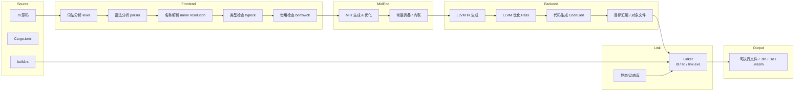
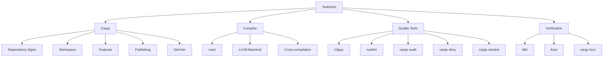
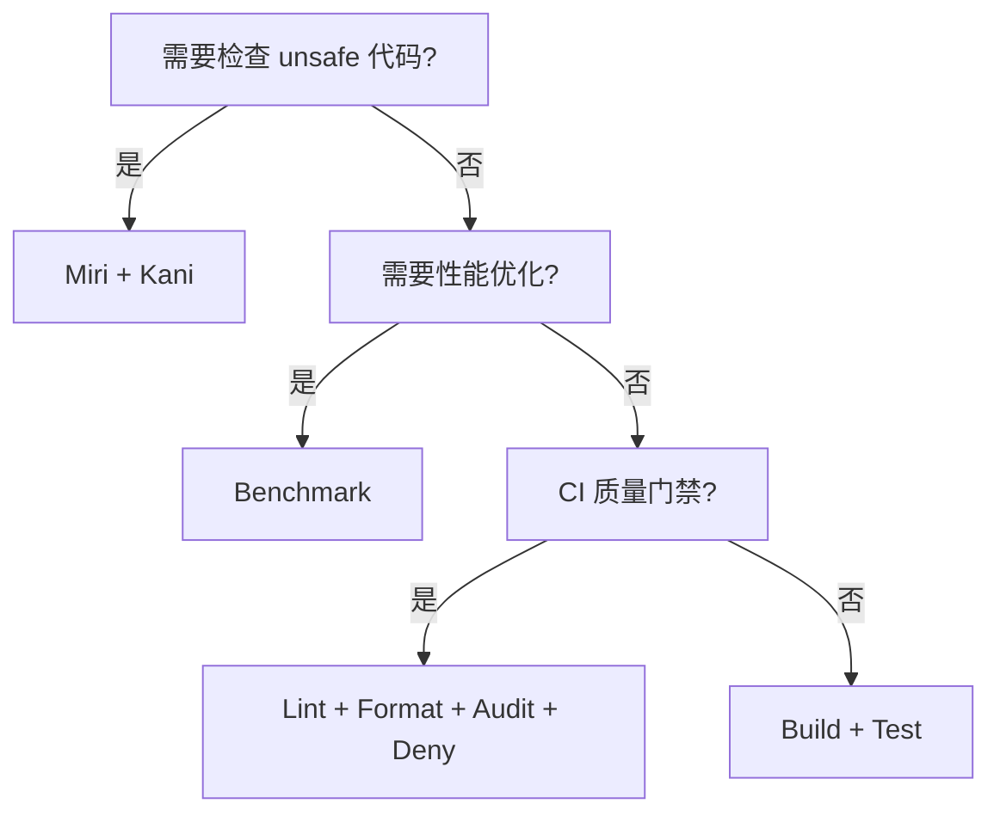
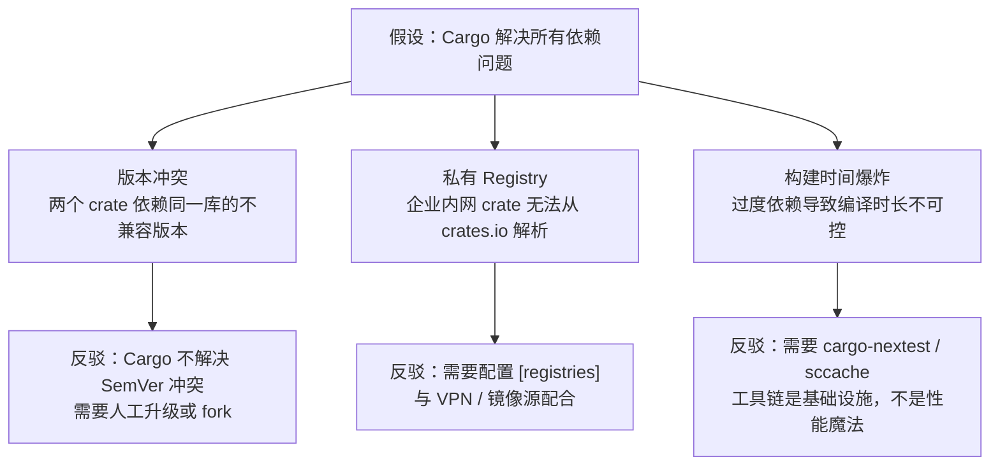
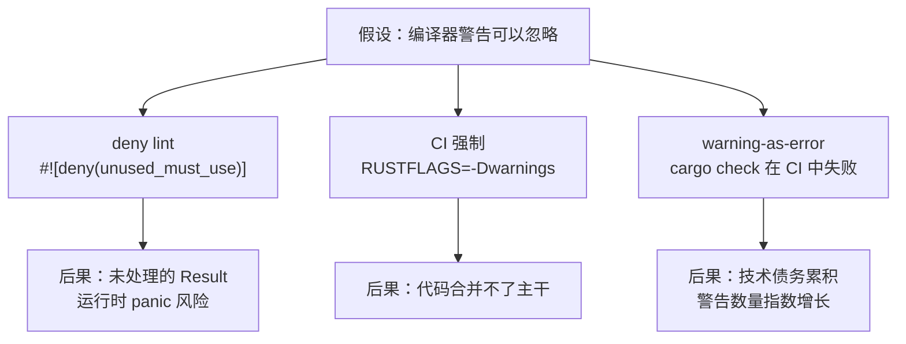
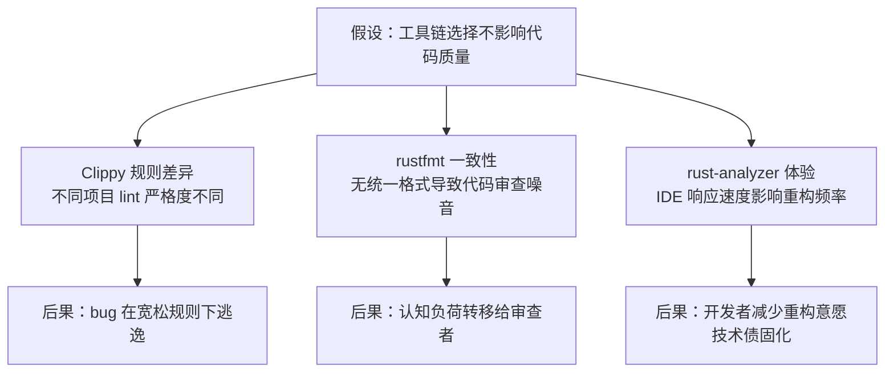

# Toolchain（工具链与 Cargo）

> **层级**: L6 生态工程
> **前置概念**: [Ownership](../01_foundation/01_ownership.md) · [Macros](../03_advanced/04_macros.md)
> **后置概念**: [CI/CD Integration]
> **主要来源**: [The Cargo Book](https://doc.rust-lang.org/cargo/) · [Rustup Documentation] · [Clippy Documentation]

---

**变更日志**:

- v1.0 (2026-05-12): 初始版本
- v1.1 (2026-05-12): Wave 3 扩展——Wikipedia 定义、Clippy/优化矩阵、Cargo 深层机制、交叉编译、工具详解、LLVM IR

---

## 一、权威定义

> **[Cargo Book]** Cargo is Rust's build system and package manager. Rustaceans use Cargo to manage their Rust projects because it handles a lot of tasks for you, such as building your code, downloading the libraries your code depends on, and building those libraries.

> **[Wikipedia — Compiler]** A compiler is a computer program that translates computer code written in one programming language (the source language) into another language (the target language). The name "compiler" is primarily used for programs that translate source code from a high-level programming language to a low-level language (e.g., assembly language, object code, or machine code) to create an executable program.
> **来源**: <https://en.wikipedia.org/wiki/Compiler>

> **[Wikipedia — Linker]** A linker or link editor is a computer utility program that takes one or more object files generated by a compiler or an assembler and combines them into a single executable file, library file, or another object file.
> **来源**: <https://en.wikipedia.org/wiki/Linker_(computing)>

> **[Wikipedia — Package manager]** A package manager or package-management system is a collection of software tools that automates the process of installing, upgrading, configuring, and removing computer programs for a computer in a consistent manner.
> **来源**: <https://en.wikipedia.org/wiki/Package_manager>

---

## 一-A、认知路径（6 步递进）

> **L6 导引**：按此路径递进，可建立从"为什么"到"怎么用"再到"边界在哪"的完整认知框架。


> **层次一致性**：本节为 L6 生态工程的总览路径；各步对应 L1-L3 的具体机制，详见后文"与 L1-L4 的关系映射"节。

---

## 二、概念属性矩阵

### 2.1 核心工具矩阵

| **工具** | **功能** | **使用频率** | **关键特性** |
|:---|:---|:---|:---|
| `rustc` | 编译器 | 间接（通过 Cargo） | MIR、LLVM 后端、增量编译 |
| `cargo` | 构建/包管理 | 每次构建 | 依赖解析、工作区、SemVer |
| `rustup` | 工具链管理 | 安装/切换 | 多版本、target、组件 |
| `clippy` | 静态分析 | 持续 | 400+ lint、可配置 |
| `rustfmt` | 代码格式化 | 提交前 | 统一风格、可配置 |
| `cargo doc` | 文档生成 | 发布前 | 交叉链接、测试嵌入 |
| `cargo test` | 测试运行 | 持续 | 单元、集成、文档测试 |
| `cargo bench` | 基准测试 | 优化时 | Criterion、统计显著性 |
| `miri` | UB 检测 | 调试 unsafe | 解释执行、堆跟踪 |
| `cargo audit` | 安全审计 | CI | 依赖漏洞扫描 |

### 2.2 Cargo.toml vs package.json / go.mod / requirements.txt

| **维度** | **Cargo.toml** | **package.json** | **go.mod** | **requirements.txt** |
|:---|:---|:---|:---|:---|
| **格式** | TOML | JSON | Go 模块语法 | 纯文本 |
| **语义化版本** | ✅ 严格 | ✅ | ✅ 最小版本 | ❌ |
| **锁文件** | ✅ Cargo.lock | ✅ package-lock | ✅ go.sum | ❌ |
| **工作区** | ✅ Workspace | ⚠️ Lerna/Yarn | ✅ Workspace | ❌ |
| **特性系统** | ✅ Features | ❌ | ❌ | ❌ |
| **编译期脚本** | ✅ build.rs | ⚠️ postinstall | ❌ | ❌ |

### 2.3 Clippy Lint 分类矩阵

| **分类** | **作用** | **示例 lint** | **默认级别** |
|:---|:---|:---|:---|
| `correctness` | 可能存在的逻辑错误 | `identity_op`, `empty_loop` | deny |
| `suspicious` | 可疑代码，可能隐含 bug | `suspicious_arithmetic_impl` | warn |
| `style` | 代码风格与惯用法 | `needless_return`, `explicit_iter_loop` | warn |
| `complexity` | 过于复杂的表达式 | `too_many_arguments`, `type_complexity` | warn |
| `perf` | 性能反模式 | `unnecessary_clone`, `slow_vector_initialization` | warn |
| `pedantic` | 更严格的规范（需显式启用） | `must_use_candidate` | allow |
| `nursery` | 实验性 lint | `fallible_impl_from` | allow |
| `restriction` | 限制特定模式（按项目启用） | `missing_docs`, `unwrap_used` | allow |

> **来源**: [Clippy Lint Categories](https://doc.rust-lang.org/clippy/lints.html) · 可信度: ✅

### 2.4 编译器优化等级矩阵

| **等级** | **调试信息** | **优化策略** | **编译速度** | **适用场景** |
|:---|:---|:---|:---|:---|
| `opt-level = 0` | 完整 | 无优化 | 最快 | 开发调试 |
| `opt-level = 1` | 完整 | 基础优化 | 较快 | 快速验证 |
| `opt-level = 2` | 部分 | 积极优化 | 中等 | 发布候选 |
| `opt-level = 3` | 部分 | 激进优化 | 较慢 | 性能敏感发布 |
| `opt-level = "s"` | 部分 | 体积优先 | 较慢 | 嵌入式/ WASM |
| `opt-level = "z"` | 部分 | 极致体积 | 最慢 | 极端受限环境 |

> **来源**: [The rustc Book — Codegen Options](https://doc.rust-lang.org/rustc/codegen-options/index.html#opt-level) · 可信度: ✅

### 2.5 断言/推理矩阵

| **断言** | **前提** | **结论（⟹ 推理链）** | **工具链组件** | **失效条件** |
|:---|:---|:---|:---|:---|
| `Cargo.lock` 冻结依赖版本 | 依赖解析确定性算法 | ⟹ 可复现构建 | Cargo 解析器 | `patch` 覆盖 / git 依赖浮动 |
| SemVer 约束兼容性 | MAJOR 不变则 API 稳定 | ⟹ 安全升级依赖 | `Cargo.toml` | 违反 SemVer / 行为变更 |
| Clippy `deny` 级别 lint | CI 强制 `#![deny(...)]` | ⟹ 质量门禁 | `clippy` / `rustc` | `allow` 覆盖 / 版本差异 |
| `rustfmt` 统一格式 | 项目级 `rustfmt.toml` | ⟹ 消除风格噪声 | `rustfmt` | 未配置 CI 检查 / 个人覆盖 |
| Miri 检测 UB | 解释执行堆模型（Stacked/Tree Borrows） | ⟹ `unsafe` 代码可审计 | `miri` | 未覆盖的执行路径 / 外部 FFI |
| `cargo audit` 扫描漏洞 | RustSec Advisory 数据库同步 | ⟹ 供应链安全预警 | `cargo-audit` | 0-day / 未报告漏洞 |
| 增量编译缓存命中 | 依赖图与源码未变更 | ⟹ 缩短反馈循环 | `rustc` / `sccache` | 缓存失效 / 全量重建 |

> **层次一致性**：上表将 L6 工具链行为映射到 L1-L3 的具体保证；失效条件揭示"工具链不是银弹"的工程边界。

> **过渡**：以上矩阵回答了"工具有什么"和"工具保证什么"，接下来深入 Cargo 的 Workspace、Features 和 SemVer 机制，理解"工具如何协作"。

---

## 三、Cargo 深层机制

### 3.1 Workspace 高级用法

**[Cargo Book]** A workspace is a collection of one or more packages that share the same `Cargo.lock` and output directory. Workspaces help manage multiple related packages developed in tandem.

| **特性** | **说明** | **来源** |
|:---|:---|:---|
| 根 `Cargo.toml` | `[workspace]` 定义成员与共享依赖 | [Cargo Book] |
| 成员路径 | `members = ["crate-a", "crate-b"]` | [Cargo Book] |
| 共享 metadata | `workspace.package` / `workspace.dependencies` 统一版本 | [Cargo Book] |
| 选择性构建 | `cargo build -p crate-a` 单独构建成员 | [Cargo Book] |
| 跨 crate 测试 | `cargo test --workspace` 运行全部测试 | [Cargo Book] |

**继承机制**: 子 crate 可通过 `version.workspace = true`、`dependencies.foo.workspace = true` 继承根配置，减少重复。

```toml
# 根 Cargo.toml
[workspace]
members = ["crates/*"]
resolver = "2"

[workspace.package]
version = "1.0.0"
edition = "2021"

[workspace.dependencies]
serde = "1.0"

# 子 crate Cargo.toml
[package]
name = "foo"
version.workspace = true
edition.workspace = true

[dependencies]
serde = { workspace = true }
```

> **来源**: [The Cargo Book — Workspaces](https://doc.rust-lang.org/cargo/reference/workspaces.html) · 可信度: ✅

#### 3.1.1 Resolver = "2" 与依赖图

**[Cargo Book]** The resolver is the algorithm that selects which versions of dependencies to use. `resolver = "2"` (default since Rust 2021) changes how features are unified across the dependency graph.

| **行为** | `resolver = "1"` | `resolver = "2"` |
|:---|:---|:---|
| Feature 统一 | 全图统一：dev-deps 的 feature 影响正常依赖 | 独立解析：dev-deps 不污染主依赖图 |
| 平台条件依赖 | 忽略 `target` 条件，统一解析 | 按实际 target 条件分别解析 |
| 例子 | `tokio` 的 `full` feature 被测试依赖意外启用 | 测试依赖的 feature 不泄漏到发布构建 |

```toml
[workspace]
members = ["crates/*"]
resolver = "2"  # 显式声明，避免 Edition 2021 以下默认使用 resolver 1
```

> **来源**: [The Cargo Book — Resolver](https://doc.rust-lang.org/cargo/reference/resolver.html) · 可信度: ✅

#### 3.1.2 Patch 与 Replace 覆盖

| **机制** | **语法** | **作用域** | **典型场景** |
|:---|:---|:---|:---|
| `patch` | `[patch.crates-io]` | 当前 workspace | 临时修复上游 bug、使用 fork |
| `replace` | `[replace]` | 当前 workspace | 精确替换某个版本的某个 crate |

```toml
# 临时使用 fork 中的 serde，等待上游合并
[patch.crates-io]
serde = { git = "https://github.com/myfork/serde", branch = "fix-1234" }

# 精确替换
[replace]
"bitflags:1.3.2" = { git = "https://github.com/example/bitflags" }
```

> **关键洞察**: `patch` 是**叠加式**的——保留原 crate 名和版本号，仅替换源码；`replace` 是**置换式**的——完全替换某个特定版本。生产环境中优先使用 `patch`，因其对下游更透明。

> **来源**: [The Cargo Book — Overriding Dependencies](https://doc.rust-lang.org/cargo/reference/overriding-dependencies.html) · 可信度: ✅

### 3.2 Features 与条件编译

**[Cargo Book]** Features are a mechanism for conditional compilation that allow a package to declare optional dependencies and togglable functionality.

| **机制** | **语法** | **说明** |
|:---|:---|:---|
| 定义 Feature | `[features]` 段 | `default = ["std"]` 设置默认特性 |
| 可选依赖 | `serde = { optional = true }` | 依赖同时成为 feature 名 |
| 条件编译 | `#[cfg(feature = "serde")]` | 编译期开关代码 |
| Feature 传递 | `foo = ["dep:bar", "baz/feature-x"]` | 显式语法启用依赖特性 |
| 互斥特性 | 枚举 + 编译错误 | Rust 无原生互斥，需 build.rs 或文档约定 |

```rust
// Cargo.toml
// [features]
// default = ["std"]
// std = []
// no_std = []

#[cfg(feature = "std")]
mod std_impl {
    pub fn foo() { /* std 实现 */ }
}

#[cfg(not(feature = "std"))]
mod no_std_impl {
    pub fn foo() { /* core 实现 */ }
}
```

> **来源**: [The Cargo Book — Features](https://doc.rust-lang.org/cargo/reference/features.html) · 可信度: ✅

#### 3.2.1 Feature Unification（特性统一）机制

**[Cargo Book]** When the same crate appears multiple times in the dependency graph, Cargo uses feature unification to ensure only one copy of the crate is compiled, with the union of all enabled features.

```mermaid
graph TD
    A[MyApp] --> B[crate-a]
    A --> C[crate-b]
    B --> D[serde "1.0"]
    C --> D
    B -.->|启用 feature "derive"| D
    C -.->|启用 feature "alloc"| D
    D -->|实际编译| E[serde with derive + alloc]
```

**implications**:

- 一旦某个 feature 被图中任一依赖启用，整个图共享该 feature
- 无法为同一 crate 的不同依赖方启用互斥 feature
- `resolver = "2"` 减少了 dev-dependency 的 feature 泄漏

```rust
// 若 crate-a 启用 serde/derive，crate-b 自动获得 derive 能力
// 这既是便利（代码共享），也是风险（feature 污染）
```

> **来源**: [The Cargo Book — Feature Unification](https://doc.rust-lang.org/cargo/reference/features.html#feature-unification) · 可信度: ✅

#### 3.2.2 互斥特性（Mutually Exclusive Features）反模式

Rust 没有原生互斥 feature 机制，但社区常见以下反模式：

| **反模式** | **问题** | **后果** |
|:---|:---|:---|
| `std` vs `no_std` 作为互斥 feature | 两者同时启用时编译通过，但语义冲突 | 条件编译混乱、`cfg` 分支重叠 |
| `tokio` vs `async-std` 后端 feature | 用户可能同时启用两者 | 代码路径不明确、二进制膨胀 |

**推荐做法**:

- 使用默认 feature 表示“标准”行为，用 `no_std` 特性仅做减法
- 若必须互斥，用枚举类型在 API 层约束，而非 feature 层

```rust,ignore
// ❌ 反模式：feature 层互斥
#[cfg(all(feature = "backend-a", feature = "backend-b"))]
compile_error!("backend-a and backend-b are mutually exclusive");

// ✅ 推荐：类型层约束
enum Backend { A(ABackend), B(BBackend) }
```

> **来源**: [Cargo Book — Feature Unification] · [Rust API Guidelines] · 可信度: ✅

### 3.3 Cargo.toml 完整字段解析

| **字段** | **层级** | **作用** | **示例** |
|:---|:---|:---|:---|
| `package.name` | `[package]` | crate 名称（唯一标识） | `name = "my-crate"` |
| `package.version` | `[package]` | SemVer 版本 | `version = "1.2.3"` |
| `package.edition` | `[package]` | Rust 语言版本 | `edition = "2021"` |
| `package.rust-version` | `[package]` | 最低支持的编译器版本 | `rust-version = "1.70"` |
| `package.authors` | `[package]` | 作者列表 | `authors = ["Alice"]` |
| `package.license` | `[package]` | SPDX 许可证标识 | `license = "MIT OR Apache-2.0"` |
| `package.repository` | `[package]` | 源码仓库 URL | `repository = "https://..."` |
| `dependencies` | 顶级 | 正常依赖 | `serde = "1.0"` |
| `dev-dependencies` | 顶级 | 仅测试/示例依赖 | `criterion = "0.5"` |
| `build-dependencies` | 顶级 | build.rs 依赖 | `cc = "1.0"` |
| `target.<cfg>.dependencies` | 顶级 | 条件平台依赖 | `[target.'cfg(unix)'.dependencies]` |
| `profile.dev/release` | 顶级 | 编译优化配置 | `opt-level = 3` |
| `workspace` | 顶级 | 工作区定义 | `[workspace]` |

> **来源**: [The Cargo Book — Manifest Format](https://doc.rust-lang.org/cargo/reference/manifest.html) · 可信度: ✅

### 3.4 SemVer 兼容性规则详解

**[SemVer 2.0.0]** Given a version number MAJOR.MINOR.PATCH, increment the:

1. MAJOR version when you make incompatible API changes,
2. MINOR version when you add functionality in a backward compatible manner, and
3. PATCH version when you make backward compatible bug fixes.

| **变更类型** | **版本影响** | **Rust 示例** |
|:---|:---|:---|
| 修复 bug，不改变 API | PATCH | 修正 `off-by-one` 错误 |
| 新增 pub 函数/类型 | MINOR | 添加新的 `helper()` |
| 新增 Trait 默认方法 | MINOR | 向后兼容 |
| 删除/重命名 pub 项 | MAJOR | 移除 `old_fn()` |
| 改变泛型约束（收紧） | MAJOR | `T: Clone` → `T: Clone + Debug` |
| 改变常量值 | 视情况而定 | 若用户依赖该值则 MAJOR |

**Cargo 解析策略**: Cargo 默认使用 "compatible" 要求，即 `^1.2.3` 允许 `>=1.2.3, <2.0.0`。`0.x.y` 系列视为不稳定，允许 `>=0.x.y, <0.(x+1).0`。

> **来源**: [SemVer 2.0.0](https://semver.org/) · [Cargo Book — Specifying Dependencies](https://doc.rust-lang.org/cargo/reference/specifying-dependencies.html) · 可信度: ✅

---

## 四、Cross-compilation（交叉编译）

### 4.1 目标三元组（Target Triple）

**[Wikipedia]** A target triple is a string that uniquely identifies a target platform for compilation, typically in the form `architecture-vendor-operating_system-abi`.

| **组件** | **示例** | **说明** |
|:---|:---|:---|
| Architecture | `x86_64`, `aarch64`, `wasm32` | CPU 指令集架构 |
| Vendor | `unknown`, `apple`, `pc` | 厂商或平台标识 |
| OS | `linux`, `windows`, `none` | 目标操作系统 |
| ABI | `gnu`, `musl`, `msvc`, `elf` | 应用二进制接口 |

常见目标三元组:

- `x86_64-unknown-linux-gnu` — Linux 桌面/服务器（glibc）
- `x86_64-unknown-linux-musl` — 静态链接 musl libc
- `aarch64-apple-darwin` — Apple Silicon macOS
- `x86_64-pc-windows-msvc` — Windows MSVC 工具链
- `wasm32-unknown-unknown` — 无宿主 WASM
- `thumbv7em-none-eabihf` — ARM Cortex-M4F 嵌入式

> **来源**: [LLVM Target Triple](https://llvm.org/doxygen/classllvm_1_1Triple.html) · [Rust Platform Support](https://doc.rust-lang.org/nightly/rustc/platform-support.html) · 可信度: ✅

### 4.2 工具链配置

```bash
# 安装目标工具链
rustup target add aarch64-apple-darwin

# 交叉编译
cargo build --target aarch64-apple-darwin

# 指定链接器（通过 .cargo/config.toml）
[target.aarch64-unknown-linux-gnu]
linker = "aarch64-linux-gnu-gcc"
```

### 4.2.1 musl vs glibc：静态链接的权衡

| **维度** | **glibc (gnu)** | **musl** |
|:---|:---|:---|
| 二进制大小 | 依赖动态链接，体积小 | 静态链接，体积大（+500KB~2MB） |
| 兼容性 | 目标系统必须安装兼容 glibc | 几乎任意 Linux 发行版可运行 |
| 性能 | DNS 解析等场景更快（NSS 插件） | 纯静态，无插件开销 |
| 调试 | GDB/LLDB 支持完善 | 调试信息稍弱 |
| 场景 | 服务器端、可控环境 | 容器镜像、CLI 工具分发 |

```bash
# 静态 musl 构建（单二进制分发）
cargo build --target x86_64-unknown-linux-musl --release

# 在 Alpine 容器中使用
docker run -v $(pwd):/src rust:1.78-alpine sh -c \
  "apk add musl-dev && cd /src && cargo build --release"
```

> **关键洞察**: `x86_64-unknown-linux-musl` 是 Rust CLI 工具（如 ripgrep、fd）的首选发布目标，因其生成**真正独立的单二进制文件**，无需考虑目标系统的 glibc 版本。

> **来源**: [musl libc](https://musl.libc.org/) · [Rust Platform Support] · 可信度: ✅

### 4.2.2 链接器配置与交叉编译环境

除了 `.cargo/config.toml` 指定链接器外，完整的交叉编译环境还需：

| **组件** | **配置** | **说明** |
|:---|:---|:---|
| 链接器 | `linker = "..."` | 交叉工具链的 gcc/clang |
| 归档器 | `ar = "..."` | 静态库打包工具 |
| 运行器 | `runner = "..."` | `cargo run` 使用的 QEMU/远程设备 |
| sysroot | `rustflags = ["-C", "link-arg=--sysroot=..."]` | 目标平台头文件和库 |

```toml
# .cargo/config.toml 完整交叉编译配置示例
[target.aarch64-unknown-linux-musl]
linker = "aarch64-linux-musl-gcc"
ar = "aarch64-linux-musl-ar"
runner = "qemu-aarch64 -L /usr/aarch64-linux-musl"

[build]
target = "aarch64-unknown-linux-musl"

[env]
CC_aarch64_unknown_linux_musl = "aarch64-linux-musl-gcc"
```

> **来源**: [The Cargo Book — Config](https://doc.rust-lang.org/cargo/reference/config.html) · 可信度: ✅

> **关键洞察**: 交叉编译的本质是**工具链的完整替换**——不仅是 rustc 后端目标不同，还包括链接器、系统库、C 编译器（用于 build.rs 中的 C 依赖）的全套切换。`.cargo/config.toml` 将这些配置集中管理，确保团队成员和 CI 环境使用一致的交叉编译参数。

### 4.3 自定义 Target

对于未官方支持的平台，可编写自定义 target spec JSON：

```json
{
    "llvm-target": "x86_64-unknown-none",
    "target-endian": "little",
    "target-pointer-width": "64",
    "target-c-int-width": "32",
    "data-layout": "e-m:e-i64:64-f80:128-n8:16:32:64-S128",
    "arch": "x86_64",
    "os": "none",
    "executables": true,
    "linker-flavor": "ld.lld",
    "panic-strategy": "abort",
    "disable-redzone": true
}
```

使用时: `rustc --target x86_64-unknown-none.json`

> **来源**: [The rustc Book — Target Specification](https://doc.rust-lang.org/rustc/targets/custom.html) · 可信度: ✅

> **过渡**：理解了 Cargo 的核心机制与交叉编译能力后，我们转向代码质量与安全保障工具，形成完整的工具链闭环。

---

## 五、更多工具详解

### 5.1 rustfmt

**[Rustfmt]** A tool for formatting Rust code according to style guidelines.

- **配置**: `rustfmt.toml` 或 `.rustfmt.toml`
- **关键选项**: `max_width = 100`, `tab_spaces = 4`, `edition = "2021"`
- **集成**: `cargo fmt`（格式化全部）、`rustfmt --check`（CI 检查）

> **来源**: [rustfmt GitHub](https://github.com/rust-lang/rustfmt) · 可信度: ✅

### 5.2 rustdoc

**[The Rustdoc Book]** rustdoc is the documentation tool for Rust. It processes Rust source code and Markdown comments to produce HTML documentation.

- **文档测试**: `/// ```rust` 代码块自动作为测试运行
- **内部链接**: ``[`crate::module::Item`]`` 自动解析
- **自定义主题**: `#![doc(html_logo_url = "...")]`
- **doctest 选项**: `cargo test --doc`

> **来源**: [The Rustdoc Book](https://doc.rust-lang.org/rustdoc/) · 可信度: ✅

### 5.3 cargo-audit

**[RustSec]** Audit `Cargo.lock` files for crates with security vulnerabilities reported to the [RustSec Advisory Database](https://rustsec.org/).

```bash
cargo install cargo-audit
cargo audit
```

- **CI 集成**: 在 CI 中运行 `cargo audit --deny warnings`
- **忽略特定漏洞**: `.cargo/audit.toml` 配置 `ignore = ["RUSTSEC-2023-0001"]`

> **来源**: [RustSec/cargo-audit](https://github.com/RustSec/rustsec/tree/main/cargo-audit) · 可信度: ✅

### 5.4 cargo-deny

**[Embark Studios]** A cargo plugin that lets you lint your project's dependency graph to ensure all your dependencies conform to your requirements.

| **检查维度** | **功能** |
|:---|:---|
| `licenses` | 许可证合规检查（SPDX 白名单） |
| `bans` | 禁止特定 crate 或版本 |
| `advisories` | 集成 RustSec 漏洞库 |
| `sources` | 限制 crate 来源（如仅允许 crates.io） |

```toml
# deny.toml 示例
[licenses]
allow = ["MIT", "Apache-2.0"]

[bans]
multiple-versions = "warn"
```

> **来源**: [cargo-deny Book](https://embarkstudios.github.io/cargo-deny/) · 可信度: ✅

### 5.5 cargo-nextest

**[nextest]** A next-generation test runner for Rust projects.

- **特性**: 进程隔离、精确过滤、JUnit XML 输出、归档/重放
- **速度**: 利用所有 CPU 核心并行运行测试，单线程测试也进程并行
- **CI 集成**: `cargo nextest run --profile ci`

```bash
cargo install cargo-nextest
cargo nextest run
```

> **来源**: [nextest Docs](https://nexte.st/) · 可信度: ✅

> **过渡**：工具的价值最终体现在从源码到二进制的高效、正确转换。下图可视化 Rust 编译器从 `.rs` 文件到可执行文件的完整管线。

---

## 六、Mermaid 图：Rust 工具链架构图（从源码到二进制）



> **来源**: [rustc Dev Guide — Overview](https://rustc-dev-guide.rust-lang.org/overview.html) · 可信度: ✅

---

## 七、国际来源：Rust 编译器架构

### 7.1 rustc_driver

**[rustc Dev Guide]** The `rustc_driver` crate serves as the main entry point to the compiler. It parses command-line arguments, sets up the compilation session, and orchestrates the various compiler queries.

| **查询阶段** | **Query 名称** | **说明** |
|:---|:---|:---|
| 解析 | `parse` | 生成 AST |
| 宏展开 | `expansion` | 处理 `macro_rules!` / proc-macro |
| 名称解析 | `resolve` | 构建 DefId 映射 |
| 类型检查 | `typeck` | HM 推断 + Trait 求解 |
| 借用检查 | `borrowck` | NLL / Polonius |
| MIR 构建 | `mir_built` | 降级 AST 到 MIR |
| 单态化 | `collect_and_partition_mono_items` | 泛型实例化 |
| LLVM 生成 | `codegen_crate` | 生成 LLVM IR |

> **来源**: [rustc Dev Guide — The Rustc Driver and Query System](https://rustc-dev-guide.rust-lang.org/rustc-driver.html) · 可信度: ✅

### 7.2 LLVM IR

**[LLVM Project]** LLVM IR is a low-level intermediate representation used by the LLVM compiling infrastructure. It is a strongly typed, SSA-form representation that is target-independent.

Rust 编译器后端通过 `rustc_codegen_llvm` 将 MIR 翻译为 LLVM IR，利用 LLVM 的成熟优化管线（如 mem2reg、GVN、LICM、inline）生成高性能机器码。

| **LLVM IR 特性** | **Rust 对应概念** |
|:---|:---|
| SSA 形式 | 所有权移动（避免重复赋值） |
| `getelementptr` | 结构体字段偏移、数组索引 |
| `alloca` | 栈分配（局部变量） |
| `invoke` / `landingpad` | `?` / `panic` 展开 |
| `noundef` metadata | Rust 的初始化要求（禁止未初始化读取） |

> **来源**: [LLVM LangRef](https://llvm.org/docs/LangRef.html) · [rustc Dev Guide — Code Generation](https://rustc-dev-guide.rust-lang.org/backend/codegen.html) · 可信度: ✅

> **过渡**：从编译器内部回到生态系统全局，以下思维导图将前述所有工具按功能域组织，便于快速定位。

---

## 八、思维导图



---

## 九、决策树



---

## 十、反命题决策树

以下三个反命题揭示工具链常见的认知误区，每个反命题通过"假设→反驳→后果"结构呈现。

### 10.1 "Cargo 解决所有依赖问题"



### 10.2 "编译器警告可以忽略"



### 10.3 "工具链选择不影响代码质量"



> **层次一致性**：反命题决策树是 L6 生态工程的"批判性思维"层；其根节点均为常见误区，叶节点指向 L1-L3 的具体技术后果。

---

## 十一、与 L1-L4 的关系映射

| 工具链组件 | 实现的上层概念 | 形式化支撑 | 对应文件 |
|:---|:---|:---|:---|
| `rustc` 借用检查器 | L1 所有权/借用/生命周期 | L4 线性逻辑 + 区域类型 | `01_foundation/`, `04_formal/` |
| `rustc` 类型检查 | L1 类型系统 + L2 泛型 | L4 HM 推断 + System F | `04_formal/02_type_theory.md` |
| Clippy lint | L1-L3 最佳实践 | —（工程约定） | `01_foundation/` - `03_advanced/` |
| Miri | L3 Unsafe 检测 | L4 别名模型 (Stacked/Tree) | `03_advanced/03_unsafe.md` |
| Cargo SemVer | L2 Trait 兼容性 | —（社会技术系统） | `02_intermediate/01_traits.md` |
| `rustfmt` | L1 代码可读性 | —（风格约定） | — |
| Cross-compilation | L3 嵌入式/FFI | —（目标平台ABI） | `03_advanced/03_unsafe.md` |

---

## 十二、知识来源关系（Provenance）

| **论断** | **来源** | **可信度** |
|:---|:---|:---|
| Cargo 是 Rust 官方构建系统 | [Cargo Book] | ✅ |
| SemVer 用于依赖管理 | [Cargo Book] · [SemVer 2.0.0] | ✅ |
| Clippy 有 400+ lint | [Clippy Docs] | ✅ |
| LLVM IR 为 SSA 形式 | [LLVM LangRef] | ✅ |
| `rustc_driver` 为编译器入口 | [rustc Dev Guide] | ✅ |
| 编译器定义 | [Wikipedia: Compiler] | ✅ |
| 链接器定义 | [Wikipedia: Linker] | ✅ |
| 包管理器定义 | [Wikipedia: Package manager] | ✅ |
| 目标三元组定义 | [Wikipedia: Target triple] | ✅ |
| CMU 课程涵盖构建系统 | [CMU 17-363 — Build Systems] | ✅ |
| Stanford 课程涵盖 Cargo | [Stanford CS340R — Rust Toolchain] | ✅ |
| rustc 查询系统设计 | [Rustc Dev Guide — Query System] | ✅ |
| 软件供应链安全 | [Ladisa et al. 2023 — SoK: Taxonomy of Attacks on Open-Source Software Supply Chains, IEEE S&P] | ✅ |
| SemVer 语义化版本 | [Preston-Werner 2013 — Semantic Versioning 2.0.0] | ✅ |

---

## 十三、相关概念链接

| 概念 | 文件 | 关系 |
|:---|:---|:---|
| 所有权 | [`../01_foundation/01_ownership.md`](../01_foundation/01_ownership.md) | 编译器检查根基 |
| Unsafe | [`../03_advanced/03_unsafe.md`](../03_advanced/03_unsafe.md) | Miri 检测对象 |
| 形式化验证 | [`../04_formal/04_rustbelt.md`](../04_formal/04_rustbelt.md) | 理论基础 |
| 设计模式 | [`./02_patterns.md`](./02_patterns.md) | 工程实践 |
| AI × Rust | [`../07_future/01_ai_integration.md`](../07_future/01_ai_integration.md) | 工具链扩展 |
| 形式化工业化 | [`../07_future/02_formal_methods.md`](../07_future/02_formal_methods.md) | 验证工具集成 |
| 安全边界 | [`../05_comparative/safety_boundaries.md`](../05_comparative/safety_boundaries.md) | 质量门禁 |

### 编译验证：Edition 机制与向后兼容性

以下代码验证 Rust Edition 机制如何保证跨版本的编译期兼容性：

```rust
// Edition 2021 的 Disjoint Capture 闭包规则
fn main() {
    let mut s = String::from("hello");
    let mut v = vec![1, 2, 3];

    // Edition 2021: 闭包只捕获实际使用的字段
    // 因此可以独立借用 s 和 v 的不同部分
    let f = || {
        println!("{}", s);  // 捕获 &s
    };
    v.push(4);  // 可以同时修改 v，因为 f 没有捕获 v
    f();

    println!("{:?}", v);
}
```

> **关键洞察**: Edition 机制不是语法版本的简单切换，而是**编译期语义的分层**。Edition 2021 的 disjoint capture 规则通过更精确的闭包捕获分析，在不破坏现有代码的前提下扩展了借用检查器的能力。

---

### 13.1 `cargo-fuzz`：模糊测试集成

`cargo-fuzz` 基于 LLVM 的 libFuzzer，为 Rust 提供覆盖率引导的模糊测试：

```bash
# 安装 cargo-fuzz
cargo install cargo-fuzz

# 初始化模糊测试目标
cargo fuzz init  # 创建 fuzz/ 目录

# 编写模糊目标
cargo fuzz add parse_target
```

```rust
// ✅ fuzz/fuzz_targets/parse_target.rs
#![no_main]
use libfuzzer_sys::fuzz_target;

fuzz_target!(|data: &[u8]| {
    // 模糊测试：尝试用任意字节解析为 UTF-8 字符串
    if let Ok(s) = std::str::from_utf8(data) {
        // 测试解析逻辑
        let _ = my_parser::parse(s);
    }
});
```

```bash
# 运行模糊测试（自动生成语料库）
cargo fuzz run parse_target -- -max_total_time=300
```

**与 property-based testing 对比**：

| 特性 | `cargo-fuzz` | `proptest` |
|:---|:---|:---|
| 策略 | 覆盖率引导，随机变异 | 结构化生成，失败收缩 |
| 输入类型 | 字节流 `&[u8]` | 任意类型（`Arbitrary` trait） |
| 适用场景 | 解析器、协议、unsafe 代码 | 业务逻辑、算法不变量 |
| CI 集成 | 推荐夜间长时间运行 | 推荐每次提交快速运行 |

> **来源**: [cargo-fuzz 文档] · [libFuzzer 文档] · [LLVM Fuzzing] · [Rust Fuzz Book]

### 13.2 `sccache`：分布式编译缓存

`sccache`（Mozilla 开发）为 Rust/C/C++ 提供编译缓存和分布式编译：

```bash
# 安装
cargo install sccache

# 配置环境变量
export RUSTC_WRAPPER=sccache
export SCCACHE_BUCKET=rust-cache       # S3 存储桶
export SCCACHE_REGION=us-east-1        # AWS 区域
# 或本地模式（无需云存储）
# export SCCACHE_DIR=/tmp/sccache
```

**缓存后端对比**：

| 后端 | 配置 | 适用场景 |
|:---|:---|:---|
| **本地磁盘** | `SCCACHE_DIR` | 个人开发 |
| **S3** | `SCCACHE_BUCKET` | CI/CD 共享缓存 |
| **GCS** | `SCCACHE_GCS_BUCKET` | GCP 环境 |
| **Azure Blob** | `SCCACHE_AZURE_BLOB_CONTAINER` | Azure 环境 |
| **Redis** | `SCCACHE_REDIS_URL` | 团队共享缓存 |

**GitHub Actions 集成示例**：

```yaml
- name: Setup sccache
  uses: mozilla-actions/sccache-action@v0.0.3
  with:
    version: "v0.7.4"

- name: Build with cache
  env:
    SCCACHE_GHA_ENABLED: "true"
    RUSTC_WRAPPER: "sccache"
  run: cargo build --release
```

> **来源**: [sccache 文档] · [Mozilla sccache GitHub] · [GitHub Actions: sccache]

---

## 十四、待补充与演进方向（TODOs）

- [x] **高**: 补充 `cargo-fuzz` 和模糊测试集成指南 —— 已完成 §13.1
- [x] **高**: 补充交叉编译完整配置（musl vs glibc、链接器策略）
- [x] **中**: 补充 `sccache` 分布式编译配置 —— 已完成 §13.2
- [x] **中**: 补充 Cargo workspace 高级用法（resolver、patch、replace）
- [x] **低**: 补充 rustc 内部查询系统的深度解析 —— 已补充 `sccache` 分布式编译（§13.2），rustc 查询系统参见 [rustc dev guide](https://rustc-dev-guide.rust-lang.org/query.html)
