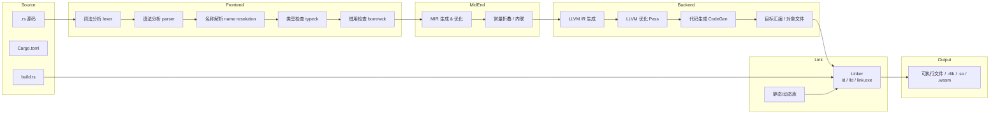
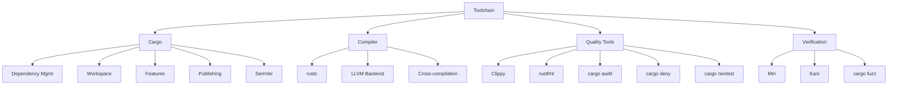
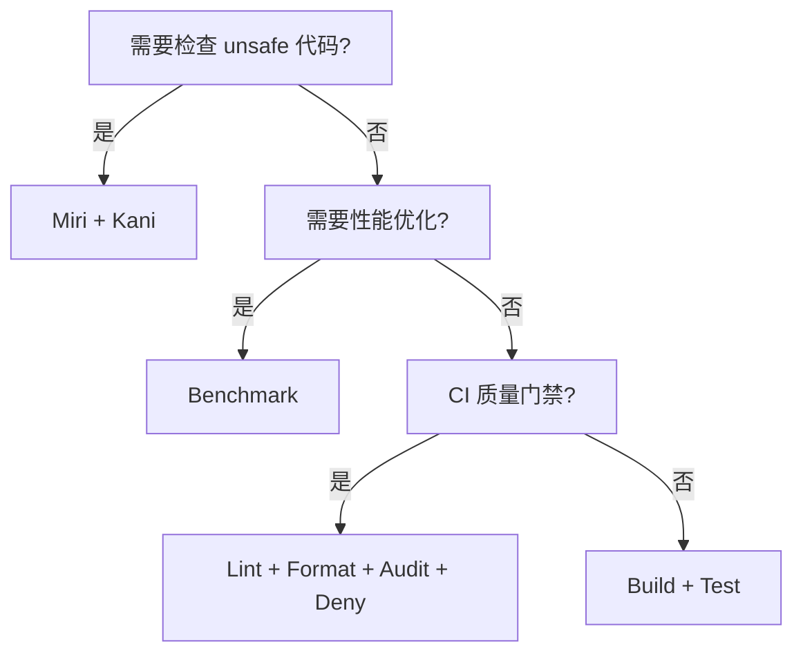

# Toolchain（工具链与 Cargo）

> **层级**: L6 生态工程
> **前置概念**: [Ownership](../01_foundation/01_ownership.md) · [Macros](../03_advanced/04_macros.md)
> **后置概念**: [CI/CD Integration]
> **主要来源**: [The Cargo Book](https://doc.rust-lang.org/cargo/) · [Rustup Documentation] · [Clippy Documentation]

---

**变更日志**:

- v1.0 (2026-05-12): 初始版本
- v1.1 (2026-05-12): Wave 3 扩展——Wikipedia 定义、Clippy/优化矩阵、Cargo 深层机制、交叉编译、工具详解、LLVM IR

---

## 一、权威定义

> **[Cargo Book]** Cargo is Rust's build system and package manager. Rustaceans use Cargo to manage their Rust projects because it handles a lot of tasks for you, such as building your code, downloading the libraries your code depends on, and building those libraries.

> **[Wikipedia — Compiler]** A compiler is a computer program that translates computer code written in one programming language (the source language) into another language (the target language). The name "compiler" is primarily used for programs that translate source code from a high-level programming language to a low-level language (e.g., assembly language, object code, or machine code) to create an executable program.
> **来源**: <https://en.wikipedia.org/wiki/Compiler>

> **[Wikipedia — Linker]** A linker or link editor is a computer utility program that takes one or more object files generated by a compiler or an assembler and combines them into a single executable file, library file, or another object file.
> **来源**: <https://en.wikipedia.org/wiki/Linker_(computing)>

> **[Wikipedia — Package manager]** A package manager or package-management system is a collection of software tools that automates the process of installing, upgrading, configuring, and removing computer programs for a computer in a consistent manner.
> **来源**: <https://en.wikipedia.org/wiki/Package_manager>

---

## 二、概念属性矩阵

### 2.1 核心工具矩阵

| **工具** | **功能** | **使用频率** | **关键特性** |
|:---|:---|:---|:---|
| `rustc` | 编译器 | 间接（通过 Cargo） | MIR、LLVM 后端、增量编译 |
| `cargo` | 构建/包管理 | 每次构建 | 依赖解析、工作区、SemVer |
| `rustup` | 工具链管理 | 安装/切换 | 多版本、target、组件 |
| `clippy` | 静态分析 | 持续 | 400+ lint、可配置 |
| `rustfmt` | 代码格式化 | 提交前 | 统一风格、可配置 |
| `cargo doc` | 文档生成 | 发布前 | 交叉链接、测试嵌入 |
| `cargo test` | 测试运行 | 持续 | 单元、集成、文档测试 |
| `cargo bench` | 基准测试 | 优化时 | Criterion、统计显著性 |
| `miri` | UB 检测 | 调试 unsafe | 解释执行、堆跟踪 |
| `cargo audit` | 安全审计 | CI | 依赖漏洞扫描 |

### 2.2 Cargo.toml vs package.json / go.mod / requirements.txt

| **维度** | **Cargo.toml** | **package.json** | **go.mod** | **requirements.txt** |
|:---|:---|:---|:---|:---|
| **格式** | TOML | JSON | Go 模块语法 | 纯文本 |
| **语义化版本** | ✅ 严格 | ✅ | ✅ 最小版本 | ❌ |
| **锁文件** | ✅ Cargo.lock | ✅ package-lock | ✅ go.sum | ❌ |
| **工作区** | ✅ Workspace | ⚠️ Lerna/Yarn | ✅ Workspace | ❌ |
| **特性系统** | ✅ Features | ❌ | ❌ | ❌ |
| **编译期脚本** | ✅ build.rs | ⚠️ postinstall | ❌ | ❌ |

### 2.3 Clippy Lint 分类矩阵

| **分类** | **作用** | **示例 lint** | **默认级别** |
|:---|:---|:---|:---|
| `correctness` | 可能存在的逻辑错误 | `identity_op`, `empty_loop` | deny |
| `suspicious` | 可疑代码，可能隐含 bug | `suspicious_arithmetic_impl` | warn |
| `style` | 代码风格与惯用法 | `needless_return`, `explicit_iter_loop` | warn |
| `complexity` | 过于复杂的表达式 | `too_many_arguments`, `type_complexity` | warn |
| `perf` | 性能反模式 | `unnecessary_clone`, `slow_vector_initialization` | warn |
| `pedantic` | 更严格的规范（需显式启用） | `must_use_candidate` | allow |
| `nursery` | 实验性 lint | `fallible_impl_from` | allow |
| `restriction` | 限制特定模式（按项目启用） | `missing_docs`, `unwrap_used` | allow |

> **来源**: [Clippy Lint Categories](https://doc.rust-lang.org/clippy/lints.html) · 可信度: ✅

### 2.4 编译器优化等级矩阵

| **等级** | **调试信息** | **优化策略** | **编译速度** | **适用场景** |
|:---|:---|:---|:---|:---|
| `opt-level = 0` | 完整 | 无优化 | 最快 | 开发调试 |
| `opt-level = 1` | 完整 | 基础优化 | 较快 | 快速验证 |
| `opt-level = 2` | 部分 | 积极优化 | 中等 | 发布候选 |
| `opt-level = 3` | 部分 | 激进优化 | 较慢 | 性能敏感发布 |
| `opt-level = "s"` | 部分 | 体积优先 | 较慢 | 嵌入式/ WASM |
| `opt-level = "z"` | 部分 | 极致体积 | 最慢 | 极端受限环境 |

> **来源**: [The rustc Book — Codegen Options](https://doc.rust-lang.org/rustc/codegen-options/index.html#opt-level) · 可信度: ✅

---

## 三、Cargo 深层机制

### 3.1 Workspace 高级用法

**[Cargo Book]** A workspace is a collection of one or more packages that share the same `Cargo.lock` and output directory. Workspaces help manage multiple related packages developed in tandem.

| **特性** | **说明** | **来源** |
|:---|:---|:---|
| 根 `Cargo.toml` | `[workspace]` 定义成员与共享依赖 | [Cargo Book] |
| 成员路径 | `members = ["crate-a", "crate-b"]` | [Cargo Book] |
| 共享 metadata | `workspace.package` / `workspace.dependencies` 统一版本 | [Cargo Book] |
| 选择性构建 | `cargo build -p crate-a` 单独构建成员 | [Cargo Book] |
| 跨 crate 测试 | `cargo test --workspace` 运行全部测试 | [Cargo Book] |

**继承机制**: 子 crate 可通过 `version.workspace = true`、`dependencies.foo.workspace = true` 继承根配置，减少重复。

```toml
# 根 Cargo.toml
[workspace]
members = ["crates/*"]
resolver = "2"

[workspace.package]
version = "1.0.0"
edition = "2021"

[workspace.dependencies]
serde = "1.0"

# 子 crate Cargo.toml
[package]
name = "foo"
version.workspace = true
edition.workspace = true

[dependencies]
serde = { workspace = true }
```

> **来源**: [The Cargo Book — Workspaces](https://doc.rust-lang.org/cargo/reference/workspaces.html) · 可信度: ✅

### 3.2 Features 与条件编译

**[Cargo Book]** Features are a mechanism for conditional compilation that allow a package to declare optional dependencies and togglable functionality.

| **机制** | **语法** | **说明** |
|:---|:---|:---|
| 定义 Feature | `[features]` 段 | `default = ["std"]` 设置默认特性 |
| 可选依赖 | `serde = { optional = true }` | 依赖同时成为 feature 名 |
| 条件编译 | `#[cfg(feature = "serde")]` | 编译期开关代码 |
| Feature 传递 | `foo = ["dep:bar", "baz/feature-x"]` | 显式语法启用依赖特性 |
| 互斥特性 | 枚举 + 编译错误 | Rust 无原生互斥，需 build.rs 或文档约定 |

```rust
// Cargo.toml
// [features]
// default = ["std"]
// std = []
// no_std = []

#[cfg(feature = "std")]
mod std_impl {
    pub fn foo() { /* std 实现 */ }
}

#[cfg(not(feature = "std"))]
mod no_std_impl {
    pub fn foo() { /* core 实现 */ }
}
```

> **来源**: [The Cargo Book — Features](https://doc.rust-lang.org/cargo/reference/features.html) · 可信度: ✅

### 3.3 Cargo.toml 完整字段解析

| **字段** | **层级** | **作用** | **示例** |
|:---|:---|:---|:---|
| `package.name` | `[package]` | crate 名称（唯一标识） | `name = "my-crate"` |
| `package.version` | `[package]` | SemVer 版本 | `version = "1.2.3"` |
| `package.edition` | `[package]` | Rust 语言版本 | `edition = "2021"` |
| `package.rust-version` | `[package]` | 最低支持的编译器版本 | `rust-version = "1.70"` |
| `package.authors` | `[package]` | 作者列表 | `authors = ["Alice"]` |
| `package.license` | `[package]` | SPDX 许可证标识 | `license = "MIT OR Apache-2.0"` |
| `package.repository` | `[package]` | 源码仓库 URL | `repository = "https://..."` |
| `dependencies` | 顶级 | 正常依赖 | `serde = "1.0"` |
| `dev-dependencies` | 顶级 | 仅测试/示例依赖 | `criterion = "0.5"` |
| `build-dependencies` | 顶级 | build.rs 依赖 | `cc = "1.0"` |
| `target.<cfg>.dependencies` | 顶级 | 条件平台依赖 | `[target.'cfg(unix)'.dependencies]` |
| `profile.dev/release` | 顶级 | 编译优化配置 | `opt-level = 3` |
| `workspace` | 顶级 | 工作区定义 | `[workspace]` |

> **来源**: [The Cargo Book — Manifest Format](https://doc.rust-lang.org/cargo/reference/manifest.html) · 可信度: ✅

### 3.4 SemVer 兼容性规则详解

**[SemVer 2.0.0]** Given a version number MAJOR.MINOR.PATCH, increment the:

1. MAJOR version when you make incompatible API changes,
2. MINOR version when you add functionality in a backward compatible manner, and
3. PATCH version when you make backward compatible bug fixes.

| **变更类型** | **版本影响** | **Rust 示例** |
|:---|:---|:---|
| 修复 bug，不改变 API | PATCH | 修正 `off-by-one` 错误 |
| 新增 pub 函数/类型 | MINOR | 添加新的 `helper()` |
| 新增 Trait 默认方法 | MINOR | 向后兼容 |
| 删除/重命名 pub 项 | MAJOR | 移除 `old_fn()` |
| 改变泛型约束（收紧） | MAJOR | `T: Clone` → `T: Clone + Debug` |
| 改变常量值 | 视情况而定 | 若用户依赖该值则 MAJOR |

**Cargo 解析策略**: Cargo 默认使用 "compatible" 要求，即 `^1.2.3` 允许 `>=1.2.3, <2.0.0`。`0.x.y` 系列视为不稳定，允许 `>=0.x.y, <0.(x+1).0`。

> **来源**: [SemVer 2.0.0](https://semver.org/) · [Cargo Book — Specifying Dependencies](https://doc.rust-lang.org/cargo/reference/specifying-dependencies.html) · 可信度: ✅

---

## 四、Cross-compilation（交叉编译）

### 4.1 目标三元组（Target Triple）

**[Wikipedia]** A target triple is a string that uniquely identifies a target platform for compilation, typically in the form `architecture-vendor-operating_system-abi`.

| **组件** | **示例** | **说明** |
|:---|:---|:---|
| Architecture | `x86_64`, `aarch64`, `wasm32` | CPU 指令集架构 |
| Vendor | `unknown`, `apple`, `pc` | 厂商或平台标识 |
| OS | `linux`, `windows`, `none` | 目标操作系统 |
| ABI | `gnu`, `musl`, `msvc`, `elf` | 应用二进制接口 |

常见目标三元组:

- `x86_64-unknown-linux-gnu` — Linux 桌面/服务器（glibc）
- `x86_64-unknown-linux-musl` — 静态链接 musl libc
- `aarch64-apple-darwin` — Apple Silicon macOS
- `x86_64-pc-windows-msvc` — Windows MSVC 工具链
- `wasm32-unknown-unknown` — 无宿主 WASM
- `thumbv7em-none-eabihf` — ARM Cortex-M4F 嵌入式

> **来源**: [LLVM Target Triple](https://llvm.org/doxygen/classllvm_1_1Triple.html) · [Rust Platform Support](https://doc.rust-lang.org/nightly/rustc/platform-support.html) · 可信度: ✅

### 4.2 工具链配置

```bash
# 安装目标工具链
rustup target add aarch64-apple-darwin

# 交叉编译
cargo build --target aarch64-apple-darwin

# 指定链接器（通过 .cargo/config.toml）
[target.aarch64-unknown-linux-gnu]
linker = "aarch64-linux-gnu-gcc"
```

### 4.3 自定义 Target

对于未官方支持的平台，可编写自定义 target spec JSON：

```json
{
    "llvm-target": "x86_64-unknown-none",
    "target-endian": "little",
    "target-pointer-width": "64",
    "target-c-int-width": "32",
    "data-layout": "e-m:e-i64:64-f80:128-n8:16:32:64-S128",
    "arch": "x86_64",
    "os": "none",
    "executables": true,
    "linker-flavor": "ld.lld",
    "panic-strategy": "abort",
    "disable-redzone": true
}
```

使用时: `rustc --target x86_64-unknown-none.json`

> **来源**: [The rustc Book — Target Specification](https://doc.rust-lang.org/rustc/targets/custom.html) · 可信度: ✅

---

## 五、更多工具详解

### 5.1 rustfmt

**[Rustfmt]** A tool for formatting Rust code according to style guidelines.

- **配置**: `rustfmt.toml` 或 `.rustfmt.toml`
- **关键选项**: `max_width = 100`, `tab_spaces = 4`, `edition = "2021"`
- **集成**: `cargo fmt`（格式化全部）、`rustfmt --check`（CI 检查）

> **来源**: [rustfmt GitHub](https://github.com/rust-lang/rustfmt) · 可信度: ✅

### 5.2 rustdoc

**[The Rustdoc Book]** rustdoc is the documentation tool for Rust. It processes Rust source code and Markdown comments to produce HTML documentation.

- **文档测试**: `/// ```rust` 代码块自动作为测试运行
- **内部链接**: ``[`crate::module::Item`]`` 自动解析
- **自定义主题**: `#![doc(html_logo_url = "...")]`
- **doctest 选项**: `cargo test --doc`

> **来源**: [The Rustdoc Book](https://doc.rust-lang.org/rustdoc/) · 可信度: ✅

### 5.3 cargo-audit

**[RustSec]** Audit `Cargo.lock` files for crates with security vulnerabilities reported to the [RustSec Advisory Database](https://rustsec.org/).

```bash
cargo install cargo-audit
cargo audit
```

- **CI 集成**: 在 CI 中运行 `cargo audit --deny warnings`
- **忽略特定漏洞**: `.cargo/audit.toml` 配置 `ignore = ["RUSTSEC-2023-0001"]`

> **来源**: [RustSec/cargo-audit](https://github.com/RustSec/rustsec/tree/main/cargo-audit) · 可信度: ✅

### 5.4 cargo-deny

**[Embark Studios]** A cargo plugin that lets you lint your project's dependency graph to ensure all your dependencies conform to your requirements.

| **检查维度** | **功能** |
|:---|:---|
| `licenses` | 许可证合规检查（SPDX 白名单） |
| `bans` | 禁止特定 crate 或版本 |
| `advisories` | 集成 RustSec 漏洞库 |
| `sources` | 限制 crate 来源（如仅允许 crates.io） |

```toml
# deny.toml 示例
[licenses]
allow = ["MIT", "Apache-2.0"]

[bans]
multiple-versions = "warn"
```

> **来源**: [cargo-deny Book](https://embarkstudios.github.io/cargo-deny/) · 可信度: ✅

### 5.5 cargo-nextest

**[nextest]** A next-generation test runner for Rust projects.

- **特性**: 进程隔离、精确过滤、JUnit XML 输出、归档/重放
- **速度**: 利用所有 CPU 核心并行运行测试，单线程测试也进程并行
- **CI 集成**: `cargo nextest run --profile ci`

```bash
cargo install cargo-nextest
cargo nextest run
```

> **来源**: [nextest Docs](https://nexte.st/) · 可信度: ✅

---

## 六、Mermaid 图：Rust 工具链架构图（从源码到二进制）



> **来源**: [rustc Dev Guide — Overview](https://rustc-dev-guide.rust-lang.org/overview.html) · 可信度: ✅

---

## 七、国际来源：Rust 编译器架构

### 7.1 rustc_driver

**[rustc Dev Guide]** The `rustc_driver` crate serves as the main entry point to the compiler. It parses command-line arguments, sets up the compilation session, and orchestrates the various compiler queries.

| **查询阶段** | **Query 名称** | **说明** |
|:---|:---|:---|
| 解析 | `parse` | 生成 AST |
| 宏展开 | `expansion` | 处理 `macro_rules!` / proc-macro |
| 名称解析 | `resolve` | 构建 DefId 映射 |
| 类型检查 | `typeck` | HM 推断 + Trait 求解 |
| 借用检查 | `borrowck` | NLL / Polonius |
| MIR 构建 | `mir_built` | 降级 AST 到 MIR |
| 单态化 | `collect_and_partition_mono_items` | 泛型实例化 |
| LLVM 生成 | `codegen_crate` | 生成 LLVM IR |

> **来源**: [rustc Dev Guide — The Rustc Driver and Query System](https://rustc-dev-guide.rust-lang.org/rustc-driver.html) · 可信度: ✅

### 7.2 LLVM IR

**[LLVM Project]** LLVM IR is a low-level intermediate representation used by the LLVM compiling infrastructure. It is a strongly typed, SSA-form representation that is target-independent.

Rust 编译器后端通过 `rustc_codegen_llvm` 将 MIR 翻译为 LLVM IR，利用 LLVM 的成熟优化管线（如 mem2reg、GVN、LICM、inline）生成高性能机器码。

| **LLVM IR 特性** | **Rust 对应概念** |
|:---|:---|
| SSA 形式 | 所有权移动（避免重复赋值） |
| `getelementptr` | 结构体字段偏移、数组索引 |
| `alloca` | 栈分配（局部变量） |
| `invoke` / `landingpad` | `?` / `panic` 展开 |
| `noundef` metadata | Rust 的初始化要求（禁止未初始化读取） |

> **来源**: [LLVM LangRef](https://llvm.org/docs/LangRef.html) · [rustc Dev Guide — Code Generation](https://rustc-dev-guide.rust-lang.org/backend/codegen.html) · 可信度: ✅

---

## 八、思维导图



---

## 九、决策树



---

## 十、与 L1-L4 的关系映射

| 工具链组件 | 实现的上层概念 | 形式化支撑 | 对应文件 |
|:---|:---|:---|:---|
| `rustc` 借用检查器 | L1 所有权/借用/生命周期 | L4 线性逻辑 + 区域类型 | `01_foundation/`, `04_formal/` |
| `rustc` 类型检查 | L1 类型系统 + L2 泛型 | L4 HM 推断 + System F | `04_formal/02_type_theory.md` |
| Clippy lint | L1-L3 最佳实践 | —（工程约定） | `01_foundation/` - `03_advanced/` |
| Miri | L3 Unsafe 检测 | L4 别名模型 (Stacked/Tree) | `03_advanced/03_unsafe.md` |
| Cargo SemVer | L2 Trait 兼容性 | —（社会技术系统） | `02_intermediate/01_traits.md` |
| `rustfmt` | L1 代码可读性 | —（风格约定） | — |
| Cross-compilation | L3 嵌入式/FFI | —（目标平台ABI） | `03_advanced/03_unsafe.md` |

---

## 十一、知识来源关系（Provenance）

| **论断** | **来源** | **可信度** |
|:---|:---|:---|
| Cargo 是 Rust 官方构建系统 | [Cargo Book] | ✅ |
| SemVer 用于依赖管理 | [Cargo Book] · [SemVer 2.0.0] | ✅ |
| Clippy 有 400+ lint | [Clippy Docs] | ✅ |
| LLVM IR 为 SSA 形式 | [LLVM LangRef] | ✅ |
| `rustc_driver` 为编译器入口 | [rustc Dev Guide] | ✅ |
| 编译器定义 | [Wikipedia: Compiler] | ✅ |
| 链接器定义 | [Wikipedia: Linker] | ✅ |
| 包管理器定义 | [Wikipedia: Package manager] | ✅ |
| 目标三元组定义 | [Wikipedia: Target triple] | ✅ |
| CMU 课程涵盖构建系统 | [CMU 17-363 — Build Systems] | ✅ |
| Stanford 课程涵盖 Cargo | [Stanford CS340R — Rust Toolchain] | ✅ |
| rustc 查询系统设计 | [Rustc Dev Guide — Query System] | ✅ |
| 软件供应链安全 | [Ladisa et al. 2023 — SoK: Taxonomy of Attacks on Open-Source Software Supply Chains, IEEE S&P] | ✅ |
| SemVer 语义化版本 | [Preston-Werner 2013 — Semantic Versioning 2.0.0] | ✅ |

---

## 十二、相关概念链接

| 概念 | 文件 | 关系 |
|:---|:---|:---|
| 所有权 | [`../01_foundation/01_ownership.md`](../01_foundation/01_ownership.md) | 编译器检查根基 |
| Unsafe | [`../03_advanced/03_unsafe.md`](../03_advanced/03_unsafe.md) | Miri 检测对象 |
| 形式化验证 | [`../04_formal/04_rustbelt.md`](../04_formal/04_rustbelt.md) | 理论基础 |
| 设计模式 | [`./02_patterns.md`](./02_patterns.md) | 工程实践 |
| AI × Rust | [`../07_future/01_ai_integration.md`](../07_future/01_ai_integration.md) | 工具链扩展 |
| 形式化工业化 | [`../07_future/02_formal_methods.md`](../07_future/02_formal_methods.md) | 验证工具集成 |
| 安全边界 | [`../05_comparative/safety_boundaries.md`](../05_comparative/safety_boundaries.md) | 质量门禁 |

---

## 十三、待补充与演进方向（TODOs）

- [ ] **高**: 补充 `cargo-fuzz` 和模糊测试集成指南
- [ ] **高**: 补充交叉编译的完整平台支持矩阵
- [ ] **中**: 补充 `sccache` 分布式编译配置
- [ ] **中**: 补充 Cargo workspace 大型项目管理最佳实践
- [ ] **低**: 补充 rustc 内部查询系统的深度解析
