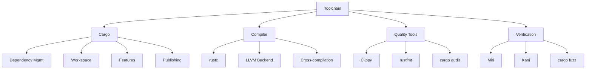
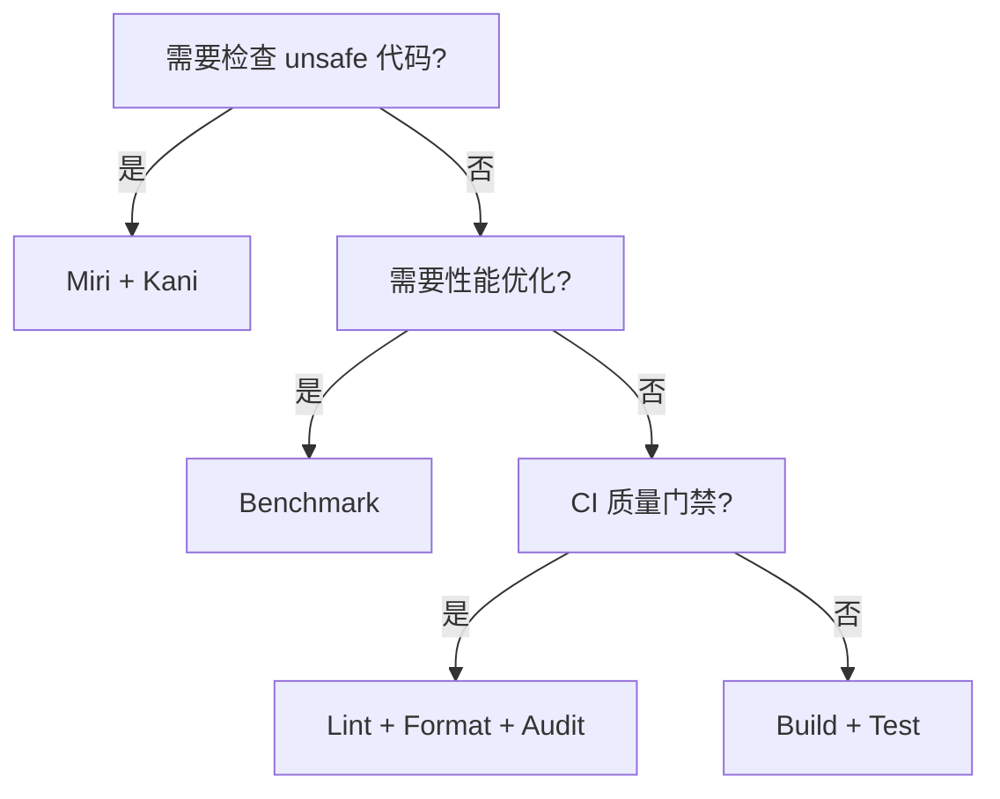

# Toolchain（工具链与 Cargo）

> **层级**: L6 生态工程
> **前置概念**: [Ownership](../01_foundation/01_ownership.md) · [Macros](../03_advanced/04_macros.md)
> **后置概念**: [CI/CD Integration]
> **主要来源**: [The Cargo Book](https://doc.rust-lang.org/cargo/) · [Rustup Documentation] · [Clippy Documentation]

---

**变更日志**:

- v1.0 (2026-05-12): 初始版本

---

## 一、权威定义

> **[Cargo Book]** Cargo is Rust's build system and package manager. Rustaceans use Cargo to manage their Rust projects because it handles a lot of tasks for you, such as building your code, downloading the libraries your code depends on, and building those libraries.

---

## 二、概念属性矩阵

### 2.1 核心工具矩阵

| **工具** | **功能** | **使用频率** | **关键特性** |
|:---|:---|:---|:---|
| `rustc` | 编译器 | 间接（通过 Cargo） | MIR、LLVM 后端、增量编译 |
| `cargo` | 构建/包管理 | 每次构建 | 依赖解析、工作区、SemVer |
| `rustup` | 工具链管理 | 安装/切换 | 多版本、target、组件 |
| `clippy` | 静态分析 | 持续 | 400+ lint、可配置 |
| `rustfmt` | 代码格式化 | 提交前 | 统一风格、可配置 |
| `cargo doc` | 文档生成 | 发布前 | 交叉链接、测试嵌入 |
| `cargo test` | 测试运行 | 持续 | 单元、集成、文档测试 |
| `cargo bench` | 基准测试 | 优化时 | Criterion、统计显著性 |
| `miri` | UB 检测 | 调试 unsafe | 解释执行、堆跟踪 |
| `cargo audit` | 安全审计 | CI | 依赖漏洞扫描 |

### 2.2 Cargo.toml vs package.json / go.mod / requirements.txt

| **维度** | **Cargo.toml** | **package.json** | **go.mod** | **requirements.txt** |
|:---|:---|:---|:---|:---|
| **格式** | TOML | JSON | Go 模块语法 | 纯文本 |
| **语义化版本** | ✅ 严格 | ✅ | ✅ 最小版本 | ❌ |
| **锁文件** | ✅ Cargo.lock | ✅ package-lock | ✅ go.sum | ❌ |
| **工作区** | ✅ Workspace | ⚠️ Lerna/Yarn | ✅ Workspace | ❌ |
| **特性系统** | ✅ Features | ❌ | ❌ | ❌ |
| **编译期脚本** | ✅ build.rs | ⚠️ postinstall | ❌ | ❌ |

---

## 三、思维导图

---

## 四、决策树

---

## 五、知识来源

| **论断** | **来源** | **可信度** |
|:---|:---|:---|
| Cargo 是 Rust 官方构建系统 | [Cargo Book] | ✅ |
| SemVer 用于依赖管理 | [Cargo Book] | ✅ |
| Clippy 有 400+ lint | [Clippy Docs] | ✅ |

---

## 六、待补充

- [ ] **TODO**: 补充 Workspace 高级用法
- [ ] **TODO**: 补充 Features 与条件编译
- [ ] **TODO**: 补充 Cross-compilation 配置
