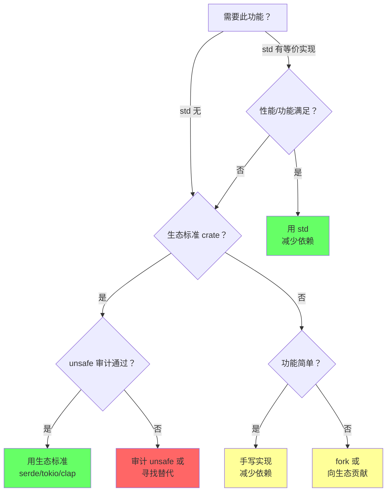
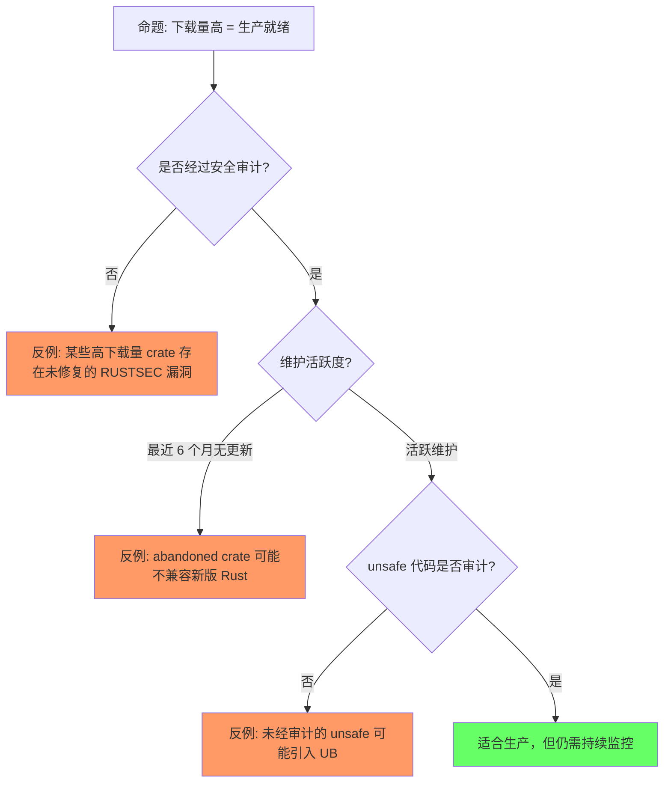
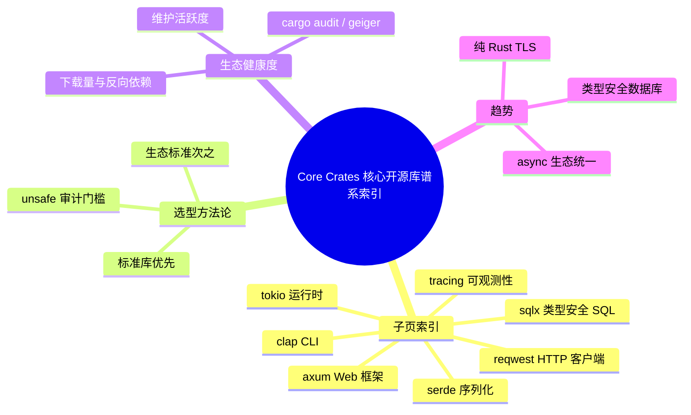

> **生态状态提示**：
>
> 本文档提及 `async-std` 与/或 `wasm32-wasi`。
> 请注意：
>
> - `async-std` 已于 **2025-08-27** 被 [RUSTSEC-2025-0052](https://rustsec.org/advisories/RUSTSEC-2025-0052) 宣布停止维护，建议迁移到 **smol**；历史项目或需要更丰富生态时可评估 **Tokio**。
> - `wasm32-wasi` 旧目标名已重命名为 **`wasm32-wasip1`**；WASI Preview 2 对应目标为 **`wasm32-wasip2`**。
> **Rust 版本**: 1.97.0+ (Edition 2024)

---

# Core Crates（核心开源库谱系索引）

> **代码状态**: ✅ 含可编译示例
>
> **EN**: Core Crates Index
> **Summary**: Navigation index for canonical `concept/` pages covering Rust's core ecosystem crates: serde, tokio, clap, tracing, reqwest, axum, and sqlx.
> **受众**: [进阶]
> **内容分级**: [综述级]
> **权威来源**: 本文件为 `concept/` 索引权威页；具体 crate 详见子页。
> **层级**: L6 生态工程
> **A/S/P 标记**: **A+P** — Application + Procedure
> **双维定位**: P×Eva — 评估生态 crate 的安全性和可维护性
> **前置概念**:
> [Ownership](../../01_foundation/01_ownership_borrow_lifetime/01_ownership.md) ·
> [Traits](../../02_intermediate/00_traits/01_traits.md) ·
> [Generics](../../02_intermediate/01_generics/01_generics.md) ·
> [Async](../../03_advanced/01_async/01_async.md) ·
> [Unsafe](../../03_advanced/02_unsafe/01_unsafe.md)
> **后置概念**: [Application Domains](../06_data_and_distributed/01_application_domains.md)
> **主要来源**:
> [crates.io](https://crates.io) ·
> [lib.rs](https:/lib.rs) ·
> [Rust Cookbook](https://rust-lang-nursery.github.io/rust-cookbook/) ·
> [Rust API Guidelines](https://rust-lang.github.io/api-guidelines/) ·
> [Brown University — Interactive Rust Book](https://rust-book.cs.brown.edu/) ·
> [Jung et al. — RustBelt: Securing the Foundations of Rust](https://plv.mpi-sws.org/rustbelt/popl18/)
> **定理链**: N/A — 描述性/综述性/导航性文档，不涉及形式化定理链
---

> **Bloom 层级**: L2-L6
**变更日志**:

- v1.0 (2026-05-12): 初始版本，覆盖 12 个功能域、40+ 核心 crate、选型矩阵、L1-L5 概念映射
- v2.0 (2026-07-31): Wave D 重构——将 serde/tokio/clap/tracing/reqwest/axum/sqlx 的详细内容拆分为独立 canonical 子页；本页保留索引、选型方法论与高阶趋势

---

## 一、权威定义

权威定义锚点：

- **crate（Wikipedia/官方 Book）**：Rust 的最小编译单元——库（`--crate-type lib`）或二进制；每个 crate 有独立的命名空间、隐私边界与编译产物。与「package」的区别：package 是 Cargo 概念（一个 Cargo.toml，可含 1 库 + 多二进制 crate），crate 是编译器概念。
- **crates.io**：官方包注册中心，语义化版本 + 不可变发布（已发布版本不可覆盖，只能 yank）；与 Cargo 的分工：crates.io 管「发现与分发」，Cargo 管「解析与构建」。
- **「核心 crate」的界定**：本页指生态中**事实标准的基础设施层**——serde（序列化）、tokio（异步运行时）、clap（CLI）、tracing（可观测性）、reqwest（HTTP 客户端）、axum（Web 框架）、sqlx（类型安全 SQL），特征是跨领域被传递依赖，选型错误影响全栈。

判定依据：评估「核心」与否看反向依赖数（crates.io 的 dependents 列表），而非下载量绝对值。

### 1.1 Wikipedia 权威定义

> **[Wikipedia: Library (computing)](https://en.wikipedia.org/wiki/Library_(computing))** A library is a collection of non-volatile resources used by computer programs, often for software development. These may include configuration data, documentation, help data, message templates, pre-written code and subroutines, classes, values or type specifications.
> **来源**: <https://en.wikipedia.org/wiki/Library_(computing)>
> **[Wikipedia: Package manager](https://en.wikipedia.org/wiki/Package_manager)** A package manager or package-management system is a collection of software tools that automates the process of installing, upgrading, configuring, and removing computer programs for a computer in a consistent manner.
> **来源**: <https://en.wikipedia.org/wiki/Package_manager>
> **[Wikipedia: Software framework](https://en.wikipedia.org/wiki/Software_framework)** A software framework is an abstraction in which software, providing generic functionality, can be selectively changed by additional user-written code, thus providing application-specific software.
> **来源**: <https://en.wikipedia.org/wiki/Software_framework>
> **[Wikipedia: Serialization](https://en.wikipedia.org/wiki/Serialization)** In computing, serialization is the process of translating a data structure or object state into a format that can be stored or transmitted and reconstructed later.
> **来源**: <https://en.wikipedia.org/wiki/Serialization>
> **[Wikipedia: Cryptography](https://en.wikipedia.org/wiki/Cryptography)** Cryptography is the practice and study of techniques for secure communication in the presence of adversarial behavior.
> **来源**: <https://en.wikipedia.org/wiki/Cryptography>

### 1.2 Cargo / crates.io 官方定义

> **[The Cargo Book](https://doc.rust-lang.org/cargo/index.html)** A crate is the smallest amount of code that the Rust compiler considers at a time. A crate can come in one of two forms: a binary crate or a library crate.
> **[crates.io](https://crates.io/)** crates.io is the Rust community's crate registry. It serves as a central location to discover and download packages.

---

## 二、核心 Crate 子页索引

> 以下每个 crate 都有独立的 `concept/` 权威页。本索引页只保留选型方法论与高阶趋势，不重复 crate 的具体 API、示例与陷阱。

| **Crate** | **功能域** | **一句话定位** | **权威页** |
|:---|:---|:---|:---|
| **serde** | 序列化 | Rust 事实标准序列化框架，`derive(Serialize, Deserialize)` 将 ADT 映射到 JSON/TOML/YAML 等格式 | [`02_serde.md`](./02_serde.md) |
| **tokio** | 异步运行时 | Rust async 生态的事实标准运行时，提供 work-stealing 调度、I/O 驱动、定时器与同步原语 | [`03_tokio.md`](./03_tokio.md) |
| **clap** | CLI 解析 | 命令行参数解析标准，`derive(Parser)` 自动生成 help、子命令与 shell 补全 | [`04_clap.md`](./04_clap.md) |
| **tracing** | 可观测性 | 结构化日志与分布式追踪框架，`span` + `event` + `#[instrument]` 适配 async 上下文 | [`05_tracing.md`](./05_tracing.md) |
| **reqwest** | HTTP 客户端 | 高级异步 HTTP 客户端，内置连接池、cookie、代理、TLS，基于 hyper | [`06_reqwest.md`](./06_reqwest.md) |
| **axum** | Web 框架 | Tokio 官方 Web 框架，类型安全路由 + Tower 中间件生态 | [`07_axum.md`](./07_axum.md) |
| **sqlx** | 数据库访问 | 编译期 SQL 检查的异步工具包，`query!` / `query_as!` 在编译期验证 schema | [`08_sqlx.md`](./08_sqlx.md) |

> **权威来源**: 上表每个 crate 的详细解释、代码示例、版本说明与测验均位于对应子页；本页仅提供导航与选型框架。

---

## 三、核心 Crate 功能域总览

```text
Rust Core Crates
├── 数据层
│   ├── serde 序列化
│   └── sqlx / diesel 数据库
├── 网络层
│   ├── axum Web 服务
│   └── reqwest HTTP 客户端
├── 运行时层
│   └── tokio 异步运行时
├── 工具层
│   ├── clap CLI
│   └── tracing 可观测性
└── 安全层
    ├── ring 密码学原语
    └── rustls TLS
```

> **认知功能**: 核心 crate 按数据/网络/运行时/工具/安全分层组织。选型时先定位功能域，再在该域内比较具体 crate。关键洞察：serde、tokio、clap 分别是各自领域的“生态标准”，优先默认选择可降低决策成本。

---

## 四、选型决策快速矩阵

| **你的需求** | **首选** | **次选** | **避免** | **理由** |
|:---|:---|:---|:---|:---|
| JSON 序列化 | serde + serde_json | simd-json | 手写解析器 | serde 是生态标准 |
| 异步 HTTP 服务端 | axum | actix-web, poem | 手写 hyper | axum = tokio 官方生态 |
| 异步 HTTP 客户端 | reqwest | hyper | 手写 TCP | reqwest 封装了最佳实践 |
| 类型安全 SQL | sqlx | sea-orm | 裸 SQL 字符串 | sqlx 编译期查询检查 |
| CLI 参数解析 | clap (derive) | bpaf | 手写 argv | clap derive 几乎零成本 |
| 结构化日志 | tracing | slog | println! | tracing 支持分布式追踪 |
| TLS/HTTPS | rustls | ring + 手动 | openssl-sys | rustls 纯 Rust，内存安全 |
| 数据并行 | rayon | crossbeam | 手写线程池 | rayon 迭代器抽象 |
| Python 绑定 | pyo3 | rust-cpython | 手写 C-API | pyo3 是生态标准 |
| 属性测试 | proptest | quickcheck | 手动边界测试 | proptest shrinking 强大 |

---

## 五、Crate 选择决策树：标准库 vs 第三方



> **认知功能**: 此图提供从“是否需要此功能”到具体决策的系统性判断框架。使用建议：优先验证 std 是否满足需求，再评估生态标准 crate 的安全审计状态。关键洞察：减少依赖是首要原则，但不应为了少依赖而放弃经过审计的标准 crate。

| **场景** | **用 std** | **用第三方** |
|:---|:---|:---|
| 序列化 | `Debug`/`Display` | `serde`（生态标准，不可替代） |
| 异步 | 无 | `tokio`（生态标准） |
| 并发 HashMap | `Mutex<HashMap>` | `dashmap`（高并发场景） |
| 锁 | `std::sync::Mutex` | `parking_lot`（性能敏感） |
| HTTP 客户端 | 无 | `reqwest`（功能丰富） |
| 日志 | `eprintln!` | `tracing`（结构化/分布式） |
| 错误处理 | `Box<dyn Error>` | `anyhow`/`thiserror`（人体工学） |

---

## 六、crates.io 生态健康度指标深度评估

| **指标** | **测量方式** | **健康阈值** | **风险信号** |
|:---|:---|:---|:---|
| 总下载量 | crates.io 页面 | > 100 万 | < 1 万且增长停滞 |
| 近期下载趋势 | crates.io / lib.rs | 月环比稳定或增长 | 连续 3 个月下降 > 30% |
| 维护状态 | GitHub last commit | < 3 个月 | > 12 个月无提交 |
| Issue/PR 响应 | GitHub issues | 关闭率 > 50% | 大量未回复 issue |
| MSRV 政策 | `Cargo.toml` / README | 明确声明 | 无声明且频繁 break |
| 安全审计 | RustSec / `cargo audit` | 无 RUSTSEC | 存在未修复漏洞 |
| 反向依赖数 | crates.io dependents | > 20 个知名 crate | 几乎无下游依赖 |
| 文档完整度 | docs.rs | 所有 pub API 有文档 | 大量 `#[allow(missing_docs)]` |
| 测试覆盖率 | codecov / 自述 | > 70% | 无测试或覆盖率 < 30% |
| unsafe 密度 | `cargo geiger` | < 1% 或完全审计 | > 10% 且无审计记录 |

> **关键洞察**: 下载量是 **popularity 指标**，不是 **质量指标**。`cargo audit` 和 `cargo geiger` 才是生产选型的硬性门槛。优先选择被大型项目（tokio、serde、rustls）作为依赖的 crate——它们的代码质量经过最广泛的实际验证。

---

## 七、扩展内容：选型方法论与趋势

crate 选型的可量化方法论：

**生态健康度五指标**：

1. **维护活跃度**：最近 6 个月有 commit/release；`cargo outdated` 看依赖链新鲜度；
2. **Bus factor**：贡献者 >1 人，避免单维护者失踪风险（`cargo supply-chain` 可审计）；
3. **下载量趋势**：crates.io 下载曲线平稳/上升，警惕「僵尸流行」（历史下载高但已停更）；
4. **依赖树体积**：`cargo tree --depth 1` 评估传递依赖，一个 HTTP 客户端引入 200+ 依赖是供应链审计负担；
5. **MSRV 与 Edition 政策**：与项目 MSRV 对齐，避免被迫升级工具链。

**2025–2026 趋势**：`tokio` 异步单极格局延续；`smol`/`async-std` 边缘化；`serde` + `thiserror`/`anyhow` 基础设施层稳定；嵌入式（`embassy`）、WASM 组件模型是增量热点。

判定依据：引入依赖前跑一遍五指标清单，两项不达标需在 ADR 中记录理由。

### 7.1 2025-2026 生态趋势

| **趋势** | **驱动 crate** | **说明** |
|:---|:---|:---|
| **async 生态统一** | tokio 1.x + AFIT | async fn in trait 稳定后，生态碎片化缓解 |
| **纯 Rust TLS 替代** | rustls + aws-lc-rs | 逐步替代 OpenSSL，尤其在容器/嵌入式 |
| **WASM 前端框架** | leptos, dioxus, yew | Rust 全栈开发成为可能 |
| **AI/ML 推理** | candle, burn, tch | Rust 在边缘推理领域崛起 |
| **嵌入式异步** | embassy | no_std + async 开启 IoT 新范式 |
| **类型安全数据库** | sqlx 编译期检查 | 运行时 SQL 错误向编译期迁移 |

### 7.2 学术论文引用

| **论文/著作** | **作者/年份** | **核心贡献** | **与 Rust Crate 的关联** |
|:---|:---|:---|:---|
| *The Rust Programming Language* (TRPL) | Klabnik & Nichols | Rust 官方教材 | 所有 crate 的设计前提 |
| *Serde: Serialization Framework* | github.com/serde-rs | 零成本抽象序列化 | serde 是 Trait + 宏的典范 |
| *Rayon: Data Parallelism in Rust* | Josh Stone / Niko, POPL 2015 workshop | 无数据竞争的数据并行 | Send/Sync + 所有权 ⇒ 安全并行 |
| *Security Analysis of Rust Cryptography* | 2023-2025 工业审计 | Rust 密码学库安全评估 | ring/rustls 审计基础 |
| *Tokio: An Asynchronous Rust Runtime* | tokio.rs Team | 协作式调度 + work-stealing | tokio 的调度理论 |
| *Rustls: Modern TLS in Rust* | rustls 团队 | 内存安全 TLS | 替代 OpenSSL 的工程实践 |

---

## 八、反命题与边界分析

### 命题: "crates.io 上下载量高的 crate 一定适合生产环境"



> **认知功能**: 此图解构"下载量=质量"的直觉谬误，建立多维评估意识。使用建议：将下载量作为筛选入口，用 `cargo audit` 和 unsafe 审计作为硬性门槛。关键洞察：popularity 指标不能替代 security 验证，供应链安全需要主动审计。

### 8.1 Crate 选型检查清单

| **检查项** | **工具** | **通过标准** |
|:---|:---|:---|
| 安全漏洞 | `cargo audit` | 无未修复 RUSTSEC |
| 许可证合规 | `cargo deny` | SPDX 白名单通过 |
| 维护活跃度 | crates.io / GitHub | 最近 6 个月有提交 |
| unsafe 审计 | `cargo geiger` / 人工 | unsafe 行数可接受且有审计记录 |
| 编译时间影响 | `cargo build --timings` | 不显著拖慢 CI |
| 二进制体积 | `cargo bloat` | 单态化膨胀可控 |
| 文档完整性 | `cargo doc` | 所有 pub API 有文档 |

---

## 九、嵌入式测验

### 测验 1：核心 crate 选型原则（评价层）

选择生产级 crate 时，以下哪个指标最不重要？

- A. crates.io 下载量
- B. 最近更新时间
- C. crate 作者的个人 GitHub 粉丝数

<details>
<summary>✅ 答案</summary>

**C. crate 作者的个人 GitHub 粉丝数**。

Rust crate 选型应关注：

- ✅ 下载量和反向依赖数量（生态接受度）
- ✅ 最近更新和维护活跃度
- ✅ 文档完整度和测试覆盖率
- ✅ 安全审计状态（`cargo audit` / `cargo vet`）
- ✅ MSRV 和 SemVer 稳定性
- ❌ 作者社交媒体影响力（与代码质量无直接关系）

</details>

---

### 测验 2：标准库 vs 第三方（应用层）

以下哪种场景**最应该**使用第三方生态 crate 而非 std？

- A. 格式化字符串输出
- B. 异步 I/O 服务
- C. 基本文件读写

<details>
<summary>✅ 答案</summary>

**B. 异步 I/O 服务**。

std 不提供异步运行时。异步 I/O 服务需要 tokio 等生态 crate。字符串格式化和基本文件读写 std 已覆盖。

</details>

---

### 测验 3：生态健康度指标（分析层）

以下哪项是判断 crate 生产就绪的**硬性门槛**？

- A. GitHub Stars > 1000
- B. `cargo audit` 无未修复 RUSTSEC
- C. README 有中文翻译

<details>
<summary>✅ 答案</summary>

**B. `cargo audit` 无未修复 RUSTSEC**。

`cargo audit` 扫描已知漏洞；stars 和翻译与安全性/质量无直接关系。

</details>

---

## 十、来源与延伸阅读

| 来源 | 可信度 | 说明 |
| [Rust Reference](https://doc.rust-lang.org/reference/introduction.html) | ✅ 一级 | 语言参考 |
| [The Rust Programming Language](https://doc.rust-lang.org/book/title-page.html) | ✅ 一级 | 官方教材 |
| [crates.io](https://crates.io) | ✅ 一级 | 包注册中心 |
| [lib.rs](https://lib.rs) | ✅ 二级 | 生态统计与发现 |
| [Rust Cookbook](https://rust-lang-nursery.github.io/rust-cookbook/) | ✅ 二级 | 实践配方 |
| [Rust API Guidelines](https://rust-lang.github.io/api-guidelines/) | ✅ 一级 | API 设计指南 |
| [RustSec](https://rustsec.org/) | ✅ 一级 | 漏洞数据库 |
| [cargo-geiger](https://github.com/rust-secure-code/cargo-geiger) | ✅ 二级 | unsafe 代码统计 |

---

## 相关概念链接

| 概念 | 文件 | 关系 |
|:---|:---|:---|
| serde | [`02_serde.md`](./02_serde.md) | 序列化权威页 |
| tokio | [`03_tokio.md`](./03_tokio.md) | 异步运行时权威页 |
| clap | [`04_clap.md`](./04_clap.md) | CLI 解析权威页 |
| tracing | [`05_tracing.md`](./05_tracing.md) | 可观测性权威页 |
| reqwest | [`06_reqwest.md`](./06_reqwest.md) | HTTP 客户端权威页 |
| axum | [`07_axum.md`](./07_axum.md) | Web 框架权威页 |
| sqlx | [`08_sqlx.md`](./08_sqlx.md) | 类型安全 SQL 权威页 |
| 所有权 / Drop | [`../../01_foundation/01_ownership_borrow_lifetime/01_ownership.md`](../../01_foundation/01_ownership_borrow_lifetime/01_ownership.md) | RAII 资源管理根基 |
| Trait 系统 | [`../../02_intermediate/00_traits/01_traits.md`](../../02_intermediate/00_traits/01_traits.md) | derive 宏 + 接口抽象 |
| 泛型 | [`../../02_intermediate/01_generics/01_generics.md`](../../02_intermediate/01_generics/01_generics.md) | 零成本抽象 |
| 异步编程 | [`../../03_advanced/01_async/01_async.md`](../../03_advanced/01_async/01_async.md) | tokio/axum 根基 |
| 宏系统 | [`../../03_advanced/03_proc_macros/01_macros.md`](../../03_advanced/03_proc_macros/01_macros.md) | serde/clap derive |
| 应用领域 | [`../06_data_and_distributed/01_application_domains.md`](../06_data_and_distributed/01_application_domains.md) | crate 的工程落地 |

---

> **权威来源**: [Rust Reference](https://doc.rust-lang.org/reference/introduction.html), [The Rust Programming Language](https://doc.rust-lang.org/book/title-page.html), [crates.io](https://crates.io)
>
> **权威来源对齐变更日志**: 2026-07-31 Wave D 拆分核心 crate 子页并更新索引

**文档版本**: 2.0
**最后更新**: 2026-07-31
**状态**: ✅ 索引页重构完成

---

## 🧭 思维导图（Mindmap）



> **认知功能**: 本 mindmap 从本页结构提炼，中心为索引页，分支覆盖子页导航、选型方法论、生态健康度评估与趋势，可作为本章的快速导航与复习索引。
>
> **跨层链接（L5）**: 从比较语言学视角看 Rust 生态定位，参见 [语言语义模型矩阵](../../05_comparative/00_paradigms/05_language_semantic_model_matrix.md)。
