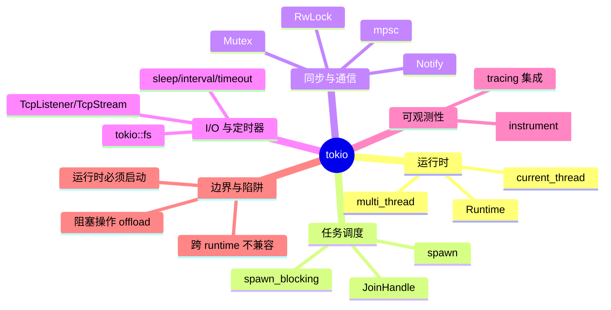

> **EN**: Tokio Asynchronous Runtime
> **Summary**: Tokio is the de-facto Rust asynchronous runtime that schedules `Future` tasks across a work-stealing thread pool while upholding `Send`/`Sync` and `Pin` safety.
> **Rust 版本**: 1.97.0+ (Edition 2024)
> **生态版本**: tokio 1.53.1
> **Bloom 层级**: L6
> **权威来源**: 本文件为 `concept/` 权威页。
> **A/S/P 标记**: **P** — Procedure
> **前置概念**:
> [所有权与借用](../../01_foundation/01_ownership_borrow_lifetime/01_ownership.md) ·
> [Traits](../../02_intermediate/00_traits/01_traits.md) ·
> [泛型](../../02_intermediate/01_generics/01_generics.md) ·
> [异步编程](../../03_advanced/01_async/01_async.md) ·
> [Pin/Unpin](../../03_advanced/01_async/08_pin_unpin.md) ·
> [Send/Sync](../../03_advanced/00_concurrency/02_send_sync_auto_traits.md)
> **后置概念**:
> [axum](./07_axum.md) ·
> [tracing](./05_tracing.md) ·
> [Tokio 运行时内部机制](../04_web_and_networking/10_tokio_runtime_internals.md) ·
> [应用领域](../06_data_and_distributed/01_application_domains.md)
> **主要来源**:
> [Tokio 官方文档](https://tokio.rs/) ·
> [docs.rs/tokio](https://docs.rs/tokio/latest/tokio/) ·
> [Tokio GitHub](https://github.com/tokio-rs/tokio) ·
> [The Rust Async Book](https://rust-lang.github.io/async-book/) ·
> [Rust Reference](https://doc.rust-lang.org/reference/)

---

# Tokio 异步运行时

## 一、权威定义

- **官方定义**：Tokio 是 Rust 的异步运行时（asynchronous runtime），提供多线程协作调度、I/O 驱动、定时器、同步原语与任务管理，是 Rust 异步生态的事实标准。
- **工业定位**：它位于 `async/await` 语法与操作系统事件源（epoll/kqueue/IOCP/io_uring）之间，是 Rust **所有权（Ownership） + `Send`/`Sync` + `Pin`** 三大核心概念的工程化容器。
- **关键洞察**：Tokio 的 `Runtime` 是显式的——与 Go 的隐式全局调度器不同，开发者可以创建、配置和销毁独立的运行时实例；任务（`Task`）必须满足 `Send` 才能跨线程调度，`Pin` 保证自引用状态机（self-referential state machine）的内存安全。

> **来源**: [tokio.rs](https://tokio.rs/) · [docs.rs/tokio](https://docs.rs/tokio/latest/tokio/) · 可信度: ✅

---

## 二、关键类型与 Traits

| **类型 / Trait** | **角色** | **说明** |
|:---|:---|:---|
| `tokio::runtime::Runtime` | 运行时实例 | 持有工作线程池、I/O 驱动与阻塞线程池；通过 `Runtime::new()` 或 `#[tokio::main]` 创建 |
| `tokio::task::JoinHandle<T>` | 任务句柄 | `spawn` 返回的 `Future`，`await` 获取任务结果 |
| `tokio::sync::mpsc` | 多生产者单消费者通道 | 异步 channel，`send`/`recv` 都返回 `Future` |
| `tokio::sync::Mutex` | 异步互斥锁 | 跨 `.await` 持锁时使用；同线程内优先用 `std::sync::Mutex` |
| `tokio::time::{sleep, interval, timeout}` | 定时器 | 依赖运行时的 reactor，取消安全需额外注意 |
| `tokio::net::{TcpListener, TcpStream}` | 异步网络 I/O | 基于 reactor 的非阻塞 TCP |
| `tokio::fs` | 异步文件系统 | 内部将操作 offload 到 `spawn_blocking` |
| `tokio::task::spawn_blocking` | 阻塞任务池 | 运行 CPU 密集或同步阻塞代码，避免饿死 async worker |
| `Future` (std) | 核心抽象 | `async` 块被编译为匿名 `Future`；Tokio 负责 `poll` 调度 |

---

## 三、惯用法与示例

### 3.1 最小可用示例

```rust
// Cargo.toml
// [dependencies]
// tokio = { version = "1", features = ["full"] }

#[tokio::main]
async fn main() {
    let handle = tokio::spawn(async {
        println!("hello from a task");
        42
    });

    let result = handle.await.unwrap();
    println!("task returned {}", result);
}
```

### 3.2 组合：`select!` 与超时

```rust
use tokio::time::{sleep, Duration};

#[tokio::main]
async fn main() {
    let work = async {
        sleep(Duration::from_millis(100)).await;
        "done"
    };

    let result = tokio::select! {
        v = work => v,
        _ = sleep(Duration::from_millis(50)) => "timeout",
    };

    println!("{}", result);
}
```

### 3.3 阻塞代码 offload

```rust
use tokio::task;

#[tokio::main]
async fn main() {
    // ✅ CPU 密集或同步 I/O 应放到 blocking pool
    let result = task::spawn_blocking(|| {
        std::thread::sleep(std::time::Duration::from_secs(1));
        "heavy computation finished"
    })
    .await
    .unwrap();

    println!("{}", result);
}
```

---

## 四、常见陷阱与边界测试

### 4.1 陷阱：在运行时外调用 `tokio::spawn`

❌ **错误代码**

```rust
use tokio::task;

fn main() {
    // 运行时 panic: there is no reactor running
    let _ = task::spawn(async { 42 });
}
```

✅ **修正代码**

```rust
#[tokio::main]
async fn main() {
    let handle = tokio::spawn(async { 42 });
    let result = handle.await.unwrap();
    println!("{}", result);
}
```

> **解释**：`tokio::spawn` 需要当前线程处于活跃的运行时上下文中。运行时通过线程局部存储维护上下文；直接调用会 panic。这与 Go 的 `go` 关键字（隐式全局调度器）形成对比——Rust 的显式运行时允许一个程序中存在多个隔离的运行时实例。

### 4.2 陷阱：在 async 任务中执行阻塞操作

❌ **错误代码**

```rust,ignore
#[tokio::main]
async fn main() {
    tokio::spawn(async {
        // ❌ 阻塞操作占用 tokio worker 线程，导致其他任务饥饿
        std::thread::sleep(std::time::Duration::from_secs(10));
    });
}
```

✅ **修正代码**

```rust
#[tokio::main]
async fn main() {
    tokio::task::spawn_blocking(|| {
        // ✅ 阻塞代码在独立的 blocking pool 中运行
        std::thread::sleep(std::time::Duration::from_secs(10));
    })
    .await
    .unwrap();
}
```

> **解释**：Tokio 默认 worker 线程数等于 CPU 核心数。阻塞操作会占用 worker 线程，降低 async 任务并发效率。应使用 `tokio::task::spawn_blocking` 或 `tokio::fs`/`tokio::time::sleep` 替代同步阻塞调用。

### 4.3 陷阱：跨 runtime 混用 I/O 原语

❌ **错误代码**

```rust,ignore
use tokio::sync::mpsc;

async fn mixed_task() {
    let (tx, mut rx) = mpsc::channel(10);
    // ❌ 错误：在其他 runtime（如 async-std）中 spawn 使用 tokio channel 的任务
    // async_std::task::spawn(async move {
    //     tx.send(1).await.unwrap();
    // });
}
```

✅ **修正代码**

```rust
use tokio::sync::mpsc;

#[tokio::main]
async fn main() {
    let (tx, mut rx) = mpsc::channel(10);

    tokio::spawn(async move {
        tx.send(1).await.unwrap();
    });

    assert_eq!(rx.recv().await.unwrap(), 1);
}
```

> **解释**：`tokio::sync::mpsc` 的 `send`/`recv` 底层依赖 tokio 的 reactor 进行任务唤醒。在其他 runtime 上调用可能导致任务永不唤醒（deadlock）或 panic。计算型 future 可跨 runtime 使用，但 I/O 和定时器必须匹配 runtime。

---

## 五、版本说明

- **当前稳定版本**：`tokio` 1.53.1（以根 `Cargo.toml` workspace 依赖为准）。
- **MSRV 政策**：tokio 1.x 系列通常支持较新的稳定 Rust；具体以 [crates.io](https://crates.io/crates/tokio) 和 GitHub Releases 为准。
- **主要特性**（1.x）：
  - 多线程 work-stealing 调度器（默认）。
  - `current_thread` flavor，适合资源受限环境（如 WASM、嵌入式）。
  - io-uring 支持（Linux，`tokio-uring` 生态）。
  - 与 `tracing` 深度集成，支持异步感知的 span 传播。
- **Edition 2024 注意**：`async fn` in trait（AFIT）已在 Rust 1.75 稳定，tokio 生态广泛使用；在 Edition 2024 下继续兼容，无额外迁移成本。
- **趋势**：tokio 在 Rust 异步生态中保持单极格局；`async-std` 已于 2025 年停止维护，`smol` 作为轻量替代存在，`embassy` 面向嵌入式场景。

> **来源**: [tokio-rs/tokio GitHub Releases](https://github.com/tokio-rs/tokio/releases) · [crates.io/tokio](https://crates.io/crates/tokio)

---

## 六、思维导图（Mindmap)



---

## 七、嵌入式测验

### 测验 1：Tokio 运行时的默认调度模型（理解层）

Tokio 默认的 `#[tokio::main]` 使用哪种调度模型？

- A. 单线程 `current_thread`
- B. 多线程 work-stealing
- C. 全局单一事件循环

<details>
<summary>✅ 答案</summary>

**B. 多线程 work-stealing**。

`#[tokio::main]` 默认使用多线程运行时，worker 线程数等于 CPU 核心数，通过 work-stealing 调度任务。`current_thread` 需要显式指定：

```rust
#[tokio::main(flavor = "current_thread")]
async fn main() {}
```

</details>

---

### 测验 2：`tokio::spawn` 的调用上下文（应用层）

以下代码能否直接编译运行？

```rust
fn main() {
    let _ = tokio::spawn(async { 42 });
}
```

- A. 能，tokio 会自动启动运行时
- B. 不能，会编译错误
- C. 能编译，但运行时会 panic

<details>
<summary>✅ 答案</summary>

**C. 能编译，但运行时会 panic**。

`tokio::spawn` 需要在活跃的运行时上下文中执行。上述代码没有启动运行时，运行时会 panic："there is no reactor running"。正确做法是使用 `#[tokio::main]` 或在 `Runtime::block_on` 内部调用。

</details>

---

### 测验 3：阻塞操作的处理（应用层）

在 tokio async 任务中执行 `std::thread::sleep(10s)` 的主要问题是什么？

- A. 会触发编译错误
- B. 会阻塞 worker 线程，导致其他 async 任务饥饿
- C. 会自动 offload 到 blocking pool

<details>
<summary>✅ 答案</summary>

**B. 会阻塞 worker 线程，导致其他 async 任务饥饿**。

`std::thread::sleep` 是同步阻塞调用。在 tokio worker 线程中执行会占用该线程 10 秒，期间该线程无法 poll 其他任务。应使用 `tokio::time::sleep` 或 `tokio::task::spawn_blocking`。

</details>

---

### 测验 4：跨 runtime 的 channel（分析层）

`tokio::sync::mpsc` 能否在 `async-std` runtime 上正常工作？

- A. 能，channel 是 runtime 无关的
- B. 不能，可能导致任务永不唤醒
- C. 仅在 tokio 1.50+ 可以

<details>
<summary>✅ 答案</summary>

**B. 不能，可能导致任务永不唤醒**。

`tokio::sync::mpsc` 的异步 `send`/`recv` 依赖 tokio 的 reactor 唤醒任务。在其他 runtime 上调用时，reactor 不会收到唤醒通知，任务可能永远 pending。计算型 future 可跨 runtime，但 I/O 和定时器必须匹配 runtime。

</details>

---

### 测验 5：`current_thread` 的适用场景（评价层）

以下哪个场景最适合 `#[tokio::main(flavor = "current_thread")]`？

- A. 高并发 HTTP 服务端
- B. 资源受限的 WASM 目标
- C. CPU 密集型数据并行

<details>
<summary>✅ 答案</summary>

**B. 资源受限的 WASM 目标**。

`current_thread` 所有任务都在单个 OS 线程上运行，适合资源受限、不支持多线程或不需要多核并发的环境。高并发服务端应使用默认多线程 flavor；CPU 密集型任务应使用 `rayon` 或 `spawn_blocking`，而非 async 任务。

</details>

---

## 八、国际权威来源

- **P0 — Rust 官方**
  - [The Rust Programming Language — Async/Await](https://doc.rust-lang.org/book/ch17-00-async-await.html) — Rust Book 异步章节
  - [Asynchronous Programming in Rust](https://rust-lang.github.io/async-book/) — 官方异步书籍
  - [Rust Reference](https://doc.rust-lang.org/reference/introduction.html) — 语言参考
  - 链接验证状态：✅ 可公开访问

- **P2 — Crate 官方文档与仓库**
  - [tokio.rs](https://tokio.rs/) — Tokio 项目主页与学习资源
  - [docs.rs/tokio](https://docs.rs/tokio/latest/tokio/) — API 文档
  - [tokio-rs/tokio GitHub](https://github.com/tokio-rs/tokio) — 源码、Releases、CHANGELOG
  - [Tokio Internals](https://tokio.rs/blog/2019-10-scheduler) — 调度器内部机制博客
  - 链接验证状态：✅ 可公开访问

- **学术/工业参考**
  - [Tokio: An Asynchronous Rust Runtime](https://tokio.rs/) — tokio.rs Team，协作式调度 + work-stealing 的工程实践
  - 链接验证状态：✅ 可公开访问

---

## 九、相关概念链接

| 概念 | 文件 | 关系 |
|:---|:---|:---|
| 所有权 / Drop | [`../../01_foundation/01_ownership_borrow_lifetime/01_ownership.md`](../../01_foundation/01_ownership_borrow_lifetime/01_ownership.md) | 任务生命周期与资源管理根基 |
| Trait 系统 | [`../../02_intermediate/00_traits/01_traits.md`](../../02_intermediate/00_traits/01_traits.md) | `Future`、`Service` 等接口抽象 |
| 泛型（Generics） | [`../../02_intermediate/01_generics/01_generics.md`](../../02_intermediate/01_generics/01_generics.md) | 零成本抽象与单态化 |
| 异步编程 | [`../../03_advanced/01_async/01_async.md`](../../03_advanced/01_async/01_async.md) | tokio 的核心前置概念 |
| Pin/Unpin | [`../../03_advanced/01_async/08_pin_unpin.md`](../../03_advanced/01_async/08_pin_unpin.md) | 自引用状态机安全 |
| Send/Sync | [`../../03_advanced/00_concurrency/02_send_sync_auto_traits.md`](../../03_advanced/00_concurrency/02_send_sync_auto_traits.md) | 跨线程任务调度安全 |
| Tokio 运行时内部机制 | [`../04_web_and_networking/10_tokio_runtime_internals.md`](../04_web_and_networking/10_tokio_runtime_internals.md) | 架构/驱动/blocking 池深度页 |
| axum | [`./07_axum.md`](./07_axum.md) | tokio 官方 Web 框架 |
| tracing | [`./05_tracing.md`](./05_tracing.md) | 异步感知可观测性 |
| 应用领域 | [`../06_data_and_distributed/01_application_domains.md`](../06_data_and_distributed/01_application_domains.md) | crate 的工程落地 |
| Rust vs Go | [`../../05_comparative/01_systems_languages/03_rust_vs_go.md`](../../05_comparative/01_systems_languages/03_rust_vs_go.md) | 异步运行时与并发模型的跨语言对比。
