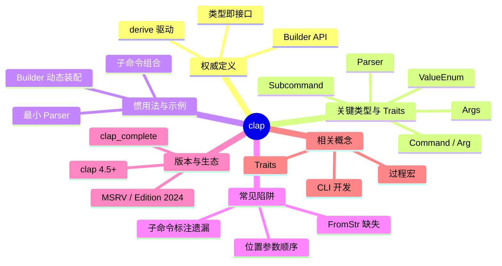

> **EN**: clap — Command-Line Argument Parser for Rust
> **Summary**: A canonical guide to `clap`, Rust's de-facto derive-driven CLI argument parser, covering its key traits, idiomatic usage, common pitfalls, and ecosystem integration.
> **Rust 版本**: 1.97.0+ (Edition 2024)
> **生态版本**: clap 4.5+
> **Bloom 层级**: L6
> **权威来源**: 本文件为 `concept/` 权威页。
> **A/S/P 标记**: **P** — Procedure
> **前置概念**:
> [Traits](../../02_intermediate/00_traits/01_traits.md) ·
> [Macros](../../03_advanced/03_proc_macros/01_macros.md) ·
> [Error Handling](../../02_intermediate/03_error_handling/01_error_handling.md) ·
> [CLI Development](../../06_ecosystem/05_systems_and_embedded/04_cli_development.md)
> **后置概念**:
> [Cargo Script](../../06_ecosystem/01_cargo/01_cargo_script.md) ·
> [Application Domains](../../06_ecosystem/06_data_and_distributed/01_application_domains.md)
> **主要来源**:
> [clap documentation](https://docs.rs/clap/latest/clap/) ·
> [clap GitHub](https://github.com/clap-rs/clap) ·
> [Rust CLI Book](https://rust-cli.github.io/book/index.html) ·
> [Rust API Guidelines](https://rust-lang.github.io/api-guidelines/)

---

# clap：Rust 命令行参数解析权威页

## 一、权威定义

- **clap 官方定义**：*A full featured, fast Command Line Argument Parser for Rust.* ([docs.rs/clap](https://docs.rs/clap/latest/clap/))
- **crate（Rust Book）**：Rust 的最小编译单元；每个 crate 有独立的命名空间、隐私边界与编译产物。`clap` 作为库 crate，通过 Cargo 分发到依赖它的二进制 crate 中。
- **生态定位**：`clap` 是 Rust CLI 参数解析领域的**事实标准**。它提供两种风格 API：
  - **Derive API**（推荐）：通过 `#[derive(Parser)]` 在编译期从结构体/枚举生成 `Command`、`Arg` 与解析逻辑，是 Rust **过程宏 + Trait 系统**的工业级典范。
  - **Builder API**：以 `Command::new(...).arg(...)` 手动装配命令树，适合高度动态或无法使用 derive 的场景。

> **关键洞察**：`clap` 的 derive 宏将声明式数据结构（struct/enum）编译期转换为命令行契约，实现“类型即接口”。这种设计在提供零运行时反射开销的同时，自动生成 `--help`、shell 补全与验证逻辑。

---

## 二、关键类型与 Traits

| **类型 / Trait** | **作用域** | **说明** |
|:---|:---|:---|
| `Parser` | derive | 入口派生宏。将 struct/enum 转为可执行 CLI，提供 `Cli::parse()`。 |
| `Subcommand` | derive | 将 enum 变体映射为子命令（如 `git add`、`git commit`）。 |
| `Args` | derive | 将 struct 映射为一组参数，可被 `Subcommand` 变体嵌套复用。 |
| `ValueEnum` | derive | 将 enum 映射为允许字符串值，自动生成 `--mode=foo` 校验。 |
| `Command` | builder | 命令树根节点，承载名称、版本、作者、全局参数与子命令。 |
| `Arg` | builder | 单个参数定义，控制名称、短/长选项、是否必需、默认值、校验。 |
| `ArgMatches` | builder | 解析结果容器，通过索引或名称提取原始值。 |
| `Error` | runtime | 解析/校验失败时返回，可自定义退出码与帮助文本。 |

> **关系速记**：`Parser` ≈ 整个 CLI；`Subcommand` ≈ 动词；`Args` ≈ 动词的宾语/选项块；`ValueEnum` ≈ 有限枚举值。

---

## 三、惯用法与示例

### 3.1 最小可用示例（derive）

```rust,ignore
// ✅ Cargo.toml
// [dependencies]
// clap = { version = "4.5", features = ["derive"] }

use clap::Parser;

#[derive(Parser, Debug)]
#[command(name = "greet", version = "1.0", about = "Say hello")]
struct Cli {
    /// Name of the person to greet
    name: String,

    /// Number of times to greet
    #[arg(short, long, default_value_t = 1)]
    count: u8,
}

fn main() {
    let cli = Cli::parse();
    for _ in 0..cli.count {
        println!("Hello, {}!", cli.name);
    }
}
```

运行效果：

```bash
$ greet Alice --count 3
Hello, Alice!
Hello, Alice!
Hello, Alice!
```

### 3.2 子命令与共享参数（realistic idiom）

```rust,ignore
// ✅ Cargo.toml
// [dependencies]
// clap = { version = "4.5", features = ["derive"] }

use clap::{Parser, Subcommand, Args};

#[derive(Parser, Debug)]
#[command(name = "todo", version = "0.1.0", about = "A tiny task tracker")]
struct Cli {
    #[command(subcommand)]
    command: Commands,
}

#[derive(Subcommand, Debug)]
enum Commands {
    /// Add a new task
    Add(AddArgs),
    /// List all tasks
    List {
        /// Show completed tasks only
        #[arg(short, long)]
        done: bool,
    },
}

#[derive(Args, Debug)]
struct AddArgs {
    /// Task description
    description: String,

    /// Priority level
    #[arg(short, long, value_enum, default_value_t = Priority::Medium)]
    priority: Priority,
}

#[derive(clap::ValueEnum, Clone, Debug)]
enum Priority {
    Low,
    Medium,
    High,
}

fn main() {
    let cli = Cli::parse();
    match cli.command {
        Commands::Add(args) => println!("Adding {:?} priority task: {}", args.priority, args.description),
        Commands::List { done } => println!("Listing tasks, done={}", done),
    }
}
```

运行效果：

```bash
$ todo add "review PR" -p high
Adding High priority task: review PR

$ todo list --done
Listing tasks, done=true
```

### 3.3 Builder API 动态装配（动态场景）

```rust,ignore
use clap::{Arg, Command};

let cmd = Command::new("dynamic")
    .version("1.0")
    .arg(Arg::new("config")
        .short('c')
        .long("config")
        .value_name("FILE")
        .help("Path to config file"));

let matches = cmd.get_matches();
if let Some(config) = matches.get_one::<String>("config") {
    println!("config: {}", config);
}
```

---

## 四、常见陷阱与边界测试

### 陷阱 1：derive 字段类型不支持 `FromStr`

`clap` derive 依赖标准库 `FromStr` trait 将字符串转换为字段类型。若类型未实现 `FromStr`，会在**编译期**报错。

❌ 错误代码：

```rust,compile_fail
use clap::Parser;

#[derive(Parser)]
struct Cli {
    // 假设 Custom 未实现 FromStr
    value: Custom,
}

struct Custom;

fn main() {
    let _ = Cli::parse();
}
```

✅ 修正：为自定义类型实现 `FromStr`，或改用 `String` 后手动解析。

```rust,ignore
use clap::Parser;
use std::str::FromStr;

#[derive(Parser)]
struct Cli {
    value: Custom,
}

#[derive(Debug)]
struct Custom(u32);

impl FromStr for Custom {
    type Err = std::num::ParseIntError;
    fn from_str(s: &str) -> Result<Self, Self::Err> {
        s.parse().map(Custom)
    }
}

fn main() {
    let cli = Cli::parse();
    println!("{:?}", cli.value);
}
```

### 陷阱 2：位置参数与可选参数的顺序冲突

位置参数（positional）必须出现在所有可选参数之后定义，否则 `--flag` 可能被误解析为位置参数值。

❌ 错误代码：

```rust,ignore
use clap::Parser;

#[derive(Parser)]
struct Cli {
    #[arg(short, long)]
    verbose: bool,

    // 位置参数若在可选参数之后仍可工作；若在中间则语义混乱
    input: String,

    #[arg(short, long)]
    output: Option<String>,
}
```

✅ 修正：将位置参数统一放到 derive 字段的**最后**。

```rust,ignore
use clap::Parser;

#[derive(Parser)]
struct Cli {
    #[arg(short, long)]
    verbose: bool,

    #[arg(short, long)]
    output: Option<String>,

    input: String, // 位置参数放最后
}
```

### 陷阱 3：子命令枚举缺少 `#[command(subcommand)]` 标注

入口结构体必须显式标记子命令字段，否则 `clap` 会把它当作普通参数处理。

❌ 错误代码：

```rust,ignore
use clap::{Parser, Subcommand};

#[derive(Parser)]
struct Cli {
    // 缺少 #[command(subcommand)]
    command: Commands,
}

#[derive(Subcommand)]
enum Commands {
    Add { task: String },
}
```

✅ 修正：

```rust,ignore
use clap::{Parser, Subcommand};

#[derive(Parser)]
struct Cli {
    #[command(subcommand)]
    command: Commands,
}

#[derive(Subcommand)]
enum Commands {
    Add { task: String },
}
```

---

## 五、版本说明

- **当前稳定版本**：`clap 4.5.x`（截至 2026 年）。`clap 4` 是 2022 年发布的主版本，derive API 成熟，API 稳定。
- **MSRV 政策**：`clap 4.5` 通常要求 Rust ≥ 1.74；项目使用 `rust-version = "1.97.0"` 时完全兼容。具体以 [crates.io 页面](https://crates.io/crates/clap) 与 `Cargo.toml` 声明为准。
- **关键特性（4.x）**：
  - `#[derive(Parser)]` 全面替代 3.x 的 `structopt`；
  - 原生 `ValueEnum` 支持；
  - 自动生成 shell 补全脚本（通过 `clap_complete` crate）；
  - 更严格的参数验证与更清晰的错误信息；
  - 支持 `cargo` 风格子命令与颜色控制（`--color`）。
- **Edition 2024 注意**：`clap` derive 宏生成的代码完全兼容 Edition 2024；无额外 `unsafe` 或 FFI 边界。
- **姊妹 crate**：
  - `clap_complete`：生成 Bash/Zsh/Fish/PowerShell 补全脚本；
  - `clap_lex`：`clap` 内部词法分析器，通常不直接使用；
  - `clap_derive`：derive 宏实现包。

---

## 六、思维导图（Mindmap）



> **认知功能**：此图从定义、类型、用法、陷阱、版本、关联六个维度建立 `clap` 的认知地图。使用建议：快速选型时确认是否需要子命令与枚举值；实现时优先 derive，复杂动态场景再切 builder。

---

## 七、嵌入式测验

### 测验 1：`Parser` derive 的核心优势是什么？（理解层）

- A. 运行时反射解析参数
- B. 编译期从 struct/enum 生成命令行契约与 `--help`
- C. 自动下载依赖并安装 CLI

<details>
<summary>✅ 答案</summary>

**B. 编译期从 struct/enum 生成命令行契约与 `--help`**。

`clap` 的 derive API 基于 Rust 过程宏，在编译期把类型结构转换为参数定义、验证逻辑与帮助文本。运行时零反射，性能与类型安全兼得。
</details>

---

### 测验 2：下列哪个 trait 用于把枚举变体映射为子命令？（理解层）

- A. `Parser`
- B. `Subcommand`
- C. `Args`
- D. `ValueEnum`

<details>
<summary>✅ 答案</summary>

**B. `Subcommand`**。

`#[derive(Subcommand)]` 标记的枚举会被 `clap` 解释为子命令集合；每个变体可嵌套 `Args` 结构体以复用参数块。
</details>

---

### 测验 3：自定义类型直接作为 derive 字段类型需要什么？（应用层）

- A. 实现 `Display`
- B. 实现 `FromStr`
- C. 实现 `Clone`
- D. 什么都不需要

<details>
<summary>✅ 答案</summary>

**B. 实现 `FromStr`**。

`clap` 通过 `FromStr::from_str` 把命令行字符串转换为目标类型。未实现时会在编译期报错。
</details>

---

### 测验 4：关于位置参数与可选参数的顺序，以下哪项正确？（应用层）

- A. 位置参数必须定义在所有可选参数之前
- B. 位置参数应定义在所有可选参数之后
- C. 顺序对解析结果没有影响
- D. 位置参数不能和可选参数共存

<details>
<summary>✅ 答案</summary>

**B. 位置参数应定义在所有可选参数之后**。

将位置参数放在 derive 字段末尾，可避免 `--flag` 等可选参数被误解析为位置参数值，保持命令行语义清晰。
</details>

---

### 测验 5：`clap_complete` 的作用是什么？（理解层）

- A. 补全缺失的参数默认值
- B. 为 shell 生成自动补全脚本
- C. 自动修复 `clap` 的编译错误
- D. 在运行时补全用户输入

<details>
<summary>✅ 答案</summary>

**B. 为 shell 生成自动补全脚本**。

`clap_complete` 读取 `clap::Command` 元数据，生成 Bash/Zsh/Fish/PowerShell/Elvish 等补全脚本，提升终端用户体验。
</details>

---

## 八、国际权威来源

- **P0 — Rust 官方/核心文档**：
  - [The Rust Programming Language (TRPL)](https://doc.rust-lang.org/book/title-page.html) — Rust 官方教材，Trait、宏、所有权等概念根基。✅ 链接有效（2026-07 核验）。
  - [The Rust Reference](https://doc.rust-lang.org/reference/introduction.html) — 语言规范参考。✅ 链接有效。
  - [The Cargo Book](https://doc.rust-lang.org/cargo/index.html) — crate/依赖管理官方文档。✅ 链接有效。

- **P2 — Crate 官方文档与社区资源**：
  - [docs.rs/clap](https://docs.rs/clap/latest/clap/) — `clap` 官方 API 文档与教程入口。✅ 链接有效。
  - [clap GitHub 仓库](https://github.com/clap-rs/clap) — 源码、CHANGELOG 与 issue 追踪。✅ 链接有效。
  - [Rust CLI Book](https://rust-cli.github.io/book/index.html) — Rust 命令行工具开发最佳实践。✅ 链接有效。
  - [Rust API Guidelines](https://rust-lang.github.io/api-guidelines/) — Rust 生态 API 设计指南。✅ 链接有效。

---

## 九、相关概念链接

| 概念 | 文件 | 关系 |
|:---|:---|:---|
| Trait 系统 | [`../../02_intermediate/00_traits/01_traits.md`](../../02_intermediate/00_traits/01_traits.md) | derive 宏与 `FromStr` 根基 |
| 过程宏 | [`../../03_advanced/03_proc_macros/01_macros.md`](../../03_advanced/03_proc_macros/01_macros.md) | `#[derive(Parser)]` 的实现机制 |
| 错误处理 | [`../../02_intermediate/03_error_handling/01_error_handling.md`](../../02_intermediate/03_error_handling/01_error_handling.md) | CLI 错误传播策略 |
| Cargo Script | [`../../06_ecosystem/01_cargo/01_cargo_script.md`](../../06_ecosystem/01_cargo/01_cargo_script.md) | 快速构建小型 CLI |
| CLI 开发生态 | [`../../06_ecosystem/05_systems_and_embedded/04_cli_development.md`](../../06_ecosystem/05_systems_and_embedded/04_cli_development.md) | 更广泛的 CLI 工程视角 |
| 核心 crate 综述 | [`./01_core_crates.md`](./01_core_crates.md) | 本页上游索引 |
| Rust vs Python | [`../../05_comparative/02_managed_languages/02_rust_vs_python.md`](../../05_comparative/02_managed_languages/02_rust_vs_python.md) | CLI/脚本生态的跨语言对比。 |

---

> **文档版本**: 1.0
> **最后更新**: 2026-07-31
> **状态**: ✅ Wave D — L6 ecosystem part 1 新建 canonical 页

## 国际化权威来源补充（International Authority Sources）

- https://dl.acm.org/doi/10.1145/3158154
