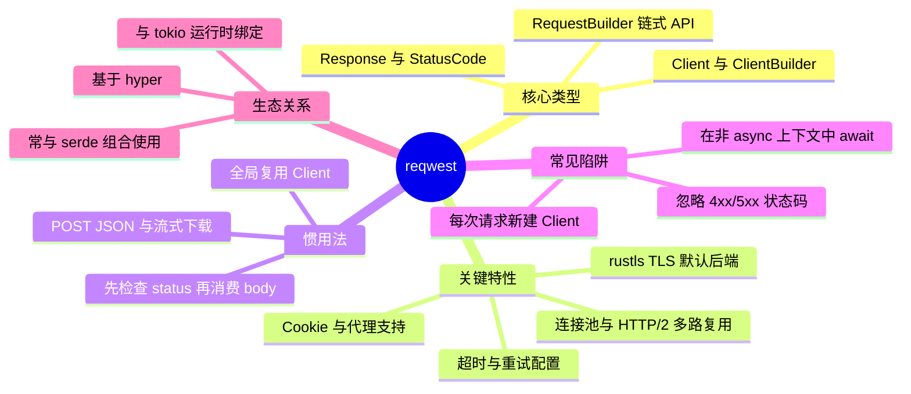

> **EN**: reqwest — Ergonomic Async HTTP Client for Rust
> **Summary**: A canonical guide to the reqwest crate: reusable `Client`, fluent `RequestBuilder`, connection pooling, TLS, cookies, proxies, and common async HTTP pitfalls.
> **Rust 版本**: 1.97.0+ (Edition 2024)
> **生态版本**: reqwest 0.13.4
> **Bloom 层级**: L6
> **权威来源**: 本文件为 `concept/` 权威页。
> **A/S/P 标记**: **P** — Procedure
> **前置概念**:
> [Async/Await](../../03_advanced/01_async/01_async.md) ·
> [Future 与执行器](../../03_advanced/01_async/04_future_and_executor_mechanisms.md) ·
> [Error Handling](../../02_intermediate/03_error_handling/01_error_handling.md) ·
> [Traits](../../02_intermediate/00_traits/01_traits.md)
> **后置概念**:
> [HTTP 客户端开发](../04_web_and_networking/04_http_client_development.md) ·
> [Web 框架](../04_web_and_networking/03_web_frameworks.md) ·
> [分布式系统](../04_web_and_networking/01_distributed_systems.md)
> **主要来源**:
> [reqwest docs](https://docs.rs/reqwest/) ·
> [reqwest GitHub](https://github.com/seanmonstar/reqwest) ·
> [hyper](https://hyper.rs/) ·
> [RFC 9110 — HTTP Semantics](https://www.rfc-editor.org/rfc/rfc9110.html)

---

# reqwest：Rust 生态的异步 HTTP 客户端

## 一、权威定义

> **[reqwest](https://github.com/seanmonstar/reqwest)** An ergonomic, batteries-included HTTP Client for Rust.

- **官方 one-liner**：reqwest 是一个为 Rust 设计的人体工学、开箱即用的高级 HTTP 客户端库。
- **生态定位**：构建在 **hyper**（tokio 官方底层 HTTP 实现）之上，封装了连接池、TLS、Cookie、代理、超时、重试等生产级 HTTP 客户端必需的能力，是 Rust 生态中异步 HTTP 客户端的**事实标准**。
- **与 hyper 的关系**：hyper 提供底层的 HTTP/1 + HTTP/2 协议实现；reqwest 在 hyper 之上提供高级、类型安全的 API，类似于 Python 的 `requests` 之于 `urllib3`。
- **Wikipedia 对齐**：[HTTP](https://en.wikipedia.org/wiki/HTTP) 是应用层协议；[Web client](https://en.wikipedia.org/wiki/Web_client) 是发起 HTTP 请求、消费响应的软件组件。reqwest 属于后者在 Rust 中的工业级实现。

> **来源**: [reqwest README](https://github.com/seanmonstar/reqwest) · [hyper.rs](https://hyper.rs/) · [Wikipedia: HTTP](https://en.wikipedia.org/wiki/HTTP) · 可信度: ✅

---

## 二、关键类型与 Traits

| **类型 / Trait** | **角色** | **说明** |
|:---|:---|:---|
| `Client` | 可复用 HTTP 客户端 | 持有连接池、TLS 配置、Cookie 存储；应全局复用而非每次新建 |
| `ClientBuilder` | 客户端配置构建器 | 设置超时、代理、TLS 后端、默认请求头、连接池参数等 |
| `RequestBuilder` | 流式请求构造器 | `.get(url).header(...).json(&body).send()` 的链式 API |
| `Response` | HTTP 响应 | 提供 `.status()`、`.headers()`、`.text()`、`.json()`、`.bytes_stream()` 等消费方式 |
| `Method` | HTTP 方法 | `GET`、`POST`、`PUT`、`DELETE` 等的类型安全表示 |
| `StatusCode` | 响应状态码 | `is_success()`、`is_client_error()`、`as_u16()` 等方法 |
| `HeaderMap` / `HeaderName` / `HeaderValue` | 请求 / 响应头 | 类型安全的 HTTP 头字段管理 |
| `Error` | reqwest 错误类型 | 统一包装网络、TLS、超时、HTTP 状态等错误；与 `?` 配合良好 |
| `Body` | 请求体抽象 | 支持字符串、字节流、`serde_json::Value`、文件流等多种负载 |
| `IntoUrl` | URL 转换 trait | 允许 `&str`、`String`、`Url` 等类型传入请求方法 |

**关键洞察**：`Client` 是 reqwest 设计的核心单元。它内部维护连接池和 DNS 缓存，复用一个 `Client` 可以显著降低延迟并支持 HTTP/2 多路复用；每次请求新建 `Client` 会丢失这些收益。

---

## 三、惯用法与示例

### 3.1 最小可用示例：一次性 GET + JSON 反序列化

```rust,ignore
// ✅ Cargo.toml
// [dependencies]
// reqwest = { version = "0.13", features = ["json"] }
// tokio = { version = "1", features = ["full"] }
// serde = { version = "1", features = ["derive"] }

use serde::Deserialize;

#[derive(Debug, Deserialize)]
struct IpInfo {
    origin: String,
}

#[tokio::main]
async fn main() -> Result<(), Box<dyn std::error::Error>> {
    let info: IpInfo = reqwest::get("https://httpbin.org/ip")
        .await?
        .json::<IpInfo>()
        .await?;
    println!("{:?}", info);
    Ok(())
}
```

> **注意**：`reqwest::get` 是便捷函数，内部会创建一个临时 `Client`。演示和一次性脚本可用，生产代码应显式构造 `Client`。

### 3.2 生产惯用法：复用 `Client` 并配置超时与默认头

```rust,ignore
use reqwest::{Client, header};
use std::time::Duration;

#[tokio::main]
async fn main() -> Result<(), Box<dyn std::error::Error>> {
    let client = Client::builder()
        .timeout(Duration::from_secs(10))
        .connect_timeout(Duration::from_secs(5))
        .user_agent("my-app/1.0")
        .default_header(header::ACCEPT, "application/json".parse()?)
        .build()?;

    let response = client
        .get("https://api.example.com/users/1")
        .send()
        .await?;

    // 先检查状态码再消费响应体
    if response.status().is_success() {
        let body = response.text().await?;
        println!("{}", body);
    } else {
        eprintln!("HTTP error: {}", response.status());
    }

    Ok(())
}
```

### 3.3 POST JSON 并读取响应

```rust,ignore
use reqwest::Client;
use serde_json::json;

#[tokio::main]
async fn main() -> Result<(), Box<dyn std::error::Error>> {
    let client = Client::new();

    let response = client
        .post("https://api.example.com/users")
        .json(&json!({
            "name": "Alice",
            "email": "alice@example.com"
        }))
        .send()
        .await?;

    println!("Created with status: {}", response.status());
    Ok(())
}
```

---

## 四、常见陷阱与边界测试

### 陷阱 1：每次请求新建 `Client` 导致连接无法复用

❌ **错误做法**：

```rust,ignore
// ❌ 每次都创建新的 Client，没有连接池，HTTP/2 多路复用也失效
async fn fetch_user(id: u64) -> Result<String, reqwest::Error> {
    let client = reqwest::Client::new();
    let resp = client.get(format!("https://api.example.com/users/{}", id)).send().await?;
    resp.text().await
}
```

✅ **修正做法**：

```rust,ignore
use reqwest::Client;
use std::sync::Arc;

// ✅ 通过 Arc 共享同一个 Client，复用连接池
#[derive(Clone)]
struct ApiClient {
    inner: Arc<Client>,
}

impl ApiClient {
    async fn fetch_user(&self, id: u64) -> Result<String, reqwest::Error> {
        let url = format!("https://api.example.com/users/{}", id);
        self.inner.get(&url).send().await?.text().await
    }
}
```

> **解释**：`Client` 内部持有连接池和 DNS 缓存。频繁新建 `Client` 会导致 TCP/TLS 握手重复发生，显著增加延迟；在高并发场景下还会耗尽本地临时端口。

### 陷阱 2：未检查状态码直接调用 `.json()`

❌ **错误做法**：

```rust,ignore
// ❌ 如果服务器返回 4xx/5xx，.json() 会尝试把错误页解析成目标类型，反序列化失败
let user: User = client
    .get("https://api.example.com/users/99999")
    .send()
    .await?
    .json::<User>()
    .await?;
```

✅ **修正做法**：

```rust,ignore
use reqwest::StatusCode;

// ✅ 先检查状态码，再消费响应体
let response = client.get("https://api.example.com/users/99999").send().await?;
match response.status() {
    StatusCode::OK => {
        let user: User = response.json::<User>().await?;
        println!("{:?}", user);
    }
    StatusCode::NOT_FOUND => println!("User not found"),
    other => eprintln!("Unexpected status: {}", other),
}
```

> **解释**：reqwest 的 `.send().await?` 只在**传输层**失败时返回 `Err`（网络断开、TLS 握手失败、超时等），不会把 4xx/5xx 状态码转成错误。必须显式检查 `response.status()` 或使用 `.error_for_status()`。

### 陷阱 3：在同步上下文中直接调用 `.await`

❌ **错误做法**：

```rust,compile_fail
// ❌ 编译错误：不能在非 async fn 中直接 await
fn fetch_sync() -> Result<String, reqwest::Error> {
    let client = reqwest::Client::new();
    let resp = client.get("https://example.com").send().await?;
    resp.text().await
}
```

✅ **修正做法**：

```rust,ignore
// ✅ 使用 #[tokio::main] 或 Runtime::block_on 进入异步上下文
#[tokio::main]
async fn main() -> Result<(), Box<dyn std::error::Error>> {
    let client = reqwest::Client::new();
    let resp = client.get("https://example.com").send().await?;
    println!("{}", resp.text().await?);
    Ok(())
}
```

> **解释**：reqwest 是**纯异步**库，所有网络 I/O 都返回 `Future`。必须在 async 运行时（通常是 tokio）上下文中执行。没有全局隐式调度器，这与 Go 的 `http.Get` 或 Python 的同步 `requests` 不同。

---

## 五、版本说明

| **项目** | **说明** |
|:---|:---|
| **当前稳定版本** | `reqwest 0.13.4`（截至 2026-07） |
| **MSRV 政策** | 官方通常支持最近约 12–18 个月的稳定 Rust；本项目以 `rust-version = 1.97.0` 为事实源 |
| **默认 TLS 后端** | 0.12+ 起默认使用 **rustls**（纯 Rust TLS），可通过 feature 切换为 `native-tls` |
| **HTTP/2** | 默认启用，依赖 hyper 的 h2 实现；HTTP/1.1 仍可用 |
| **Cookie / 代理** | 通过 `cookies`、`gzip`、`brotli`、`rustls-tls` 等 feature 按需启用 |
| **Edition 2024** | 与 `async fn` in trait、RTN（return type notation）等特性无直接冲突；配合 `tokio 1.x` 使用 |

> **版本策略建议**：reqwest 尚未发布 1.0，SemVer  minor 版本可能引入 API 调整。生产项目应锁定 minor 版本（如 `reqwest = "0.13"`）并在升级时查看 [CHANGELOG](https://github.com/seanmonstar/reqwest/blob/master/CHANGELOG.md)。

---

## 六、思维导图（Mindmap)



> **认知功能**：本 mindmap 从类型、特性、用法、陷阱、生态五个维度组织 reqwest 的核心知识，帮助快速建立「何时复用 Client、何时检查状态、何时流式处理」的决策直觉。

---

## 七、嵌入式测验

### 测验 1：生产环境应如何使用 `Client`？（应用层）

以下哪种做法更符合 reqwest 的生产最佳实践？

- A. 每次请求都调用 `reqwest::Client::new()` 创建新客户端
- B. 创建一个 `Client` 并通过 `Arc` 在多个请求间复用
- C. 每个线程创建一个 `Client`，线程之间不共享

<details><summary>✅ 答案</summary>

**B. 创建一个 `Client` 并通过 `Arc` 在多个请求间复用**。

`Client` 内部维护连接池、DNS 缓存和 TLS 会话信息。复用 `Client` 可以减少 TCP/TLS 握手开销，并启用 HTTP/2 多路复用。`Client` 的克隆成本很低（内部使用 `Arc`），因此直接在结构体中保存 `Client` 即可。
</details>

---

### 测验 2：如何正确处理 4xx/5xx 响应？（理解层）

`client.get(url).send().await?` 会在服务器返回 404 时直接返回 `Err` 吗？

- A. 会，因为 HTTP 错误状态码会被自动转成 `Err`
- B. 不会，必须显式检查 `response.status()` 或调用 `.error_for_status()`
- C. 取决于是否启用 `error_for_status` feature

<details><summary>✅ 答案</summary>

**B. 不会，必须显式检查 `response.status()` 或调用 `.error_for_status()`**。

reqwest 的 `send()` 只在传输层失败时返回 `Err`（如网络超时、DNS 解析失败、TLS 错误）。HTTP 4xx/5xx 是**应用层语义**，reqwest 不会自动视为错误。生产代码通常先调用 `response.error_for_status()?` 或显式匹配状态码。
</details>

---

### 测验 3：`reqwest` 是否可以在没有 async 运行时的同步代码中使用？（事实层）

- A. 可以，reqwest 提供同步 API
- B. 不可以，reqwest 是纯异步库，必须在 tokio 等运行时中使用
- C. 可以，只要把 `.await` 去掉即可

<details><summary>✅ 答案</summary>

**B. 不可以，reqwest 是纯异步库，必须在 tokio 等运行时中使用**。

reqwest 的所有网络 I/O 方法都返回 `Future`。必须在 `#[tokio::main]`、`async fn` 或 `Runtime::block_on` 上下文中执行。如果需要同步 HTTP 客户端，可考虑 `ureq` 等同步替代方案。
</details>

---

### 测验 4：以下哪些特性属于 reqwest 的默认或常用能力？（多选，分析层）

- A. HTTP/1.1 与 HTTP/2 支持
- B. 连接池与 keep-alive
- C. 运行时无关，可在任意 async runtime 上运行
- D. 内置 JSON 序列化 / 反序列化（需启用 `json` feature）

<details><summary>✅ 答案</summary>

**A、B、D**。

- ✅ A：reqwest 基于 hyper，支持 HTTP/1.1 与 HTTP/2。
- ✅ B：`Client` 默认启用连接池与 keep-alive。
- ❌ C：reqwest 与 tokio 深度绑定（依赖 tokio 的 reactor 和 timer），不能直接在 async-std / smol 等运行时上无适配运行。
- ✅ D：启用 `json` feature 后，可通过 `.json()` 方法配合 serde 完成 JSON 序列化与反序列化。

</details>

---

## 八、国际权威来源

- **P0 — Rust 官方生态**
  - [The Rust Programming Language — ch16 Fearless Concurrency](https://doc.rust-lang.org/book/ch16-00-concurrency.html)（理解 `Send`/`Sync` 与异步任务调度基础）
  - [Asynchronous Programming in Rust](https://rust-lang.github.io/async-book/)（`Future`、`async`/`await`、执行器模型）
  - 链接验证状态：✅ 官方域名，无需登录

- **P1 — HTTP / 网络协议标准**
  - [RFC 9110 — HTTP Semantics](https://www.rfc-editor.org/rfc/rfc9110.html)（HTTP 方法语义、状态码、头字段定义）
  - [RFC 9112 — HTTP/1.1](https://www.rfc-editor.org/rfc/rfc9112.html) 与 [RFC 9113 — HTTP/2](https://www.rfc-editor.org/rfc/rfc9113.html)
  - 链接验证状态：✅ IETF 官方 RFC 编辑器

- **P2 — crate 官方文档与源码**
  - [reqwest docs.rs](https://docs.rs/reqwest/)（API 参考、feature 说明、示例）
  - [reqwest GitHub](https://github.com/seanmonstar/reqwest)（源码、CHANGELOG、issue 讨论）
  - [hyper.rs](https://hyper.rs/)（reqwest 底层 HTTP 实现）
  - [tokio.rs](https://tokio.rs/)（reqwest 依赖的运行时）
  - 链接验证状态：✅ 官方仓库与文档站点

- **P3 — 社区参考与实践**
  - [Rust Cookbook — Web Programming](https://rust-lang-nursery.github.io/rust-cookbook/web.html)（HTTP 客户端常见用法）
  - [Are We Web Yet](https://www.arewewebyet.org/)（Rust Web 生态概览）
  - 链接验证状态：✅ 社区维护，部分页面更新可能滞后

---

## 九、相关概念链接

| 概念 | 文件 | 关系 |
|:---|:---|:---|
| Async/Await | [`../../03_advanced/01_async/01_async.md`](../../03_advanced/01_async/01_async.md) | reqwest 的异步语法基础 |
| Future 与执行器 | [`../../03_advanced/01_async/04_future_and_executor_mechanisms.md`](../../03_advanced/01_async/04_future_and_executor_mechanisms.md) | 理解 `.await` 与 tokio 调度 |
| Error Handling | [`../../02_intermediate/03_error_handling/01_error_handling.md`](../../02_intermediate/03_error_handling/01_error_handling.md) | `?` 与 reqwest::Error 的传播 |
| Traits | [`../../02_intermediate/00_traits/01_traits.md`](../../02_intermediate/00_traits/01_traits.md) | `IntoUrl`、serde 的 `Serialize`/`Deserialize` |
| HTTP 客户端开发 | [`../04_web_and_networking/04_http_client_development.md`](../04_web_and_networking/04_http_client_development.md) | HTTP 客户端通用模式与高级主题 |
| Web 框架 | [`../04_web_and_networking/03_web_frameworks.md`](../04_web_and_networking/03_web_frameworks.md) | 与 axum 等服务端生态的互补 |
| 分布式系统 | [`../04_web_and_networking/01_distributed_systems.md`](../04_web_and_networking/01_distributed_systems.md) | 超时、重试、连接池在微服务中的运用 |
| Core Crates 综述 | [`./01_core_crates.md`](./01_core_crates.md) | reqwest 在核心 crate 谱系中的位置 |
| Rust vs JavaScript | [`../../05_comparative/02_managed_languages/03_rust_vs_javascript.md`](../../05_comparative/02_managed_languages/03_rust_vs_javascript.md) | HTTP/Web 客户端生态的跨语言对比。 |

---

**文档版本**: 1.0
**最后更新**: 2026-07-31
**状态**: ✅ Wave D — L6 生态 part 1 新建 canonical 页

## 国际化权威来源补充（International Authority Sources）

- https://dl.acm.org/doi/10.1145/359576.359585
