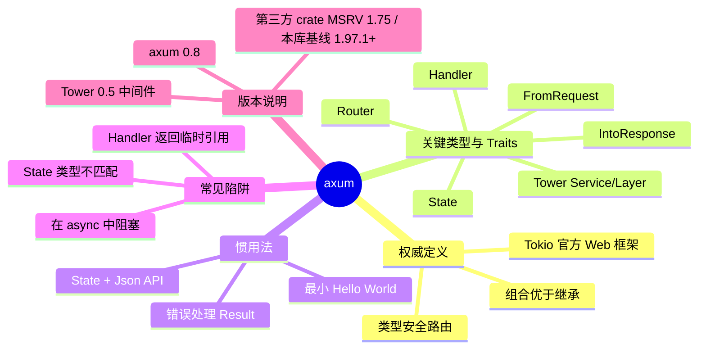

> **EN**: axum — Tokio's Ergonomic Web Framework
> **Summary**: A focused canonical guide to axum's type-safe routing, Tower middleware integration, state sharing, and async handler model in Rust's tokio ecosystem.
> **Rust 版本**: 1.97.0+ (Edition 2024)
> **生态版本**: axum 0.8
> **Bloom 层级**: L6
> **权威来源**: 本文件为 `concept/` 权威页。
> **A/S/P 标记**: **P** — Procedure
> **前置概念**:
> [所有权](../../01_foundation/01_ownership_borrow_lifetime/01_ownership.md) ·
> [生命周期](../../01_foundation/01_ownership_borrow_lifetime/03_lifetimes.md) ·
> [Traits](../../02_intermediate/00_traits/01_traits.md) ·
> [异步](../../03_advanced/01_async/01_async.md) ·
> [并发安全](../../03_advanced/00_concurrency/01_concurrency.md)
> **后置概念**:
> [tokio](./03_tokio.md) ·
> [reqwest](./06_reqwest.md) ·
> [tracing](./05_tracing.md) ·
> [sqlx](./01_core_crates.md)（数据库访问，详见 §4.4）
> **主要来源**:
> [axum docs](https://docs.rs/axum) ·
> [Tokio Blog — Announcing axum](https://tokio.rs/blog/2021-07-announcing-axum) ·
> [Tower docs](https://docs.rs/tower) ·
> [The Rust Programming Language](https://doc.rust-lang.org/book/) ·
> [Rust API Guidelines](https://rust-lang.github.io/api-guidelines/)

---

# axum（Tokio 官方 Web 框架）

## 一、权威定义

> **[axum](https://docs.rs/axum)** axum is a web application framework that focuses on ergonomics and modularity.

**框架（Wikipedia）**：软件框架是一种抽象结构，其中提供通用功能的软件可通过用户编写的额外代码进行选择性修改，从而生成特定于应用的软件。 [来源: [Wikipedia: Software framework](https://en.wikipedia.org/wiki/Software_framework)]

**axum 的核心定位**：

- **tokio 官方生态**的 HTTP Web 框架，与 `tokio`、`hyper`、`tower` 共享同一套运行时与中间件抽象。
- **类型安全路由**：路由、处理器（handler）、请求提取器（extractor）在编译期由 Rust 类型系统约束，减少运行时 404/参数错误。
- **组合优于继承**：通过 `Router::merge`、`nest`、`layer` 与 Tower `Service`/`Layer` 组合功能，而非类继承。
- **提取器模式**：请求体、路径参数、查询字符串、Header、状态等通过实现 `FromRequest` 的类型进入 handler，失败自动映射为 `Response`。

> **关键洞察**：axum 把 HTTP 服务建模为**类型化的函数组合**。`Router` 是路由表，`handler` 是满足 `Handler` trait 的异步函数，`State`/`Extension`/`Json` 等提取器把 HTTP 语义转换为 Rust 类型。其安全性本质上来自 Rust 的所有权、生命周期与 `Send`/`Sync` 保证。 [来源: [axum docs](https://docs.rs/axum)]

---

## 二、关键类型与 Traits

| 类型 / Trait | 角色 | 典型用法 |
|:---|:---|:---|
| `Router` | 路由表容器，可 `route`、`nest`、`merge`、`layer` | `Router::new().route("/", get(home))` |
| `Route` | 单条路由的处理器封装 | 由 `Router::route` 内部构造 |
| `Handler` | 异步函数 trait，约束 handler 签名 | `async fn handler() -> impl IntoResponse` |
| `FromRequest` / `FromRequestParts` | 请求提取器 | `Json<T>`、`Form<T>`、`Path<T>`、`Query<T>` |
| `IntoResponse` | 将 Rust 类型转为 HTTP response | `Json(user)`、`StatusCode`、`impl IntoResponse` |
| `State<S>` | 共享应用状态（要求 `S: Clone`） | `async fn handler(State(state): State<AppState>)` |
| `Extension<T>` | 按类型注入的扩展状态 | `Extension(Arc<Client>)` |
| `MethodFilter` | HTTP 方法过滤 | `get(handler)`、`post(handler)` |
| `Service` / `Layer`（Tower） | 中间件抽象：超时、限流、重试、追踪 | `.layer(TraceLayer::new_for_http())` |
| `Json<T>` / `Form<T>` | 请求体反序列化与响应序列化 | `Json<CreateUser>`、`Result<Json<User>, StatusCode>` |

**类型约束速记**：

- `S: Clone`：状态必须可克隆，因为 axum 内部通过 `Arc` 共享。
- Handler 参数中的 extractor 顺序**通常无关**，但 `State` 与 `Extension` 按类型匹配。
- 返回类型只要实现 `IntoResponse` 即可；`Result<T, E>` 要求 `T: IntoResponse` 且 `E: IntoResponse`。

---

## 三、惯用法与示例

### 3.1 最小可用示例

```rust,ignore
// ✅ Cargo.toml
// [dependencies]
// axum = "0.8"
// tokio = { version = "1", features = ["full"] }

use axum::{routing::get, Router};

async fn hello() -> &'static str {
    "Hello, axum!"
}

#[tokio::main]
async fn main() {
    let app = Router::new().route("/", get(hello));
    let listener = tokio::net::TcpListener::bind("0.0.0.0:3000").await.unwrap();
    axum::serve(listener, app).await.unwrap();
}
```

> **关键 API**：`Router::new()` 创建空路由表；`.route("/", get(hello))` 将路径与 HTTP 方法绑定到 handler；`axum::serve` 启动基于 `tokio`/`hyper` 的服务器。

### 3.2 现实惯用：共享状态 + JSON API + 错误处理

```rust,ignore
// ✅ Cargo.toml
// [dependencies]
// axum = "0.8"
// tokio = { version = "1", features = ["full"] }
// serde = { version = "1", features = ["derive"] }
// serde_json = "1"
// tracing = "0.1"
// tracing-subscriber = { version = "0.3", features = ["env-filter"] }

use axum::{
    extract::{Path, State},
    http::StatusCode,
    routing::{get, post},
    Json, Router,
};
use serde::{Deserialize, Serialize};
use std::sync::Arc;

#[derive(Clone)]
struct AppState {
    users: Arc<dashmap::DashMap<u64, User>>,
}

#[derive(Serialize, Deserialize, Clone)]
struct User {
    id: u64,
    name: String,
}

#[derive(Deserialize)]
struct CreateUser {
    name: String,
}

async fn get_user(
    State(state): State<AppState>,
    Path(id): Path<u64>,
) -> Result<Json<User>, StatusCode> {
    state
        .users
        .get(&id)
        .map(|u| Json(u.clone()))
        .ok_or(StatusCode::NOT_FOUND)
}

async fn create_user(
    State(state): State<AppState>,
    Json(payload): Json<CreateUser>,
) -> Result<Json<User>, StatusCode> {
    let id = state.users.len() as u64 + 1;
    let user = User {
        id,
        name: payload.name,
    };
    state.users.insert(id, user.clone());
    Ok(Json(user))
}

#[tokio::main]
async fn main() {
    tracing_subscriber::fmt::init();
    let state = AppState {
        users: Arc::new(dashmap::DashMap::new()),
    };
    let app = Router::new()
        .route("/users/:id", get(get_user))
        .route("/users", post(create_user))
        .with_state(state);

    let listener = tokio::net::TcpListener::bind("0.0.0.0:3000").await.unwrap();
    tracing::info!("listening on {}", listener.local_addr().unwrap());
    axum::serve(listener, app).await.unwrap();
}
```

> **设计要点**：
>
> 1. `State<AppState>` 是单一共享状态类型；多个子路由合并时，**整个 `Router` 的 State 类型必须一致**。
> 2. `Json<T>` 自动处理 `Content-Type: application/json`，反序列化失败返回 `422 Unprocessable Entity`。
> 3. `Result<T, E>` 同时实现 `IntoResponse`，可统一错误映射。

---

## 四、常见陷阱与边界测试

### 陷阱 1：不同 `Router` 使用不同 `State` 类型直接合并

```rust,ignore
// ❌ 编译错误：State 类型不匹配
use axum::{extract::State, routing::get, Router};

#[derive(Clone)]
struct ApiState { db: String }

#[derive(Clone)]
struct WebState { assets: String }

async fn api_handler(State(_): State<ApiState>) {}
async fn web_handler(State(_): State<WebState>) {}

let api = Router::new().route("/api", get(api_handler)).with_state(ApiState { db: "db".into() });
let web = Router::new().route("/web", get(web_handler)).with_state(WebState { assets: "assets".into() });

// let app = api.merge(web); // 编译失败：State<ApiState> vs State<WebState>
```

✅ **修正**：使用统一的 `AppState`，或在子模块中将依赖包装为 `Extension`/`Arc<T>`。

```rust,ignore
// ✅ 统一 State 类型
#[derive(Clone)]
struct AppState {
    db: String,
    assets: String,
}

async fn api_handler(State(state): State<AppState>) {
    println!("db = {}", state.db);
}

async fn web_handler(State(state): State<AppState>) {
    println!("assets = {}", state.assets);
}

let state = AppState { db: "db".into(), assets: "assets".into() };
let app = Router::new()
    .route("/api", get(api_handler))
    .route("/web", get(web_handler))
    .with_state(state);
```

> **原理**：`Router<S>` 是泛型类型，`with_state` 将 `S` 注入到所有路由与中间件中。合并两个 `Router<S1>` 和 `Router<S2>` 要求 `S1 == S2`。

---

### 陷阱 2：在 async handler 中执行阻塞操作

```rust,ignore
// ❌ 运行时性能下降：阻塞 tokio worker 线程
use axum::{routing::get, Router};
use std::time::Duration;

async fn slow() -> &'static str {
    std::thread::sleep(Duration::from_secs(5)); // 阻塞当前 OS 线程
    "done"
}

let app = Router::new().route("/slow", get(slow));
```

✅ **修正**：使用 `tokio::task::spawn_blocking` 将阻塞工作 offload 到独立线程池。

```rust,ignore
// ✅ 非阻塞 async handler
use axum::{routing::get, Router};
use std::time::Duration;

async fn slow() -> String {
    tokio::task::spawn_blocking(|| {
        std::thread::sleep(Duration::from_secs(5));
        "done".to_string()
    })
    .await
    .unwrap()
}

let app = Router::new().route("/slow", get(slow));
```

> **原理**：axum 运行在 tokio 多线程 work-stealing 调度器上。默认 worker 线程数 ≈ CPU 核心数，阻塞操作会导致同线程上的其他 async 任务饥饿。 [来源: [Tokio docs](https://docs.rs/tokio)]

---

### 陷阱 3：Handler 签名不满足 `Handler` trait

```rust,ignore
// ❌ 编译错误：&str 的生命周期无法跨 await 返回
use axum::{routing::get, Router};

async fn bad_handler() -> &str {
    &format!("Hello, axum!") // 临时 String 的引用
}

// let app = Router::new().route("/", get(bad_handler));
```

✅ **修正**：返回拥有所有权的类型，如 `String` 或 `impl IntoResponse`。

```rust,ignore
// ✅ 正确的 handler 签名
use axum::{response::Html, routing::get, Router};

async fn good_handler(name: String) -> Html<String> {
    Html(format!("<h1>Hello, {name}</h1>"))
}

let app = Router::new().route("/", get(good_handler));
```

> **原理**：axum 的 `Handler` trait 要求返回类型实现 `IntoResponse`，且 Future 满足 `Send`（多线程调度）。返回临时引用违反 Rust 借用规则，编译器会在编译期拒绝。

---

## 五、版本说明

| 项目 | 说明 |
|:---|:---|
| **当前稳定版本** | axum 0.8（生态版本声明） |
| **MSRV** | axum 0.8 最低支持 Rust 1.75；本知识库统一使用 **1.97.0+ (Edition 2024)** |
| **核心依赖** | `tokio` 1.x、`hyper` 1.x、`tower` 0.5、`tower-service` 0.3、`matchit` 路由匹配 |
| **版本迁移注意** | axum 0.7 → 0.8 简化了部分 extractor API；`axum::serve` 替代旧版 `Server` 类型；状态共享由 `with_state` 统一 |
| **Edition 2024** | 完全兼容；`async fn` 在 trait 中的稳定（AFIT）让 Tower `Service` 的实现更简洁 |

**值得关注的新特性**：

- **0.8 状态模型**：`Router::with_state` 注入状态后，子路由 `nest` 可继承同一状态类型，减少类型转换。
- **matchit 路由匹配器**：支持高效的路径参数捕获与通配符，语义与标准 HTTP 路由一致。
- **Tower 中间件原生集成**：`TraceLayer`、`CorsLayer`、`TimeoutLayer` 等通过 `.layer(...)` 一键叠加。

---

## 六、思维导图（Mindmap)



---

## 七、嵌入式测验

### 测验 1：axum 的核心设计哲学（理解层）

axum 最突出的架构特征是什么？

- A. 基于 Actor 模型的高并发设计
- B. 组合式函数路由 + Tower 中间件生态
- C. 编译期宏驱动的声明式路由
- D. 内置 ORM 与数据库连接池

<details>
<summary>✅ 答案</summary>

**B. 组合式函数路由 + Tower 中间件生态**。

axum 不把框架设计为沉重的基类体系，而是让 `Router`、`handler`、`extractor`、`Layer` 通过类型组合拼装。`Router::route` 组合路径与函数，`.layer(...)` 组合 Tower 中间件，`nest` 组合子路由。这种设计直接受益于 Rust 的 trait 系统与零成本抽象。
</details>

---

### 测验 2：`State<S>` 的使用约束（应用层）

以下关于 `State<S>` 的描述，正确的是？

- A. `S` 必须实现 `Default`
- B. `S` 必须实现 `Clone`
- C. 不同 `Router` 可以拥有完全不同的 `S` 类型并直接 `merge`
- D. `State` 只能通过 `Extension` 注入

<details>
<summary>✅ 答案</summary>

**B. `S` 必须实现 `Clone`**。

axum 内部使用 `Arc` 共享状态，但 `State<S>` 要求 `S: Clone`。多个子路由合并时，`Router<S>` 的 `S` 必须一致；否则会出现 `State<ApiState>` 与 `State<WebState>` 类型不匹配而编译失败。`Default` 不是必须的；`Extension` 是另一种可选的注入方式，而非唯一方式。
</details>

---

### 测验 3：handler 中的阻塞操作（应用层）

在 axum handler 中执行长时间 CPU 计算或同步 I/O，最佳做法是什么？

- A. 直接写在 async fn 中，因为 tokio 会自动调度
- B. 使用 `std::thread::spawn` 并立即返回
- C. 使用 `tokio::task::spawn_blocking` 或等效异步 API
- D. 把计算移到 Tower 中间件里

<details>
<summary>✅ 答案</summary>

**C. 使用 `tokio::task::spawn_blocking` 或等效异步 API**。

tokio 的 worker 线程数默认等于 CPU 核心数。在 async task 中执行阻塞操作会占用 worker 线程，导致同线程上的其他请求延迟。`spawn_blocking` 将任务提交到独立的 blocking 线程池，是 axum/tokio 应用处理阻塞工作的标准做法。
</details>

---

### 测验 4：提取器与错误响应（分析层）

`Json<T>` 提取器在请求体无法反序列化时会发生什么？

- A. 触发 panic
- B. 返回 `400 Bad Request`
- C. 返回 `422 Unprocessable Entity`
- D. 调用 `Default::default()` 并继续

<details>
<summary>✅ 答案</summary>

**C. 返回 `422 Unprocessable Entity`**。

axum 内置提取器（`Json`、`Path`、`Query` 等）在提取失败时会调用其 `IntoResponse` 实现，生成对应的 HTTP 错误响应。`Json<T>` 反序列化失败默认返回 422。开发者也可以通过自定义 `FromRequest` 实现覆盖这一行为。
</details>

---

## 八、国际权威来源

| 来源级别 | 链接 | 说明 | 验证状态 |
|:---|:---|:---|:---|
| **P0 — 官方 Rust 文档** | [The Rust Programming Language](https://doc.rust-lang.org/book/title-page.html) | Rust 所有权、trait、async 等概念前提 | ✅ 可访问 |
| **P0 — 官方 Rust 参考** | [Rust Reference](https://doc.rust-lang.org/reference/introduction.html) | 生命周期、edition、unsafe 边界 | ✅ 可访问 |
| **P2 — axum 官方文档** | [docs.rs/axum](https://docs.rs/axum) | axum API、提取器、handler trait | ✅ 可访问 |
| **P2 — Tokio Blog 发布文** | [Announcing axum](https://tokio.rs/blog/2021-07-announcing-axum) | 设计动机与 tokio 生态定位 | ✅ 可访问 |
| **P2 — Tower 文档** | [docs.rs/tower](https://docs.rs/tower) | Service/Layer 中间件抽象 | ✅ 可访问 |
| **P2 — hyper 文档** | [docs.rs/hyper](https://docs.rs/hyper) | axum 底层 HTTP 实现 | ✅ 可访问 |
| **P2 — Rust API Guidelines** | [Rust API Guidelines](https://rust-lang.github.io/api-guidelines/) | 设计 axum 风格 API 的通用准则 | ✅ 可访问 |

> **来源可信度声明**：以上链接均指向官方仓库、docs.rs 或 Rust 官方文档。crate 版本与 API 以 docs.rs 最新稳定版为准；本知识库使用 axum 0.8 作为生态版本锚点。

---

## 九、相关概念链接

| 概念 | 文件 | 关系 |
|:---|:---|:---|
| 所有权 / 生命周期 | [`../../01_foundation/01_ownership_borrow_lifetime/01_ownership.md`](../../01_foundation/01_ownership_borrow_lifetime/01_ownership.md) | handler 返回类型与借用规则根基 |
| Trait 系统 | [`../../02_intermediate/00_traits/01_traits.md`](../../02_intermediate/00_traits/01_traits.md) | `Handler`、`FromRequest`、`IntoResponse` 的 trait 抽象 |
| 异步编程 | [`../../03_advanced/01_async/01_async.md`](../../03_advanced/01_async/01_async.md) | axum 运行时的 async/await 基础 |
| 并发安全 | [`../../03_advanced/00_concurrency/01_concurrency.md`](../../03_advanced/00_concurrency/01_concurrency.md) | `Send`/`Sync` 与多线程调度 |
| tokio | [`./03_tokio.md`](./03_tokio.md) | axum 的运行时依赖 |
| reqwest | [`./06_reqwest.md`](./06_reqwest.md) | HTTP 客户端，常与 axum 服务端配对 |
| tracing | [`./05_tracing.md`](./05_tracing.md) | 可观测性中间件与 span |
| sqlx | [`./01_core_crates.md`](./01_core_crates.md) | 数据库访问，常见于 axum 全栈示例（详见 §4.4） |
| 核心 crate 总览 | [`./01_core_crates.md`](./01_core_crates.md) | 生态定位与选型矩阵（索引页） |
| Rust vs TypeScript | [`../../05_comparative/02_managed_languages/08_rust_vs_typescript.md`](../../05_comparative/02_managed_languages/08_rust_vs_typescript.md) | Web 框架与类型驱动服务的跨语言对比。 |

---

> **文档版本**: 1.0
> **最后更新**: 2026-07-31
> **状态**: ✅ Wave D L6 生态 part 1 新建权威页
