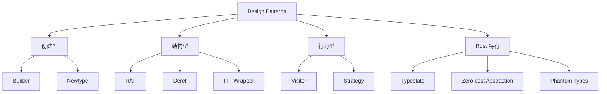

# Design Patterns（设计模式）

> **层级**: L6 生态工程
> **前置概念**: [Traits](./02_intermediate/01_traits.md) · [Generics](./02_intermediate/02_generics.md) · [Type System](../01_foundation/04_type_system.md)
> **主要来源**: [Rust API Guidelines] · [Rust Design Patterns] · [TRPL]

---

**变更日志**:

- v1.0 (2026-05-12): 初始版本

---

## 一、权威定义

> **[Rust Design Patterns]** Rust design patterns are recurring solutions to common problems in software design using the Rust programming language. They leverage Rust's unique features such as ownership, traits, and the type system.

---

## 二、模式分类矩阵

| **模式** | **问题** | **Rust 实现** | **关键特性** |
|:---|:---|:---|:---|
| **RAII** | 资源自动释放 | `Drop` trait | 所有权离开作用域时自动清理 |
| **Typestate** | 编译期状态验证 | 泛型 + PhantomData | 非法状态变为编译错误 |
| **Builder** | 复杂对象构造 | 消费型 Builder | 所有权链确保必填字段 |
| **Newtype** | 类型区分 + 约束 | `struct Wrapper(T)` | 零成本，获得类型安全 |
| **Deref 多态** | 智能指针行为 | `Deref`/`DerefMut` | 自动解引用转换 |
| **Visitor** | 异构结构遍历 | Trait + enum | 开放/封闭选择 |
| **Strategy** | 运行时算法切换 | `dyn Trait` / 泛型 | 静态/动态分发选择 |
| **FFI 模式** | 与 C 互操作 | `extern "C"` + `repr(C)` | 安全封装层 |

---

## 三、思维导图



---

## 四、示例

### Typestate 模式

```rust
// ✅ Typestate: 编译期验证状态转换
struct Draft;
struct PendingReview;
struct Published;

struct Post<State> {
    content: String,
    _state: std::marker::PhantomData<State>,
}

impl Post<Draft> {
    fn new() -> Self { Self { content: String::new(), _state: std::marker::PhantomData } }
    fn add_text(&mut self, text: &str) { self.content.push_str(text); }
    fn request_review(self) -> Post<PendingReview> {
        Post { content: self.content, _state: std::marker::PhantomData }
    }
}

impl Post<PendingReview> {
    fn approve(self) -> Post<Published> {
        Post { content: self.content, _state: std::marker::PhantomData }
    }
}

impl Post<Published> {
    fn content(&self) -> &str { &self.content }
}

// 非法状态不可表示:
// let post = Post::new();
// post.content();  // ❌ 编译错误: Draft 没有 content 方法
```

---

## 五、知识来源

| **论断** | **来源** | **可信度** |
|:---|:---|:---|
| RAII 是 Rust 核心模式 | [TRPL] | ✅ |
| Typestate 利用类型系统 | [Rust Design Patterns] | ✅ |
| Newtype 零成本 | [TRPL] · [Rust Reference] | ✅ |

---

## 六、待补充

- [ ] **TODO**: 补充更多模式（Command、Observer、State Machine）
- [ ] **TODO**: 补充反模式（Over-engineering、Premature abstraction）
