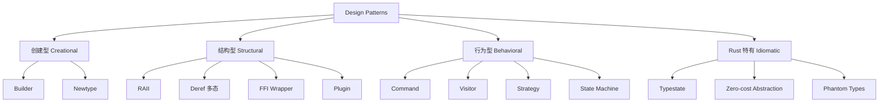
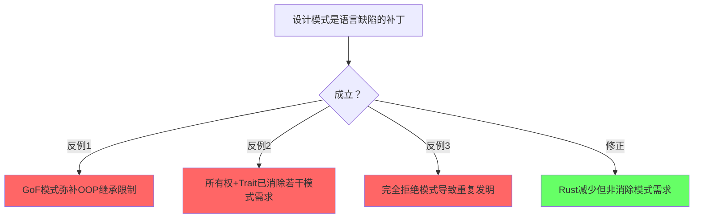
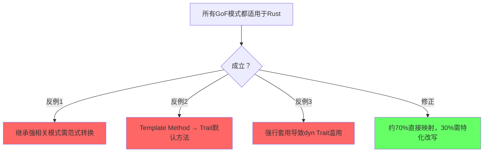
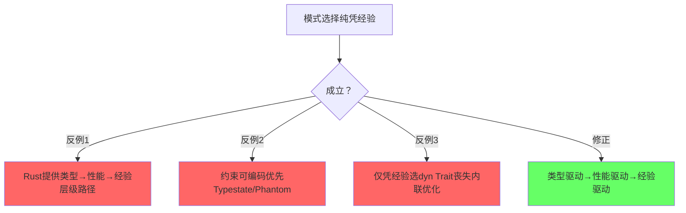

# Design Patterns（设计模式）

> **层级**: L6 生态工程
> **前置概念**: [Traits](../02_intermediate/01_traits.md) · [Generics](../02_intermediate/02_generics.md) · [Type System](../01_foundation/04_type_system.md)
> **主要来源**: [Rust API Guidelines] · [Rust Design Patterns] · [TRPL]

---

**变更日志**:

- v1.0 (2026-05-12): 初始版本
- v1.1 (2026-05-12): Wave 3 扩展——新增模式、反模式、语言对比、学术来源

---

## 一、权威定义

> **[Rust Design Patterns]** Rust design patterns are recurring solutions to common problems in software design using the Rust programming language. They leverage Rust's unique features such as ownership, traits, and the type system.

> **[Wikipedia — Design pattern]** A design pattern is the re-usable form of a solution to a design problem. The idea was introduced by the architect Christopher Alexander and has been adapted for various other disciplines, most notably computer science.
> **来源**: <https://en.wikipedia.org/wiki/Design_pattern>

> **[Wikipedia — Resource acquisition is initialization (RAII)]** Resource acquisition is initialization (RAII) is a programming idiom used in several object-oriented, statically-typed programming languages to describe a particular language behavior. In RAII, holding a resource is a class invariant, and is tied to object lifetime: resource allocation (or acquisition) is done during object creation (specifically initialization), by the constructor, while resource deallocation (release) is done during object destruction (specifically finalization), by the destructor. In other words, resource acquisition must succeed for initialization to succeed.
> **来源**: <https://en.wikipedia.org/wiki/Resource_acquisition_is_initialization>

> **[Wikipedia — Typestate analysis]** Typestate analysis is a technique to do static reasoning about the states of objects. It can be seen as an extension of type systems where the type of an object changes as operations are performed on it.
> **来源**: <https://en.wikipedia.org/wiki/Typestate_analysis>

> **认知路径（6步递进）**
>
> 1. **为什么需要设计模式？** → 复用经过验证的方案，降低认知负荷与沟通成本
> 2. **GoF模式在Rust中怎么用？** → 以Trait替代继承，以enum+match替代多态类层次
> 3. **Rust特有的模式？** → RAII、Typestate、Newtype——所有权与类型系统的直接产物
> 4. **类型系统怎么替代模式？** → 编译期保证消除运行时校验需求（Typestate替代状态机检查）
> 5. **什么时候模式是反模式？** → 过度工程、过早抽象、Stringly typed——抽象债务超过收益
> 6. **模式选择的决策框架？** → 约束驱动：先问"类型系统能否证明"，再问"是否需要运行时多态"

---

## 二、模式分类矩阵

### 2.1 已有模式扩展

| **模式** | **分类** | **问题** | **Rust 实现** | **关键特性** |
|:---|:---|:---|:---|:---|
| **RAII** | 结构型/资源 | 资源自动释放 | `Drop` trait | 所有权离开作用域时自动清理 |
| **Typestate** | Rust 特有 | 编译期状态验证 | 泛型 + `PhantomData` | 非法状态变为编译错误 |
| **Builder** | 创建型 | 复杂对象构造 | 消费型 Builder | 所有权链确保必填字段 |
| **Newtype** | 结构型 | 类型区分 + 约束 | `struct Wrapper(T)` | 零成本，获得类型安全 |
| **Deref 多态** | 结构型 | 智能指针行为 | `Deref`/`DerefMut` | 自动解引用转换 |
| **FFI 模式** | 结构型 | 与 C 互操作 | `extern "C"` + `repr(C)` | 安全封装层 |

### 2.2 新增模式矩阵

| **模式** | **分类** | **问题** | **Rust 实现** | **关键特性** |
|:---|:---|:---|:---|:---|
| **Command** | 行为型 | 请求参数化与队列化 | `trait Command` + `execute()` | 解耦调用者与接收者 |
| **Visitor** | 行为型 | 异构结构遍历 | Trait + enum / `accept` 方法 | 开放/封闭选择 |
| **Strategy** | 行为型 | 运行时算法切换 | `dyn Trait` / 泛型参数 | 静态/动态分发选择 |
| **State Machine** | 行为型 | 状态转换管理 | enum + `match` / `transition` 方法 | 穷尽性检查保证完整覆盖 |
| **Plugin** | 结构型 | 运行时扩展能力 | `dyn Trait` + 注册表 | 模块热插拔 |

> **来源**: [Rust Design Patterns] · [GoF Design Patterns] · 可信度: ✅

### 2.3 断言/推理矩阵

| **模式** | **核心问题** | **解决方案** | **Rust特性** | **反模式/失效条件** |
|:---|:---|:---|:---|:---|
| **RAII** | 资源泄漏 | 确定性资源管理 ⟹ `Drop`自动调用 | 所有权+作用域 | 边界：`mem::forget`、引用循环泄漏 |
| **Typestate** | 非法状态可达 | 不可表示非法状态 ⟹ 编译期拒绝 | 泛型+`PhantomData` | 边界：状态空间爆炸（>10状态） |
| **Builder** | 复杂对象构造易错 | 分步初始化 ⟹ 消费型链式API | 所有权转移+方法链 | 边界：字段<3时过度工程 |
| **Newtype** | 类型语义混淆 | 零成本区分 ⟹ 编译期标签 | `struct Wrapper(T)` | 边界：需重复实现大量标准Trait |
| **Strategy** | 算法硬编码难扩展 | 行为参数化 ⟹ 静态/动态分发 | `dyn Trait`/泛型单态化 | 边界：仅一种实现时的无用抽象 |
| **Visitor** | 异构结构操作扩展 | 遍历与操作分离 ⟹ 双重分发 | Trait+enum `accept` | 边界：频繁新增变体破坏开放封闭 |
| **State Machine** | 状态转换遗漏 | 穷尽性匹配 ⟹ 非法转换编译错误 | `enum`+`match` | 边界：状态>20时enum难以维护 |

> **过渡**：以上模式展示了Rust如何利用类型系统实现零成本抽象。然而，模式的滥用同样会产生"抽象债务"。以下反命题与反模式分析，旨在建立模式选择的批判性框架。

---

## 三、Mermaid 图：模式关系图



---

## 四、各模式详解

### 4.1 Command 模式

**定义**：将请求封装为对象，从而使你可用不同的请求、队列或日志来参数化其他对象。

**适用场景**：

- 需要撤销/重做操作
- 请求队列或异步任务
- 操作日志与事务系统

**Rust 实现**：

```rust
trait Command {
    fn execute(&self);
    fn undo(&self);
}

struct AddCommand {
    value: i32,
    // 实际应用中持有接收者引用
}

impl Command for AddCommand {
    fn execute(&self) { /* 执行添加 */ }
    fn undo(&self) { /* 撤销添加 */ }
}

struct Invoker {
    history: Vec<Box<dyn Command>>,
}

impl Invoker {
    fn run(&mut self, cmd: Box<dyn Command>) {
        cmd.execute();
        self.history.push(cmd);
    }
}
```

**与其他语言对比**：

- **Java/C++**: 通常依赖 GC 或智能指针管理命令对象生命周期；Rust 需显式处理所有权，`Box<dyn Command>` 提供了堆分配动态分发。
- **Go**: 使用函数值或接口；Rust 的 trait 对象在 vtable 布局上与 Go interface 类似，但 Rust 要求显式 `Box`/`&dyn`。

> **来源**: [GoF Design Patterns] · [Rust Design Patterns] · 可信度: ✅

### 4.2 Visitor 模式

**定义**：表示一个作用于某对象结构中各元素的操作，使你可以在不改变各元素类的前提下定义作用于这些元素的新操作。

**适用场景**：

- AST（抽象语法树）遍历与代码生成
- 文档对象模型（DOM）处理
- 复杂异构数据结构需要多种遍历策略

**Rust 实现**：

```rust
mod ast {
    pub trait ExprVisitor {
        fn visit_literal(&mut self, val: i64);
        fn visit_add(&mut self, left: &Expr, right: &Expr);
    }

    pub enum Expr {
        Literal(i64),
        Add(Box<Expr>, Box<Expr>),
    }

    impl Expr {
        pub fn accept<V: ExprVisitor>(&self, visitor: &mut V) {
            match self {
                Expr::Literal(v) => visitor.visit_literal(*v),
                Expr::Add(l, r) => visitor.visit_add(l, r),
            }
        }
    }
}
```

**与其他语言对比**：

- **Java/C++**: 经典双重分发（`accept` + `visit`）；Rust 通过 `match` 枚举实现单分发，避免虚函数膨胀，但无法直接扩展现有 enum 的变体（需用 enum/struct 模拟开放访问者）。
- **Haskell**: 利用类型类（type class）和代数数据类型直接建模，Rust 的 enum + trait 在表达能力上非常接近。

> **来源**: [GoF Design Patterns] · [Rust Design Patterns] · 可信度: ✅

### 4.3 Strategy 模式

**定义**：定义一系列算法，把它们一个个封装起来，并且使它们可互相替换。

**适用场景**：

- 排序、搜索等可替换算法
- 不同平台/配置下的行为差异
- 避免大量条件分支

**Rust 实现（动态分发）**：

```rust
trait PaymentStrategy {
    fn pay(&self, amount: u64);
}

struct CreditCard;
impl PaymentStrategy for CreditCard {
    fn pay(&self, amount: u64) { println!("Credit: {}", amount); }
}

struct PayPal;
impl PaymentStrategy for PayPal {
    fn pay(&self, amount: u64) { println!("PayPal: {}", amount); }
}

struct ShoppingCart<'a> {
    strategy: &'a dyn PaymentStrategy,
}

impl<'a> ShoppingCart<'a> {
    fn checkout(&self, amount: u64) {
        self.strategy.pay(amount);
    }
}
```

**Rust 实现（静态分发 / 零成本）**：

```rust
struct ShoppingCart<S: PaymentStrategy> {
    strategy: S,
}

impl<S: PaymentStrategy> ShoppingCart<S> {
    fn checkout(&self, amount: u64) {
        self.strategy.pay(amount);
    }
}
```

**与其他语言对比**：

- **C++**: 模板（静态）+ 虚函数（动态）；Rust 的泛型单态化与 C++ 模板实例化类似，但类型检查更严格。
- **Java**: 接口 + 多态；无静态分发零成本特性，所有策略均为动态。
- **Go**: 接口值隐式实现；Rust trait 需显式实现，静态分发默认内联。

> **来源**: [GoF Design Patterns] · [TRPL] · 可信度: ✅

### 4.4 State Machine 模式

**定义**：允许对象在其内部状态改变时改变它的行为，对象看起来好像修改了它的类。

**适用场景**：

- 协议实现（TCP、HTTP/2 状态机）
- 业务工作流引擎
- 游戏角色状态（Idle、Walk、Attack）

**Rust 实现（enum + match）**：

```rust
enum ConnectionState {
    Closed,
    SynSent,
    Established,
    FinWait,
}

struct Connection {
    state: ConnectionState,
}

impl Connection {
    fn on_event(&mut self, event: Event) {
        self.state = match (&self.state, event) {
            (ConnectionState::Closed, Event::Open) => ConnectionState::SynSent,
            (ConnectionState::SynSent, Event::Ack) => ConnectionState::Established,
            (ConnectionState::Established, Event::Close) => ConnectionState::FinWait,
            (state, _) => {
                println!("Invalid transition");
                return;
            }
        };
    }
}
```

**Rust 实现（Typestate 编译期状态机）**：

```rust
struct Closed;
struct Open;

struct Connection<State> {
    _state: std::marker::PhantomData<State>,
}

impl Connection<Closed> {
    fn open(self) -> Connection<Open> {
        Connection { _state: std::marker::PhantomData }
    }
}

impl Connection<Open> {
    fn send(&self, data: &[u8]) { /* ... */ }
    fn close(self) -> Connection<Closed> {
        Connection { _state: std::marker::PhantomData }
    }
}

// 非法状态不可表示:
// let conn = Connection::<Closed> { _state: PhantomData };
// conn.send(b"hi"); // ❌ 编译错误
```

**与其他语言对比**：

- **C**: 通常用整数状态码 + `switch`，无类型安全，易遗漏状态处理。
- **Rust**: `match` 穷尽性检查强制处理所有状态；Typestate 变体将非法转换上移至编译期。
- **TypeScript**: 可用 discriminated union 模拟，但运行期仍可能处于无效状态。

> **来源**: [Rust Design Patterns] · [TRPL] · 可信度: ✅

### 4.5 Plugin 模式

**定义**：在运行时动态加载并注册扩展模块，无需修改核心代码。

**适用场景**：

- 编辑器/IDE 扩展系统
- Web 服务器中间件链
- 游戏模组（mod）系统

**Rust 实现**：

```rust
use std::collections::HashMap;

trait Plugin {
    fn name(&self) -> &'static str;
    fn execute(&self, input: &str) -> String;
}

struct PluginRegistry {
    plugins: HashMap<String, Box<dyn Plugin>>,
}

impl PluginRegistry {
    fn register(&mut self, plugin: Box<dyn Plugin>) {
        self.plugins.insert(plugin.name().to_string(), plugin);
    }

    fn run(&self, name: &str, input: &str) -> Option<String> {
        self.plugins.get(name).map(|p| p.execute(input))
    }
}
```

**动态加载（libloading）**:

rust,ignore
// 使用 `libloading` crate 加载 .dll / .so
use libloading::{Library, Symbol};

type CreatePlugin = unsafe fn() -> *mut dyn Plugin;

unsafe {
    let lib = Library::new("plugin.so").ok()?;
    let create: Symbol<CreatePlugin> = lib.get(b"create_plugin").ok()?;
    let plugin = Box::from_raw(create());
}
```

**与其他语言对比**：

- **Python**: `importlib` 动态导入，运行时灵活但无类型安全；Rust 的 `libloading` + trait 对象在 FFI 边界提供类型约束。
- **Java**: `ServiceLoader` / OSGi 模块化；Rust 无内置类加载器，需手动管理动态库生命周期。
- **C/C++**: `dlopen` / `LoadLibrary`；Rust 的 `libloading` 是对这些 API 的安全封装。

> **来源**: [Rust API Guidelines] · [libloading docs] · 可信度: ✅

> **过渡**：从静态分发的Strategy到动态加载的Plugin，Rust的模式谱系覆盖了编译期到运行时的全生命周期。理解这些实现机制后，必须警惕其对立面——反模式。

### 4.6 Rust 特有高级模式

#### GATs（Generic Associated Types）模式

**[Rust RFC 1598]** Generic Associated Types allow type constructors to be associated with traits, enabling patterns previously impossible in Rust's type system.

| **模式** | **GATs 解决的核心问题** | **典型应用** |
|:---|:---|:---|
| Lending Iterator | 返回引用生命周期与迭代器本身绑定 | `windows()`, `array_chunks()` |
| Type Families | 关联类型参数化 | 异步 trait、流式 API |
| Higher-Kinded Types 模拟 | 类型构造器的抽象 | 泛型集合接口 |

```rust
// GATs 实现的 Lending Iterator：每次迭代借用自己的数据
trait LendingIterator {
    type Item<'a>
    where
        Self: 'a;
    fn next<'a>(&'a mut self) -> Option<Self::Item<'a>>;
}

struct Windows<'a, T> {
    slice: &'a [T],
    size: usize,
}

impl<'a, T> LendingIterator for Windows<'a, T> {
    type Item<'b> = &'b [T] where Self: 'b;
    fn next<'b>(&'b mut self) -> Option<Self::Item<'b>> {
        let (head, tail) = self.slice.split_at_checked(self.size)?;
        self.slice = &tail.get(1..).unwrap_or(&[]);
        Some(head)
    }
}
```

> **来源**: [RFC 1598 — GATs] · [Rust Design Patterns] · 可信度: ✅

#### Type Erasure（类型擦除）模式

当需要存储异构类型且避免泛型传播时，使用类型擦除：

```rust
// 手动 vtable：将任意 Write 类型擦除为统一句柄
struct DynWriter {
    ptr: *mut (),
    vtable: &'static WriterVTable,
}

struct WriterVTable {
    write: unsafe fn(*mut (), buf: &[u8]) -> io::Result<usize>,
    flush: unsafe fn(*mut ()) -> io::Result<()>,
    drop: unsafe fn(*mut ()),
}

// 标准库中的类型擦除：Box<dyn Trait> / Arc<dyn Trait>
// 零成本替代：enum 类型擦除（如 io::Write 的 Either<L, R>）
```

> **关键洞察**: `Box<dyn Write>` 是**动态擦除**，运行时通过 vtable 分发；`enum Either<L, R>` 是**静态擦除**，编译期确定分支，零运行时开销。

#### async/await 设计模式

| **模式** | **问题** | **Rust 方案** |
|:---|:---|:---|
| **Cancellation Token** | 优雅取消长时间运行的异步任务 | `tokio_util::sync::CancellationToken` |
| **Graceful Shutdown** | 运行时有序退出，完成 inflight 请求 | `tokio::select!` + `mpsc::channel` 关闭信号 |
| **Backpressure** | 防止生产者过载消费者 | `tokio::sync::Semaphore` + bounded channel |
| **Resource Pool** | 异步环境下的连接/对象复用 | `deadpool` / `bb8` |
| **Stream 适配** | 异步迭代与转换 | `futures::Stream` + `StreamExt` |

rust,ignore
// Graceful Shutdown 模式
use tokio::sync::mpsc;

async fn server(mut rx: mpsc::Receiver<Request>, mut shutdown: mpsc::Receiver<()>) {
    loop {
        tokio::select! {
            Some(req) = rx.recv() => handle(req).await,
            _ = shutdown.recv() => {
                drain(&mut rx).await;  // 处理剩余请求
                break;
            }
        }
    }
}
```

> **来源**: [Tokio Docs — Patterns] · [Async Rust Design Patterns] · 可信度: ✅

### 4.7 FFI 边界的安全封装深度案例

与 C 互操作时，核心挑战是将**不安全契约**封装为**安全 API**：

| **C 端风险** | **Rust 封装策略** | **类型系统保证** |
|:---|:---|:---|
| 空指针 | `NonNull<T>` / `Option<&T>` | 空值不可表示 |
| 未初始化内存 | `MaybeUninit<T>` | 明确区分已初始化/未初始化 |
| 裸资源句柄 | `struct Handle(u32);` + `Drop` | RAII 自动释放 |
| 字符串编码 | `CStr` / `CString` | 保证 NUL 终止 |
| 线程安全 | `Send` / `Sync` 手动实现 | 文档化 + 编译期标记 |

```rust
// 深度案例：封装 C 库 libfoo 的上下文句柄
pub struct FooContext {
    raw: NonNull<ffi::foo_ctx>,
}

// 安全不变式：raw 始终有效，且仅由当前实例释放
unsafe impl Send for FooContext {} // 仅当底层 C 库线程安全时

impl FooContext {
    pub fn new() -> Result<Self, FooError> {
        let ptr = unsafe { ffi::foo_init() };
        NonNull::new(ptr).map(|raw| Self { raw }).ok_or(FooError::Init)
    }

    pub fn process(&mut self, data: &[u8]) -> Result<Vec<u8>, FooError> {
        // 前置条件：data 长度不超过 C 库限制
        if data.len() > ffi::FOO_MAX_SIZE {
            return Err(FooError::TooLarge);
        }
        // 不变式：self.raw 有效，由 new() 和 Drop 保证
        unsafe {
            ffi::foo_process(self.raw.as_ptr(), data.as_ptr(), data.len());
            // ...
        }
    }
}

impl Drop for FooContext {
    fn drop(&mut self) {
        unsafe { ffi::foo_free(self.raw.as_ptr()) };
    }
}
```

> **关键洞察**: FFI 安全封装的三层防线——**前置条件检查**（输入验证）、**不变式维护**（生命周期管理）、**后置条件保证**（返回值校验）。Rust 的类型系统负责编码不变式，运行时检查负责验证前置条件。

> **来源**: [The Rustonomicon — FFI] · [Rust FFI Guidelines] · 可信度: ✅

### 4.8 错误处理模式对比：thiserror / miette / snafu

| **维度** | **thiserror** | **miette** | **snafu** |
|:---|:---|:---|:---|
| **定位** | 最小样板错误枚举 | 诊断丰富（报告、源码标注） | 结构化上下文错误 |
| **derive 宏** | 极简化：`#[derive(Error)]` | 丰富：`#[derive(Diagnostic)]` | 显式：`#[derive(Snafu)]` |
| **错误链** | `#[source]` 自动 `source()` | `#[related]` 支持多错误 | `source` + 上下文构造 |
| **源码位置** | 需手动 | 自动捕获 span / 源码片段 | 需手动 |
| **适用场景** | 库作者（轻量） | CLI/应用（用户友好报告） | 复杂领域错误（状态机） |
| **额外依赖** | 几乎零 | `miette` 自身 + `owo-colors` | `snafu` 自身 |

rust,ignore
// thiserror：库的首选
use thiserror::Error;

#[derive(Error, Debug)]
pub enum ConfigError {
    #[error("invalid port: {0}")]
    InvalidPort(u16),
    #[error("IO error")]
    Io(#[from] std::io::Error),
}

// miette：诊断优先
use miette::{Diagnostic, NamedSource};
#[derive(Debug, Diagnostic, thiserror::Error)]
#[error("配置解析失败")]
#[diagnostic(
    code(config::parse),
    help("端口号应在 1024-65535 之间")
)]
struct ParseError {
    #[source_code]
    src: NamedSource,
    #[label("此处")]
    span: SourceSpan,
}

// snafu：上下文敏感
use snafu::{Snafu, ResultExt, ensure};
#[derive(Debug, Snafu)]
enum Error {
    #[snafu(display("无法读取配置文件 {path}"))]
    ReadConfig { source: std::io::Error, path: String },
}

fn load(path: &str) -> Result<Config, Error> {
    std::fs::read_to_string(path).context(ReadConfigSnafu { path })?;
}
```

> **选型决策**: 编写库 → **thiserror**（生态最轻）；构建 CLI/终端应用 → **miette**（诊断美观）；复杂状态机/领域错误 → **snafu**（结构化上下文）。

> **来源**: [thiserror docs] · [miette docs] · [snafu docs] · 可信度: ✅

---

## 五、反模式（Anti-patterns）

### 5.1 Over-engineering（过度工程）

**定义**：为应对不太可能出现的需求而引入不必要的抽象层次，导致代码复杂度远超实际需要。

**Rust 表现**：

- 为单一函数引入复杂的 Trait 层次和泛型参数，而仅有一个实现。
- 使用 `async` / `tokio` 处理完全同步、I/O 极少的任务。

**避免方法**：YAGNI（You Aren't Gonna Need It）；先用 concrete type 实现，待确需多态时再抽象。

> **来源**: [Rust API Guidelines — Flexibility](https://rust-lang.github.io/api-guidelines/flexibility.html) · 可信度: ✅

### 5.2 Premature abstraction（过早抽象）

**定义**：在问题域尚未稳定、需求尚不清晰时建立抽象边界，导致后续修改牵一发而动全身。

**Rust 表现**：

- 过早将内部模块拆分为独立 crate，导致 Workspace 依赖环。
- 过早定义 `dyn Trait` 接口，而实际调用方只有一处且性能敏感。

**避免方法**：遵循 "三次法则"（Rule of Three）；重复出现三次以上再提取抽象。

> **来源**: [Rust API Guidelines] · [TRPL] · 可信度: ✅

### 5.3 Stringly typed（字符串类型化）

**定义**：使用字符串替代强类型来表示结构化数据或枚举状态，丧失编译期检查能力。

**Rust 表现**：

- 用 `String` 传递命令名称而非 enum。
- 用字符串拼接 SQL / 路径，而非使用类型安全的构造器。

**Rust 对策**：

- 使用 enum + `match`。
- 使用 `std::path::PathBuf` 代替裸字符串路径。
- 使用 `sqlx` 等编译期检查的查询构造器。

```rust
// ❌ Stringly typed
fn run_command(name: &str) { /* ... */ }

// ✅ 强类型
enum Command { Start, Stop, Restart }
fn run_command(cmd: Command) { match cmd { ... } }
```

> **来源**: [Rust API Guidelines — Type Safety](https://rust-lang.github.io/api-guidelines/type-safety.html) · 可信度: ✅

### 5.4 God Object（上帝对象）

**定义**：一个对象或结构体掌握了过多职责和状态，成为系统中所有操作的中心枢纽，违反单一职责原则。

**Rust 表现**：

- 一个 `Context` struct 持有数十个字段和几十种方法。
- `Mutex<GlobalState>` 包裹整个应用状态，导致锁竞争和逻辑纠缠。

**Rust 对策**：

- 按领域拆分 struct，使用组合代替堆砌。
- 利用所有权系统将状态分散到不同模块，通过消息传递（channel）或 Actor 模式通信。

> **来源**: [Rust API Guidelines — Structs](https://rust-lang.github.io/api-guidelines/predictability.html) · 可信度: ✅

> **过渡**：反模式聚焦具体编码实践中的陷阱。以下反命题决策树则上升一层，批判性审视关于设计模式的元认知谬误。

## 六、反命题决策树 {L6}

### 命题一："设计模式是语言缺陷的补丁"



### 命题二："所有GoF模式都适用于Rust"



### 命题三："模式选择纯凭经验"



### 编译验证：Typestate 与 Builder 模式

以下代码验证 Rust 类型系统如何在编译期强制执行状态转换规则：

```rust
// Typestate 模式：编译期状态机验证
struct Door<State> {
    _state: std::marker::PhantomData<State>,
}

struct Closed;
struct Open;

impl Door<Closed> {
    fn new() -> Self {
        Door { _state: std::marker::PhantomData }
    }
    fn open(self) -> Door<Open> {
        Door { _state: std::marker::PhantomData }
    }
}

impl Door<Open> {
    fn close(self) -> Door<Closed> {
        Door { _state: std::marker::PhantomData }
    }
    fn pass_through(&self) -> &'static str {
        "You passed through the open door!"
    }
}

fn main() {
    let door = Door::new();
    let door = door.open();
    println!("{}", door.pass_through());
    let _door = door.close();
    // let door = door.close(); // 编译错误：door 已 move
}
```

```rust
// Builder 模式：编译期强制逐步构造
struct HttpRequest {
    method: String,
    url: String,
    headers: Vec<(String, String)>,
}

struct HttpRequestBuilder {
    method: Option<String>,
    url: Option<String>,
    headers: Vec<(String, String)>,
}

impl HttpRequestBuilder {
    fn new() -> Self {
        Self { method: None, url: None, headers: vec![] }
    }
    fn method(mut self, m: &str) -> Self {
        self.method = Some(m.to_string()); self
    }
    fn url(mut self, u: &str) -> Self {
        self.url = Some(u.to_string()); self
    }
    fn header(mut self, k: &str, v: &str) -> Self {
        self.headers.push((k.to_string(), v.to_string())); self
    }
    fn build(self) -> Result<HttpRequest, &'static str> {
        Ok(HttpRequest {
            method: self.method.ok_or("method required")?,
            url: self.url.ok_or("url required")?,
            headers: self.headers,
        })
    }
}

fn main() {
    let req = HttpRequestBuilder::new()
        .method("GET")
        .url("https://example.com")
        .header("Accept", "application/json")
        .build()
        .unwrap();
    println!("{} {}", req.method, req.url);
}
```

> **关键洞察**: Typestate 模式利用泛型将运行时状态检查转化为编译期类型约束；Builder 模式利用所有权转移保证构造过程的原子性。两者都是 Rust 类型系统的**零成本抽象**——编译后无运行时开销。

---

## 七、与 L1-L3 的概念映射 {L6}

| 设计模式 | 依赖的 Rust 概念 | 概念来源文件 | 形式化意义 |
|:---|:---|:---|:---|
| RAII | L1 所有权 + Drop trait | `01_foundation/01_ownership.md` | 线性逻辑资源消耗 |
| Typestate | L1 所有权 + L2 泛型 | `01_foundation/`, `02_intermediate/02_generics.md` | 编译期状态机验证 |
| Newtype | L1 类型系统 | `01_foundation/04_type_system.md` | 零大小类型包装 |
| Builder | L2 Trait + 方法链 | `../02_intermediate/01_traits.md` | fluent API 构造 |
| Zero-cost Abstraction | L2 单态化 | `02_intermediate/02_generics.md` | 参数多态的编译期消除 |
| Interior Mutability | L1 借用 + L2 内存 | `01_foundation/02_borrowing.md`, `02_intermediate/03_memory_management.md` | 运行时权限检查替代编译期 |
| Command | L2 Trait + L1 所有权 | `../02_intermediate/01_traits.md` | 行为参数化 |
| Visitor | L2 Trait + enum | `../02_intermediate/01_traits.md` | 结构归纳 |
| Strategy | L2 Trait + 泛型 | `../02_intermediate/01_traits.md` | 多态分发 |
| State Machine | L1 enum + match | `01_foundation/04_type_system.md` | 代数数据类型穷尽性 |

---

## 八、学术来源 {L6}

| **论文/著作** | **作者** | **核心贡献** | **与 Rust 的关联** |
|:---|:---|:---|:---|
| *Design Patterns: Elements of Reusable Object-Oriented Software* (GoF, 1994) | Gamma, Helm, Johnson, Vlissides | 系统化了 23 种经典设计模式 | Rust 社区对 GoF 模式进行了零成本抽象改写 |
| *Rust API Guidelines* (Rust Lang Team) | Rust Lang Team | Rust 生态的 API 设计规范 | 明确提出了 Newtype、Builder、Error 等惯用法 |
| *Typestates for Objects* (Aldrich et al., 2009) | Jonathan Aldrich et al. | 将 Typestate 引入面向对象语言 | Rust 的 PhantomData + 泛型是 Typestate 的工业级实现 |
| *Ownership Types for Flexible Alias Protection* (Clarke et al., 1998) | Dave Clarke et al. | 所有权类型理论基础 | 支撑 RAII 和线性资源管理的学术研究 |

> **来源**: [GoF Book] · [Rust API Guidelines] · [Typestates for Objects](https://dl.acm.org/doi/10.1145/1640089.1640095) · 可信度: ✅

---

## 九、知识来源关系（Provenance） {L6}

| **论断** | **来源** | **可信度** |
|:---|:---|:---|
| RAII 是 Rust 核心模式 | [TRPL] · [Wikipedia: RAII] | ✅ |
| Typestate 利用类型系统 | [Rust Design Patterns] · [Aldrich et al. 2009] | ✅ |
| Newtype 零成本 | [TRPL] · [Rust Reference] | ✅ |
| Command/Visitor/Strategy 为 GoF 经典模式 | [GoF Design Patterns, 1994] | ✅ |
| Stringly typed 为反模式 | [Rust API Guidelines] | ✅ |
| 设计模式定义 | [Wikipedia: Design pattern] | ✅ |
| Typestate analysis 定义 | [Wikipedia: Typestate analysis] | ✅ |
| 所有权类型理论基础 | [Clarke et al. 1998 — Ownership Types] | ✅ |
| CMU 课程涵盖设计模式 | [CMU 17-363 — PL Concepts] | ✅ |
| Stanford 课程涵盖 Rust 模式 | [Stanford CS340R] | ✅ |
| Rust API 设计规范 | [Rust API Guidelines] | ✅ |
| 设计模式系统化 | [Gamma et al. 1994 — Design Patterns: Elements of Reusable Object-Oriented Software] | ✅ |
| Typestate 工业实现 | [Aldrich et al. 2009 — Typestates for Objects, ECOOP] | ✅ |

---

## 十、相关概念链接 {L6}

| 概念 | 文件 | 关系 |
|:---|:---|:---|
| 所有权 / Drop | [`../01_foundation/01_ownership.md`](../01_foundation/01_ownership.md) | RAII 根基 |
| 借用规则 | [`../01_foundation/02_borrowing.md`](../01_foundation/02_borrowing.md) | 内部可变性前提 |
| Trait 系统 | [`../02_intermediate/01_traits.md`](../02_intermediate/01_traits.md) | 模式实现基础 |
| 泛型 | [`../02_intermediate/02_generics.md`](../02_intermediate/02_generics.md) | 零成本抽象 |
| 内存管理 | [`../02_intermediate/03_memory_management.md`](../02_intermediate/03_memory_management.md) | 智能指针模式 |
| 错误处理 | [`../02_intermediate/04_error_handling.md`](../02_intermediate/04_error_handling.md) | Result 模式 |
| 工具链 | [`./01_toolchain.md`](./01_toolchain.md) | 工程支撑 |
| 设计模式对比 | [`../05_comparative/03_paradigm_matrix.md`](../05_comparative/03_paradigm_matrix.md) | 范式定位 |

---

## 十一、待补充与演进方向（TODOs） {L6}

- [x] **高**: 补充 GATs 模式、Type Erasure、async/await 设计模式
- [x] **中**: 补充 FFI 边界的安全封装模式深度案例
- [x] **中**: 补充错误处理模式对比（`thiserror`/`miette`/`snafu`）
- [ ] **低**: 补充各模式的 benchmark 对比数据
