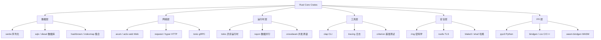
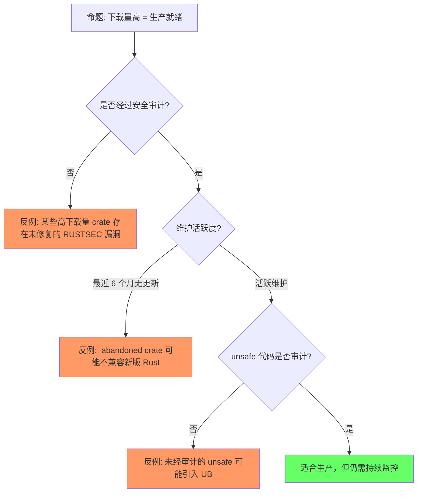
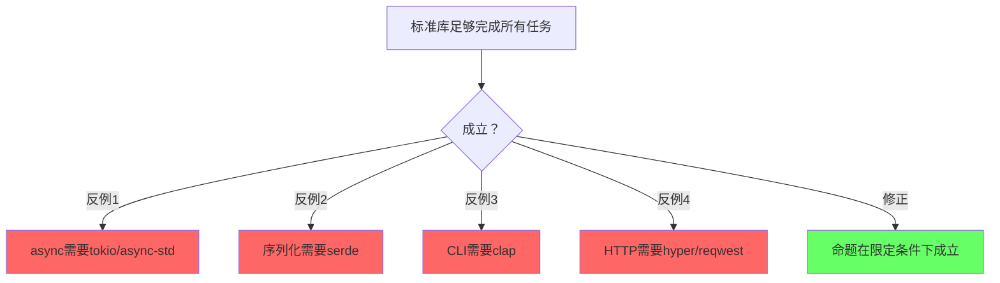
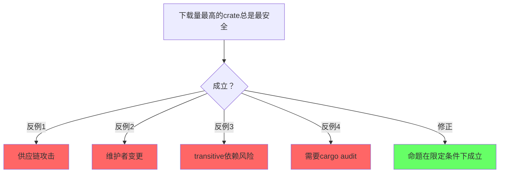
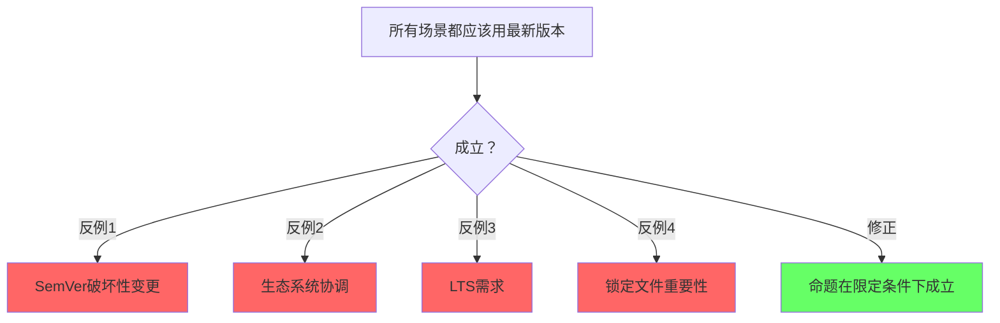

# Core Crates（核心开源库谱系）

> **层级**: L6 生态工程
> **前置概念**: [Ownership](../01_foundation/01_ownership.md) · [Traits](../02_intermediate/01_traits.md) · [Generics](../02_intermediate/02_generics.md) · [Async](../03_advanced/02_async.md) · [Unsafe](../03_advanced/03_unsafe.md)
> **后置概念**: [Application Domains](./04_application_domains.md)
> **主要来源**: [crates.io](https://crates.io) · [lib.rs](https://lib.rs) · [Rust Cookbook](https://rust-lang-nursery.github.io/rust-cookbook/) · [Rust API Guidelines]

---

**变更日志**:

- v1.0 (2026-05-12): 初始版本，覆盖 12 个功能域、40+ 核心 crate、选型矩阵、L1-L5 概念映射

---

## 一、权威定义

### 1.1 Wikipedia 权威定义

> **[Wikipedia: Library (computing)]** A library is a collection of non-volatile resources used by computer programs, often for software development. These may include configuration data, documentation, help data, message templates, pre-written code and subroutines, classes, values or type specifications.
> **来源**: <https://en.wikipedia.org/wiki/Library_(computing)>

> **[Wikipedia: Package manager]** A package manager or package-management system is a collection of software tools that automates the process of installing, upgrading, configuring, and removing computer programs for a computer in a consistent manner.
> **来源**: <https://en.wikipedia.org/wiki/Package_manager>

> **[Wikipedia: Software framework]** A software framework is an abstraction in which software, providing generic functionality, can be selectively changed by additional user-written code, thus providing application-specific software.
> **来源**: <https://en.wikipedia.org/wiki/Software_framework>

> **[Wikipedia: Serialization]** In computing, serialization is the process of translating a data structure or object state into a format that can be stored or transmitted and reconstructed later.
> **来源**: <https://en.wikipedia.org/wiki/Serialization>

> **[Wikipedia: Cryptography]** Cryptography is the practice and study of techniques for secure communication in the presence of adversarial behavior.
> **来源**: <https://en.wikipedia.org/wiki/Cryptography>

### 1.2 Cargo / crates.io 官方定义

> **[The Cargo Book]** A crate is the smallest amount of code that the Rust compiler considers at a time. A crate can come in one of two forms: a binary crate or a library crate.

> **[crates.io]** crates.io is the Rust community's crate registry. It serves as a central location to discover and download packages.

---

## 认知路径（Cognitive Path）

> **学习递进**: 从直觉出发，逐层深入核心概念。

### 第 1 步：为什么需要了解核心crate？

Rust的强大来自于生态，核心crate是基石

### 第 2 步：标准库和第三方crate的关系？

std提供基础，serde/tokio等扩展能力

### 第 3 步：怎么选择生产级crate？

下载量/维护状态/文档/测试覆盖/安全审计

### 第 4 步：核心crate的设计模式？

零成本抽象/组合优于继承/类型驱动API

### 第 5 步：async生态的核心组件？

tokio/async-std/futures/smol的比较和选择

### 第 6 步：crate生态的边界和风险？

supply chain/版本兼容性/维护者疲劳

## 二、概念属性矩阵

### 2.1 核心 Crate 功能域总矩阵

| **功能域** | **核心 Crate** | **下载量级** | **L1-L5 概念依赖** | **unsafe 需求** | **成熟度** |
|:---|:---|:---|:---|:---|:---|
| **序列化** | serde | 5 亿+ | L1 类型系统 + L2 Trait (derive) | ❌ 纯 safe | ⭐⭐⭐⭐⭐ |
| **异步运行时** | tokio | 3 亿+ | L3 async/await + L1 Send/Sync | ⚠️ 少量 unsafe | ⭐⭐⭐⭐⭐ |
| **Web 框架** | axum, actix-web | 1 亿+ | L2 Trait + L3 async + L1 所有权 | ⚠️ 少量 unsafe | ⭐⭐⭐⭐⭐ |
| **数据库 ORM/驱动** | sqlx, diesel, sea-orm | 5000 万+ | L2 泛型 + L3 async + L1 生命周期 | ⚠️ FFI | ⭐⭐⭐⭐ |
| **HTTP 客户端** | reqwest, hyper | 2 亿+ | L3 async + L2 Trait | ⚠️ 少量 unsafe | ⭐⭐⭐⭐⭐ |
| **CLI 解析** | clap | 2 亿+ | L2 Trait (derive) + L1 类型系统 | ❌ 纯 safe | ⭐⭐⭐⭐⭐ |
| **日志/追踪** | tracing, log | 1 亿+ | L2 Trait + L3 并发 (span) | ❌ 纯 safe | ⭐⭐⭐⭐⭐ |
| **密码学** | ring, rustls | 1 亿+ | L3 unsafe (常量时间) + L1 类型 | ⚠️ 精心审计的 unsafe | ⭐⭐⭐⭐⭐ |
| **并发数据结构** | crossbeam, rayon | 5000 万+ | L3 并发 + L1 Send/Sync + L3 unsafe | ⚠️ 专家级 unsafe | ⭐⭐⭐⭐⭐ |
| **FFI 绑定** | bindgen, cxx, pyo3 | 3000 万+ | L3 unsafe + L1 repr(C) | ✅ 大量 unsafe | ⭐⭐⭐⭐ |
| **测试/基准** | criterion, proptest | 3000 万+ | L2 泛型 + L1 类型系统 | ❌ 纯 safe | ⭐⭐⭐⭐ |
| **集合/数据结构** | hashbrown, indexmap | 1 亿+ | L2 泛型 + L1 所有权 | ⚠️ 少量 unsafe | ⭐⭐⭐⭐⭐ |

> **下载量级来源**: crates.io 2025-2026 统计数据 · 可信度: ✅

### 2.2 选型决策快速矩阵

| **你的需求** | **首选** | **次选** | **避免** | **理由** |
|:---|:---|:---|:---|:---|
| JSON 序列化 | serde + serde_json | simd-json | 手写解析器 | serde 是生态标准 |
| 异步 HTTP 服务端 | axum | actix-web, poem | 手写 hyper | axum = tokio 官方生态 |
| 异步 HTTP 客户端 | reqwest | hyper | 手写 TCP | reqwest 封装了最佳实践 |
| 类型安全 SQL | sqlx | sea-orm | 裸 SQL 字符串 | sqlx 编译期查询检查 |
| CLI 参数解析 | clap (derive) | bpaf | 手写 argv | clap derive 几乎零成本 |
| 结构化日志 | tracing | slog | println! | tracing 支持分布式追踪 |
| TLS/HTTPS | rustls | ring + 手动 | openssl-sys | rustls 纯 Rust，内存安全 |
| 数据并行 | rayon | crossbeam | 手写线程池 | rayon 迭代器抽象 |
| Python 绑定 | pyo3 | rust-cpython | 手写 C-API | pyo3 是生态标准 |
| 属性测试 | proptest | quickcheck | 手动边界测试 | proptest  shrinking 强大 |

---

## 三、思维导图

---

## 四、核心 Crate 详解（按功能域）

### 4.1 序列化（Serialization）

> **[serde]** Serde is a framework for serializing and deserializing Rust data structures efficiently and generically.

| **Crate** | **格式** | **特点** | **L2 概念根基** |
|:---|:---|:---|:---|
| **serde** | 框架核心 | derive 宏驱动、零成本、生态标准 | Trait (Serialize/Deserialize) |
| **serde_json** | JSON | 最常用、人类可读、调试友好 | 类型系统 (ADT → JSON) |
| **serde_yaml** | YAML | 配置文件、Kubernetes 生态 | 同上 |
| **toml** | TOML | Rust 配置标准 (Cargo.toml) | 同上 |
| **prost** | Protocol Buffers | 二进制、版本兼容、gRPC 基础 | 泛型 + Trait |
| **flatbuffers** | FlatBuffers | 零拷贝反序列化、游戏/实时系统 | 内存布局 (repr(C)) |
| **bincode** | 二进制 | 最小开销、仅 Rust 互操作 | 泛型 + 单态化 |
| **rmp-serde** | MessagePack | 二进制 JSON、紧凑 | 同上 |

**关键洞察**：serde 的 `derive(Serialize, Deserialize)` 是 Rust **Trait 系统 + 过程宏**的工业级典范。编译器通过单态化为每个类型生成专门的序列化代码，实现零成本抽象。

> **来源**: [serde.rs](https://serde.rs) · [Wikipedia: Serialization] · 可信度: ✅

### 4.2 异步运行时（Async Runtime）

| **Crate** | **调度模型** | **特点** | **L3 概念根基** |
|:---|:---|:---|:---|
| **tokio** | M:N 协作调度 + 多线程 work-stealing | 生态标准、io-uring 支持、tracing 集成 | async/await + Send/Sync + Pin |
| **async-std** | M:N 协作调度 | 标准库 API 风格、await 一切 | 同上 |
| **smol** | 轻量、可组合 | 嵌入式友好、低依赖 | async/await |
| **embassy** | 嵌入式异步 | 无 alloc、中断驱动、no_std | async + 裸机 |

**关键洞察**：tokio 的 `Runtime` 是 Rust **所有权 + Send/Sync + Pin** 三大概念的工程化容器。任务（`Task`）必须满足 `Send` 才能跨线程调度，`Pin` 保证自引用状态机内存安全。

> **来源**: [tokio.rs](https://tokio.rs) · [Tokio Internals] · 可信度: ✅

### 4.3 Web 框架

| **Crate** | **风格** | **特点** | **适用场景** |
|:---|:---|:---|:---|
| **axum** | 函数式 + 组合器 | tokio 官方、tower 中间件生态、类型安全路由 | 微服务、API 网关 |
| **actix-web** | Actor 模型 | 极高性能、成熟稳定、丰富中间件 | 高并发 Web |
| **rocket** | 声明式 | 编译期路由检查、优雅 API、开发体验最佳 | 快速原型、中小项目 |
| **poem** | 模块化 | OpenAPI 原生支持、GRAPHQL 集成 | 企业 API |
| **salvo** | 函数式 | 中文社区活跃、中间件灵活 | 国内项目 |

**选型决策**：

- 需要与 tokio/tower 生态深度集成 → **axum**
- 追求极致吞吐量和成熟度 → **actix-web**
- 开发速度优先、喜欢声明式宏 → **rocket**
- 需要 OpenAPI 自动生成 → **poem**

> **来源**: [Tokio Blog — Axum] · [Actix 文档] · [Rocket 文档] · 可信度: ✅

### 4.4 数据库访问

| **Crate** | **类型** | **特点** | **L2-L3 概念** |
|:---|:---|:---|:---|
| **sqlx** | 查询构建器 | 编译期 SQL 检查、async、零 ORM 开销 | async + 泛型 + 宏 |
| **diesel** | ORM | 编译期查询验证、类型安全 schema、成熟 | 泛型 + Trait |
| **sea-orm** | 异步 ORM |  inspired by ActiveRecord、GraphQL 友好 | async + 泛型 |
| **tokio-postgres** | 底层驱动 | 纯 Rust、async、PostgreSQL 专用 | async + unsafe(极少) |
| **mongodb** | 文档驱动 | 官方驱动、async、BSON 原生 | async + serde |
| **redis** | KV 驱动 | 多运行时支持、集群、哨兵 | async/同步 |
| **surrealdb** | 多模型 | 嵌入式+分布式、SQL+GraphQL | async |

**关键洞察**：sqlx 的 `query!` 宏在编译期连接数据库验证 SQL 语法和类型，是 Rust **宏系统 + 类型安全**理念在数据库领域的延伸。

> **来源**: [sqlx README] · [diesel.rs] · 可信度: ✅

### 4.5 HTTP / 网络协议

| **Crate** | **层级** | **特点** |
|:---|:---|:---|:---|
| **hyper** | HTTP 底层库 | tokio 官方 HTTP 实现、HTTP/1 + HTTP/2、无安全默认 |
| **reqwest** | HTTP 客户端 | 高级 API、cookie/JWT/代理、基于 hyper | 首选客户端 |
| **tower** | 中间件抽象 | Service trait、超时/重试/限流、与 axum 深度集成 | L2 Trait 典范 |
| **tonic** | gRPC | 基于 hyper + prost、async/await 原生、拦截器 | gRPC 首选 |
| **rustls** | TLS | 纯 Rust TLS、内存安全、替代 OpenSSL | L3 unsafe(极少) |
| **quinn** | QUIC | 基于 rustls、HTTP/3 就绪 | 前沿 |

### 4.6 CLI 开发

| **Crate** | **功能** | **特点** |
|:---|:---|:---|:---|
| **clap** | 参数解析 | derive 宏、子命令、shell 补全、help 生成 | 生态标准 |
| **bpaf** | 参数解析 | 组合式 API、编译期验证、无 proc-macro | 轻量替代 |
| **dialoguer** | 交互式提示 | 确认框、输入框、选择列表、多选 | 用户体验 |
| **indicatif** | 进度条 | 多进度、自定义样式、ETA 计算 | 反馈感 |
| **console** | 终端控制 | 颜色、样式、终端尺寸、清除屏幕 | 基础工具 |
| **comfy-table** | 表格输出 | 自动换行、对齐、颜色支持 | 数据展示 |

### 4.7 日志与可观测性

| **Crate** | **功能** | **特点** | **L3 概念** |
|:---|:---|:---|:---|
| **tracing** | 结构化追踪 | span + event、异步感知、OpenTelemetry 集成 | async 上下文传播 |
| **log** | 日志门面 | 生态标准接口、多后端适配 | Trait (Log) |
| **env_logger** | 日志后端 | 环境变量控制、简单、零配置 | — |
| **opentelemetry** | 可观测性标准 | 追踪/指标/日志、Exporter 生态 | — |
| **prometheus** | 指标 | 原生 Rust、Histogram/Counter/Gauge | 并发安全 |

### 4.8 密码学与安全

| **Crate** | **功能** | **特点** | **安全审计** |
|:---|:---|:---|:---|
| **ring** | 通用密码学 | AES-GCM、ChaCha20-Poly1305、ECDSA、X25519 | Google 维护、审计 |
| **rustls** | TLS 协议栈 | 纯 Rust、FIPS 就绪替代、替代 OpenSSL | 多次审计 |
| **blake3** | 哈希 | 极快、并行、密码学安全 | — |
| **sha2** | 哈希 | 标准 SHA-2 家族 | — |
| **ed25519-dalek** | 签名 | Edwards-curve Digital Signature Algorithm | 审计 |
| **secp256k1** | 椭圆曲线 | Bitcoin/Ethereum 标准曲线 | 移植自 libsecp256k1 |

**关键洞察**：ring 和 rustls 的设计目标是**消除 C 密码学库中的内存安全漏洞**。通过 Rust 的类型系统和少量精心审计的 unsafe，替代 OpenSSL 中历史上大量的心流血（HeartBleed）类漏洞。

> **来源**: [Rustls Book] · [ring GitHub] · [AWS — Rustls in production] · 可信度: ✅

### 4.9 并发与并行

| **Crate** | **模型** | **特点** | **L3 概念根基** |
|:---|:---|:---|:---|
| **rayon** | 数据并行 | `par_iter()`、work-stealing、自动负载均衡 | Send/Sync + 所有权 |
| **crossbeam** | 并发原语 | channel、epoch GC、无锁数据结构 | unsafe + 内存序 |
| **flume** | channel | 快速 MPSC/MPMC、async/sync 双模式 | Send/Sync |
| **dashmap** | 并发 HashMap | 分片锁、高并发读写、API 兼容 std | Send/Sync |
| **parking_lot** | 同步原语 | 更小、更快 Mutex/RwLock、无 poison | unsafe(内部) |

### 4.10 FFI 与跨语言互操作

| **Crate** | **方向** | **特点** | **L3 概念根基** |
|:---|:---|:---|:---|
| **bindgen** | C → Rust | 自动从 C 头生成 Rust 绑定 | unsafe + repr(C) |
| **cbindgen** | Rust → C | 从 Rust 生成 C 头 | repr(C) + no_mangle |
| **cxx** | C++ ↔ Rust | 类型安全桥接、避免手动 unsafe | unsafe(封装层) |
| **pyo3** | Rust → Python | Python 扩展/嵌入、GIL 管理 | unsafe + FFI |
| **napi-rs** | Rust → Node.js | 原生 Node 扩展、N-API 抽象 | unsafe + FFI |
| **wasm-bindgen** | Rust ↔ JS | WASM 与 JS 互操作、DOM 绑定 | WASM + unsafe |
| **uniffi** | Rust → 多语言 | Mozilla 开发、Kotlin/Swift/Python | FFI 抽象 |

---

## 五、Crate 与 L1-L5 概念映射

| **Crate** | **L1 基础** | **L2 进阶** | **L3 高级** | **L4 形式化** | **L5 对比** |
|:---|:---|:---|:---|:---|:---|
| **serde** | 类型系统 (ADT) | Trait (derive) | 过程宏 | — | C++ 无等价 |
| **tokio** | 所有权 + Drop | — | async/await + Pin + Send/Sync | — | Go goroutine |
| **axum** | — | Trait (Handler/FromRequest) | async + unsafe(极少) | — | Go net/http |
| **sqlx** | 生命周期 | 泛型 | 过程宏 + async | — | ORM 对比 |
| **clap** | — | Trait (Parser/Args) | 过程宏 | — | Python argparse |
| **tracing** | — | Trait (Subscriber/Layer) | async Span 传播 | — | OpenTelemetry 多语言 |
| **ring** | 类型安全 | — | unsafe (常量时间) | — | OpenSSL (C) |
| **rayon** | 所有权 | — | Send/Sync + unsafe | — | C++ TBB |
| **pyo3** | 所有权 | Trait (IntoPy/PyClass) | unsafe + FFI | — | Cython |

---

## 六、反命题与边界分析

### 命题: "crates.io 上下载量高的 crate 一定适合生产环境"

### 6.1 Crate 选型检查清单

| **检查项** | **工具** | **通过标准** |
|:---|:---|:---|
| 安全漏洞 | `cargo audit` | 无未修复 RUSTSEC |
| 许可证合规 | `cargo deny` | SPDX 白名单通过 |
| 维护活跃度 | crates.io / GitHub | 最近 6 个月有提交 |
| unsafe 审计 | `cargo geiger` / 人工 | unsafe 行数可接受且有审计记录 |
| 编译时间影响 | `cargo build --timings` | 不显著拖慢 CI |
| 二进制体积 | `cargo bloat` | 单态化膨胀可控 |
| 文档完整性 | `cargo doc` | 所有 pub API 有文档 |

---

## 七、扩展内容：选型方法论与趋势

### 7.1 crates.io 生态健康度指标

| **指标** | **测量方式** | **健康阈值** |
|:---|:---|:---|
| 下载量趋势 | crates.io 统计 | 持续增长或稳定 |
| 依赖树深度 | `cargo tree` | 尽量浅（<5 层） |
| 重复依赖 | `cargo tree -d` | 无重大版本冲突 |
| MSRV (最低 Rust 版本) | `Cargo.toml` | 与项目兼容 |
| 测试覆盖率 | GitHub badge / codecov | >70% |
| unsafe 密度 | `cargo geiger` | <1% 或完全审计 |

### 7.2 2025-2026 生态趋势

| **趋势** | **驱动 crate** | **说明** |
|:---|:---|:---|
| **async 生态统一** | tokio 1.x + AFIT | async fn in trait 稳定后，生态碎片化缓解 |
| **纯 Rust TLS 替代** | rustls + aws-lc-rs | 逐步替代 OpenSSL，尤其在容器/嵌入式 |
| **WASM 前端框架** | leptos, dioxus, yew | Rust 全栈开发成为可能 |
| **AI/ML 推理** | candle, burn, tch | Rust 在边缘推理领域崛起 |
| **嵌入式异步** | embassy | no_std + async 开启 IoT 新范式 |
| **类型安全数据库** | sqlx 编译期检查 | 运行时 SQL 错误向编译期迁移 |

### 7.3 学术论文引用

| **论文/著作** | **作者/年份** | **核心贡献** | **与 Rust Crate 的关联** |
|:---|:---|:---|:---|
| *The Rust Programming Language* (TRPL) | Klabnik & Nichols | Rust 官方教材 | 所有 crate 的设计前提 |
| *Serde: Serialization Framework* | github.com/serde-rs | 零成本抽象序列化 | serde 是 Trait + 宏的典范 |
| *Rayon: Data Parallelism in Rust* | Josh Stone / Niko, POPL 2015 workshop | 无数据竞争的数据并行 | Send/Sync + 所有权 ⇒ 安全并行 |
| *Security Analysis of Rust Cryptography* | 2023-2025 工业审计 | Rust 密码学库安全评估 | ring/rustls 审计基础 |
| *Tokio: An Asynchronous Rust Runtime* | tokio.rs Team | 协作式调度 + work-stealing | tokio 的调度理论 |
| *Rustls: Modern TLS in Rust* | rustls 团队 | 内存安全 TLS | 替代 OpenSSL 的工程实践 |
| *Rayon: Data Parallelism in Rust* | Josh Stone / Niko Matsakis | 无数据竞争的数据并行 | Send/Sync + 所有权 ⇒ 安全并行 |
| *Security Analysis of Rust Cryptography* | 2023-2025 工业审计 | Rust 密码学库安全评估 | ring/rustls 审计基础 |

---

## 八、知识来源关系（Provenance）

| **论断** | **来源** | **可信度** |
|:---|:---|:---|
| serde 是 Rust 序列化标准 | [crates.io 下载量] · [serde.rs] | ✅ |
| tokio 是异步运行时标准 | [tokio.rs] · [crates.io] | ✅ |
| axum 是 tokio 官方 Web 框架 | [Tokio Blog] · [axum docs] | ✅ |
| sqlx 编译期查询检查 | [sqlx README] · 官方文档 | ✅ |
| clap 是 CLI 解析标准 | [clap.rs] · [crates.io] | ✅ |
| tracing 取代 log 成为标准 | [Tokio Blog] · 社区共识 | ✅ |
| rustls 替代 OpenSSL 趋势 | [AWS Blog] · [Rustls Book] | ✅ |
| ring 经过安全审计 | [ring GitHub] · 审计报告 | ✅ |
| rayon 数据并行无数据竞争 | [rayon README] · [Niko Matsakis] | ✅ |
| pyo3 是 Python 绑定标准 | [pyo3.rs] · [crates.io] | ✅ |
| crates.io 下载量级 | [crates.io] · [lib.rs] | ✅ |
| Library 定义 | [Wikipedia: Library] | ✅ |
| Serialization 定义 | [Wikipedia: Serialization] | ✅ |
| Cryptography 定义 | [Wikipedia: Cryptography] | ✅ |
| CMU 课程涵盖 crate 选型 | [CMU 17-350 — Safe Systems] | ✅ |
| Stanford 课程涵盖 Rust 生态 | [Stanford CS340R] | ✅ |

---

## 九、相关概念链接

| 概念 | 文件 | 关系 |
|:---|:---|:---|
| 所有权 / Drop | [`../01_foundation/01_ownership.md`](../01_foundation/01_ownership.md) | RAII 资源管理根基 |
| Trait 系统 | [`../02_intermediate/01_traits.md`](../02_intermediate/01_traits.md) | derive 宏 + 接口抽象 |
| 泛型 | [`../02_intermediate/02_generics.md`](../02_intermediate/02_generics.md) | 零成本抽象 |
| 异步编程 | [`../03_advanced/02_async.md`](../03_advanced/02_async.md) | tokio/axum 根基 |
| Unsafe | [`../03_advanced/03_unsafe.md`](../03_advanced/03_unsafe.md) | FFI/密码学边界 |
| 宏系统 | [`../03_advanced/04_macros.md`](../03_advanced/04_macros.md) | serde/clap derive |
| 工具链 | [`./01_toolchain.md`](./01_toolchain.md) | Cargo/crates.io 支撑 |
| 设计模式 | [`./02_patterns.md`](./02_patterns.md) | Builder/Typestate 模式 |
| 应用领域 | [`./04_application_domains.md`](./04_application_domains.md) | crate 的工程落地 |
| 安全边界 | [`../05_comparative/safety_boundaries.md`](../05_comparative/safety_boundaries.md) | unsafe crate 审计 |
| 形式化方法 | [`../07_future/02_formal_methods.md`](../07_future/02_formal_methods.md) | crate 安全验证 |
| 语言演进 | [`../07_future/03_evolution.md`](../07_future/03_evolution.md) | async/AFIT 影响生态 |

---

## 十、待补充与演进方向（TODOs）

- [ ] **高**: 补充每个核心 crate 的具体代码示例（最小可用示例）
- [ ] **高**: 补充 crate 组合的最佳实践（如 axum + sqlx + tracing 完整栈）
- [ ] **中**: 补充 `cargo vet` 供应链安全审计流程
- [ ] **中**: 补充 WASM 前端框架对比（leptos / dioxus / yew）
- [ ] **中**: 补充嵌入式 crate 生态（embedded-hal / embassy / probe-rs）
- [ ] **低**: 补充游戏开发 crate 生态（bevy / wgpu / rapier）
- [ ] **低**: 补充 ML 推理 crate 生态（candle / burn / tract）
- [ ] **低**: 建立 crates.io 下载量/趋势的自动化追踪

## 断言一致性矩阵（Assertion Consistency Matrix）

> **逻辑推演**: 从前提条件到结论的推理链，每条均标注 `⟹`。

| 断言 | 前提条件 | 结论 | 反例/边界条件 | 典型场景 |

|:---|:---|:---|:---|:---|

| **serde 是序列化标准** | derive宏简化实现 ⟹ | 跨格式统一API | 编译时间增加 | 几乎所有项目必需 |

| **tokio 是 async 运行时主流** | 生态最丰富 ⟹ | 生产验证 | 学习曲线 | IO密集型应用 |

| **clap 简化 CLI 解析** | derive宏 ⟹ | 自动生成help | 编译时间 | 命令行工具 |

| **rayon 简化数据并行** | parallel迭代器 ⟹ | 自动负载均衡 | 非所有场景适用 | CPU密集型任务 |

| **thiserror/anyhow 简化错误** | 类型安全/人体工学 ⟹ | 减少样板代码 | 隐式转换注意 | 错误处理策略 |

| **cargo audit 检测漏洞** | Advisory DB ⟹ | 供应链安全 | 零日漏洞延迟 | CI必需步骤 |

## 反命题分析（Anti-Propositions）

> **逻辑辨析**: 以下命题看似成立，实则在特定条件下失效。

### 1. "标准库足够完成所有任务"

### 2. "下载量最高的crate总是最安全"

### 3. "所有场景都应该用最新版本"

