# Rust 惯用法谱系全景（Idioms Spectrum）

> **代码状态**: ✅ 含可编译示例
>
> **EN**: Idioms Spectrum
> **Summary**: Idioms Spectrum: a cross-layer catalog of Rust idioms covering ownership transfer, clone-on-write, unsafe boundaries, error handling, advanced iterators, async runtime patterns, and bare-metal practices.
> **受众**: [进阶]
> **内容分级**: [专家级]
> **权威来源**: 本文件为 `concept/` 权威页。
> **定位**: 本文件从**纵向抽象层级**梳理 Rust 的惯用法（idioms）——从词法糖到架构模式的高效、等效、简洁表达方式，与 `01_patterns.md` 的设计模式形成互补：后者聚焦「设计模式」（面向问题），本文件聚焦「惯用法」（面向表达）。
> **原则**: 每个惯用法必须展示「非惯用写法 → 惯用写法」的等价变换，并标注效率特征与认知负荷。
> **对齐来源**:
> [Rust API Guidelines](https://rust-lang.github.io/api-guidelines/) ·
> [Rust Design Patterns](https://rust-unofficial.github.io/patterns/) ·
> [Rust Style Guide] · [Clippy Lints] ·
> [The Rust Programming Language](https://doc.rust-lang.org/book/title-page.html)
> **Rust 版本**: 1.97.1+ (Edition 2024)
> **Bloom 层级**: L6
> **定理链**: N/A — 描述性/综述性/导航性文档，不涉及形式化定理链
>
> **来源**:
> [Rust API Guidelines](https://rust-lang.github.io/api-guidelines/) ·
> [Rust By Example](https://doc.rust-lang.org/rust-by-example/index.html) ·
> [Rust Reference](https://doc.rust-lang.org/reference/introduction.html) ·
> [Brown University — Interactive Rust Book](https://rust-book.cs.brown.edu/) ·
> [Jung et al. — RustBelt: Securing the Foundations of Rust](https://plv.mpi-sws.org/rustbelt/popl18/) ·
> [Itanium C++ ABI](https://itanium-cxx-abi.github.io/cxx-abi/abi.html)
---

**变更日志**:

- v1.0 (2026-05-21): 初始版本——七层惯用法谱系 + 等价变换 + 反惯用法判定树 + Clippy 对齐
- v1.2 (2026-07-31): P4 国际化对齐——新增 `ManuallyDrop`、`scoped threads` 两个惯用法小节，新增「惯用法与 23/43 模式模型衔接」映射表
- v1.3 (2026-07-31): 补全惯用法语义——新增 `Cow<T>`、所有权移动、`Deref`/`AsRef`/`Borrow` 边界、`MaybeUninit<T>`、unsafe 边界、错误处理全谱、`Iterator` 高级适配器、async 运行时、`no_std` 裸机九个小节。
- v1.4 (2026-08-03): 提升为 L6 权威页；Bloom 层级统一为 L6；Rust 版本对齐 1.97.1+；补全 `matches!`、`vec![value; n]`、`collect()`、扩展 trait（extension trait）、默认 trait 方法、类型驱动设计等惯用法；将 RAII/Scopeguard 小节改为链接到 `34_ownership_as_resource_management.md` 与 `35_scope_guard_and_deferred_cleanup.md`；补充国际化权威来源链接。
- v1.5 (2026-08-03): 补全 Builder 模式、零成本抽象、算法惯用法三个小节；权威来源索引拆分为 P1 学术/形式化来源与 P2 生态/官方/社区来源；全量 L0-L6 小节标题补齐。
- v1.6 (2026-08-04): P5 批次语义空间梳理——新增 `TryFrom/TryInto`、`as_ref`/`unwrap_or_else`/`map_err` 组合子微惯用法、FFI 惯用法三节；新增「概念-属性-关系-示例-反例（CARE）总表」；更新主 mindmap 与接口级 mindmap；补充 P0/P1/P2 权威来源与相关概念链接。
- v1.7 (2026-08-04): P7 WS-A 惯用法语义完备化——新增「错误处理惯用法」「集合惯用法」「宏惯用法」「FFI/C-API 惯用法」四节；补充对应思维导图、决策树、语义矩阵与反例；更新 CARE 总表与目录导航；对齐 Rust API Guidelines + Rust Design Patterns Idioms。

---

> **后置概念**: [Future Roadmap](../../07_future/01_edition_roadmap/04_roadmap.md)
> **前置概念**: [Patterns](01_patterns.md)

## 📑 目录

- [Rust 惯用法谱系全景（Idioms Spectrum）](#rust-惯用法谱系全景idioms-spectrum)
  - [📑 目录](#-目录)
  - [〇、惯用法谱系认知全景](#〇惯用法谱系认知全景)
  - [零、TL;DR —— 惯用法速查](#零tldr--惯用法速查)
  - [一、权威来源与谱系方法论](#一权威来源与谱系方法论)
    - [1.1 惯用法的定义与判别标准](#11-惯用法的定义与判别标准)
    - [1.2 与 Clippy lint 的对齐](#12-与-clippy-lint-的对齐)
  - [二、惯用法谱系总览](#二惯用法谱系总览)
  - [三、L0 词法级惯用法](#三l0-词法级惯用法)
    - [3.1 `?` 传播](#31--传播)
    - [3.2 match 解构与 if let guards](#32-match-解构与-if-let-guards)
    - [3.3 `if let` / `while let`](#33-if-let--while-let)
    - [3.4 Iterator / Option 链式调用](#34-iterator--option-链式调用)
    - [3.5 `matches!` 宏](#35-matches-宏)
    - [3.6 `vec![value; n]` 重复字面量](#36-vecvalue-n-重复字面量)
  - [四、L1 类型级惯用法](#四l1-类型级惯用法)
    - [4.1 Newtype](#41-newtype)
    - [4.2 Typestate](#42-typestate)
    - [4.3 PhantomData](#43-phantomdata)
    - [4.4 零大小类型能力标记](#44-零大小类型能力标记)
    - [4.5 类型驱动设计](#45-类型驱动设计)
    - [4.6 Builder 模式](#46-builder-模式)
    - [4.7 零成本抽象](#47-零成本抽象)
  - [五、L2 接口级惯用法](#五l2-接口级惯用法)
    - [5.1 Into / From](#51-into--from)
    - [5.2 Deref 多态](#52-deref-多态)
    - [5.3 Trait Bound 组合](#53-trait-bound-组合)
    - [5.4 Borrow / AsRef 参数化](#54-borrow--asref-参数化)
    - [5.5 `Cow<T>`](#55-cowt)
    - [5.6 Deref / AsRef / Borrow 边界选型](#56-deref--asref--borrow-边界选型)
    - [5.7 默认 trait 方法](#57-默认-trait-方法)
    - [5.8 扩展 trait (Extension Trait)](#58-扩展-trait-extension-trait)
    - [5.9 TryFrom / TryInto 安全转换](#59-tryfrom--tryinto-安全转换)
    - [5.10 常用组合子惯用法：`as_ref`、`unwrap_or_else`、`map_err`](#510-常用组合子惯用法as_refunwrap_or_elsemap_err)
  - [六、L3 资源级惯用法](#六l3-资源级惯用法)
    - [6.1 RAII 资源管理](#61-raii-资源管理)
    - [6.2 作用域守卫与延迟清理](#62-作用域守卫与延迟清理)
    - [6.3 Pin 不动性](#63-pin-不动性)
    - [6.4 内部可变性分层](#64-内部可变性分层)
    - [6.5 ManuallyDrop](#65-manuallydrop)
    - [6.6 所有权移动惯用法](#66-所有权移动惯用法)
    - [6.7 MaybeUninit](#67-maybeuninit)
    - [6.8 unsafe 边界](#68-unsafe-边界)
  - [七、L4 控制级惯用法](#七l4-控制级惯用法)
    - [7.1 Iterator 消费链](#71-iterator-消费链)
    - [7.2 递归 → 循环](#72-递归--循环)
    - [7.3 早期返回与守卫子句](#73-早期返回与守卫子句)
    - [7.4 `collect` 与 Turbofish](#74-collect-与-turbofish)
    - [7.5 错误处理全谱](#75-错误处理全谱)
    - [7.6 Iterator 高级适配器](#76-iterator-高级适配器)
    - [7.7 `try_fold` 错误短路累加](#77-try_fold-错误短路累加)
    - [7.8 算法惯用法](#78-算法惯用法)
    - [7.9 错误处理惯用法：`Result` 类型设计与 `?` 传播](#79-错误处理惯用法result-类型设计与--传播)
    - [7.10 集合惯用法：`entry`、`retain`、容量预分配与选型](#710-集合惯用法entryretain容量预分配与选型)
    - [7.11 宏惯用法：声明宏卫生性与过程宏边界](#711-宏惯用法声明宏卫生性与过程宏边界)
  - [八、L5 并发级惯用法](#八l5-并发级惯用法)
    - [8.1 Send/Sync 边界显式化](#81-sendsync-边界显式化)
    - [8.2 Actor mailbox 单线程处理](#82-actor-mailbox-单线程处理)
    - [8.3 CSP channel 所有权转移](#83-csp-channel-所有权转移)
    - [8.4 无锁结构的 epoch 安全](#84-无锁结构的-epoch-安全)
    - [8.5 结构化作用域线程](#85-结构化作用域线程)
    - [8.6 async 运行时惯用法](#86-async-运行时惯用法)
  - [九、L6 架构级惯用法](#九l6-架构级惯用法)
    - [9.1 Tower Service 态射复合](#91-tower-service-态射复合)
    - [9.2 洋葱中间件模式](#92-洋葱中间件模式)
    - [9.3 ECS 系统图与 Archetype](#93-ecs-系统图与-archetype)
    - [9.4 错误内核模式](#94-错误内核模式)
    - [9.5 `no_std` / 裸机惯用法](#95-no_std--裸机惯用法)
    - [9.6 FFI 惯用法](#96-ffi-惯用法)
    - [9.7 FFI/C-API 惯用法：暴露与消费 C ABI 的契约](#97-ffic-api-惯用法暴露与消费-c-abi-的契约)
  - [十、反惯用法](#十反惯用法)
    - [常见反惯用清单](#常见反惯用清单)
  - [十一、Rust 1.95 新惯用法](#十一rust-195-新惯用法)
  - [十二、思维表征体系](#十二思维表征体系)
    - [12.1 惯用法选择决策树](#121-惯用法选择决策树)
    - [12.2 惯用法效率-认知负荷象限图](#122-惯用法效率-认知负荷象限图)
    - [12.3 惯用法效率矩阵](#123-惯用法效率矩阵)
    - [12.4 概念-属性-关系-示例-反例总表](#124-概念-属性-关系-示例-反例总表)
  - [十三、定理推理链](#十三定理推理链)
    - [定理一致性矩阵（惯用法谱系专集）](#定理一致性矩阵惯用法谱系专集)
  - [十四、相关概念链接（L0-L7 映射）](#十四相关概念链接l0-l7-映射)
    - [L0-L7 纵向映射](#l0-l7-纵向映射)
    - [相关概念](#相关概念)
  - [十五、惯用法选择的认知路径](#十五惯用法选择的认知路径)
  - [十六、惯用法与 23/43 模式模型衔接](#十六惯用法与-2343-模式模型衔接)
  - [权威来源索引](#权威来源索引)
    - [P0 — Rust 官方 / 一级权威来源](#p0--rust-官方--一级权威来源)
    - [P1 — 学术 / 形式化来源](#p1--学术--形式化来源)
    - [P2 — 生态 / 社区 / 第三方来源](#p2--生态--社区--第三方来源)
  - [十、边界测试：惯用法谱系的编译错误](#十边界测试惯用法谱系的编译错误)
    - [10.1 边界测试：`unwrap` 的滥用（运行时 panic）](#101-边界测试unwrap-的滥用运行时-panic)
    - [10.2 边界测试：`clone` 的隐式成本（逻辑错误）](#102-边界测试clone-的隐式成本逻辑错误)
    - [10.3 边界测试：Clippy 警告的编译错误等价（编译错误）](#103-边界测试clippy-警告的编译错误等价编译错误)
    - [10.4 边界测试：`String` 与 `&str` 的类型不匹配（编译错误）](#104-边界测试string-与-str-的类型不匹配编译错误)
    - [10.5 边界测试：`Default::default()` 与类型推断的歧义（编译错误）](#105-边界测试defaultdefault-与类型推断的歧义编译错误)
    - [10.7 边界测试：`std::mem::replace` 与 `take` 的惯用选择（逻辑错误）](#107-边界测试stdmemreplace-与-take-的惯用选择逻辑错误)
    - [10.3 边界测试：`Default` 派生与手动实现的语义差异（逻辑错误）](#103-边界测试default-派生与手动实现的语义差异逻辑错误)
  - [嵌入式测验（Embedded Quiz）](#嵌入式测验embedded-quiz)
    - [测验 1：`Default` trait 的用途是什么？如何为自定义类型实现它？（理解层）](#测验-1default-trait-的用途是什么如何为自定义类型实现它理解层)
    - [测验 2：`AsRef` 与 `Borrow` trait 在语义上有什么区别？（理解层）](#测验-2asref-与-borrow-trait-在语义上有什么区别理解层)
    - [测验 3：什么是"早返回"（Early Return）模式？Rust 中通常如何实现？（理解层）](#测验-3什么是早返回early-return模式rust-中通常如何实现理解层)
    - [测验 4：`todo!()` 和 `unimplemented!()` 宏在开发中有什么用途？（理解层）](#测验-4todo-和-unimplemented-宏在开发中有什么用途理解层)
    - [测验 5：Rust 的 `must_use` 属性有什么作用？什么类型的返回值通常应该标记它？（理解层）](#测验-5rust-的-must_use-属性有什么作用什么类型的返回值通常应该标记它理解层)
  - [十七、Functional Programming 惯用法](#十七functional-programming-惯用法)
    - [17.1 Iterator combinators as control-flow idiom](#171-iterator-combinators-as-control-flow-idiom)
    - [17.2 Lazy evaluation with iterators and closures](#172-lazy-evaluation-with-iterators-and-closures)
    - [17.3 `Option` / `Result` combinators：`map`、`and_then`、`or_else`](#173-option--result-combinatorsmapand_thenor_else)
    - [17.4 Avoiding mutation via `fold` / `scan`](#174-avoiding-mutation-via-fold--scan)
    - [17.5 决策树：imperative loop vs iterator chain](#175-决策树imperative-loop-vs-iterator-chain)
  - [认知路径](#认知路径)
    - [核心推理链](#核心推理链)
  - [⚠️ 反例与陷阱](#️-反例与陷阱)
    - [反例：部分 move 后整体使用结构体（rustc 1.97.0 实测）](#反例部分-move-后整体使用结构体rustc-1970-实测)
    - [✅ 修正：解构或克隆](#-修正解构或克隆)

---

## 〇、惯用法谱系认知全景
>

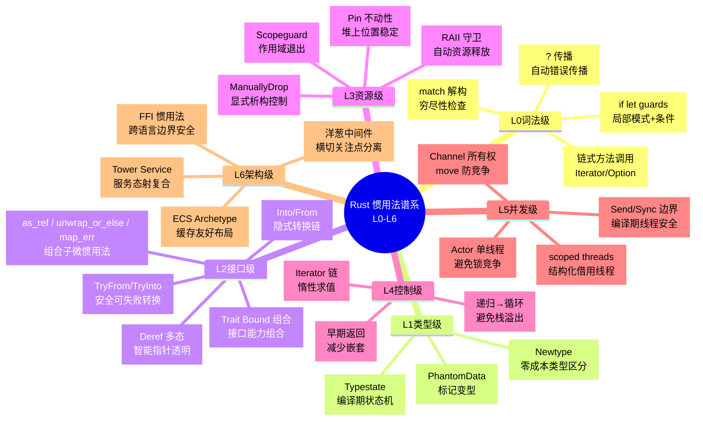
```mermaid
mindmap
  root((Rust 惯用法谱系<br/>L0-L6))
    L0词法级
      传播[? 传播<br/>自动错误传播]
      match解构[match 解构<br/>穷尽性检查]
      if_let_guards[if let guards<br/>局部模式+条件]
      链式调用[链式方法调用<br/>Iterator/Option]
    L1类型级
      Newtype[Newtype<br/>零成本类型区分]
      Typestate[Typestate<br/>编译期状态机]
      PhantomData[PhantomData<br/>标记变型]
    L2接口级
      IntoFrom[Into/From<br/>隐式转换链]
      TryFromInto[TryFrom/TryInto<br/>安全可失败转换]
      Deref[Deref 多态<br/>智能指针透明]
      TraitBound[Trait Bound 组合<br/>接口能力组合]
      MicroCombinators[as_ref / unwrap_or_else / map_err<br/>组合子微惯用法]
    L3资源级
      RAII[RAII 守卫<br/>自动资源释放]
      Scopeguard[Scopeguard<br/>作用域退出]
      Pin[Pin 不动性<br/>堆上位置稳定]
      ManuallyDrop[ManuallyDrop<br/>显式析构控制]
    L4控制级
      Iterator链[Iterator 链<br/>惰性求值]
      递归转循环[递归→循环<br/>避免栈溢出]
      早期返回[早期返回<br/>减少嵌套]
    L5并发级
      SendSync[Send/Sync 边界<br/>编译期线程安全]
      Actor[Actor 单线程<br/>避免锁竞争]
      Channel[Channel 所有权<br/>move 防竞争]
      ScopedThreads[scoped threads<br/>结构化借用线程]
    L6架构级
      TowerService[Tower Service<br/>服务态射复合]
      洋葱中间件[洋葱中间件<br/>横切关注点分离]
      ECS[ECS Archetype<br/>缓存友好布局]
      FFI[FFI 惯用法<br/>跨语言边界安全]
```

> **认知功能**: 本 mindmap 提供 Rust 惯用法的**七层抽象全景导航**，帮助读者建立「从语法糖到架构模式」的完整心智模型。
> 建议将此图作为学习地图：新手聚焦 L0-L2 分支，专家关注 L5-L6 的并发与架构节点。
> 关键洞察是惯用法层级与问题粒度正相关——词法级解决局部表达，架构级解决系统组织。[💡 原创分析](../../00_meta/00_framework/methodology.md)
> [来源: [Rust Reference](https://doc.rust-lang.org/reference/introduction.html)]
> **认知路径**: 本 mindmap 展示 Rust 惯用法的**七层抽象阶梯**。
> 从 L0 词法级（语法糖）到 L6 架构级（系统设计），每层惯用法解决不同粒度的问题。
> 新手应从 L0-L1 开始建立直觉，成长期聚焦 L2-L3，成熟期掌握 L4-L5，专家期探索 L6。
> 每层节点的后缀标注核心特征，便于快速定位。

---

## 零、TL;DR —— 惯用法速查
>

```text
层级        惯用法                    核心特征                    效率        认知负荷
─────────────────────────────────────────────────────────────────────────────────────────
L0 词法     ? 传播                    自动错误传播                零成本      低
            match 解构                穷尽性检查                  零成本      低
            if let guards             局部模式+条件               零成本      低
L1 类型     Newtype                   零成本类型区分              零成本      低
            Typestate                 编译期状态机                零成本      中
            PhantomData               标记生命周期/变型           零成本      中
L2 接口     Into/From                 隐式转换链                  零成本      低
            Deref 多态                智能指针透明解引用          零成本      中
            Trait Bound 组合          接口能力组合                零成本      中
L3 资源     RAII 守卫                 自动资源释放                零成本      低
            Scopeguard                作用域退出处理              低开销      低
            Pin 不动性                堆上值位置稳定              零成本      高
L4 控制     Iterator 链               懒性求值+优化               零成本      低
            递归→循环                 避免栈溢出                  零成本      中
            早期返回                  减少嵌套                    零成本      低
L5 并发     Send/Sync 显式化          编译期线程安全              零成本      中
            Actor 单线程              避免锁竞争                  消息开销    中
            Channel 所有权            move 语义防竞争             零成本      低
L6 架构     Tower Service             服务态射复合                低开销      高
            洋葱中间件                横切关注点分离              低开销      中
            ECS Archetype             缓存友好数据布局            零成本      高
─────────────────────────────────────────────────────────────────────────────────────────
```

---

## 一、权威来源与谱系方法论
>

### 1.1 惯用法的定义与判别标准

> **惯用法（Idiom）**: 在特定编程语言社区中，被广泛接受为「标准做法」的表达方式。它通常不是语言强制要求的，而是社区在长期实践中形成的**最优局部解**——在正确性、效率、可读性之间取得平衡。 来源: [Rust API Guidelines](https://rust-lang.github.io/api-guidelines/)

Rust 惯用法的判别标准（四级评价）：

| 维度 | 权重 | 评价标准 |
|:---|:---:|:---|
| 正确性 | 40% | 是否利用类型系统（Type System）排除更多错误？ |
| 效率 | 30% | 是否为零成本抽象（Zero-Cost Abstraction）？运行时（Runtime）开销如何？ |
| 可读性 | 20% | 是否减少认知负荷？是否符合社区约定？ |
| 可维护性 | 10% | 是否降低未来修改的引入错误风险？ |

### 1.2 与 Clippy lint 的对齐
>

Clippy 的 `style` 和 `pedantic` lint 类别覆盖了大部分惯用法规范：

| Clippy Lint | 惯用法 | 级别 |
|:---|:---|:---:|
| `needless_return` | 省略函数末尾 `return` | style |
| `explicit_iter_loop` | `for x in &vec` 优于 `for x in vec.iter()` | style |
| `match_bool` | `if` 优于 `match true/false` | style |
| `option_if_let_else` | `map_or` 优于 `if let Some` | pedantic |
| `unnecessary_unwrap` | 用 `?` 或 `if let` 替代 `.unwrap()` | warn |
| `ptr_arg` | `&str` 优于 `&String` | warn |
| `clone_on_copy` | 直接复制优于 `.clone()` | warn |

---

## 二、惯用法谱系总览
>

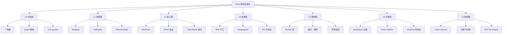
```mermaid
graph TD
    A[Rust 惯用法谱系] --> B[L0 词法级]
    A --> C[L1 类型级]
    A --> D[L2 接口级]
    A --> E[L3 资源级]
    A --> F[L4 控制级]
    A --> G[L5 并发级]
    A --> H[L6 架构级]

    B --> B1[? 传播]
    B --> B2[match 解构]
    B --> B3[if let guards]

    C --> C1[Newtype]
    C --> C2[Typestate]
    C --> C3[PhantomData]

    D --> D1[Into/From]
    D --> D2[Deref 多态]
    D --> D3[Trait Bound 组合]

    E --> E1[RAII 守卫]
    E --> E2[Scopeguard]
    E --> E3[Pin 不动性]

    F --> F1[Iterator 链]
    F --> F2[递归→循环]
    F --> F3[早期返回]

    G --> G1[Send/Sync 边界]
    G --> G2[Actor mailbox]
    G --> G3[Channel 所有权]

    H --> H1[Tower Service]
    H --> H2[洋葱中间件]
    H --> H3[ECS Archetype]
```

> **认知功能**:
> 此树状图将七层惯用法谱系转化为**可遍历的分类层级**，每层3个代表性节点构成最小完整集合。
> 建议将其作为速查索引——当遇到具体代码场景时，可自上而下定位最匹配的惯用法层级。
> 关键洞察是惯用法的「正交覆盖」：L0-L3 聚焦单线程正确性，L4-L6 聚焦性能与并发架构。
> [💡 原创分析](../../00_meta/00_framework/methodology.md)

---

## 三、L0 词法级惯用法

L0 是惯用法谱系的「零层」：单个表达式/语句层面的地道写法，不引入任何抽象，只关乎「同样的意思怎么写最 Rust」。
四个代表项（`?` 传播、`if let` 单模式匹配（Pattern Matching）、复合赋值与范围循环、字面量与后缀约定）的共同判据：**用类型系统（Type System）已有的糖，而不是手工展开**——`?` 替代 `match` 传播、`if let` 替代单臂 `match`、`for x in 0..n` 替代索引循环。
L0 惯用法的特点是「无争议」：它们不改变程序的抽象结构，只减少样板；clippy 的 `redundant_*`/`needless_*` lint 族大多作用于这一层。
学习建议：L0 是「能编译」到「能读懂」的最短路径，任何新代码都应先过一遍 clippy 的 L0 级 lint。

### 3.1 `?` 传播

> 来源: [Rust Reference §6.13](https://doc.rust-lang.org/reference/introduction.html) `?` 传播运算符
> **惯用**: 在返回 `Result` 或 `Option` 的函数中，用 `?` 自动传播错误，替代显式 `match`。

**非惯用**:

```rust,ignore
use std::fs::File;
use std::io;
use std::io::Read;

fn read_file(path: &str) -> Result<String, io::Error> {
    let mut file = match File::open(path) {
        Ok(f) => f,
        Err(e) => return Err(e),
    };
    let mut contents = String::new();
    match file.read_to_string(&mut contents) {
        Ok(_) => Ok(contents),
        Err(e) => Err(e),
    }
}
```

**惯用**:

```rust,ignore
use std::fs::File;
use std::io;
use std::io::Read;

fn read_file(path: &str) -> Result<String, io::Error> {
    let mut file = File::open(path)?;
    let mut contents = String::new();
    file.read_to_string(&mut contents)?;
    Ok(contents)
}
```

**等价性**: `?` 是 `match` 的局部语法糖，不改变控制流语义。编译后生成相同的 MIR。 来源: [Rust Reference §6.13, TRPL §9](https://doc.rust-lang.org/reference/introduction.html)

### 3.2 match 解构与 if let guards

> 来源: [Rust Reference §8, Rust 1.95 Release Notes](https://doc.rust-lang.org/reference/introduction.html) `match` 解构与模式守卫
> **惯用**: 利用模式穷尽性检查和 `if` guards 将条件与解构合一。

**Rust 1.95 新增**: `if let` guards in match arms：

```rust,ignore
use std::io::Error;

// Rust 1.95.0+ 惯用：match 中使用 if let guards
fn classify(value: Option<Result<i32, Error>>) -> &'static str {
    match value {
        Some(Ok(n)) if n > 0 => "positive",
        Some(Ok(n)) if n < 0 => "negative",
        Some(Ok(0)) => "zero",
        Some(Err(_)) => "error",
        None => "missing",
        _ => "other", // guard 不参与穷尽性检查，需兜底
    }
}
```

**等价性**: `if let` guards 在语义上等价于嵌套 `match`，但减少了缩进层级和重复绑定。

### 3.3 `if let` / `while let`

> 来源: [TRPL §6](https://doc.rust-lang.org/book/ch06-00-enums.html) `if let` / `while let` 局部绑定
> **惯用**: 当只关心一个变体时，用 `if let` 替代 `match`；当需要循环处理同一模式直到耗尽时，用 `while let`。

```rust
fn main() {
    let mut stack = vec![1, 2, 3];

    // 惯用：if let 局部绑定
    if let Some(top) = stack.last() {
        println!("top = {}", top);
    }

    // 惯用：while let 循环消费栈
    while let Some(v) = stack.pop() {
        println!("popped {}", v);
    }
    assert!(stack.is_empty());
}
```

**等价性**: `if let PAT = EXPR { ... }` 等价于 `match EXPR { PAT => { ... }, _ => {} }`；`while let` 等价于重复 `match` 直到模式不匹配。二者均不改变控制流语义，只减少样板。 来源: [Rust Reference — if let expressions](https://doc.rust-lang.org/reference/expressions/if-expr.html) · [Rust Reference — while let loops](https://doc.rust-lang.org/reference/expressions/loop-expr.html#while-let-loops)

### 3.4 Iterator / Option 链式调用

> [Rust Iterator docs](https://doc.rust-lang.org/std/iter/trait.Iterator.html) 链式方法调用
> **惯用**: 利用 `Iterator` 和 `Option`/`Result` 的链式方法组合计算。

```rust,ignore
let numbers = vec![-3, -2, -1, 0, 1, 2, 3];

// 惯用：Iterator 消费链
let sum_of_squares: i32 = numbers
    .iter()
    .filter(|&&n| n > 0)
    .map(|n| n * n)
    .sum();

// 非惯用：命令式循环（等效但冗长）
let mut sum = 0;
for &n in &numbers {
    if n > 0 {
        sum += n * n;
    }
}
```

### 3.5 `matches!` 宏

> 来源: [Rust Reference — Macro `matches!`](https://doc.rust-lang.org/std/macro.matches.html) · [Rust 1.42 Release Notes](https://blog.rust-lang.org/2020/03/12/Rust-1.42.html)
> **惯用**: 用 `matches!(value, pattern)` 将模式检查表达为布尔表达式，替代显式 `match` 或 `if let`。

```rust
#[derive(Debug, PartialEq)]
enum Status { Idle, Running(u32), Error }

fn main() {
    let s = Status::Running(42);

    // 惯用：matches! 作为布尔表达式
    assert!(matches!(s, Status::Running(_)));
    assert!(!matches!(s, Status::Error));

    // 也可带守卫
    assert!(matches!(s, Status::Running(n) if n > 10));
}
```

**等价性**: `matches!(x, P)` 在语义上等价于 `match x { P => true, _ => false }`，但可直接嵌入 `if`、`assert!` 或闭包中，减少嵌套。 来源: [Rust Design Patterns — matches!](https://rust-unofficial.github.io/patterns/idioms/matches.html)

### 3.6 `vec![value; n]` 重复字面量

> 来源: [The Rust Reference — Array Expressions](https://doc.rust-lang.org/reference/expressions/array-expr.html) · [Rust by Example — vec!](https://doc.rust-lang.org/rust-by-example/std/vec.html)
> **惯用**: 用 `vec![value; n]` 创建包含 `n` 个相同值的 `Vec`，避免手写循环。

```rust
fn main() {
    // 惯用：重复字面量
    let zeros = vec![0; 5];
    assert_eq!(zeros, vec![0, 0, 0, 0, 0]);

    // 也可以从列表构造
    let nums = vec![1, 2, 3];
    assert_eq!(nums.len(), 3);

    // 非惯用：等价的命令式构造
    let mut zeros_manual = Vec::with_capacity(5);
    for _ in 0..5 {
        zeros_manual.push(0);
    }
    assert_eq!(zeros, zeros_manual);
}
```

**边界**: `vec![value; n]` 要求元素类型实现 `Clone`（因为 `n` 个值共享同一个初始化值）。对于非 `Clone` 类型，需使用 `std::iter::repeat_with` 或显式循环。 来源: [std::vec! macro](https://doc.rust-lang.org/std/macro.vec.html)

---

## 四、L1 类型级惯用法

L1 类型级惯用法利用类型系统本身消除错误类别，四个代表：

1. **Newtype**：`struct UserId(u64)` 把语义不同的整数隔离为不同类型，杜绝参数顺序错误；成本为零（与 `u64` 同布局）。
2. **Typestate**：泛型（Generics）参数编码状态，非法状态转换无对应方法——编译期协议检查。
3. **Parse, don't validate**：校验一次后产出强类型值（`struct Email(String)` 仅由 `Email::parse` 构造），下游函数签名要求 `Email` 即免重复校验。
4. **Builder/Consuming API**：`self` 消费式方法链，防止构建器被复用污染。

判定依据：发现基本类型（`u64`/`String`）在 API 边界裸奔 → Newtype；发现「运行时检查是否已初始化」的注释 → Typestate。

### 4.1 Newtype

> 来源: [Rust API Guidelines](https://rust-lang.github.io/api-guidelines/) Newtype 模式
> **惯用**: 用单字段元组结构体（Struct）为已有类型赋予新的语义身份，零运行时（Runtime）成本。

```rust
// 惯用：Newtype 区分同底层类型的不同语义
struct Meters(u64);
struct Kilometers(u64);

impl Meters {
    fn to_km(self) -> Kilometers {
        Kilometers(self.0 / 1000)
    }
}

// 零成本：编译后 Meters 和 u64 完全同构
```

**等价性**: `struct Meters(u64)` 与 `u64` 在内存布局上完全等价（`#[repr(transparent)]` 保证），但类型系统（Type System）将其视为不兼容类型。

### 4.2 Typestate

> [Rust Design Patterns, Typestate](https://rust-unofficial.github.io/patterns/)) Typestate 模式
> **惯用**: 利用泛型（Generics）和 `PhantomData` 将状态编码到类型中，使非法状态不可表示。

```rust,ignore
use std::io::{self, Error};
use std::marker::PhantomData;
use std::net::TcpStream;

// 惯用：Typestate 编码连接状态
struct Disconnected;
struct Connected;

struct Client<State> {
    socket: TcpStream,
    _state: PhantomData<State>,
}

impl Client<Disconnected> {
    fn connect(addr: &str) -> Result<Client<Connected>, Error> {
        Ok(Client { socket: TcpStream::connect(addr)?, _state: PhantomData })
    }
}

impl Client<Connected> {
    fn send(&mut self, data: &[u8]) -> Result<usize, Error> {
        self.socket.write(data)
    }
    fn disconnect(self) -> Client<Disconnected> {
        Client { socket: self.socket, _state: PhantomData }
    }
}

// 非法操作在编译期拒绝：
// let client = Client::connect("...").unwrap();
// client.connect("..."); // 编译错误！Client<Connected> 无 connect 方法
```

### 4.3 PhantomData

> 来源: [Rustonomicon §4.6](https://doc.rust-lang.org/nomicon/index.html) PhantomData 标记
> **惯用**: 用 `PhantomData` 在不占用内存的情况下，向类型系统（Type System）传递额外的约束信息。

```rust,ignore
use std::marker::PhantomData;

// 惯用：PhantomData 标记生命周期关系
struct Iter<'a, T: 'a> {
    ptr: *const T,
    end: *const T,
    _marker: PhantomData<&'a T>, // 告诉编译器：Iter 借用 'a 生命周期的 T
}

// 惯用：PhantomData 标记变型
struct MyBox<T> {
    ptr: *mut T,
    _marker: PhantomData<T>, // MyBox<T> 的变型与 T 一致（协变）
}
```

### 4.4 零大小类型能力标记

> 来源: [Rust Reference §6.28](https://doc.rust-lang.org/reference/introduction.html) Zero-Sized Types (ZST)
> **惯用**: 利用零大小类型（如 `()`、`PhantomData<T>`、`!`）作为编译期标记，无运行时（Runtime）开销。

```rust,ignore
use std::io;
use std::marker::PhantomData;

type RawFd = i32;

// 惯用：ZST 作为能力标记（Capability）
struct ReadPermission;
struct WritePermission;

struct FileHandle<P> {
    fd: RawFd,
    _perm: PhantomData<P>,
}

impl FileHandle<ReadPermission> {
    fn read(&self, _buf: &mut [u8]) -> io::Result<usize> { Ok(0) }
}

impl FileHandle<WritePermission> {
    fn write(&mut self, _buf: &[u8]) -> io::Result<usize> { Ok(0) }
}
```

### 4.5 类型驱动设计

> **EN**: Type-Driven Design
> **Summary**: Encode domain invariants and protocol states in the type system so that illegal states, transitions, and representations become unrepresentable at compile time.

> 来源: [Rust Design Patterns — Typestate](https://rust-unofficial.github.io/patterns/idioms/typestate.html) · [Parse, don't validate](https://lexi-lambda.github.io/blog/2019/11/05/parse-don-t-validate/) · [Rust API Guidelines](https://rust-lang.github.io/api-guidelines/)

**概念与属性**

类型驱动设计不是单一技巧，而是将「运行时检查」前移到「类型构造」的设计哲学：

- **Newtype**：区分同一底层类型的不同语义（`UserId` vs `OrderId`）。
- **Typestate**：用泛型参数编码合法状态转移（`Client<Disconnected>` vs `Client<Connected>`）。
- **Parse, don't validate**：校验一次后产出强类型值，下游函数签名即保证合法。
- **枚举穷尽性**：用 `enum` 建模互斥状态空间，`match` 保证所有分支被处理。

这些技术的共同目标：**让非法状态不可表示（make illegal states unrepresentable）**，从而把大量运行时错误转化为编译期错误。

**正例**：

```rust
use std::str::FromStr;

// 类型驱动：Email 一旦构造成功就一定是合法格式
#[derive(Debug, Clone, PartialEq)]
struct Email(String);

#[derive(Debug, PartialEq)]
struct InvalidEmail;

impl FromStr for Email {
    type Err = InvalidEmail;

    fn from_str(s: &str) -> Result<Self, Self::Err> {
        if s.contains('@') && !s.is_empty() {
            Ok(Email(s.to_string()))
        } else {
            Err(InvalidEmail)
        }
    }
}

fn send_email(to: &Email, subject: &str) {
    println!("sending '{}' to {:?}", subject, to.0);
}

fn main() {
    let email: Email = "user@example.com".parse().expect("valid email");
    send_email(&email, "Hello");

    // 反例：如果 send_email 接受 &str，则每次调用前都要重复校验
    // send_email("not-an-email", "Oops"); // 编译错误：类型不匹配
}
```

**反例/陷阱**：

```rust,ignore
// 非类型驱动：到处用裸 String 表示 email，重复校验
fn send_email_raw(to: &str, subject: &str) {
    assert!(to.contains('@')); // 运行时检查，容易被遗漏
    println!("sending '{}' to {}", subject, to);
}
```

**思维导图**：

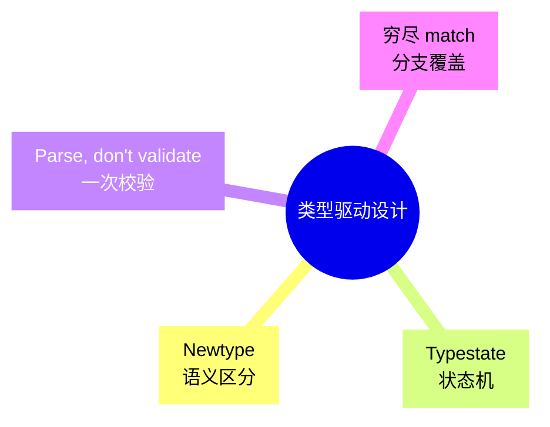
```mermaid
mindmap
  root((类型驱动设计))
    Newtype[Newtype<br/>语义区分]
    Typestate[Typestate<br/>状态机]
    ParseDontValidate[Parse, don't validate<br/>一次校验]
    ExhaustiveMatch[穷尽 match<br/>分支覆盖]
```

**决策树**：

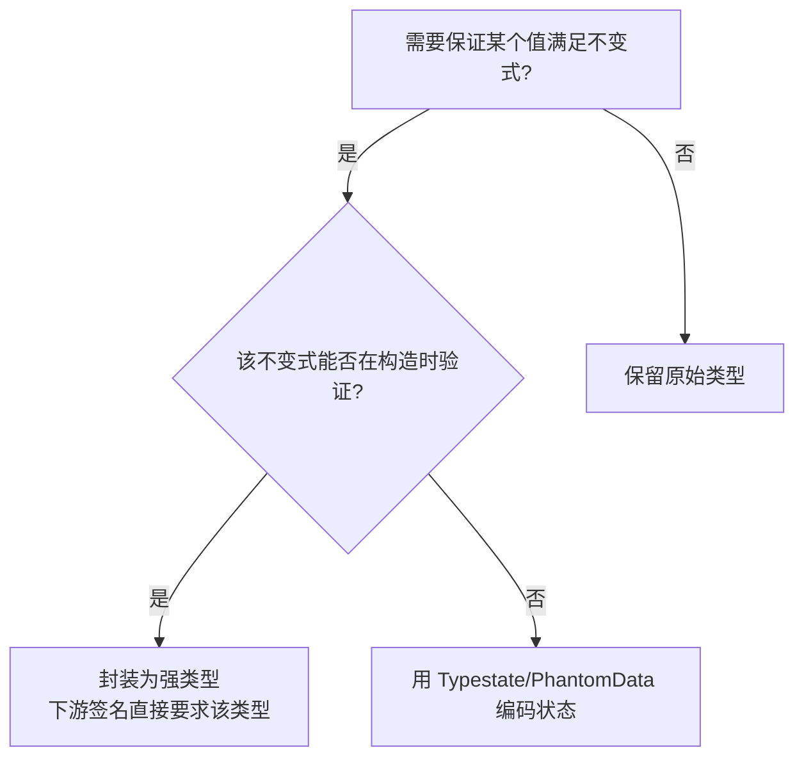
```mermaid
graph TD
    A[需要保证某个值满足不变式?] -->|是| B{该不变式能否在构造时验证?}
    B -->|是| C[封装为强类型<br/>下游签名直接要求该类型]
    B -->|否| D[用 Typestate/PhantomData 编码状态]
    A -->|否| E[保留原始类型]
```

### 4.6 Builder 模式

> **EN**: Builder Pattern
> **Summary**: Construct complex objects step-by-step with a consuming builder that enforces required fields and prevents invalid intermediate states.

> 来源: [Rust Design Patterns — Builder](https://rust-unofficial.github.io/patterns/creational/builder.html) · [Rust API Guidelines](https://rust-lang.github.io/api-guidelines/)

**概念与属性**

Builder 模式将复杂对象的构造拆分为多个步骤，解决「构造器参数过多」或「某些字段必须在其他字段之前设置」的问题。Rust 中惯用的 Builder：

- **独立 `Builder` 类型**：与被构建类型分离，拥有 `self` 消费式链式方法。
- **必填字段在 `build()` 中校验**：利用类型系统或运行时检查，保证产物合法。
- **消费 `self`**：防止同一个 builder 被复用，避免部分构造状态污染。

**正例**：

```rust
#[derive(Debug, PartialEq)]
struct Request {
    method: String,
    url: String,
    headers: Vec<(String, String)>,
    body: Option<String>,
}

#[derive(Debug, Default)]
struct RequestBuilder {
    method: Option<String>,
    url: Option<String>,
    headers: Vec<(String, String)>,
    body: Option<String>,
}

impl RequestBuilder {
    fn new() -> Self {
        Self::default()
    }

    fn method(mut self, m: impl Into<String>) -> Self {
        self.method = Some(m.into());
        self
    }

    fn url(mut self, u: impl Into<String>) -> Self {
        self.url = Some(u.into());
        self
    }

    fn header(mut self, k: impl Into<String>, v: impl Into<String>) -> Self {
        self.headers.push((k.into(), v.into()));
        self
    }

    fn body(mut self, b: impl Into<String>) -> Self {
        self.body = Some(b.into());
        self
    }

    fn build(self) -> Result<Request, &'static str> {
        Ok(Request {
            method: self.method.ok_or("method is required")?,
            url: self.url.ok_or("url is required")?,
            headers: self.headers,
            body: self.body,
        })
    }
}

fn main() {
    let req = RequestBuilder::new()
        .method("GET")
        .url("https://example.com")
        .header("Accept", "application/json")
        .build()
        .unwrap();
    assert_eq!(req.method, "GET");
}
```

**反例/陷阱**：

```rust,ignore
// 非惯用：构造器参数过多，调用时难以辨认每个参数含义
let req = Request::new("GET", "https://example.com", vec![], None, true, false);
```

**与 Typestate 结合**：对「必须在设置 B 之前设置 A」的强约束，可用 Typestate 在编译期保证顺序，而普通 Builder 更适合可选字段多的场景。

### 4.7 零成本抽象

> **EN**: Zero-Cost Abstractions
> **Summary**: Prefer abstractions that compile away, leaving no runtime overhead compared to hand-written low-level code.

> 来源: [TRPL §13 — Performance](https://doc.rust-lang.org/book/ch13-04-performance.html) · [Rustonomicon — Zero-Cost Abstractions](https://doc.rust-lang.org/nomicon/index.html) · [Boehm — Zero-Overhead Principle](https://www.open-std.org/jtc1/sc22/wg21/docs/DPL/1767.pdf)

**概念与属性**

零成本抽象是 Rust 的核心设计承诺：**你不需要为没有使用的东西付费；你使用的东西，其成本不会高于手工实现**。典型体现：

- **迭代器链**：高阶组合子经 LLVM 内联后等价于手写循环。
- **Newtype / 泛型**：编译期类型擦除或单态化，不引入运行时开销。
- **Trait 对象 vs 泛型**：泛型通过单态化实现零成本；`dyn Trait` 有动态分发成本，仅在需要运行时多态时使用。
- **`?` 传播 / `match`**：控制流糖展开为等效分支。

**正例**：

```rust
fn sum_of_squares(numbers: &[i32]) -> i32 {
    numbers
        .iter()
        .filter(|&&n| n > 0)
        .map(|n| n * n)
        .sum()
}

fn main() {
    let v = vec![-2, -1, 0, 1, 2, 3];
    assert_eq!(sum_of_squares(&v), 14); // 1 + 4 + 9
}
```

**反例/陷阱**：

```rust,ignore
// 非零成本：在热路径上使用 dyn Trait 或 Box<dyn Fn> 而未度量
fn hot_path(values: &[i32], f: Box<dyn Fn(i32) -> i32>) -> i32 {
    values.iter().map(|&n| f(n)).sum()
}
```

**决策树**：

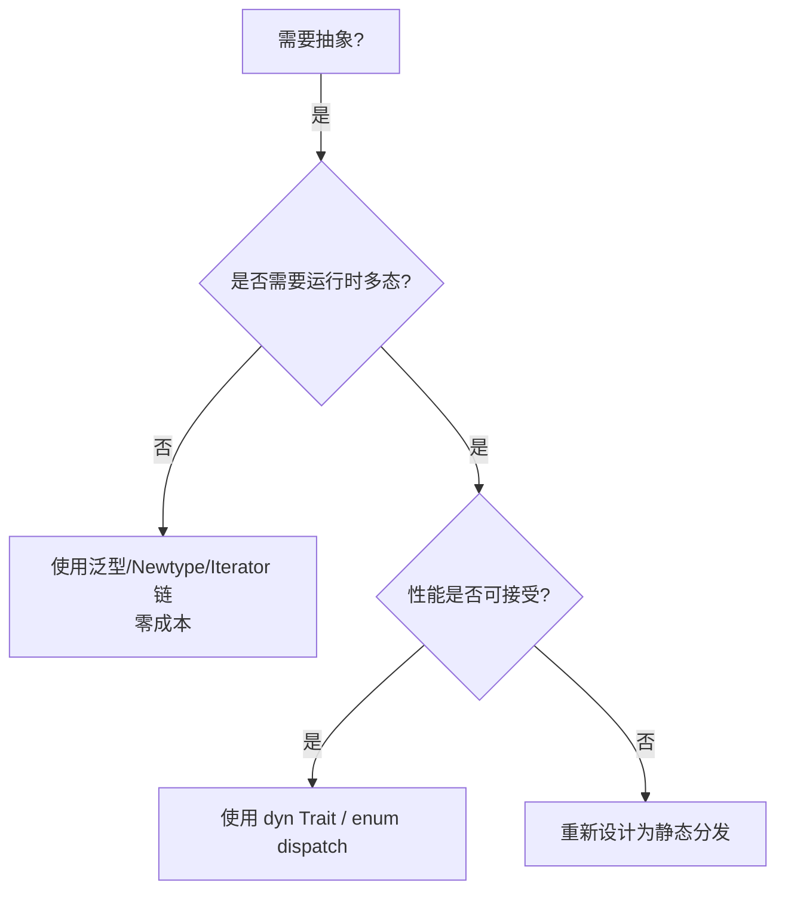
```mermaid
graph TD
    A[需要抽象?] -->|是| B{是否需要运行时多态?}
    B -->|否| C[使用泛型/Newtype/Iterator 链<br/>零成本]
    B -->|是| D{性能是否可接受?}
    D -->|是| E[使用 dyn Trait / enum dispatch]
    D -->|否| F[重新设计为静态分发]
```

---

## 五、L2 接口级惯用法

接口级惯用法决定 crate 的 API 是否“像 Rust”。四条核心规则来自 Rust API Guidelines：实现 `From<T>` 自动获得 `Into<U>`（转换语义单向实现、双向可用）；`AsRef`/`Borrow` 让函数接受更宽泛的借用（Borrowing）类型；`Deref` 只用于智能指针（Smart Pointer）语义而非继承模拟；迭代器（Iterator）适配器优先于显式循环暴露内部结构。共同判据：接口应让调用方写更少的类型标注、犯更少的转换错误。

### 5.1 Into / From

> 来源: [Rust API Guidelines](https://rust-lang.github.io/api-guidelines/) Into/From 转换链
> **惯用**: 实现 `From<T>` 自动获得 `Into<U>`，利用类型推断（Type Inference）隐式转换。

```rust
// 惯用：实现 From 获得 Into
struct Port(u16);

impl From<u16> for Port {
    fn from(p: u16) -> Self { Port(p) }
}

// 自动获得 Into<Port> for u16
fn connect(port: impl Into<Port>) {
    let Port(p) = port.into();
    // ...
}

// 调用时可隐式转换
connect(8080u16); // Into::into(8080u16)
```

### 5.2 Deref 多态

> 来源: [Rust API Guidelines](https://rust-lang.github.io/api-guidelines/) Deref/DerefMut 多态
> **惯用**: 为智能指针（Smart Pointer）和包装类型实现 `Deref`，使其透明地代理内部值的方法。

```rust
// 惯用：Deref 实现透明代理
use std::ops::Deref;

struct SmartBuffer<T> {
    data: Vec<T>,
}

impl<T> Deref for SmartBuffer<T> {
    type Target = [T];
    fn deref(&self) -> &[T] { &self.data }
}

// 可直接调用 [T] 的方法
let buf = SmartBuffer { data: vec![1, 2, 3] };
let first = buf.first(); // 透明调用 [T]::first
```

> **边界**: 过度使用 `Deref` 会导致「隐式转换陷阱」——用户可能意识不到正在通过代理调用。仅对「明显是某种类型的智能指针（Smart Pointer）/包装器」使用。 来源: [Rust API Guidelines](https://rust-lang.github.io/api-guidelines/)

### 5.3 Trait Bound 组合

> 来源: [TRPL §10](https://doc.rust-lang.org/book/ch10-00-generics.html) Trait Bound 组合
> **惯用**: 用 `+` 组合 trait bounds 表达「能力交集」，用 `where` 子句处理复杂约束。

```rust,ignore
use std::fmt::{Debug, Display};

trait Serialize {}

// 惯用：trait bound 组合
fn process<T>(item: T)
where
    T: Display + Debug + Serialize,
{
    // T 必须同时满足 Display + Debug + Serialize
}

// 1.95+ 精确捕获（precise capturing）:
fn callback() -> impl Fn() + use<> { || {} }
```

### 5.4 Borrow / AsRef 参数化

> 来源: [Rust API Guidelines](https://rust-lang.github.io/api-guidelines/) Borrow/AsRef 参数化
> **惯用**: 函数参数接受 `&str` 而非 `&String`，`&[T]` 而非 `&Vec<T>`，最大化调用灵活性。

```rust
// 惯用：接受最通用的借用类型
fn greeting(name: &str) -> String { // 非 &String
    format!("Hello, {name}!")
}

// 调用灵活：
greeting("Rust");              // &str
greeting(&String::from("Rust")); // &String → 自动解引用为 &str
greeting(&"Rust".to_owned());    // &String
```

### 5.5 `Cow<T>`

**`Cow<T>`：按需克隆的借用/拥有二相性**

> **EN**: Clone-on-Write with `Cow<T>`
> **Summary**: `Cow<T>` lets functions accept either borrowed or owned data and defer cloning until mutation is actually required.

> 来源: [Rust std — `std::borrow::Cow`](https://doc.rust-lang.org/std/borrow/enum.Cow.html) · [Rust API Guidelines](https://rust-lang.github.io/api-guidelines/)

**概念与属性**

`Cow<'a, B>`（Clone-on-Write）是 `std::borrow` 提供的枚举，有两种状态：

- `Borrowed(&'a B)`：仅持有借用，零分配。
- `Owned(B::Owned)`：拥有数据，在需要写时克隆。

关键方法：

- `as_ref()` → 统一返回 `&B`，无论当前状态。
- `to_mut()` → 需要可变访问时，如果是 `Borrowed` 则克隆为 `Owned`。
- `into_owned()` → 强制转换为拥有值（`Borrowed` 时触发克隆）。

**与其他惯用法的关系**：`Cow` 是 `Borrow`/`ToOwned` trait 的具体产物，常用于替代「参数既可能是 `&str` 又可能是 `String`」时的人工重载或提前克隆。

**正例**：

```rust
use std::borrow::Cow;

fn append_suffix<'a>(s: Cow<'a, str>, suffix: &str) -> Cow<'a, str> {
    if s.ends_with(suffix) {
        s
    } else {
        let mut owned = s.into_owned();
        owned.push_str(suffix);
        Cow::Owned(owned)
    }
}

fn main() {
    let borrowed = append_suffix(Cow::Borrowed("hello"), "!");
    let owned = append_suffix(Cow::Owned("hello".to_string()), "!");
    println!("{} {}", borrowed, owned);
}
```

**反例/陷阱**：

```rust,ignore
use std::borrow::Cow;

fn bad(s: Cow<str>) {
    // 陷阱：即使不修改输入也调用 into_owned，破坏了 Borrowed 的零分配优势。
    let _ = s.into_owned();
}
```

**思维导图**：

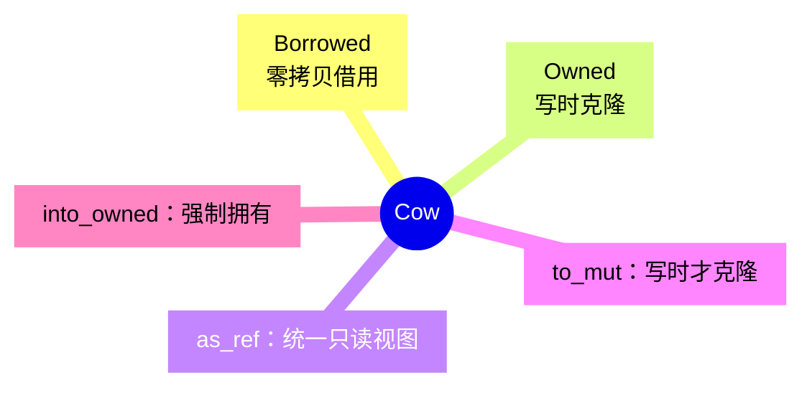
```mermaid
mindmap
  root((Cow<T>))
    Borrowed[Borrowed<T><br/>零拷贝借用]
    Owned[Owned<T><br/>写时克隆]
    as_ref[as_ref：统一只读视图]
    to_mut[to_mut：写时才克隆]
    into_owned[into_owned：强制拥有]
```

**决策树**：

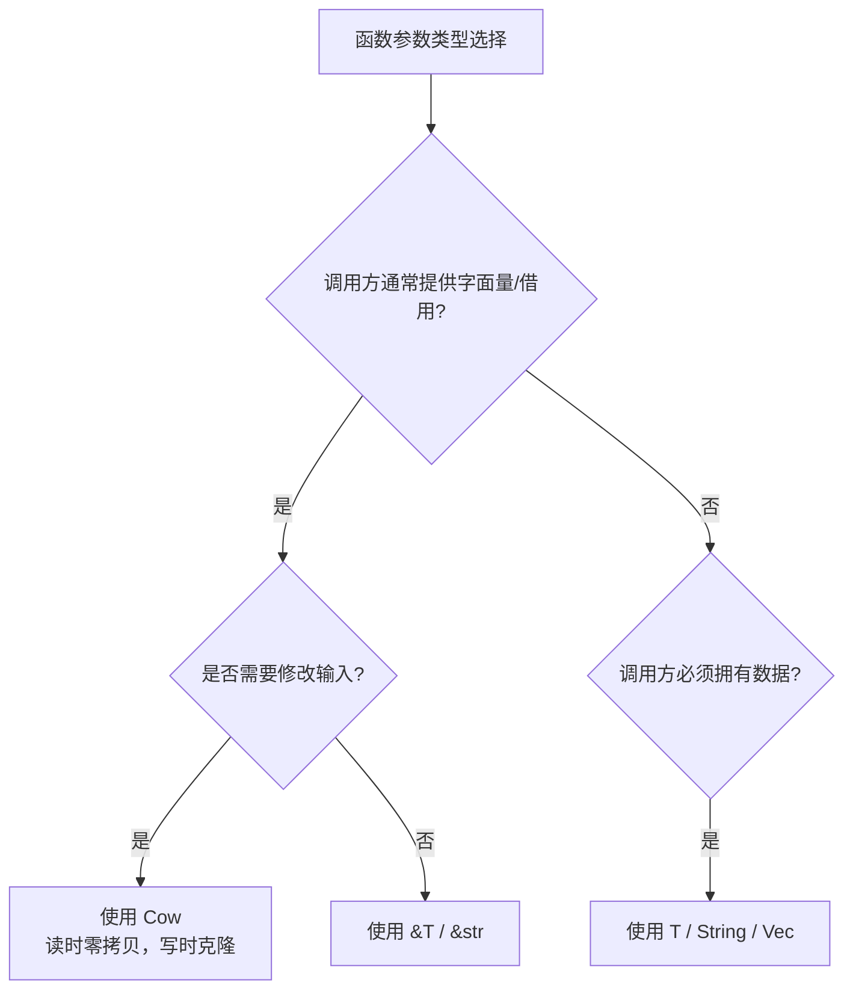
```mermaid
graph TD
    A[函数参数类型选择] --> B{调用方通常提供字面量/借用?}
    B -->|是| C{是否需要修改输入?}
    C -->|是| D[使用 Cow<T><br/>读时零拷贝，写时克隆]
    C -->|否| E[使用 &T / &str]
    B -->|否| F{调用方必须拥有数据?}
    F -->|是| G[使用 T / String / Vec<T>]
```

### 5.6 Deref / AsRef / Borrow 边界选型

**Deref / AsRef / Borrow 边界选型**

> **EN**: Choosing Between `Deref`, `AsRef`, and `Borrow`
> **Summary**: Use `Deref` only for smart-pointer transparency, `AsRef` for cheap reference conversions, and `Borrow` for hash-/compare-stable borrowing.

> 来源: [Rust API Guidelines](https://rust-lang.github.io/api-guidelines/) · [Rust Reference — Type Coercions](https://doc.rust-lang.org/reference/type-coercions.html)

**概念与语义差异**

| Trait | 核心语义 | 自动强制转换 | 等价性要求 | 典型使用场景 |
|:---|:---|:---:|:---:|:---|
| `Deref` | 智能指针/包装器对目标类型的**透明解引用** | ✅ 是 | 无 | `Box<T>`、`Vec<T>`、`String` 代理内部值 |
| `AsRef<T>` | 廉价引用转换 | ❌ 否 | 无 | 函数参数接受更宽泛类型：`&str`/`&String` → `AsRef<str>` |
| `Borrow<T>` | 转换后的引用与原值在**哈希/比较/排序**上一致 | ❌ 否 | 必须保持 `Eq`/`Hash`/`Ord` | 集合键查找：`HashSet<String>::contains(&str)` |

**与其他惯用法的关系**：三者共同回答「函数应该接受什么参数」的问题，但绝不能互换；`Deref` 是智能指针专属，`AsRef` 是转换层，`Borrow` 是集合语义层。

**正例**：

```rust
use std::collections::HashSet;

fn lookup(set: &HashSet<String>, key: &str) -> bool {
    // HashSet::contains 要求 String: Borrow<str>，保证 key 与存储值的哈希一致。
    set.contains(key)
}

fn main() {
    let mut set = HashSet::new();
    set.insert("rust".to_string());
    assert!(lookup(&set, "rust"));
}
```

**反例/陷阱**：

```rust,ignore
use std::ops::Deref;

struct Animal { name: String }
struct Dog(Animal);

// 反模式：用 Deref 模拟「继承」
impl Deref for Dog {
    type Target = Animal;
    fn deref(&self) -> &Animal { &self.0 }
}

fn main() {
    let d = Dog(Animal { name: "Rex".into() });
    // 隐式通过 Deref 访问，读者无法一眼区分 Dog 与 Animal。
    println!("{}", d.name);
}
```

**思维导图**：

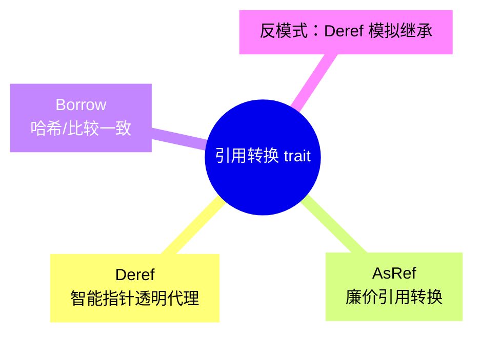
```mermaid
mindmap
  root((引用转换 trait))
    Deref[Deref<br/>智能指针透明代理]
    AsRef[AsRef<br/>廉价引用转换]
    Borrow[Borrow<br/>哈希/比较一致]
    AntiPattern[反模式：Deref 模拟继承]
```

**决策树**：

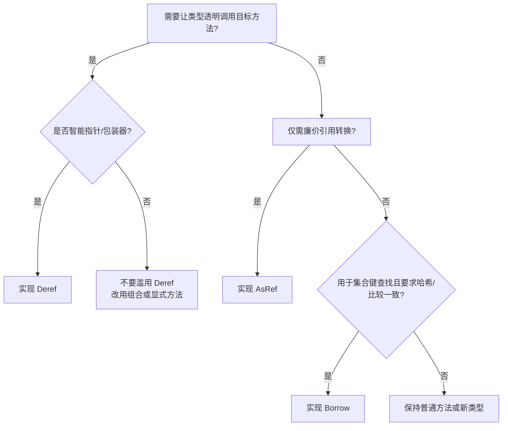
```mermaid
graph TD
    A[需要让类型透明调用目标方法?] -->|是| B{是否智能指针/包装器?}
    B -->|是| C[实现 Deref]
    B -->|否| D[不要滥用 Deref<br/>改用组合或显式方法]
    A -->|否| E[仅需廉价引用转换?]
    E -->|是| F[实现 AsRef<T>]
    E -->|否| G{用于集合键查找且要求哈希/比较一致?}
    G -->|是| H[实现 Borrow<T>]
    G -->|否| I[保持普通方法或新类型]
```

### 5.7 默认 trait 方法

> **EN**: Default Trait Methods
> **Summary**: Provide default implementations for trait methods so that implementors only need to override behavior that actually differs.

> 来源: [Rust Reference — Trait Items](https://doc.rust-lang.org/reference/items/traits.html) · [TRPL §10.2](https://doc.rust-lang.org/book/ch10-02-traits.html)

**概念与属性**

Trait 中的方法可以带有默认实现。实现者可以选择：

- **不重写**：直接继承默认行为，减少样板代码。
- **重写**：提供自定义行为。

默认方法常与关联类型、泛型约束结合，使 trait 既灵活又有合理的「开箱即用」行为。

**正例**：

```rust
trait Greet {
    fn name(&self) -> &str;

    // 默认实现：利用 name() 构造问候语
    fn greet(&self) -> String {
        format!("Hello, {}!", self.name())
    }
}

struct User { name: String }

impl Greet for User {
    fn name(&self) -> &str { &self.name }
    // greet 使用默认实现
}

struct Robot { id: u32 }

impl Greet for Robot {
    fn name(&self) -> &str { "Robot" }

    fn greet(&self) -> String {
        format!("Beep boop, I am #{}", self.id)
    }
}

fn main() {
    let u = User { name: "Ada".into() };
    let r = Robot { id: 42 };
    println!("{}", u.greet());
    println!("{}", r.greet());
}
```

**反例/陷阱**：

```rust,ignore
trait Logger {
    fn log(&self, msg: &str);
    // 如果此处忘记默认实现，所有实现者都必须写重复的空实现或简单实现
}
```

### 5.8 扩展 trait (Extension Trait)

> **EN**: Extension Trait
> **Summary**: Add methods to foreign types by defining a new trait with a blanket or targeted impl, without modifying the original type.

> 来源: [Rust API Guidelines](https://rust-lang.github.io/api-guidelines/) · [Rust Design Patterns — Extension Traits](https://rust-unofficial.github.io/patterns/idioms/extension-traits.html)

**概念与属性**

扩展 trait（也称 "extension trait"、"blanket impl"）是为**无法修改的外部类型**添加方法的技术：

- 定义一个新 trait，包含想要的方法。
- 为外部类型实现该 trait（通常用 blanket impl 覆盖整个 trait 族）。
- 调用方通过 `use ExtTrait;` 将方法引入作用域。

这与 Ruby 的 monkey-patching 不同：扩展 trait 是显式的、受作用域控制的，不会全局污染类型。

**正例**：

```rust
// 为所有 Iterator 添加一个便捷方法
trait IteratorExt: Iterator {
    fn sum_positives(self) -> <Self as Iterator>::Item
    where
        Self: Sized,
        <Self as Iterator>::Item: Default + std::ops::Add<Output = <Self as Iterator>::Item>,
        <Self as Iterator>::Item: PartialOrd,
    {
        self.filter(|x| *x > <Self as Iterator>::Item::default())
            .fold(<Self as Iterator>::Item::default(), |a, b| a + b)
    }
}

impl<I: Iterator> IteratorExt for I {}

fn main() {
    let v = vec![-1, 2, -3, 4];
    assert_eq!(v.into_iter().sum_positives(), 6);
}
```

**反例/陷阱**：

```rust,ignore
// 不要为过于宽泛的类型实现扩展 trait，以免造成方法名冲突或意外可用性
impl<T> IteratorExt for T { ... } // 错误：T 不一定实现 Iterator
```

**思维导图**：

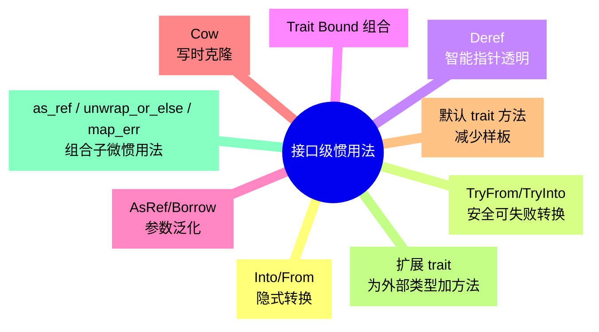
```mermaid
mindmap
  root((接口级惯用法))
    IntoFrom[Into/From<br/>隐式转换]
    TryFromInto[TryFrom/TryInto<br/>安全可失败转换]
    Deref[Deref<br/>智能指针透明]
    TraitBounds[Trait Bound 组合]
    AsRefBorrow[AsRef/Borrow<br/>参数泛化]
    Cow[Cow<T><br/>写时克隆]
    DefaultMethod[默认 trait 方法<br/>减少样板]
    ExtensionTrait[扩展 trait<br/>为外部类型加方法]
    MicroCombinators[as_ref / unwrap_or_else / map_err<br/>组合子微惯用法]
```

### 5.9 TryFrom / TryInto 安全转换

> **EN**: Fallible Conversions with `TryFrom` / `TryInto`
> **Summary**: Prefer `TryFrom`/`TryInto` for conversions that can fail, yielding a typed `Result` instead of panicking with `as` or returning a raw boolean.

> 来源: [Rust API Guidelines — Interoperability](https://rust-lang.github.io/api-guidelines/interoperability.html) · [Rust std — `TryFrom`](https://doc.rust-lang.org/std/convert/trait.TryFrom.html) · [Rust std — `TryInto`](https://doc.rust-lang.org/std/convert/trait.TryInto.html)

**概念与属性**

`TryFrom<T>` / `TryInto<U>` 是 `From`/`Into` 的可失败版本。它们把「可能不合法的转换」表达为类型系统的一部分：

- 当转换可能越界、格式错误或不满足不变式时，返回 `Result<U, E>` 而非 panic。
- 实现 `TryFrom<T> for U` 自动获得 `TryInto<U> for T`。
- 与 `?` 传播天然配合：`.try_into()?` 可在返回 `Result` 的函数中优雅传播。

**与其他惯用法的关系**：`TryFrom` 是 `From` 的安全扩展；与 `?` 传播、`map_err`、自定义错误类型共同构成可失败转换链。

**正例**：

```rust
#[derive(Debug, PartialEq)]
struct Port(u16);

#[derive(Debug, PartialEq)]
struct InvalidPort(u32);

impl TryFrom<u32> for Port {
    type Error = InvalidPort;

    fn try_from(value: u32) -> Result<Self, Self::Error> {
        if value <= u16::MAX as u32 {
            Ok(Port(value as u16))
        } else {
            Err(InvalidPort(value))
        }
    }
}

fn main() {
    let p: Port = 8080u32.try_into().unwrap();
    assert_eq!(p, Port(8080));

    let bad: Result<Port, _> = 100_000u32.try_into();
    assert_eq!(bad, Err(InvalidPort(100_000)));
}
```

**反例/陷阱**：

```rust
fn bad_truncation(x: u32) -> u16 {
    // 陷阱：静默截断，非法输入被掩盖。
    x as u16
}

fn main() {
    let _ = bad_truncation(100_000); // 34464，而非错误
}
```

**决策树**：

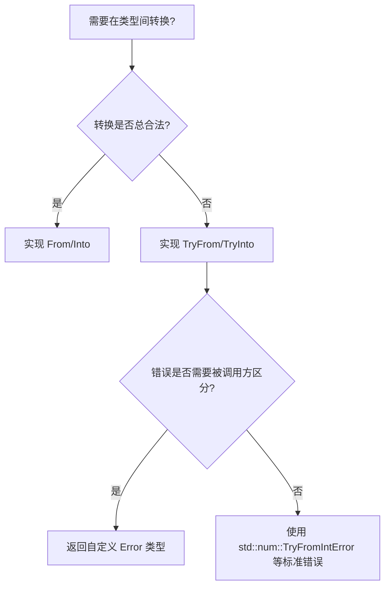
```mermaid
graph TD
    A[需要在类型间转换?] --> B{转换是否总合法?}
    B -->|是| C[实现 From/Into]
    B -->|否| D[实现 TryFrom/TryInto]
    D --> E{错误是否需要被调用方区分?}
    E -->|是| F[返回自定义 Error 类型]
    E -->|否| G[使用 std::num::TryFromIntError 等标准错误]
```

### 5.10 常用组合子惯用法：`as_ref`、`unwrap_or_else`、`map_err`

> **EN**: Common Combinator Idioms: `as_ref`, `unwrap_or_else`, and `map_err`
> **Summary**: Use `as_ref` to borrow the contents of an owned optional/result, `unwrap_or_else` to provide lazy defaults, and `map_err` to transform error types while preserving the success path.

> 来源: [Rust std — `Option`](https://doc.rust-lang.org/std/option/enum.Option.html) · [Rust std — `Result`](https://doc.rust-lang.org/std/result/enum.Result.html) · [Rust API Guidelines](https://rust-lang.github.io/api-guidelines/)

**概念与属性**

这三个组合子是 `Option`/`Result` 上最常用的微惯用法：

- `as_ref()` / `as_mut()`：把 `&Option<T>` 变成 `Option<&T>`，或 `&mut Option<T>` 变成 `Option<&mut T>`，避免消耗原值。
- `unwrap_or_else(f)`：仅在 `None`/`Err` 时调用闭包 `f` 生成默认值，懒求值。
- `map_err(f)`：转换错误类型，保留 `Ok` 分支不变；常与 `?` 配合统一错误类型。

**与其他惯用法的关系**：它们是 `?` 传播和 Iterator 链的「细粒度补充」——在不适合提前返回或需要就地转换的场景下保持表达简洁。

**正例**：

```rust
fn main() {
    let opt: Option<String> = Some("hello".to_string());

    // as_ref：借用内部值而不消耗 opt
    let len = opt.as_ref().map(|s| s.len()).unwrap_or(0);
    assert_eq!(len, 5);
    assert!(opt.is_some()); // opt 仍可用

    // unwrap_or_else：仅在 None 时调用闭包构造默认值
    let name = opt.unwrap_or_else(|| "world".to_string());
    assert_eq!(name, "hello");

    // map_err：转换错误类型，保留 Ok 分支
    let maybe: Result<i32, std::num::ParseIntError> = "x".parse();
    let with_context: Result<i32, String> = maybe.map_err(|e| format!("parse failed: {e}"));
    assert!(with_context.is_err());
}
```

**反例/陷阱**：

```rust,ignore
fn bad(opt: Option<String>) -> usize {
    // 陷阱：unwrap_or 会急切求值，即使 opt 是 Some 也会构造默认值。
    opt.unwrap_or("default".to_string()).len()
}
```

**思维导图**：

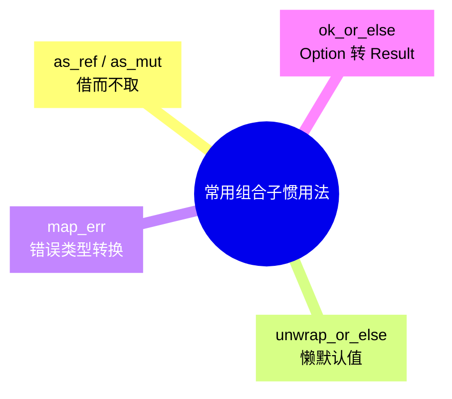
```mermaid
mindmap
  root((常用组合子惯用法))
    as_ref[as_ref / as_mut<br/>借而不取]
    unwrap_or_else[unwrap_or_else<br/>懒默认值]
    map_err[map_err<br/>错误类型转换]
    ok_or_else[ok_or_else<br/>Option 转 Result]
```

---

## 六、L3 资源级惯用法

L3 资源级惯用法处理「获取-使用-释放」的完整周期，四个代表项构成资源安全的标准工具箱：

- **RAII 包装**：任何「获取后必须释放」的资源（文件、锁、临时目录、`Box::into_raw` 的裸指针）都应包进「构造函数获取 + `Drop` 释放」的类型——惯用的信号是「使用者看不到释放代码」。反模式是「文档要求调用方记得调 `close()`」。
- **`Drop` 的正确实现**：`drop` 中只做「释放」，不做可能 panic 的业务逻辑（panic-in-drop 叠加外层 panic = abort）；需要错误返回的清理用显式 `close(self) -> Result<()>` 方法（消费 self 保证只能调一次），`Drop` 中做 best-effort 兜底。
- **守卫（guard）模式**：`MutexGuard`/`RefMut` 的「返回值即权限，drop 即归还」——资源权限与值的生命周期（Lifetimes）绑定，是 L3 最优雅的形态；自研资源（连接池租约、临时文件）应复刻此模式。
- **内部可变性容器**：`Cell`/`RefCell` 的资源版用法——把「运行时可变」限制在类型内部，对外暴露不可变接口。

L3 与 L2 的分界：L2 管「接口形状」，L3 管「接口背后的资源生命周期」——一个 API 可以 L2 满分但 L3 泄漏（如返回裸指针要求调用方释放）。

### 6.1 RAII 资源管理

> 来源: [Rust Reference §10.8](https://doc.rust-lang.org/reference/introduction.html) RAII 守卫模式 · [Rustonomicon — RAII](https://doc.rust-lang.org/nomicon/raii.html)
> **惯用**: 将资源获取与释放绑定到值的生命周期（Lifetimes），利用 `Drop` 自动清理。

本节内容已在权威页详细展开，请参阅：

> **权威来源**: [`concept/06_ecosystem/03_design_patterns/34_ownership_as_resource_management.md`](34_ownership_as_resource_management.md)
>
> 该页覆盖 RAII 工程实践、Drop order、并发 RAII、跨语言对比（Go/Zig/D）及测试策略。

### 6.2 作用域守卫与延迟清理

> 来源: [scopeguard crate docs](https://docs.rs/scopeguard/latest/scopeguard/) · [Rustonomicon — RAII Guards](https://doc.rust-lang.org/nomicon/raii.html)
> **惯用**: 用 `scopeguard` crate 或自定义守卫，保证「无论是否 panic，退出时执行某操作」。

本节内容已在权威页详细展开，请参阅：

> **权威来源**: [`concept/06_ecosystem/03_design_patterns/35_scope_guard_and_deferred_cleanup.md`](35_scope_guard_and_deferred_cleanup.md)
>
> 该页覆盖 `defer!` 宏、`ScopeGuard::with_strategy`、手写 std-only guard、与 RAII/`?` 的集成及反例。

### 6.3 Pin 不动性

> 来源: [RFC 2349](https://rust-lang.github.io/rfcs/2349-pin.html) Pin 不动性契约
> **惯用**: 对自引用（Reference）结构和异步（Async） Future 使用 `Pin<&mut T>`，保证内存位置稳定。

```rust
// 惯用：Pin 保证自引用结构安全
use std::pin::Pin;
use std::marker::PhantomPinned;

struct SelfReferential {
    data: String,
    ptr: *const String, // 指向 data
    _pin: PhantomPinned,
}

impl SelfReferential {
    fn new(data: String) -> Pin<Box<Self>> {
        let mut boxed = Box::pin(Self {
            data,
            ptr: std::ptr::null(),
            _pin: PhantomPinned,
        });
        let ptr = &boxed.data as *const String;
        unsafe { boxed.as_mut().get_unchecked_mut().ptr = ptr; }
        boxed
    }
}
```

### 6.4 内部可变性分层

> 来源: [Rustonomicon §7, Rust std docs](https://doc.rust-lang.org/nomicon/index.html) 内部可变性分层
> **惯用**: 根据场景选择适当的内部可变性原语，形成安全梯度。

| 原语 | 线程安全 | 运行时（Runtime）检查 | 适用场景 |
|:---|:---:|:---:|:---|
| `UnsafeCell<T>` | 否 | 无 | `unsafe` 内部实现 |
| `Cell<T>` | 否 | 无（`T: Copy`） | 单线程内部修改 |
| `RefCell<T>` | 否 | 是（borrow 计数） | 单线程动态借用（Borrowing） |
| `Mutex<T>` | 是 | 是（OS 锁） | 多线程独占访问 |
| `RwLock<T>` | 是 | 是（OS 锁） | 多线程多读单写 |
| `AtomicT` | 是 | 无（硬件指令） | 简单类型的无锁操作 |

### 6.5 ManuallyDrop

> 来源: [Rustonomicon §4.5](https://doc.rust-lang.org/nomicon/perf-profiling.html) · [std::mem::ManuallyDrop](https://doc.rust-lang.org/std/mem/struct.ManuallyDrop.html) ManuallyDrop：显式控制析构
> **惯用**: 当需要手动决定资源释放时机、抑制默认 `Drop` 或实现自定义释放协议时，使用 `ManuallyDrop<T>` 包装值。

```rust,ignore
use std::mem::ManuallyDrop;
use std::alloc::{alloc, dealloc, Layout};

// 惯用：自定义分配器封装中显式控制内存释放
struct RawBuffer {
    ptr: *mut u8,
    layout: Layout,
}

impl RawBuffer {
    fn new(size: usize) -> Option<Self> {
        let layout = Layout::array::<u8>(size).ok()?;
        let ptr = unsafe { alloc(layout) };
        if ptr.is_null() {
            return None;
        }
        Some(Self { ptr, layout })
    }

    fn dispose(self) {
        // ManuallyDrop 阻止自动 Drop，让我们按自定义协议释放
        let mut this = ManuallyDrop::new(self);
        unsafe { dealloc(this.ptr, this.layout) };
    }
}
```

**等价性**: `ManuallyDrop<T>` 与 `T` 同布局，仅在元层面抑制 `Drop` 调用的自动注入；不引入运行时开销。它与 `mem::forget` 的区别在于保留了值的所有权，可在之后手动析构。

### 6.6 所有权移动惯用法

**所有权移动惯用法：`move`、`mem::take/replace`、`Option::take`**

> **EN**: Ownership Transfer Idioms: `move`, `mem::take`, and `mem::replace`
> **Summary**: Move values outright or swap them with a default/trivial value to take ownership while leaving a valid placeholder behind.

> 来源: [Rust std — `std::mem::take`](https://doc.rust-lang.org/std/mem/fn.take.html) · [Rust Reference — Ownership](https://doc.rust-lang.org/reference/ownership.html)

**概念与属性**

- `move`：闭包按值捕获变量，常用于把所有权转移到新任务或异步上下文。
- `std::mem::take(&mut T)`：要求 `T: Default`，取走当前值并留下默认值。
- `std::mem::replace(&mut T, new)`：取走当前值并留下指定的 `new`。
- `Option::take(&mut self)`：取走 `Some(x)` 并留下 `None`。

这些惯用法的共同特征：**在不复制数据的情况下转移所有权，同时保证原位置仍处于合法状态**。

**与其他惯用法的关系**：它们是 RAII 与所有权系统的「微调螺丝」，常用于状态机转换、Builder 消费、`Option` 字段的临时提取。

**正例**：

```rust
#[derive(Debug, Default, PartialEq)]
enum State { #[default] Idle, Running(String) }

fn transition(state: &mut State) -> State {
    // 取走旧状态，留下 Idle，无需克隆。
    std::mem::replace(state, State::Idle)
}

fn take_option(opt: &mut Option<String>) -> Option<String> {
    opt.take()
}

fn main() {
    let mut s = State::Running("db".into());
    let old = transition(&mut s);
    println!("old={:?}, now={:?}", old, s);
    assert_eq!(s, State::Idle);

    let mut o = Some("x".to_string());
    assert_eq!(take_option(&mut o), Some("x".to_string()));
    assert_eq!(o, None);
}
```

**反例/陷阱**：

```rust,ignore
#[derive(Clone, Default)]
struct Session { id: u64, data: String }

fn bad(session: &mut Session) -> Session {
    let cloned = session.clone(); // 不必要的完整克隆
    *session = Session::default();
    cloned
}
```

**思维导图**：

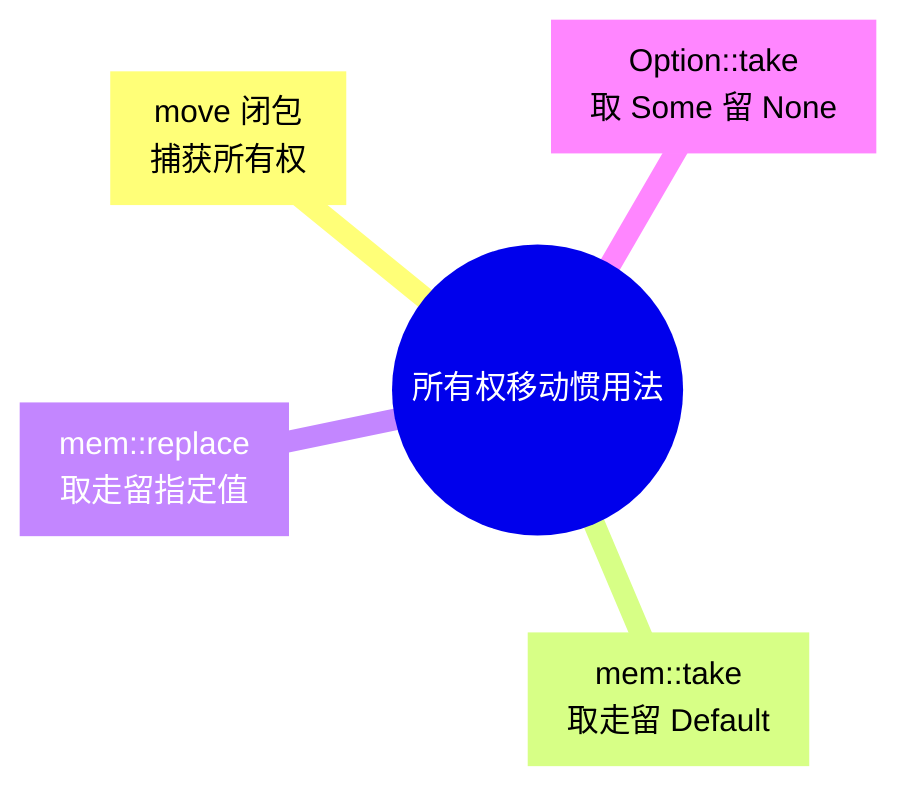
```mermaid
mindmap
  root((所有权移动惯用法))
    move[move 闭包<br/>捕获所有权]
    take[mem::take<br/>取走留 Default]
    replace[mem::replace<br/>取走留指定值]
    option_take[Option::take<br/>取 Some 留 None]
```

**决策树**：

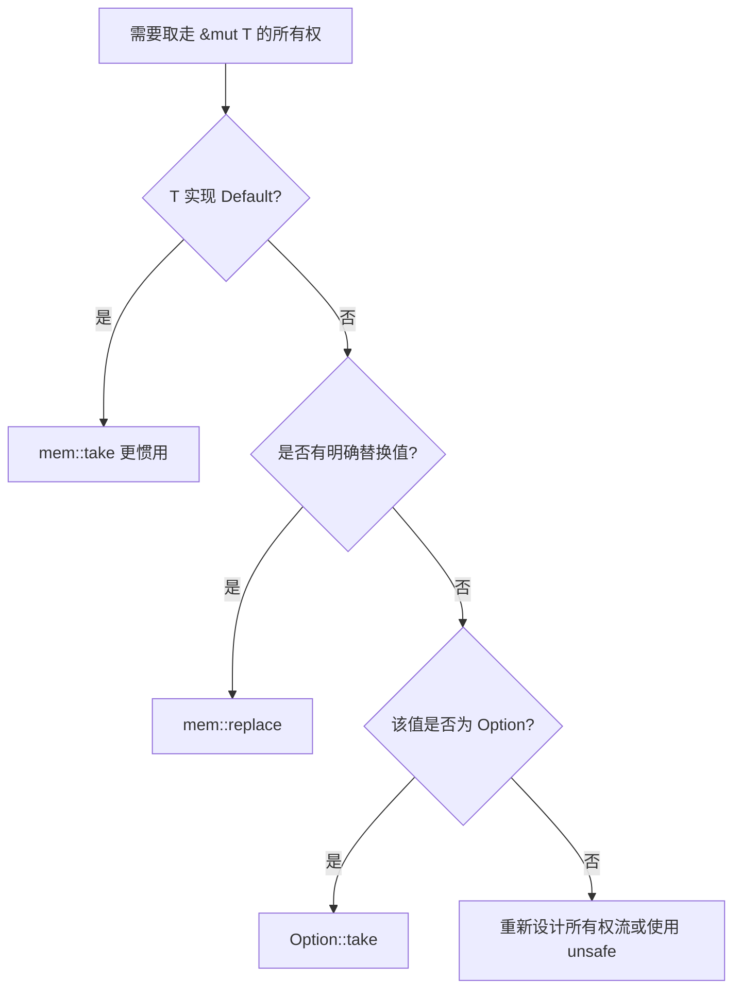
```mermaid
graph TD
    A[需要取走 &mut T 的所有权] --> B{T 实现 Default?}
    B -->|是| C[mem::take 更惯用]
    B -->|否| D{是否有明确替换值?}
    D -->|是| E[mem::replace]
    D -->|否| F{该值是否为 Option?}
    F -->|是| G[Option::take]
    F -->|否| H[重新设计所有权流或使用 unsafe]
```

### 6.7 MaybeUninit

**`MaybeUninit<T>`：延迟初始化与数组安全构造**

> **EN**: Delayed Initialization with `MaybeUninit<T>`
> **Summary**: `MaybeUninit<T>` reserves memory for `T` without requiring immediate initialization, enabling safe incremental array construction before assuming initialization.

> 来源: [Rustonomicon — `MaybeUninit`](https://doc.rust-lang.org/nomicon/vec-maybe-uninit.html) · [Rust std — `MaybeUninit`](https://doc.rust-lang.org/std/mem/union.MaybeUninit.html)

**概念与属性**

- `MaybeUninit<T>` 是一块**可能未初始化**的 `T` 大小内存，不会自动调用 `T` 的 `Drop`。
- `write(&mut self, val)` 显式初始化。
- `assume_init()` 断言已初始化，之后由调用者负责管理生命周期。
- 与 `ManuallyDrop<T>` 组合可避免在「尚未确认是否初始化」时触发未定义行为。

**与其他惯用法的关系**：它是 `ManuallyDrop` 与原始内存管理的中间层，常用于自定义集合、数组批量初始化、FFI 接收缓冲区。

**正例**：

```rust
use std::mem::{self, MaybeUninit};

fn fill_array() -> [String; 3] {
    let mut arr: [MaybeUninit<String>; 3] = unsafe {
        // SAFETY: MaybeUninit<T> 允许未初始化。
        MaybeUninit::uninit().assume_init()
    };
    for i in 0..3 {
        arr[i].write(format!("item{}", i));
    }
    // SAFETY: 数组每个元素都已被初始化。
    unsafe { mem::transmute_copy(&mut arr) }
}

fn main() {
    let arr = fill_array();
    for s in &arr { println!("{}", s); }
}
```

**反例/陷阱**：

```rust,ignore
use std::mem::MaybeUninit;

unsafe {
    let x: MaybeUninit<String> = MaybeUninit::uninit();
    // UB：未初始化内存被当作已初始化的 String 析构。
    let _s = x.assume_init();
}
```

**与 `ManuallyDrop` 组合**：

```rust,ignore
use std::mem::{ManuallyDrop, MaybeUninit};

// 在不确定是否已初始化时，用 ManuallyDrop 包装，
// 避免 assume_init 之前 drop 未初始化的值。
let slot: MaybeUninit<ManuallyDrop<String>> = MaybeUninit::uninit();
```

**思维导图**：

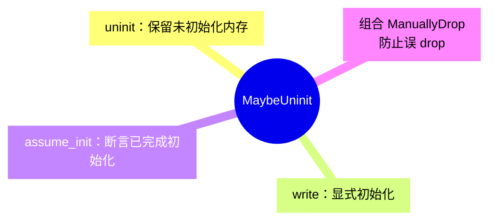
```mermaid
mindmap
  root((MaybeUninit<T>))
    uninit[uninit：保留未初始化内存]
    write[write：显式初始化]
    assume_init[assume_init：断言已完成初始化]
    ManuallyDrop[组合 ManuallyDrop<br/>防止误 drop]
```

**决策树**：

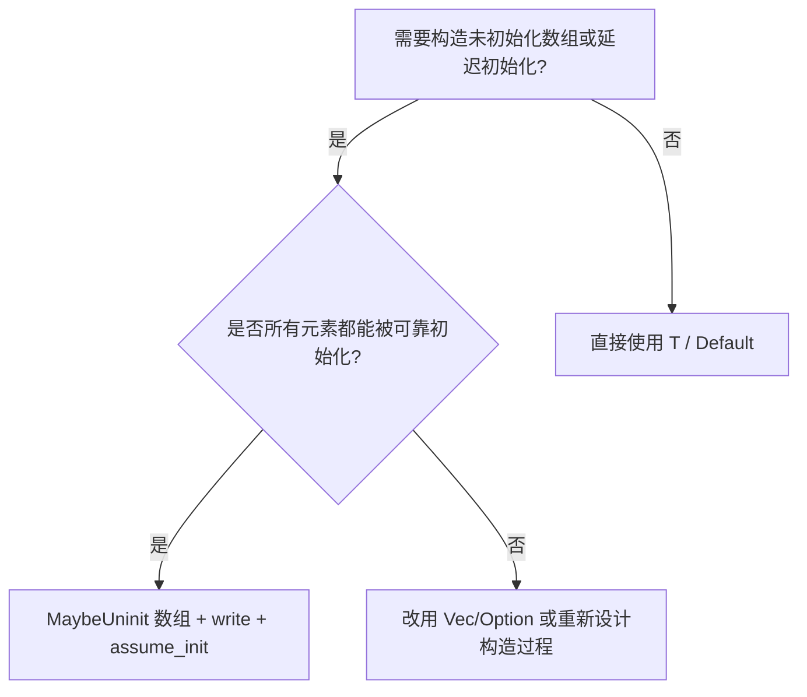
```mermaid
graph TD
    A[需要构造未初始化数组或延迟初始化?] -->|是| B{是否所有元素都能被可靠初始化?}
    B -->|是| C[MaybeUninit<T> 数组 + write + assume_init]
    B -->|否| D[改用 Vec/Option 或重新设计构造过程]
    A -->|否| E[直接使用 T / Default]
```

### 6.8 unsafe 边界

**unsafe 惯用法边界：raw pointer、`transmute` 与 SAFETY 注释**

> **EN**: Unsafe Idiom Boundaries: Raw Pointers, `transmute`, and SAFETY Comments
> **Summary**: Unsafe Rust relies on explicit contracts—alignment, lifetime, and aliasing for raw pointers; invariants for `transmute`; and mandatory SAFETY comments documenting why each `unsafe` block is sound.

> 来源: [Rustonomicon](https://doc.rust-lang.org/nomicon/index.html) · [Rust Reference — Unsafe Rust](https://doc.rust-lang.org/reference/unsafe-blocks.html) · [Rust std — `std::ptr`](https://doc.rust-lang.org/std/ptr/index.html)

**概念与属性**

原始指针 `*const T` / `*mut T` 的契约：

- **对齐**：指针必须按 `T` 的对齐要求对齐。
- **生命周期**：解引用得到的引用的生命周期由调用者保证，编译器不检查。
- **别名**：同时存在重叠的可变与不可变引用或写入违反 stacked borrows/aliasing 模型。

`std::mem::transmute` 的契约：

- 源类型与目标类型**大小必须相同**。
- 转换后的位模式必须**语义合法**（如不能把任意 `u32` 当作 `bool`）。
- 优先使用 safe 转换：`as`/`try_into`/`From`/`Into`。

SAFETY 注释规范：每个 `unsafe { ... }` 块前必须解释「为什么这段代码满足 unsafe 前提」；封装 safe API 时，文档应写明调用者需要保证的不变式。

**与其他惯用法的关系**：unsafe 是其他安全抽象的「地基」；所有高层惯用法在 `unsafe`/transmute 面前都可能失效（见定理一致性矩阵的失效条件）。

**正例**：

```rust
use std::slice;

/// SAFETY: `ptr` must be non-null, properly aligned, and point to `len` valid `i32`s.
unsafe fn as_i32_slice<'a>(ptr: *const i32, len: usize) -> &'a [i32] {
    // SAFETY: caller guarantees a valid aligned slice of `len` elements.
    unsafe { slice::from_raw_parts(ptr, len) }
}

fn main() {
    let data = [1, 2, 3];
    let s = unsafe { as_i32_slice(data.as_ptr(), data.len()) };
    println!("{:?}", s);
}
```

**反例/陷阱**：

```rust,ignore
use std::mem;

let f: f32 = 1.0;
// 大小相同但语义完全错误：f32 的位模式不是合法的 bool。
let b: bool = unsafe { mem::transmute(f) };
```

**思维导图**：

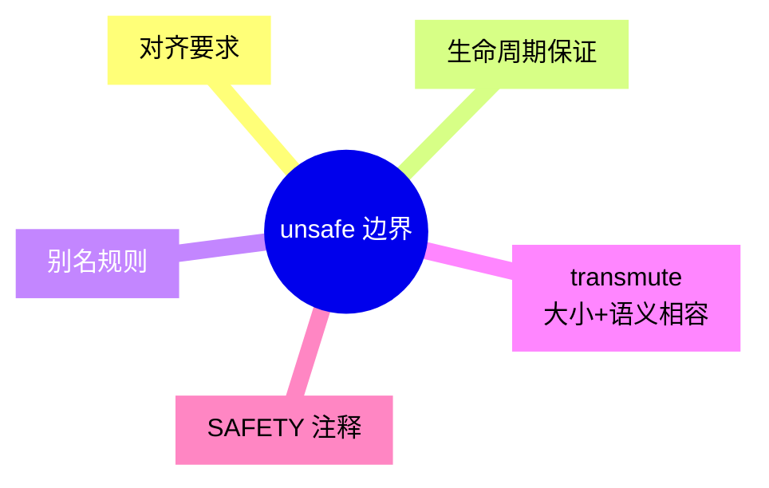
```mermaid
mindmap
  root((unsafe 边界))
    align[对齐要求]
    lifetime[生命周期保证]
    alias[别名规则]
    transmute[transmute<br/>大小+语义相容]
    safety_comment[SAFETY 注释]
```

**决策树**：

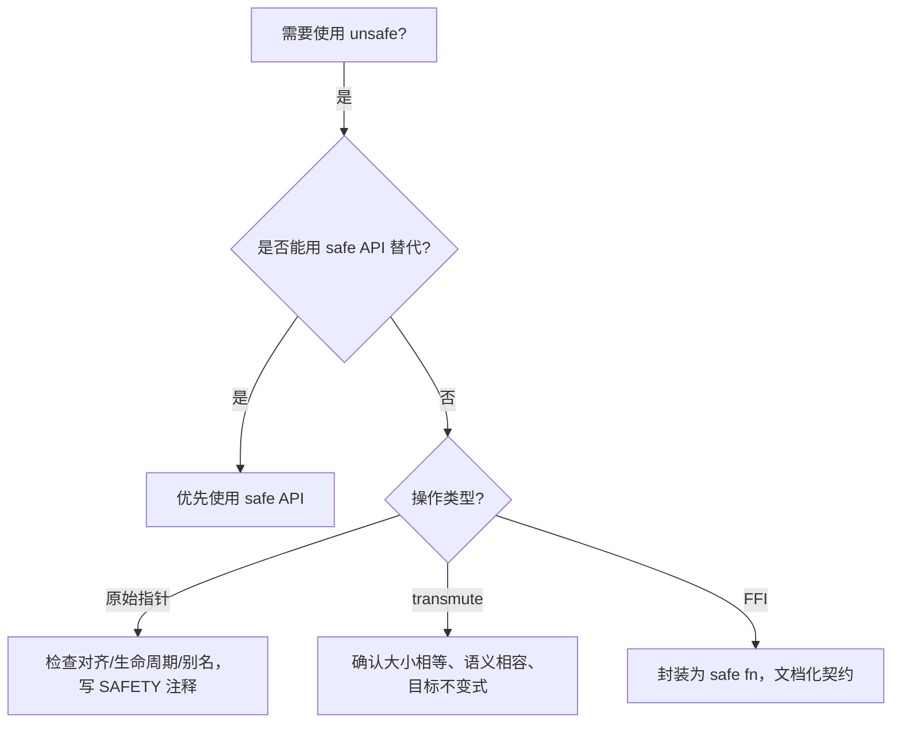
```mermaid
graph TD
    A[需要使用 unsafe?] -->|是| B{是否能用 safe API 替代?}
    B -->|是| C[优先使用 safe API]
    B -->|否| D{操作类型?}
    D -->|原始指针| E[检查对齐/生命周期/别名，写 SAFETY 注释]
    D -->|transmute| F[确认大小相等、语义相容、目标不变式]
    D -->|FFI| G[封装为 safe fn，文档化契约]
```

---

## 七、L4 控制级惯用法

L4 控制级惯用法处理错误与可选性的传播链：

1. **`?` 传播**：函数返回 `Result`，错误沿调用链自动上抛，替代 `match` 金字塔；配合 `thiserror` 定义错误枚举（Enum）保持上下文。
2. **`let-else` 早退**：`let Some(x) = opt else { return };` 把「正常路径左对齐」，卫语句风格替代嵌套。
3. **`match` 穷尽性**：以 `enum` 建模状态空间，`match` 无通配臂（`_`）时编译器保证新增变体后所有处理点被审计——重构安全的基石。
4. **`Option` 组合子**：`map`/`and_then`/`unwrap_or_else` 链式处理，避免 `if let` 嵌套；但超过 3 层的组合子链应拆为命名步骤。

判定依据：函数体出现 3 层以上缩进 → 用 let-else/组合子重构；错误吞掉（`let _ = ...`）→ 必须注释理由。

### 7.1 Iterator 消费链

> [Rust Iterator docs, LLVM 优化指南](https://doc.rust-lang.org/std/iter/trait.Iterator.html) Iterator 消费链
> **惯用**: 用 Iterator 的懒性求值链替代命令式循环，利用 LLVM 优化生成高效代码。

```rust,ignore
let numbers = vec![1, 2, 3, 4, 5, 6];

// 惯用：Iterator 消费链（零成本抽象）
let max_even: Option<i32> = numbers
    .iter()
    .filter(|&&n| n % 2 == 0)
    .map(|n| n * 2)
    .max();

// 编译器可优化为等效的循环（甚至向量化）
// 实际性能与手写循环等价或更优
```

### 7.2 递归 → 循环

> 来源: [The Rust Performance Book](https://nnethercote.github.io/perf-book/) 递归 → 循环变换
> **惯用**: 当递归深度不可预测时，用显式栈或 `loop` 替代递归，避免栈溢出。

```rust
// 非惯用：深度递归（可能栈溢出）
fn sum_recursive(nums: &[i32]) -> i32 {
    match nums.first() {
        Some(&first) => first + sum_recursive(&nums[1..]),
        None => 0,
    }
}

// 惯用：尾递归优化或显式循环
fn sum_iterative(nums: &[i32]) -> i32 {
    let mut sum = 0;
    for &n in nums { sum += n; }
    sum
}

// 或使用 fold（函数式惯用）
fn sum_fold(nums: &[i32]) -> i32 {
    nums.iter().fold(0, |acc, &n| acc + n)
}
```

### 7.3 早期返回与守卫子句

> [Rust Style Guide](https://doc.rust-lang.org/style-guide/index.html) 早期返回与守卫子句
> **惯用**: 用早期返回减少嵌套层级，用守卫子句（guard clause）快速排除非法输入。

```rust,ignore
#[derive(Debug)]
enum Error { EmptyInput, TooShort, Checksum }
struct Output;
fn validate_checksum(_data: &[u8]) -> bool { true }
fn parse(_data: &[u8]) -> Output { Output }

// 惯用：早期返回 + 守卫子句
fn process(data: Option<&[u8]>) -> Result<Output, Error> {
    let data = data.ok_or(Error::EmptyInput)?;        // 守卫 1
    if data.len() < 4 { return Err(Error::TooShort); } // 守卫 2
    if !validate_checksum(data) { return Err(Error::Checksum); } // 守卫 3

    // 主逻辑（无嵌套）
    Ok(parse(data))
}

// 非惯用：深层嵌套（箭头代码）
// fn process(data: Option<&[u8]>) -> Result<Output, Error> {
//     if let Some(data) = data {
//         if data.len() >= 4 {
//             if validate_checksum(data) {
//                 Ok(parse(data))
//             } else { Err(Error::Checksum) }
//         } else { Err(Error::TooShort) }
//     } else { Err(Error::EmptyInput) }
// }
```

### 7.4 `collect` 与 Turbofish

> [Rust docs, collect 方法](https://doc.rust-lang.org/std/iter/trait.Iterator.html#method.collect) `collect` 与 Turbofish
> **惯用**: 用 `collect::<Vec<_>>()`（turbofish）显式指定目标类型，或利用类型推断（Type Inference）让编译器推断。

```rust
// 惯用：turbofish 显式收集类型
let squares: Vec<i32> = (0..10).map(|n| n * n).collect();

// 或利用类型推断（变量类型已指定）
let squares = (0..10).map(|n| n * n).collect::<Vec<i32>>();
```

### 7.5 错误处理全谱

**错误处理惯用法全谱：从 `ok_or` 到 `thiserror`/`anyhow`**

> **EN**: Error-Handling Idiom Spectrum: `ok_or`, `map_err`, Custom Errors, and `thiserror` vs `anyhow`
> **Summary**: Rust error handling spans lightweight conversions with `ok_or`/`map_err`, typed library errors built with `thiserror`, and ergonomic application errors aggregated by `anyhow`.

> 来源: [Rust API Guidelines — Errors](https://rust-lang.github.io/api-guidelines/interoperability.html#c-good-err) · [thiserror docs](https://docs.rs/thiserror/latest/thiserror/) · [anyhow docs](https://docs.rs/anyhow/latest/anyhow/)

**概念与属性**

- `Option::ok_or` / `Option::ok_or_else`：把 `Option` 转成 `Result`；优先使用 `ok_or_else` 避免在 `Some` 时构造错误。
- `Result::map_err`：转换错误类型或添加上下文。
- 自定义 `Error`：库对外暴露可 `match` 的强类型错误。
- `thiserror`：为库自动实现 `Error`/`Display`/`From`。
- `anyhow`：为应用提供简洁的上下文传播与 `?`。

**选型矩阵**：

| 场景 | 推荐方案 | 原因 |
|:---|:---|:---|
| 库（library）公共 API | 自定义枚举 + `thiserror` | 调用方需要区分错误种类 |
| 应用（application/bin） | `anyhow` / `eyre` | 快速添加上下文、向上传播 |
| 脚本/原型 | `Box<dyn std::error::Error>` / `String` | 快速验证 |
| `Option` → `Result` | `ok_or_else` | 懒构造错误值 |
| 错误类型不匹配 | `map_err` | 转换并保留因果链 |

**与其他惯用法的关系**：错误处理是 L4 控制级惯用法的核心，与 `?` 传播、`let-else` 早退、`Iterator` 的 `try_fold` 等形成完整的控制流工具链。

**正例**：

```rust
use std::fmt;

#[derive(Debug)]
struct ConfigError { key: String }

impl fmt::Display for ConfigError {
    fn fmt(&self, f: &mut fmt::Formatter<'_>) -> fmt::Result {
        write!(f, "invalid config key: {}", self.key)
    }
}

impl std::error::Error for ConfigError {}

fn port_from_env() -> Result<u16, ConfigError> {
    std::env::var("PORT")
        .map_err(|_| ConfigError { key: "PORT".into() })?
        .parse()
        .map_err(|_| ConfigError { key: "PORT".into() })
}

#[derive(Debug)]
struct User;
fn find_user(_id: u64) -> Option<User> { None }

fn user_or_not_found(id: u64) -> Result<User, &'static str> {
    find_user(id).ok_or_else(|| "user not found")
}

fn main() {
    // SAFETY: single-threaded test process, no concurrent readers of this env var.
    unsafe { std::env::set_var("PORT", "8080"); }
    println!("{:?}", port_from_env());
    println!("{:?}", user_or_not_found(1));
}
```

**反例/陷阱**：

```rust,ignore
fn bad(opt: Option<i32>) -> Result<i32, String> {
    // 陷阱：即使 opt 是 Some，也会分配字符串。
    opt.ok_or(format!("expensive error: {}", 42))
}
```

**思维导图**：

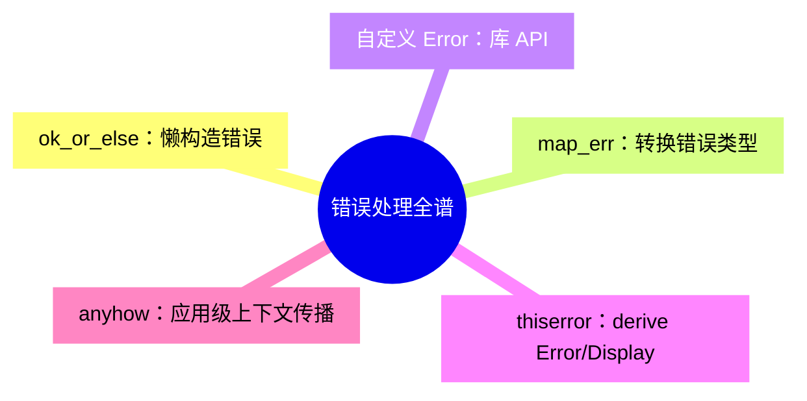
```mermaid
mindmap
  root((错误处理全谱))
    ok_or_else[ok_or_else：懒构造错误]
    map_err[map_err：转换错误类型]
    custom_error[自定义 Error：库 API]
    thiserror[thiserror：derive Error/Display]
    anyhow[anyhow：应用级上下文传播]
```

**决策树**：

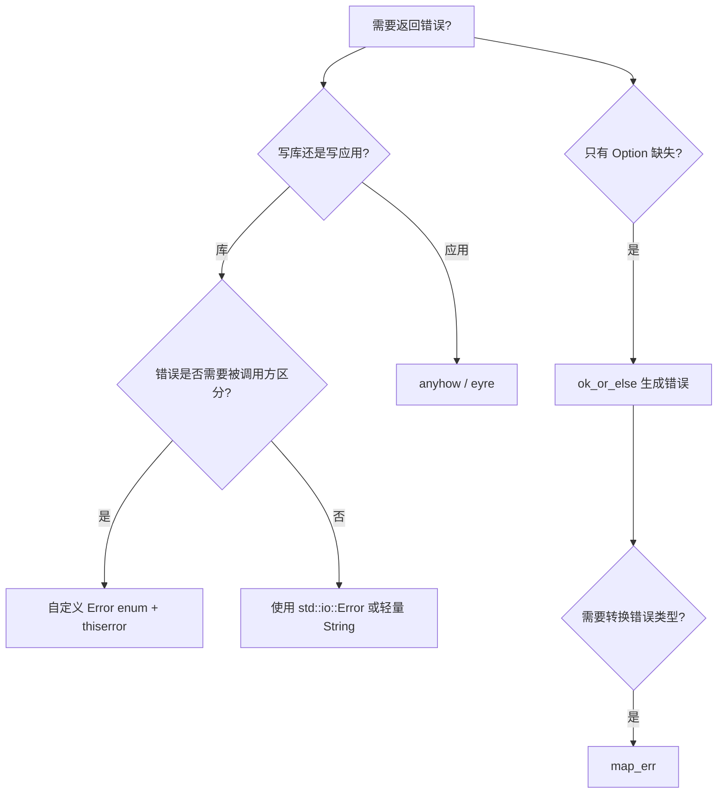
```mermaid
graph TD
    A[需要返回错误?] --> B{写库还是写应用?}
    B -->|库| C{错误是否需要被调用方区分?}
    C -->|是| D[自定义 Error enum + thiserror]
    C -->|否| E[使用 std::io::Error 或轻量 String]
    B -->|应用| F[anyhow / eyre]
    A --> G{只有 Option 缺失?}
    G -->|是| H[ok_or_else 生成错误]
    H --> I{需要转换错误类型?}
    I -->|是| J[map_err]
```

### 7.6 Iterator 高级适配器

**Iterator 高级适配器：`try_fold`、`peekable`、`fuse`、`cycle`**

> **EN**: Advanced Iterator Adapters: `try_fold`, `peekable`, `fuse`, and `cycle`
> **Summary**: Specialized iterator adapters let you short-circuit on error with `try_fold`, inspect the next item without consuming it, handle fused iterators, and repeat sequences indefinitely.

> 来源: [Rust std — `Iterator`](https://doc.rust-lang.org/std/iter/trait.Iterator.html) · [Rust API Guidelines](https://rust-lang.github.io/api-guidelines/)

**概念与属性**

- `try_fold`：带累加器的遍历，遇到 `Err` 立即短路。
- `peekable`：允许「lookahead」而不消耗元素。
- `fuse`：把迭代器包装为「首次返回 `None` 后永远返回 `None`」的语义。
- `cycle`：无限重复底层序列，常用于轮询或回环测试。

**与其他惯用法的关系**：它们是 L4 控制级「Iterator 链」的延伸，与函数式组合子、`?` 传播共同构成惰性控制流。

**正例**：

```rust
fn sum_until_negative(nums: &[i32]) -> Result<i32, &'static str> {
    nums.iter().try_fold(0, |acc, &n| {
        if n < 0 { Err("negative encountered") } else { Ok(acc + n) }
    })
}

fn skip_duplicates<I: Iterator<Item=i32>>(iter: I) -> impl Iterator<Item=i32> {
    let mut peek = iter.peekable();
    std::iter::from_fn(move || {
        let cur = peek.next()?;
        while peek.peek() == Some(&cur) {
            peek.next();
        }
        Some(cur)
    })
}

fn main() {
    assert_eq!(sum_until_negative(&[1, 2, 3]), Ok(6));
    assert_eq!(sum_until_negative(&[1, -1, 3]).unwrap_err(), "negative encountered");

    let v: Vec<_> = skip_duplicates([1, 1, 2, 2, 3].into_iter()).collect();
    assert_eq!(v, vec![1, 2, 3]);
}
```

**反例/陷阱**：

```rust,ignore
// 陷阱：在无限 cycle 上调用 collect 会导致程序挂起。
let v = [1, 2].iter().cycle().collect::<Vec<_>>();
```

**思维导图**：

```mermaid
mindmap
  root((Iterator 高级适配器))
    try_fold[try_fold<br/>错误短路累加]
    peekable[peekable<br/>预读不消费]
    fuse[fuse<br/>None 后恒定 None]
    cycle[cycle<br/>无限循环序列]
```

**决策树**：

```mermaid
graph TD
    A[需要遍历并聚合结果] --> B{聚合可能提前失败?}
    B -->|是| C[try_fold / try_for_each]
    B -->|否| D[fold / reduce]
    A --> E{需要预读下一项?}
    E -->|是| F[peekable]
    A --> G{需要无限重复序列?}
    G -->|是| H[cycle]
    G -->|否| I{迭代器可能不规范地在 None 后返回 Some?}
    I -->|是| J[fuse]
```

### 7.7 `try_fold` 错误短路累加

> **EN**: Short-Circuit Aggregation with `try_fold`
> **Summary**: Use `Iterator::try_fold` to traverse a sequence while accumulating a result and stopping immediately on the first `Err` or `None`.

> 来源: [Rust std — `Iterator::try_fold`](https://doc.rust-lang.org/std/iter/trait.Iterator.html#method.try_fold) · [Rust API Guidelines](https://rust-lang.github.io/api-guidelines/)

**概念与属性**

`try_fold` 是 `fold` 的容错版本：

- 接收初始累加器和闭包 `FnMut(Acc, Item) -> Result<Acc, E>` 或 `Option<Acc>`。
- 每次迭代尝试更新累加器；一旦闭包返回 `Err`/`None`，整个遍历立即短路返回。
- 与 `?` 传播配合极佳：可在闭包内部调用可能失败的子操作。

**正例**：

```rust
fn parse_and_sum(numbers: &[&str]) -> Result<i32, std::num::ParseIntError> {
    numbers
        .iter()
        .try_fold(0, |acc, s| {
            let n = s.parse::<i32>()?; // 失败立即短路
            Ok(acc + n)
        })
}

fn main() {
    assert_eq!(parse_and_sum(&["1", "2", "3"]).unwrap(), 6);
    assert!(parse_and_sum(&["1", "x", "3"]).is_err());
}
```

**反例/陷阱**：

```rust,ignore
// 非惯用：手写循环 + 提前返回，丢失了 Iterator 的惰性组合能力
fn parse_and_sum_manual(numbers: &[&str]) -> Result<i32, std::num::ParseIntError> {
    let mut sum = 0;
    for s in numbers {
        sum += s.parse::<i32>()?;
    }
    Ok(sum)
}
```

**思维导图**：

```mermaid
mindmap
  root((try_fold))
    fold[fold：无条件累加]
    try_fold[try_fold：遇 Err/None 短路]
    try_for_each[try_for_each：仅副作用]
    question_mark[闭包内可用 ?]
```

### 7.8 算法惯用法

> **EN**: Algorithm Idioms
> **Summary**: Express common algorithmic patterns—sorting, grouping, windowing, memoization, and two-pointer scans—using the standard library and ownership-aware data structures.

> 来源: [Rust Standard Library — Iterator](https://doc.rust-lang.org/std/iter/trait.Iterator.html) · [Rust Algorithm Club](https://rust-algo.club/) · [The Rust Performance Book](https://nnethercote.github.io/perf-book/)

**概念与属性**

Rust 的算法惯用法强调：

- **优先使用标准库**：`sort`、`binary_search`、`chunks`、`windows`、`dedup` 等已优化实现。
- **迭代器表达算法**：filter/map/fold/scan 组合子通常比手写循环更短且同样高效。
- **所有权感知**：利用 `Vec`、`HashMap`、`BTreeMap` 等的 move/borrow 语义避免不必要的克隆。
- **Memoization 与 DP**：用 `Vec` 或 `HashMap` 缓存子问题结果，状态转移用纯函数表达。

**正例**：

```rust
use std::collections::HashMap;

// 惯用：分组计数
fn frequency(nums: &[i32]) -> HashMap<i32, usize> {
    nums.iter().fold(HashMap::new(), |mut acc, &n| {
        *acc.entry(n).or_insert(0) += 1;
        acc
    })
}

// 惯用：滑动窗口
fn max_sum_window(nums: &[i32], k: usize) -> Option<i32> {
    if k == 0 || nums.len() < k { return None; }
    let mut window: i32 = nums[..k].iter().sum();
    let mut best = window;
    for i in k..nums.len() {
        window += nums[i] - nums[i - k];
        best = best.max(window);
    }
    Some(best)
}

// 惯用：记忆化斐波那契
fn fib(n: usize, memo: &mut [Option<u64>]) -> u64 {
    if let Some(v) = memo[n] { return v; }
    let v = match n {
        0 => 0,
        1 => 1,
        _ => fib(n - 1, memo) + fib(n - 2, memo),
    };
    memo[n] = Some(v);
    v
}

fn main() {
    assert_eq!(frequency(&[1, 2, 2, 3, 2]).get(&2), Some(&3));
    assert_eq!(max_sum_window(&[1, 2, 3, 4, 5], 2), Some(9));
    let mut memo = vec![None; 20];
    assert_eq!(fib(10, &mut memo), 55);
}
```

**反例/陷阱**：

```rust,ignore
// 非惯用：递归无 memo，指数级复杂度
fn fib_naive(n: u64) -> u64 {
    match n {
        0 => 0,
        1 => 1,
        _ => fib_naive(n - 1) + fib_naive(n - 2),
    }
}
```

**思维导图**：

```mermaid
mindmap
  root((算法惯用法))
    frequency[HashMap 计数]
    window[滑动窗口]
    memo[记忆化 / DP]
    twopointer[双指针]
    sort[std 排序与二分]
```

> **扩展阅读**: 经典数据结构（并查集、线段树、Fenwick 树）的 Rust 所有权感知实现见 [`concept/06_ecosystem/16_algorithm_patterns/02_ownership_aware_data_structures.md`](../16_algorithm_patterns/02_ownership_aware_data_structures.md)；图算法（BFS/DFS/Dijkstra/Bellman-Ford）的借用纪律与并行 frontier 见 [`03_graph_algorithms_in_rust.md`](../16_algorithm_patterns/03_graph_algorithms_in_rust.md)；缓存友好与 SIMD 优化见 [`04_cache_friendly_and_simd_algorithms.md`](../16_algorithm_patterns/04_cache_friendly_and_simd_algorithms.md)。

### 7.9 错误处理惯用法：`Result` 类型设计与 `?` 传播

> **EN**: Error-Handling Idioms: `Result` Type Design and `?` Propagation
> **Summary**: Align Rust API Guidelines and Rust Design Patterns for designing library errors (`std::error::Error`, causal chains) and idiomatic propagation with `?`, `From`, and `Result` aliases.

> 来源: [Rust API Guidelines — Errors](https://rust-lang.github.io/api-guidelines/interoperability.html#c-good-err) · [Rust Design Patterns — Error Handling](https://rust-unofficial.github.io/patterns/idioms/error-handling.html) · [TRPL §9](https://doc.rust-lang.org/book/ch09-00-error-handling.html)
> **权威来源**: 本小节为 `concept/` 权威页 `02_idioms_spectrum.md` 的组成部分。

**概念与属性**

与 [7.5 节「错误处理全谱」](#75-错误处理全谱) 关注组合子分层不同，本节聚焦**面向 API 设计的错误类型契约**：

- 库的错误类型必须实现 `std::error::Error`（C-ERROR），以便调用方通过 `Error::source()` 遍历因果链。
- 实现 `Display` 面向终端用户，`Debug` 面向程序员；二者语义分离。
- 为 `Result<T, MyError>` 定义类型别名，减少重复、统一传播。
- 利用 `From` + `?` 把底层错误向上转换；必要时用 `map_err` 添加领域上下文，但不应丢失原始错误。
- 绝不 panic 在输入校验、IO、解析等可恢复失败场景。

**选型矩阵**：

| 场景 | 错误类型 | 关键 trait / 工具 | 理由 |
|:---|:---|:---|:---|
| 库公共 API | 自定义 `enum MyError` | `Error`, `Display`, `Debug`, `From` | 调用方需要区分错误种类 |
| 库内部快速传播 | `Result<T, MyError>` 别名 | `?` + `From` | 减少样板 |
| 应用/二进制 | `anyhow::Result<T>` | `Context` | 关注人类可读上下文 |
| 嵌套错误转换 | `map_err` / `#[from]` | 保留因果链 | 不丢失根因 |

**正例**：

```rust
use std::error::Error;
use std::fmt;
use std::io;

#[derive(Debug)]
enum ConfigError {
    MissingKey(&'static str),
    Parse { key: &'static str, source: std::num::ParseIntError },
    Io { path: String, source: io::Error },
}

impl fmt::Display for ConfigError {
    fn fmt(&self, f: &mut fmt::Formatter<'_>) -> fmt::Result {
        match self {
            ConfigError::MissingKey(k) => write!(f, "missing config key: {k}"),
            ConfigError::Parse { key, .. } => write!(f, "failed to parse {key}"),
            ConfigError::Io { path, .. } => write!(f, "I/O error reading {path}"),
        }
    }
}

impl Error for ConfigError {
    fn source(&self) -> Option<&(dyn Error + 'static)> {
        match self {
            ConfigError::Parse { source, .. } => Some(source),
            ConfigError::Io { source, .. } => Some(source),
            _ => None,
        }
    }
}

impl From<io::Error> for ConfigError {
    fn from(e: io::Error) -> Self {
        ConfigError::Io { path: "unknown".into(), source: e }
    }
}

type Result<T> = std::result::Result<T, ConfigError>;

fn read_timeout() -> Result<u64> {
    // ? uses From<io::Error>
    let s = std::fs::read_to_string("app.conf")?;
    let ms = s.trim().parse::<u64>()
        .map_err(|e| ConfigError::Parse { key: "timeout", source: e })?;
    Ok(ms)
}

fn main() {
    let err = read_timeout().unwrap_err();
    println!("{err}");
    if let Some(src) = err.source() {
        println!("caused by: {src}");
    }
}
```

**反例/陷阱**：

```rust,compile_fail
#[derive(Debug)]
enum BadError { Parse(std::num::ParseIntError) }

fn bad() -> Result<u64, BadError> {
    // 陷阱：未实现 From<ParseIntError> / std::error::Error，
    // 调用方无法通过 ? 自动转换，也破坏了因果链集成。
    let n: u64 = "x".parse()?;
    Ok(n)
}
```

```rust,should_panic
// 反惯用：库 API 在可恢复失败场景 panic
fn parse_or_panic(s: &str) -> u64 {
    s.parse().expect("parse failed")
}

fn main() {
    parse_or_panic("not-a-number");
}
```

**决策树**：

```mermaid
graph TD
    A[函数可能失败?] -->|否| B[返回 T]
    A -->|是| C[调用方需要区分错误种类?]
    C -->|是| D[自定义 Error enum + impl std::error::Error]
    C -->|否| E[应用代码?]
    E -->|是| F[anyhow/eyre + Context]
    E -->|否| G[轻量 String / Box<dyn Error>]
    D --> H{需要转换底层错误?}
    H -->|From 可自动| I[用 ? 传播]
    H -->|需要添加领域上下文| J[map_err 保留 source]
```

**思维导图**：

```mermaid
mindmap
  root((错误处理惯用法))
    ErrorTrait[impl std::error::Error]
    Source[Error::source 因果链]
    DisplayDebug[Display / Debug 语义分离]
    ResultAlias[Result<T> 别名]
    FromQ[From + ? 传播]
    MapErr[map_err 保留 source]
```

> **相关链接**: [L2 Rust 错误处理惯用法](../../02_intermediate/03_error_handling/05_error_idioms.md) · [Rust API Guidelines 惯用法语义映射](48_api_guidelines_idioms.md)

---

### 7.10 集合惯用法：`entry`、`retain`、容量预分配与选型

> **EN**: Collection Idioms: `entry`, `retain`, Capacity Pre-Allocation, and Selection
> **Summary**: Use `entry`, `retain`, `with_capacity`, `windows`, `chunks`, and the right std collection to write idiomatic, allocation-aware Rust.

> 来源: [Rust std collections](https://doc.rust-lang.org/std/collections/index.html) · [Rust API Guidelines — C-COLLECTOR](https://rust-lang.github.io/api-guidelines/interoperability.html#c-collector) · [Rust Design Patterns — Collections](https://rust-unofficial.github.io/patterns/idioms/)
> **权威来源**: 本小节为 `concept/` 权威页 `02_idioms_spectrum.md` 的组成部分。

**概念与属性**

Rust 标准库集合的惯用法核心：**避免重复查找、避免过度分配、选择语义匹配的容器**。

- `entry(key).or_insert(v)`：一次查找即可完成「存在则取，不存在则插入」。
- `retain(|x| ...)`：原地过滤，比 `filter + collect` 更节省。
- `Vec::with_capacity(n)` / `HashMap::with_capacity(n)`：已知大小时预分配，减少重新分配。
- `windows` / `chunks`：无需手动索引即可产生子视图。
- `extend(iter)` / `collect()`：利用 `FromIterator` 统一构造集合。
- 选择 `BTreeMap` 当需要有序/范围查询；`HashMap` 当仅需 O(1) 查找；`VecDeque` 当需要双端队列；`BinaryHeap` 当需要优先队列。

**选型矩阵**：

| 需求 | 首选 | 次选/备注 |
|:---|:---|:---|
| 按键快速查找 | `HashMap` | `BTreeMap` 提供有序性 |
| 有序范围遍历 | `BTreeMap` / `BTreeSet` | `Vec`+sort 适用于静态数据 |
| 双端队列 | `VecDeque` | `Vec` 头部插入为 O(n) |
| 优先队列 | `BinaryHeap` | 按 `Ord` 取最大值 |
| 去重且无序 | `HashSet` | `BTreeSet` 提供有序性 |
| 滑动窗口子视图 | `Vec::windows` | 返回 `&[T]`，零拷贝 |

**正例**：

```rust
use std::collections::{HashMap, HashSet, VecDeque};

fn count_words(text: &str) -> HashMap<String, usize> {
    let mut freq = HashMap::with_capacity(64);
    for word in text.split_whitespace() {
        *freq.entry(word.to_lowercase()).or_insert(0) += 1;
    }
    freq
}

fn dedup_in_place(nums: &mut Vec<i32>) {
    nums.sort_unstable();
    nums.dedup(); // 要求先排序
}

fn bfs_neighbors(start: i32, adj: &HashMap<i32, Vec<i32>>) -> Vec<i32> {
    let mut seen = HashSet::new();
    let mut q = VecDeque::new();
    q.push_back(start);
    seen.insert(start);
    while let Some(v) = q.pop_front() {
        for &n in adj.get(&v).unwrap_or(&Vec::new()) {
            if seen.insert(n) { q.push_back(n); }
        }
    }
    seen.into_iter().collect()
}

fn main() {
    let mut v = vec![3, 1, 2, 1, 3];
    dedup_in_place(&mut v);
    assert_eq!(v, vec![1, 2, 3]);

    let freq = count_words("hello world hello");
    assert_eq!(freq.get("hello"), Some(&2));

    let adj = HashMap::from([(0, vec![1, 2]), (1, vec![2]), (2, vec![])]);
    assert_eq!(bfs_neighbors(0, &adj).len(), 3);
}
```

**反例/陷阱**：

```rust,ignore
fn bad_count(text: &str) -> HashMap<String, usize> {
    let mut freq = HashMap::new();
    for word in text.split_whitespace() {
        let key = word.to_lowercase();
        if !freq.contains_key(&key) {
            freq.insert(key.clone(), 0); // 重复查找 + 多余 clone
        }
        *freq.get_mut(&key).unwrap() += 1;
    }
    freq
}
```

> 陷阱：对同一键执行 `contains_key` → `insert` → `get_mut` 是三次查找；应改用 `entry` 一次完成。

**决策树**：

```mermaid
graph TD
    A[需要存储一组值?] --> B{需要按键查找?}
    B -->|是| C{是否需要有序?}
    C -->|是| D[BTreeMap / BTreeSet]
    C -->|否| E[HashMap / HashSet]
    B -->|否| F{主要在尾部追加?}
    F -->|是| G[Vec]
    F -->|否| H{双端操作?}
    H -->|是| I[VecDeque]
    H -->|否| J{需要按优先级取?}
    J -->|是| K[BinaryHeap]
    J -->|否| L[重新建模问题]
    A --> M{已知元素数量?}
    M -->|是| N[with_capacity 预分配]
```

**思维导图**：

```mermaid
mindmap
  root((集合惯用法))
    entry[entry.or_insert 单次查找插入]
    retain[retain 原地过滤]
    capacity[with_capacity 预分配]
    windows[windows/chunks 零拷贝子视图]
    choose[按语义选容器]
```

> **相关链接**: [L1 迭代器惯用法](../../01_foundation/05_collections/03_iterator_idioms.md) · [L1 集合高级分析](../../01_foundation/05_collections/02_collections_advanced.md)

---

### 7.11 宏惯用法：声明宏卫生性与过程宏边界

> **EN**: Macro Idioms: Declarative Macro Hygiene and Procedural Macro Boundaries
> **Summary**: Write `macro_rules!` that compose with the rest of the type system through `tt`/repetition hygiene, and keep procedural macros thin, well-spanned, and testable.

> 来源: [Rust Reference — Macros](https://doc.rust-lang.org/reference/macros.html) · [Rust Design Patterns — Macros](https://rust-unofficial.github.io/patterns/idioms/macros.html) · [The Little Book of Rust Macros](https://danielkeep.github.io/tlborm/book/index.html)
> **权威来源**: 本小节为 `concept/` 权威页 `02_idioms_spectrum.md` 的组成部分。

**概念与属性**

宏是编译期代码生成，惯用法关键是**卫生性**、**可组合性**、**错误信息友好**：

- 声明宏优先使用 `tt` / `ident` / `path` 片段，避免 `expr` / `stmt` 除非必要（减少意外求值与解析歧义）。
- 用 `$($x:tt),*`（逗号分隔）或 `$($x:tt);*`（分号分隔）显式指定分隔符，避免重复模式歧义。
- 在宏内部引入临时变量时依赖 hygiene，不要在调用方作用域泄漏私有名称。
- 用 `compile_error!` 在宏展开时报出清晰错误。
- 过程宏保持「薄壳」：解析与代码生成分离（`syn` parse + `quote!` emit），错误 span 指向用户源码。
- 过程宏的测试：把核心逻辑抽到普通 crate，过程宏 crate 只做 `TokenStream` 转换。

**正例**：

```rust
// 惯用：声明宏用 tt 片段，支持任意表达式而不多次求值
macro_rules! ensure {
    ($cond:expr, $fmt:literal $($arg:tt)*) => {
        if !$cond {
            return Err(format!($fmt $($arg)*));
        }
    };
}

macro_rules! seq {
    ($name:ident; $start:expr, $end:expr) => {
        {
            let mut $name = Vec::new();
            for i in $start..$end {
                $name.push(i);
            }
            $name
        }
    };
}

fn demo() -> Result<(), String> {
    ensure!(1 + 1 == 2, "math broken");
    let xs = seq!(xs; 0, 3);
    assert_eq!(xs, vec![0, 1, 2]);
    Ok(())
}

fn main() {
    demo().unwrap();
}
```

**反例/陷阱**：

```rust,compile_fail
// 陷阱：宏引入的标识符受卫生性保护，不会泄漏到调用方作用域
macro_rules! let_x { () => { let x = 1; }; }

fn main() {
    let_x!();
    println!("{}", x); // 编译错误：x 不在作用域
}
```

```rust,ignore
// 陷阱：过程宏把解析与业务逻辑混在一起，导致错误 span 差、难以测试
// 非惯用：在 proc macro crate 中直接手写字符串拼接生成代码
// 惯用：syn 解析 -> 普通 crate 处理逻辑 -> quote! 生成
```

**决策树**：

```mermaid
graph TD
    A[需要代码生成?] --> B{生成模式是否固定且简短?}
    B -->|是| C[声明宏 macro_rules!]
    B -->|否| D[过程宏 proc macro]
    C --> E{需要匹配复杂语法?}
    E -->|是| F[用 tt-munching 或专用片段]
    E -->|否| G[简单重复模式]
    D --> H{需要派生/属性/函数式?}
    H -->|派生| I[derive macro]
    H -->|属性| J[attribute macro]
    H -->|函数式| K[function-like proc macro]
    D --> L[用 syn/quote 并保持核心逻辑可测试]
```

**思维导图**：

```mermaid
mindmap
  root((宏惯用法))
    tt[tt 片段 提高组合性]
    repetition[显式分隔符重复]
    hygiene[卫生性 不泄漏名称]
    compile_error[compile_error! 清晰报错]
    proc_macro[过程宏薄壳 syn/quote]
    span[良好 span 指向用户源码]
```

> **相关链接**: [L1 属性与声明宏](../../01_foundation/09_macros_basics/01_attributes_and_macros.md) · [L3 过程宏](../../03_advanced/03_proc_macros/01_macros.md)

---

## 八、L5 并发级惯用法

L5 并发级惯用法的四个支柱：

1. **通道优于共享**：`mpsc`/`broadcast` 传递消息所有权（Ownership），竞争在类型层消失；「通信共享内存」优于「共享内存通信」。
2. **`Arc<Mutex<T>>` 的正确粒度**：锁内不做 `.await`（Tokio 中换 `tokio::sync::Mutex` 或重设计为消息传递），锁持有时间以微秒计。
3. **结构化并发**：`JoinSet`/`select!` 保证子任务生命周期不逃逸父作用域；泄漏的 `tokio::spawn` 后台任务是异步（Async）服务的内存与逻辑黑洞。
4. **不可变共享**：`Arc<T>`（无锁）+ `SwapCell`/`arc-swap` 热更新配置，读路径零同步。

判定依据：代码中 `Arc<Mutex>` 数量 >5 且锁内逻辑复杂 → 考虑 actor 化（单所有者任务 + 通道）。

### 8.1 Send/Sync 边界显式化

> 来源: [TRPL §16](https://doc.rust-lang.org/book/ch16-00-concurrency.html) Send/Sync 边界显式化
> **惯用**: 通过 `#[derive]` 或显式 `unsafe impl` 标记类型的线程安全属性，利用编译器推导复合类型的安全性。

```rust,ignore
use std::cell::RefCell;
use std::collections::HashMap;

// 惯用：结构化推导线程安全
#[derive(Clone)]
struct Config {
    name: String,      // String: Send + Sync
    port: u16,         // u16: Send + Sync
    // Config 自动为 Send + Sync
}

// 显式 opt-out（当包含非 Send/Sync 字段时）
struct LocalCache {
    map: RefCell<HashMap<String, String>>, // RefCell 非 Sync
}

// LocalCache 是 Send（若 T 是 Send），但不是 Sync
```

### 8.2 Actor mailbox 单线程处理

> [Hewitt 1973, Actix docs](https://www.ijcai.org/Proceedings/73/Papers/027B.pdf) Actor mailbox 单线程处理
> **惯用**: 利用 Actor 模型的单线程消息处理，避免显式锁，编译期保证状态独占访问。

```rust,ignore
// 惯用：Actor 单线程处理（概念性，基于 actix 风格）
trait Actor<M> {
    fn handle(&mut self, msg: M);
}

struct CounterActor {
    count: i32,
}

enum CounterMsg {
    Increment,
    GetCount,
}

// Actor 的 mailbox 保证 &mut self 的独占访问
impl Actor<CounterMsg> for CounterActor {
    fn handle(&mut self, msg: CounterMsg) {
        match msg {
            CounterMsg::Increment => self.count += 1,
            CounterMsg::GetCount => println!("{}", self.count),
        }
    }
}
// 无需 Mutex！编译期保证单线程访问
```

### 8.3 CSP channel 所有权转移

> [Hoare CSP 1978, Rust std docs](https://doi.org/10.1145/359576.359585) CSP channel 所有权（Ownership）转移
> **惯用**: 通过 channel 发送值时利用 move 语义，编译期排除 use-after-send。

```rust,ignore
use std::sync::mpsc;

// 惯用：channel + 所有权转移
let (tx, rx) = mpsc::channel();
let data = vec![1, 2, 3];

tx.send(data).unwrap(); // data 的所有权转移到 channel

// 编译错误：data 已被移动
// println!("{:?}", data); // error: value used after move

let received = rx.recv().unwrap(); // 所有权从 channel 转移到 received
```

### 8.4 无锁结构的 epoch 安全

> [crossbeam-epoch docs](https://docs.rs/crossbeam-epoch/latest/crossbeam_epoch/) 无锁结构的 epoch 安全
> **惯用**: 使用 `crossbeam-epoch` 实现无锁数据结构的内存安全（Memory Safety）回收。

```rust
// 惯用：epoch-based 内存回收（概念性）
use crossbeam_epoch::{self as epoch, Atomic, Owned, Shared};
use std::sync::atomic::Ordering;

struct Node<T> {
    data: T,
    next: Atomic<Node<T>>,
}

// 读操作在 epoch 保护下进行，保证正在访问的节点不被释放
fn pop<T>(head: &Atomic<Node<T>>) -> Option<T> {
    let guard = &epoch::pin(); // 进入 epoch
    let shared = head.load(Ordering::Acquire, guard);

    if shared.is_null() {
        return None;
    }

    unsafe {
        let node = &*shared.as_raw();
        let next = node.next.load(Ordering::Acquire, guard);
        // 尝试将 head 更新为 next
        if head
            .compare_exchange(shared, next, Ordering::Release, Ordering::Relaxed, guard)
            .is_ok()
        {
            let data = std::ptr::read(&node.data);
            guard.defer_destroy(shared); // 延迟释放旧节点
            Some(data)
        } else {
            None
        }
    }
}
```

### 8.5 结构化作用域线程

> [Rust 1.63 RFC — Scoped Threads](https://rust-lang.github.io/rfcs/3151-scoped-threads.html) · [std::thread::scope](https://doc.rust-lang.org/std/thread/fn.scope.html) 结构化作用域线程
> **惯用**: 用 `std::thread::scope` 启动借用栈上数据的线程，保证所有子线程在作用域结束前汇合，避免 `Arc` 与 `'static` 闭包的额外开销。

```rust
// 惯用：scope 线程借用本地数据
fn parallel_sum(data: &[i32]) -> i32 {
    let mut total = 0;
    std::thread::scope(|s| {
        s.spawn(|| {
            // 此处闭包可借用 data，因为 scope 保证它比 data 活得更短
            let first: i32 = data[..data.len()/2].iter().sum();
            first
        });
        let handle = s.spawn(|| {
            data[data.len()/2..].iter().sum::<i32>()
        });
        total = handle.join().unwrap();
    }); // 所有子线程必须在此点前 join
    total
}
```

**等价性**: `scope(f)` 在 `f` 返回前 join 所有由 `s` 派生的线程，因此 `s.spawn` 的闭包可安全捕获非 `'static` 引用。与 `thread::spawn` 要求 `'static` 闭包相比，省去了 `Arc` 原子计数与堆分配，是零成本的结构化并发原语。

### 8.6 async 运行时惯用法

**async 运行时惯用法：`Pin`、任务调度、取消安全与背压**

> **EN**: Async Runtime Idioms: `Pin`, Spawning, Cancellation Safety, Backpressure, and Graceful Shutdown
> **Summary**: Async Rust relies on `Pin<&mut Future>` for self-referential futures, structured spawning with `tokio::spawn`/`JoinSet`, CPU-bound offloading via `spawn_blocking`, and explicit cancellation-safe I/O with backpressure.

> 来源: [Tokio Docs](https://docs.rs/tokio/latest/tokio/) · [The Rust Async Book](https://rust-lang.github.io/async-book/) · [Rust Reference — async/await](https://doc.rust-lang.org/reference/expressions/await-expr.html)

**概念与属性**

- `Pin<&mut Future>`：保证 Future 在多次 `poll` 之间内存位置稳定，是自引用结构与 async 状态机的前提。
- `tokio::spawn`：启动 `'static` 任务；`JoinSet` 提供结构化并发，子任务不逃逸父作用域。
- `spawn_blocking`：把 CPU 密集或阻塞式 IO  offload 到独立线程池，避免阻塞 async executor。
- **Cancellation safety**：Future 被 drop 时资源状态仍保持一致；接收器/IO 操作应选择 cancellation-safe 原语。
- **Backpressure**：通过有界 channel、`tokio::sync::Semaphore` 或 `JoinSet` 限制在途任务数量。
- **Graceful shutdown**：使用 `tokio_util::sync::CancellationToken` 或 channel close 通知任务退出。

**与其他惯用法的关系**：async 运行时是 L5 并发惯用法在 I/O 密集场景下的工程化延伸，与 `Pin`、所有权移动、`?` 传播深度耦合。

**正例**：

```rust,ignore
use tokio::task::JoinSet;

async fn process_all(items: Vec<i32>) -> Vec<i32> {
    let mut set = JoinSet::new();
    for item in items {
        set.spawn(async move { item * 2 });
    }
    let mut out = Vec::new();
    while let Some(res) = set.join_next().await {
        out.push(res.unwrap());
    }
    out
}
```

```rust,ignore
use tokio::sync::mpsc;

async fn safe_loop(mut rx: mpsc::Receiver<i32>) {
    loop {
        tokio::select! {
            Some(v) = rx.recv() => println!("{}", v),
            else => break,
        }
    }
}
```

**反例/陷阱**：

```rust,ignore
async fn bad(mutex: std::sync::Mutex<i32>) {
    let guard = mutex.lock().unwrap();
    // 危险：在 .await 点仍持有 std::sync::MutexGuard，会阻塞 executor 线程。
    tokio::time::sleep(std::time::Duration::from_secs(1)).await;
    drop(guard);
}
```

**思维导图**：

```mermaid
mindmap
  root((async 运行时惯用法))
    Pin[Pin<&mut Future><br/>位置稳定]
    JoinSet[JoinSet<br/>结构化并发]
    spawn_blocking[spawn_blocking<br/>阻塞任务 offload]
    cancellation[cancellation safety]
    backpressure[backpressure<br/>有界资源]
    shutdown[graceful shutdown]
```

**决策树**：

```mermaid
graph TD
    A[需要并发执行多个 async 任务?] --> B{任务是否同类型且数量动态?}
    B -->|是| C[JoinSet]
    B -->|否| D[tokio::spawn + 手动 JoinHandle]
    A --> E{任务包含阻塞/CPU 工作?}
    E -->|是| F[spawn_blocking]
    A --> G{是否需要外部取消信号?}
    G -->|是| H[CancellationToken + select!]
    A --> I{接收端是否可能被丢弃?}
    I -->|是| J[确保操作是 cancellation-safe]
```

---

## 九、L6 架构级惯用法

L6 架构级惯用法是「跨模块（Module）/跨 crate 的结构决策」，四个代表项：

- **分层与可见性纪律**：`pub` 表面积最小化（`pub(crate)` 为默认上限）、「内部模块深、`pub use` 压平」的 facade 结构——crate 的公共 API 应是「刻意设计的浅层」，而非「实现模块的直接投影」。判定：公开项数与内部模块数的比值，健康库通常 < 0.3。
- **类型驱动架构**：把领域不变量编码为类型（newtype 区分 `UserId`/`OrderId`，typestate 编码协议状态）——「让非法架构不可表达」比「架构评审纪律」可靠。判定信号：代码中「stringly-typed」参数（裸 `String`/`u64` 承担领域角色）的密度。
- **错误与依赖的分层策略**：库层 `thiserror` 类型化错误、应用层 `anyhow` 汇聚；依赖方向严格单向（领域不依赖基础设施），feature 划分与「可选依赖 + 条件编译」保持编译图最小。
- **workspace 工程结构**：多 crate 按「编译单元 = 变更单元」划分——频繁独立变更的拆 crate，强耦合的合并；`workspace.dependencies` 统一版本，避免「依赖地狱」式的版本漂移。

L6 与 L5 的分界：L5 管「并发拓扑」（任务/通道的组织），L6 管「代码组织拓扑」（模块/crate/依赖的组织）——两者正交但互相约束（actor 架构往往要求特定的 crate 划分）。

### 9.1 Tower Service 态射复合

> [Tower docs, Category Theory](https://docs.rs/tower/latest/tower/) Tower Service 态射复合
> **惯用**: 将服务抽象为 `Service<Request>` trait，通过函数复合构建处理流水线。

```rust
// 惯用：Tower Service 态射复合
trait Service<Request> {
    type Response;
    type Error;
    type Future: Future<Output = Result<Self::Response, Self::Error>>;

    fn call(&mut self, req: Request) -> Self::Future;
}

// Service 可复合：Service A → Service B → Service C
// 对应范畴论中的态射复合：f ∘ g
```

### 9.2 洋葱中间件模式

> [Tower/Axum middleware docs](https://docs.rs/tower/latest/tower/) 洋葱中间件模式
> **惯用**: 中间件以洋葱层方式包裹核心处理逻辑，每层处理横切关注点（日志、认证、限流）。

```rust,ignore
// 惯用：洋葱中间件（Tower 风格）
async fn handler(req: Request) -> Response { /* 核心逻辑 */ }

let app = ServiceBuilder::new()
    .layer(TraceLayer::new_for_http())      // 最外层：日志
    .layer(CompressionLayer::new())          // 第二层：压缩
    .layer(ValidateRequestLayer::new())      // 第三层：验证
    .service_fn(handler);                    // 核心

// 请求流向：Trace → Compression → Validate → handler
// 响应流向：handler → Validate → Compression → Trace
```

### 9.3 ECS 系统图与 Archetype

> [Bevy ECS docs](https://bevy.org/learn/quick-start/getting-started/ecs/); [Data-Oriented Design Book](https://dataorienteddesign.com/dodbook/) ECS 系统图与 Archetype
> **惯用**: 用 ECS（Entity-Component-System）将数据（Component）与行为（System）分离，通过 Archetype 实现缓存友好布局。

```rust,ignore
// 惯用：Bevy ECS 风格（概念性）
#[derive(Component)]
struct Position { x: f32, y: f32 }

#[derive(Component)]
struct Velocity { x: f32, y: f32 }

// System：纯函数，处理满足查询条件的实体
fn movement(mut query: Query<(&mut Position, &Velocity)>) {
    for (mut pos, vel) in &mut query {
        pos.x += vel.x;
        pos.y += vel.y;
    }
}
// Archetype：所有同时有 Position + Velocity 的实体存储在连续内存中
```

### 9.4 错误内核模式

> [Armstrong 2003, Erlang Error Kernel](https://erlang.org/download/armstrong_thesis_2003.pdf) 错误内核模式（Error Kernel）
> **惯用**: 将系统的核心状态集中在最小化的「错误内核」中，外围组件可失败重启，内核必须保持可用。

```rust,ignore
// 惯用：错误内核模式（Erlang 思想在 Rust 中的编码）
struct ErrorKernel {
    state: Mutex<CoreState>, // 最小核心状态
}

struct Worker {
    kernel: Arc<ErrorKernel>,
}

impl Worker {
    fn process(&self, task: Task) {
        // 外围 worker 可 panic，由 supervisor 重启
        let result = std::panic::catch_unwind(|| {
            task.execute()
        });
        if let Err(_) = result {
            // worker panic，但内核状态安全
            log::error!("Worker panicked, restarting...");
        }
    }
}
```

### 9.5 `no_std` / 裸机惯用法

**`no_std` / 裸机惯用法：`#[global_allocator]`、`#[panic_handler]`、临界区**

> **EN**: `no_std` / Bare-Metal Idioms: Global Allocator, Panic Handler, and Interrupt-Free Critical Sections
> **Summary**: In `#![no_std]` environments, Rust requires explicit `#[global_allocator]`, `#[panic_handler]`, and carefully bounded critical sections to provide memory allocation, panic handling, and interrupt-safe shared state.

> 来源: [The Embedded Rust Book](https://docs.rust-embedded.org/book/) · [Rust Embedded Discovery](https://docs.rust-embedded.org/discovery/) · [cortex-m docs](https://docs.rs/cortex-m/latest/cortex_m/)

**概念与属性**

- `#![no_std]`：不链接标准库，仅依赖 `core`（以及可选的 `alloc`）。
- `#[global_allocator]`：为 `alloc` crate 提供堆分配器（如 `linked_list_allocator`、`embedded-alloc`）。
- `#[panic_handler]`：处理 panic；裸机中通常进入无限循环或触发硬件复位。
- **Interrupt-free critical section**：通过临时禁用中断保护共享可变状态，时间必须尽可能短。

**与其他惯用法的关系**：no_std 是 L3-L6 惯用法在资源受限目标上的裁剪，常与自定义 `global_allocator`、FFI、unsafe 原始内存管理共同出现。

**正例**：

```rust,ignore
#![no_std]

use core::panic::PanicInfo;

#[panic_handler]
fn panic(_info: &PanicInfo) -> ! {
    loop {}
}

#[cfg(feature = "alloc")]
extern crate alloc;
```

```rust,ignore
use linked_list_allocator::LockedHeap;

#[global_allocator]
static ALLOCATOR: LockedHeap = LockedHeap::empty();
```

```rust,ignore
use cortex_m::interrupt;
use core::cell::RefCell;

static COUNTER: RefCell<u32> = RefCell::new(0);

interrupt::free(|_| {
    *COUNTER.borrow_mut() += 1;
});
```

**反例/陷阱**：

```rust,compile_fail
#![no_std]

fn bad() {
    // 错误：no_std 环境下 std 不可用。
    let _ = std::vec::Vec::new();
}
```

**思维导图**：

```mermaid
mindmap
  root((no_std / 裸机))
    no_std[#![no_std]<br/>不链接 std]
    global_allocator[#[global_allocator]<br/>堆分配器]
    panic_handler[#[panic_handler]<br/>panic 处理]
    critical_section[中断自由临界区]
```

**决策树**：

```mermaid
graph TD
    A[目标环境是否支持 std?] -->|是| B[使用 std，无需本节]
    A -->|否| C[是否需要堆分配?]
    C -->|是| D[配置 #[global_allocator]]
    C -->|否| E[仅用 core + 静态内存]
    A --> F[是否需要 panic 处理?]
    F -->|是| G[实现 #[panic_handler]]
    A --> H[是否需要中断间共享可变状态?]
    H -->|是| I[使用中断自由临界区 + 合适同步原语]
```

### 9.6 FFI 惯用法

> **EN**: FFI Idioms: Safe Bindings, `unsafe` Boundaries, and ABI Conventions
> **Summary**: Rust FFI relies on `extern "C"`, `#[repr(C)]`, raw pointers, and carefully documented `unsafe` boundaries to interoperate with foreign code without sacrificing Rust's memory-safety guarantees.

> 来源: [The Rustonomicon — FFI](https://doc.rust-lang.org/nomicon/ffi.html) · [Rust Reference — FFI](https://doc.rust-lang.org/reference/items/external-blocks.html) · [Rust API Guidelines — FFI](https://rust-lang.github.io/api-guidelines/ffi.html) · [bindgen docs](https://rust-lang.github.io/rust-bindgen/)

**概念与属性**

FFI（Foreign Function Interface）惯用法关注 Rust 与 C/其他语言代码交互时的安全与可移植性：

- `extern "C"`：声明使用 C ABI 的函数；Rust 函数导出给 C 时也需标注。
- `#[repr(C)]`：控制 struct/enum 的内存布局与 C 兼容。
- 原始指针 `*const T` / `*mut T`：跨越 FFI 边界的引用不携带生命周期信息，调用方负责保证有效性。
- 安全封装层：将 `unsafe` 调用封装在带 SAFETY 注释的 safe API 中，让调用方无需写 `unsafe`。
- 不变式文档：跨越边界的指针有效性、所有权转移方向、线程安全假设必须显式文档化。

**与其他惯用法的关系**：FFI 是 unsafe 边界、所有权移动、`MaybeUninit`、`ManuallyDrop` 惯用法的交汇点；也是 `no_std` 和嵌入式场景常用的扩展能力。

**正例**：

```rust,ignore
// C 头文件：
// int compute_sum(const int *data, size_t len);

// Rust 绑定（unsafe block 集中封装）
#[link(name = "compute")]
extern "C" {
    fn compute_sum(data: *const i32, len: usize) -> i32;
}

/// 安全封装：检查空指针与长度，说明 SAFETY 前提。
///
/// # Safety
/// The returned value is correct only if `data` and `len` describe a valid,
/// non-overlapping, properly aligned C slice for the lifetime of the call.
pub fn safe_compute_sum(data: &[i32]) -> i32 {
    if data.is_empty() {
        return 0;
    }
    // SAFETY: `data` is a valid Rust slice, so its pointer is non-null,
    // properly aligned, and points to `len` valid `i32`s during this call.
    unsafe { compute_sum(data.as_ptr(), data.len()) }
}
```

```rust
// 导出 Rust 函数给 C：#[unsafe(no_mangle)] + extern "C"
// Rust 1.97.1+ / Edition 2024 中 no_mangle 为 unsafe 属性
#[repr(C)]
pub struct Point {
    pub x: f64,
    pub y: f64,
}

#[unsafe(no_mangle)]
pub extern "C" fn point_distance(a: &Point, b: &Point) -> f64 {
    let dx = a.x - b.x;
    let dy = a.y - b.y;
    (dx * dx + dy * dy).sqrt()
}

fn main() {
    let p1 = Point { x: 0.0, y: 0.0 };
    let p2 = Point { x: 3.0, y: 4.0 };
    assert_eq!(point_distance(&p1, &p2), 5.0);
}
```

**反例/陷阱**：

```rust,ignore
// 陷阱：直接跨 FFI 返回 Rust 内部引用，未声明生命周期。
extern "C" {
    fn get_name() -> *const c_char; // 返回的指针有效多久？调用方是否负责释放？
}

// 陷阱：在 FFI 中使用非 #[repr(C)] 类型
struct RustLayout {
    a: u8,
    b: u32,
}
// RustLayout 在 FFI 中的布局未定义，必须改为 #[repr(C)]
```

**思维导图**：

```mermaid
mindmap
  root((FFI 惯用法))
    extern_c[extern "C"<br/>C ABI]
    repr_c[#[repr(C)]<br/>布局兼容]
    raw_ptr[*const T / *mut T<br/>无生命周期引用]
    safe_wrapper[安全封装层<br/>unsafe 边界内聚]
    no_mangle[#[no_mangle]<br/>导出符号]
    safety_doc[SAFETY 文档<br/>不变式说明]
```

**决策树**：

```mermaid
graph TD
    A[需要与 C/外部代码交互?] -->|是| B{是否有现成绑定?}
    B -->|是| C[使用 bindgen/cbindgen 生成]
    B -->|否| D[手写 extern "C" 声明]
    D --> E{是否传递复杂类型?}
    E -->|是| F[使用 #[repr(C)] 定义兼容布局]
    E -->|否| G[使用原始指针或标量]
    D --> H{是否导出 Rust 函数?}
    H -->|是| I[#[no_mangle] + extern "C"]
    D --> J[封装为 safe API 并写 SAFETY 注释]
```

### 9.7 FFI/C-API 惯用法：暴露与消费 C ABI 的契约

> **EN**: FFI/C-API Idioms: Contracts for Exposing and Consuming C ABIs
> **Summary**: Align Rust API Guidelines FFI chapter and Rust Design Patterns to safely consume C libraries and expose Rust objects to C through opaque types, ownership transfer, and panic boundaries.

> 来源: [Rust API Guidelines — FFI](https://rust-lang.github.io/api-guidelines/ffi.html) · [Rustonomicon — FFI](https://doc.rust-lang.org/nomicon/ffi.html) · [The Rust FFI Omnibus](https://jakegoulding.com/rust-ffi-omnibus/) · [Rust Reference — unsafe extern blocks](https://doc.rust-lang.org/reference/items/external-blocks.html)
> **权威来源**: 本小节为 `concept/` 权威页 `02_idioms_spectrum.md` 的组成部分。

**概念与属性**

FFI/C-API 惯用法把跨语言边界视为**严格的所有权与生命周期契约**：

- **opaque 类型**：向 C 暴露 Rust 对象时，只导出 `*mut Foo` 或 `*const Foo`，不暴露字段布局；`Foo` 在 Rust 侧为普通 struct，通过不透明指针维护抽象。
- **所有权转移方向**：`Box::into_raw` 把所有权交给 C；C 调用 `foo_free` 后 Rust 用 `Box::from_raw` 收回并 drop。借用给 C 时返回原始指针，但生命周期由 Rust 调用者保证。
- **析构函数**：每个 `into_raw` 对应一个 `extern "C" fn foo_free(*mut Foo)`，避免 C 侧手动释放内存。
- **panic 边界**：`extern "C"` 函数内部必须 catch panic（跨 FFI unwinding 是 UB），通常用 `std::panic::catch_unwind` 封装，或保证不 panic。
- **ABI 兼容**：传入/传出结构体使用 `#[repr(C)]`；字符串使用 `CStr` / `CString` 进行编码转换；不要直接传递 `String` / `&str` / `Vec`。
- **Edition 2024**：`unsafe extern blocks` 要求显式 `unsafe`；`#[unsafe(no_mangle)]` 替代旧的 `#[no_mangle]`。

**Rust → C / C → Rust 语义矩阵**：

| 方向 | 数据形态 | 惯用转换 | 所有权 |
|:---|:---|:---|:---|
| Rust → C 拥有 | `Box<T>` | `Box::into_raw` | C 负责调用 free |
| Rust → C 借用 | `&T` / `&mut T` | `.as_ptr()` / `.as_mut_ptr()` | Rust 保留，C 仅在调用期间有效 |
| C → Rust 拥有 | `*mut T` | `Box::from_raw`（或 unsafe 封装） | Rust 获得并 drop |
| C → Rust 借用 | `*const T` + len | `std::slice::from_raw_parts` | 调用期间有效，不获取所有权 |
| 字符串 Rust → C | `CString` | `.into_raw()` | C 负责释放或按协议处理 |
| 字符串 C → Rust | `*const c_char` | `CStr::from_ptr` → `.to_str()?` / `.to_string_lossy()` | 复制后 Rust 拥有 |

**正例**：

```rust
use std::ffi::{c_char, CStr, CString};

/// 不透明类型：C 只拿到指针，看不到布局。
pub struct LogConfig { level: u8, tag: String }

/// 构造函数：转移所有权给 C。
/// # Safety
/// Caller receives ownership and must call `log_config_free`.
#[unsafe(no_mangle)]
pub extern "C" fn log_config_new(level: u8, tag: *const c_char) -> *mut LogConfig {
    let tag = unsafe { CStr::from_ptr(tag) }
        .to_string_lossy()
        .into_owned();
    Box::into_raw(Box::new(LogConfig { level, tag }))
}

/// 析构函数：C 归还所有权。
/// # Safety
/// `ptr` must be obtained from `log_config_new` and not already freed.
#[unsafe(no_mangle)]
pub extern "C" fn log_config_free(ptr: *mut LogConfig) {
    if !ptr.is_null() {
        let _ = unsafe { Box::from_raw(ptr) };
    }
}

fn main() {
    let tag = CString::new("engine").unwrap();
    let cfg = log_config_new(2, tag.as_ptr());
    assert!(!cfg.is_null());
    log_config_free(cfg);
}
```

**反例/陷阱**：

```rust,compile_fail
#![deny(improper_ctypes_definitions)]

#[repr(C)]
pub struct Bad {
    name: String, // 陷阱：String 不是 C 兼容布局
    data: Vec<u8>,
}

#[unsafe(no_mangle)]
pub extern "C" fn give_bad() -> Bad {
    Bad { name: "x".into(), data: vec![] }
}
```

```rust,ignore
// 陷阱：extern "C" 函数内部 panic 并跨越 FFI 边界 unwinding，属于未定义行为。
#[unsafe(no_mangle)]
pub extern "C" fn may_panic() {
    panic!("crossing FFI boundary");
}
```

**决策树**：

```mermaid
graph TD
    A[需要跨语言边界?] --> B{方向?}
    B -->|消费 C 库| C[bindgen / 手写 unsafe extern block]
    B -->|暴露 Rust 给 C| D[#[repr(C)] 类型 + #[no_mangle] extern "C"]
    D --> E{是否转移所有权?}
    E -->|是| F[Box::into_raw + 配套 free 函数]
    E -->|否| G[返回 *const T 并文档化生命周期]
    C --> H{传递复杂类型?}
    H -->|是| I[#[repr(C)] 定义镜像类型]
    H -->|否| J[标量/原始指针]
    A --> K{函数可能 panic?}
    K -->|是| L[catch_unwind 或 redesign]
```

**思维导图**：

```mermaid
mindmap
  root((FFI/C-API 惯用法))
    opaque[opaque 类型 *mut T]
    ownership[Box::into_raw / from_raw 所有权转移]
    free[配套 free 析构函数]
    panic[catch_unwind panic 边界]
    repr_c[#[repr(C)] 布局兼容]
    cstring[CString / CStr 字符串转换]
```

> **相关链接**: [L3 Rust FFI](../../03_advanced/04_ffi/01_rust_ffi.md) · [L3 FFI 模式](../../03_advanced/04_ffi/07_ffi_patterns.md) · [Rust API Guidelines 惯用法语义映射](48_api_guidelines_idioms.md)

---

## 十、反惯用法

> [Clippy Lints, Rust Design Patterns Anti-patterns](https://doc.rust-lang.org/clippy/)（Anti-idioms）判定树

```mermaid
graph TD
    A[代码审查] --> B{是否有 Stringly Typed?}
    B -->|是| C[反惯用：用 enum 替代字符串状态]

    A --> D{是否有频繁 .clone?}
    D -->|是| E{类型是否实现 Copy?}
    E -->|是| F[反惯用：直接复制，无需 clone]
    E -->|否| G{是否可改用借用?}
    G -->|是| H[反惯用：用 &T 替代 owned T]

    A --> I{是否有 unwrap / expect?}
    I -->|是| J{是否确定永不失败?}
    J -->|是| K[惯用：但需注释 invariant]
    J -->|否| L[反惯用：用 ? 或 if let 处理错误]

    A --> M{是否有深层嵌套?}
    M -->|是| N[反惯用：用早期返回 / ? 扁平化]

    A --> O{是否用 &Vec<T> / &String 参数?}
    O -->|是| P["反惯用：用 &[T] / &str 替代"]
```

> **认知功能**: 此判定树提供**代码审查的系统性检查清单**，将常见的反惯用模式转化为可执行的决策路径。建议在 CR（Code Review）时按节点逐项排查：从 Stringly Typed 到参数类型选择，形成结构化评审习惯。关键洞察是反惯用法往往源于「其他语言的习惯迁移」——判定树的核心作用是打破路径依赖。[💡 原创分析](../../00_meta/00_framework/methodology.md)

### 常见反惯用清单
>

| 反惯用 | 问题 | 惯用替代 | Clippy Lint |
|:---|:---|:---|:---|
| `Stringly Typed` | 类型系统（Type System）无法检查状态合法性 | enum + match | — |
| 频繁 `.clone()` on `Copy` | 不必要的函数调用 | 直接复制 | `clone_on_copy` |
| `.unwrap()` 在库代码 | panic 风险 | `?` / `if let` / `Result` | `unnecessary_unwrap` |
| `&Vec<T>` 参数 | 限制调用灵活性 | `&[T]` | `ptr_arg` |
| `&String` 参数 | 限制调用灵活性 | `&str` | `ptr_arg` |
| 深层嵌套 `if` / `match` | 认知负荷高 | 早期返回 + 守卫子句 | `needless_return` |
| `match bool` | 冗长 | `if` / `if let` | `match_bool` |
| 手动 `drop` | 可能遗漏 / 双重释放 | RAII + 作用域 | — |
| `unsafe` 无文档 | 安全契约不明 | SAFETY 注释 + 不变式说明 | `undocumented_unsafe_blocks` |

---

## 十一、Rust 1.95 新惯用法
>

| 1.95 特性 | 新惯用法 | 旧做法 | 效率 | 认知负荷 |
|:---|:---|:---|:---:|:---:|
| `if let` guards | `match x { Some(n) if n > 0 => ... }` | 嵌套 `if` inside `match` arm | 零成本 | 更低 |
| `assert_matches!` | `assert_matches!(result, Ok(n) if n > 0);` | `assert!(matches!(...))` | 零成本 | 更低 |
| `cfg_select!` | `cfg_select! { feature = "x" => A, _ => B }` | `#[cfg]` + 代码重复 | 零成本 | 更低 |
| `Atomic*::update` | `atomic.update(|v| v + 1)` | 手写 CAS 循环 | 零成本 | 更低 |
| `as_ref_unchecked` | `ptr.as_ref_unchecked()`（unsafe） | `&*ptr`（更隐晦） | 零成本 | 需理解 SAFETY |

---

## 十二、思维表征体系
>

### 12.1 惯用法选择决策树

```mermaid
graph TD
    A[需要处理错误?] -->|是| B[返回 Result?]
    B -->|是| C[使用 ? 传播]
    B -->|否| D[使用 if let / match]

    A -->|否| E[需要修改内部状态?]
    E -->|是| F[有 &mut self?]
    F -->|是| G[直接修改]
    F -->|否| H[使用 Cell / RefCell]

    E -->|否| I[需要跨线程共享?]
    I -->|是| J[类型是 Send+Sync?]
    J -->|是| K[使用 Arc]
    J -->|否| L[使用 channel / Actor]

    I -->|否| M[需要惰性求值?]
    M -->|是| N[使用 Iterator 链]
    M -->|否| O[使用 Vec / 数组]
```

> **认知功能**: 此决策树将惯用法选择转化为**基于问题特征的分类流程**，降低「面对空白该用什么」的决策焦虑。建议从根节点「需要处理错误？」开始，按实际场景逐层收敛到具体惯用法。关键洞察是惯用法选择的本质是**问题归类**而非记忆匹配——一旦建立「错误→控制→并发」的问题分类直觉，选择将变得自动化。[💡 原创分析](../../00_meta/00_framework/methodology.md)

### 12.2 惯用法效率-认知负荷象限图

```mermaid
quadrantChart
    title Rust 惯用法效率 × 认知负荷象限图
    x-axis 低认知负荷 --> 高认知负荷
    y-axis 低效率/高开销 --> 高效率/零成本
    quadrant-1 高认知 · 高效率
    quadrant-2 低认知 · 高效率
    quadrant-3 低认知 · 低效率
    quadrant-4 高认知 · 低效率

 "? 传播": [0.2, 0.95]
 "match 解构": [0.2, 0.95]
 "Newtype": [0.2, 0.95]
 "Iterator 链": [0.3, 0.9]
 "RAII 守卫": [0.15, 0.95]
 "Into/From": [0.25, 0.95]
 "早期返回": [0.15, 0.95]
 "Typestate": [0.5, 0.95]
 "PhantomData": [0.6, 0.95]
 "Deref 多态": [0.45, 0.9]
 "Pin 不动性": [0.75, 0.95]
 "Send/Sync 显式化": [0.5, 0.9]
 "Channel 所有权": [0.4, 0.85]
 "Actor 单线程": [0.55, 0.8]
 "Tower Service": [0.8, 0.85]
 "ECS Archetype": [0.85, 0.9]
 "RefCell": [0.35, 0.6]
 "Mutex": [0.3, 0.5]
 "Arc": [0.3, 0.7]
```

> **认知功能**: 此象限图将惯用法按**认知负荷**（学习成本）和**效率**（运行时开销）两个维度定位。右上象限（高认知·高效率）是"专家工具"——Pin、ECS、Tower Service 需要深度理解但带来架构级收益。左下象限（低认知·高效率）是"日常工具"——`?` 传播、match、Newtype 是每位 Rust 程序员应立即掌握的惯用法。右下象限几乎没有点，说明 Rust 的设计哲学避免了"高认知低收益"的陷阱。

### 12.3 惯用法效率矩阵

| 惯用法 | CPU 开销 | 内存开销 | 编译期开销 | 运行时确定性 |
|:---|:---:|:---:|:---:|:---:|
| `?` 传播 | 无 | 无 | 低 | ✅ 完全确定 |
| Newtype | 无 | 无 | 无 | ✅ 完全确定 |
| Typestate | 无 | 无 | 低 | ✅ 完全确定 |
| Deref 多态 | 无 | 无 | 无 | ✅ 完全确定 |
| RAII 守卫 | 无 | 无 | 无 | ✅ 完全确定 |
| Iterator 链 | 无（优化后） | 无 | 中 | ✅ 完全确定 |
| RefCell | 无（borrow 检查） | 小（计数器） | 无 | ⚠️ panic 可能 |
| Mutex | 中（OS 锁） | 小 | 无 | ⚠️ 死锁可能 |
| Arc | 中（原子计数） | 小（计数器） | 无 | ✅ 完全确定 |
| Channel | 中（内存拷贝/move） | 中（缓冲） | 无 | ✅ 完全确定 |

### 12.4 概念-属性-关系-示例-反例总表

> **EN**: Concept–Attribute–Relation–Example–Counter-Example (CARE) Matrix
> **Summary**: A unified table mapping each idiom to its defining attributes, related idioms, canonical example, and common anti-pattern.

下表把本文覆盖的核心惯用法按「概念（Concept）-属性（Attribute）-关系（Relation）-示例（Example）-反例（Counter-example）」五维结构化，便于快速检索与教学对照。

| 概念 | 核心属性 | 与其他惯用法的关系 | 典型示例 | 常见反例 |
|:---|:---|:---|:---|:---|
| `?` 传播 | 自动传播 `Result`/`Option`；零成本 | 依赖 `From`/`TryFrom` 错误转换；与 `map_err` 配合 | `File::open(path)?.read_to_string(&mut s)?;` | 用 `unwrap()` 跳过错误设计 |
| `match` / `if let` | 穷尽性检查；局部绑定 | `matches!` 的语法糖基础；与 `let-else` 互补 | `if let Some(v) = opt { ... }` | 用 `match bool` 替代简单 `if` |
| Newtype | 零成本类型区分；编译期语义隔离 | 与 Typestate、`#[repr(transparent)]` 配合 | `struct Meters(u64);` | 用裸 `u64` 表示多种语义 |
| Typestate | 泛型编码状态；非法状态不可表示 | 依赖 `PhantomData`；与 Builder 模式结合 | `Client<Connected>` vs `Client<Disconnected>` | 用 `bool`/`String` 运行时检查状态 |
| PhantomData | 零大小标记；变型/生命周期携带 | Newtype、Typestate、FFI 自引用结构的基础 | `PhantomData<&'a T>` 标记生命周期 | 用真实字段携带本可编译期保证的信息 |
| Into / From | 隐式转换链；单向实现双向可用 | 与 `TryFrom`、泛型参数 `impl Into<T>` 配合 | `fn connect(port: impl Into<Port>)` | 手动写多个重载构造函数 |
| TryFrom / TryInto | 可失败转换；返回 `Result` | `From` 的安全扩展；与 `?` 传播配合 | `let p: Port = 8080u32.try_into()?;` | 用 `as` 静默截断 |
| Deref 多态 | 智能指针透明代理 | 与 `AsRef`/`Borrow` 区分；勿用于模拟继承 | `SmartBuffer<T>` 代理 `[T]` 方法 | 用 `Deref` 模拟子类继承 |
| AsRef / Borrow | 廉价引用转换；哈希/比较一致 | 与 `Cow`、函数参数泛化配合 | `fn greet(name: &str)` | 参数类型用 `&String`/`&Vec<T>` |
| `Cow<T>` | 借用/拥有二相；写时克隆 | 依赖 `Borrow`/`ToOwned` | `fn append_suffix(s: Cow<str>, ...)` | 无条件 `into_owned` 破坏零拷贝 |
| RAII 守卫 | 资源与值生命周期绑定 | 与 `Drop`、作用域守卫、所有权移动配合 | `MutexGuard` 自动释放锁 | 要求调用方手动调用 `close()` |
| 作用域守卫 | 退出时执行清理；panic 安全 | RAII 的补充；与 `defer!` 配合 | `scopeguard::guard` | 在多个返回点重复写清理代码 |
| Pin 不动性 | 堆上位置稳定；自引用安全 | 与 async Future、`PhantomPinned` 配合 | `Pin<Box<SelfReferential>>` | 对普通类型滥用 `Pin` |
| 内部可变性 | 运行时可变；对外不可变接口 | `Cell`/`RefCell`/`Mutex` 分层 | `RefCell<Vec<T>>` 单线程动态借用 | 在单线程场景用 `Mutex` |
| `ManuallyDrop` | 抑制自动 `Drop`；显式析构控制 | 与 `MaybeUninit`、自定义分配器配合 | `ManuallyDrop::new(self)` + `dealloc` | 用 `mem::forget` 替代而丢失所有权 |
| `MaybeUninit<T>` | 延迟初始化；未初始化内存安全 | 与 `ManuallyDrop`、数组构造配合 | `[MaybeUninit<T>; N]` 批量初始化 | 对未初始化值调用 `assume_init` |
| Iterator 链 | 惰性求值；零成本组合 | 与 `collect`、`try_fold`、`filter`/`map` 配合 | `.filter(...).map(...).sum()` | 用手写循环暴露实现细节 |
| `try_fold` | 错误短路累加 | Iterator 链 + `?` 传播 | `nums.iter().try_fold(0, \|a, &n\| Ok(a + n?))` | 手写循环丢失组合能力 |
| 早期返回 | 减少嵌套；守卫子句 | 与 `?`、`let-else` 配合 | `let data = data.ok_or(Error::EmptyInput)?;` | 深层 `if`/`match` 箭头代码 |
| `map_err` / `ok_or_else` | 懒错误构造/转换 | 与 `?`、自定义 Error 配合 | `.ok_or_else(\|\| "missing".to_string())?` | `.ok_or(format!("..."))` 急切求值 |
| `as_ref` / `as_mut` | 借而不取；避免消耗原值 | 与 `unwrap_or_else`、`map` 配合 | `opt.as_ref().map(\|s\| s.len())` | `opt.map(\|s\| s.len())` 消耗原值 |
| Send / Sync 边界 | 编译期线程安全标记 | 与 `Arc`、`Mutex`、Actor 配合 | `#[derive]` 自动推导复合类型 | 不必要的 `unsafe impl Send/Sync` |
| Channel 所有权 | move 语义防竞争 | 与 `Send`、`Arc` 配合 | `tx.send(data).unwrap();` | 发送后继续访问已 move 的值 |
| async 运行时 | `Pin` + 任务调度 + 取消安全 | 与 `spawn_blocking`、`JoinSet` 配合 | `tokio::select!` 分支 | `.await` 点持有 `std::sync::MutexGuard` |
| Tower Service | 服务态射复合 | 与洋葱中间件、函数复合配合 | `Service<Request>` trait | 把同步服务直接硬编码进调用链 |
| ECS Archetype | 数据与行为分离；缓存友好 | 与数据导向设计、系统图配合 | `Query<(&mut Position, &Velocity)>` | 面向对象实体继承层次 |
| `no_std` / 裸机 | 显式分配器/panic 处理 | 与 FFI、unsafe、中断临界区配合 | `#[global_allocator]` + `#[panic_handler]` | 在裸机代码中直接使用 `std` |
| FFI 惯用法 | `extern "C"` / `#[repr(C)]` / 安全封装 | 与 unsafe、原始指针、`MaybeUninit` 配合 | `safe_compute_sum(data: &[i32])` | 跨 FFI 返回内部引用且无生命周期说明 |
| 错误处理惯用法 | `std::error::Error` / `Error::source` / `?` | 与 `From`/`map_err`/`Result` 别名配合 | `read_timeout() -> Result<u64>` | 库 API 对可恢复失败 panic |
| 集合惯用法 | `entry` / `retain` / `with_capacity` / 选型 | 与 `Iterator`、`FromIterator` 配合 | `freq.entry(k).or_insert(0)` | 同一键多次查找、忽略容量预分配 |
| 宏惯用法 | `tt` 片段 / 卫生性 / `compile_error!` | 与 `macro_rules!`、proc macro 配合 | `ensure!($cond, $fmt ...)` | 宏参数多次求值、过程宏混杂解析逻辑 |
| FFI/C-API 惯用法 | opaque 类型 / `Box::into_raw` / panic 边界 | 与 `CString`/`CStr`、`#[repr(C)]` 配合 | `log_config_new` + `log_config_free` | 跨 FFI 传递 `String`/`Vec`、panic 越界 |

> **认知功能**: 此表提供**五维知识卡片**，把每个惯用法从「是什么」「能做什么」「与谁配合」「怎么用」「别怎么用」五个角度固化。建议在复习或面试准备时将其作为速查表，在代码评审时作为反模式检查清单。

---

## 十三、定理推理链

惯用法不是风格偏好，多数有可形式化的保证。
一致性矩阵把每条惯用法拆为“前提 ⟹ 结论”：`?` 运算符在 well-typed 前提下展开为等效 `match`（零成本）；
`#[repr(transparent)]` 的 newtype 与内层类型内存布局等价（零成本抽象）；
typestate 模式借 PhantomData 使非法状态不可表示（编译期安全）。
矩阵同时标注失效条件——这些惯用法在 `unsafe`/transmute 面前不再成立。

### 定理一致性矩阵（惯用法谱系专集）

| 编号 | 定理 | 前提 | 结论 | L4 公理依赖 | 失效条件 | 错误码映射 |
|:---|:---|:---|:---|:---|:---|:---|
| T-ID-001 | `?` 零成本 | Well-typed `Result`/`Option` | `?` 展开为等效 `match` | 控制流等价 | 在 `try`/`?` 在 closure 中使用（需 `try` blocks） | E0277 |
| T-ID-002 | Newtype 零成本 | `#[repr(transparent)]` / 单字段元组 | 内存布局与内层类型等价 | 类型系统（Type System）名义等价 | 多字段 / 非 `repr(transparent)` | — |
| T-ID-003 | Typestate 编译期安全 | PhantomData + 状态转换方法 | 非法状态不可表示 | 类型系统（Type System）完备性 | `unsafe` / `mem::transmute` | E0599 |
| T-ID-004 | Iterator 链零成本 | 消费链被 LLVM 内联优化 | 性能等价于手写循环 | LLVM 优化理论 | 动态分发 / 未内联 | — |
| T-ID-005 | RAII 资源安全 | `Drop` 实现正确 | 资源在作用域结束时释放 | 所有权（Ownership） + Drop | `mem::forget` / `ManuallyDrop` | — |
| T-ID-006 | Send/Sync 推导正确 | 字段级 Send/Sync | 复合类型自动推导 | RustBelt Soundness | `unsafe impl` | E0277 |
| T-ID-007 | Channel move 无竞争 | Safe Rust + `mpsc` | 发送后使用编译期拒绝 | 所有权（Ownership）唯一性 | `unsafe` / `unsafe_cell` | E0382 |

---

## 十四、相关概念链接（L0-L7 映射）

惯用法谱系横跨 L0-L7 全部层级：词法级惯用法（`match`/`if let`/`?`）向下连接 L1 语法基础、向上连接 L4 的 λ 演算语法糖形式化；类型级惯用法（newtype/typestate）连接 L2 泛型约束与 L4 类型论；接口级惯用法连接 Rust API Guidelines 与 trait 系统演进。纵向映射表用于定位任意惯用法在各认知层的对应内容，避免孤立记忆单点技巧。

### L0-L7 纵向映射

| 本文件主题 | L1 基础 | L2 进阶 | L3 高级 | L4 形式化 | L5 对比 | L6 生态 | L7 前沿 |
|:---|:---|:---|:---|:---|:---|:---|:---|
| 词法级惯用法 | match / if let | `?` 运算符 | 宏（Macro）扩展 | λ 演算语法糖 | vs C++ 异常 | Clippy lint | 语法演进 |
| 类型级惯用法 | struct / enum | 泛型（Generics）约束 | GATs | 类型论 | vs OCaml | derive 宏（Macro） | 类型系统（Type System）扩展 |
| 接口级惯用法 | Trait 基础 | 关联类型 | 特化 | 范畴论 | vs Java 接口 | API Guidelines | Trait 系统演进 |
| 资源级惯用法 | 所有权（Ownership） / Drop | 智能指针（Smart Pointer） | Pin / Unsafe | 分离逻辑 | vs C++ RAII | Scopeguard crate | 自定义分配器 |
| 控制级惯用法 | loop / for | Iterator | async/await | CPS | vs JS 生成器 | itertools | gen blocks |
| 并发级惯用法 | — | Send/Sync | 线程 / async | π 演算 | vs Go channel | crossbeam | 异步 trait |
| 架构级惯用法 | — | — | unsafe 架构 | 进程代数 | vs Erlang OTP | Tower / Bevy | 微服务框架 |

### 相关概念

- [L6 设计模式](01_patterns.md) —— 设计模式（面向问题）与本文件惯用法（面向表达）的互补
- [L1 所有权（Ownership）](../../01_foundation/01_ownership_borrow_lifetime/01_ownership.md) —— 所有权与 RAII 的根基
- [L1 借用（Borrowing）](../../01_foundation/01_ownership_borrow_lifetime/02_borrowing.md) —— 借用与内部可变性的分层
- [L2 Trait](../../02_intermediate/00_traits/01_traits.md) —— Trait Bound 组合与 Deref 多态
- [L3 异步](../../03_advanced/01_async/01_async.md) —— async/await 与 Pin 不动性
- [L3 并发](../../03_advanced/00_concurrency/01_concurrency.md) —— Send/Sync 与并发原语
- [L5 Rust vs Go](../../05_comparative/01_systems_languages/03_rust_vs_go.md) —— 并发模型惯用法对比
- [L1 类型转换与强制转换](../../01_foundation/02_type_system/04_coercion_and_casting.md) —— `as`、`From`/`Into`、`TryFrom`/`TryInto` 的语义边界
- [L2 Derive Traits](../../02_intermediate/00_traits/06_derive_traits.md) —— 自动实现 `From`、`TryFrom` 等转换 trait
- [L6 C 到 Rust 迁移](../../06_ecosystem/05_systems_and_embedded/08_c_to_rust_translation.md) —— FFI 绑定与跨语言翻译实践
- [L6 SEI CERT C→Rust 映射](../../06_ecosystem/05_systems_and_embedded/33_sei_cert_c_to_rust_mapping.md) —— 安全关键 FFI 编码规范
- [L7 版本跟踪](../../07_future/00_version_tracking/01_rust_version_tracking.md) —— 1.95/1.96 新惯用法来源

## 十五、惯用法选择的认知路径

> **如何根据经验水平选择正确的惯用法层级？**

```text
新手期（0-3 个月）
    └─ 重点：L0 词法级 + L1 类型级
    └─ 掌握：? 传播、match 解构、if let、Newtype、Iterator 链
    └─ 避免：Pin、unsafe、复杂 Trait Bound

成长期（3-12 个月）
    └─ 重点：L2 接口级 + L3 资源级
    └─ 掌握：Into/From、Deref、RAII、Scopeguard、内部可变性分层
    └─ 避免：自定义 unsafe、复杂 Pin 自引用

成熟期（1-3 年）
    └─ 重点：L4 控制级 + L5 并发级
    └─ 掌握：递归→循环变换、Send/Sync 显式化、Actor/CSP、无锁结构
    └─ 避免：过度抽象、为简单场景引入复杂架构

专家期（3 年+）
    └─ 重点：L6 架构级
    └─ 掌握：Tower Service 复合、ECS、错误内核、洋葱中间件
    └─ 标志：能为团队制定惯用法规范，评审代码时识别反模式
```

> **思维表征说明**:
> 此认知路径将「七层惯用法谱系」转化为**渐进式学习阶梯**——不是要求初学者一次性掌握全部，而是根据经验匹配适当的抽象层级。
> 这与 `inter_layer_topology.md` 的跨层认知路径和 `intra_layer_model_map.md` 的层内决策树形成三维导航：纵向（层间）、横向（层内）、深度（经验递进）。
> [Dreyfus 技能获取模型; Bloom 认知层级](https://en.wikipedia.org/wiki/Dreyfus_model_of_skill_acquisition)

---

> **权威来源**:
> [Rust API Guidelines](https://rust-lang.github.io/api-guidelines/) ·
> [Rust Design Patterns](https://rust-unofficial.github.io/patterns/) ·
> [Rust Style Guide](https://doc.rust-lang.org/style-guide/) ·
> [Clippy Lints](https://rust-lang.github.io/rust-clippy//master/index.html) ·
> [TRPL §13](https://doc.rust-lang.org/book/ch13-00-functional-features.html)
>
> **文档版本**: 1.2
> **最后更新**: 2026-08-03
> **状态**: ✅ 惯用法谱系全景 v1.2 — 提升为 L6 权威页，补全常用惯用法与国际化来源

---

## 十六、惯用法与 23/43 模式模型衔接

> **来源**: [GoF Design Patterns](https://en.wikipedia.org/wiki/Design_Patterns) · [POSA — Pattern-Oriented Software Architecture](https://en.wikipedia.org/wiki/Pattern-Oriented_Software_Architecture) · [Rust Design Patterns](https://rust-unofficial.github.io/patterns/)

Rust 惯用法既可独立存在，也常作为经典设计模式在 Rust 中的实现载体。下表把核心惯用法映射到 GoF 23 模式与 POSA 43 模式中的相关条目，避免「惯用法 vs 设计模式」的割裂学习。

| 惯用法 | GoF 23 安全子集 | POSA 43 扩展 | Rust 化要点 |
|:---|:---|:---|:---|
| **RAII** | 与 Proxy、Flyweight、Facade 的资源管理侧面衔接 | Unit of Work、Gateway、Leasing | 用 `Drop` 把释放协议编码进类型 |
| **Newtype** | Adapter（类型适配）、Value Object 思想 | DTO、Quantity、Range | `#[repr(transparent)]` 零成本区分 |
| **Typestate** | Builder（编译期必填校验）、State（状态机） | Protocol、Half-Object plus Protocol | 泛型状态参数 + `PhantomData` |
| **Builder** | Builder | Factory、Whole-Part | 消费型 `self` 链保证一次构造 |
| **`?` 传播 / Result 链** | Chain of Responsibility（错误处理链） | Context Object、Exception Handling | 显式传播替代异常 |
| **Cow** | Flyweight（共享默认值） | Copy-on-Write | `Borrowed`/`Owned` 二相枚举 |
| **Iterator 链** | Iterator | Pipeline | 惰性求值 + LLVM 向量化 |
| **Pin 不动性** | — | — | 自引用结构与异步 Future 的位置稳定 |
| **ManuallyDrop** | — | — | 自定义释放协议与 unsafe 边界 |
| **Scoped Threads** | — | — | 结构化并发：借用栈数据的安全线程 |

> **认知功能**: 本表建立「惯用法 ↔ 设计模式」的双向索引。当学习者遇到某一 GoF/POSA 模式时，可快速定位 Rust 中对应的惯用法实现；反之，掌握惯用法后也能理解其背后更通用的模式结构。

---

## 权威来源索引

### P0 — Rust 官方 / 一级权威来源

> P0 来源为 Rust 项目官方文档与标准库，是语法、语义和 API 行为的最终事实源。

- [The Rust Programming Language](https://doc.rust-lang.org/book/title-page.html)
- [The Rust Reference](https://doc.rust-lang.org/reference/introduction.html)
- [The Rustonomicon](https://doc.rust-lang.org/nomicon/index.html)
- [Rust Standard Library](https://doc.rust-lang.org/std/index.html)
- [Rust by Example](https://doc.rust-lang.org/rust-by-example/index.html)
- [Rust API Guidelines](https://rust-lang.github.io/api-guidelines/)
- [Rust Style Guide](https://doc.rust-lang.org/style-guide/index.html)
- [Clippy Lints](https://rust-lang.github.io/rust-clippy/master/index.html)
- [Rust RFCs](https://rust-lang.github.io/rfcs/)
- [blog.rust-lang.org](https://blog.rust-lang.org/)

### P1 — 学术 / 形式化来源

- [Jung et al. — RustBelt: Securing the Foundations of Rust (POPL 2018)](https://plv.mpi-sws.org/rustbelt/popl18/)
- [Jung et al. — Stacked Borrows / Tree Borrows](https://plv.mpi-sws.org/rustbelt/stacked-borrows/)
- [Tofte & Talpin — Region-Based Memory Management, *Information and Computation* 1994](https://doi.org/10.1016/0890-5401(94)00052-3)
- [Hoare — Communicating Sequential Processes](https://doi.org/10.1145/359576.359585)
- [Hewitt, Bishop & Steiger — A Universal Modular ACTOR Formalism](https://dl.acm.org/doi/10.1145/1624775.1624804)
- [Armstrong — Making reliable distributed systems in the presence of software errors (PhD thesis 2003)](https://erlang.org/download/armstrong_thesis_2003.pdf)
- [Boehm — Zero-Overhead Principle (WG21 DPL 1767)](https://www.open-std.org/jtc1/sc22/wg21/docs/DPL/1767.pdf)
- [arXiv: Rust Formal Verification Surveys](https://arxiv.org/search/?query=rust+formal+verification&searchtype=all)
- [ACM Digital Library — Rust / Ownership Type Systems](https://dl.acm.org/action/doSearch?AllField=rust+ownership+type+system)
- [IEEE Xplore — Rust Memory Safety / Concurrency](https://ieeexplore.ieee.org/search/searchresult.jsp?newsearch=true&queryText=rust%20memory%20safety)
- [Springer — Rust Programming and Systems Verification](https://link.springer.com/search?query=rust+programming)
- [Aeneas — Rust Verification Framework](https://aeneas-verif.org/)
- [The Rust Verification Workshop](https://rustverify.com/)

### P2 — 生态 / 社区 / 第三方来源

> P2 来源为社区维护的指南、生态 crate 文档与第三方教程，补充官方文档未覆盖的工程实践。

- [Rust Design Patterns — Idioms](https://rust-unofficial.github.io/patterns/idioms/)
- [Rust Design Patterns — Design Patterns](https://rust-unofficial.github.io/patterns/design_patterns/index.html)
- [Rust Design Patterns — Anti-patterns](https://rust-unofficial.github.io/patterns/anti_patterns/index.html)
- [The Rust Performance Book](https://nnethercote.github.io/perf-book/)
- [Rust Async Book](https://rust-lang.github.io/async-book/)
- [The Embedded Rust Book](https://docs.rust-embedded.org/book/)
- [Rust Embedded Discovery](https://docs.rust-embedded.org/discovery/)
- [blog.rust-lang.org](https://blog.rust-lang.org/)
- [Tokio Docs](https://docs.rs/tokio/latest/tokio/) · [tokio.rs](https://tokio.rs/)
- [Tower Docs](https://docs.rs/tower/latest/tower/)
- [Bevy Engine Docs](https://bevy.org/learn/)
- [crossbeam docs](https://docs.rs/crossbeam/latest/crossbeam/)
- [scopeguard docs](https://docs.rs/scopeguard/latest/scopeguard/)
- [thiserror docs](https://docs.rs/thiserror/latest/thiserror/)
- [anyhow docs](https://docs.rs/anyhow/latest/anyhow/)
- [Rust Algorithm Club](https://rust-algo.club/)
- [Parse, don't validate — Alexis King](https://lexi-lambda.github.io/blog/2019/11/05/parse-don-t-validate/)
- [Data-Oriented Design Book](https://dataorienteddesign.com/dodbook/)

> **权威来源对齐变更日志**: 2026-08-04 P5 批次梳理——拆分 P0 官方来源 / P1 学术形式化 / P2 生态社区三层；新增 FFI、TryFrom/TryInto、组合子微惯用法来源；与 Rust 1.97.1+ / Edition 2024 对齐
> **相关文件**:
>
> [A/S/P 标记规范](../../00_meta/03_audit/02_asp_marking_guide.md) ·
> [问题图谱](../../00_meta/04_navigation/10_problem_graph.md) ·
> [范式转换矩阵](../../00_meta/00_framework/paradigm_transition_matrix.md)
>
> **状态**: ✅ L6 权威页 v1.6 已对齐 Rust 1.97.1+ / Edition 2024

## 十、边界测试：惯用法谱系的编译错误

惯用法边界测试覆盖「看似惯用实则越界」的四类退化形态：

- **`unwrap` 的滥用**（运行时 panic）：惯用法允许 `unwrap` 于「局部不变量显然成立」处（刚 push 后的 `last()`），越界形态是「用 `unwrap` 跳过错误设计」——信号是 `unwrap` 出现在「错误有合理恢复路径」的位置（IO、解析、外部输入）。clippy 的 `unwrap_used`（pedantic）可全量标记。
- **`clone` 的隐式成本**（逻辑错误）：「先 clone 再说」的防御式编程使借用检查安静但性能失血——`Arc::clone` 廉价（原子计数），`Vec`/`String` 的 clone 是分配 + 拷贝。惯用判定：clone 前问「能否用借用/`Cow`/生命周期调整避免」；审计手段是 grep `\.clone()` 逐一定性。
- **Clippy 警告的编译错误等价**：`#![deny(clippy::all)]` 把惯用法提升为编译门禁——越界形态是「全局 deny 后到处 `#[allow]`」，正确做法是 deny 默认 + 每个 allow 附理由注释。
- **`String` 与 `&str` 的类型不匹配**：惯用签名是「参数 `&str`、返回 `String`」（借用入、拥有出）；越界形态是参数要 `String`（强迫调用方分配）或返回 `&str`（生命周期泄漏实现细节）。

八个测试的统一视角：惯用法的边界 = 「便利性承诺被兑现的范围」——每越过一条边界，惯用法就从「可读性红利」变成「隐蔽成本」。

### 10.1 边界测试：`unwrap` 的滥用（运行时 panic）

```rust
fn main() {
    let opt: Option<i32> = None;
    // ⚠️ 运行时 panic: called `Option::unwrap()` on a `None` value
    // let val = opt.unwrap(); // panic!

    // 正确: 使用 match 或 if let
    match opt {
        Some(v) => println!("{}", v),
        None => println!("none"), // ✅ 安全处理
    }
}
```

> **修正**: `unwrap()` 是 Rust 中最常见的新手陷阱。它在 `None`/`Err` 上 panic，仅在确定值有效时使用。生产代码应使用 `match`、`if let` 或 `?` 运算符。`unwrap()` 在测试代码和原型开发中常见，但不应出现在健壮的生产代码中。Clippy 提供 `unwrap_used` lint 警告 `unwrap` 的使用。这与 Go 的 `if err != nil` 或 Swift 的 `try!` 类似——Rust 的 `unwrap` 是显式的"我知道这是安全的"断言，失败时立即崩溃而非静默传播错误。[来源: [The Rust Programming Language](https://doc.rust-lang.org/book/title-page.html)]

### 10.2 边界测试：`clone` 的隐式成本（逻辑错误）

```rust
fn main() {
    let data = vec![1, 2, 3];
    let mut processed = Vec::new();
    for item in data.clone() { // ⚠️ 克隆了整个 Vec
        processed.push(item * 2);
    }
    println!("{:?}", processed);
}

// 正确: 使用引用避免克隆
fn fixed() {
    let data = vec![1, 2, 3];
    let processed: Vec<_> = data.iter().map(|x| x * 2).collect();
    println!("{:?}", processed); // ✅ 无克隆
}
```

> **修正**:
>
> Rust 的所有权（Ownership）系统强制开发者思考数据克隆的成本。
> `Vec::clone()` 分配新内存并复制所有元素——O(n) 操作。
> 在性能关键路径上，应使用引用（Reference）（`&T`）或迭代器（Iterator）（`iter()`）避免克隆。
> 这与 C++ 的拷贝构造函数（隐式调用）或 Java 的对象引用（Reference）（总是共享）不同——Rust 的 `clone()` 是显式方法调用，提醒开发者注意成本。
> `Rc<T>` 和 `Arc<T>` 在需要共享时减少克隆，但增加了引用（Reference）计数开销。
> [来源: [The Rust Programming Language](https://doc.rust-lang.org/book/title-page.html)]

### 10.3 边界测试：Clippy 警告的编译错误等价（编译错误）

```rust,ignore
fn main() {
    let s = String::from("hello");
    // ❌ 编译错误: 尝试在匹配后使用已转移所有权的变量
    match s {
        ref t => println!("borrowed: {}", t),
    }
    println!("{}", s); // s 在 match 中被转移了吗？
    // 实际上 `ref` 模式创建的是引用，不会转移所有权
    // 但初学者常混淆 `ref` 和 `&` 的使用场景
}

// 正确: 使用 & 模式或直接使用引用
fn fixed() {
    let s = String::from("hello");
    match &s {
        t => println!("borrowed: {}", t),
    }
    println!("{}", s); // ✅ s 仍有效
}
```

> **修正**: `ref` 绑定模式在模式匹配（Pattern Matching）中创建引用（Reference），但在 `match s { ref t => ... }` 中，`s` 仍被按值匹配（转移所有权（Ownership）），而 `t` 是对被转移值的引用。这在逻辑上正确但语义令人困惑。惯用写法是 `match &s { t => ... }`——直接对引用进行匹配，清晰表达意图。Clippy lint `match_ref_pats` 建议将 `match x { ref y => ... }` 改写为 `match &x { y => ... }`。这是 Rust"显式优于隐式"原则的体现：让引用的创建位置一目了然。[来源: [Rust API Guidelines](https://rust-lang.github.io/api-guidelines/)] · [来源: [Clippy Lints](https://rust-lang.github.io/rust-clippy//master/index.html)]

### 10.4 边界测试：`String` 与 `&str` 的类型不匹配（编译错误）

```rust,compile_fail
fn greet(name: &str) {
    println!("Hello, {}!", name);
}

fn main() {
    let name = String::from("Alice");
    greet(name); // ❌ 编译错误: 预期 &str，找到 String
    // String 不能自动解引用为 &str 在函数参数中？
    // 实际上 `String: Deref<Target=str>`，自动解引用生效
    // 但这里 name 被按值传递，类型不匹配
}
```

> **修正**: `String` 实现了 `Deref<Target = str>`，因此 `&String` 可自动解引用为 `&str`。但 `greet(name)` 传递的是 `String` 本身，而非 `&String`，自动解引用不适用。正确写法是 `greet(&name)`——显式获取引用，触发 `Deref` 强制转换。这是 Rust 类型系统（Type System）的**自动解引用**（deref coercion）规则：仅当从引用到引用的转换时自动进行。`String` → `&str` 需要两步：`String` → `&String`（显式 `&`），然后 `&String` → `&str`（自动 `Deref`）。此规则避免了隐式转换带来的不可预测性，同时保持了表达力。[来源: [The Rust Programming Language](https://doc.rust-lang.org/book/ch15-02-deref.html)] · [来源: [Rust Reference — Type Coercions](https://doc.rust-lang.org/reference/type-coercions.html)]

### 10.5 边界测试：`Default::default()` 与类型推断的歧义（编译错误）

```rust,compile_fail
fn main() {
    // ❌ 编译错误: default() 返回类型无法推断
    // let x = Default::default();

    // 正确: 显式标注类型
    let x: i32 = Default::default();
    let v: Vec<i32> = Default::default();

    // 或在结构体初始化中使用
    let s = SomeStruct {
        field: Default::default(),
        ..Default::default()
    };
}
```

> **修正**: `Default::default()` 是 Rust 中初始化值的惯用方法，但若上下文无法推断返回类型，编译错误。这与 `Vec::new()`（同样需要类型推断（Type Inference）上下文）或 `Into::into()`（目标类型决定转换）类似。`Default` trait 的设计：提供类型的"零值"或"空值"，替代 C 的 `memset(&obj, 0, sizeof(obj))`（不安全，可能违反类型不变式）。`#[derive(Default)]` 为 struct 生成 `Default` 实现，所有字段也实现 `Default`。这与 C++ 的 `T()`（值初始化）或 Java 的 `new T()`（对象默认构造）不同——Rust 的 `Default` 是显式 trait，不隐式调用，类型安全。[来源: [Rust Standard Library](https://doc.rust-lang.org/std/default/trait.Default.html)] · [来源: [The Rust Programming Language](https://doc.rust-lang.org/book/title-page.html)]

### 10.7 边界测试：`std::mem::replace` 与 `take` 的惯用选择（逻辑错误）

```rust,ignore
use std::mem;

fn main() {
    let mut s = String::from("hello");
    // ❌ 逻辑错误: replace 需要显式提供默认值
    let old = mem::replace(&mut s, String::new());

    // 正确: 若类型实现 Default，使用 take 更简洁
    // let old = mem::take(&mut s); // 等价于 replace(&mut s, Default::default())

    println!("old: {}, new: {}", old, s);
}
```

> **修正**: `std::mem::replace` 将值替换为新值，返回旧值。`std::mem::take` 是 `replace(&mut t, T::default())` 的便捷方法，要求 `T: Default`。`take` 更惯用（语义清晰："取走并留默认值"），但仅适用于实现 `Default` 的类型。对于不实现 `Default` 的类型（如某些自定义 struct），必须使用 `replace` 并显式提供新值。这与 C++ 的 `std::exchange`（C++14，类似 `replace`）或 Swift 的 `swap`（交换两个值，非替换）不同——Rust 的 `take` 是获取所有权（Ownership）并留默认值的惯用模式，常见于 `Option::take`（取走 `Some`，留 `None`）。[来源: [Rust Standard Library](https://doc.rust-lang.org/std/mem/fn.take.html)] · [来源: [The Rust Programming Language](https://doc.rust-lang.org/book/title-page.html)]

### 10.3 边界测试：`Default` 派生与手动实现的语义差异（逻辑错误）

```rust,ignore
#[derive(Default)]
struct Config {
    port: u16,
    host: String,
}

fn main() {
    let config = Config::default();
    // ❌ 逻辑问题: port 默认为 0（u16::default），host 为 ""（String::default()）
    // 但 0 通常不是有效的端口号，空 host 也不合理
    println!("{}:{}", config.host, config.port);
}
```

> **修正**: `#[derive(Default)]` 为所有字段调用 `Default::default()`，可能产生**语义无效**的默认值。`u16::default() = 0`，`String::default() = ""`。修复：1) **手动实现** `Default`：`impl Default for Config { fn default() -> Self { Self { port: 8080, host: "localhost".to_string() } } }`；2) **builder 模式**：强制显式设置关键字段；3) **`#[serde(default = "default_port")]`**：自定义反序列化默认值。`Default` 的设计目的：类型系统的"空值"概念，用于泛型（Generics）代码（`Vec::resize_with`、`Option::unwrap_or_default`）。这与 C++ 的默认构造函数（类似，但可能执行复杂逻辑）或 Java 的 `null`（无默认值概念）不同——Rust 的 `Default` 是纯函数，无副作用，语义简单。[来源: [Rust Standard Library](https://doc.rust-lang.org/std/default/trait.Default.html)] · [来源: [Rust API Guidelines](https://rust-lang.github.io/api-guidelines//interoperability.html#c-common-traits)]

## 嵌入式测验（Embedded Quiz）

「嵌入式测验（Embedded Quiz）」部分按测验 1：`Default` trait 的用途是什么？如何为自定义类…、测验 2：`AsRef` 与 `Borrow` trait 在语义上有…、测验 3：什么是"早返回"（Early Return）模式？Rust…、测验 4：`todo!()` 和 `unimplemented!()`…等5个方面的顺序逐层展开。

### 测验 1：`Default` trait 的用途是什么？如何为自定义类型实现它？（理解层）

**题目**: `Default` trait 的用途是什么？如何为自定义类型实现它？

<details>
<summary>✅ 答案与解析</summary>

提供类型的默认值。实现 `impl Default for MyType { fn default() -> Self { ... } }`，或使用 `#[derive(Default)]`（要求所有字段都实现 Default）。
</details>

---

### 测验 2：`AsRef` 与 `Borrow` trait 在语义上有什么区别？（理解层）

**题目**: `AsRef` 与 `Borrow` trait 在语义上有什么区别？

<details>
<summary>✅ 答案与解析</summary>

`AsRef<T>` 用于廉价引用（Reference）转换（如 `&String -> &str`），关注转换本身。`Borrow<T>` 要求转换后的引用与原始值在哈希/比较上一致，主要用于集合键查找。
</details>

---

### 测验 3：什么是"早返回"（Early Return）模式？Rust 中通常如何实现？（理解层）

**题目**: 什么是"早返回"（Early Return）模式？Rust 中通常如何实现？

<details>
<summary>✅ 答案与解析</summary>

在函数条件满足时提前返回，避免深层嵌套。Rust 中通过 `?` 运算符、`if let Some(x) = opt { return x; }` 或 `match` 实现。
</details>

---

### 测验 4：`todo!()` 和 `unimplemented!()` 宏在开发中有什么用途？（理解层）

**题目**: `todo!()` 和 `unimplemented!()` 宏（Macro）在开发中有什么用途？

<details>
<summary>✅ 答案与解析</summary>

作为占位符标记尚未实现的分支/函数，编译通过但运行时 panic。`todo!()` 语义上更轻，常用于快速原型；`unimplemented!()` 语义更正式，表示计划实现但还未完成。
</details>

---

### 测验 5：Rust 的 `must_use` 属性有什么作用？什么类型的返回值通常应该标记它？（理解层）

**题目**: Rust 的 `must_use` 属性有什么作用？什么类型的返回值通常应该标记它？

<details>
<summary>✅ 答案与解析</summary>

警告调用方不要忽略返回值。通常用于 `Result`（错误处理（Error Handling））、`Iterator`（惰性计算未执行）和表示重要副作用结果的类型。
</details>

## 十七、Functional Programming 惯用法

Rust 的函数式特性不是“用闭包替代一切”，而是把**无副作用的数据转换**、**惰性求值**和**代数类型组合子**作为控制流与状态管理的惯用工具。本节点与 L4 控制级惯用法形成互补：当问题可表达为“对集合/可选值/错误值的一系列纯转换”时，函数式写法往往更短、更可组合，且同样零成本。

### 17.1 Iterator combinators as control-flow idiom

把 `for` 循环表达为 `filter` / `map` / `fold` / `scan` 等组合子链，使控制流（分支、累积、提前终止）显式化，并让编译器更容易进行向量化、循环融合等优化。

**反例（命令式金字塔）**:

```rust
fn average_even(numbers: &[i32]) -> Option<f64> {
    let mut sum = 0;
    let mut count = 0;
    for &n in numbers {
        if n % 2 == 0 {
            sum += n;
            count += 1;
        }
    }
    if count == 0 { return None; }
    Some(sum as f64 / count as f64)
}
```

**正例（组合子链）**:

```rust
fn average_even(numbers: &[i32]) -> Option<f64> {
    let (sum, count) = numbers
        .iter()
        .filter(|&&n| n % 2 == 0)
        .copied()
        .fold((0, 0), |(sum, count), n| (sum + n, count + 1));
    (count > 0).then(|| sum as f64 / count as f64)
}
```

### 17.2 Lazy evaluation with iterators and closures

Iterator 链是**惰性**的：在调用 `collect` / `fold` / `for_each` 之前不会执行任何计算。闭包同样可延迟求值，例如 `std::lazy::LazyCell` 或自定义 `Thunk`。

```rust
fn expensive(n: i32) -> i32 {
    println!("computing {n}");
    n * n
}

fn main() {
    let iter = (0..5).map(|n| expensive(n)); // 此时没有打印
    // 直到消费：
    let sum: i32 = iter.take(2).sum();
    println!("sum = {sum}");
}
```

> 输出只有 `computing 0`、`computing 1` 和 `sum = 1`，因为 `take(2)` 让后续元素从未被求值。

### 17.3 `Option` / `Result` combinators：`map`、`and_then`、`or_else`

用组合子替代嵌套 `if let`，把“成功路径”保持在左侧主线上，错误/缺失处理作为后缀。

```rust
// ✅ 正例：组合子链
fn parse_port(s: &str) -> Option<u16> {
    s.parse::<u16>().ok().filter(|&p| p >= 1024)
}

fn lookup_config(key: &str) -> Result<String, std::env::VarError> {
    std::env::var(key)
        .map(|v| v.trim().to_string())
        .and_then(|v| if v.is_empty() { Err(std::env::VarError::NotPresent) } else { Ok(v) })
}
```

```rust
// ❌ 反例：嵌套 if let / match
fn lookup_config(key: &str) -> Result<String, std::env::VarError> {
    match std::env::var(key) {
        Ok(v) => {
            let v = v.trim().to_string();
            if v.is_empty() {
                Err(std::env::VarError::NotPresent)
            } else {
                Ok(v)
            }
        }
        Err(e) => Err(e),
    }
}
```

### 17.4 Avoiding mutation via `fold` / `scan`

当状态转换可用纯函数表达时，用 `fold` 显式传递累加器，避免可变变量。

```rust
// ✅ 正例：fold 表达状态机
#[derive(Debug, PartialEq)]
enum State { A, B, C }

fn transition_all(initial: State, inputs: &[char]) -> State {
    inputs.iter().fold(initial, |state, &ch| match (state, ch) {
        (State::A, 'a') => State::B,
        (State::B, 'b') => State::C,
        _ => State::A,
    })
}

fn main() {
    assert_eq!(transition_all(State::A, &['a', 'b']), State::C);
}
```

```rust
// ✅ 正例：scan 带中间状态生成序列
fn running_max(numbers: &[i32]) -> Vec<i32> {
    numbers
        .iter()
        .scan(i32::MIN, |max_so_far, &n| {
            *max_so_far = (*max_so_far).max(n);
            Some(*max_so_far)
        })
        .collect()
}

fn main() {
    assert_eq!(running_max(&[3, 1, 4, 1, 5, 9, 2]), vec![3, 3, 4, 4, 5, 9, 9]);
}
```

### 17.5 决策树：imperative loop vs iterator chain

```mermaid
graph TD
    A[需要遍历集合] --> B{是否需要可变状态<br/>跨越多次迭代?}
    B -->|是| C{状态是否复杂<br/>且无法用 fold/scan 表达?}
    C -->|是| D[保留命令式循环]
    C -->|否| E[用 fold / scan 显式传递状态]
    B -->|否| F{是否只需过滤/映射/聚合?}
    F -->|是| G[Iterator 链: filter / map / fold / collect]
    F -->|否| H{是否需要提前终止或惰性求值?}
    H -->|是| I[Iterator 惰性链 + take / find / any]
    H -->|否| J[保留命令式循环]
```

> **使用建议**：先用 Iterator 链尝试表达；若出现 `continue`/`break` 嵌套、需要跨迭代维护复杂可变结构，或性能剖析显示组合子未优化，再回退到显式循环。

---

## 认知路径

> **认知路径**: 从 Rust 核心语言特性出发，经由 **Rust 惯用法谱系全景（Idioms Spectrum）** 的生态/前沿实践，通向系统化工程能力与未来语言演进方向。

### 核心推理链

| 定理 | 前提 | 结论 | 置信度 |
|:---|:---|:---|:---|
| Rust 惯用法谱系全景（Idioms Spectrum） 基础原理 ⟹ 正确选型 | 理解核心概念与适用边界 | 能在实际项目中做出合理决策 | 高 |
| Rust 惯用法谱系全景（Idioms Spectrum） 选型实践 ⟹ 常见陷阱 | 忽视版本兼容性与生态成熟度 | 技术债务或迁移成本 | 中 |
| Rust 惯用法谱系全景（Idioms Spectrum） 陷阱规避 ⟹ 深度掌握 | 持续跟踪社区演进与最佳实践 | 能进行架构设计与技术预研 | 高 |

## ⚠️ 反例与陷阱

本节以部分 move 后整体使用结构体（Struct）为反例，展示 Rust 习惯用法中必须遵守的所有权粒度规则。

### 反例：部分 move 后整体使用结构体（rustc 1.97.0 实测）

```rust,compile_fail,E0382
struct Config { name: String, retries: u32 }

fn consume(c: Config) { println!("{} {}", c.name, c.retries); }

fn main() {
    let c = Config { name: "svc".to_string(), retries: 3 };
    let n = c.name; // 部分 move：name 字段已移出
    println!("{}", n);
    consume(c); // ❌ 整体使用已部分 move 的值
}
```

**错误**：`E0382 use of partially moved value: c`（剩余字段可单独访问，整体不可再用）。

### ✅ 修正：解构或克隆

```rust
struct Config { name: String, retries: u32 }

fn main() {
    let c = Config { name: "svc".to_string(), retries: 3 };
    let Config { name, retries } = c; // 解构后各字段独立可用
    println!("{} {}", name, retries);
}
```
