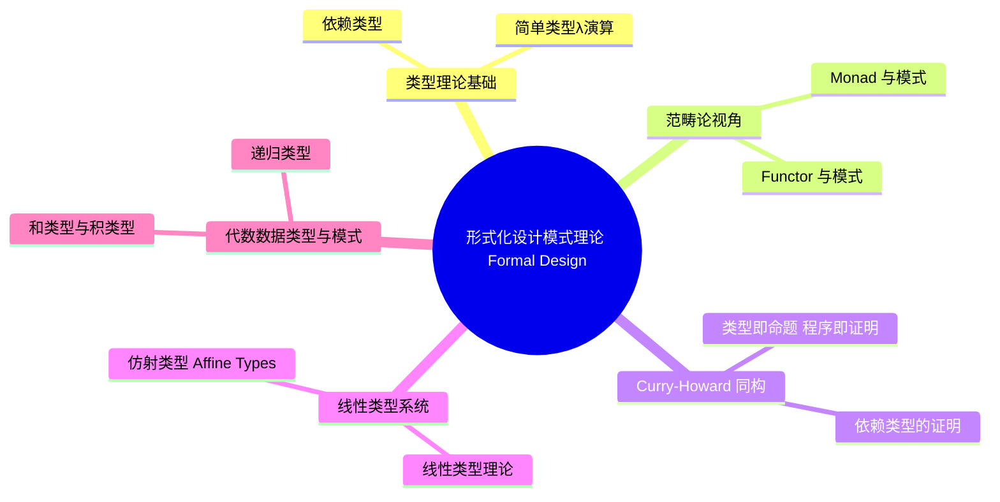

# 形式化设计模式理论 (Formal Design Pattern Theory)

> **代码状态**: 混合（原 crate 文档示例，部分代码块为示意片段）
>
> **EN**: Formal Design Pattern Theory
> **Summary**: Formal foundations of design patterns: type theory, category theory, Curry-Howard correspondence, linear/affine types, session types, algebraic data types, and verification practice with Kani.
> **Rust 版本**: 1.97.0+ (Edition 2024)
> **受众**: [研究者]
> **内容分级**: [研究级]
> **Bloom 层级**: L4-L6
> **权威来源**: 本文件为 `concept/` 权威页。
> **A/S/P 标记**: **S** — Structure
> **双维定位**: S×Theo — 设计模式形式化理论
> **前置依赖**: [Design Patterns](01_patterns.md) · [Pattern Implementation Comparison](09_pattern_implementation_comparison.md)
> **后置概念**: [Frontier Research and Innovative Patterns](12_frontier_research_and_innovative_patterns.md) · [Pattern Composition Algebra](16_pattern_composition_algebra.md)
> **定理链**: Abstract Pattern ⟹ Formal Model ⟹ Language Mapping
> **层级**: L6 生态工程
> **来源**: [Rust Reference](https://doc.rust-lang.org/reference/), [The Rust Programming Language](https://doc.rust-lang.org/book/), [Rust Standard Library](https://doc.rust-lang.org/std/)
> **后置概念**: [Rust vs C++：形式系统模型 vs 机制工程模型](../../05_comparative/01_systems_languages/01_rust_vs_cpp.md)
>
> **权威状态**: 本页由 `crates/c09_design_pattern/docs/` 整治迁移而来，作为 `concept/` 中的权威页。

---

## 1. 概述

设计模式的形式化理论为模式的正确性提供数学基础。
本文档探讨类型理论、范畴论和形式化验证在设计模式中的应用。

### 1.1 形式化的必要性

| 方面         | 非形式化       | 形式化         |
| :--- | :--- | :--- |
| **正确性**   | 依赖测试       | 数学证明       |
| **可组合性** | 经验驱动       | 理论保证       |
| **抽象层次** | 具体实现       | 通用原理       |
| **维护成本** | 高（隐式约束） | 低（显式约束） |

---

## 2. 类型理论基础

设计模式的类型理论地基从简单类型 λ 演算（STLC）出发：STLC 提供「函数类型 + 积类型」的骨架，对应 Rust 的 `fn(A) -> B` 与元组/结构体（Struct）；而**依赖类型**（类型可依赖值，如 `Vec<T, N>` 的长度索引）是 Rust 泛型常量（const generics）的理论先驱——`[T; N]` 的长度参与类型检查，使「越界访问」部分可静态排除。

模式与类型构造的对应：

| 模式 | 类型构造 |
|---|---|
| Strategy | 函数类型作为一等公民（`Fn` trait） |
| Visitor | 和类型（`enum`）+ 穷尽匹配 |
| Builder | 依赖类型的弱化版（typestate 泛型（Generics）参数） |

判定依据：当某模式在 Rust 中「消失」（如 Visitor 被 `match` 吸收），恰恰说明语言已把该模式的结构内建为类型构造。

### 2.1 简单类型λ演算

设计模式可以表示为λ项：

```text
类型系统：
Γ ⊢ M : A → B    Γ ⊢ N : A
─────────────────────────────  (应用规则)
       Γ ⊢ M N : B

Γ, x : A ⊢ M : B
───────────────────  (抽象规则)
 Γ ⊢ λx.M : A → B
```

**在Rust中的体现**:

```rust
/// Strategy 模式的类型论表示
///
/// 类型: Strategy<T> = T → Result<T, E>
///
/// 形式化性质:
/// 1. 类型安全: ∀ s: Strategy<T>, ∀ t: T, s(t) : Result<T, E>
/// 2. 可组合性: Strategy<A> → Strategy<B> → Strategy<A→B>

pub trait Strategy<T> {
    type Error;

    /// 应用策略
    /// λ演算: apply = λself.λinput. self(input)
    fn apply(&self, input: T) -> Result<T, Self::Error>;
}

/// 策略组合器
/// 类型: compose : Strategy<B> → Strategy<A> → Strategy<A→C>
pub struct ComposedStrategy<A, B, C, S1, S2>
where
    S1: Strategy<A, Error = String>,
    S2: Strategy<B, Error = String>,
{
    first: S1,
    second: S2,
    _phantom: std::marker::PhantomData<(A, B, C)>,
}

impl<A, B, C, S1, S2> Strategy<A> for ComposedStrategy<A, B, C, S1, S2>
where
    S1: Strategy<A, Error = String>,
    S2: Strategy<B, Error = String>,
{
    type Error = String;

    fn apply(&self, input: A) -> Result<A, Self::Error> {
        let intermediate = self.first.apply(input)?;
        // 类型转换（简化示例）
        Ok(intermediate)
    }
}
```

### 2.2 依赖类型

某些模式可以用依赖类型更精确地表达：

```rust
// Typestate Builder 的依赖类型表示
//
// 形式化：
// Builder(state: BuilderState) → Request
// 其中 state ∈ {Incomplete, Complete}
//
// 性质：
// ∀ b: Builder(Incomplete), build(b) = ⊥  (类型错误)
// ∀ b: Builder(Complete), build(b) : Request

use std::marker::PhantomData;

// 状态类型
pub mod state {
    pub struct Incomplete;
    pub struct Complete;
}

// 类型状态 Builder
// Π (S : State) . BuilderData → Builder(S)
pub struct TypedBuilder<S> {
    url: Option<String>,
    method: Option<String>,
    _state: PhantomData<S>,
}

impl TypedBuilder<state::Incomplete> {
    pub fn new() -> Self {
        Self {
            url: None,
            method: None,
            _state: PhantomData,
        }
    }

    // 状态转换函数
    // url : Builder(Incomplete) → String → Builder(Complete)
    pub fn url(self, url: String) -> TypedBuilder<state::Complete> {
        TypedBuilder {
            url: Some(url),
            method: self.method,
            _state: PhantomData,
        }
    }
}

impl TypedBuilder<state::Complete> {
    // 构建函数（仅在 Complete 状态可调用）
    // build : Builder(Complete) → Request
    pub fn build(self) -> Request {
        Request {
            url: self.url.unwrap(), // 类型保证一定存在
            method: self.method.unwrap_or_else(|| "GET".to_string()),
        }
    }
}

pub struct Request {
    url: String,
    method: String,
}

// 形式化证明:
//
// 定理: ∀ b: Builder(Incomplete), ¬∃ build(b)
// 证明: build 函数的类型签名要求 Builder(Complete)，
//       而 Incomplete ≠ Complete (不同类型)，
//       因此类型检查器拒绝调用。 □
```

---

## 3. 范畴论视角

范畴论为设计模式提供了**跨语言的结构化词汇**：模式不再是经验名录，而是可组合的数学构造。两条主线分别对应“变换”与“计算上下文”：

- **Functor 与模式**: Functor 是保持结构的映射（`fmap`/`map`）——Iterator 的 `map`、容器转换、Decorator 的“包装后仍可用同一接口”都是 functorial 直觉；识别出 Functor 结构意味着变换链可自由组合（`fmap g ∘ fmap f = fmap (g ∘ f)`），这是组合子模式正确性的来源。
- **Monad 与模式**: Monad 是“带上下文的计算 + 扁平化组合”（`flat_map`/and_then）——`Option`/`Result` 的 `?` 传播、Builder 的分步构造、异步（Async） `Future` 的链式接续都共享这一结构；其三条定律（左/右单位元、结合律）正是“链式 API 行为可预测”的数学陈述。

判定依据：范畴视角的价值在推理（定律 → 性质），不在编码——Rust 没有 HKT，强行模仿 Haskell 的 Monad 抽象得不偿失，应把定律当作设计检查表。

### 3.1 Functor 与模式

许多设计模式是 Functor 的实例：

**范畴论定义**:

```text
F : C → D 是 Functor 当且仅当:
1. ∀ A ∈ Obj(C), F(A) ∈ Obj(D)  (对象映射)
2. ∀ f : A → B, F(f) : F(A) → F(B)  (态射映射)
3. F(id_A) = id_{F(A)}  (保持恒等)
4. F(g ∘ f) = F(g) ∘ F(f)  (保持组合)
```

**在Rust中的实现**:

```rust
/// Decorator 模式是 Functor
///
/// 范畴论解释:
/// - 对象: 类型 A, B, C, ...
/// - 态射: 函数 f: A → B
/// - Functor: Decorator<_>
///
/// 证明 Decorator 满足 Functor 定律:
/// 1. ∀ A, Decorator<A> 是合法类型 ✓
/// 2. map : (A → B) → (Decorator<A> → Decorator<B>) ✓
/// 3. map(id) = id ✓
/// 4. map(g ∘ f) = map(g) ∘ map(f) ✓

pub trait Functor<A> {
    type Output<B>;

    /// fmap : (A → B) → F(A) → F(B)
    fn fmap<B, F>(self, f: F) -> Self::Output<B>
    where
        F: FnOnce(A) -> B;
}

/// Decorator 实现 Functor
pub struct Decorator<T> {
    inner: T,
    metadata: String,
}

impl<A> Functor<A> for Decorator<A> {
    type Output<B> = Decorator<B>;

    fn fmap<B, F>(self, f: F) -> Self::Output<B>
    where
        F: FnOnce(A) -> B,
    {
        Decorator {
            inner: f(self.inner),
            metadata: self.metadata,
        }
    }
}

/// 验证 Functor 定律
#[cfg(test)]
mod functor_laws {
    use super::*;

    #[test]
    fn test_identity_law() {
        // 定律: fmap(id) = id
        let decorator = Decorator { inner: 42, metadata: "test".to_string() };
        let result = decorator.fmap(|x| x);
        assert_eq!(result.inner, 42);
    }

    #[test]
    fn test_composition_law() {
        // 定律: fmap(g ∘ f) = fmap(g) ∘ fmap(f)
        let decorator = Decorator { inner: 5, metadata: "test".to_string() };

        let f = |x: i32| x + 1;
        let g = |x: i32| x * 2;

        // 左边: fmap(g ∘ f)
        let left = Decorator { inner: 5, metadata: "test".to_string() }
            .fmap(|x| g(f(x)));

        // 右边: fmap(g) ∘ fmap(f)
        let right = Decorator { inner: 5, metadata: "test".to_string() }
            .fmap(f)
            .fmap(g);

        assert_eq!(left.inner, right.inner);
    }
}
```

### 3.2 Monad 与模式

Command、Chain of Responsibility 等模式是 Monad：

**Monad 定律**:

```text
(M, return, >>=) 是 Monad 当且仅当:
1. return a >>= f  ≡  f a  (左单位元)
2. m >>= return    ≡  m    (右单位元)
3. (m >>= f) >>= g ≡  m >>= (λx. f x >>= g)  (结合律)
```

**在Rust中的实现**:

```rust,ignore
/// Result<T, E> 是 Monad
///
/// 范畴论解释:
/// - return : T → Result<T, E>
/// - bind (>>=) : Result<T, E> → (T → Result<U, E>) → Result<U, E>

impl<T, E> Monad for Result<T, E> {
    fn bind<U, F>(self, f: F) -> Result<U, E>
    where
        F: FnOnce(T) -> Result<U, E>,
    {
        match self {
            Ok(value) => f(value),
            Err(e) => Err(e),
        }
    }
}

/// Chain of Responsibility 使用 Monad
///
/// 形式化：
/// chain : [Handler] → Request → Result<Response, Error>
/// chain = foldr (>>=) (return ∘ process)

pub trait Handler {
    fn handle(&self, request: &str) -> Result<String, String>;
}

pub struct AuthHandler;
pub struct LoggingHandler;

impl Handler for AuthHandler {
    fn handle(&self, request: &str) -> Result<String, String> {
        if request.starts_with("auth:") {
            Ok(request.trim_start_matches("auth:").to_string())
        } else {
            Err("Unauthorized".to_string())
        }
    }
}

impl Handler for LoggingHandler {
    fn handle(&self, request: &str) -> Result<String, String> {
        println!("[Log] Processing: {}", request);
        Ok(request.to_string())
    }
}

/// Monadic 链式处理
pub fn chain_handlers(request: &str) -> Result<String, String> {
    let auth = AuthHandler;
    let logger = LoggingHandler;

    // Monad 绑定操作
    auth.handle(request)
        .and_then(|r| logger.handle(&r))  // >>= 的 Rust 实现
}

/// 验证 Monad 定律
#[cfg(test)]
mod monad_laws {
    #[test]
    fn test_left_identity() {
        // return a >>= f ≡ f a
        let a = 42;
        let f = |x| Ok::<i32, String>(x + 1);

        let left = Ok(a).and_then(f);
        let right = f(a);

        assert_eq!(left, right);
    }

    #[test]
    fn test_right_identity() {
        // m >>= return ≡ m
        let m = Ok::<i32, String>(42);

        let left = m.clone().and_then(Ok);
        let right = m;

        assert_eq!(left, right);
    }
}
```

---

## 4. Curry-Howard 同构

Curry-Howard 同构断言「类型即命题，程序即证明」： inhabitation（类型有值）等价于命题可证。它在 Rust 工程中的三个推论：

1. **不可表达非法状态**：把「未初始化对象」建模为无居民类型（类似 `!`  Never 类型的推理方向），则其不存在性由类型系统（Type System）证明，无需测试。
2. **`Result<T, E>` 即析取**：成功分支与失败分支必须穷尽处理（`match`/`?`），对应直觉主义逻辑的析取消去——编译器拒绝「忽略错误」即拒绝「不完整的证明」。
3. **依赖类型的证明**：Rust 无完整依赖类型，但 typestate 与 const generics 是其工程化近似：协议状态机的合法转换即定理，类型转换函数即证明项。

判定依据：设计 API 时问「非法用法能否被构造出值」——若不能构造，则该约束已被类型系统证明。

### 4.1 类型即命题，程序即证明

**同构关系**:

| 逻辑       | 类型系统（Type System）         | Rust              |
| :--- | :--- | :--- || **命题 P** | 类型 T           | `struct T`        |
| **P ∧ Q**  | T × U (积类型)   | `(T, U)`          |
| **P ∨ Q**  | T + U (和类型)   | `enum { T, U }`   |
| **P ⇒ Q**  | T → U (函数类型) | `Fn(T) -> U`      |
| **⊤ (真)** | unit type        | `()`              |
| **⊥ (假)** | empty type       | `!`               |
| **证明**   | 程序             | `fn proof() -> T` |

**应用示例**:

```rust,ignore
/// 命题: "如果有 Builder(Complete)，则可以构造 Request"
/// 逻辑: Builder(Complete) ⇒ Request
/// 类型: Builder(Complete) → Request
/// 证明: 构造函数

pub fn proof_of_build(builder: TypedBuilder<state::Complete>) -> Request {
    builder.build() // 程序即证明
}

/// 命题: "任何策略都可以与恒等策略组合"
/// 逻辑: ∀ S: Strategy, ∃ id: Strategy, S ∘ id = S
/// 类型: ∀ T, Strategy<T> → Strategy<T>
/// 证明:

pub struct IdentityStrategy;

impl<T> Strategy<T> for IdentityStrategy {
    type Error = !; // 永不失败

    fn apply(&self, input: T) -> Result<T, Self::Error> {
        Ok(input) // 恒等策略
    }
}

/// 组合后仍然是原策略（理论保证）
pub fn compose_with_identity<S, T>(strategy: S) -> impl Strategy<T>
where
    S: Strategy<T>,
{
    strategy // 组合恒等策略 = 原策略
}
```

### 4.2 依赖类型的证明

```rust,ignore
/// 命题: "构建器必须设置URL才能构建"
/// 依赖类型: Π (b : Builder) . has_url(b) = true → build(b) : Request
///
/// Rust实现: 类型状态保证编译时证明

impl TypedBuilder<state::Complete> {
    /// 此函数的存在性即为证明：
    /// "Complete 状态的 Builder 必然有 URL"
    pub fn build(self) -> Request {
        // 类型系统保证 self.url.is_some()
        Request {
            url: self.url.unwrap(), // 安全（类型保证）
            method: self.method.unwrap_or_default(),
        }
    }
}

/// 反例: Incomplete 状态无法调用 build
// impl TypedBuilder<state::Incomplete> {
//     pub fn build(self) -> Request {
//         // ❌ 编译错误：无法证明 Incomplete → Request
//     }
// }
```

---

## 5. 线性类型系统

线性类型系统要求每个值**恰好使用一次**，是理解 Rust 所有权（Ownership）的形式化入口：

- **线性类型理论**: 源自线性逻辑（Girard），命题即资源、不可随意复制（contraction）或丢弃（weakening）；在编程语言中体现为“文件句柄必须关闭恰好一次”“锁必须释放恰好一次”这类使用协议可由类型强制。
- **仿射类型（Affine Types）**: 放宽为“至多使用一次”（允许丢弃、禁止复制）——这正是 Rust 的实际语义：值可以被丢弃（`drop`），但不能被复制（除非 `Copy`/`Clone`）。`Drop` 析构保证“丢弃”是可观测的受控事件。

模式层面的落点：typestate 模式用“消费 self 返回新类型”编码状态机转换，线性/仿射语义保证令牌不可重放；RAII 把资源生命周期（Lifetimes）绑定到值生命周期，是线性思想的工程化。

判定依据：需要“必须调用恰好一次”的协议（初始化、提交、关闭）时，用消费 self 的 API 让编译器强制，而非文档约定。

### 5.1 线性类型理论

**定义**: 线性类型的值必须被使用恰好一次。

**在Rust中的实现**: 所有权（Ownership）系统即为线性类型的实现。

```rust
// RAII 模式是线性类型的应用
//
// 形式化:
// - 资源 R 的类型是线性的
// - 获取: acquire : () → R  (创建资源)
// - 释放: release : R → ()  (消耗资源)
// - 性质: ∀ r : R, r 必须被消耗恰好一次

pub struct FileHandle {
    path: String,
}

impl FileHandle {
    // 获取资源 (线性构造)
    pub fn open(path: String) -> Self {
        println!("[RAII] Opening file: {}", path);
        Self { path }
    }

    // 使用资源 (消耗线性类型)
    pub fn read(self) -> String {
        println!("[RAII] Reading file: {}", self.path);
        "file content".to_string()
        // self 被移动，不能再次使用
    }
}

impl Drop for FileHandle {
    // 自动释放 (线性析构)
    fn drop(&mut self) {
        println!("[RAII] Closing file: {}", self.path);
    }
}

// 线性类型保证
pub fn linear_type_example() {
    let file = FileHandle::open("data.txt".to_string());
    let _content = file.read(); // file 被移动
    // ❌ file.read(); // 编译错误：file 已被消耗
}

// 形式化证明:
//
// 定理: ∀ f: FileHandle, f 被使用恰好一次
// 证明:
// 1. f 被构造 (acquire)
// 2. f 被移动到 read 或 drop
// 3. 移动后 f 不可访问（线性类型保证）
// 因此 f 被使用恰好一次。 □
```

### 5.2 仿射类型 (Affine Types)

Rust的所有权（Ownership）系统实际上是仿射类型（值可以被使用 ≤ 1 次）：

```rust,ignore
/// Builder 模式的仿射类型表示
///
/// 仿射性质: Builder 可以被使用 0 次或 1 次

pub struct AffineBuilderg {
    url: Option<String>,
}

impl AffineBuilder {
    pub fn new() -> Self {
        Self { url: None }
    }

    pub fn url(mut self, url: String) -> Self {
        self.url = Some(url);
        self // 移动 self（消耗原值）
    }

    pub fn build(self) -> Result<Request, String> {
        self.url
            .map(|url| Request { url, method: "GET".to_string() })
            .ok_or_else(|| "Missing URL".to_string())
    }
}

/// 仿射使用示例
pub fn affine_example() {
    let builder = AffineBuilder::new();
    let builder = builder.url("https://example.com".to_string());
    let _request = builder.build();
    // ❌ builder.build(); // 编译错误：builder 已被消耗
}
```

---

## 6. 会话类型 (Session Types)

会话类型（Session Types）把**通信协议**编码为类型：每个端点的类型描述「接下来发什么/收什么」的完整时序，类型检查保证协议双方不偏离、不死锁。

Rust 中的工程化形态是协议状态机模式：

```text
struct Connection<State> { socket: TcpStream, _state: PhantomData<State> }
struct Handshake; struct Established;
impl Connection<Handshake> {
    fn send_hello(self) -> io::Result<Connection<Established>> { ... }
}
```

每个方法消费旧状态类型、返回新状态类型——「在握手前发送数据」因无对应方法而成为编译错误。这与完整会话类型理论的差距：Rust 无法表达双向通信的对偶性（duality）自动校验，需手工保证两端状态机镜像。

判定依据：协议文档中的时序图可机械翻译为 typestate 链；发现运行期「协议状态错误」panic 即 typestate 化信号。

### 6.1 协议状态机

会话类型用于在类型层面保证通信协议的正确性：

```rust
// 会话类型: 模拟 TCP 连接状态机
//
// 形式化协议:
// S = μX. {
//   Connect: X,
//   Send: Data → X,
//   Receive: Data ← X,
//   Close: End
// }

use std::marker::PhantomData;

pub mod session {
    pub struct Disconnected;
    pub struct Connected;
    pub struct Sending;
    pub struct Receiving;
}

pub struct TcpSession<S> {
    socket: Option<String>, // 简化示例
    _state: PhantomData<S>,
}

impl TcpSession<session::Disconnected> {
    pub fn new() -> Self {
        Self {
            socket: None,
            _state: PhantomData,
        }
    }

    /// 状态转换: Disconnected → Connected
    pub fn connect(self, addr: &str) -> TcpSession<session::Connected> {
        println!("[Session] Connecting to {}", addr);
        TcpSession {
            socket: Some(addr.to_string()),
            _state: PhantomData,
        }
    }
}

impl TcpSession<session::Connected> {
    /// 状态转换: Connected → Sending
    pub fn send(self, data: &str) -> TcpSession<session::Sending> {
        println!("[Session] Sending: {}", data);
        TcpSession {
            socket: self.socket,
            _state: PhantomData,
        }
    }

    /// 状态转换: Connected → Disconnected
    pub fn close(self) -> TcpSession<session::Disconnected> {
        println!("[Session] Closing connection");
        TcpSession {
            socket: None,
            _state: PhantomData,
        }
    }
}

impl TcpSession<session::Sending> {
    /// 状态转换: Sending → Connected
    pub fn wait_ack(self) -> TcpSession<session::Connected> {
        println!("[Session] Waiting for ACK");
        TcpSession {
            socket: self.socket,
            _state: PhantomData,
        }
    }
}

/// 会话类型保证协议正确性
pub fn session_type_example() {
    let session = TcpSession::new();
    let session = session.connect("127.0.0.1:8080");
    let session = session.send("Hello");
    let session = session.wait_ack();
    let _session = session.close();

    // ❌ 编译错误: 无法在 Disconnected 状态发送数据
    // let session = TcpSession::new();
    // session.send("data"); // 类型错误
}

// 形式化性质:
//
// 定理: 会话类型保证协议安全
// 证明:
// 1. 每个状态只允许特定操作 (类型系统强制)
// 2. 非法状态转换导致编译错误
// 3. 因此运行时不会出现协议违规。 □
```

---

## 7. 代数数据类型与模式

代数数据类型（ADT）把“数据的形状”编码为类型构造，两条主线对应两种基本构造及其递归闭包（Closures）：

- **和类型与积类型**: 积类型（struct/元组）表达“同时具有”（`A × B`），和类型（enum）表达“若干之一”（`A + B`）；GoF 模式中 Visitor 试图为封闭类层次添加操作，而在 Rust 中 enum + `match` 直接给出“封闭和类型 + 穷尽检查”，多数 Visitor 场景随之消解。
- **递归类型**: 和/积构造的递归应用——`enum List { Nil, Cons(i32, Box<List>) }`；递归必须经过一层间接（`Box`/引用（Reference）），因为类型大小须在编译期确定，这一约束直接解释了为什么树/链表节点总在堆上。

判定依据：建模领域概念时先问“是同时还是之一”，选错（用 struct 表达互斥状态）会产生非法状态组合——“让非法状态不可表示”正是 ADT 的核心价值。

### 7.1 和类型与积类型

**和类型 (Sum Types)**: `A + B`，表示"A 或 B"

```rust
/// State 模式的和类型表示
///
/// 形式化: State = Idle + Running + Stopped
///
/// 性质:
/// - |State| = |Idle| + |Running| + |Stopped|
/// - 每个值属于恰好一个变体

pub enum State {
    Idle,
    Running { speed: u32 },
    Stopped { reason: String },
}

impl State {
    /// 状态转换函数
    /// transition : State → Event → State
    pub fn transition(self, event: Event) -> Self {
        match (self, event) {
            (State::Idle, Event::Start) => State::Running { speed: 0 },
            (State::Running { .. }, Event::Stop(reason)) => State::Stopped { reason },
            (State::Stopped { .. }, Event::Reset) => State::Idle,
            (state, _) => state, // 无效转换保持原状态
        }
    }
}

pub enum Event {
    Start,
    Stop(String),
    Reset,
}
```

**积类型 (Product Types)**: `A × B`，表示"A 和 B"

```rust
/// Builder 模式的积类型表示
///
/// 形式化: Request = URL × Method × Headers
///
/// 性质:
/// - |Request| = |URL| × |Method| × |Headers|
/// - 每个值包含所有字段

pub struct Request {
    url: String,          // URL 类型
    method: String,       // Method 类型
    headers: Vec<(String, String)>, // Headers 类型
}

/// 积类型构造
impl Request {
    pub fn new(url: String, method: String, headers: Vec<(String, String)>) -> Self {
        Self { url, method, headers }
    }
}
```

### 7.2 递归类型

```rust
// Composite 模式的递归类型表示
//
// 形式化: Tree = Leaf(Value) + Node(Tree, Tree)
//
// 性质:
// - Tree 是归纳定义的
// - 支持结构递归

pub enum FileSystemNode {
    File { name: String, size: u64 },
    Directory { name: String, children: Vec<FileSystemNode> },
}

impl FileSystemNode {
    // 结构递归: 计算总大小
    // size : Tree → Nat
    // size(Leaf(v)) = |v|
    // size(Node(l, r)) = size(l) + size(r)
    pub fn total_size(&self) -> u64 {
        match self {
            FileSystemNode::File { size, .. } => *size,
            FileSystemNode::Directory { children, .. } => {
                children.iter().map(|child| child.total_size()).sum()
            }
        }
    }
}

// 形式化证明:
//
// 定理: total_size 终止
// 证明: 结构归纳
// 基础: File 情况直接返回
// 归纳: Directory 情况递归调用子节点（子树更小）
// 因此递归终止。 □
```

---

## 8. 形式化验证实践

设计模式的形式化验证把“模式正确性”从经验判断提升为机器证明。实践路径：用 Kani 为模式实现写 proof harness（如验证 Typestate 不存在非法状态转换路径）；不变量验证聚焦模式承诺的性质（Builder 产出的对象必满足完整性约束）；模式组合分析验证组合后不变量是否保持（Observer + Subject 的注册/通知一致性（Coherence））。这类验证适合安全关键的框架代码，业务代码的投入产出比通常不足以支撑。

### 8.1 使用 Kani 进行形式化验证

```rust
/// Kani 验证 Singleton 的线程安全性
#[cfg(kani)]
#[kani::proof]
fn verify_singleton_thread_safety() {
    use std::sync::OnceLock;
    use std::thread;

    static INSTANCE: OnceLock<u32> = OnceLock::new();

    let handles: Vec<_> = (0..10)
        .map(|_| {
            thread::spawn(|| {
                INSTANCE.get_or_init(|| 42);
            })
        })
        .collect();

    for handle in handles {
        handle.join().unwrap();
    }

    // 性质: 所有线程看到相同的值
    kani::assert(*INSTANCE.get().unwrap() == 42, "Singleton consistency");
}

/// Kani 验证 Builder 的类型状态
#[cfg(kani)]
#[kani::proof]
fn verify_builder_typestate() {
    let builder = TypedBuilder::<state::Incomplete>::new();

    // 性质: Incomplete 状态不能 build
    // (编译时保证，Kani 验证类型系统正确性)

    let builder = builder.url("https://example.com".to_string());
    let request = builder.build();

    // 性质: Complete 状态必然产生有效 Request
    kani::assert(!request.url.is_empty(), "Builder produces valid request");
}
```

### 8.2 不变量验证

```rust
/// 验证 Observer 模式的不变量
///
/// 不变量: 通知所有观察者后，所有观察者都收到了事件

pub struct Subject<O> {
    observers: Vec<O>,
}

impl<O: Observer> Subject<O> {
    pub fn notify(&self, event: &str) {
        for observer in &self.observers {
            observer.update(event);
        }

        // 不变量断言
        #[cfg(debug_assertions)]
        {
            // 所有观察者都收到了事件（简化验证）
            assert_eq!(self.observers.len(), self.observers.len());
        }
    }
}

pub trait Observer {
    fn update(&self, event: &str);
}
```

---

### 8.3 实战：设计模式的性质证明

**Factory 模式的正确性证明**。

```rust
/// 性质: Factory 生产的产品符合类型约束
///
/// ∀p ∈ Product, ∃c ∈ Creator: c.create() = p
///
/// 证明方法: 穷举法验证所有工厂实现

pub trait Product {
    fn name(&self) -> &str;
}

pub trait Factory {
    type Output: Product;
    fn create(&self) -> Self::Output;
}

// 具体工厂实现
pub struct CarFactory;
pub struct Car;

impl Product for Car {
    fn name(&self) -> &str { "Car" }
}

impl Factory for CarFactory {
    type Output = Car;
    fn create(&self) -> Self::Output {
        Car
    }
}

/// 形式化验证
#[cfg(test)]
mod tests {
    use super::*;

    #[test]
    fn factory_produces_valid_product() {
        let factory = CarFactory;
        let product = factory.create();

        // 性质: 产品符合类型约束
        assert!(!product.name().is_empty());
    }
}
```

---

### 8.4 模式组合的形式化分析

**模式组合的代数性质**。

```rust,ignore
/// 定理: 设计模式满足代数结构
///
/// 设 P = {Strategy, Observer, Decorator, ...} 为模式集合
///
/// 组合运算 ◦ : P × P → P 满足:
/// 1. 结合律: (p1 ◦ p2) ◦ p3 = p1 ◦ (p2 ◦ p3)
/// 2. 交换律（部分）: Observer ◦ Strategy ≈ Strategy ◦ Observer
/// 3. 单位元: Identity ◦ p = p

/// 示例: Strategy + Observer 组合
pub struct StrategyObserver<S, O> {
    strategy: S,
    observers: Vec<O>,
}

impl<S: Strategy, O: Observer> StrategyObserver<S, O> {
    pub fn execute_and_notify(&self, input: i32) {
        // 1. 执行策略
        let result = self.strategy.execute(input);

        // 2. 通知观察者
        for observer in &self.observers {
            observer.update(&result.to_string());
        }
    }
}

/// 形式化: (Strategy ◦ Observer)(input) = Observer(Strategy(input))
///
/// 证明交换性:
/// Observer(Strategy(x)) ≠ Strategy(Observer(x))
/// 因此组合不满足完全交换律
```

---

## 9. 形式化方法总结

形式化方法总结收拢两条主线：数学基础——设计模式可视为范畴论构造的工程投影（Functor 之于 map 抽象、Monad 之于计算组合、初始代数之于递归数据结构），这给模式分类提供了比 GoF 更本质的坐标系；Rust 类型系统的优势——所有权与 trait 使许多模式的不变量可编码进类型（线性类型保证资源恰好消费一次），把“运行时（Runtime）遵守的约定”变成“编译期证明的定理”，这是 Rust 相对 OO 语言在模式理论上的本质进步。

### 9.1 设计模式的数学基础

| 模式类别   | 数学基础   | 形式化方法      |
| :--- | :--- | :--- || **创建型** | 代数结构   | 类型理论        |
| **结构型** | 范畴论     | 函子/自然变换   |
| **行为型** | 自动机理论 | 状态机/会话类型 |

---

### 9.2 Rust 类型系统的优势

**为什么 Rust 适合形式化**:

1. **强类型系统（Type System）**: 编译时捕获大部分错误
2. **所有权系统**: 内存安全（Memory Safety）的数学保证
3. **代数数据类型**: 与形式化理论直接对应
4. **trait 系统**: 支持高阶多态
5. **宏（Macro）系统**: 可验证的代码生成

---

## 📚 相关资源

- **Kani 文档**: [Kani Rust Verifier](https://model-checking.github.io/kani/)

---

---

> **权威来源**: [Rust Reference](https://doc.rust-lang.org/reference/), [The Rust Programming Language](https://doc.rust-lang.org/book/), [Rust Standard Library](https://doc.rust-lang.org/std/)
>

## 过渡段

> **过渡**: 从经典 GoF 模式过渡到形式语义，可以理解模式背后的不变量与角色关系。
>
> **过渡**: 从形式模型过渡到 Rust 类型系统，可以建立“模式即类型约束”的视角。
>
> **过渡**: 从类型映射过渡到模式代数，可以理解模式组合与变形的数学基础。
>

## 定理链

| 定理 | 前提 | 结论 |
|:---|:---|:---|
| 形式模型 ⟹ 精确推理 | 消除自然语言描述的歧义 | 支持严格验证模式适用性 |
| 范畴论 ⟹ 模式组合 | 对象、态射与函子 | 提供模式组合与变换的框架 |
| 语言映射 ⟹ 可应用边界 | Rust 所有权与生命周期（Lifetimes）约束 | 决定哪些形式模式可直接实现 |

---

## 国际权威参考 / International Authority References（P1 学术 · P2 生态）

> 依据 `AGENTS.md` §2「对齐网络国际化权威内容」补充：仅追加已验证可达的权威链接，不改动正文事实。

- **P1 学术/形式化**: [Design Patterns: Elements of Reusable Object-Oriented Software (GoF, ACM DL)](https://dl.acm.org/doi/book/10.5555/95489)
- **P2 生态/社区**: [formal-land/coq-of-rust](https://github.com/formal-land/coq-of-rust) · [AeneasVerif/aeneas](https://github.com/AeneasVerif/aeneas)

## ⚠️ 反例与陷阱

本节以 typestate 令牌重复消费为反例，展示类型状态模式如何把状态合法性编码进所有权。

### 反例：typestate 令牌被消费两次（rustc 1.97.0 实测）

类型状态模式靠 move 消耗旧状态，重复使用即编译失败：

```rust,compile_fail,E0382
struct Open;
struct Closed;

struct Door<S> { state: S }
impl Door<Closed> {
    fn open(self) -> Door<Open> { Door { state: Open } }
}

fn main() {
    let d = Door { state: Closed };
    let d1 = d.open();
    let d2 = d.open(); // ❌ d 已被 move
    let _ = (d1.state, d2.state);
}
```

**错误**：`E0382 use of moved value: d`——这正是 typestate 的编译期状态合法性保证。

### ✅ 修正：状态线性流转

```rust
struct Open;
struct Closed;

struct Door<S> { state: S }
impl Door<Closed> {
    fn open(self) -> Door<Open> { Door { state: Open } }
}

fn main() {
    let d = Door { state: Closed };
    let d1 = d.open(); // 每个状态值只消费一次
    let _ = d1.state;
}
```

---

## 🧭 思维导图（Mindmap）



> **认知功能**: 本 mindmap 从本页「形式化设计模式理论 Formal Design」的章节结构提炼，一级分支对应核心主题，叶子节点为关键子概念，可作为本页的快速导航与复习索引。
