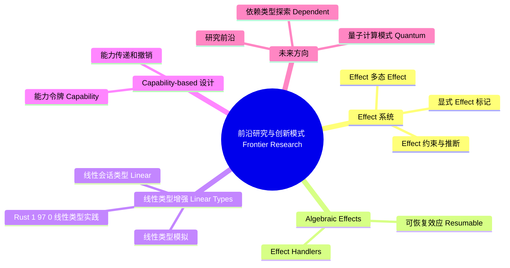

# 前沿研究与创新模式 (Frontier Research and Innovative Patterns)

> **代码状态**: 混合（原 crate 文档示例，部分代码块为示意片段）
>
> **EN**: Frontier Research and Innovative Patterns
> **Summary**: Frontier topics in Rust design patterns: effect systems, algebraic effects, advanced session types, linear types, capability-based security, dependent types, quantum computing patterns, and future directions.
> **Rust 版本**: 1.97.0+ (Edition 2024)
> **受众**: [研究者]
> **内容分级**: [研究级]
> **Bloom 层级**: L4-L6
> **权威来源**: 本文件为 `concept/` 权威页。
> **A/S/P 标记**: **S+A** — Structure + Application
> **双维定位**: A×Res — 前沿研究与创新模式
> **前置依赖**: [Design Patterns](01_patterns.md) · [Formal Design Pattern Theory](11_formal_design_pattern_theory.md)
> **后置概念**: [Engineering and Production Patterns](13_engineering_and_production_patterns.md) · [Industrial Case Studies](../11_domain_applications/14_industrial_case_studies.md)
> **定理链**: Emerging Problem ⟹ Experimental Pattern ⟹ Production Hardening
> **层级**: L6 生态工程
> **来源**: [Rust Reference](https://doc.rust-lang.org/reference/), [The Rust Programming Language](https://doc.rust-lang.org/book/), [Rust Standard Library](https://doc.rust-lang.org/std/)
> **后置概念**: [Rust vs C++：形式系统模型 vs 机制工程模型](../../05_comparative/01_systems_languages/01_rust_vs_cpp.md)
>
> **权威状态**: 本页由 `crates/c09_design_pattern/docs/` 整治迁移而来，作为 `concept/` 中的权威页。

---

## 1. 概述

本文档探讨设计模式的前沿研究方向和创新应用，涵盖：

- **Effect 系统**: 类型级副作用管理与多态效应
- **代数效应 (Algebraic Effects)**: 可组合的计算效应与处理器
- **会话类型 (Session Types)**: 多方通信协议的类型安全保证
- **能力安全 (Capability-based Security)**: 权限的类型级强制
- **线性类型增强**: 资源管理的形式化方法
- **依赖类型探索**: 类型级编程的极限
- **前沿研究方向**: 量子计算、形式化验证集成

这些模式代表了 Rust 设计模式演进的未来方向，结合了类型理论、范畴论和实用工程经验。

---

## 2. Effect 系统

Effect 系统（代数效应）把「副作用」从函数实现中抽离为一等类型公民：

1. **显式 Effect 标记**：函数的签名声明其效果（`fn read() -> String effect IO`），纯函数与效果函数在类型层区分——Haskell 用 `IO` 单子硬编码，代数效应泛化为任意可组合效果（State/Async/Error/...）。
2. **Effect 多态**：函数可对效果参数化（`fn log<E: Logging>(...)`），同一实现可跑在真实 I/O 与内存 mock 上——测试与生产的统一抽象，Rust 当前用泛型 trait 模拟（依赖注入），缺的是**效果推断**（自动传播，免标注）。
3. **Effect 约束与推断**：Koka/OCaml 5 的研究线表明效果推断与 Hindley-Milner 类型推断兼容；Rust 的 `~const` 限定是效果标记的最小工程形态（constness 作为效果）。

判定依据：Rust 中今天就用「trait 抽象效果源」（`trait Clock`/`trait Rng`）获得 80% 收益，语言级效果系统仍属研究前沿。

### 2.1 显式 Effect 标记

**概念**: 在类型系统（Type System）中显式标记副作用。

```rust
/// Effect Trait: 标记副作用
pub trait Effect {
    type Input;
    type Output;

    fn perform(&self, input: Self::Input) -> Self::Output;
}

/// IO Effect
pub struct IoEffect;

impl Effect for IoEffect {
    type Input = String;
    type Output = Result<String, std::io::Error>;

    fn perform(&self, path: Self::Input) -> Self::Output {
        std::fs::read_to_string(path)
    }
}

/// State Effect
pub struct StateEffect<T> {
    state: std::cell::RefCell<T>,
}

impl<T: Clone> Effect for StateEffect<T> {
    type Input = ();
    type Output = T;

    fn perform(&self, _: Self::Input) -> Self::Output {
        self.state.borrow().clone()
    }
}

/// Effect 组合器
pub struct ComposedEffect<E1, E2> {
    first: E1,
    second: E2,
}

impl<E1: Effect, E2: Effect> Effect for ComposedEffect<E1, E2>
where
    E2::Input: From<E1::Output>,
{
    type Input = E1::Input;
    type Output = E2::Output;

    fn perform(&self, input: Self::Input) -> Self::Output {
        let intermediate = self.first.perform(input);
        self.second.perform(intermediate.into())
    }
}
```

---

### 2.2 Effect 多态 (Effect Polymorphism)

**概念**: 允许函数对 Effect 类型进行抽象。

```rust,ignore
/// Effect 多态函数
pub fn polymorphic_effect<E: Effect<Input = i32, Output = String>>(
    effect: E,
    value: i32,
) -> String {
    effect.perform(value)
}

/// 多种 Effect 可以传入
pub fn example_polymorphism() {
    // 使用不同的 Effect 实现
    let io_effect = IoEffect;
    let result1 = polymorphic_effect(io_effect, 42);

    let state_effect = StateEffect {
        state: std::cell::RefCell::new("state".to_string()),
    };
    // polymorphic_effect 可接受任何实现 Effect 的类型
}
```

---

### 2.3 Effect 约束与推断

**使用类型系统（Type System）约束副作用**:

```rust
use std::marker::PhantomData;

/// 纯函数标记（无副作用）
pub struct Pure;

/// 有副作用标记
pub struct Impure;

/// 带 Effect 约束的计算
pub struct Computation<E, T> {
    _effect: PhantomData<E>,
    value: T,
}

impl<T> Computation<Pure, T> {
    /// 纯计算：保证无副作用
    pub fn pure(value: T) -> Self {
        Self {
            _effect: PhantomData,
            value,
        }
    }

    /// 纯计算可以安全地并行执行
    pub fn par_map<F, U>(self, f: F) -> Computation<Pure, U>
    where
        F: Fn(T) -> U + Send,
        T: Send,
        U: Send,
    {
        let result = f(self.value);
        Computation::pure(result)
    }
}

impl<T> Computation<Impure, T> {
    /// 有副作用的计算
    pub fn impure(value: T) -> Self {
        Self {
            _effect: PhantomData,
            value,
        }
    }

    /// 有副作用的计算必须顺序执行
    pub fn seq_map<F, U>(self, f: F) -> Computation<Impure, U>
    where
        F: FnOnce(T) -> U,
    {
        let result = f(self.value);
        Computation::impure(result)
    }
}

/// 使用示例
pub fn effect_constraint_example() {
    // 纯计算
    let pure_comp = Computation::pure(42);
    let doubled = pure_comp.par_map(|x| x * 2);

    // 有副作用的计算
    let impure_comp = Computation::impure(vec![1, 2, 3]);
    let logged = impure_comp.seq_map(|v| {
        println!("Processing: {:?}", v);
        v
    });
}
```

---

## 3. Algebraic Effects

代数效应（Algebraic Effects）把副作用抽象为“操作 + 处理器”：代码执行 `perform` 操作挂起，外层 handler 决定如何解释该操作（可恢复效应允许 handler 返回后 continuation 继续执行）。这使依赖注入、异常、异步统一为同一机制——Rust 的 async/await 可视为一种不可恢复的效应（generator 风格）。Rust 尚无原生效应系统，研究集中在 effect trait 与上下文参数的替代方案上，理解它有助于预判语言演进方向。

### 3.1 Effect Handlers

**概念**: 代数效应允许在调用栈中注入行为。

```rust
/// Effect 接口
pub trait AlgebraicEffect {
    type Resume;

    fn handle(&self) -> Self::Resume;
}

/// 日志效应
pub struct LogEffect {
    pub message: String,
}

impl AlgebraicEffect for LogEffect {
    type Resume = ();

    fn handle(&self) -> Self::Resume {
        println!("[LOG] {}", self.message);
    }
}

/// Effect Handler
pub struct EffectHandler<E: AlgebraicEffect> {
    effect: E,
}

impl<E: AlgebraicEffect> EffectHandler<E> {
    pub fn run(effect: E) -> E::Resume {
        effect.handle()
    }
}

/// 使用示例
pub fn algebraic_effect_example() {
    let effect = LogEffect {
        message: "Hello, algebraic effects!".to_string(),
    };

    EffectHandler::run(effect);
}
```

### 3.2 可恢复效应 (Resumable Effects)

```rust,ignore
/// 可恢复效应：异步中断和恢复
pub enum Resumable<T, E> {
    Done(T),
    Suspend(E, Box<dyn FnOnce(E::Resume) -> Resumable<T, E>>),
}

/// 异步读取效应
pub struct AsyncReadEffect {
    pub path: String,
}

impl AlgebraicEffect for AsyncReadEffect {
    type Resume = String;

    fn handle(&self) -> Self::Resume {
        // 异步读取文件
        std::fs::read_to_string(&self.path).unwrap_or_default()
    }
}

/// 可恢复计算
pub fn resumable_computation() -> Resumable<String, AsyncReadEffect> {
    Resumable::Suspend(
        AsyncReadEffect { path: "data.txt".to_string() },
        Box::new(|content| {
            // 恢复计算
            Resumable::Done(content.to_uppercase())
        }),
    )
}

/// 执行可恢复计算
pub fn run_resumable<T, E: AlgebraicEffect>(mut computation: Resumable<T, E>) -> T {
    loop {
        match computation {
            Resumable::Done(value) => return value,
            Resumable::Suspend(effect, continuation) => {
                let resume = effect.handle();
                computation = continuation(resume);
            }
        }
    }
}
```

---

## 4. Session Types 高级应用

多方会话类型（Multiparty Session Types, MPST）把「两人协议」推广到 n 方编排：

- **全局类型 → 端点投影**：协议先写全局规范（如「Client→LB: req; LB→Worker: req; Worker→LB: resp; LB→Client: resp」），再**投影**为每个参与方的局部类型——投影保证若各方按局部类型通信，全局协议无死锁无跑偏；这是 MPST 的核心定理（ Honda, Yoshida, Carbone 2008）。
- **Rust 实现现状**：`rumpsteak`（研究原型）用类型级编程编码会话类型，`session-types` 类 crate 限于两方；n 方场景的可行工程形态是「中心化编排 + 类型化消息」（编排器持有协议状态机 `enum`，各方消息用 `serde` 枚举）。
- **与分布式系统验证的关系**：MPST 管「协议形状」，TLA+ 管「协议性质」——前者编译期，后者设计期，互补。

判定依据：微服务编排协议复杂（>4 方交互）时，先写全局协议文档再实现——MPST 的形式化价值在「文档可机器校验」。

### 4.1 多方会话类型 (Multiparty Session Types)

**概念**: 保证多方通信协议的类型安全。

```rust
/// 三方会话类型示例：客户端-服务器-数据库
use std::marker::PhantomData;

/// 角色标记
pub mod roles {
    pub struct Client;
    pub struct Server;
    pub struct Database;
}

/// 会话状态
pub mod states {
    pub struct Start;
    pub struct QuerySent;
    pub struct ResultReceived;
    pub struct End;
}

/// 多方会话
pub struct MultipartySession<Role, State> {
    _role: PhantomData<Role>,
    _state: PhantomData<State>,
}

/// 客户端视角
impl MultipartySession<roles::Client, states::Start> {
    pub fn new_client() -> Self {
        Self {
            _role: PhantomData,
            _state: PhantomData,
        }
    }

    pub fn send_query(self, query: &str) -> MultipartySession<roles::Client, states::QuerySent> {
        println!("[Client] Sending query: {}", query);
        MultipartySession {
            _role: PhantomData,
            _state: PhantomData,
        }
    }
}

impl MultipartySession<roles::Client, states::QuerySent> {
    pub fn receive_result(self) -> MultipartySession<roles::Client, states::ResultReceived> {
        println!("[Client] Receiving result");
        MultipartySession {
            _role: PhantomData,
            _state: PhantomData,
        }
    }
}

impl MultipartySession<roles::Client, states::ResultReceived> {
    pub fn close(self) -> MultipartySession<roles::Client, states::End> {
        println!("[Client] Closing connection");
        MultipartySession {
            _role: PhantomData,
            _state: PhantomData,
        }
    }
}

/// 使用示例
pub fn multiparty_session_example() {
    let session = MultipartySession::new_client();
    let session = session.send_query("SELECT * FROM users");
    let session = session.receive_result();
    let _session = session.close();
}
```

---

## 4.2 线性类型增强 (Linear Types)

**概念**: 线性类型保证每个值恰好被使用一次，用于精确的资源管理。

Rust 的所有权（Ownership）系统已经是一种仿射类型系统（Affine Types），但线性类型更加严格。

### 4.2.1 线性类型模拟

```rust
use std::marker::PhantomData;

/// 线性类型标记：必须被消费
pub struct Linear<T> {
    value: T,
    _marker: PhantomData<*const ()>, // 使类型不可 Copy
}

impl<T> Linear<T> {
    /// 创建线性类型
    pub fn new(value: T) -> Self {
        Self {
            value,
            _marker: PhantomData,
        }
    }

    /// 消费线性类型（唯一的"使用"方式）
    pub fn consume(self) -> T {
        self.value
    }

    /// 借用（不消费）
    pub fn borrow(&self) -> &T {
        &self.value
    }
}

/// 线性资源管理示例：数据库事务
pub struct DbTransaction {
    conn: String,
}

impl DbTransaction {
    pub fn begin(conn: String) -> Linear<Self> {
        Linear::new(Self { conn })
    }

    pub fn execute(&self, query: &str) {
        println!("Executing: {}", query);
    }
}

/// 事务必须被提交或回滚（消费）
impl Linear<DbTransaction> {
    pub fn commit(self) {
        let tx = self.consume();
        println!("Transaction committed on {}", tx.conn);
    }

    pub fn rollback(self) {
        let tx = self.consume();
        println!("Transaction rolled back on {}", tx.conn);
    }
}

/// 使用示例
pub fn linear_types_example() {
    let mut tx = DbTransaction::begin("localhost".to_string());
    tx.borrow().execute("INSERT INTO users ...");
    tx.borrow().execute("UPDATE accounts ...");

    // 必须显式提交或回滚
    tx.commit(); // 消费线性类型

    // tx.rollback(); // 编译错误：tx 已被消费
}
```

---

### 4.2.2 线性会话类型 (Linear Session Types)

```rust
# use std::marker::PhantomData;
/// 线性会话：保证协议完整执行
pub struct LinearSession<State> {
    _state: PhantomData<State>,
}

pub mod linear_states {
    pub struct Init;
    pub struct Sent;
    pub struct Received;
    pub struct Closed;
}

impl LinearSession<linear_states::Init> {
    pub fn new() -> Self {
        println!("Session initialized");
        Self { _state: PhantomData }
    }

    pub fn send(self, msg: &str) -> LinearSession<linear_states::Sent> {
        println!("Sending: {}", msg);
        LinearSession { _state: PhantomData }
    }
}

impl LinearSession<linear_states::Sent> {
    pub fn receive(self) -> (String, LinearSession<linear_states::Received>) {
        let msg = "Response".to_string();
        println!("Received: {}", msg);
        (msg, LinearSession { _state: PhantomData })
    }
}

impl LinearSession<linear_states::Received> {
    pub fn close(self) -> LinearSession<linear_states::Closed> {
        println!("Session closed");
        LinearSession { _state: PhantomData }
    }
}

/// 完整的会话协议（类型保证）
pub fn linear_session_example() {
    let session = LinearSession::<linear_states::Init>::new();
    let session = session.send("Hello");
    let (response, session) = session.receive();
    let _closed = session.close();

    // 编译时保证：
    // 1. 会话必须按顺序执行
    // 2. 不能跳过步骤
    // 3. 不能重复使用会话
}
```

---

### 4.2.3 Rust 1.97.0+ 线性类型实践

```rust
/// 使用 Drop 检查器模拟线性约束
pub struct MustUse<T> {
    value: Option<T>,
}

impl<T> MustUse<T> {
    pub fn new(value: T) -> Self {
        Self { value: Some(value) }
    }

    /// 显式消费
    pub fn take(mut self) -> T {
        self.value.take().expect("Value already taken")
    }
}

impl<T> Drop for MustUse<T> {
    fn drop(&mut self) {
        if self.value.is_some() {
            panic!("MustUse value was not consumed!");
        }
    }
}

/// 使用示例
pub fn must_use_example() {
    let value = MustUse::new(42);

    // 必须显式调用 take()
    let x = value.take();
    println!("Value: {}", x);

    // 如果不调用 take()，drop 时会 panic
}
```

---

## 5. Capability-based 设计

Capability-based 设计把「权限」建模为**不可伪造的令牌对象**：持有令牌即有权操作，无全局权限检查。

1. **能力令牌**：`struct FileCap { fd: RawFd }`——构造该类型的唯一途径是经过权限检查的 `open` API；后续 `read(&FileCap)` 无需再查权限表。Rust 的所有权语义天然契合：能力可移动（移交权限）、可借用（临时授权）、不可复制（`!Clone` 即不可扩散权限）。
2. **能力传递与撤销**：传递 = 移动所有权（移交即失去）；撤销 = 借用到期或 `Drop`（权限随值销毁回收）；「委派的权限可以收回」在 Rust 中是借用规则的直接推论——这比传统 ACL 的「撤销需遍历权限表」精确得多。
3. **WASI 的能力安全**：WASI 的文件系统访问即此模型（preopened dir 句柄即能力），是 capability 设计在工业标准中的最大规模落地。

判定依据：权限逻辑分散在 `if user.can(x)` 检查中 → 重构为能力类型，让类型系统强制「先取能力再操作」。

### 5.1 能力令牌 (Capability Tokens)

**概念**: 通过类型系统强制执行权限检查。

```rust
# use std::marker::PhantomData;
/// 能力令牌
pub struct Capability<P> {
    _permission: PhantomData<P>,
}

impl<P> Capability<P> {
    /// 创建能力（需要权限证明）
    pub fn new(_proof: impl PermissionProof<P>) -> Self {
        Self {
            _permission: PhantomData,
        }
    }
}

/// 权限标记
pub mod permissions {
    pub struct ReadPermission;
    pub struct WritePermission;
    pub struct AdminPermission;
}

/// 权限证明 trait
pub trait PermissionProof<P> {}

/// 管理员令牌（拥有所有权限）
pub struct AdminToken;

impl PermissionProof<permissions::ReadPermission> for AdminToken {}
impl PermissionProof<permissions::WritePermission> for AdminToken {}
impl PermissionProof<permissions::AdminPermission> for AdminToken {}

/// 需要权限的操作
pub struct Database;

impl Database {
    /// 读操作（需要读权限）
    pub fn read(&self, _cap: &Capability<permissions::ReadPermission>, query: &str) -> String {
        format!("Query result for: {}", query)
    }

    /// 写操作（需要写权限）
    pub fn write(&self, _cap: &Capability<permissions::WritePermission>, data: &str) {
        println!("Writing: {}", data);
    }

    /// 删除操作（需要管理员权限）
    pub fn delete_all(&self, _cap: &Capability<permissions::AdminPermission>) {
        println!("Deleting all data");
    }
}

/// 使用示例
pub fn capability_example() {
    let admin_token = AdminToken;

    // 创建能力
    let read_cap = Capability::<permissions::ReadPermission>::new(admin_token);
    let write_cap = Capability::<permissions::WritePermission>::new(AdminToken);
    let admin_cap = Capability::<permissions::AdminPermission>::new(AdminToken);

    let db = Database;

    // 执行操作（类型保证拥有权限）
    db.read(&read_cap, "SELECT * FROM users");
    db.write(&write_cap, "INSERT INTO users VALUES (...)");
    db.delete_all(&admin_cap);
}
```

### 5.2 能力传递和撤销

```rust,ignore
/// 可撤销的能力
pub struct RevocableCapability<P> {
    capability: Option<Capability<P>>,
}

impl<P> RevocableCapability<P> {
    pub fn new(cap: Capability<P>) -> Self {
        Self {
            capability: Some(cap),
        }
    }

    pub fn revoke(&mut self) {
        self.capability = None;
    }

    pub fn use_capability(&self) -> Option<&Capability<P>> {
        self.capability.as_ref()
    }
}
```

---

## 6. 未来方向

前沿方向六个主题按成熟度排序：效应系统（研究最热，工程化最远）；依赖类型（类型依赖值，可编码长度检查的向量等强不变量，Rust 经 const generics 获得有限形式）；线性类型深化（`must_move` 等提案）；量子计算模式（qubit 不可克隆与所有权语义天然契合）；形式化验证普及（Kani/Prusti 进入 CI）；异步演进（async trait、RTN 稳定化）。阅读定位：这是方向地图而非操作手册，每个主题给出入口论文与生态观察点。

### 6.1 研究前沿

| 方向                           | 描述               | 状态        | Rust 应用          |
| :--- | :--- | :--- | :--- || **线性类型增强**               | 更细粒度的资源管理 | 🔬 研究中   | 事务管理、协议设计 |
| **Dependent Types**            | 类型依赖于值       | 🔬 早期探索 | 静态数组边界检查   |
| **Effect 多态**                | 统一的副作用抽象   | 🔬 活跃研究 | 异步（Async）/同步统一      |
| **形式化验证集成**             | IDE 集成的证明助手 | 🔬 原型阶段 | 关键代码验证       |
| **Quantum Computing Patterns** | 量子计算设计模式   | 🔬 概念验证 | Q# 互操作          |
| **Gradual Verification**       | 渐进式验证         | 🔬 研究中   | 增量采用形式化     |

---

### 6.2 依赖类型探索 (Dependent Types)

**概念**: 类型可以依赖于值，实现更强的编译时保证。

```rust
// 概念示例：依赖类型的长度索引向量
// 注意：Rust 目前不直接支持，这是模拟

use std::marker::PhantomData;

/// 类型级自然数
pub trait Nat {}
pub struct Zero;
pub struct Succ<N: Nat>(PhantomData<N>);

impl Nat for Zero {}
impl<N: Nat> Nat for Succ<N> {}

/// 长度索引向量（类型中编码长度）
pub struct Vec<T, N: Nat> {
    data: std::vec::Vec<T>,
    _len: PhantomData<N>,
}

impl<T> Vec<T, Zero> {
    pub fn new() -> Self {
        Self {
            data: std::vec::Vec::new(),
            _len: PhantomData,
        }
    }
}

impl<T, N: Nat> Vec<T, N> {
    /// 添加元素（类型级长度增加）
    pub fn push(mut self, item: T) -> Vec<T, Succ<N>> {
        self.data.push(item);
        Vec {
            data: self.data,
            _len: PhantomData,
        }
    }

    /// 安全的头部访问（非空保证）
    pub fn head(&self) -> &T where N: Nat {
        &self.data[0] // 类型保证至少有一个元素
    }
}

/// 类型安全的向量操作
pub fn dependent_types_example() {
    let v0 = Vec::<i32, Zero>::new();
    // v0.head(); // 编译错误：空向量没有 head()

    let v1 = v0.push(42);
    let first = v1.head(); // 类型保证安全

    let v2 = v1.push(100);
    let _first2 = v2.head(); // 仍然安全
}
```

---

### 6.3 量子计算模式 (Quantum Computing Patterns)

**Rust 在量子计算中的应用**:

```rust
/// 量子比特（概念模拟）
pub struct Qubit {
    amplitude_0: f64,
    amplitude_1: f64,
}

impl Qubit {
    /// 创建基态 |0⟩
    pub fn zero() -> Self {
        Self {
            amplitude_0: 1.0,
            amplitude_1: 0.0,
        }
    }

    /// Hadamard 门：创建叠加态
    pub fn hadamard(mut self) -> Self {
        let sqrt_2 = std::f64::consts::SQRT_2;
        let a0 = (self.amplitude_0 + self.amplitude_1) / sqrt_2;
        let a1 = (self.amplitude_0 - self.amplitude_1) / sqrt_2;
        self.amplitude_0 = a0;
        self.amplitude_1 = a1;
        self
    }

    /// Pauli-X 门：翻转
    pub fn pauli_x(mut self) -> Self {
        std::mem::swap(&mut self.amplitude_0, &mut self.amplitude_1);
        self
    }

    /// 测量（坍缩到本征态）
    pub fn measure(self) -> bool {
        let prob_1 = self.amplitude_1.powi(2);
        rand::random::<f64>() < prob_1
    }
}

impl Default for Qubit {
    fn default() -> Self {
        Self::zero()
    }
}

/// 量子电路构建器模式
pub struct QuantumCircuit {
    qubits: Vec<Qubit>,
}

impl QuantumCircuit {
    pub fn new(n: usize) -> Self {
        Self {
            qubits: (0..n).map(|_| Qubit::zero()).collect(),
        }
    }

    pub fn apply_hadamard(mut self, index: usize) -> Self {
        self.qubits[index] = std::mem::take(&mut self.qubits[index]).hadamard();
        self
    }

    pub fn apply_pauli_x(mut self, index: usize) -> Self {
        self.qubits[index] = std::mem::take(&mut self.qubits[index]).pauli_x();
        self
    }

    pub fn measure_all(self) -> Vec<bool> {
        self.qubits.into_iter().map(|q| q.measure()).collect()
    }
}

/// 量子算法示例
pub fn quantum_pattern_example() {
    let circuit = QuantumCircuit::new(3)
        .apply_hadamard(0)
        .apply_hadamard(1)
        .apply_pauli_x(2);

    let results = circuit.measure_all();
    println!("Measurement: {:?}", results);
}
```

---

### 6.4 Rust 语言演进

**确定的未来特性 (Rust Edition 2024+)**:

1. **异步析构 (Async Drop)**

   ```rust,ignore
   impl AsyncDrop for Connection {
       async fn async_drop(&mut self) {
           self.close().await;
       }
   }
   ```

2. **生成器 (Generators)**

   ```rust,ignore
   gen fn fibonacci() -> impl Iterator<Item = u64> {
       let (mut a, mut b) = (0, 1);
       loop {
           yield a;
           (a, b) = (b, a + b);
       }
   }
   ```

3. **Try Blocks**

   ```rust,ignore
   let result: Result<i32, _> = try {
       let x = may_fail()?;
       let y = also_may_fail()?;
       x + y
   };
   ```

4. **Stable Specialization**

   ```rust,ignore
   trait Process {
       fn process(&self);
   }

   impl<T> Process for T {
       default fn process(&self) {
           // 默认实现
       }
   }

   impl Process for String {
       fn process(&self) {
           // 特化实现
       }
   }
   ```

---

### 6.5 模式演进趋势

```text
第一代：经典 OOP 模式
    ↓
    • 运行时多态
    • 动态检查
    • 灵活但不安全

第二代：类型驱动模式 (Rust 1.0-1.60)
    ↓
    • 编译时多态
    • 所有权系统
    • 零成本抽象

第三代：Effect 驱动模式 (Rust 1.60-1.90)
    ↓
    • 异步效应
    • GATs/RPITIT
    • 更强的类型级编程

第四代：类型级证明模式 (未来)
    ↓
    • 依赖类型
    • 形式化验证
    • 编译时正确性保证
```

**演进方向**:

- 从"避免运行时（Runtime）错误"到"证明不存在错误"
- 从"类型安全"到"类型级规范"
- 从"最佳实践"到"机器验证的正确性"

---

### 6.6 实践建议

**当前可用** (Rust 1.92.0):

- ✅ Effect 系统模拟
- ✅ 会话类型（类型状态模式）
- ✅ 能力安全设计
- ✅ 线性类型模拟（通过 Drop）

**近期可用** (1-2 年):

- 🔜 异步（Async）析构
- 🔜 生成器
- 🔜 Try blocks

**长期目标** (3-5 年):

- 🔮 部分依赖类型支持
- 🔮 形式化验证工具链成熟
- 🔮 更强的 const 泛型（Generics）

---

## 📚 相关资源

- **学术论文**:
  - "Algebraic Effects and Handlers" (2013)
  - "Multiparty Session Types" (2008)
  - "Capability-based Security" (2003)
- **实验项目**:
  - [effect-monad](https://crates.io/crates/effect-monad)
  - [session-types](https://crates.io/crates/session-types)

---

---

> **权威来源**: [Rust Reference](https://doc.rust-lang.org/reference/), [The Rust Programming Language](https://doc.rust-lang.org/book/), [Rust Standard Library](https://doc.rust-lang.org/std/)
>

## 过渡段

> **过渡**: 从行业新挑战过渡到研究型模式，可以理解问题驱动的创新来源。
>
> **过渡**: 从实验模式过渡到原型验证，可以建立“快速失败、快速学习”的迭代思维。
>
> **过渡**: 从原型验证过渡到生产加固，可以将前沿想法转化为可靠的工程方案。
>

## 定理链

| 定理 | 前提 | 结论 |
|:---|:---|:---|
| 新问题 ⟹ 新模式 | 现有模式无法覆盖的领域 | 催生针对性抽象 |
| 类型系统进展 ⟹ 新抽象能力 | GAT、 effects 等语言特性 | 使 previously 不可能的模式成为可能 |
| 原型验证 ⟹  adoption | 通过真实场景检验 | 决定创新模式是否值得推广 |

---

## 国际权威参考 / International Authority References（P1 学术 · P2 生态）

> 依据 `AGENTS.md` §2「对齐网络国际化权威内容」补充：仅追加已验证可达的权威链接，不改动正文事实。

- **P1 学术/形式化**: [Design Patterns: Elements of Reusable Object-Oriented Software (GoF, ACM DL)](https://dl.acm.org/doi/book/10.5555/95489)

## ⚠️ 反例与陷阱

本节以原生 async trait 对象为反例，展示对象安全规则对前沿 async 抽象的约束及装箱修正。

### 反例：原生 `async fn` trait 不能做成 trait object（rustc 1.97.0 实测）

```rust,compile_fail,E0038
trait Fetcher {
    async fn fetch(&self) -> String;
}

fn run(f: &dyn Fetcher) { // ❌ 含 async fn 的 trait 不是 dyn compatible
    let _ = f.fetch();
}
```

**错误**：`E0038 the trait Fetcher is not dyn compatible`——编译器提示考虑 `#[async_trait]` 或返回命名/装箱的 Future。

### ✅ 修正：返回 `Pin<Box<dyn Future>>`（async_trait 等价物）

```rust
use std::future::Future;
use std::pin::Pin;

trait Fetcher {
    fn fetch(&self) -> Pin<Box<dyn Future<Output = String> + '_>>;
}

fn run(f: &dyn Fetcher) {
    let _ = f.fetch(); // 现在 dyn compatible
}
```

---

## 🧭 思维导图（Mindmap）



> **认知功能**: 本 mindmap 从本页「前沿研究与创新模式 Frontier Research」的章节结构提炼，一级分支对应核心主题，叶子节点为关键子概念，可作为本页的快速导航与复习索引。
