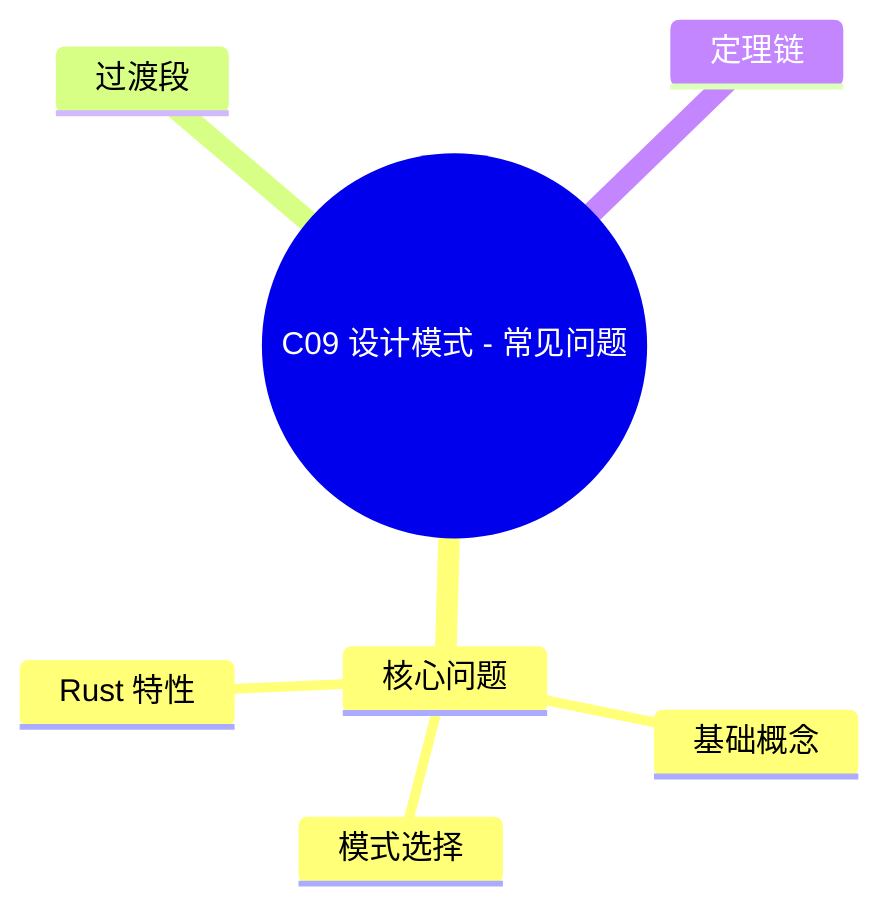

> **EN**: Design Patterns FAQ
> **Summary**: Authoritative concept page for `C09 设计模式 - 常见问题`. Content migrated from `crates/c09_design_pattern/docs/tier_01_foundations/04_faq.md`.
> **Rust 版本**: 1.97.0+ (Edition 2024)
> **受众**: [进阶]
> **内容分级**: [综述级]
> **Bloom 层级**: L2-L3
> **权威来源**: 本文件为 `concept/` 权威页。
> **A/S/P 标记**: **A+P** — Application + Procedure
> **双维定位**: A×Eva — 设计模式 FAQ 评估
> **前置依赖**: [Design Patterns](01_patterns.md) · [Design Patterns Glossary](14_design_patterns_glossary.md)
> **后置概念**: [Pattern Selection Best Practices](10_pattern_selection_best_practices.md) · [Engineering and Production Patterns](13_engineering_and_production_patterns.md)
> **定理链**: Common Question ⟹ Pattern Mechanism ⟹ Best Practice
>
> **权威来源**: 本页为 `Design Patterns FAQ` 的权威概念页；crate 文档仅保留导航 stub。

# C09 设计模式 - 常见问题

> **文档类型**: Tier 1 - 基础层
> **文档定位**: 设计模式学习和实践中的常见问题快速解答，新手入门必备
> **项目状态**: ✅ 完整完成
> **相关文档**: [项目概览](/crates/c09_design_pattern/docs/tier_01_foundations/01_project_overview.md) | [主索引导航](/crates/c09_design_pattern/docs/tier_01_foundations/02_navigation.md) | [术语表](/crates/c09_design_pattern/docs/tier_01_foundations/03_glossary.md) | [完整FAQ](/crates/c09_design_pattern/docs/tier_01_foundations/04_faq.md)

**最后更新**: 2025-12-25
**适用版本**: Rust 1.97.0+ (Edition 2024)
**文档类型**: 📚 问题解答

---

## 📋 目录

- [C09 设计模式 - 常见问题](#c09-设计模式---常见问题)
  - [📋 目录](#-目录)
  - [📊 问题索引](#-问题索引)
  - [🎯 核心问题](#-核心问题)
    - [基础概念](#基础概念)
      - [Q1: 什么时候应该使用设计模式？](#q1-什么时候应该使用设计模式)
      - [Q2: Rust 中的设计模式与其他语言有什么不同？](#q2-rust-中的设计模式与其他语言有什么不同)
      - [Q3: 如何选择合适的设计模式？](#q3-如何选择合适的设计模式)
    - [模式选择](#模式选择)
      - [Q4: Rust 中如何实现线程安全的单例模式？](#q4-rust-中如何实现线程安全的单例模式)
      - [Q5: 建造者模式如何保证必填字段？](#q5-建造者模式如何保证必填字段)
    - [Rust 特性](#rust-特性)
      - [Q6: 观察者模式如何避免借用检查问题？](#q6-观察者模式如何避免借用检查问题)
      - [Q7: async/await vs 线程，如何选择？](#q7-asyncawait-vs-线程如何选择)
    - [实践问题](#实践问题)
      - [Q8: 如何在实际项目中应用设计模式？](#q8-如何在实际项目中应用设计模式)
  - [📚 完整FAQ](#-完整faq)
  - [🔗 相关资源](#-相关资源)
    - [内部文档](#内部文档)
  - [**文档状态**: ✅ 活跃维护](#文档状态--活跃维护)
  - [过渡段](#过渡段)
  - [定理链](#定理链)
  - [国际权威参考 / International Authority References（P0 官方 · P1 学术 · P2 生态）](#国际权威参考--international-authority-referencesp0-官方--p1-学术--p2-生态)
  - [🧭 思维导图（Mindmap）](#-思维导图mindmap)
  - [⚠️ 反例与陷阱](#️-反例与陷阱)

---

## 📊 问题索引

**快速跳转**:

- [C09 设计模式 - 常见问题](#c09-设计模式---常见问题)
  - [📋 目录](#-目录)
  - [📊 问题索引](#-问题索引)
  - [🎯 核心问题](#-核心问题)
    - [基础概念](#基础概念)
      - [Q1: 什么时候应该使用设计模式？](#q1-什么时候应该使用设计模式)
      - [Q2: Rust 中的设计模式与其他语言有什么不同？](#q2-rust-中的设计模式与其他语言有什么不同)
      - [Q3: 如何选择合适的设计模式？](#q3-如何选择合适的设计模式)
    - [模式选择](#模式选择)
      - [Q4: Rust 中如何实现线程安全的单例模式？](#q4-rust-中如何实现线程安全的单例模式)
      - [Q5: 建造者模式如何保证必填字段？](#q5-建造者模式如何保证必填字段)
    - [Rust 特性](#rust-特性)
      - [Q6: 观察者模式如何避免借用检查问题？](#q6-观察者模式如何避免借用检查问题)
      - [Q7: async/await vs 线程，如何选择？](#q7-asyncawait-vs-线程如何选择)
    - [实践问题](#实践问题)
      - [Q8: 如何在实际项目中应用设计模式？](#q8-如何在实际项目中应用设计模式)
  - [📚 完整FAQ](#-完整faq)
  - [🔗 相关资源](#-相关资源)
    - [内部文档](#内部文档)
  - [**文档状态**: ✅ 活跃维护](#文档状态--活跃维护)
  - [过渡段](#过渡段)
  - [定理链](#定理链)
  - [国际权威参考 / International Authority References（P0 官方 · P1 学术 · P2 生态）](#国际权威参考--international-authority-referencesp0-官方--p1-学术--p2-生态)
  - [🧭 思维导图（Mindmap）](#-思维导图mindmap)
  - [⚠️ 反例与陷阱](#️-反例与陷阱)

---

## 🎯 核心问题

本章 FAQ 按四个层面组织 Rust 设计模式的常见疑问，每个问题给出**判定依据**而非笼统建议：

- **基础概念**：设计模式的适用边界——什么算“重复出现的设计问题”，何时引入模式反而增加复杂度（over-engineering 的识别信号）。
- **模式选择**：在创建型/结构型/行为型三大类之间做选择的决策标准，以及同一问题多种模式并存时的取舍（如 Builder vs 类型状态）。
- **Rust 特性**：所有权（Ownership）、借用检查、`Send`/`Sync` 对经典 GoF 模式的改造——例如 Java 的 Observer 在 Rust 中必须处理回调生命周期（Lifetimes），Singleton 被 `OnceLock`/`LazyLock` 取代。
- **实践问题**：测试、性能与团队约定层面的落地经验。

阅读建议：先用「基础概念」校准“是否需要模式”，再按问题域跳查。

### 基础概念

本节从 Q1: 什么时候应该使用设计模式？、Q2: Rust 中的设计模式与其他语言有什么不同？与Q3: 如何选择合适的设计模式？切入，剖析「基础概念」的核心内容。

#### Q1: 什么时候应该使用设计模式？

**A**: 设计模式应该在遇到特定问题时有针对性地使用：

✅ **适合使用设计模式的场景**:

- 遇到重复出现的设计问题
- 需要提高代码的可维护性和可扩展性
- 团队协作需要统一的架构语言
- 需要解耦复杂的依赖关系

❌ **不适合使用设计模式的场景**:

- 过度设计简单功能
- 为了使用模式而使用模式
- 增加不必要的抽象层次
- 性能敏感且模式引入开销的场景

**决策树**:

```text
需要解决设计问题？
├─ 是 → 问题是否重复出现？
│   ├─ 是 → 是否有现成的模式？
│   │   ├─ 是 → 使用设计模式 ✅
│   │   └─ 否 → 考虑创建新模式
│   └─ 否 → 简单解决方案即可
└─ 否 → 不需要设计模式
```

**相关**: [](tier_01_foundations/04_faq.md完整FAQ) | [项目概览](/crates/c09_design_pattern/docs/tier_01_foundations/01_project_overview.md)

---

#### Q2: Rust 中的设计模式与其他语言有什么不同？

**A**: Rust 的设计模式实现有以下独特之处：

**1. 所有权（Ownership）系统**:

- 无需担心内存泄漏
- 借用检查器防止数据竞争
- 生命周期（Lifetimes）系统保证安全

**2. 零成本抽象（Zero-Cost Abstraction）**:

- 泛型（Generics）单态化（Monomorphization），无运行时（Runtime）开销
- Trait 对象可选，按需使用
- 编译时优化

**3. 类型级编程**:

- Typestate 模式编译时保证状态
- 类型系统（Type System）防止错误
- 零运行时（Runtime）开销

**对比矩阵**:

| 特性     | Java/C++   | Rust                  |
| :--- | :--- | :--- || 内存安全（Memory Safety） | 手动管理   | 编译时保证 ✅         |
| 并发安全（Concurrency Safety） | 需要锁     | Send/Sync 自动推导 ✅ |
| 性能开销 | 虚函数表   | 零成本抽象（Zero-Cost Abstraction） ✅         |
| 状态保证 | 运行时（Runtime）检查 | 编译时检查 ✅         |

**相关**: [](tier_01_foundations/04_faq.md完整FAQ) | [术语表](/crates/c09_design_pattern/docs/tier_01_foundations/03_glossary.md)

---

#### Q3: 如何选择合适的设计模式？

**A**: 根据问题类型和需求选择：

**决策树**:

```text
需要解决的问题类型？
├─ 对象创建问题
│   ├─ 需要全局唯一实例 → Singleton
│   ├─ 需要封装创建逻辑 → Factory
│   ├─ 需要复杂对象构建 → Builder (Typestate)
│   └─ 需要对象克隆 → Prototype
├─ 对象结构问题
│   ├─ 接口不兼容 → Adapter
│   ├─ 需要动态添加功能 → Decorator
│   ├─ 需要控制访问 → Proxy
│   └─ 需要简化接口 → Facade
└─ 对象行为问题
    ├─ 需要事件通知 → Observer
    ├─ 需要算法切换 → Strategy
    ├─ 需要状态管理 → State (Typestate)
    └─ 需要请求封装 → Command
```

**选择矩阵**:

| 问题         | 推荐模式  | 原因                 |
| :--- | :--- | :--- |
| 全局配置     | Singleton | 唯一实例             |
| 复杂对象构建 | Builder   | 类型安全构建         |
| 接口不兼容   | Adapter   | 接口转换             |
| 动态功能扩展 | Decorator | 零成本包装           |
| 算法切换     | Strategy  | 编译时/运行时多态    |
| 事件通知     | Observer  | 一对多依赖           |
| 状态管理     | State     | Typestate 编译时保证 |

**相关**: [](tier_01_foundations/04_faq.md完整FAQ) | [主索引导航](/crates/c09_design_pattern/docs/tier_01_foundations/02_navigation.md)

---

### 模式选择

「模式选择」部分包含 Q4: Rust 中如何实现线程安全的单例模式？ 与  Q5: 建造者模式如何保证必填字段？ 两条主线，本节依次说明。

#### Q4: Rust 中如何实现线程安全的单例模式？

**A**: 使用 `OnceLock` (Rust 1.97.0+):

**推荐实现**:

```rust
use std::sync::OnceLock;

struct Config {
    value: String,
}

static CONFIG: OnceLock<Config> = OnceLock::new();

fn get_config() -> &'static Config {
    CONFIG.get_or_init(|| {
        Config {
            value: "default".to_string(),
        }
    })
}
```

**特点**:

- ✅ 线程安全
- ✅ 延迟初始化
- ✅ 标准库支持，无需外部依赖
- ✅ 零运行时开销（初始化后）

**vs lazy_static**: `OnceLock` 是标准库类型，更推荐使用

**相关**: [](tier_01_foundations/04_faq.md完整FAQ) | [术语表](/crates/c09_design_pattern/docs/tier_01_foundations/03_glossary.md#oncelock)

---

#### Q5: 建造者模式如何保证必填字段？

**A**: 使用 Typestate 模式在编译时保证：

**Typestate 实现**:

```rust,ignore
struct RequestBuilder<State = NoUrl> {
    url: Option<String>,
    _state: std::marker::PhantomData<State>,
}

struct NoUrl;
struct HasUrl;

impl RequestBuilder<NoUrl> {
    fn new() -> Self {
        Self {
            url: None,
            _state: std::marker::PhantomData,
        }
    }

    fn url(self, url: String) -> RequestBuilder<HasUrl> {
        RequestBuilder {
            url: Some(url),
            _state: std::marker::PhantomData,
        }
    }
}

impl RequestBuilder<HasUrl> {
    fn build(self) -> Request {
        Request {
            url: self.url.unwrap(),
        }
    }
}

// 使用：编译时保证必须设置 URL
let request = RequestBuilder::new()
    .url("https://example.com".to_string())
    .build(); // ✅ 类型安全
```

**优势**:

- ✅ 编译时验证
- ✅ 零运行时开销
- ✅ 防止非法状态

**相关**: [](tier_01_foundations/04_faq.md完整FAQ) | [术语表](/crates/c09_design_pattern/docs/tier_01_foundations/03_glossary.md#typestate-模式)

---

### Rust 特性

本节围绕「Rust 特性」展开，覆盖 Q6: 观察者模式如何避免借用检查问题？ 与  Q7: async/await vs 线程，如何选择？ 两个方面。

#### Q6: 观察者模式如何避免借用检查问题？

**A**: 使用 Channel 或 GATs 借用视图：

**方法1: Channel (推荐)**:

```rust,ignore
use std::sync::mpsc;

struct Subject {
    observers: Vec<mpsc::Sender<Event>>,
}

impl Subject {
    fn notify(&self, event: Event) {
        for observer in &self.observers {
            let _ = observer.send(event.clone());
        }
    }
}
```

**方法2: GATs 借用视图**:

```rust
trait Observer {
    type View<'a>: 'a where Self: 'a;
    fn update(&self, data: Self::View<'_>);
}
```

**对比**:

| 方法    | 优点             | 缺点         |
| :--- | :--- | :--- || Channel | 简单、解耦       | 需要克隆数据 |
| GATs    | 零拷贝、类型安全 | 复杂度较高   |

**相关**: [](tier_01_foundations/04_faq.md完整FAQ) | [术语表](/crates/c09_design_pattern/docs/tier_01_foundations/03_glossary.md#gats-generic-associated-types)

---

#### Q7: async/await vs 线程，如何选择？

**A**: 根据场景选择：

**决策树**:

```text
需要并发处理？
├─ CPU 密集型任务 → 线程 ✅
│   └─ 使用 rayon 或 threadpool
├─ I/O 密集型任务 → async/await ✅
│   └─ 使用 tokio 或 smol
└─ 混合场景
    ├─ 主要 I/O → async/await
    └─ 主要 CPU → 线程
```

**对比矩阵**:

| 特性       | 线程             | async/await  |
| :--- | :--- | :--- || CPU 密集型 | ✅ 适合          | ❌ 不适合    |
| I/O 密集型 | ⚠️ 资源浪费      | ✅ 高效      |
| 内存开销   | 较高（每线程栈） | 较低（协程） |
| 上下文切换 | 操作系统调度     | 用户态调度   |
| 适用场景   | 并行计算         | 异步（Async） I/O     |

**相关**: [](tier_01_foundations/04_faq.md完整FAQ) | [术语表](/crates/c09_design_pattern/docs/tier_01_foundations/03_glossary.md#asyncawait)

---

### 实践问题

「实践问题」部分的核心主题是 Q8: 如何在实际项目中应用设计模式？，本节展开说明。

#### Q8: 如何在实际项目中应用设计模式？

**A**: 遵循渐进式原则：

**步骤1: 识别问题**:

- 重复代码模式
- 紧耦合的组件
- 难以扩展的结构

**步骤2: 选择模式**:

- 参考决策树（Q3）
- 考虑性能约束
- 评估团队熟悉度

**步骤3: 小步重构**:

- 从局部开始
- 编写测试保护
- 渐进式改进

**步骤4: 验证效果**:

- 代码可读性
- 可维护性
- 性能基准

**反模式警告**:

- ❌ 过度工程化
- ❌ 为了模式而模式
- ❌ 忽略简单解决方案

**相关**: [](tier_01_foundations/04_faq.md完整FAQ) | [项目概览](/crates/c09_design_pattern/docs/tier_01_foundations/01_project_overview.md)

---

## 📚 完整FAQ

本文档提供了核心问题的快速参考。如需查看完整的FAQ（包含更多问题、详细解答、代码示例等），请参阅：

- **[完整FAQ](/crates/c09_design_pattern/docs/tier_01_foundations/04_faq.md)** - 包含 17+ 个常见问题的详细解答

**完整FAQ包含**:

- ✅ 基础概念（本文档已覆盖）
- ✅ 创建型模式（Q4-Q5）
- ✅ 结构型模式（适配器 vs 桥接、装饰器 vs 代理）
- ✅ 行为型模式（观察者、状态 vs 策略）
- ✅ 并发与异步（async/await、Actor vs Reactor、异步递归）
- ✅ 性能优化（性能影响、性能测量）
- ✅ Rust特性（Rust 1.92.0 新特性）
- ✅ 实践问题（项目应用、团队统一）

---

## 🔗 相关资源

以下资源按学习深度分层组织，与本 FAQ 互补而非重复：

- **Tier 1 基础**：适合首次接触 c09 设计模式 crate 的读者，先建立模块（Module）地图与术语表，再回来查阅本 FAQ 的具体问题。
- **核心资源**：800+ 行可编译示例集与综合指南，提供本 FAQ 各答案的完整代码上下文。
- **深度理论**：并发模式（Actor/Reactor、CSP vs Async）与形式化验证章节，回答本 FAQ 中“为什么 Rust 需要不同的并发模式”这类问题的理论根基。

选择路径：概念疑问 → 本 FAQ；代码实现 → 实战示例集；原理推导 → 深度理论。

### 内部文档

**Tier 1 基础**:

- [项目概览](/crates/c09_design_pattern/docs/tier_01_foundations/01_project_overview.md) - 模块（Module）介绍、学习路径
- [主索引导航](/crates/c09_design_pattern/docs/tier_01_foundations/02_navigation.md) - 完整导航系统
- [术语表](/crates/c09_design_pattern/docs/tier_01_foundations/03_glossary.md) - 核心术语参考

**核心资源**:

- [完整FAQ](/crates/c09_design_pattern/docs/tier_01_foundations/04_faq.md) - 所有问题详细解答
- [综合指南](/crates/c09_design_pattern/docs/20_rust_design_patterns_comprehensive_guide_theory_practice_formal_verification.md) - 完整模式指南
- [实战示例集](/crates/c09_design_pattern/docs/18_rust_190_examples_collection.md) - 800+行代码示例

**深度理论**:

- [形式化理论体系](/crates/c09_design_pattern/docs/tier_04_advanced/README.md) - 高级主题
- [Actor/Reactor模式](/crates/c09_design_pattern/docs/01_actor_reactor_patterns.md) - 并发模式深入
- [CSP vs Async](/crates/c09_design_pattern/docs/06_csp_vs_async_analysis.md) - 并发模型对比

---

**下一步**: 阅读 [主索引导航](/crates/c09_design_pattern/docs/tier_01_foundations/02_navigation.md) 规划学习路径，或查看 [完整FAQ](/crates/c09_design_pattern/docs/tier_01_foundations/04_faq.md) 获取更多解答！

---

**文档维护**: Documentation Team
**创建日期**: 2025-12-25
**最后更新**: 2025-12-25
**适用版本**: Rust 1.97.0+
**文档状态**: ✅ 活跃维护
---

> **权威来源**: [Rust Reference](https://doc.rust-lang.org/reference/), [The Rust Programming Language](https://doc.rust-lang.org/book/), [Rust Standard Library](https://doc.rust-lang.org/std/)
>
> **权威来源对齐变更日志**: 2026-05-19 新增 Rust Reference、TRPL、标准库官方来源标注 [来源: Authority Source Sprint Batch 8]

**文档版本**: 1.1
**最后更新**: 2026-05-19
**状态**: ✅ 权威来源对齐完成 (Batch 8)

---

> **向下引用（Reference）**: 参见 [03_paradigm_matrix](../../05_comparative/00_paradigms/01_paradigm_matrix.md)

## 过渡段

> **过渡**: 从常见问题过渡到机制解释，可以理解“为什么”比“怎么做”更能避免重复踩坑。
>
> **过渡**: 从机制解释过渡到权衡分析，可以建立基于场景而非偏好的选型依据。
>
> **过渡**: 从权衡分析过渡到最佳实践，可以将 FAQ 答案转化为团队工程规范。
>

## 定理链

| 定理 | 前提 | 结论 |
|:---|:---|:---|
| 问题覆盖 ⟹ 减少重复询问 | 集中回答高频困惑 | 降低支持成本 |
| 示例验证 ⟹ 答案可信 | 可运行的最小代码 | 确保 FAQ 解决方案正确 |
| 决策规则 ⟹ 一致性（Coherence） | 将 FAQ 提炼为选型原则 | 提升工程一致性 |

---

## 国际权威参考 / International Authority References（P0 官方 · P1 学术 · P2 生态）

> 依据 `AGENTS.md` §2「对齐网络国际化权威内容」补充：仅追加已验证可达的权威链接，不改动正文事实。

- **P1 学术/形式化**: [Design Patterns: Elements of Reusable Object-Oriented Software (GoF, ACM DL)](https://dl.acm.org/doi/book/10.5555/95489)
- **P2 生态/社区**: [Refactoring.Guru — Design Patterns](https://refactoring.guru/design-patterns)

## 🧭 思维导图（Mindmap）



## ⚠️ 反例与陷阱

**陷阱（`Rc<RefCell<T>>` 引用（Reference）环泄漏）**：用 `Rc` 实现双向链表/图时，双向强引用形成环，引用计数永远到不了 0，内存永不释放——这是运行期陷阱，编译器不会报错：

```rust
use std::cell::RefCell;
use std::rc::{Rc, Weak};

struct Node {
    next: RefCell<Option<Rc<Node>>>,
    prev: RefCell<Option<Weak<Node>>>, // 修正：反向边用 Weak 打断环
}

fn main() {
    let a = Rc::new(Node { next: RefCell::new(None), prev: RefCell::new(None) });
    let b = Rc::new(Node { next: RefCell::new(None), prev: RefCell::new(None) });
    *a.next.borrow_mut() = Some(Rc::clone(&b));
    *b.prev.borrow_mut() = Some(Rc::downgrade(&a));
    assert_eq!(Rc::strong_count(&a), 1); // 若 prev 也是 Rc，此处会是 2 且永久泄漏
}
```

> 经验法则：所有权图必须是树/ DAG——环中的至少一条边降级为 `Weak`，或用索引（`Vec` + `usize`）替代指针式结构。
