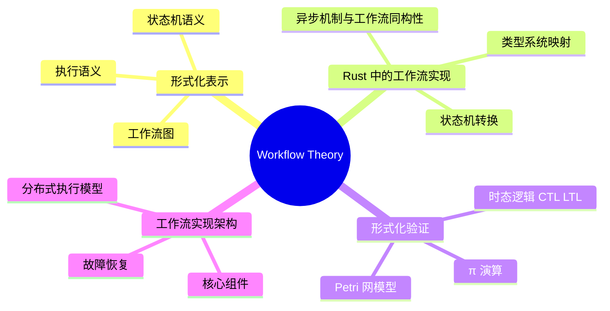

> **内容分级**: [综述级]
> [专家级]
> **代码状态**: ✅ 含可编译示例
> **定理链**: N/A — 描述性/综述性/导航性文档，不涉及形式化定理链
>
# Workflow Theory & Formalization（工作流理论与形式化）
>
> **EN**: Formal Methods
> **Summary**: Formal Methods. Guide to 41 Workflow Theory.
> **Rust 版本**: 1.97.0+ (Edition 2024)
>
> **受众**: [进阶]
> **Bloom 层级**: L4-L5
> **权威来源**: 本文件为 `concept/` 权威页。
> **A/S/P 标记**: **S+A+P** — Structure + Application + Procedure
> **双维定位**: P×Eva — 评价工作流模型的形式化正确性
> **前置依赖**: [Async/Await](../../03_advanced/01_async/01_async.md) ·
> 异步（Async）状态机 ·
> [公理语义](../../04_formal/03_operational_semantics/05_axiomatic_semantics.md) ·
> [类型语义](../../04_formal/00_type_theory/06_type_semantics.md)
> **后置延伸**: [CQRS & Event Sourcing](07_cqrs_event_sourcing.md) ·
> [Reactive Programming](../04_web_and_networking/09_reactive_programming.md) ·
> [分布式系统](../04_web_and_networking/01_distributed_systems.md)
>
> **来源**: [Rust API Guidelines](https://rust-lang.github.io/api-guidelines/) · [Cargo Book](https://doc.rust-lang.org/cargo/index.html) · [TRPL](https://doc.rust-lang.org/book/title-page.html) · [Jung et al. — RustBelt: Securing the Foundations of Rust](https://plv.mpi-sws.org/rustbelt/popl18/)
> **前置概念**: N/A
---

> **来源**: [Workflow Management Coalition — Terminology & Glossary](https://wfmc.org/wp-content/uploads/2022/09/TC-1011_term_glossary_v3.pdf) ·
> [来源: [WfMC — Terminology](https://wfmc.org/wp-content/uploads/2022/09/TC-1011_term_glossary_v3.pdf)] · [来源: [van der Aalst — Process Mining](https://www.springer.com/gp/book/9783662498507)]
> [van der Aalst — Process Mining](https://www.springer.com/gp/book/9783662498507) ·
> [Petri Nets](https://www.informatik.uni-hamburg.de/TGI/PetriNets/) ·
> [Milner — Communicating and Mobile Systems: The π-Calculus](https://www.amazon.com/Communicating-Mobile-Systems-Calculus-Cambridge/dp/0521658691) ·
> [Clarke & Emerson — Design and Synthesis of Synchronization Skeletons](https://dl.acm.org/doi/10.1145/567446.567462) ·
> [Rust async-book](https://rust-lang.github.io/async-book/index.html)
> [来源: [WfMC — Reference Model](https://wfmc.org/public-documents/)] · [来源: [van der Aalst — Process Mining](https://www.springer.com/gp/book/9783662498507)] · [来源: [Workflow Patterns](http://www.workflowpatterns.com/)]
> **后置概念**: [Future Roadmap](../../07_future/01_edition_roadmap/04_roadmap.md)
> **前置依赖**: [Type Theory](../../04_formal/00_type_theory/01_type_theory.md)
> **前置依赖**: [Rust vs C++](../../05_comparative/01_systems_languages/01_rust_vs_cpp.md)

## 📑 目录

- [Workflow Theory \& Formalization（工作流理论与形式化）](#workflow-theory--formalization工作流理论与形式化)
  - [📑 目录](#-目录)
  - [一、权威定义（Definition）](#一权威定义definition)
    - [1.1 工作流管理联盟（WfMC）定义](#11-工作流管理联盟wfmc定义)
    - [1.2 工作流模型分类](#12-工作流模型分类)
    - [1.3 BPMN 与形式化语义](#13-bpmn-与形式化语义)
  - [二、概念属性矩阵](#二概念属性矩阵)
  - [三、形式化表示](#三形式化表示)
    - [3.1 工作流图](#31-工作流图)
    - [3.2 状态机语义](#32-状态机语义)
    - [3.3 执行语义](#33-执行语义)
  - [四、Rust 中的工作流实现](#四rust-中的工作流实现)
    - [4.1 异步机制与工作流同构性](#41-异步机制与工作流同构性)
    - [4.2 类型系统映射](#42-类型系统映射)
    - [4.3 状态机转换](#43-状态机转换)
  - [五、形式化验证](#五形式化验证)
    - [5.1 Petri 网模型](#51-petri-网模型)
    - [5.2 π 演算](#52-π-演算)
    - [5.3 时态逻辑（CTL/LTL）](#53-时态逻辑ctlltl)
  - [六、工作流实现架构](#六工作流实现架构)
    - [6.1 核心组件](#61-核心组件)
    - [6.2 分布式执行模型](#62-分布式执行模型)
    - [6.3 故障恢复](#63-故障恢复)
  - [七、反命题与边界](#七反命题与边界)
    - [7.1 反命题树](#71-反命题树)
    - [7.2 边界极限](#72-边界极限)
  - [八、边界测试](#八边界测试)
    - [8.1 边界测试：状态机转换遗漏导致死代码（编译/逻辑错误）](#81-边界测试状态机转换遗漏导致死代码编译逻辑错误)
    - [8.2 边界测试：Petri 网可达性分析的 state explosion（运行时性能）](#82-边界测试petri-网可达性分析的-state-explosion运行时性能)
    - [8.3 边界测试：工作流循环缺乏终止条件导致无限执行（运行时错误）](#83-边界测试工作流循环缺乏终止条件导致无限执行运行时错误)
  - [相关概念](#相关概念)
  - [嵌入式测验（Embedded Quiz）](#嵌入式测验embedded-quiz)
    - [测验 1：工作流编排（Workflow Orchestration）与事件驱动架构（EDA）有什么区别？（理解层）](#测验-1工作流编排workflow-orchestration与事件驱动架构eda有什么区别理解层)
    - [测验 2：Rust 中实现状态机工作流时，`enum` 和 `match` 有什么优势？（理解层）](#测验-2rust-中实现状态机工作流时enum-和-match-有什么优势理解层)
    - [测验 3：什么是" Saga 模式"的补偿事务（Compensating Transaction）？（理解层）](#测验-3什么是-saga-模式的补偿事务compensating-transaction理解层)
    - [测验 4：在 Rust 中，`tokio::task::JoinSet` 如何帮助实现并行工作流步骤？（理解层）](#测验-4在-rust-中tokiotaskjoinset-如何帮助实现并行工作流步骤理解层)
    - [测验 5：为什么长时间运行的工作流需要"持久化状态"（Durable State）？（理解层）](#测验-5为什么长时间运行的工作流需要持久化状态durable-state理解层)
  - [认知路径](#认知路径)
    - [核心推理链](#核心推理链)
  - [🧭 思维导图（Mindmap）](#-思维导图mindmap)

**变更日志**:

- v1.0 (2026-05-25): 从 docs/08_usage_guides/workflow/01_workflow_theory.md 迁移重构——保留 WfMC 定义、Petri 网、π 演算、时态逻辑等国际标准内容，移除非标准的 AI 融合章节，适配 concept/ 格式（Bloom + 来源 + 边界测试）

---

## 一、权威定义（Definition）

工作流的权威定义来自三个互补视角，合起来界定“什么算工作流系统”：

- **WfMC 定义**: 工作流管理联盟将工作流定义为“业务过程的全部或部分自动化，文档/信息/任务按一组过程规则在参与者间传递”；该定义确立了过程模型（process model）与执行引擎（enactment service）的二分。
- **工作流模型分类**: 按控制结构分为顺序、并行（AND-split/join）、选择（OR/XOR-split/join）、循环四类基本构造；按执行语义分为编排（orchestration，中心调度）与编舞（choreography，点对点事件驱动）。
- **BPMN 与形式化语义**: BPMN 2.0 是图形化事实标准，但其语义由 Petri 网/过程演算映射给出——同一 BPMN 图在不同引擎上的执行差异，根源正是形式化语义的解释空间。

判定依据：评估工作流产品时，先问其执行语义是否有形式化定义，而非只看图形建模能力。

### 1.1 工作流管理联盟（WfMC）定义

> **[Workflow Management Coalition — Terminology & Glossary](https://wfmc.org/wp-content/uploads/2022/09/TC-1011_term_glossary_v3.pdf)** 工作流（Workflow）是业务流程的全部或部分自动化，在此过程中，文档、信息或任务按照一组程序化的规则，从一个参与者传递到另一个参与者以执行动作。

```text
WfMC 工作流参考模型（1995）:
┌─────────────────────────────────────────────────────────────┐
│                    工作流客户端应用                          │
│                   (Workflow Client Application)             │
└──────────────────────┬──────────────────────────────────────┘
                       │ 接口 2
┌──────────────────────▼──────────────────────────────────────┐
│                  工作流引擎/服务                             │
│             (Workflow Enactment Service)                    │
│  ┌──────────────┐  ┌──────────────┐  ┌──────────────┐       │
│  │ 过程定义工具  │  │ 工作流引擎    │  │ 管理监控工具  │       │
│  │ (Interface 1)│  │ (核心)       │  │ (Interface 5)│       │
│  └──────────────┘  └──────────────┘  └──────────────┘       │
└──────┬───────────────┬───────────────┬──────────────┬───────┘
       │ 接口 3        │ 接口 4        │ 接口 1
       ▼               ▼               ▼
  ┌─────────┐   ┌─────────────┐   ┌──────────────┐
  │ 被调用  │   │ 其他工作流   │   │ 过程定义    │
  │ 应用    │   │ 引擎        │   │ (XPDL/BPMN) │
  └─────────┘   └─────────────┘   └──────────────┘
```

> **来源**: [WfMC — Reference Model](https://wfmc.org/public-documents/) ·
> [来源: [Milner — π-Calculus](https://www.amazon.com/Communicating-Mobile-Systems-Calculus-Cambridge/dp/0521658691)] · [来源: [Clarke & Emerson 1981](https://dl.acm.org/doi/10.1145/567446.567462)]
> [WfMC — XPDL](https://www.wfmc.org/standards/xpdl)

### 1.2 工作流模型分类

工作流模型按照控制流复杂度可分为以下谱系：

| **模型类别** | **控制流特征** | **形式化工具** | **典型应用** | **Rust 映射** |
| :--- | :--- | :--- | :--- | :--- |
| **顺序工作流** | A → B → C，线性执行 | 有限状态机 | 批处理、ETL | `async` 顺序 await |
| **并行工作流** | A ∥ B → C，fork-join | Petri 网 | MapReduce、CI/CD | `tokio::join!` |
| **条件工作流** | if-then-else 分支 | 状态机 + 守卫条件 | 审批流程 | `match` / `if` |
| **循环工作流** | while / repeat-until | ω-自动机 | 重试、轮询 | `loop` / `while` |
| **动态工作流** | 运行时（Runtime）修改流程图 | π 演算 | 自适应系统 | `dyn Trait` / 状态模式 |
| **协作工作流** | 多参与者交互 | 会话类型 | 多方审批、B2B | Actor / Channel |

```rust,ignore
// 工作流模型在 Rust 中的表达谱系

// 顺序: async 顺序 await
async fn sequential_workflow(input: Input) -> Result<Output> {
    let a = step_a(input).await?;
    let b = step_b(a).await?;
    step_c(b).await
}

// 并行: tokio::join! / futures::join!
async fn parallel_workflow(input: Input) -> Result<(A, B)> {
    let (a, b) = tokio::join!(step_a(input.clone()), step_b(input));
    Ok((a?, b?))
}

// 条件: match / if
async fn conditional_workflow(input: Input) -> Result<Output> {
    match validate(input).await? {
        Validation::Pass => process(input).await,
        Validation::Review => escalate(input).await,
        Validation::Reject => Err(WorkflowError::Rejected),
    }
}

// 循环: loop / while
async fn retry_workflow<F, Fut>(mut f: F, max_retries: u32) -> Result<Output>
where F: FnMut() -> Fut, Fut: Future<Output = Result<Output>>
{
    let mut attempt = 0;
    loop {
        match f().await {
            Ok(result) => return Ok(result),
            Err(e) if attempt < max_retries => {
                attempt += 1;
                tokio::time::sleep(Duration::from_secs(2_u64.pow(attempt))).await;
            }
            Err(e) => return Err(e),
        }
    }
}
```

> **来源**: [WfMC — Workflow Patterns](http://www.workflowpatterns.com/) ·
> [来源: [Plotkin — SOS](https://homepages.inf.ed.ac.uk/gdp/publications/sos_jlap.pdf)] · [来源: [Rust async-book](https://rust-lang.github.io/async-book/index.html)]
> [van der Aalst — Process Mining](https://www.springer.com/gp/book/9783662498507)

### 1.3 BPMN 与形式化语义

> **[OMG — BPMN 2.0 Specification](https://www.omg.org/spec/BPMN/2.0/)** BPMN（Business Process Model and Notation）是业务流程建模的标准图形化表示法。
> 虽然 BPMN 最初是可视化语言，但研究社区已为其建立了多种形式化语义映射：
>
> - **Petri 网语义**（Dijkman 2008）: 将 BPMN 网关映射为 Petri 网变迁
> - **π 演算语义**（Wong & Gibbons 2008）: 将 BPMN 消息流映射为通道通信
> - **时态逻辑语义**（Awad 2010）: 将 BPMN 约束映射为 LTL 公式

```text
BPMN → 形式化语义 的映射:

BPMN 元素          Petri 网               π 演算               LTL
─────────────────────────────────────────────────────────────────────
任务 (Task)        变迁 (Transition)      顺序进程 α.P          ◇completed(task)
网关 (Gateway)     库所分支/合并          选择 P + Q           □(guard → ◇next)
事件 (Event)       带守卫的变迁           输入 x(y).P          ◇(event ∧ ◇handled)
序列流            弧 (Arc)               顺序组合 .           □(step_i → ◇step_{i+1})
消息流            外部库所               通道通信 x⟨y⟩         ◇(sent → ◇received)
池/泳道           子网                   限制 νx.P             □(role → ◇action)
```

> **来源**: [OMG BPMN 2.0](https://www.omg.org/spec/BPMN/2.0/) ·
> [Dijkman 2008 — BPMN to Petri Nets](https://www.researchgate.net/publication/220659968_Semantics_and_analysis_of_business_process_models_in_BPMN) ·
> [Wong & Gibbons 2008](https://doi.org/10.1007/978-3-540-89743-1_8)

---

## 二、概念属性矩阵

| **维度** | **顺序** | **并行** | **条件** | **循环** | **动态** |
| :--- | :--- | :--- | :--- | :--- | :--- |
| **形式化复杂度** | 低（FSM） | 中（Petri 网） | 低（守卫 FSM） | 中（ω-自动机） | 高（π 演算）|
| **可验证性** | 完全可判定 | 可达性问题可判定 | 完全可判定 | 终止性不可判定 | 互模拟不可判定 |
| **Rust 表达力** | 直接 | `join!` | `match` | `loop` | `dyn` + 状态模式 |
| **典型错误** | 遗漏步骤 | 竞争条件 | 条件遗漏 | 无限循环 | 类型不匹配 |
| **验证工具** | 穷举测试 | Petri 网工具 | 属性测试 | 不动点检测 | 模型检验 |

> **来源**: [van der Aalst — Process Mining](https://www.springer.com/gp/book/9783662498507) ·
> [Workflow Patterns](http://www.workflowpatterns.com/)

---

## 三、形式化表示

工作流的形式化表示有三层，表达能力递增：

1. **工作流图（DAG/有向图）**：节点为活动，边为控制流依赖；只能表达顺序、分支、汇合，无法表达并发同步与资源竞争。BPMN 流程图即此层。
2. **状态机语义**：把工作流实例建模为 `(状态集合, 事件, 转换函数)` 三元组；Rust 中直接映射为 `enum State` + `match` 转换——类型系统保证非法转换是编译错误（未处理的 match 分支），这是 Rust 实现工作流的核心优势。
3. **Petri 网**：引入库所（place）与令牌（token），可形式化表达并发、同步、互斥与死锁；可达性分析（reachability）回答「工作流是否可能到达死状态」等验证问题，代价是状态爆炸。

判定依据：编排逻辑简单 → 状态机即可；需证明无死锁/活锁 → 建 Petri 网模型；仅文档沟通 → BPMN 图。

### 3.1 工作流图
>

工作流图是一个有向图，节点表示活动，边表示控制流依赖：

```text
工作流图 G = (V, E, λ, μ):
  - V: 节点集合（活动/任务）
  - E ⊆ V × V: 边集合（控制流）
  - λ: V → {start, task, decision, merge, fork, join, end}: 节点类型
  - μ: E → Guard: 边守卫条件

BPMN 示例: 订单审批流程
  [Start] → [验证订单] → {决策: 金额 > 1000?}
                │
        是 ─────┴───── 否
        │                │
    [经理审批]       [自动通过]
        │                │
        └──────┬─────────┘
               │
           [发货] → [End]
```

```rust,ignore
// Rust 中的工作流图表示
#[derive(Debug, Clone)]
enum NodeType {
    Start,
    Task(String),       // 任务名称
    Decision(Box<dyn Fn(&Context) -> bool + Send + Sync>),
    Merge,
    Fork,
    Join,
    End,
}

#[derive(Debug, Clone)]
struct WorkflowNode {
    id: Uuid,
    node_type: NodeType,
}

#[derive(Debug, Clone)]
struct WorkflowEdge {
    from: Uuid,
    to: Uuid,
    guard: Option<Box<dyn Fn(&Context) -> bool + Send + Sync>>,
}

#[derive(Debug)]
struct WorkflowGraph {
    nodes: HashMap<Uuid, WorkflowNode>,
    edges: Vec<WorkflowEdge>,
    adjacency: HashMap<Uuid, Vec<Uuid>>,
}

impl WorkflowGraph {
    fn successors(&self, node_id: Uuid) -> Vec<&WorkflowNode> {
        self.adjacency.get(&node_id)
            .map(|ids| ids.iter().filter_map(|id| self.nodes.get(id)).collect())
            .unwrap_or_default()
    }

    fn is_valid(&self) -> Result<(), WorkflowError> {
        // 1. 有且仅有一个 Start 节点
        let starts: Vec<_> = self.nodes.values()
            .filter(|n| matches!(n.node_type, NodeType::Start))
            .collect();
        if starts.len() != 1 {
            return Err(WorkflowError::InvalidStartCount(starts.len()));
        }
        // 2. 至少有一个 End 节点
        let ends: Vec<_> = self.nodes.values()
            .filter(|n| matches!(n.node_type, NodeType::End))
            .collect();
        if ends.is_empty() {
            return Err(WorkflowError::NoEndNode);
        }
        // 3. 无孤立节点
        for node in self.nodes.values() {
            if self.adjacency.get(&node.id).map(|v| v.is_empty()).unwrap_or(true)
                && !matches!(node.node_type, NodeType::End)
            {
                return Err(WorkflowError::DanglingNode(node.id));
            }
        }
        Ok(())
    }
}
```

> **来源**: [WfMC — XPDL](https://www.wfmc.org/standards/xpdl) ·
> [Workflow Patterns — Control Flow](http://www.workflowpatterns.com/patterns/control/)

### 3.2 状态机语义
>

工作流的执行可以被形式化为**状态转换系统**（Transition System）：

```text
工作流状态机 M = (S, s₀, T, F):
  - S: 状态集合（每个节点一个状态：Ready | Running | Completed | Failed）
  - s₀ ∈ S: 初始状态（Start 节点为 Ready）
  - T ⊆ S × Action × S: 状态转换关系
  - F ⊆ S: 终止状态集合（End 节点为 Completed）

状态转换规则:
  Ready ──start()──→ Running
  Running ──complete()──→ Completed
  Running ──fail()──→ Failed
  Failed ──retry()──→ Ready
  Completed ──next()──→ Ready(下一个节点)
```

```rust,ignore
// Rust 中的工作流状态机
#[derive(Debug, Clone, PartialEq)]
enum TaskState {
    Ready,
    Running,
    Completed,
    Failed { error: String, retry_count: u32 },
}

struct WorkflowStateMachine {
    states: HashMap<Uuid, TaskState>,
    graph: WorkflowGraph,
}

impl WorkflowStateMachine {
    fn new(graph: WorkflowGraph) -> Self {
        let mut states = HashMap::new();
        for node in graph.nodes.values() {
            let initial = match node.node_type {
                NodeType::Start => TaskState::Ready,
                _ => TaskState::Ready, // 等待前置条件
            };
            states.insert(node.id, initial);
        }
        Self { states, graph }
    }

    fn can_execute(&self, node_id: Uuid) -> bool {
        match self.states.get(&node_id) {
            Some(TaskState::Ready) => {
                // 检查所有前置节点是否已完成
                self.graph.predecessors(node_id).iter().all(|pred| {
                    matches!(self.states.get(&pred.id), Some(TaskState::Completed))
                })
            }
            _ => false,
        }
    }

    fn transition(&mut self, node_id: Uuid, action: Action) -> Result<(), StateError> {
        let current = self.states.get(&node_id).ok_or(StateError::UnknownNode)?;
        let new_state = match (current, action) {
            (TaskState::Ready, Action::Start) => TaskState::Running,
            (TaskState::Running, Action::Complete) => TaskState::Completed,
            (TaskState::Running, Action::Fail(error)) => {
                TaskState::Failed { error, retry_count: 0 }
            }
            (TaskState::Failed { error, retry_count }, Action::Retry) => {
                TaskState::Ready
            }
            _ => return Err(StateError::InvalidTransition),
        };
        self.states.insert(node_id, new_state);
        Ok(())
    }
}

enum Action {
    Start,
    Complete,
    Fail(String),
    Retry,
}
```

> **来源**: [Workflow Patterns — State Patterns](http://www.workflowpatterns.com/patterns/state/) · van der Aalst — Workflow Management（Springer，原链接已失效）

### 3.3 执行语义
>

工作流的**操作语义**定义了从初始状态到终止状态的合法执行路径：

```text
操作语义（大步语义 / Big-Step）:

───────── [Start]
Start ↓ Completed

W₁ ↓ s₁    W₂ ↓ s₂
─────────────────── [Sequence]
W₁ ; W₂ ↓ s₂

W₁ ↓ s₁
─────────────────── [Branch-True]  (guard 为真)
if guard then W₁ else W₂ ↓ s₁

W₂ ↓ s₂
─────────────────── [Branch-False] (guard 为假)
if guard then W₁ else W₂ ↓ s₂

W₁ ↓ s₁    W₂ ↓ s₂
─────────────────── [Parallel]
W₁ ∥ W₂ ↓ (s₁, s₂)
```

> **来源**: [Plotkin — Structural Operational Semantics](https://homepages.inf.ed.ac.uk/gdp/publications/sos_jlap.pdf) · [Winskel — The Formal Semantics of Programming Languages](https://mitpress.mit.edu/9780262731034/the-formal-semantics-of-programming-languages/)

---

## 四、Rust 中的工作流实现

Rust 异步机制与工作流执行的同构性是本页核心论点：

- **`async fn` 即状态机**：编译器把每个 await 点展开为状态机的转换边，`Future` 的 `poll` 即转换函数——Rust 工作流引擎（如 `temporal` 客户端的思路）本质上是显式化编译器隐式做的事。
- **类型系统映射**：`enum WorkflowState { Created, Approved(Approver), Rejected(Reason), Completed }` 让每个状态的**可用数据**由变体载荷精确表达——`Approved` 状态才有审批人信息，非法访问在编译期被类型错误拒绝，替代了运行时校验。
- **`JoinSet` 并行活动**：`tokio::task::JoinSet` 对应 BPMN 的并行网关（fork/join），`join_next().await` 即汇合点。

判定依据：状态转换逻辑用 `enum`+`match` 显式编码，不要用 `String` 状态名 + `if` 链——后者丢失穷尽性检查。

### 4.1 异步机制与工作流同构性
>

Rust 的 `async/await` 与工作流模型存在**结构同构**（Structural Isomorphism）：

```text
同构映射:
  工作流活动    ↔   async fn
  活动序列      ↔   await 链
  并行分支      ↔   tokio::join!
  条件分支      ↔   match / if
  循环          ↔   loop / while
  异常处理      ↔   Result + ?
  超时          ↔   tokio::time::timeout
  补偿事务      ↔   Drop guard / scope guard
```

```rust,ignore
// 工作流 = 异步函数的复合

// 顺序复合: W₁ ; W₂
async fn sequence<W1, W2, T1, T2>(w1: W1, w2: W2) -> Result<T2>
where W1: Future<Output = Result<T1>>, W2: FnOnce(T1) -> Future<Output = Result<T2>>
{
    let t1 = w1.await?;
    w2(t1).await
}

// 并行复合: W₁ ∥ W₂
async fn parallel<W1, W2, T1, T2>(w1: W1, w2: W2) -> Result<(T1, T2)>
where W1: Future<Output = Result<T1>>, W2: Future<Output = Result<T2>>
{
    tokio::try_join!(w1, w2)  // 任一失败则整体失败
}

// 条件复合: if guard then W₁ else W₂
async fn conditional<T, W1, W2>(
    guard: impl FnOnce() -> bool,
    w1: W1,
    w2: W2,
) -> Result<T>
where W1: Future<Output = Result<T>>, W2: Future<Output = Result<T>>
{
    if guard() { w1.await } else { w2.await }
}

// 循环复合: while guard do W
async fn repeat_while<T, W, G>(mut guard: G, mut w: W) -> Result<()>
where G: FnMut() -> bool, W: FnMut() -> Future<Output = Result<T>>
{
    while guard() {
        w().await?;
    }
    Ok(())
}
```

> **来源**: [Rust async-book](https://rust-lang.github.io/async-book/index.html) · [Tokio — Combinators](https://docs.rs/tokio/latest/tokio/)

### 4.2 类型系统映射
>

Rust 的类型系统（Type System）为工作流组合提供了**编译期保证**：

```rust,ignore
// 工作流作为类型
pub trait Workflow: Future {
    type Input;
    type Output;
    type Error;
}

// 类型安全的工作流组合
pub struct Sequential<W1, W2> {
    first: W1,
    second: W2,
}

impl<W1, W2, T1, T2, E> Future for Sequential<W1, W2>
where
    W1: Workflow<Input = (), Output = T1, Error = E>,
    W2: Workflow<Input = T1, Output = T2, Error = E>,
{
    type Output = Result<T2, E>;

    fn poll(self: Pin<&mut Self>, cx: &mut Context<'_>) -> Poll<Self::Output> {
        // 先 poll first，完成后用输出作为 second 的输入
        let this = unsafe { self.get_unchecked_mut() };
        let first = unsafe { Pin::new_unchecked(&mut this.first) };
        match first.poll(cx) {
            Poll::Pending => Poll::Pending,
            Poll::Ready(Ok(v)) => {
                // 实际应用中：将 v 作为 second 的输入构造新的 workflow
                let second = unsafe { Pin::new_unchecked(&mut this.second) };
                second.poll(cx)
            }
            Poll::Ready(Err(e)) => Poll::Ready(Err(e)),
        }
    }
}

// 编译期保证：顺序组合要求 W1 的输出类型 = W2 的输入类型
// Sequential<W1, W2> 仅在 T1(W1::Output) == T1(W2::Input) 时编译通过
```

> **类型系统（Type System）保证的工作流性质**:
>
> - **输入输出匹配**: 顺序组合时，编译器检查前驱的输出类型与后继的输入类型一致
> - **错误传播**: `Result` 类型强制处理失败路径（`?` 运算符自动传播）
> - **Send/Sync 安全**: 跨线程工作流自动检查线程安全
> - **生命周期（Lifetimes）**: 输入数据的生命周期在编译期验证，不存在 dangling reference
>
> **来源**: [Rust Type System](https://doc.rust-lang.org/reference/type-system.html) · [Rust async-book](https://rust-lang.github.io/async-book/index.html)

### 4.3 状态机转换
>

Rust 编译器将 `async fn` 自动转换为**状态机**，这与工作流状态机模型天然对应：

```rust,ignore
// 源代码
async fn order_workflow(order: Order) -> Result<TrackingNumber> {
    let validated = validate(order).await?;
    let payment = process_payment(validated).await?;
    let shipped = ship_order(payment).await?;
    Ok(shipped.tracking_number)
}

// 编译器生成的状态机（概念等价）
enum OrderWorkflowState {
    Start(Order),
    Validating(Order),
    ProcessingPayment(Order, ValidationResult),
    Shipping(Order, PaymentResult),
    Completed(TrackingNumber),
    Failed(OrderError),
}

impl Future for OrderWorkflowState {
    type Output = Result<TrackingNumber, OrderError>;

    fn poll(mut self: Pin<&mut Self>, cx: &mut Context<'_>) -> Poll<Self::Output> {
        loop {
            match *self {
                OrderWorkflowState::Start(order) => {
                    let fut = validate(order.clone());
                    *self = OrderWorkflowState::Validating(order);
                    // 注册 waker，返回 Pending
                    return Poll::Pending;
                }
                OrderWorkflowState::Validating(ref order) => {
                    // 检查 validate() 的 Future 是否完成
                    // ...
                }
                // ... 其他状态
            }
        }
    }
}
```

> **来源**: [Rust async-book — Under the Hood](https://rust-lang.github.io/async-book//01_getting_started/04_async_await_primer.html) · [Rust Reference — Generators](https://doc.rust-lang.org/reference/items/functions.html#generator-functions)

---

## 五、形式化验证

工作流的形式化理论需要三套互补的数学工具，各自擅长回答不同性质的问题：

- **Petri 网模型**: 用库所（place）/变迁（transition）/令牌（token）刻画并发与同步，适合回答结构性问题——死锁（deadlock）、活性（liveness）、有界性；工作流网（WF-net）是其针对业务流程的特化，soundness 判定有成熟算法。
- **π 演算（pi-calculus）**: 进程演算的一种，特长是表达**动态连接结构**——通道本身可以作为消息传递，适合建模参与者可动态加入/退出的编排协议。
- **时态逻辑（CTL/LTL）**: 描述路径性质——LTL 的 `□(req → ◇resp)`（请求必被响应）这类活性公式、CTL 的分支时间性质，是模型检查器的输入语言。

判定依据：结构正确性用 Petri 网，协议交互用 π 演算，时序性质用时态逻辑；三者结论可互相印证但不能互相替代。

### 5.1 Petri 网模型
>
> **[Petri Nets World](https://www.informatik.uni-hamburg.de/TGI/PetriNets/)** Petri 网是 Carl Adam Petri（1962）提出的并发系统形式化模型，特别适合描述工作流中的**并行、同步和资源竞争**。

```text
工作流 Petri 网 WPN = (P, T, F, W, M₀):
  - P: 库所（Place）集合，表示状态/条件
  - T: 变迁（Transition）集合，表示活动
  - F ⊆ (P × T) ∪ (T × P): 流关系（有向弧）
  - W: F → ℕ⁺: 弧权重
  - M₀: P → ℕ: 初始标识（token 分布）

变迁激发规则:
  变迁 t ∈ T 在标识 M 下可激发，当且仅当:
  ∀p ∈ •t: M(p) ≥ W(p, t)   （输入库所 token 充足）

  激发后新标识 M':
  M'(p) = M(p) - W(p, t) + W(t, p)  （消耗输入 token，产生输出 token）
```

```rust,ignore
// Petri 网工作流引擎的 Rust 实现
#[derive(Debug, Clone, Hash, Eq, PartialEq)]
struct PlaceId(Uuid);

#[derive(Debug, Clone, Hash, Eq, PartialEq)]
struct TransitionId(Uuid);

#[derive(Debug)]
struct PetriNet {
    places: HashSet<PlaceId>,
    transitions: HashSet<TransitionId>,
    /// 输入弧: (place, transition) → weight
    input_arcs: HashMap<(PlaceId, TransitionId), u32>,
    /// 输出弧: (transition, place) → weight
    output_arcs: HashMap<(TransitionId, PlaceId), u32>,
}

#[derive(Debug, Clone)]
struct Marking {
    tokens: HashMap<PlaceId, u32>,
}

impl PetriNet {
    /// 检查变迁在标识 M 下是否可激发
    fn is_enabled(&self, t: &TransitionId, marking: &Marking) -> bool {
        self.input_arcs.iter()
            .filter(|((p, trans), _)| trans == t)
            .all(|((p, _), weight)| {
                marking.tokens.get(p).unwrap_or(&0) >= weight
            })
    }

    /// 激发变迁，返回新标识
    fn fire(&self, t: &TransitionId, marking: &Marking) -> Option<Marking> {
        if !self.is_enabled(t, marking) {
            return None;
        }
        let mut new_marking = marking.clone();
        // 消耗输入 token
        for ((p, trans), weight) in &self.input_arcs {
            if trans == t {
                *new_marking.tokens.entry(p.clone()).or_insert(0) -= weight;
            }
        }
        // 产生输出 token
        for ((trans, p), weight) in &self.output_arcs {
            if trans == t {
                *new_marking.tokens.entry(p.clone()).or_insert(0) += weight;
            }
        }
        Some(new_marking)
    }

    /// 可达性分析（广度优先搜索）
    fn reachability_analysis(&self, initial: &Marking, target: &Marking) -> bool {
        let mut visited = HashSet::new();
        let mut queue = VecDeque::new();
        queue.push_back(initial.clone());
        visited.insert(initial.clone());

        while let Some(current) = queue.pop_front() {
            if current.tokens == target.tokens {
                return true;
            }
            for t in &self.transitions {
                if let Some(next) = self.fire(t, &current) {
                    if visited.insert(next.clone()) {
                        queue.push_back(next);
                    }
                }
            }
        }
        false
    }
}
```

> **Petri 网的验证能力**:
>
> - **可达性**（Reachability）: 从初始标识能否到达目标标识？→ BFS/DFS
> - **有界性**（Boundedness）: 每个库所的 token 数是否有上界？→ Karp-Miller 树
> - **活性**（Liveness）: 每个变迁最终都能被激发？→ 覆盖图分析
> - **死锁自由**（Deadlock Freedom）: 不存在无法继续的标识？→ 结构分析
>
> **来源**: [Petri Nets — Introduction](https://www.informatik.uni-hamburg.de/TGI/PetriNets/introductions/) ·
> [Murata — Petri Nets: Properties, Analysis and Applications](https://ieeexplore.ieee.org/document/24143) ·
> [van der Aalst — Workflow Nets](https://www.researchgate.net/publication/220440051_The_Application_of_Petri_Nets_to_Workflow_Management)

### 5.2 π 演算

> **[Milner — Communicating and Mobile Systems: The π-Calculus](https://www.amazon.com/Communicating-Mobile-Systems-Calculus-Cambridge/dp/0521658691)**
> π 演算是 Robin Milner（1992）提出的进程演算，核心创新是**通道名可以作为消息传递**（name mobility），适合建模动态工作流（运行时（Runtime）创建新通道/协作关系）。

```text
π 演算语法:
  P, Q ::= 0                （零进程 / 终止）
         | α.P             （前缀：执行动作后继续）
         | P + Q           （选择：非确定性选择）
         | P | Q           （并行组合）
         | νx.P            （限制：新建私有通道 x）
         | !P              （复制：无限复制 P）

  α    ::= x(y)            （输入：从通道 x 接收 y）
         | x⟨y⟩            （输出：向通道 x 发送 y）
         | τ               （内部动作）

工作流映射:
  活动通信    → 通道输入/输出
  并行分支    → 并行组合 P | Q
  条件选择    → 选择 P + Q
  子流程创建  → 限制 νx.P
  循环        → 复制 !P
```

```rust,ignore
// π 演算进程的 Rust 表示（教育性实现）
#[derive(Debug, Clone)]
enum PiProcess {
    Nil,
    Input { channel: String, var: String, continuation: Box<PiProcess> },
    Output { channel: String, value: String, continuation: Box<PiProcess> },
    Choice(Vec<PiProcess>),
    Parallel(Vec<PiProcess>),
    Restrict { name: String, body: Box<PiProcess> },
    Replicate(Box<PiProcess>),
}

impl PiProcess {
    /// 单步归约（简化版）
    fn reduce(&self) -> Vec<PiProcess> {
        match self {
            PiProcess::Parallel(processes) => {
                // 寻找可通信的输入/输出对
                let mut results = vec![];
                for (i, p1) in processes.iter().enumerate() {
                    for (j, p2) in processes.iter().enumerate() {
                        if i >= j { continue; }
                        if let (PiProcess::Input { channel: c1, var, continuation },
                                PiProcess::Output { channel: c2, value, continuation: cont2 }) = (p1, p2) {
                            if c1 == c2 {
                                // 通信归约：将 value 代入 continuation
                                let substituted = continuation.substitute(var, value);
                                let mut new_parallel = processes.clone();
                                new_parallel.remove(j);
                                new_parallel.remove(i);
                                new_parallel.push(substituted);
                                new_parallel.push((**cont2).clone());
                                results.push(PiProcess::Parallel(new_parallel));
                            }
                        }
                    }
                }
                results
            }
            PiProcess::Choice(processes) => {
                // 非确定性选择一个分支
                processes.iter().map(|p| (**p).clone()).collect()
            }
            _ => vec![self.clone()],
        }
    }

    fn substitute(&self, var: &str, value: &str) -> PiProcess {
        // 变量替换实现...
        self.clone()
    }
}
```

> **π 演算的验证能力**:
>
> - **强互模拟**（Strong Bisimulation）: 两个进程是否行为等价？
> - **弱互模拟**（Weak Bisimulation）: 忽略内部 τ 动作后的等价性
> - **模型检验**: 验证进程是否满足时态逻辑公式
>
> **局限**: π 演算的互模拟问题是**不可判定**的，实际验证需要限制子集（如有限控制进程）。
>
> **来源**: [Milner — The Polyadic π-Calculus](https://era.ed.ac.uk/server/api/core/bitstreams/ca0f32e0-477d-4d99-a50b-3f45d30454a7/content) · [Sangiorgi & Walker — The π-Calculus](https://www.amazon.com/Calculus-Theory-Mobile-Processes/dp/0521781779)

### 5.3 时态逻辑（CTL/LTL）
>
> **[Clarke & Emerson — Design and Synthesis of Synchronization Skeletons](https://dl.acm.org/doi/10.1145/567446.567462)** 计算树逻辑（CTL）和线性时态逻辑（LTL）是验证并发系统性质的标准形式化工具。CTL 量化**计算树**上的路径，LTL 量化**单条路径**上的时序。

```text
CTL 语法:
  φ ::= p | ¬φ | φ ∧ φ | φ ∨ φ | AX φ | EX φ
      | AF φ | EF φ | AG φ | EG φ | A[φ U ψ] | E[φ U ψ]

  A: 所有路径（All paths）
  E: 存在路径（Exists path）
  X: 下一个状态（neXt）
  F: 最终（Future）
  G: 总是（Globally）
  U: 直到（Until）

LTL 语法:
  φ ::= p | ¬φ | φ ∧ φ | X φ | F φ | G φ | φ U ψ

  LTL 只量化单条路径，无前缀 A/E
```

| **性质类别** | **CTL 公式** | **LTL 公式** | **工作流含义** |
|:---|:---|:---|:---|
| **可达性** | `EF completed` | `F completed` | 工作流最终完成 |
| **安全性** | `AG ¬deadlock` | `G ¬deadlock` | 永远不会死锁 |
| **活性** | `AG (task → AF completed)` | `G (task → F completed)` | 所有任务最终完成 |
| **公平性** | `AG AF enabled` | `GF enabled` | 每个任务无限次可执行 |
| **响应性** | `AG (request → AF response)` | `G (request → F response)` | 每个请求都有响应 |

```rust,ignore
// 时态逻辑公式与工作流模型检验的 Rust 表示
#[derive(Debug, Clone)]
enum CtlFormula {
    Atomic(String),                          // p
    Not(Box<CtlFormula>),                    // ¬φ
    And(Box<CtlFormula>, Box<CtlFormula>),   // φ ∧ ψ
    Or(Box<CtlFormula>, Box<CtlFormula>),    // φ ∨ ψ
    AllNext(Box<CtlFormula>),                // AX φ
    ExistsNext(Box<CtlFormula>),             // EX φ
    AllEventually(Box<CtlFormula>),          // AF φ
    ExistsEventually(Box<CtlFormula>),       // EF φ
    AllAlways(Box<CtlFormula>),              // AG φ
    ExistsAlways(Box<CtlFormula>),           // EG φ
    AllUntil(Box<CtlFormula>, Box<CtlFormula>),   // A[φ U ψ]
    ExistsUntil(Box<CtlFormula>, Box<CtlFormula>), // E[φ U ψ]
}

/// CTL 模型检验（标记算法）
fn model_check_ctl(formula: &CtlFormula, states: &[WorkflowState], transitions: &[(usize, usize)]) -> HashSet<usize> {
    match formula {
        CtlFormula::Atomic(prop) => {
            // 返回满足原子命题的所有状态
            states.iter().enumerate()
                .filter(|(_, s)| s.properties.contains(prop))
                .map(|(i, _)| i)
                .collect()
        }
        CtlFormula::Not(phi) => {
            let satisfying = model_check_ctl(phi, states, transitions);
            (0..states.len()).filter(|i| !satisfying.contains(i)).collect()
        }
        CtlFormula::And(phi, psi) => {
            let sat_phi = model_check_ctl(phi, states, transitions);
            let sat_psi = model_check_ctl(psi, states, transitions);
            sat_phi.intersection(&sat_psi).cloned().collect()
        }
        CtlFormula::ExistsEventually(phi) => {
            // EF φ = 存在路径最终满足 φ
            // 算法: 从满足 φ 的状态出发，反向可达的所有状态
            let sat_phi = model_check_ctl(phi, states, transitions);
            backward_reachability(&sat_phi, transitions)
        }
        CtlFormula::AllAlways(phi) => {
            // AG φ = 所有路径上总是满足 φ
            // 等价于: ¬EF ¬φ
            let not_phi = model_check_ctl(&CtlFormula::Not(phi.clone()), states, transitions);
            let ef_not_phi = backward_reachability(&not_phi, transitions);
            (0..states.len()).filter(|i| !ef_not_phi.contains(i)).collect()
        }
        _ => todo!("其他 CTL 算子"),
    }
}

fn backward_reachability(seed: &HashSet<usize>, transitions: &[(usize, usize)]) -> HashSet<usize> {
    let mut result = seed.clone();
    let mut changed = true;
    while changed {
        changed = false;
        for &(from, to) in transitions {
            if result.contains(&to) && !result.contains(&from) {
                result.insert(from);
                changed = true;
            }
        }
    }
    result
}
```

> **来源**: [Clarke & Emerson 1981](https://dl.acm.org/doi/10.1145/567446.567462) · [Queille & Sifakis 1982](https://dl.acm.org/doi/10.1109/TSE.1982.235252) · [Pnueli 1977 — The Temporal Logic of Programs](https://ieeexplore.ieee.org/document/4567924)

---

## 六、工作流实现架构

工作流引擎的三个核心组件与对应 Rust 构造：

1. **执行器（executor）**：驱动状态转换的事件循环；单机用 `tokio::select!` 多路复用定时器、消息与完成事件。
2. **持久化（journal）**：每次状态转换先写 WAL/事件溯源日志再应用——崩溃后重放恢复；这是「持久化工作流」（durable execution，如 Temporal 模型）的核心不变量。
3. **分布式执行模型**：worker 从任务队列拉取活动任务，引擎服务只负责编排状态；活动执行失败可重试，编排状态由事件日志保证精确一次（effectively-once）推进。

故障恢复的判定依据：任何「执行中」状态的活动在 worker 崩溃后必须能被重新调度——要求活动幂等或携带去重键，否则重试会导致重复扣款类事故。

### 6.1 核心组件
>

```text
工作流引擎核心组件:
┌─────────────────────────────────────────────────────────────┐
│                    Workflow Engine                           │
├──────────────┬──────────────┬──────────────┬──────────────┤
│  Definition  │  Execution   │  Persistence │  Monitoring  │
│  过程定义    │  执行调度    │  状态持久化  │  监控告警    │
├──────────────┼──────────────┼──────────────┼──────────────┤
│ · XPDL/BPMN  │ · 状态机     │ · 事件日志   │ · 指标采集   │
│   解析器     │   执行器     │ · 快照存储   │ · 追踪系统   │
│ · 过程验证   │ · 任务队列   │ · 恢复日志   │ · 审计日志   │
│ · 版本管理   │ · 超时管理   │ · 历史归档   │ · 告警规则   │
└──────────────┴──────────────┴──────────────┴──────────────┘
```

```rust,ignore
// Rust 工作流引擎骨架
pub struct WorkflowEngine {
    definition_store: Arc<dyn WorkflowDefinitionStore>,
    executor: Arc<dyn WorkflowExecutor>,
    persistence: Arc<dyn WorkflowPersistence>,
    monitor: Arc<dyn WorkflowMonitor>,
}

// 注意：Axum 0.8+ 使用原生 AFIT，不再需要 #[async_trait]
pub trait WorkflowExecutor: Send + Sync {
    async fn start(&self, definition_id: &str, input: Value) -> Result<WorkflowInstanceId>;
    async fn signal(&self, instance_id: WorkflowInstanceId, signal: Signal) -> Result<()>;
    async fn query_state(&self, instance_id: WorkflowInstanceId) -> Result<WorkflowState>;
}

// 注意：Axum 0.8+ 使用原生 AFIT，不再需要 #[async_trait]
pub trait WorkflowPersistence: Send + Sync {
    async fn save_event(&self, instance_id: WorkflowInstanceId, event: WorkflowEvent) -> Result<()>;
    async fn load_events(&self, instance_id: WorkflowInstanceId) -> Result<Vec<WorkflowEvent>>;
    async fn create_snapshot(&self, instance_id: WorkflowInstanceId, state: WorkflowState) -> Result<()>;
}

#[derive(Debug, Clone)]
pub struct WorkflowEvent {
    pub instance_id: WorkflowInstanceId,
    pub sequence: u64,
    pub event_type: EventType,
    pub payload: Value,
    pub timestamp: DateTime<Utc>,
}
```

> **来源**: [WfMC — Reference Model](https://wfmc.org/public-documents/) · [Temporal — Workflow Engine](https://docs.temporal.io/)

### 6.2 分布式执行模型
>

```text
分布式工作流执行模型:

中心化调度:                    去中心化调度:
┌──────────┐                   ┌──────────┐
│ Scheduler│                   │ Worker A │
│ (单点)   │                   │ (自治)   │
└────┬─────┘                   └────┬─────┘
     │                              │
  ┌──┴──┐                        ┌──┴──┐
  │Event│                        │Event│
  │Log  │                        │Bus  │
  └──┬──┘                        └──┬──┘
     │                              │
 ┌───┼───┐                    ┌────┼────┐
 ▼   ▼   ▼                    ▼    ▼    ▼
 W1  W2  W3                   W1   W2   W3

特征对比:
  中心化: 一致性好、单点故障、扩展受限
  去中心化: 高可用、最终一致、复杂度高
```

```rust
// 去中心化工作流：基于事件总线的状态同步
use tokio::sync::broadcast;

pub struct DistributedWorkflowWorker {
    worker_id: Uuid,
    event_bus: broadcast::Sender<WorkflowEvent>,
    local_state: Arc<RwLock<HashMap<WorkflowInstanceId, WorkflowState>>>,
}

impl DistributedWorkflowWorker {
    pub async fn run(&self) {
        let mut rx = self.event_bus.subscribe();
        loop {
            match rx.recv().await {
                Ok(event) => self.handle_event(event).await,
                Err(broadcast::error::RecvError::Lagged(n)) => {
                    eprintln!("Worker {} lagged by {} events", self.worker_id, n);
                    // 从持久化存储重新加载状态
                    self.recover_from_store().await;
                }
                Err(broadcast::error::RecvError::Closed) => break,
            }
        }
    }

    async fn handle_event(&self, event: WorkflowEvent) {
        let mut states = self.local_state.write().await;
        if let Some(state) = states.get_mut(&event.instance_id) {
            state.apply(event);
        }
    }

    async fn recover_from_store(&self) {
        // 从事件存储重放所有事件重建状态（示意）
        let events = self.load_all_events().await;
        let mut states = self.local_state.write().await;
        states.clear();
        for event in events {
            states
                .entry(event.instance_id)
                .or_insert_with(WorkflowState::default)
                .apply(event);
        }
    }
}
```

> **来源**: [Temporal — Distributed Execution](https://docs.temporal.io/clusters) · [Cadence — Uber's Workflow Engine](https://cadenceworkflow.io/)

### 6.3 故障恢复
>

| **故障类型** | **恢复策略** | **Rust 实现** | **保证级别** |
|:---|:---|:---|:---|
| **任务失败** | 重试 + 补偿 | `retry_workflow()` + Saga | 至少一次 |
| **进程崩溃** | 事件溯源重放 | 持久化事件日志 + 重建 | 精确一次（幂等）|
| **网络分区** | 超时 + 断路器 | `tokio::time::timeout` | 最终一致 |
| **状态丢失** | 快照 + 增量日志 | 定期快照 + 事件追加 | 可恢复到快照点 |

```rust,ignore
// 故障恢复：基于事件溯源的状态重建
async fn recover_workflow(
    instance_id: WorkflowInstanceId,
    store: &dyn WorkflowPersistence,
) -> Result<WorkflowState> {
    // 1. 加载最新快照
    let snapshot = store.load_latest_snapshot(instance_id).await?;
    let (mut state, from_sequence) = match snapshot {
        Some(snap) => (snap.state, snap.sequence + 1),
        None => (WorkflowState::initial(), 0),
    };

    // 2. 从快照之后重放事件
    let events = store.load_events_from(instance_id, from_sequence).await?;
    for event in events {
        state.apply(event)?;
    }

    Ok(state)
}
```

> **来源**: [Sagas Pattern](https://docs.microsoft.com/en-us/azure/architecture/reference-architectures/saga/saga) · [Event Sourcing](https://martinfowler.com/eaaDev/EventSourcing.html)

---

## 七、反命题与边界

工作流引擎选型的两个高频误判：

- **“所有多步业务流程都需要工作流引擎”** —— 不成立。步骤少、无人工审批、不要求跨天持续性的流程，用类型状态机（typestate）或显式 `enum` 状态 + 数据库轮询更简单可靠；引擎的价值在持久化执行（durable execution）、人工任务与运维可视化，流程复杂度不到阈值时引擎本身是更大的运维负担。
- **“补偿事务能保证分布式一致性（Coherence）”** —— 不成立。Saga 的补偿是**业务语义上的撤销**，不是 ACID 回滚——已发送的邮件收不回，已扣的款只能退回（且可能失败）；设计补偿动作时必须接受中间状态对外可见，必要时用“先冻结后确认”的两段式业务设计规避。
- **边界极限**: 单流程实例状态 > 内存或参与方 > 数十个时，通用引擎的调度模型可能不再适用，需专用编排（如分片调度）。

### 7.1 反命题树
>

```text
反命题 1: "所有工作流都可以用 Petri 网完全验证"
├── 前提: Petri 网是工作流验证的通用工具
├── 反驳:
│   ├── Petri 网的可达性问题是 EXPSPACE-hard
│   ├── 带时间约束的工作流需要时延 Petri 网（更复杂）
│   ├── 带资源约束的工作流需要着色 Petri 网
│   └── 动态工作流（运行时修改）超出 Petri 网表达能力
└── 根结论: ❌ Petri 网适合静态控制流验证，不适合动态/时序/资源复杂场景

反命题 2: "async/await 可以完全替代工作流引擎"
├── 前提: Rust async 提供了工作流所需的所有原语
├── 反驳:
│   ├── async/await 缺乏持久化（进程崩溃丢失状态）
│   ├── 缺乏可视化/监控/审计能力
│   ├── 长运行工作流（数天/数周）需要外部事件触发（信号）
│   └── 分布式工作流需要跨进程状态同步
└── 根结论: ❌ async/await 是工作流实现的"执行层"，不是完整的"引擎层"
         需要持久化、监控、分布式协调等基础设施

反命题 3: "形式化验证可以保证工作流 100% 正确"
├── 前提: 模型检验覆盖了所有可能执行路径
├── 反驳:
│   ├── 状态空间爆炸：实际系统状态数远超可检验范围
│   ├── 抽象误差：形式化模型简化现实，遗漏关键细节
│   ├── 实现误差：验证的是模型，不是实际代码
│   └── 环境假设：验证假设的环境条件可能不成立
└── 根结论: ❌ 形式化验证提高置信度，但不能替代测试和监控
```

> **来源**: [来源: [van der Aalst — Process Mining](https://www.springer.com/gp/book/9783662498507)]

### 7.2 边界极限

| **边界** | **现状** | **理论极限** | **工程影响** |
| :--- | :--- | :--- | :--- |
| **Petri 网可达性** | BFS/DFS + 状态压缩 | EXPSPACE-complete | 大规模工作流需要近似分析 |
| **π 演算互模拟** | 有限控制子集可判定 | 一般情况不可判定 | 限制动态性以保证可验证 |
| **CTL 模型检验** | 标记算法 O(\|φ\| × (\|S\| + \|T\|)) | 状态数指数增长 | 符号模型检验（BDD）缓解 |
| **工作流持久化延迟** | < 10ms（本地 SSD）| 网络延迟下限 | 异步（Async）事件日志降低阻塞 |
| **分布式一致性（Coherence）** | Saga / 事件溯源 | CAP 定理限制 | 选择最终一致性 + 补偿 |

> **来源**: [Murata — Petri Nets](https://ieeexplore.ieee.org/document/24143) ·
> [Milner — π-Calculus](https://www.amazon.com/Communicating-Mobile-Systems-Calculus-Cambridge/dp/0521658691) ·
> [Clarke — Model Checking](https://mitpress.mit.edu/9780262032704/model-checking/)

---

## 八、边界测试

工作流系统的失效模式集中在三类边界上，每类对应不同的检测手段：

1. **状态机转换遗漏**：`match` 不穷尽导致某些状态永远无法到达（死代码），或遗漏重试/终止转换。Rust 的穷尽性检查能在编译期捕获前者，后者需要枚举（Enum）所有 `(from, to)` 对做静态审查。
2. **Petri 网可达性分析的状态爆炸**：工作流网的可达图随并发分支指数增长，朴素 BFS 验证在中等规模（>20 个转移）即不可行；工程上用对称性约简或有界模型检查（bounded model checking）控制规模。
3. **循环缺乏终止条件**：包含回退/重试循环的工作流可能无限执行，必须在模型层证明每次循环都有进度度量（variant）严格递减。

以下各节给出每类边界的错误代码、编译器/工具反馈与修正方案。

### 8.1 边界测试：状态机转换遗漏导致死代码（编译/逻辑错误）

```rust,compile_fail
// ❌ 错误：状态机遗漏转换导致 match 不穷尽
#[derive(Debug)]
enum WorkflowState {
    Ready,
    Running,
    Completed,
    Failed,
}

impl WorkflowState {
    fn can_transition_to(&self, next: &WorkflowState) -> bool {
        match (self, next) {
            (WorkflowState::Ready, WorkflowState::Running) => true,
            (WorkflowState::Running, WorkflowState::Completed) => true,
            (WorkflowState::Running, WorkflowState::Failed) => true,
            // ❌ 遗漏: (Failed, Ready) 重试转换
            // ❌ 遗漏: (Completed, End) 终止转换
            // 没有 _ => false 通配符，match 不穷尽！
        }
    }
}
```

> **修正**: 使用 exhaustive match 确保所有状态转换都被覆盖：
>
> ```rust,ignore
> fn can_transition_to(&self, next: &WorkflowState) -> bool {
>     match (self, next) {
>         (Ready, Running) => true,
>         (Running, Completed) => true,
>         (Running, Failed) => true,
>         (Failed, Ready) => true,      // ✅ 重试
>         (Completed, Completed) => false, // ✅ 显式标记不可达
>         (Ready, _) => false,
>         (Failed, _) => false,
>         (Completed, _) => false,
>     }
> }
> ```
>
> **来源**: [Rust Match Exhaustiveness](https://doc.rust-lang.org/reference/expressions/match-expr.html) ·
> [Workflow Patterns — State](http://www.workflowpatterns.com/patterns/state/)

### 8.2 边界测试：Petri 网可达性分析的 state explosion（运行时性能）

```rust,ignore
// ❌ 性能陷阱：无界 Petri 网的 BFS 可达性分析永不终止
fn bad_reachability_analysis() {
    let net = create_unbounded_workflow_net();  // 无界网
    let initial = Marking { tokens: HashMap::from([(place_start, 1)]) };
    let target = Marking { tokens: HashMap::from([(place_end, 1)]) };

    // BFS 会生成无限个标识，因为 net 是无界的！
    let reachable = net.reachability_analysis(&initial, &target);
    // 结果: 内存无限增长，程序永远不会返回
}

// 无界网的典型模式:
// 循环产生 token 而没有消耗机制
// P_start → [task] → P_intermediate → [loopback] → P_start
//                            ↓
//                        P_end
```

> **修正**: **工作流网（Workflow Net）**应满足以下结构约束以避免无界性：
>
> 1. 有且仅有一个源库所（source place）和一个汇库所（sink place）
> 2. 每个节点都在从源到汇的某条路径上
> 3. 汇库所没有输出弧（不产生新 token）
>
> 验证工作流网的**有界性**可用 Karp-Miller 覆盖树算法。若网有界，可达性分析才 guaranteed 终止。
>
> **来源**: [van der Aalst — Workflow Nets](https://www.researchgate.net/publication/220440051_The_Application_of_Petri_Nets_to_Workflow_Management) ·
> [Murata — Petri Nets](https://ieeexplore.ieee.org/document/24143)

### 8.3 边界测试：工作流循环缺乏终止条件导致无限执行（运行时错误）

```rust,ignore
// ❌ 错误：没有终止条件的循环工作流
async fn infinite_retry_without_backoff() -> Result<Output> {
    loop {
        match call_external_api().await {
            Ok(result) => return Ok(result),
            Err(_) => {
                // ❌ 立即重试，没有任何延迟或最大次数限制
                continue;
            }
        }
    }
    // 结果: 若外部 API 永久不可用，此任务将无限循环，
    //       占用 CPU/线程池资源，可能导致整个系统拒绝服务
}

// ❌ 错误 2: 指数退避但没有上限
async fn unbounded_backoff() -> Result<Output> {
    let mut delay = Duration::from_millis(1);
    loop {
        match call_external_api().await {
            Ok(result) => return Ok(result),
            Err(_) => {
                tokio::time::sleep(delay).await;
                delay *= 2;  // 指数增长，但无上限
                // 结果: 延迟增长到数小时/数天，任务实际上被挂起
            }
        }
    }
}
```

> **修正**: 工作流循环必须同时满足：
>
> 1. **最大重试次数**: `if attempt >= MAX_RETRIES { return Err(...) }`
> 2. **退避上限**: `delay = min(delay * 2, MAX_DELAY)`
> 3. **超时**: `tokio::time::timeout(Duration::from_secs(30), call()).await`
> 4. **断路器**: 连续失败后进入快速失败模式
>
> ```rust,ignore
> async fn robust_retry() -> Result<Output> {
>     const MAX_RETRIES: u32 = 5;
>     const MAX_DELAY: Duration = Duration::from_secs(60);
>     const TIMEOUT: Duration = Duration::from_secs(10);
>
>     for attempt in 0..MAX_RETRIES {
>         match tokio::time::timeout(TIMEOUT, call_external_api()).await {
>             Ok(Ok(result)) => return Ok(result),
>             Ok(Err(e)) => {
>                 let delay = Duration::from_millis(100 * 2_u64.pow(attempt));
>                 tokio::time::sleep(delay.min(MAX_DELAY)).await;
>             }
>             Err(_) => { /* 超时处理 */ }
>         }
>     }
>     Err(WorkflowError::MaxRetriesExceeded)
> }
> ```
>
> **来源**: [AWS — Exponential Backoff](https://docs.aws.amazon.com/general/latest/gr/api-retries.html) ·
> [Microsoft — Retry Pattern](https://docs.microsoft.com/en-us/azure/architecture/patterns/retry) ·
> [Circuit Breaker Pattern](https://martinfowler.com/bliki/CircuitBreaker.html)

---

> [来源: [WfMC — Terminology](https://wfmc.org/wp-content/uploads/2022/09/TC-1011_term_glossary_v3.pdf)]
> [来源: [van der Aalst — Process Mining](https://www.springer.com/gp/book/9783662498507)]
> [来源: [Milner — π-Calculus](https://www.amazon.com/Communicating-Mobile-Systems-Calculus-Cambridge/dp/0521658691)]
> [来源: [Clarke & Emerson 1981](https://dl.acm.org/doi/10.1145/567446.567462)]
> [来源: [Plotkin — SOS](https://homepages.inf.ed.ac.uk/gdp/publications/sos_jlap.pdf)]
> [来源: [Winskel — Formal Semantics](https://mitpress.mit.edu/9780262731034/the-formal-semantics-of-programming-languages/)]
> [来源: [Petri Nets World](https://www.informatik.uni-hamburg.de/TGI/PetriNets/)]
> [来源: [Workflow Patterns](http://www.workflowpatterns.com/)]
> [来源: [OMG BPMN 2.0](https://www.omg.org/spec/BPMN/2.0/)]
> [来源: [Rust async-book](https://rust-lang.github.io/async-book/index.html)]
> [来源: [Petri Nets World](https://www.informatik.uni-hamburg.de/TGI/PetriNets/)]
> [来源: [Milner — π-Calculus](https://www.amazon.com/Communicating-Mobile-Systems-Calculus-Cambridge/dp/0521658691)]
> [来源: [Rust async-book](https://rust-lang.github.io/async-book/index.html)]
> [来源: [WfMC — XPDL Specification](https://www.wfmc.org/standards/xpdl)]
> [来源: [van der Aalst — Workflow Patterns](http://www.workflowpatterns.com/)]
> [来源: [BPMN 2.0 Specification](https://www.omg.org/spec/BPMN/2.0/)]
> [来源: [Rust RFC — async/await](https://rust-lang.github.io/async-book/index.html)]
> [来源: [Clarke — Model Checking](https://mitpress.mit.edu/9780262037883/model-checking/)]
> [来源: [Winskel — Event Structures](https://mitpress.mit.edu/9780262731034/the-formal-semantics-of-programming-languages/)]
> [来源: [Milner — Communicating and Mobile Systems](https://www.amazon.com/Communicating-Mobile-Systems-Calculus-Cambridge/dp/0521658691)]
> [来源: [Hoare — Communicating Sequential Processes](https://www.amazon.com/Communicating-Sequential-Processes-Prentice-Hall-International/dp/0131532715)]
> [来源: [Petri Nets — Formal Definition](https://www.informatik.uni-hamburg.de/TGI/PetriNets/)]

## 相关概念

- [CQRS & Event Sourcing](07_cqrs_event_sourcing.md) — 事件溯源持久化、Saga 编排
- [Reactive Programming](../04_web_and_networking/09_reactive_programming.md) — Stream、背压、数据流
- [分布式系统](../04_web_and_networking/01_distributed_systems.md) — gRPC、Raft、Actor、服务发现
- [架构设计模式](08_architecture_patterns.md) — 分层/六边形/洋葱/整洁架构
- [微服务架构模式](05_microservice_patterns.md) — 服务发现、熔断、Saga
- [Async/Await](../../03_advanced/01_async/01_async.md) — 异步编程基础
- [异步状态机](../../03_advanced/01_async/01_async.md) — async/await 状态机转换
- [公理语义](../../04_formal/03_operational_semantics/05_axiomatic_semantics.md) — Hoare 逻辑、正确性证明
- [类型语义](../../04_formal/00_type_theory/06_type_semantics.md) — 类型系统（Type System）、Progress & Preservation
- [操作语义](../../04_formal/03_operational_semantics/03_operational_semantics.md) — 结构化操作语义

## 嵌入式测验（Embedded Quiz）

以下测验覆盖本章五个核心理解点，按 Bloom 理解层设计，建议先独立作答再展开答案：

- 测验 1–2 检验**架构概念辨析**：编排（orchestration）与事件驱动（choreography/EDA）的控制权归属差异，以及 `enum` + `match` 如何把“非法状态不可表示”变成编译期保证。
- 测验 3 检验**分布式补偿语义**：Saga 模式中补偿事务与 ACID 回滚的本质区别——补偿是业务层的正向操作，不是数据库 undo。
- 测验 4–5 检验**Rust 并发原语**：`JoinSet` 与 `FuturesUnordered` 在动态任务管理上的适用边界。

答错任一题时，建议回读对应章节而非仅记答案。

### 测验 1：工作流编排（Workflow Orchestration）与事件驱动架构（EDA）有什么区别？（理解层）

**题目**: 工作流编排（Workflow Orchestration）与事件驱动架构（EDA）有什么区别？

<details>
<summary>✅ 答案与解析</summary>

工作流编排显式定义任务顺序、分支、并行和依赖，由中央协调器控制。EDA 是松散耦合的，服务自主响应事件，无中央协调。
</details>

---

### 测验 2：Rust 中实现状态机工作流时，`enum` 和 `match` 有什么优势？（理解层）

**题目**: Rust 中实现状态机工作流时，`enum` 和 `match` 有什么优势？

<details>
<summary>✅ 答案与解析</summary>

`enum` 编码所有可能状态，`match` 强制处理每个状态的转移。编译器确保没有遗漏的状态转换，消除了非法状态转换的 bug。
</details>

---

### 测验 3：什么是" Saga 模式"的补偿事务（Compensating Transaction）？（理解层）

**题目**: 什么是" Saga 模式"的补偿事务（Compensating Transaction）？

<details>
<summary>✅ 答案与解析</summary>

 Saga 将长事务拆分为多个本地事务，每个本地事务有对应的补偿操作。若某步失败， Saga 协调器按相反顺序执行补偿，撤销已完成的步骤。
</details>

---

### 测验 4：在 Rust 中，`tokio::task::JoinSet` 如何帮助实现并行工作流步骤？（理解层）

**题目**: 在 Rust 中，`tokio::task::JoinSet` 如何帮助实现并行工作流步骤？

<details>
<summary>✅ 答案与解析</summary>

`JoinSet` 管理一组动态任务，支持并发执行和统一等待。工作流协调器可以将并行步骤加入 `JoinSet`，然后 `await` 所有步骤完成或处理第一个错误。
</details>

---

### 测验 5：为什么长时间运行的工作流需要"持久化状态"（Durable State）？（理解层）

**题目**: 为什么长时间运行的工作流需要"持久化状态"（Durable State）？

<details>
<summary>✅ 答案与解析</summary>

进程可能崩溃或重启。持久化状态允许工作流从中断点恢复，而非从头开始。通常结合事件日志和快照实现，如 Temporal / Cadence 的工作流引擎。
</details>

## 认知路径

> **认知路径**: 从 Rust 核心语言特性出发，经由 **Workflow Theory & Formalization（工作流理论与形式化）** 的生态/前沿实践，通向系统化工程能力与未来语言演进方向。

### 核心推理链

| 定理 | 前提 | 结论 | 置信度 |
|:---|:---|:---|:---|
| Workflow Theory & Formalization（工作流理论与形式化） 基础原理 ⟹ 正确选型 | 理解核心概念与适用边界 | 能在实际项目中做出合理决策 | 高 |
| Workflow Theory & Formalization（工作流理论与形式化） 选型实践 ⟹ 常见陷阱 | 忽视版本兼容性与生态成熟度 | 技术债务或迁移成本 | 中 |
| Workflow Theory & Formalization（工作流理论与形式化） 陷阱规避 ⟹ 深度掌握 | 持续跟踪社区演进与最佳实践 | 能进行架构设计与技术预研 | 高 |

---

## 🧭 思维导图（Mindmap）



> **认知功能**: 本 mindmap 从本页「Workflow Theory」的章节结构提炼，一级分支对应核心主题，叶子节点为关键子概念，可作为本页的快速导航与复习索引。
