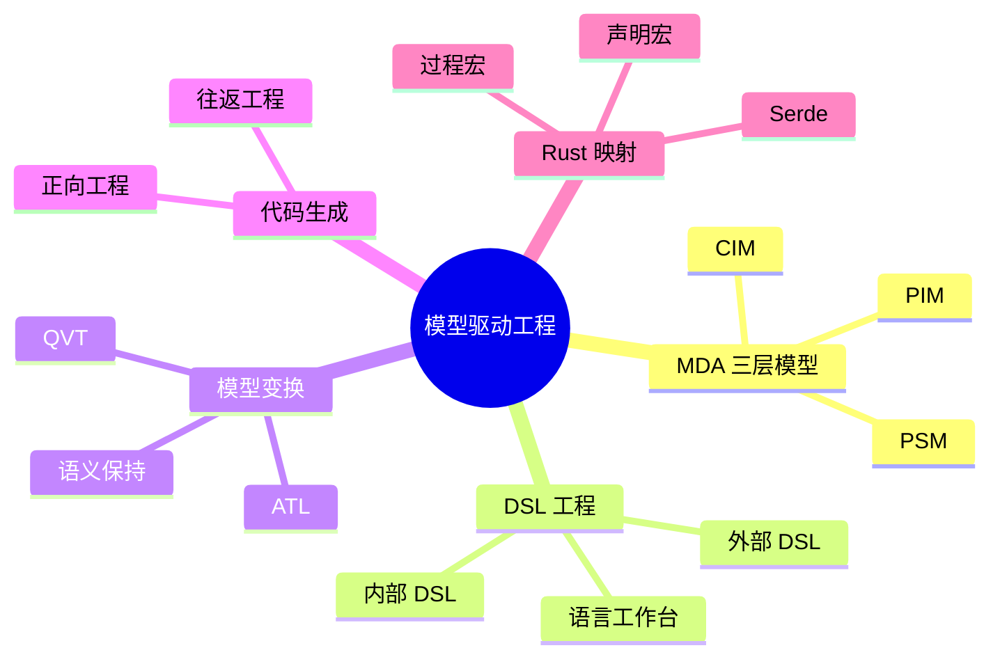

> **内容分级**: [专家级]
>
> **本节关键术语**: 模型驱动工程 · MDA · CIM/PIM/PSM · DSL · 语言工作台 · 模型变换 · 代码生成 · 往返工程 · 过程宏 — [完整对照表](../../00_meta/01_terminology/01_terminology_glossary.md)

# 模型驱动工程

> **EN**: Model-Driven Engineering
> **Summary**: Model-Driven Engineering, MDA layers, DSLs, language workbenches, model transformation, and their lightweight realization in Rust macros and proc-macros.
> **Rust 版本**: 1.97.0+ (Edition 2024)
> **受众**: [专家]
> **Bloom 层级**: L5-L6
> **权威来源**: 本文件为 concept/ 权威页。
> **A/S/P 标记**: **P+S+A** — Procedure + Structure + Application
> **双维定位**: C×Syn — 综合模型抽象与代码生成的结构映射
> **定位**: 从 MDA 抽象层、DSL 工程与模型变换语义出发，将模型驱动思想映射到 Rust 的宏系统与类型驱动生成。
> **前置概念**: [元编程与宏](../../02_intermediate/06_macros_and_metaprogramming/04_metaprogramming.md) · [形式化设计模式理论](11_formal_design_pattern_theory.md) · [模式组合代数](16_pattern_composition_algebra.md) · [工作流理论与形式化](17_workflow_theory.md)
> **后置概念**: [API 设计模式](18_api_design_patterns.md) · [Rust 嵌入式系统开发](../05_systems_and_embedded/03_embedded_systems.md) · [语言语义模型矩阵](../../05_comparative/00_paradigms/05_language_semantic_model_matrix.md)

---

> **来源**:
> [OMG — Model-Driven Architecture (MDA) Guide rev. 2.0](https://www.omg.org/cgi-bin/doc?omg/03-06-01.pdf) ·
> [Fowler, *Domain-Specific Languages*, Addison-Wesley 2010](https://martinfowler.com/books/dsl.html) ·
> [Voelter et al., *DSL Engineering*, 2013](https://dslbook.org/) ·
> [Rust Reference — Macros](https://doc.rust-lang.org/reference/macros.html) ·
> [Serde](https://serde.rs/) ·
> [arXiv — Model-Driven Engineering papers](https://arxiv.org/search/?query=%22model+driven+engineering%22+DSL&searchtype=all) ·
> [Semantic Scholar — Model-Driven Engineering research](https://www.semanticscholar.org/search?q=model%20driven%20engineering&sort=relevance) ·
> [GitHub — serde-rs/serde](https://github.com/serde-rs/serde) ·
> [GitHub — rust-lang/rust proc-macro expansion](https://github.com/rust-lang/rust/tree/master/compiler/rustc_expand)

---

## 📑 目录

- [模型驱动工程](#模型驱动工程)
  - [📑 目录](#-目录)
  - [一、权威定义](#一权威定义)
  - [二、MDA 三层模型](#二mda-三层模型)
    - [2.1 计算无关模型 CIM](#21-计算无关模型-cim)
    - [2.2 平台无关模型 PIM](#22-平台无关模型-pim)
    - [2.3 平台特定模型 PSM](#23-平台特定模型-psm)
  - [三、DSL 工程](#三dsl-工程)
  - [四、语言工作台](#四语言工作台)
  - [五、模型变换语义](#五模型变换语义)
  - [六、代码生成与往返工程](#六代码生成与往返工程)
  - [七、Rust 映射](#七rust-映射)
    - [7.1 声明宏作为轻量级 DSL](#71-声明宏作为轻量级-dsl)
    - [7.2 过程宏作为语法变换](#72-过程宏作为语法变换)
    - [7.3 Serde 作为模型序列化](#73-serde-作为模型序列化)
  - [八、反命题与边界](#八反命题与边界)
    - [反命题：模型自动生成代码即可消除所有错误](#反命题模型自动生成代码即可消除所有错误)
    - [边界：Rust 宏不是完整的语言工作台](#边界rust-宏不是完整的语言工作台)
    - [边界：过程宏的错误信息可控性有限](#边界过程宏的错误信息可控性有限)
  - [九、嵌入式测验（Embedded Quiz）](#九嵌入式测验embedded-quiz)
    - [测验 1：MDA 三层模型中，哪个层描述业务意图而不关心计算平台？](#测验-1mda-三层模型中哪个层描述业务意图而不关心计算平台)
    - [测验 2：内部 DSL 与外部 DSL 的核心区别是什么？](#测验-2内部-dsl-与外部-dsl-的核心区别是什么)
    - [测验 3：在 Rust 中，过程宏（proc-macro）最接近于 MDE 中的哪个概念？](#测验-3在-rust-中过程宏proc-macro最接近于-mde-中的哪个概念)
    - [测验 4：Serde 在 MDE 映射中主要承担什么角色？](#测验-4serde-在-mde-映射中主要承担什么角色)
    - [测验 5：往返工程（Round-Trip Engineering）的主要难点是什么？](#测验-5往返工程round-trip-engineering的主要难点是什么)
  - [十、权威来源索引](#十权威来源索引)
  - [反例与边界](#反例与边界)
    - [反例：代码生成必然消除所有 bug](#反例代码生成必然消除所有-bug)
    - [反例：往返工程可无损同步模型与手写代码](#反例往返工程可无损同步模型与手写代码)
    - [反例：UML 图可直接作为可执行程序](#反例uml-图可直接作为可执行程序)
  - [🧭 思维导图（Mindmap）](#-思维导图mindmap)
  - [补充国际权威来源（P1/P2 覆盖）](#补充国际权威来源p1p2-覆盖)

---

## 一、权威定义

**模型驱动工程（Model-Driven Engineering, MDE）** 是一种软件开发范式：把**模型**作为核心制品，通过自动或半自动的转换生成代码、测试、文档和其他工程产物。

其核心形式框架：

```text
MDE 框架:
  M : 领域模型集合（语法 + 语义）
  T : 模型变换集合（M → M' 或 M → Text）
  G : 代码/制品生成器
  正确性条件:  ∀m ∈ M.  sem(G(T(m))) ⊆ acceptable_behaviors
```

即：模型经过变换和生成后，其语义必须落在系统可接受行为集合内。

---

## 二、MDA 三层模型

OMG 的 **Model-Driven Architecture (MDA)** 把系统描述分为三个抽象层：

```text
MDA 抽象层:
  CIM — Computation Independent Model  业务/需求视图
  PIM — Platform Independent Model     分析与设计视图
  PSM — Platform Specific Model        实现/平台视图
```

### 2.1 计算无关模型 CIM

CIM 描述**业务意图**，不关心计算平台。例如：

```text
CIM 示例:
  业务规则: "当账户余额不足时，拒绝取款请求并通知客户"
  参与者: 客户、账户系统、通知服务
  价值流: 取款请求 → 余额检查 → 决策 → 响应/通知
```

CIM 通常对应 Rust 项目中的 `docs/requirements/`、用户故事或领域事件定义。

### 2.2 平台无关模型 PIM

PIM 描述**系统结构**与**行为**，但不绑定具体平台。例如：

```text
PIM 示例:
  实体 Account { balance: Money }
  操作 withdraw(amount: Money): Result<Money, InsufficientFunds>
  不变量:  withdraw 成功后 balance' = balance - amount
```

在 Rust 中，PIM 可以投影为 trait 与数据结构：

```rust,ignore
// PIM 在 Rust 中的初步投影
trait Account {
    fn balance(&self) -> Money;
    fn withdraw(&mut self, amount: Money) -> Result<Money, InsufficientFunds>;
}

struct BankAccount {
    balance: Money,
}

impl Account for BankAccount {
    fn balance(&self) -> Money { self.balance }
    fn withdraw(&mut self, amount: Money) -> Result<Money, InsufficientFunds> {
        if self.balance >= amount {
            self.balance -= amount;
            Ok(self.balance)
        } else {
            Err(InsufficientFunds)
        }
    }
}
```

### 2.3 平台特定模型 PSM

PSM 把 PIM 绑定到具体平台：操作系统、网络协议、数据库、硬件目标等。

```text
PSM 示例:
  平台: 嵌入式 no_std + heapless 数据结构
  映射:
    Money        → i64（以最小货币单位存储）
    Account      → 静态分配的结构体
    withdraw     → 返回 u8 错误码的 C 兼容函数
    通知服务     → 通过 CAN 帧发送事件
```

Rust 中，PSM 映射常由 **build.rs + 模板** 或 **proc-macro** 完成。

---

## 三、DSL 工程

**领域特定语言（Domain-Specific Language, DSL）** 是针对某一问题域裁剪的语言，介于通用语言与配置格式之间。

Fowler 把 DSL 分为：

```text
DSL 分类:
  内部 DSL（Internal/Embedded DSL）: 寄宿于通用语言内，利用宿主语法
  外部 DSL（External DSL）         : 独立语法，需要解析器/编译器
```

| 类型 | 优点 | 缺点 | Rust 示例 |
|:---|:---|:---|:---|
| 内部 DSL | 与宿主类型系统共享、无需额外解析器 | 受宿主语法限制 | `vec!`、`sqlx::query!`、builder 模式 |
| 外部 DSL | 语法完全自由、可面向非程序员 | 需维护解析器、IDE 工具链 | 自定义配置语言、Protocol Buffers |

Voelter 等强调 DSL 工程的三要素：

1. **抽象**：从领域概念中提炼语言构造
2. **符号**：为这些构造设计语法/图形表示
3. **工具**：编辑器、验证器、生成器、调试器

---

## 四、语言工作台

**语言工作台（Language Workbench）** 是支持 DSL 全生命周期开发的工具环境：

```text
语言工作台核心能力:
  元模型定义   →  语言的抽象语法
  投影编辑器   →  文本/图形/表格多种表示
  约束检查     →  静态语义验证
  变换/生成器  →  模型到代码的转换
  调试与仿真   →  模型级执行与验证
```

典型代表：MPS（JetBrains）、Eclipse Xtext、Sirius、Langium。

语言工作台的关键价值在于**把语言构造第一类化**：领域专家可以直接修改语言本身，而不只是使用语言。

---

## 五、模型变换语义

模型变换是 MDE 的核心操作。形式化地，一次变换是：

```text
变换 T: M_src → M_tgt
  其中 M_src 与 M_tgt 分别满足源/目标元模型 MM_src、MM_tgt

正确性条件:
  语法正确:  ∀m ∈ M_src.  T(m) ∈ M_tgt
  语义保持:  ∀m ∈ M_src.  sem(T(m)) ⊆ sem(m)  （或双向精化关系）
```

OMG 定义了两种标准变换语言：

| 语言 | 范式 | 用途 |
|:---|:---|:---|
| **QVT** | 声明式/命令式混合 | MOF/EMF 模型之间的双向/单向变换 |
| **ATL** | 声明式规则驱动 | EMF 模型到模型的转换 |

在 Rust 语境中，模型变换通常不通过 QVT/ATL 实现，而是通过 **编译期宏**、**build.rs 脚本** 或 **代码生成器** 完成。

---

## 六、代码生成与往返工程

**代码生成（Forward Engineering）** 是从模型生成代码；**往返工程（Round-Trip Engineering）** 则是在模型与代码之间保持双向同步。

```text
代码生成语义:
  生成器 G: M → Text
  良构条件:  parse(G(m)) ∈ AST_target_language
  正确性条件: compile(G(m)) 的行为 ⊆ sem(m)
```

往返工程是最难的，因为：

- 代码中常包含模型未捕获的手动优化
- 格式化和注释会丢失模型级意图
- 自动反向工程难以恢复高级抽象

工程建议：

> 对生成代码实施 **“只读契约”**：手动修改只在模板/模型中进行；若必须手写补丁，用显式 `// BEGIN HANDWRITTEN` 区域隔离，并在再生成时保留。

---

## 七、Rust 映射

Rust 不是传统 MDE 平台，但其宏系统与类型系统提供了 MDE 的**轻量级实现路径**。

### 7.1 声明宏作为轻量级 DSL

声明宏（`macro_rules!`）是最廉价的内部 DSL 入口：

```rust,ignore
// 轻量级状态机 DSL
macro_rules! state_machine {
    (
        $name:ident {
            $($state:ident),*
        }
    ) => {
        #[derive(Debug, Clone, Copy, PartialEq, Eq)]
        enum $name {
            $($state),*
        }
    };
}

state_machine! {
    TrafficLight {
        Red, Yellow, Green
    }
}
```

这对应 MDE 中的 **CIM/PIM → PSM 的部分投影**：用宏把高层意图压缩为可复用的类型构造。

### 7.2 过程宏作为语法变换

过程宏（proc-macro）允许在编译期对 Rust 语法树进行任意变换，等价于 **模型变换 T: Rust-AST → Rust-AST**：

```rust,ignore
// 过程宏示例：为结构体生成 builder（概念示意）
use proc_macro::TokenStream;

#[proc_macro_derive(Builder)]
pub fn derive_builder(input: TokenStream) -> TokenStream {
    // 1. 解析输入 TokenStream 为 AST（模型）
    // 2. 根据元模型规则生成 builder 代码
    // 3. 输出新的 TokenStream
    let expanded = quote! { /* generated builder impl */ };
    expanded.into()
}
```

使用侧：

```rust,ignore
#[derive(Builder)]
struct Request {
    url: String,
    method: String,
}

let req = Request::builder()
    .url("https://example.com".to_string())
    .method("GET".to_string())
    .build();
```

过程宏把**模型级注解**（derive）变换为**平台特定实现**（builder 代码），是典型的 PIM → PSM 转换。

### 7.3 Serde 作为模型序列化

Serde 把 Rust 数据结构映射到外部表示（JSON、YAML、TOML、MessagePack 等），可视为 **PSM ↔ 外部数据模型** 的序列化变换：

```rust,ignore
use serde::{Serialize, Deserialize};

#[derive(Serialize, Deserialize, Debug)]
struct Config {
    name: String,
    timeout_ms: u64,
}

// PSM → 外部模型（JSON）
let json = serde_json::to_string(&config)?;

// 外部模型 → PSM
let config: Config = serde_json::from_str(&json)?;
```

在 MDE 视角下，Serde 的 `Serialize`/`Deserialize` 是**模型到文本/二进制格式**的双向变换，且由派生宏自动生成。

---

## 八、反命题与边界

### 反命题：模型自动生成代码即可消除所有错误

MDE 可以减少样板代码并保证结构一致性，但无法消除语义错误：

- 模型本身可能错误地形式化需求
- 变换规则可能遗漏边界情况
- 生成的代码仍需验证和测试

```text
正确性 ≠ 自动化
正确性 = 正确的元模型 + 正确的变换 + 充分的验证
```

### 边界：Rust 宏不是完整的语言工作台

Rust 宏系统缺少：

- 图形化/投影编辑器
- 模型级调试与仿真
- 双向变换与模型合并

因此 Rust MDE 适合 **轻量级、代码中心** 的场景；对需要大量领域专家参与、图形化建模的项目，仍需外部语言工作台（如 MPS + Rust 生成器）。

### 边界：过程宏的错误信息可控性有限

过程宏生成的代码若存在类型错误，编译器错误信息可能指向生成代码而非原始注解位置。`Span` API 可以缓解，但复杂宏仍可能产生难以调试的诊断。

---

## 九、嵌入式测验（Embedded Quiz）

#### 测验 1：MDA 三层模型中，哪个层描述业务意图而不关心计算平台？

- A. PSM
- B. PIM
- C. CIM
- D. ASM

<details><summary>答案与解析</summary>

**答案：C**

CIM（Computation Independent Model）描述业务/需求视图，不涉及具体计算平台。PIM 是平台无关设计，PSM 是平台特定实现。

</details>

#### 测验 2：内部 DSL 与外部 DSL 的核心区别是什么？

- A. 内部 DSL 运行更快
- B. 内部 DSL 寄宿于宿主语言，外部 DSL 有独立语法和解析器
- C. 外部 DSL 更容易与类型系统集成
- D. 内部 DSL 不需要编译

<details><summary>答案与解析</summary>

**答案：B**

内部 DSL 利用 Rust 等宿主语言的语法构造（如宏、builder、trait），外部 DSL 则有自己的语法，需要词法/语法分析器。

</details>

#### 测验 3：在 Rust 中，过程宏（proc-macro）最接近于 MDE 中的哪个概念？

- A. 领域模型
- B. 模型变换 T: AST → AST
- C. 代码生成器的运行时执行
- D. 往返工程

<details><summary>答案与解析</summary>

**答案：B**

过程宏在编译期读取 TokenStream/AST 并输出新的 TokenStream/AST，是一种语法级模型变换。它由编译器在构建时调用，不是运行时执行。

</details>

#### 测验 4：Serde 在 MDE 映射中主要承担什么角色？

- A. 定义领域元模型
- B. 在 Rust 数据结构（PSM）与外部数据格式之间做双向序列化变换
- C. 提供图形化建模工具
- D. 替代过程宏

<details><summary>答案与解析</summary>

**答案：B**

Serde 把 Rust 结构体/枚举映射到 JSON/YAML 等外部表示，属于 PSM 与外部数据模型之间的双向变换，常由派生宏自动生成。

</details>

#### 测验 5：往返工程（Round-Trip Engineering）的主要难点是什么？

- A. 代码生成速度太慢
- B. 代码中手动优化和注释难以完整反向恢复到模型级抽象
- C. 模型无法描述类图
- D. Rust 不支持宏

<details><summary>答案与解析</summary>

**答案：B**

往返工程要求模型与代码双向同步。代码中的手动调整、格式化和低层细节通常无法自动映射回高层模型，因此常采用“生成代码只读”策略。

</details>

---

## 十、权威来源索引

- **OMG** — *Model-Driven Architecture (MDA) Guide, revision 2.0*. Object Management Group, 2003.
- **Fowler, M.** — *Domain-Specific Languages*. Addison-Wesley, 2010.
- **Voelter, M. et al.** — *DSL Engineering: Designing, Implementing and Using Domain-Specific Languages*. dslbook.org, 2013.
- **OMG** — *MOF 2 QVT Specification*. Object Management Group.
- **Eclipse ATL Project** — [ATL Transformation Language](https://www.eclipse.org/atl/)
- **Rust Project** — [The Rust Reference: Macros](https://doc.rust-lang.org/reference/macros.html)
- **Serde** — [serde.rs](https://serde.rs/)

> **相关文件**: [形式化设计模式理论](11_formal_design_pattern_theory.md) · [模式组合代数](16_pattern_composition_algebra.md) · [工作流理论与形式化](17_workflow_theory.md) · [API 设计模式](18_api_design_patterns.md)
>
> **文档版本**: 1.0 ｜ **最后更新**: 2026-07-28 ｜ **状态**: ✅ 新建（Rust 1.97 对齐）

## 反例与边界

本节用具体反例澄清 MDE 实践中三种常见误解。它们与上一节“反命题与边界”互补，但更强调“如果这样想，会出什么错”。

### 反例：代码生成必然消除所有 bug

| 常见说法 | 实际情况 |
|:---|:---|
| “模型是对的，生成器不会错，所以代码不会有 bug。” | 模型本身可能错误地形式化需求；变换规则可能遗漏边界；生成后仍需测试与评审。 |
| “正向工程后无需再写单元测试。” | 生成代码只是 PSM 实例，其语义保持仍需验证。 |

正确性不是自动化的同义词：

```text
正确性 = 正确的元模型 + 正确的变换 + 充分的验证
```

### 反例：往返工程可无损同步模型与手写代码

| 假设 | 反例 |
|:---|:---|
| 每次修改代码后都能自动反推出最新类图。 | 手写优化、临时变量名、注释与格式化会丢失抽象；反向工程往往只能恢复低层结构。 |
| 再生成代码会保留所有手动补丁。 | 除非显式隔离 `// BEGIN HANDWRITTEN` 区域，否则再生成会覆盖手写修改。 |

因此，往返工程通常只能做到“受控同步”，而非“完全自动同步”。

### 反例：UML 图可直接作为可执行程序

UML 是可视化符号系统，本身没有统一的执行语义：

- 状态图、活动图在不同工具中可能有不同的非形式化解释；
- 类图只描述结构，不描述行为或并发语义；
- “Executable UML” 是附加了动作语言（如 Alf）的专门子集，并非普通 UML。

试图把普通类图当作源码执行，会得到未定义行为或根本无法编译的产物。

## 🧭 思维导图（Mindmap）



> **认知功能**: 本 mindmap 从 MDA 抽象、DSL 工程、变换语义和 Rust 投影四个维度梳理内容，可作为复习与导航索引。

## 补充国际权威来源（P1/P2 覆盖）

- [serde on crates.io](https://crates.io/crates/serde)
- [serde docs](https://docs.rs/serde/latest/serde/)
- [Aeneas](https://github.com/AeneasVerif/aeneas)
