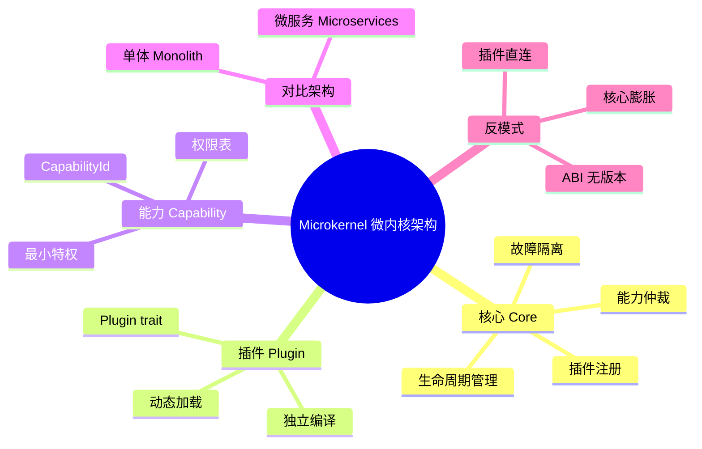

# 微内核架构模式

> **EN**: Microkernel Architecture Pattern
> **Summary**: A software architecture pattern that keeps a minimal core and pushes functionality into isolated, dynamically loadable plugins or services.
> **Rust 版本**: 1.97.0+ (Edition 2024)
> **受众**: [进阶]
> **Bloom 层级**: L6
> **权威来源**: 本文件为 `concept/` 权威页。
> **A/S/P 标记**: **P+S** — Procedure + Structure
> **内容分级**: [专家级]
> **前置概念**:
> [Traits](../../02_intermediate/00_traits/01_traits.md) ·
> [Generics](../../02_intermediate/01_generics/01_generics.md) ·
> [模块系统](../../02_intermediate/05_modules_and_visibility/01_module_system.md) ·
> [设计模式概览](01_patterns.md)
> **后置概念**:
> [架构设计模式](08_architecture_patterns.md) ·
> [事件驱动架构](06_event_driven_architecture.md) ·
> [微服务架构模式](05_microservice_patterns.md)
> **来源**:
> [Rust Design Patterns](https://rust-unofficial.github.io/patterns/) ·
> [Martin Fowler — Microkernel](https://martinfowler.com/articles/microkernel.html) ·
> [OSDev Wiki — Microkernel](https://wiki.osdev.org/Microkernel) ·
> [seL4 Reference Manual](https://sel4.systems/Info/Docs/seL4-refman.pdf) ·
> [Effective Rust](https://www.lurklurk.org/effective-rust/) ·
> [Zero To Production In Rust](https://www.zero2prod.com/) ·
> [seL4: Formal Verification of an OS Kernel (SOSP'09)](https://dl.acm.org/doi/10.1145/1629575.1629596)

---

## 一、权威定义

> **[Martin Fowler — Microkernel](https://martinfowler.com/articles/microkernel.html)** 微内核架构将系统拆分为一个最小化的核心（core）与一组围绕核心运行的插件（plugins）。核心负责资源调度、生命周期管理与基础通信；插件实现具体业务功能，通过定义良好的接口与核心交互。

> **[OSDev Wiki](https://wiki.osdev.org/Microkernel)** 微内核操作系统仅在内核态保留最基本的服务（进程间通信、内存管理、调度），其他服务（文件系统、网络栈、驱动）以用户态进程运行。

Rust 与微内核架构的契合点：

- **所有权与借用**：插件接口的输入输出类型可由 `&T` / `&mut T` 精确表达，避免核心与插件之间的悬空引用。
- **零成本抽象**：核心通过泛型或 trait object 调用插件，静态分发路径无运行时开销。
- **类型安全隔离**：插件间通信可通过 `serde` 序列化 + 能力（capability）句柄实现，编译器验证消息协议。
- **确定性资源管理**：`Drop` 保证插件卸载时资源被释放，避免传统动态加载中的泄漏。

---

## 二、核心组件

| 组件 | 职责 | Rust 映射 |
|:---|:---|:---|
| **Core / Kernel** | 插件注册、调度、资源分配、能力仲裁 | `struct Kernel` / `struct Core` |
| **Plugin Interface** | 核心与插件之间的契约 | `trait Plugin` |
| **Plugin** | 实现具体功能，独立编译、动态加载 | `struct MyPlugin; impl Plugin for MyPlugin` |
| **Service Registry** | 按能力ID查找插件 | `HashMap<CapabilityId, Box<dyn Plugin>>` |
| **Capability** | 限制插件可访问的资源范围 | `struct Capability { resource_id, permissions }` |

**关键不变式**：

1. 核心不依赖任何具体插件，只依赖 `trait Plugin`。
2. 插件不能直接接触其他插件的状态，通信必须经过核心或受控通道。
3. 插件崩溃不能导致核心崩溃（通过进程隔离或 `catch_unwind` 实现）。

---

## 三、Rust 实现骨架

以下是一个单进程内的微内核骨架，展示插件注册、能力隔离与错误隔离。

```rust
use std::collections::HashMap;
use std::panic::{catch_unwind, AssertUnwindSafe};

/// 插件能力标识
#[derive(Clone, Copy, PartialEq, Eq, Hash, Debug)]
struct CapabilityId(u64);

/// 插件接口：核心与插件之间的唯一契约
trait Plugin: Send + 'static {
    fn id(&self) -> CapabilityId;
    fn name(&self) -> &'static str;
    /// 处理输入，返回输出；插件内部 panic 由核心捕获
    fn invoke(&mut self, input: &str) -> Result<String, PluginError>;
}

#[derive(Debug)]
enum PluginError { Panicked, NotFound(CapabilityId), PermissionDenied }

/// 微内核核心
struct MicroKernel {
    plugins: HashMap<CapabilityId, Box<dyn Plugin>>,
    // 能力表：记录每个插件能调用的其他能力
    capabilities: HashMap<CapabilityId, Vec<CapabilityId>>,
}

impl MicroKernel {
    fn new() -> Self {
        Self { plugins: HashMap::new(), capabilities: HashMap::new() }
    }

    fn register(&mut self, plugin: Box<dyn Plugin>, allowed: Vec<CapabilityId>) {
        let id = plugin.id();
        self.plugins.insert(id, plugin);
        self.capabilities.insert(id, allowed);
    }

    /// 调用指定能力；通过 catch_unwind 隔离插件 panic
    fn invoke(&mut self, target: CapabilityId, caller: CapabilityId, input: &str) -> Result<String, PluginError> {
        let allowed = self.capabilities.get(&caller).map(|v| v.contains(&target)).unwrap_or(false);
        if caller != target && !allowed {
            return Err(PluginError::PermissionDenied);
        }

        let plugin = self.plugins.get_mut(&target).ok_or(PluginError::NotFound(target))?;
        let result = catch_unwind(AssertUnwindSafe(|| plugin.invoke(input)))
            .map_err(|_| PluginError::Panicked)?;
        result
    }
}

/// 示例插件：日志插件
struct LoggerPlugin { id: CapabilityId }
impl LoggerPlugin { fn new() -> Self { Self { id: CapabilityId(1) } } }

impl Plugin for LoggerPlugin {
    fn id(&self) -> CapabilityId { self.id }
    fn name(&self) -> &'static str { "logger" }
    fn invoke(&mut self, input: &str) -> Result<String, PluginError> {
        Ok(format!("[LOG] {}", input))
    }
}

/// 示例插件：业务插件，被授权调用 logger
struct BusinessPlugin { id: CapabilityId }
impl BusinessPlugin { fn new() -> Self { Self { id: CapabilityId(2) } } }

impl Plugin for BusinessPlugin {
    fn id(&self) -> CapabilityId { self.id }
    fn name(&self) -> &'static str { "business" }
    fn invoke(&mut self, input: &str) -> Result<String, PluginError> {
        Ok(format!("业务处理: {}", input))
    }
}

fn main() {
    let mut kernel = MicroKernel::new();
    let logger_id = CapabilityId(1);
    let business_id = CapabilityId(2);

    kernel.register(Box::new(LoggerPlugin::new()), vec![]);
    kernel.register(Box::new(BusinessPlugin::new()), vec![logger_id]);

    // business 调用 logger
    let result = kernel.invoke(logger_id, business_id, "order created");
    println!("{:?}", result);
}
```

> **关键洞察**：核心通过 `Box<dyn Plugin>` 实现运行时插件替换，通过 `CapabilityId` 与能力表实现访问控制，通过 `catch_unwind` 隔离故障。这与 seL4 等操作系统微内核的“最小特权原则”一致。

---

## 四、与单体架构和微服务架构的对比

| 维度 | 单体架构 (Monolith) | 微内核架构 (Microkernel) | 微服务架构 (Microservices) |
|:---|:---|:---|:---|
| **部署单元** | 单一二进制 | 核心 + 插件 | 多个独立服务 |
| **隔离级别** | 无（同进程）| 进程内/进程间能力隔离 | 进程/容器级隔离 |
| **通信成本** | 函数调用 | trait 调用 / IPC | 网络调用 |
| **扩展方式** | 重新编译整个应用 | 加载/卸载插件 | 独立扩缩服务 |
| **复杂度** | 低 | 中 | 高 |
| **适用场景** | 小到中型应用 | 可扩展桌面应用、IDE、浏览器 | 大型分布式系统 |
| **Rust 示例** | 单 crate | `dyn Plugin` + 能力表 | `tonic` / `axum` + `tokio` |

**判定依据**：

- 团队 < 10 人、无独立部署诉求 → 单体。
- 需要运行时扩展（插件市场）、但不想承担微服务运维成本 → 微内核。
- 多团队、独立发布、需要不同技术栈或独立扩缩 → 微服务。

> **来源**: [Martin Fowler — Microservices](https://martinfowler.com/articles/microservices.html) · [Fowler — Microkernel](https://martinfowler.com/articles/microkernel.html) · 可信度: ✅

---

## 五、边界测试

### 5.1 边界测试：插件未实现接口（编译错误）

核心只接受实现了 `Plugin` trait 的类型。若忘记实现，编译期即被拒绝。

```rust,compile_fail
trait Plugin { fn invoke(&self) -> String; }
struct Core { plugins: Vec<Box<dyn Plugin>> }

struct BadPlugin; // ❌ 未实现 Plugin

fn main() {
    let mut core = Core { plugins: vec![] };
    core.plugins.push(Box::new(BadPlugin)); // E0277
}
```

> **修正**：为 `BadPlugin` 实现 `Plugin`，或定义一个更简单的适配器 trait。

### 5.2 边界测试：未授权跨插件调用（运行时错误）

微内核的能力表必须在运行期阻止非法调用，否则隔离失效。

```rust
// ❌ 边界：business 未被授权访问 network，应返回 PermissionDenied
fn main() {
    // 沿用上一节 MicroKernel 定义（省略）
    // let result = kernel.invoke(network_id, business_id, "send");
    // assert!(matches!(result, Err(PluginError::PermissionDenied)));
}
```

> **修正**：在 `register` 时显式声明每个插件的允许能力集；核心在每次跨插件调用前校验能力表。

### 5.3 边界测试：插件 panic 不能拖垮核心

```rust
use std::panic::{catch_unwind, AssertUnwindSafe};

fn main() {
    let result = catch_unwind(AssertUnwindSafe(|| {
        panic!("plugin bug");
    }));
    assert!(result.is_err());
    println!("核心继续运行");
}
```

> **关键洞察**：`catch_unwind` 只能捕获由 panic 产生的展开；若插件使用 `std::process::abort` 或发生段错误，则需要进程级隔离（如 `std::process::Command` 或 WASM 沙箱）。

---

## 六、反模式

### 6.1 核心膨胀（Fat Kernel）

把过多业务逻辑塞进核心，导致核心失去“最小化”的意义，变成披着微内核外衣的单体。

**检测信号**：

- `MicroKernel` 代码量超过总代码量的 30%。
- 核心直接处理具体业务规则而非通用调度。
- 插件只是薄薄的配置层。

**修正**：将业务规则下放到插件，核心只保留注册、调度、能力仲裁、生命周期管理。

### 6.2 插件间直接通信

插件绕过核心直接交换引用或共享可变状态，破坏隔离与可替换性。

```rust,ignore
// ❌ 反模式：插件 A 直接持有插件 B 的引用
struct PluginA { other: Rc<RefCell<dyn Plugin>> }
```

**修正**：所有跨插件交互通过核心路由，或使用受核心监管的能力句柄。

### 6.3 动态加载无版本控制

动态加载插件时，若插件与核心的 ABI 不兼容，会导致未定义行为。

**修正**：

- 使用 `abi_stable` 等 crate 显式管理插件 ABI。
- 或改用 WASM 等沙箱运行时（`wasmtime`），用模块接口版本化隔离 ABI 风险。

---

---

## 相关概念

- [Rust vs C++：形式系统模型 vs 机制工程模型](../../05_comparative/01_systems_languages/01_rust_vs_cpp.md)
- [架构模式语义](../../04_formal/10_architecture_semantics/02_architecture_pattern_semantics.md)
- [Rust 操作系统内核开发](../../06_ecosystem/05_systems_and_embedded/05_os_kernel.md)

## 🧭 思维导图（Mindmap）



> **认知功能**：本 mindmap 概括微内核架构的四大支柱——最小核心、插件契约、能力隔离、架构对比。学习时建议从“核心不依赖具体插件”这一不变式出发，理解所有设计决策如何服务于隔离与可扩展性。

---

**变更日志**: v1.0 (2026-07-31): Wave 8 新增微内核架构模式权威页，含 Rust 实现骨架、能力隔离、与单体/微服务对比、边界测试与反模式。
