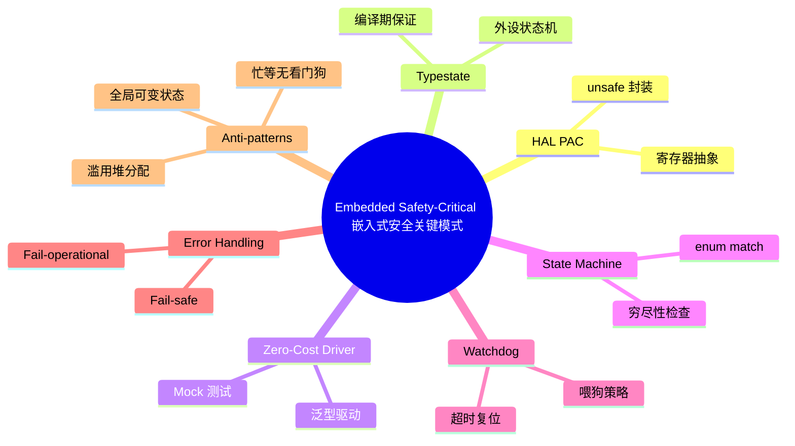

# 嵌入式安全关键模式

> **EN**: Embedded Safety-Critical Patterns
> **Summary**: A set of Rust design patterns for building safe, deterministic, and fault-tolerant embedded and safety-critical systems.
> **Rust 版本**: 1.97.0+ (Edition 2024)
> **受众**: [进阶]
> **Bloom 层级**: L5-L6
> **权威来源**: 本文件为 `concept/` 权威页。
> **A/S/P 标记**: **P+S** — Procedure + Structure
> **内容分级**: [专家级]
> **前置概念**:
> [所有权](../../01_foundation/01_ownership_borrow_lifetime/01_ownership.md) ·
> [类型系统](../../01_foundation/02_type_system/01_type_system.md) ·
> [Trait](../../02_intermediate/00_traits/01_traits.md) ·
> [泛型](../../02_intermediate/01_generics/01_generics.md) ·
> [Unsafe Rust](../../03_advanced/02_unsafe/01_unsafe.md) ·
> [状态机](01_patterns.md)
> **后置概念**:
> [FFI](../../03_advanced/04_ffi/01_rust_ffi.md) ·
> [并发](../../03_advanced/00_concurrency/01_concurrency.md) ·
> [微内核架构](21_microkernel_architecture.md)
> **来源**:
> [Rust Embedded Book](https://docs.rust-embedded.org/book/index.html) ·
> [The Rust on ESP Book](https://docs.esp-rs.org/book/) ·
> [embedded-hal](https://docs.rs/embedded-hal/latest/embedded_hal/) ·
> [RTIC Book](https://rtic.rs/2/book/en/) ·
> [IEC 61508 — Functional Safety](https://webstore.iec.ch/publication/66912) ·
> [NASA JPL — 10 Rules for Safety-Critical Code](https://spinoff.nasa.gov/JPL-Rules-for-Safety-Critical-Software) ·
> [A Survey of Rust Embedded Development (arXiv)](https://arxiv.org/abs/2311.05063) ·
> [Towards Safe Rust for Aerospace and Safety-Critical Applications (arXiv)](https://arxiv.org/abs/2405.18135)

---

## 一、权威定义

> **[Rust Embedded Book](https://docs.rust-embedded.org/book/index.html)** 嵌入式 Rust 通过零成本抽象、强类型状态和确定性资源管理，帮助开发者在资源受限环境中构建可靠软件。

> **[IEC 61508](https://webstore.iec.ch/publication/66912)** 安全关键系统需要在可接受的风险水平内运行，核心目标包括故障避免、故障检测与故障容错。

Rust 在嵌入式安全关键领域的独特优势：

- **无数据竞争**：借用检查器在编译期排除并发数据竞争。
- **无空指针/悬垂指针**：所有权系统消除传统 C/C++ 嵌入式代码中的大量内存错误。
- **零成本抽象**：高级类型技巧（typestate、泛型驱动）不增加运行时开销。
- **确定性资源管理**：`Drop` 与 RAII 提供可预测的资源释放，无垃圾回收停顿。

---

## 二、HAL / PAC 分层模式

嵌入式 Rust 生态将硬件访问分为两层：

- **PAC（Peripheral Access Crate）**：由 SVD 文件生成，直接映射寄存器，操作通常需要 `unsafe`。
- **HAL（Hardware Abstraction Layer）**：在 PAC 之上提供类型安全、可移植的 trait 接口，封装 `unsafe`。

```rust,ignore
// 依赖：embedded-hal = "1.0"
use embedded_hal::digital::{InputPin, OutputPin};

// HAL 提供的类型安全 GPIO trait
fn blink_led<LED>(led: &mut LED, delay_ms: u32)
where
    LED: OutputPin,
    LED::Error: core::fmt::Debug,
{
    led.set_high().unwrap();
    // delay_ms 后
    led.set_low().unwrap();
}
```

**关键洞察**：HAL trait 将“哪个引脚”与“如何使用”分离，应用代码可在不同芯片间移植；PAC 的 `unsafe` 被限制在 HAL 实现内部。

---

## 三、Typestate 外设模式

利用泛型将外设状态编码进类型，使非法操作在编译期不可表示。例如：UART 必须先配置波特率才能发送数据。

```rust
use std::marker::PhantomData;

// 状态标签
struct Unconfigured;
struct Configured;
struct Enabled;

// UART 外设，状态由类型参数决定
struct Uart<State> {
    _state: PhantomData<State>,
    baud: u32,
}

impl Uart<Unconfigured> {
    fn new() -> Self {
        Self { _state: PhantomData, baud: 0 }
    }

    fn configure(self, baud: u32) -> Uart<Configured> {
        Uart { _state: PhantomData, baud }
    }
}

impl Uart<Configured> {
    fn enable(self) -> Uart<Enabled> {
        Uart { _state: PhantomData, baud: self.baud }
    }
}

impl Uart<Enabled> {
    fn send(&self, _data: &[u8]) {
        println!("以 {} baud 发送数据", self.baud);
    }
}

fn main() {
    let uart = Uart::new()
        .configure(115_200)
        .enable();
    uart.send(b"hello");
}
```

**与其他语言对比**：

- **C**：通常用运行时标志位检查外设状态，遗漏检查导致未定义行为。
- **C++**：可用 RAII + 类型包装模拟，但缺少编译器级所有权检查。
- **Rust**：`PhantomData<State>` 将状态提升为类型，错误转换直接编译失败。

> **来源**: [Rust Embedded Book — Typestate](https://docs.rust-embedded.org/book/design-patterns/typestate.html) · 可信度: ✅

---

## 四、零成本驱动模式

驱动通过泛型参数持有具体外设类型，编译期单态化后无 trait object 开销，同时保持可测试性（可用 mock 外设替代真实硬件）。

```rust
// 抽象传感器接口
trait TemperatureSensor {
    type Error;
    fn read(&mut self) -> Result<i32, Self::Error>;
}

// 零成本驱动：泛型参数在编译期实例化
struct Thermostat<S: TemperatureSensor> {
    sensor: S,
    threshold: i32,
}

impl<S: TemperatureSensor> Thermostat<S> {
    fn new(sensor: S, threshold: i32) -> Self { Self { sensor, threshold } }

    fn check(&mut self) -> Result<bool, S::Error> {
        let temp = self.sensor.read()?;
        Ok(temp > self.threshold)
    }
}

// 真实硬件传感器（no_std 环境）
struct HwSensor;
impl TemperatureSensor for HwSensor {
    type Error = ();
    fn read(&mut self) -> Result<i32, ()> { Ok(42) }
}

// 测试用 mock 传感器
struct MockSensor { value: i32 }
impl TemperatureSensor for MockSensor {
    type Error = ();
    fn read(&mut self) -> Result<i32, ()> { Ok(self.value) }
}

fn main() {
    let mut hw = Thermostat::new(HwSensor, 30);
    println!("硬件告警: {}", hw.check().unwrap());

    let mut mock = Thermostat::new(MockSensor { value: 25 }, 30);
    println!("测试告警: {}", mock.check().unwrap());
}
```

> **关键洞察**：泛型驱动在 `no_std` 目标上同样零成本，因为单态化后的代码与手写专用驱动相同；测试时替换为 mock 无需改变驱动逻辑。

---

## 五、安全关键状态机

安全关键系统常用状态机表达离散行为。Rust 的 `enum` + `match` 提供穷尽性检查，确保所有状态转换都被处理。

```rust
#[derive(Debug, PartialEq, Clone, Copy)]
enum ValveState { Closed, Opening, Open, Closing, Fault }

#[derive(Debug)]
enum ValveCommand { Open, Close, SensorFault, SensorOk }

struct Valve { state: ValveState }

impl Valve {
    fn new() -> Self { Self { state: ValveState::Closed } }

    fn transition(&mut self, cmd: ValveCommand) -> Result<(), &'static str> {
        self.state = match (self.state, cmd) {
            (ValveState::Closed, ValveCommand::Open) => ValveState::Opening,
            (ValveState::Opening, ValveCommand::SensorOk) => ValveState::Open,
            (ValveState::Open, ValveCommand::Close) => ValveState::Closing,
            (ValveState::Closing, ValveCommand::SensorOk) => ValveState::Closed,
            (_, ValveCommand::SensorFault) => ValveState::Fault,
            (ValveState::Fault, ValveCommand::SensorOk) => ValveState::Closed, // 故障恢复后复位
            (state, cmd) => {
                return Err("非法状态转换");
            }
        };
        Ok(())
    }

    fn is_safe(&self) -> bool {
        // 故障状态下必须关闭或已在关闭流程
        matches!(self.state, ValveState::Closed | ValveState::Closing | ValveState::Fault)
    }
}

fn main() {
    let mut valve = Valve::new();
    valve.transition(ValveCommand::Open).unwrap();
    valve.transition(ValveCommand::SensorOk).unwrap();
    println!("阀门状态: {:?}, 安全: {}", valve.state, valve.is_safe());
}
```

> **来源**: [NASA JPL — 10 Rules](https://spinoff.nasa.gov/JPL-Rules-for-Safety-Critical-Software) · 可信度: ✅

---

## 六、看门狗模式

看门狗定时器（Watchdog）在系统卡死时强制复位。安全关键代码必须定期“喂狗”，并保证喂狗路径覆盖所有正常运行分支。

```rust
use std::time::{Duration, Instant};

struct Watchdog {
    deadline: Instant,
    timeout: Duration,
}

impl Watchdog {
    fn new(timeout_ms: u64) -> Self {
        Self {
            deadline: Instant::now() + Duration::from_millis(timeout_ms),
            timeout: Duration::from_millis(timeout_ms),
        }
    }

    fn feed(&mut self) {
        self.deadline = Instant::now() + self.timeout;
    }

    fn is_expired(&self) -> bool {
        Instant::now() > self.deadline
    }
}

fn main() {
    let mut wdt = Watchdog::new(1000);

    for i in 0..5 {
        // 模拟主循环工作
        println!("tick {}", i);
        wdt.feed();
    }

    assert!(!wdt.is_expired(), "看门狗不应超时");
}
```

**关键规则**：

1. 喂狗必须发生在所有正常路径上；错误处理分支也应喂狗或进入安全状态。
2. 不能在无法反映系统健康的独立线程中盲目喂狗。
3. 窗口看门狗要求喂狗必须在指定时间窗口内发生，过早过晚都触发复位。

---

## 七、错误处理策略

安全关键系统的错误处理原则：**fail-safe（故障安全）**、**fail-operational（故障可运行）**、**never panic in production**。

```rust
use std::fmt;

#[derive(Debug)]
enum SensorError {
    Timeout,
    OutOfRange,
    CalibrationFailure,
}

impl fmt::Display for SensorError {
    fn fmt(&self, f: &mut fmt::Formatter) -> fmt::Result {
        match self {
            SensorError::Timeout => write!(f, "传感器超时"),
            SensorError::OutOfRange => write!(f, "读数越界"),
            SensorError::CalibrationFailure => write!(f, "校准失败"),
        }
    }
}

struct Sensor;

impl Sensor {
    fn read(&self) -> Result<f32, SensorError> {
        // 模拟故障
        Err(SensorError::OutOfRange)
    }
}

fn control_loop(sensor: &Sensor) {
    match sensor.read() {
        Ok(value) => {
            println!("读数正常: {}", value);
        }
        Err(e) => {
            // 故障安全：进入已知安全状态，而不是 panic
            eprintln!("故障: {}，进入安全状态", e);
        }
    }
}

fn main() {
    let sensor = Sensor;
    control_loop(&sensor);
}
```

**策略对比**：

| 策略 | 含义 | Rust 实践 |
|:---|:---|:---|
| Fail-safe | 故障时进入安全状态 | `Result` + 显式安全状态转移 |
| Fail-operational | 故障时降级运行 | 冗余通道 + 投票/切换 |
| Fail-stop | 故障时停止 | `panic` 仅在开发/测试阶段使用 |

> **来源**: [IEC 61508](https://webstore.iec.ch/publication/66912) · [Rust Embedded Book](https://docs.rust-embedded.org/book/index.html) · 可信度: ✅

---

## 八、边界测试

### 8.1 边界测试：未配置外设直接发送（编译错误）

Typestate 的核心收益是将非法状态转换为编译错误。

```rust,compile_fail
use std::marker::PhantomData;
struct Unconfigured;
struct Enabled;
struct Uart<State> { _state: PhantomData<State> }
impl Uart<Unconfigured> { fn new() -> Self { Self { _state: PhantomData } } }
impl Uart<Enabled> { fn send(&self, _data: &[u8]) {} }

fn main() {
    let uart = Uart::new();
    uart.send(b"hello"); // ❌ 编译错误：Uart<Unconfigured> 没有 send 方法
}
```

> **修正**：按 `new → configure → enable` 的 typestate 链完成初始化。

### 8.2 边界测试：看门狗超时（运行时错误）

```rust,ignore
// ❌ 边界：主循环卡死，未喂狗，看门狗触发系统复位
fn main() {
    let mut wdt = Watchdog::new(100);
    loop {
        // 模拟卡死：无 feed()
        // wdt.feed();
    }
}
```

> **修正**：将喂狗与主循环的健康检查绑定；对关键任务使用独立监控。

### 8.3 边界测试：安全关键代码使用 unwrap（设计风险）

```rust,ignore
// ❌ 反模式：生产代码 unwrap 可能在运行时 panic
let value = sensor.read().unwrap();
```

> **修正**：使用 `match` 或 `if let`，并为每种错误定义 fail-safe 行为。

---

## 九、反模式

### 9.1 在 `no_std` 中滥用动态分配

嵌入式环境堆内存有限且可能不存在。滥用 `Box`、`Vec` 会导致堆耗尽或非确定性延迟。

**修正**：使用栈分配、固定容量数组、`heapless` crate 提供的无堆集合。

### 9.2 忙等无看门狗

```rust,ignore
// ❌ 反模式：忙等循环不喂狗，无法自恢复
while !flag {}
```

**修正**：使用中断、RTIC 任务或 async executor；忙等必须设置超时并喂狗。

### 9.3 全局可变状态

```rust,ignore
// ❌ 反模式：全局 static mut 导致数据竞争与未定义行为
static mut COUNTER: u32 = 0;
```

**修正**：使用 `critical_section`、`Mutex`、原子类型或 RTIC 的资源模型管理共享状态。

---

---

## 相关概念

- [Rust vs Ada/SPARK：安全关键系统语言对比](../../05_comparative/01_systems_languages/07_rust_vs_ada_spark.md)
- [架构模式语义](../../04_formal/10_architecture_semantics/02_architecture_pattern_semantics.md)
- [安全关键系统工程](../../06_ecosystem/11_domain_applications/23_safety_critical_systems_engineering.md)

## 🧭 思维导图（Mindmap）



> **认知功能**：本 mindmap 将嵌入式安全关键开发归纳为“抽象层—状态—错误—反模式”四条主线。学习时应始终将 Rust 的编译期保证与 IEC 61508 等安全标准的故障处理策略结合起来。

---

## P0 官方来源（P0 Official Sources）

- [Rust Reference — Unsafe Blocks](https://doc.rust-lang.org/reference/unsafe-blocks.html)
- [The Rustonomicon](https://doc.rust-lang.org/nomicon/)
- [Rust API Guidelines — Type Safety](https://rust-lang.github.io/api-guidelines/type-safety.html)

---

**变更日志**: v1.0 (2026-07-31): Wave 8 新增嵌入式安全关键模式权威页，含 HAL/PAC、Typestate 外设、零成本驱动、安全关键状态机、看门狗、错误处理策略、边界测试与反模式。
