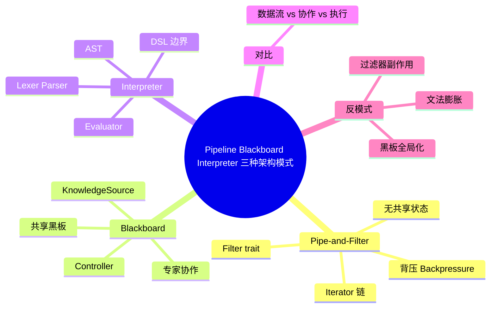

# 管道-过滤器、黑板与解释器架构

> **EN**: Pipeline-Filter, Blackboard and Interpreter Architectures
> **Summary**: Three classic architectural patterns for data flow processing, collaborative problem solving, and domain-specific language execution in Rust.
> **Rust 版本**: 1.97.0+ (Edition 2024)
> **受众**: [进阶]
> **Bloom 层级**: L6
> **权威来源**: 本文件为 `concept/` 权威页。
> **A/S/P 标记**: **P+S** — Procedure + Structure
> **内容分级**: [专家级]
> **前置概念**:
> [Iterator](../../02_intermediate/07_iterators_and_closures/01_iterator_patterns.md) ·
> [Trait](../../02_intermediate/00_traits/01_traits.md) ·
> [泛型](../../02_intermediate/01_generics/01_generics.md) ·
> [并发](../../03_advanced/00_concurrency/01_concurrency.md) ·
> [解释器模式](01_patterns.md)
> **后置概念**:
> [事件驱动架构](06_event_driven_architecture.md) ·
> [CQRS 与事件溯源](07_cqrs_event_sourcing.md) ·
> [工作流理论](17_workflow_theory.md)
> **来源**:
> [Rust Design Patterns](https://rust-unofficial.github.io/patterns/) ·
> [Martin Fowler — Enterprise Application Architecture](https://martinfowler.com/books/eaa.html) ·
> [POSA — Pattern-Oriented Software Architecture](https://www.dre.vanderbilt.edu/~schmidt/POSA/) ·
> [Unix Philosophy](https://en.wikipedia.org/wiki/Unix_philosophy) ·
> [Dragon Book — Compilers](https://en.wikipedia.org/wiki/Compilers:_Principles,_Techniques,_and_Tools) ·
> [Crafting Interpreters](https://craftinginterpreters.com/) ·
> [The Hearsay-II Speech-Understanding System (ACM)](https://dl.acm.org/doi/10.1145/356810.356816)

---

## 一、权威定义

> **[POSA](https://www.dre.vanderbilt.edu/~schmidt/POSA/) 管道-过滤器（Pipe-and-Filter）** 将系统组织为数据流经过的一系列处理步骤（过滤器），数据通过管道（pipes）在过滤器之间传递。每个过滤器独立完成输入到输出的转换。
> **[POSA 黑板（Blackboard）](https://www.dre.vanderbilt.edu/~schmidt/POSA/)** 将问题求解所需的共享数据放在黑板上，多个独立的知识源（Knowledge Sources）观察黑板状态并贡献部分解，控制器协调求解过程。
> **[GoF 解释器（Interpreter）](https://en.wikipedia.org/wiki/Design_pattern)** 为特定领域语言定义文法表示与解释器。解释器架构通常包含词法/语法分析、AST、求值/执行三个层次。

Rust 对这三种架构的共性支持：

- **Iterator/Stream**：天然表达管道-过滤器的链式数据流。
- **所有权与借用**：黑板的数据访问可由 `Mutex`/`RwLock` 或 channel 安全控制。
- **enum 与 match**：解释器的 AST 与求值逻辑可直接映射为 Rust 的代数数据类型。

---

## 二、管道-过滤器架构

### 2.1 模式定义

管道-过滤器的核心约束：

1. 过滤器之间只通过数据传递交互，不共享状态。
2. 每个过滤器对输入数据做变换后产出输出数据。
3. 管道负责缓冲区与背压（backpressure）管理。

### 2.2 Rust 实现

```rust
// 过滤器 trait：输入 I，输出 O
trait Filter<I, O> {
    fn process(&self, input: I) -> O;
}

// 文本处理过滤器
struct Trim;
impl Filter<String, String> for Trim {
    fn process(&self, input: String) -> String { input.trim().to_string() }
}

struct ToUpper;
impl Filter<String, String> for ToUpper {
    fn process(&self, input: String) -> String { input.to_uppercase() }
}

struct ReplaceComma;
impl Filter<String, String> for ReplaceComma {
    fn process(&self, input: String) -> String { input.replace(',', " ") }
}

// 管道：顺序组合过滤器
struct Pipeline;

impl Pipeline {
    fn run(input: String, filters: &[Box<dyn Filter<String, String>>]) -> String {
        filters.iter().fold(input, |acc, f| f.process(acc))
    }
}

fn main() {
    let filters: Vec<Box<dyn Filter<String, String>>> = vec![
        Box::new(Trim),
        Box::new(ReplaceComma),
        Box::new(ToUpper),
    ];

    let result = Pipeline::run("  hello,world  ".to_string(), &filters);
    println!("{}", result); // HELLO WORLD
}
```

### 2.3 零成本替代：Iterator 链

对于编译期固定的转换，Rust 的迭代器链是管道-过滤器的零成本表达：

```rust
fn main() {
    let result: Vec<i32> = [1, 2, 3, 4, 5]
        .iter()
        .filter(|&&x| x > 2)      // 过滤器 1
        .map(|x| x * 2)           // 过滤器 2
        .collect();
    println!("{:?}", result); // [6, 8, 10]
}
```

> **关键洞察**：`Iterator` 适配器是 Rust 标准库对管道-过滤器模式的内建实现，编译后通常内联为单个循环，无分配开销。

---

## 三、黑板架构

### 3.1 模式定义

黑板架构的三要素：

- **Blackboard**：共享的问题表示，所有知识源可读可写。
- **Knowledge Sources**：独立的专家模块，各自负责一类部分解。
- **Controller**：监控黑板状态，决定下一步激活哪个知识源。

### 3.2 Rust 实现

以下示例展示单线程黑板；多线程版本可用 `Arc<RwLock<Blackboard>>` + 通道实现控制器。

```rust
use std::collections::HashMap;

#[derive(Clone, Debug)]
struct Hypothesis {
    source: &'static str,
    value: String,
    confidence: f64,
}

struct Blackboard {
    data: HashMap<String, Vec<Hypothesis>>,
}

impl Blackboard {
    fn new() -> Self { Self { data: HashMap::new() } }

    fn post(&mut self, key: &str, hypothesis: Hypothesis) {
        self.data.entry(key.to_string()).or_default().push(hypothesis);
    }

    fn read(&self, key: &str) -> Option<&Vec<Hypothesis>> {
        self.data.get(key)
    }

    fn best(&self, key: &str) -> Option<&Hypothesis> {
        self.read(key)?.iter().max_by(|a, b| a.confidence.partial_cmp(&b.confidence).unwrap())
    }
}

// 知识源 trait
trait KnowledgeSource {
    fn name(&self) -> &'static str;
    fn can_contribute(&self, board: &Blackboard) -> bool;
    fn contribute(&self, board: &mut Blackboard);
}

// 知识源 A：语音识别，生成候选词
struct SpeechRecognizer;
impl KnowledgeSource for SpeechRecognizer {
    fn name(&self) -> &'static str { "speech" }
    fn can_contribute(&self, board: &Blackboard) -> bool { board.read("audio").is_some() }
    fn contribute(&self, board: &mut Blackboard) {
        board.post("word", Hypothesis { source: self.name(), value: "hello".to_string(), confidence: 0.8 });
    }
}

// 知识源 B：上下文消歧
struct ContextDisambiguator;
impl KnowledgeSource for ContextDisambiguator {
    fn name(&self) -> &'static str { "context" }
    fn can_contribute(&self, board: &Blackboard) -> bool { board.read("word").is_some() }
    fn contribute(&self, board: &mut Blackboard) {
        if let Some(best) = board.best("word") {
            let confidence = best.confidence * 1.1;
            board.post("meaning", Hypothesis {
                source: self.name(),
                value: format!("{} (contextualized)", best.value),
                confidence: confidence.min(1.0),
            });
        }
    }
}

// 简单控制器：轮流尝试每个知识源直到收敛
struct Controller { sources: Vec<Box<dyn KnowledgeSource>> }

impl Controller {
    fn run(&self, board: &mut Blackboard, max_iterations: usize) {
        for _ in 0..max_iterations {
            let mut progress = false;
            for source in &self.sources {
                if source.can_contribute(board) {
                    source.contribute(board);
                    progress = true;
                }
            }
            if !progress { break; }
        }
    }
}

fn main() {
    let mut board = Blackboard::new();
    board.post("audio", Hypothesis { source: "input", value: "waveform".to_string(), confidence: 1.0 });

    let controller = Controller {
        sources: vec![Box::new(SpeechRecognizer), Box::new(ContextDisambiguator)],
    };
    controller.run(&mut board, 10);

    println!("最终结果: {:?}", board.best("meaning"));
}
```

> **关键洞察**：黑板的可扩展性来自知识源的独立性——新增一个专家只需实现 `KnowledgeSource`，不影响其他模块。Rust 的 trait object 使知识源集合异构而类型安全。

---

## 四、解释器架构

### 4.1 模式定义

解释器架构通常分为三层：

1. **前端（Front-end）**：词法分析 → 语法分析 → AST。
2. **中端（Middle-end）**：可选的优化、类型检查、中间表示转换。
3. **后端（Back-end）**：解释执行或编译到目标平台。

### 4.2 Rust 实现（简单规则 DSL）

```rust
use std::collections::HashMap;

// AST
enum Expr {
    Num(f64),
    Var(String),
    Add(Box<Expr>, Box<Expr>),
    Mul(Box<Expr>, Box<Expr>),
}

enum Stmt {
    Assign(String, Expr),
    If(Expr, Vec<Stmt>), // 条件为真时执行
}

struct Env { vars: HashMap<String, f64> }
impl Env {
    fn new() -> Self { Self { vars: HashMap::new() } }
    fn get(&self, name: &str) -> Option<f64> { self.vars.get(name).copied() }
    fn set(&mut self, name: String, value: f64) { self.vars.insert(name, value); }
}

fn eval(expr: &Expr, env: &Env) -> Result<f64, String> {
    match expr {
        Expr::Num(n) => Ok(*n),
        Expr::Var(name) => env.get(name).ok_or_else(|| format!("未定义变量: {}", name)),
        Expr::Add(l, r) => Ok(eval(l, env)? + eval(r, env)?),
        Expr::Mul(l, r) => Ok(eval(l, env)? * eval(r, env)?),
    }
}

fn run(stmts: &[Stmt], env: &mut Env) -> Result<(), String> {
    for stmt in stmts {
        match stmt {
            Stmt::Assign(name, expr) => {
                let value = eval(expr, env)?;
                env.set(name.clone(), value);
            }
            Stmt::If(cond, body) => {
                if eval(cond, env)? != 0.0 {
                    run(body, env)?;
                }
            }
        }
    }
    Ok(())
}

fn main() {
    let program = vec![
        Stmt::Assign("x".to_string(), Expr::Num(10.0)),
        Stmt::Assign("y".to_string(), Expr::Add(Box::new(Expr::Var("x".to_string())), Box::new(Expr::Num(5.0)))),
        Stmt::If(
            Expr::Var("y".to_string()),
            vec![Stmt::Assign("z".to_string(), Expr::Mul(Box::new(Expr::Var("y".to_string())), Box::new(Expr::Num(2.0))))],
        ),
    ];

    let mut env = Env::new();
    run(&program, &mut env).unwrap();
    println!("z = {}", env.get("z").unwrap()); // 30
}
```

> **关键洞察**：Rust 的 `enum` 将语法树节点类型化，`match` 的穷尽性检查确保每个节点都有求值分支。对于生产级语言，应将手写递归下降替换为 `nom`、`chumsky` 或 `lalrpop`。

---

## 五、三种架构对比

| 维度 | 管道-过滤器 | 黑板 | 解释器 |
|:---|:---|:---|:---|
| **核心抽象** | 数据流 + 转换函数 | 共享黑板 + 知识源 | 文法 + AST + 求值器 |
| **交互方式** | 单向流 | 多对多协作 | 输入 → 输出 |
| **状态共享** | 无 | 共享黑板 | 环境/符号表 |
| **扩展方式** | 增加过滤器 | 增加知识源 | 增加语法节点/求值分支 |
| **Rust 表达** | `Iterator` / `Filter` trait | `trait KnowledgeSource` + 共享状态 | `enum` + `match` |
| **典型应用** | ETL、日志处理、编译器前端 | 语音识别、专家系统、AI 规划 | DSL、规则引擎、脚本语言 |

> **来源**: [POSA](https://www.dre.vanderbilt.edu/~schmidt/POSA/) · [Fowler — EAA](https://martinfowler.com/books/eaa.html) · [Crafting Interpreters](https://craftinginterpreters.com/) · 可信度: ✅

---

## 六、边界测试

### 6.1 边界测试：管道中类型不兼容（编译错误）

管道要求相邻过滤器的输出/输入类型匹配。Rust 的类型系统会在编译期捕获类型错配。

```rust,compile_fail
trait Filter<I, O> { fn process(&self, input: I) -> O; }
struct IntToString;
impl Filter<i32, String> for IntToString { fn process(&self, input: i32) -> String { input.to_string() } }
struct StringLen;
impl Filter<String, usize> for StringLen { fn process(&self, input: String) -> usize { input.len() } }

fn chain<A, B, C>(a: &dyn Filter<A, B>, b: &dyn Filter<B, C>, input: A) -> C {
    b.process(a.process(input))
}

fn main() {
    // ❌ 编译错误：IntToString 输出 String，但下一个过滤器期望 i32
    let _ = chain(&IntToString, &IntToString, 42);
}
```

> **修正**：确保过滤器链的类型参数连续匹配，或使用 `dyn Filter` 在运行期做显式类型转换（不推荐）。

### 6.2 边界测试：黑板并发写冲突（编译错误）

多线程黑板必须避免数据竞争。以下代码因同时持有可变借用而被拒绝：

```rust,compile_fail
use std::collections::HashMap;

struct Blackboard { data: HashMap<String, String> }

fn main() {
    let mut board = Blackboard { data: HashMap::new() };
    let r1 = &mut board.data;
    let r2 = &mut board.data; // ❌ 不能同时存在两个可变引用
    r1.insert("a".to_string(), "1".to_string());
    r2.insert("b".to_string(), "2".to_string());
}
```

> **修正**：使用 `Arc<Mutex<Blackboard>>` 或 channel 将并发写序列化。

### 6.3 边界测试：解释器未定义变量（运行时错误）

```rust
use std::collections::HashMap;

// ❌ 边界：未定义变量导致 Err
fn main() {
    let env = HashMap::<String, f64>::new();
    // eval(&Expr::Var("x".to_string()), &env) -> Err("未定义变量: x")
}
```

> **修正**：`eval` 返回 `Result`，调用方必须处理错误；或在静态分析阶段检查自由变量。

---

## 七、反模式

### 7.1 过滤器带副作用

管道-过滤器的过滤器应保持纯函数，避免修改全局状态或产生 I/O 副作用，否则难以推理、测试与重排。

**修正**：将副作用集中到源（source）和汇（sink）过滤器，中间过滤器只做数据转换。

### 7.2 黑板变成全局可变状态

若所有模块都直接读写黑板，黑板会退化为“全局变量”，破坏模块隔离。

**修正**：定义清晰的知识源接口，控制器决定读写时机；多线程场景使用受控同步原语。

### 7.3 解释器文法过度膨胀

当 AST 节点超过数十种或文法频繁变化时，手写解释器会变得难以维护。

**修正**：引入解析器生成器（`lalrpop`、`peg`）或解析组合子（`nom`、`chumsky`），将文法从代码中分离。

---

---

## 相关概念

- [统一语言 × 语义模型表达力矩阵](../../05_comparative/00_paradigms/05_language_semantic_model_matrix.md)
- [架构模式语义](../../04_formal/10_architecture_semantics/02_architecture_pattern_semantics.md)

## 🧭 思维导图（Mindmap）



> **认知功能**：本 mindmap 从“数据如何流动、问题如何协作、语言如何执行”三个视角组织三种架构。选型时先回答“系统的主要活动是转换数据、协作求解，还是执行语言”，再决定使用哪种模式。

---

**变更日志**: v1.0 (2026-07-31): Wave 8 新增管道-过滤器、黑板与解释器架构权威页，含 Rust 实现、对比矩阵、边界测试与反模式。
