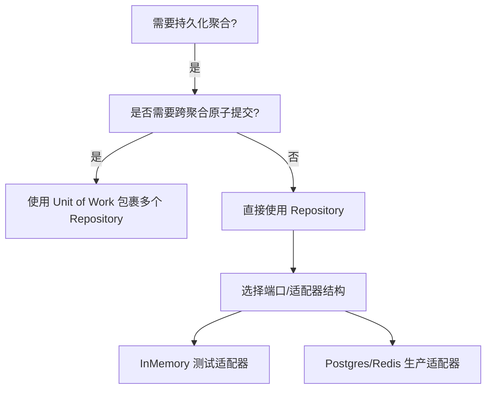
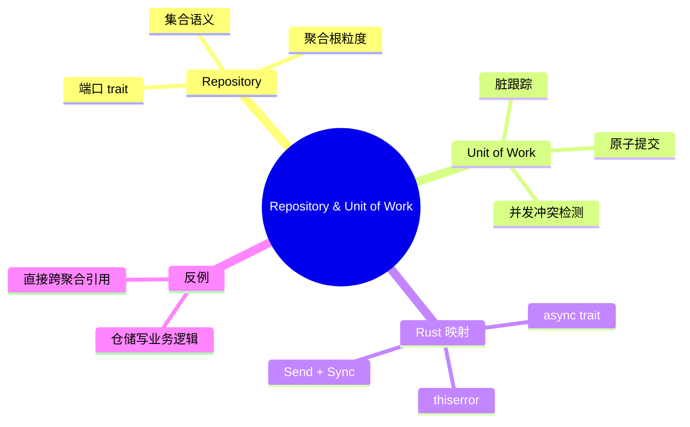

> **内容分级**: [专家级]

# 仓储与单元工作模式（Repository & Unit of Work）

**EN**: Repository and Unit of Work Patterns in Rust
**Summary**: Decouple domain aggregates from persistence technology using the Repository pattern, and enforce transactional consistency across multiple aggregates with Unit of Work.

> **Rust 版本**: 1.97.0+ (Edition 2024)
> **Bloom 层级**: L5-L6
> **权威来源**: 本文件为 `concept/` 权威页。
> **定位**: 将 Evans / Vernon 的 DDD 战术模式（Repository、Aggregate、Domain Event）与 Rust 的所有权、trait、错误处理模型对齐，提供可在生产落地的实现策略。
> **前置概念**: [DDD Tactical Patterns in Rust](../14_enterprise_architecture/04_domain_driven_design_in_rust.md) · [Type System](../../01_foundation/02_type_system/01_type_system.md) · [Error Handling](../../01_foundation/08_error_handling/01_error_handling_basics.md) · [Paradigm Matrix](../../05_comparative/00_paradigms/01_paradigm_matrix.md)
> **后置概念**: [Hexagonal Architecture](25_hexagonal_ports_and_adapters.md) · [CQRS and Event Sourcing](07_cqrs_event_sourcing.md)

---

> **来源 / Provenance**:
> [Evans 2003 — *Domain-Driven Design*](https://www.oreilly.com/library/view/domain-driven-design-tackling/0321125215/) ·
> [Vernon 2016 — *Implementing Domain-Driven Design*](https://www.oreilly.com/library/view/implementing-domain-driven-design/9780133039900/) ·
> [Fowler 2002 — Repository pattern](https://martinfowler.com/eaaCatalog/repository.html) ·
> [Fowler 2004 — Unit of Work](https://martinfowler.com/eaaCatalog/unitOfWork.html) ·
> [Rust Design Patterns](https://rust-unofficial.github.io/patterns/)

---

## 一、权威定义

**Repository（仓储）**: 一个介于领域层与数据映射层之间的中介，使用与领域对象相同的语义（通常是集合语义）来封装对数据源的访问。它让领域逻辑摆脱 SQL、ORM、缓存等基础设施细节。

**Unit of Work（工作单元）**: 维护受业务事务影响的对象列表，协调变化的写入与并发问题的解决。它将一次业务操作中的多个 Repository 调用聚合成单一的原子提交单元。

> **来源**: [Evans 2003 — *Domain-Driven Design*](https://www.oreilly.com/library/view/domain-driven-design-tackling/0321125215/) · [Fowler 2002 — Repository](https://martinfowler.com/eaaCatalog/repository.html) · [Fowler 2004 — Unit of Work](https://martinfowler.com/eaaCatalog/unitOfWork.html)

---

## 二、属性矩阵

| 属性 | Repository | Unit of Work |
|:---|:---|:---|
| **问题** | 领域代码直接依赖持久化技术 | 多个聚合的修改需要原子提交 |
| **意图** | 用集合语义抽象持久化 | 跟踪变更、协调提交、处理并发 |
| **Rust 载体** | `trait` + `async fn` / `#[async_trait]` | 上下文 struct + `HashMap`/`Vec` 跟踪脏对象 |
| **生命周期** | 通常与请求/用例同生命周期 | 通常与一次业务事务同生命周期 |
| **错误模型** | `Result<T, DomainError>` | `Result<(), UnitOfWorkError>` |
| **并发控制** | 由具体实现（DB 行锁、乐观锁）处理 | 在提交点统一检测版本冲突 |

---

## 三、Rust 实现

### 3.1 Repository trait

```rust,ignore
use std::future::Future;
use uuid::Uuid;

pub struct OrderId(Uuid);
pub struct Order { id: OrderId, /* ... */ }

#[derive(Debug, thiserror::Error)]
pub enum OrderRepositoryError {
    #[error("not found")]
    NotFound,
    #[error("concurrency conflict")]
    Concurrency,
    #[error(transparent)]
    Infrastructure(#[from] sqlx::Error),
}

// 端口定义在领域 crate：Send + Sync 保证可跨线程/异步任务使用
pub trait OrderRepository: Send + Sync {
    fn by_id(&self, id: &OrderId) -> impl Future<Output = Result<Order, OrderRepositoryError>> + Send;
    fn save(&self, order: &Order) -> impl Future<Output = Result<(), OrderRepositoryError>> + Send;
}
```

### 3.2 Unit of Work 骨架

```rust,ignore
pub struct UnitOfWork<'a, R: OrderRepository> {
    repo: &'a R,
    dirty: Vec<Order>,
}

impl<'a, R: OrderRepository> UnitOfWork<'a, R> {
    pub fn new(repo: &'a R) -> Self {
        Self { repo, dirty: vec![] }
    }

    pub fn mark_dirty(&mut self, order: Order) {
        self.dirty.push(order);
    }

    pub async fn commit(self) -> Result<(), OrderRepositoryError> {
        // 生产环境应使用数据库事务保证原子性
        for order in self.dirty {
            self.repo.save(&order).await?;
        }
        Ok(())
    }
}
```

---

## 四、关系

- **Repository ↔ Aggregate**: Repository 只操作聚合根；聚合内部实体不直接暴露。
- **Repository ↔ Hexagonal Architecture**: Repository trait 是「端口」，Postgres/Redis/Memory 实现是「适配器」。
- **Unit of Work ↔ Saga**: Unit of Work 处理单个事务内的本地一致性；Saga 处理跨服务/跨聚合的长事务一致性。

---

## 五、反例与边界

### 反例：在仓储中写业务逻辑

```rust,ignore
// ❌ 错误：Repository 越界处理领域规则
impl OrderRepository for SqlOrderRepository {
    async fn apply_discount(&self, id: &OrderId, pct: u8) {
        // 折扣逻辑应放在领域服务或聚合中
    }
}
```

**修正**: Repository 只负责持久化与查询；业务规则留在 `Order` 聚合或 `PricingService` 领域服务。

### 边界：Rust 异步 trait 与 Send/Sync

Repository 通常跨越线程池与网络边界，因此 trait 方法必须返回 `Send` Future。Rust 1.75+ 原生 `async fn` in trait 已支持，但返回 `impl Future<...> + Send` 更稳定可控。

---

## 六、决策树



---

## 七、思维导图



---

## 八、权威来源索引

- Evans, E. *Domain-Driven Design: Tackling Complexity in the Heart of Software*. Addison-Wesley, 2003.
- Vernon, V. *Implementing Domain-Driven Design*. Addison-Wesley, 2016.
- Fowler, M. "Repository." *Patterns of Enterprise Application Architecture*, 2002.
- Fowler, M. "Unit of Work." *Patterns of Enterprise Application Architecture*, 2004.
- [Rust Design Patterns](https://rust-unofficial.github.io/patterns/)

> **文档版本**: 1.0 ｜ **最后更新**: 2026-07-31 ｜ **状态**: ✅ 新建权威页
