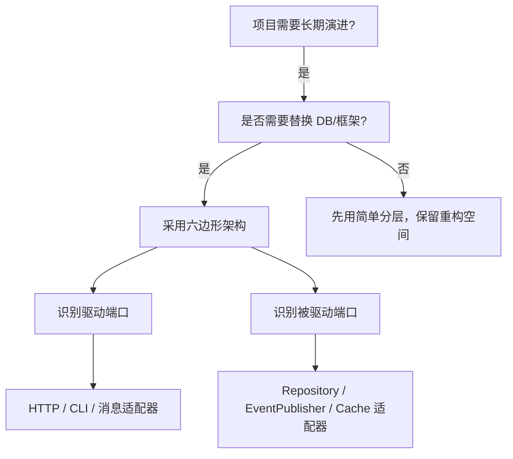
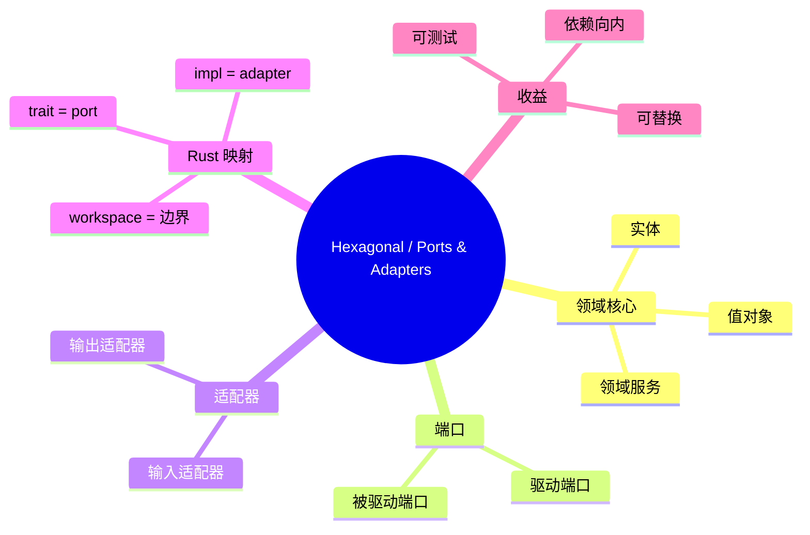

> **内容分级**: [专家级]

# 六边形架构 / 端口与适配器模式（Hexagonal / Ports & Adapters）

**EN**: Hexagonal Architecture and Ports & Adapters in Rust
**Summary**: Structure applications so that business logic depends only on inward-facing ports, while adapters connect those ports to frameworks, databases, and external services.

> **Rust 版本**: 1.97.0+ (Edition 2024)
> **Bloom 层级**: L6
> **权威来源**: 本文件为 `concept/` 权威页。
> **定位**: 将 Cockburn 的六边形架构（又称 Ports & Adapters）与 Rust 的 trait/workspace/Cargo 特性对齐，建立可测试、可替换的领域核心。
> **前置概念**: [Architecture Patterns](08_architecture_patterns.md) · [DDD Tactical Patterns](../14_enterprise_architecture/04_domain_driven_design_in_rust.md) · [Traits](../../02_intermediate/00_traits/01_traits.md)
> **后置概念**: [Repository and Unit of Work](24_repository_and_unit_of_work.md) · [Clean Architecture](26_clean_architecture_in_rust.md) · [CQRS and Event Sourcing](07_cqrs_event_sourcing.md)

---

> **来源 / Provenance**:
> [Cockburn 2005 — Hexagonal Architecture](https://alistair.cockburn.us/hexagonal-architecture/) ·
> [Fowler 2005 — Dependency Injection](https://martinfowler.com/articles/injection.html) ·
> [Rust Design Patterns](https://rust-unofficial.github.io/patterns/) ·
> [The Cargo Book — Workspaces](https://doc.rust-lang.org/cargo/reference/workspaces.html)

---

## 一、权威定义

**Hexagonal Architecture（六边形架构）** 由 Alistair Cockburn 提出，其核心思想是：

> 让应用程序以这样一种方式构建：无需借助其他系统，即可在用户、程序、自动化测试或批处理脚本中运行，并且无需借助其他系统即可独立开发和测试。

六边形的每条边代表一组**端口（Port）**；连接到端口的是**适配器（Adapter）**。领域逻辑位于六边形内部，只依赖端口契约，不依赖具体技术。

> **来源**: [Cockburn 2005 — Hexagonal Architecture](https://alistair.cockburn.us/hexagonal-architecture/)

---

## 二、属性矩阵

| 概念 | 角色 | Rust 映射 | 测试策略 |
|:---|:---|:---|:---|
| **Domain（领域）** | 业务规则与实体 | `crate` 内的 `domain/` 模块 | 纯单元测试，无 I/O |
| **Port（端口）** | 领域对外声明的契约 | `trait`（驱动/被驱动端口） | Mock 实现 |
| **Adapter（适配器）** | 端口的技术实现 | `struct impl Trait` | 集成测试 |
| **Application Service** | 用例编排 | 领域 crate 内的 service 函数 | 使用 in-memory adapter 测试 |
| **Infrastructure** | DB、HTTP、消息队列 | 独立 crate 或模块 | 容器化集成测试 |

---

## 三、Rust 实现

### 3.1 端口 trait

```rust,ignore
// 领域 crate：只声明契约，不依赖任何框架
pub trait OrderRepository: Send + Sync {
    async fn by_id(&self, id: &OrderId) -> Result<Option<Order>, OrderError>;
    async fn save(&self, order: &Order) -> Result<(), OrderError>;
}

pub trait EventPublisher: Send + Sync {
    async fn publish(&self, event: DomainEvent) -> Result<(), PublishError>;
}
```

### 3.2 应用服务使用端口

```rust,ignore
pub struct PlaceOrderUseCase<R, P> {
    repo: R,
    publisher: P,
}

impl<R: OrderRepository, P: EventPublisher> PlaceOrderUseCase<R, P> {
    pub async fn execute(&self, cmd: PlaceOrderCommand) -> Result<OrderId, OrderError> {
        let mut order = Order::new(cmd.customer_id);
        for item in cmd.items {
            order.add_item(item.product_id, item.qty, item.price)?;
        }
        self.repo.save(&order).await?;
        for event in order.take_events() {
            self.publisher.publish(event).await?;
        }
        Ok(order.id().clone())
    }
}
```

### 3.3 适配器实现

```rust,ignore
// 基础设施 crate：依赖领域 crate
pub struct PostgresOrderRepository { pool: PgPool }

impl OrderRepository for PostgresOrderRepository {
    async fn by_id(&self, id: &OrderId) -> Result<Option<Order>, OrderError> {
        // SQL 实现
        todo!()
    }
    async fn save(&self, order: &Order) -> Result<(), OrderError> {
        todo!()
    }
}
```

---

## 四、关系

- **Hexagonal ↔ Clean Architecture**: 两者都强调依赖方向向内；Clean Architecture 增加了分层（Entities → Use Cases → Interface Adapters → Frameworks）。
- **Hexagonal ↔ Repository**: Repository 是 Hexagonal 中「被驱动端口」的典型实例。
- **Hexagonal ↔ Microservices**: 单个微服务内部可采用六边形架构，服务边界对应另一个层级的端口。

---

## 五、反例与边界

### 反例：领域依赖框架

```rust,ignore
// ❌ 错误：领域 crate 依赖 actix-web
use actix_web::HttpRequest;

pub fn place_order(req: HttpRequest) { /* ... */ }
```

**修正**: HTTP 处理应放在接口适配器层；领域只接收已解析的命令 struct。

### 边界：过度拆分

六边形架构的收益在需要替换技术栈或大量测试时最明显。对于一次性脚本或原型，完整端口/适配器结构可能是过度工程。

---

## 六、决策树



---

## 七、思维导图



---

## 八、权威来源索引

- Cockburn, A. "Hexagonal Architecture." 2005. [https://alistair.cockburn.us/hexagonal-architecture/](https://alistair.cockburn.us/hexagonal-architecture/)
- Fowler, M. "Dependency Injection." 2005. [https://martinfowler.com/articles/injection.html](https://martinfowler.com/articles/injection.html)
- Freeman, E. & Pryce, N. *Growing Object-Oriented Software, Guided by Tests*. Addison-Wesley, 2009.
- [Rust Design Patterns](https://rust-unofficial.github.io/patterns/)

> **文档版本**: 1.0 ｜ **最后更新**: 2026-07-31 ｜ **状态**: ✅ 新建权威页
