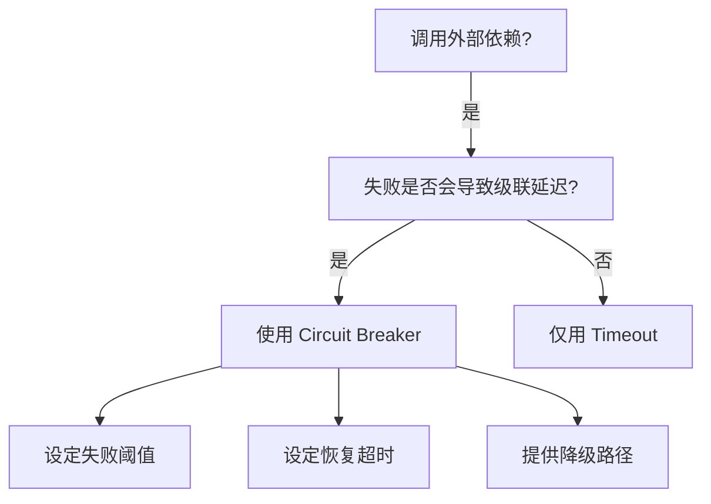
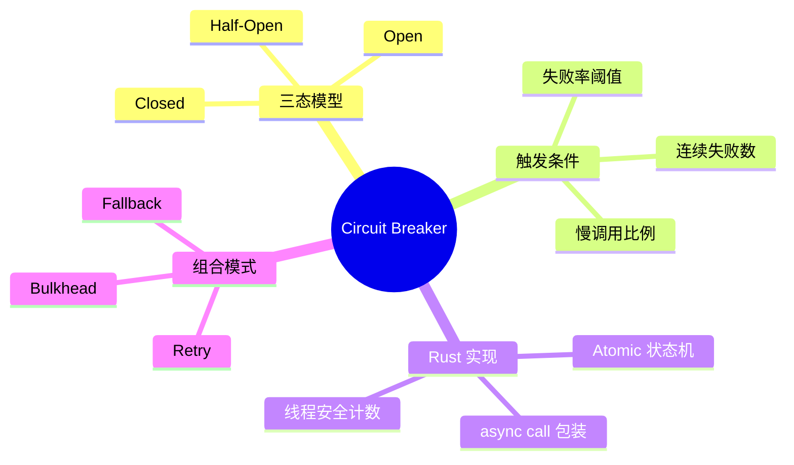

> **内容分级**: [专家级]

# 断路器模式（Circuit Breaker）

**EN**: Circuit Breaker Pattern in Rust
**Summary**: Prevent cascading failures by stopping calls to an unhealthy dependency until it recovers, while providing graceful degradation.

> **Rust 版本**: 1.97.0+ (Edition 2024)
> **Bloom 层级**: L6
> **权威来源**: 本文件为 `concept/` 权威页。
> **定位**: 将 Michael Nygard 的 Release It! 断路器模式与 Rust 的并发原语、类型系统对齐，实现线程安全的弹性中间件。
> **前置概念**: [Concurrency Patterns](../../03_advanced/00_concurrency/03_concurrency_patterns.md) · [Error Handling](../../01_foundation/08_error_handling/01_error_handling_basics.md) · [State Machine](../../01_foundation/02_type_system/01_type_system.md) · [Paradigm Matrix](../../05_comparative/00_paradigms/01_paradigm_matrix.md)
> **后置概念**: [Bulkhead](27_bulkhead.md) · [Retry](28_retry.md) · [Microservice Patterns](05_microservice_patterns.md)

---

> **来源 / Provenance**:
> [Nygard 2018 — *Release It!*, 2nd Edition](https://pragprog.com/titles/mnee2/release-it-second-edition/) ·
> [Fowler 2014 — CircuitBreaker](https://martinfowler.com/bliki/CircuitBreaker.html) ·
> [Microsoft — Cloud Design Patterns: Circuit Breaker](https://learn.microsoft.com/en-us/azure/architecture/patterns/circuit-breaker) ·
> [AWS — Circuit Breaker](https://docs.aws.amazon.com/prescriptive-guidance/latest/cloud-design-patterns/circuit-breaker.html)

---

## 一、权威定义

**断路器（Circuit Breaker）**: 一种容错模式，用于检测依赖项故障并在故障持续时快速失败，而不是让调用方长时间等待超时。其状态通常分为：

- **Closed（闭合）**: 正常调用；累计失败率。
- **Open（断开）**: 快速失败，不调用依赖。
- **Half-Open（半开）**: 允许少量探测请求，决定是否恢复 Closed。

> **来源**: [Nygard 2018 — *Release It!*](https://pragprog.com/titles/mnee2/release-it-second-edition/) · [Fowler 2014 — CircuitBreaker](https://martinfowler.com/bliki/CircuitBreaker.html)

---

## 二、属性矩阵

| 状态 | 行为 | 触发条件 | Rust 实现要点 |
|:---|:---|:---|:---|
| **Closed** | 透传调用，记录成功/失败 | 默认状态 | `AtomicU64` 计数器 + 滑动窗口 |
| **Open** | 立即返回 `Err(CircuitOpen)` | 失败率/连续失败超阈值 | `AtomicUsize` 状态 + 超时时间戳 |
| **Half-Open** | 有限探测调用 | Open 超时后 | 令牌桶/计数器限制探测数 |

---

## 三、Rust 实现

```rust,ignore
use std::sync::atomic::{AtomicU64, AtomicUsize, Ordering};
use std::sync::Arc;
use std::time::{Duration, Instant};

#[derive(Clone, Copy, Debug, PartialEq, Eq)]
#[repr(usize)]
enum State {
    Closed = 0,
    Open = 1,
    HalfOpen = 2,
}

pub struct CircuitBreaker {
    state: AtomicUsize,
    failures: AtomicU64,
    successes: AtomicU64,
    last_failure_time: AtomicU64, // epoch ms
    threshold: u64,
    timeout: Duration,
}

impl CircuitBreaker {
    pub fn new(threshold: u64, timeout: Duration) -> Arc<Self> {
        Arc::new(Self {
            state: AtomicUsize::new(State::Closed as usize),
            failures: AtomicU64::new(0),
            successes: AtomicU64::new(0),
            last_failure_time: AtomicU64::new(0),
            threshold,
            timeout,
        })
    }

    pub async fn call<F, Fut, T, E>(&self, f: F) -> Result<T, CircuitError<E>>
    where
        F: FnOnce() -> Fut,
        Fut: std::future::Future<Output = Result<T, E>>,
    {
        if self.should_trip() {
            return Err(CircuitError::Open);
        }

        match f().await {
            Ok(v) => {
                self.record_success();
                Ok(v)
            }
            Err(e) => {
                self.record_failure();
                Err(CircuitError::Inner(e))
            }
        }
    }

    fn should_trip(&self) -> bool {
        match self.state.load(Ordering::Relaxed) {
            s if s == State::Open as usize => {
                let last = self.last_failure_time.load(Ordering::Relaxed);
                let elapsed = Instant::now().duration_since(Instant::from(last));
                if elapsed > self.timeout {
                    self.state.store(State::HalfOpen as usize, Ordering::Relaxed);
                    false
                } else {
                    true
                }
            }
            _ => false,
        }
    }

    fn record_failure(&self) {
        self.failures.fetch_add(1, Ordering::Relaxed);
        self.last_failure_time.store(now_epoch_ms(), Ordering::Relaxed);
        if self.failures.load(Ordering::Relaxed) >= self.threshold {
            self.state.store(State::Open as usize, Ordering::Relaxed);
        }
    }

    fn record_success(&self) {
        self.successes.fetch_add(1, Ordering::Relaxed);
        if self.state.load(Ordering::Relaxed) == State::HalfOpen as usize {
            self.state.store(State::Closed as usize, Ordering::Relaxed);
            self.failures.store(0, Ordering::Relaxed);
        }
    }
}

#[derive(Debug)]
pub enum CircuitError<E> {
    Open,
    Inner(E),
}

fn now_epoch_ms() -> u64 {
    // 占位实现
    0
}
```

---

## 四、关系

- **Circuit Breaker ↔ Retry**: 重试解决瞬时故障；断路器解决持续故障。两者常组合：重试内部 + 断路器外部。
- **Circuit Breaker ↔ Bulkhead**: 断路器保护单个依赖；舱壁隔离限制故障的爆炸半径。
- **Circuit Breaker ↔ Timeout**: 超时定义「慢」；断路器定义「坏」。

---

## 五、反例与边界

### 反例：所有异常都触发断路

```rust,ignore
// ❌ 错误：把 4xx 业务错误也记为依赖故障
match response.status() {
    400..=499 => self.cb.record_failure(), // 可能是调用方错误
    _ => {}
}
```

**修正**: 只把超时、5xx、连接错误等「依赖不可用」信号记为失败。

### 边界：不是所有调用都适合断路器

幂等读操作适合；非幂等写操作需要配合幂等键或 Saga，避免 Half-Open 探测造成副作用。

---

## 六、决策树



---

## 七、思维导图



---

## 八、权威来源索引

- Nygard, M. *Release It! Design and Deploy Production-Ready Software*, 2nd ed. Pragmatic Bookshelf, 2018.
- Fowler, M. "CircuitBreaker." *Bliki*, 2014. [https://martinfowler.com/bliki/CircuitBreaker.html](https://martinfowler.com/bliki/CircuitBreaker.html)
- Microsoft. "Circuit Breaker pattern." *Azure Architecture Center*. [https://learn.microsoft.com/en-us/azure/architecture/patterns/circuit-breaker](https://learn.microsoft.com/en-us/azure/architecture/patterns/circuit-breaker)
- AWS. "Circuit Breaker pattern." *Prescriptive Guidance*. [https://docs.aws.amazon.com/prescriptive-guidance/latest/cloud-design-patterns/circuit-breaker.html](https://docs.aws.amazon.com/prescriptive-guidance/latest/cloud-design-patterns/circuit-breaker.html)

> **文档版本**: 1.0 ｜ **最后更新**: 2026-07-31 ｜ **状态**: ✅ 新建权威页
