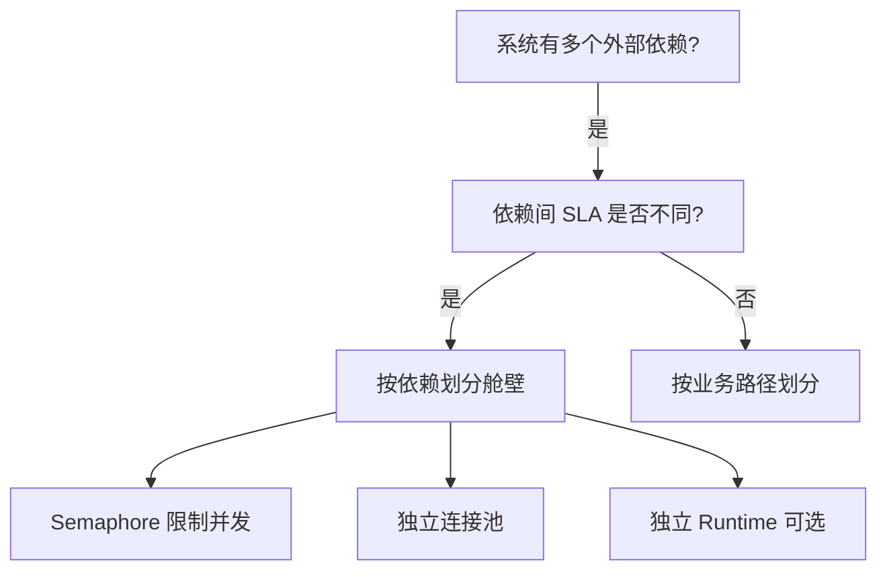
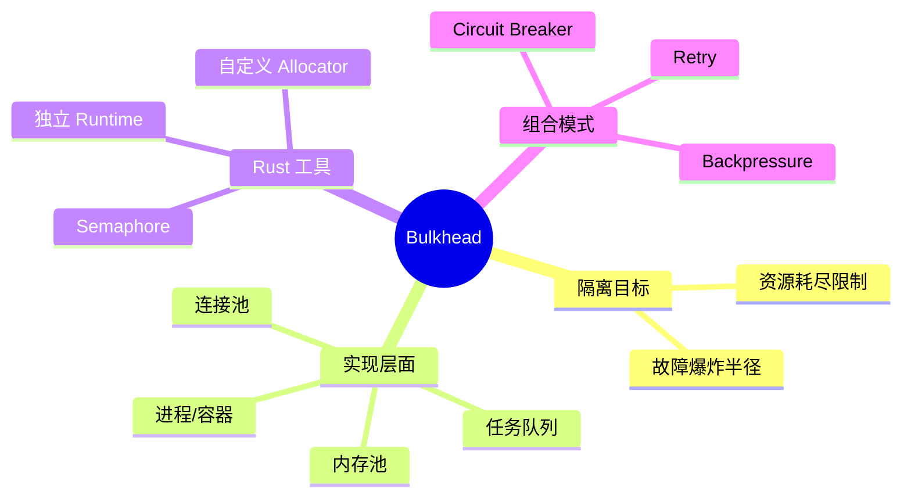

> **内容分级**: [专家级]

# 舱壁隔离模式（Bulkhead）

**EN**: Bulkhead Pattern in Rust
**Summary**: Isolate failures into compartments so that a problem in one part of the system cannot exhaust resources used by others.

> **Rust 版本**: 1.97.0+ (Edition 2024)
> **Bloom 层级**: L6
> **权威来源**: 本文件为 `concept/` 权威页。
> **定位**: 将 Nygard 的舱壁模式映射到 Rust 的线程池、异步任务、内存配额与容器资源限制，建立多层次的故障隔离。
> **前置概念**: [Concurrency Patterns](../../03_advanced/00_concurrency/03_concurrency_patterns.md) · [Async Runtime](../../03_advanced/01_async/01_async.md) · [Circuit Breaker](26_circuit_breaker.md)
> **后置概念**: [Retry](28_retry.md) · [Microservice Patterns](05_microservice_patterns.md)

---

> **来源 / Provenance**:
> [Nygard 2018 — *Release It!*, 2nd Edition](https://pragprog.com/titles/mnee2/release-it-second-edition/) ·
> [Microsoft — Cloud Design Patterns: Bulkhead](https://learn.microsoft.com/en-us/azure/architecture/patterns/bulkhead) ·
> [AWS — Bulkhead Isolation](https://docs.aws.amazon.com/prescriptive-guidance/latest/cloud-design-patterns/bulkhead-isolation.html)

---

## 一、权威定义

**舱壁（Bulkhead）**: 将系统划分为隔离的隔舱，使一个隔舱的故障不会影响其他隔舱。该名称来自船舶设计：即使一个舱室进水，舱壁也能防止沉船。

在软件系统中，隔离可以发生在多个层面：

- **线程/任务隔离**: 为不同依赖分配独立线程池或任务队列。
- **连接池隔离**: 不同服务使用独立连接池。
- **进程/容器隔离**: 不同服务运行在不同进程或容器中，限制 CPU/内存配额。

> **来源**: [Nygard 2018 — *Release It!*](https://pragprog.com/titles/mnee2/release-it-second-edition/) · [Microsoft — Bulkhead](https://learn.microsoft.com/en-us/azure/architecture/patterns/bulkhead)

---

## 二、属性矩阵

| 隔离层面 | 资源对象 | Rust 实现 | 故障影响 |
|:---|:---|:---|:---|
| **任务队列** | 并发任务数 | `tokio::sync::Semaphore` / 独立 `Runtime` | 慢依赖不会占满全局调度器 |
| **连接池** | TCP/DB 连接 | 按依赖分 `Pool` | 连接泄漏被限制在单一依赖 |
| **内存池** | 堆内存 | `#[global_allocator]` 自定义或 arena | OOM 被限制在单一舱室 |
| **进程** | OS 进程 | 容器/cgroup | 单服务崩溃不影响宿主机 |

---

## 三、Rust 实现

### 3.1 基于信号量的舱壁

```rust,ignore
use std::sync::Arc;
use tokio::sync::Semaphore;

pub struct Bulkhead {
    semaphore: Arc<Semaphore>,
}

impl Bulkhead {
    pub fn new(max_concurrent: usize) -> Self {
        Self {
            semaphore: Arc::new(Semaphore::new(max_concurrent)),
        }
    }

    pub async fn execute<F, Fut, T>(&self, f: F) -> Result<T, BulkheadError>
    where
        F: FnOnce() -> Fut,
        Fut: std::future::Future<Output = T>,
    {
        let permit = self.semaphore.try_acquire().map_err(|_| BulkheadError::Full)?;
        let result = f().await;
        drop(permit);
        Ok(result)
    }
}

#[derive(Debug)]
pub enum BulkheadError {
    Full,
}
```

### 3.2 独立异步运行时

```rust,ignore
use tokio::runtime::Runtime;

// 为关键路径与辅助路径分别创建运行时，避免辅助任务阻塞关键路径
pub struct IsolatedRuntimes {
    critical: Runtime,
    background: Runtime,
}
```

---

## 四、关系

- **Bulkhead ↔ Circuit Breaker**: 舱壁限制资源耗尽范围；断路器停止对不健康依赖的调用。两者常同时使用。
- **Bulkhead ↔ Retry**: 重试应在舱壁容量内发生，否则重试风暴会迅速占满舱室。
- **Bulkhead ↔ Backpressure**: 舱壁满时返回 `Full` 是一种背压信号。

---

## 五、反例与边界

### 反例：全局单线程池

```rust,ignore
// ❌ 错误：所有依赖共享同一个 Tokio runtime，慢依赖阻塞快依赖
#[tokio::main]
async fn main() {
    // 默认 runtime 被所有任务共享
}
```

**修正**: 为不同 SLA 的路径配置独立 runtime 或至少独立 `Semaphore`。

### 边界：隔离粒度

过细的舱壁会增加管理复杂度；过粗的舱壁失去隔离意义。通常按依赖服务或业务路径划分。

---

## 六、决策树



---

## 七、思维导图



---

## 八、权威来源索引

- Nygard, M. *Release It! Design and Deploy Production-Ready Software*, 2nd ed. Pragmatic Bookshelf, 2018.
- Microsoft. "Bulkhead pattern." *Azure Architecture Center*. [https://learn.microsoft.com/en-us/azure/architecture/patterns/bulkhead](https://learn.microsoft.com/en-us/azure/architecture/patterns/bulkhead)
- AWS. "Bulkhead Isolation pattern." *Prescriptive Guidance*. [https://docs.aws.amazon.com/prescriptive-guidance/latest/cloud-design-patterns/bulkhead-isolation.html](https://docs.aws.amazon.com/prescriptive-guidance/latest/cloud-design-patterns/bulkhead-isolation.html)

> **文档版本**: 1.0 ｜ **最后更新**: 2026-07-31 ｜ **状态**: ✅ 新建权威页
