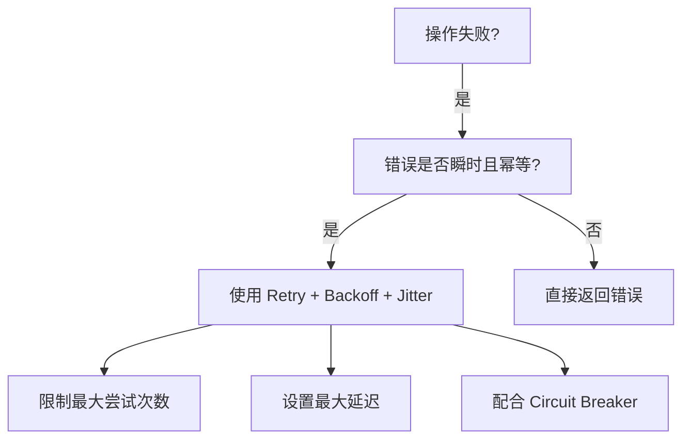
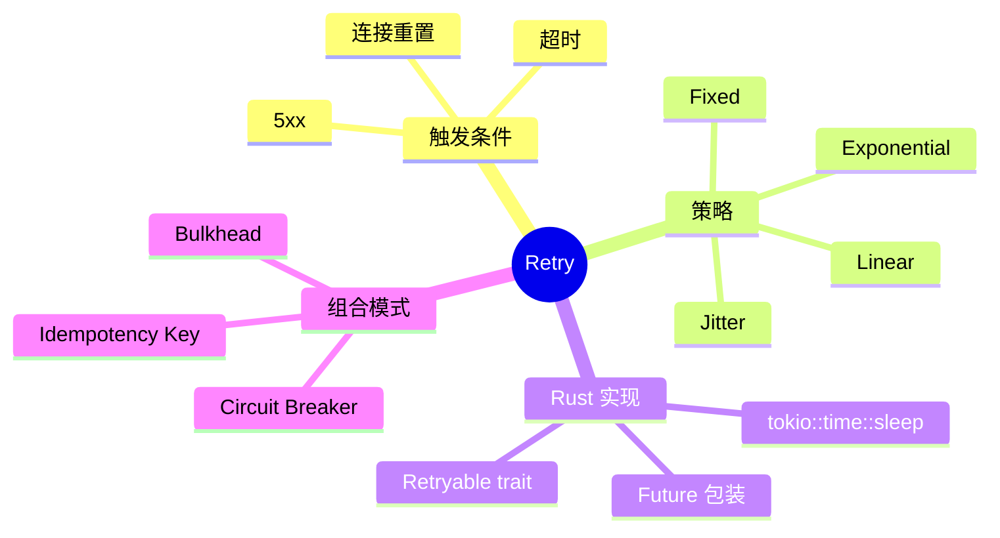

> **内容分级**: [专家级]

# 重试模式（Retry）

**EN**: Retry Pattern in Rust
**Summary**: Transparently re-execute failed operations that are likely to succeed on subsequent attempts, using backoff and jitter to avoid thundering herds.

> **Rust 版本**: 1.97.0+ (Edition 2024)
> **Bloom 层级**: L5-L6
> **权威来源**: 本文件为 `concept/` 权威页。
> **定位**: 将 transient-fault handling 的 Retry 模式与 Rust 的 `Future`、trait、错误类型对齐，实现可组合、可观测的重试中间件。
> **前置概念**: [Error Handling](../../01_foundation/08_error_handling/01_error_handling_basics.md) · [Async](../../03_advanced/01_async/01_async.md) · [Circuit Breaker](26_circuit_breaker.md)
> **后置概念**: [Bulkhead](27_bulkhead.md) · [Saga](29_saga.md)

---

> **来源 / Provenance**:
> [Microsoft — Cloud Design Patterns: Retry](https://learn.microsoft.com/en-us/azure/architecture/patterns/retry) ·
> [AWS — Retry pattern](https://docs.aws.amazon.com/prescriptive-guidance/latest/cloud-design-patterns/retry-pattern.html) ·
> [Vaucher et al. — A Comprehensive Empirical Study on Transient Fault Handling](https://doi.org/10.1145/3377811.3380415) ·
> [Exponential Backoff and Jitter (AWS Blog)](https://aws.amazon.com/blogs/architecture/exponential-backoff-and-jitter/)

---

## 一、权威定义

**重试（Retry）**: 当操作因瞬时故障（transient fault）失败时，按预定策略重新执行该操作。典型策略包括：

- **固定间隔（Fixed Interval）**: 每次等待固定时间。
- **指数退避（Exponential Backoff）**: 等待时间按指数增长。
- **指数退避 + 抖动（Jitter）**: 在退避基础上加入随机扰动，避免多个客户端同时重试。

> **来源**: [Microsoft — Retry pattern](https://learn.microsoft.com/en-us/azure/architecture/patterns/retry) · [AWS — Retry pattern](https://docs.aws.amazon.com/prescriptive-guidance/latest/cloud-design-patterns/retry-pattern.html)

---

## 二、属性矩阵

| 策略 | 公式 | 优点 | 缺点 |
|:---|:---|:---|:---|
| **Fixed** | `delay = base` | 简单可预测 | 易造成重试风暴 |
| **Linear** | `delay = base * attempt` | 比固定间隔更温和 | 仍可能同步 |
| **Exponential** | `delay = base * 2^attempt` | 快速降低负载 | 最大值需限制 |
| **Exponential + Jitter** | `delay = rand(0, base * 2^attempt)` | 打散重试峰值 | 实现稍复杂 |

---

## 三、Rust 实现

```rust,ignore
use std::future::Future;
use std::time::Duration;
use rand::Rng;
use tokio::time::sleep;

pub struct RetryPolicy {
    max_attempts: u32,
    base_delay: Duration,
    max_delay: Duration,
}

impl RetryPolicy {
    pub async fn execute<F, Fut, T, E>(&self, mut f: F) -> Result<T, E>
    where
        F: FnMut() -> Fut,
        Fut: Future<Output = Result<T, E>>,
    {
        let mut attempt = 0;
        loop {
            match f().await {
                Ok(v) => return Ok(v),
                Err(e) if attempt + 1 >= self.max_attempts => return Err(e),
                Err(_) => {
                    let delay = self.compute_delay(attempt);
                    sleep(delay).await;
                    attempt += 1;
                }
            }
        }
    }

    fn compute_delay(&self, attempt: u32) -> Duration {
        let exp = self.base_delay * 2_u32.pow(attempt);
        let capped = exp.min(self.max_delay);
        let jitter_ms = rand::thread_rng().gen_range(0..capped.as_millis() as u64 + 1);
        Duration::from_millis(jitter_ms)
    }
}

// 仅对可重试错误启用重试
pub trait Retryable {
    fn is_retryable(&self) -> bool;
}
```

---

## 四、关系

- **Retry ↔ Circuit Breaker**: 重试解决瞬时故障；断路器解决持续故障。组合时，重试应发生在断路器 Closed 状态下。
- **Retry ↔ Idempotency**: 重试必须配合幂等键，避免副作用重复发生。
- **Retry ↔ Bulkhead**: 重试次数与并发必须受舱壁容量约束，防止重试风暴。

---

## 五、反例与边界

### 反例：无条件重试所有错误

```rust,ignore
// ❌ 错误：对业务错误也重试
for _ in 0..3 {
    if create_user(email).await.is_err() { /* retry */ }
}
```

**修正**: 仅对 `is_retryable()` 为 true 的错误（超时、连接重置、5xx）重试；4xx 业务错误应直接返回。

### 边界：重试放大延迟

每次重试都会增加尾部延迟。对于用户同步请求，应限制 `max_attempts` 并设置较短的 `max_delay`。

---

## 六、决策树



---

## 七、思维导图



---

## 八、权威来源索引

- Microsoft. "Retry pattern." *Azure Architecture Center*. [https://learn.microsoft.com/en-us/azure/architecture/patterns/retry](https://learn.microsoft.com/en-us/azure/architecture/patterns/retry)
- AWS. "Retry pattern." *Prescriptive Guidance*. [https://docs.aws.amazon.com/prescriptive-guidance/latest/cloud-design-patterns/retry-pattern.html](https://docs.aws.amazon.com/prescriptive-guidance/latest/cloud-design-patterns/retry-pattern.html)
- Vaucher, J. et al. "A Comprehensive Empirical Study on Transient Fault Handling." *ICPE 2020*. [https://doi.org/10.1145/3377811.3380415](https://doi.org/10.1145/3377811.3380415)
- AWS. "Exponential Backoff and Jitter." *Architecture Blog*. [https://aws.amazon.com/blogs/architecture/exponential-backoff-and-jitter/](https://aws.amazon.com/blogs/architecture/exponential-backoff-and-jitter/)

> **文档版本**: 1.0 ｜ **最后更新**: 2026-07-31 ｜ **状态**: ✅ 新建权威页
