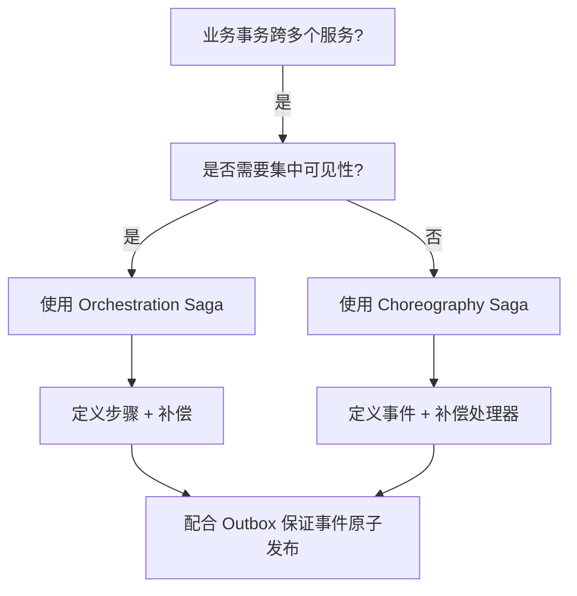
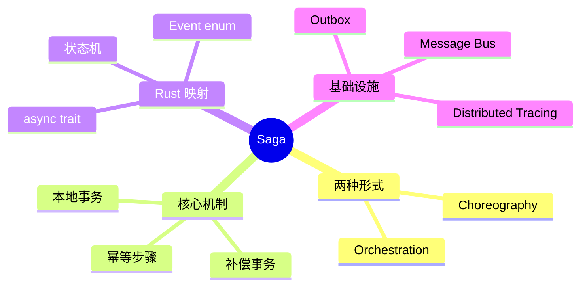

> **内容分级**: [专家级]

# Saga 模式

**EN**: Saga Pattern in Rust
**Summary**: Manage long-lived distributed transactions by splitting them into a sequence of local transactions, each with a compensating action.

> **Rust 版本**: 1.97.0+ (Edition 2024)
> **Bloom 层级**: L6
> **权威来源**: 本文件为 `concept/` 权威页。
> **定位**: 将 Garcia-Molina / Hohpe / Richardson 的 Saga 模式与 Rust 的类型系统、错误处理、异步执行模型对齐，实现可编排或可事件驱动的长事务。
> **前置概念**: [DDD Tactical Patterns](../14_enterprise_architecture/04_domain_driven_design_in_rust.md) · [Event-Driven Architecture](06_event_driven_architecture.md) · [CQRS and Event Sourcing](07_cqrs_event_sourcing.md) · [Comparative Layer README](../../05_comparative/README.md)
> **后置概念**: [Outbox](30_outbox.md) · [Microservice Patterns](05_microservice_patterns.md)

---

> **来源 / Provenance**:
> [Garcia-Molina & Salem 1987 — Sagas](https://doi.org/10.1145/38713.38742) ·
> [Hohpe & Woolf 2003 — Enterprise Integration Patterns](https://www.enterpriseintegrationpatterns.com/) ·
> [Richardson 2018 — Microservices Patterns](https://microservices.io/book) ·
> [Fowler 2004 — Transactional Observer](https://martinfowler.com/eaaDev/TransactionalObserver.html)

---

## 一、权威定义

**Saga**: 一个长事务被拆分为多个本地事务序列；每个本地事务有对应的**补偿事务（compensating transaction）**，用于在后续步骤失败时撤销已完成的步骤。

两种主要形式：

- **编排式 Saga（Choreography）**: 每个服务完成本地事务后发布事件，触发下一个服务。
- **协调式 Saga（Orchestration）**: 由中央协调器按顺序调用各服务并处理补偿。

> **来源**: [Garcia-Molina & Salem 1987](https://doi.org/10.1145/38713.38742) · [Hohpe & Woolf 2003](https://www.enterpriseintegrationpatterns.com/) · [Richardson 2018](https://microservices.io/book)

---

## 二、属性矩阵

| 维度 | Choreography | Orchestration |
|:---|:---|:---|
| **耦合** | 低（事件驱动） | 高（协调器知悉所有步骤） |
| **可观测性** | 需分布式追踪 | 协调器集中记录状态 |
| **复杂度** | 随步骤数指数增长 | 协调器逻辑线性增长 |
| **Rust 实现** | `tokio::sync::broadcast` / 消息总线 | 状态机 + `async fn` |
| **补偿触发** | 监听失败事件 | 协调器反向执行补偿 |

---

## 三、Rust 实现

### 3.1 协调式 Saga 骨架

```rust,ignore
use std::collections::VecDeque;

pub struct SagaStep<T, E> {
    name: &'static str,
    action: Box<dyn Fn(&T) -> Result<T, E> + Send + Sync>,
    compensate: Box<dyn Fn(&T) -> Result<(), E> + Send + Sync>,
}

pub struct Saga<T, E> {
    steps: Vec<SagaStep<T, E>>,
}

impl<T: Clone, E> Saga<T, E> {
    pub fn new() -> Self {
        Self { steps: vec![] }
    }

    pub fn step(mut self, step: SagaStep<T, E>) -> Self {
        self.steps.push(step);
        self
    }

    pub fn execute(&self, initial: T) -> Result<T, E> {
        let mut state = initial;
        let mut completed: VecDeque<(&SagaStep<T, E>, T)> = VecDeque::new();

        for step in &self.steps {
            match (step.action)(&state) {
                Ok(new_state) => {
                    completed.push_back((step, state));
                    state = new_state;
                }
                Err(e) => {
                    // 反向执行补偿
                    while let Some((s, prev)) = completed.pop_back() {
                        let _ = (s.compensate)(&prev);
                    }
                    return Err(e);
                }
            }
        }
        Ok(state)
    }
}
```

### 3.2 幂等 Saga 步骤

```rust,ignore
pub trait IdempotentStep {
    type State;
    type Error;
    async fn execute(&self, state: &Self::State) -> Result<Self::State, Self::Error>;
    async fn compensate(&self, state: &Self::State) -> Result<(), Self::Error>;
}
```

---

## 四、关系

- **Saga ↔ Unit of Work**: Unit of Work 保证单个服务内的原子性；Saga 保证跨服务的长事务最终一致性。
- **Saga ↔ Outbox**: Outbox 保证本地事务与事件发布的原子性，是 Saga 的事件总线基础。
- **Saga ↔ Compensation**: 补偿不是「回滚」，而是业务意义上的撤销操作；某些操作（如发送邮件）无法真正撤销。

---

## 五、反例与边界

### 反例：把 Saga 当作分布式锁

```rust,ignore
// ❌ 错误：在 Saga 中长时间持有资源锁
async fn saga_step() {
    lock_inventory().await;
    // 长时间网络调用...
    unlock_inventory().await;
}
```

**修正**: Saga 步骤应短小，避免长时间锁定；使用预留（reservation）模式替代锁定。

### 边界：无法补偿的操作

发送邮件、扣款完成等操作难以或无法补偿。对这类操作应使用「可接受的不完美补偿」或前置校验。

---

## 六、决策树



---

## 七、思维导图



---

## 八、权威来源索引

- Garcia-Molina, H. & Salem, K. "Sagas." *SIGMOD 1987*. [https://doi.org/10.1145/38713.38742](https://doi.org/10.1145/38713.38742)
- Hohpe, G. & Woolf, B. *Enterprise Integration Patterns: Designing, Building, and Deploying Messaging Solutions*. Addison-Wesley, 2003.
- Richardson, C. *Microservices Patterns: With examples in Java*. Manning, 2018. [https://microservices.io/book](https://microservices.io/book)
- Fowler, M. "Transactional Observer." 2004. [https://martinfowler.com/eaaDev/TransactionalObserver.html](https://martinfowler.com/eaaDev/TransactionalObserver.html)

> **文档版本**: 1.0 ｜ **最后更新**: 2026-07-31 ｜ **状态**: ✅ 新建权威页
