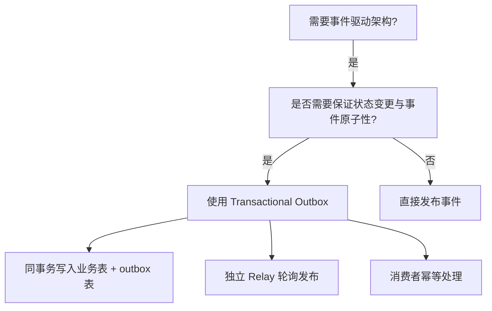
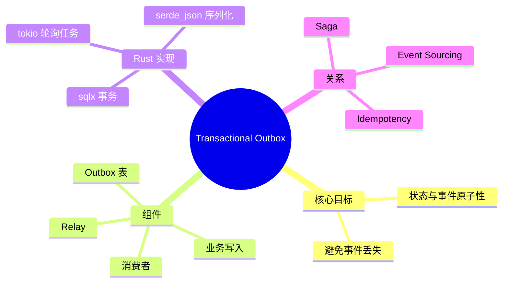

> **内容分级**: [专家级]

# 事务性发件箱模式（Transactional Outbox）

**EN**: Transactional Outbox Pattern in Rust
**Summary**: Atomically persist domain events and the state change that produced them, then publish events asynchronously via a relay.

> **Rust 版本**: 1.97.0+ (Edition 2024)
> **Bloom 层级**: L6
> **权威来源**: 本文件为 `concept/` 权威页。
> **定位**: 将 Chris Richardson 的 Transactional Outbox 模式与 Rust 的异步数据库访问、消息发布、幂等消费对齐，保证事件驱动架构中的数据一致性。
> **前置概念**: [Saga](29_saga.md) · [Event-Driven Architecture](06_event_driven_architecture.md) · [CQRS and Event Sourcing](07_cqrs_event_sourcing.md) · [Comparative Layer README](../../05_comparative/README.md)
> **后置概念**: [Microservice Patterns](05_microservice_patterns.md)

---

> **来源 / Provenance**:
> [Richardson 2018 — Microservices Patterns](https://microservices.io/book) ·
> [Hohpe & Woolf 2003 — Enterprise Integration Patterns](https://www.enterpriseintegrationpatterns.com/) ·
> [Fowler 2005 — Event Sourcing](https://martinfowler.com/eaaDev/EventSourcing.html) ·
> [Microsoft — Choreography vs Orchestration](https://learn.microsoft.com/en-us/azure/architecture/microservices/design/comparison-code)

---

## 一、权威定义

**Transactional Outbox**: 在更新数据库状态的同时，将需要发布的领域事件写入同一张数据库表的「发件箱（outbox）」中。两者处于同一本地事务，因此原子性得到保证。随后，一个独立的 **Relay（中继）** 进程轮询 outbox 表并将事件发布到消息代理。

> **来源**: [Richardson 2018 — Microservices Patterns](https://microservices.io/book)

---

## 二、属性矩阵

| 组件 | 职责 | Rust 实现 | 一致性 |
|:---|:---|:---|:---|
| **业务写入** | 更新聚合状态 | `sqlx::query` 或 ORM | 本地事务 ACID |
| **Outbox 表** | 临时存储待发布事件 | 同库表 `outbox_events` | 与业务写入同一事务 |
| **Relay** | 轮询并发布事件 | 独立 `tokio` 任务 | 至少一次发布 |
| **Consumer** | 处理事件 | `async fn` + 幂等键 | 幂等消费 |

---

## 三、Rust 实现

### 3.1 Outbox 表与写入

```rust,ignore
use sqlx::{Postgres, Transaction};
use uuid::Uuid;
use serde_json::Value;

pub struct OutboxEvent {
    pub id: Uuid,
    pub aggregate_id: String,
    pub event_type: String,
    pub payload: Value,
}

pub async fn persist_with_outbox<'a>(
    tx: &mut Transaction<'a, Postgres>,
    order: &Order,
    events: Vec<DomainEvent>,
) -> Result<(), sqlx::Error> {
    // 1. 更新聚合
    sqlx::query("UPDATE orders SET ... WHERE id = $1")
        .bind(order.id())
        .execute(&mut **tx)
        .await?;

    // 2. 同一事务写入 outbox
    for event in events {
        let outbox = OutboxEvent {
            id: Uuid::new_v4(),
            aggregate_id: order.id().to_string(),
            event_type: event.type_name(),
            payload: serde_json::to_value(event).unwrap(),
        };
        sqlx::query(
            "INSERT INTO outbox_events (id, aggregate_id, event_type, payload) VALUES ($1, $2, $3, $4)"
        )
        .bind(outbox.id)
        .bind(outbox.aggregate_id)
        .bind(outbox.event_type)
        .bind(outbox.payload)
        .execute(&mut **tx)
        .await?;
    }
    Ok(())
}
```

### 3.2 Relay 轮询发布

```rust,ignore
pub async fn run_relay(pool: &PgPool, publisher: &dyn EventPublisher) {
    loop {
        let rows: Vec<OutboxEvent> = sqlx::query_as(
            "SELECT id, aggregate_id, event_type, payload FROM outbox_events ORDER BY id LIMIT 100"
        )
        .fetch_all(pool)
        .await
        .unwrap();

        for event in rows {
            if publisher.publish(event.event_type, event.payload).await.is_ok() {
                sqlx::query("DELETE FROM outbox_events WHERE id = $1")
                    .bind(event.id)
                    .execute(pool)
                    .await
                    .unwrap();
            }
        }

        tokio::time::sleep(Duration::from_millis(100)).await;
    }
}
```

---

## 四、关系

- **Outbox ↔ Saga**: Saga 的补偿事件与步骤事件都可通过 Outbox 原子发布。
- **Outbox ↔ Event Sourcing**: Event Sourcing 把事件作为状态源；Outbox 只是把事件作为副作用通知机制。
- **Outbox ↔ Idempotency**: 消费者必须幂等，因为 Relay 可能重复发布事件。

---

## 五、反例与边界

### 反例：业务写入与事件发布分离

```rust,ignore
// ❌ 错误：先更新 DB，再发布事件；中间崩溃会导致事件丢失
update_order(&order).await?;
publisher.publish(event).await?;
```

**修正**: 使用 Outbox 在同一事务中持久化事件，再由 Relay 异步发布。

### 边界：Relay 延迟

事件从产生到发布存在 Relay 轮询间隔的延迟。对实时性要求极高的场景，需评估是否接受。

---

## 六、决策树



---

## 七、思维导图



---

## 八、权威来源索引

- Richardson, C. *Microservices Patterns: With examples in Java*. Manning, 2018. [https://microservices.io/book](https://microservices.io/book)
- Hohpe, G. & Woolf, B. *Enterprise Integration Patterns*. Addison-Wesley, 2003.
- Fowler, M. "Event Sourcing." 2005. [https://martinfowler.com/eaaDev/EventSourcing.html](https://martinfowler.com/eaaDev/EventSourcing.html)
- Microsoft. "Choreography vs Orchestration." *Azure Architecture Center*. [https://learn.microsoft.com/en-us/azure/architecture/microservices/design/comparison-code](https://learn.microsoft.com/en-us/azure/architecture/microservices/design/comparison-code)

> **文档版本**: 1.0 ｜ **最后更新**: 2026-07-31 ｜ **状态**: ✅ 新建权威页

## 国际化权威来源补充（International Authority Sources）

- https://dl.acm.org/doi/book/10.5555/186897
- https://rust-unofficial.github.io/patterns/
- [The Rust Programming Language — Error Handling](https://doc.rust-lang.org/book/ch09-00-error-handling.html)
- [Rust Reference — Traits](https://doc.rust-lang.org/reference/items/traits.html)
- [The Rust Programming Language — Traits](https://doc.rust-lang.org/book/ch10-02-traits.html)
