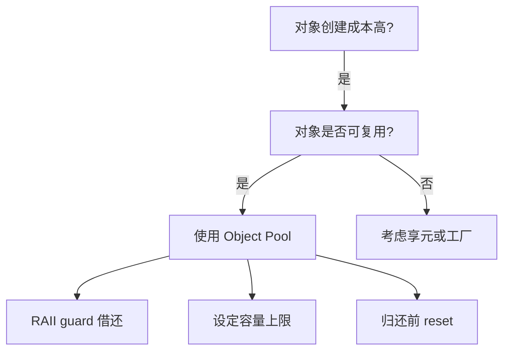
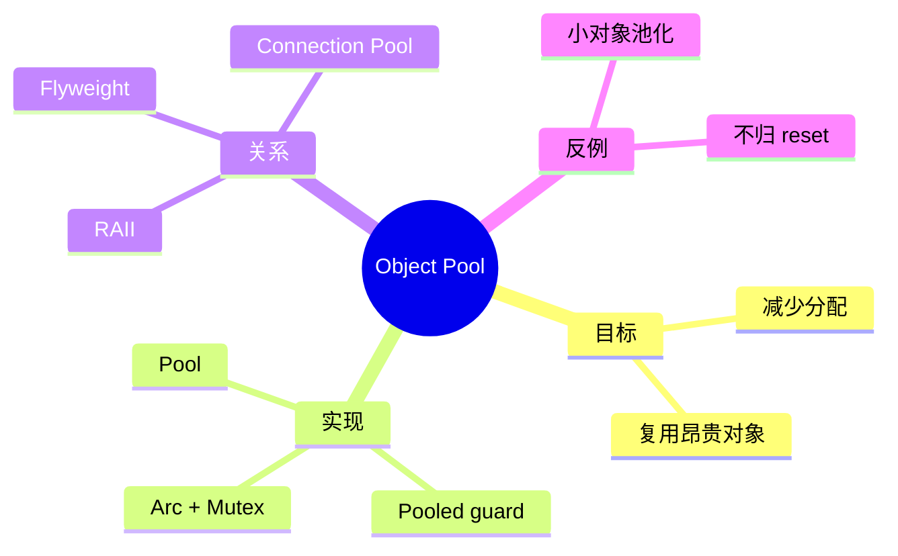

> **内容分级**: [专家级]

# 对象池模式（Object Pool）

**EN**: Object Pool Pattern in Rust
**Summary**: Reuse expensive-to-create objects instead of allocating and dropping them repeatedly, while maintaining type-safe ownership and bounds.

> **Rust 版本**: 1.97.0+ (Edition 2024)
> **Bloom 层级**: L5
> **权威来源**: 本文件为 `concept/` 权威页。
> **定位**: 将 GoF 对象池模式与 Rust 的所有权、生命周期、RAII 结合，实现零泄漏、可复用的资源池。
> **前置概念**: [Ownership](../../01_foundation/01_ownership_borrow_lifetime/01_ownership.md) · [RAII](../03_design_patterns/02_idioms_spectrum.md) · [Concurrency Patterns](../../03_advanced/00_concurrency/03_concurrency_patterns.md) · [Paradigm Matrix](../../05_comparative/00_paradigms/01_paradigm_matrix.md)
> **后置概念**: [Flyweight（已覆盖于 01_patterns.md）](01_patterns.md) · [Performance Optimization](../10_performance/01_performance_optimization.md)

---

> **来源 / Provenance**:
> [GoF — Design Patterns: Elements of Reusable Object-Oriented Software](https://en.wikipedia.org/wiki/Design_Patterns) ·
> [Rustonomicon — Lifetimes](https://doc.rust-lang.org/nomicon/index.html) ·
> [Object Pool pattern on Wikipedia](https://en.wikipedia.org/wiki/Object_pool_pattern) ·
> [The Rust Performance Book](https://nnethercote.github.io/perf-book/)

---

## 一、权威定义

**对象池（Object Pool）**: 预先创建并维护一组可重用的对象，在请求时借出、用完时归还，以减少频繁分配/释放的开销。适用于创建成本高、可复用的资源，如数据库连接、线程、大缓冲区、GPU 资源。

> **来源**: [GoF — Design Patterns](https://en.wikipedia.org/wiki/Design_Patterns) · [Wikipedia — Object pool pattern](https://en.wikipedia.org/wiki/Object_pool_pattern)

---

## 二、属性矩阵

| 属性 | 说明 | Rust 实现 |
|:---|:---|:---|
| **获取/归还** | 借出对象并在作用域结束时归还 | RAII guard (`Pooled<T>`) |
| **容量边界** | 限制池中最大对象数 | `Semaphore` 或 bounded channel |
| **并发安全** | 多线程同时借还 | `Arc<Mutex<Vec<T>>>` / `crossbeam-queue` |
| **对象健康** | 归还前验证对象可用性 | `Pool::validate(&T) -> bool` |
| **创建策略** | 预分配 vs 惰性创建 | `VecDeque<T>` + `Default::default()` |

---

## 三、Rust 实现

```rust,ignore
use std::ops::{Deref, DerefMut};
use std::sync::{Arc, Mutex};

pub struct Pool<T> {
    items: Arc<Mutex<Vec<T>>>,
}

pub struct Pooled<T> {
    item: Option<T>,
    pool: Arc<Mutex<Vec<T>>>,
}

impl<T> Deref for Pooled<T> {
    type Target = T;
    fn deref(&self) -> &T { self.item.as_ref().unwrap() }
}

impl<T> DerefMut for Pooled<T> {
    fn deref_mut(&mut self) -> &mut T { self.item.as_mut().unwrap() }
}

impl<T> Drop for Pooled<T> {
    fn drop(&mut self) {
        if let Some(item) = self.item.take() {
            let _ = self.pool.lock().unwrap().push(item);
        }
    }
}

impl<T> Pool<T> {
    pub fn new(items: Vec<T>) -> Self {
        Self { items: Arc::new(Mutex::new(items)) }
    }

    pub fn acquire(&self) -> Option<Pooled<T>> {
        let mut lock = self.items.lock().unwrap();
        lock.pop().map(|item| Pooled {
            item: Some(item),
            pool: Arc::clone(&self.items),
        })
    }
}
```

---

## 四、关系

- **Object Pool ↔ Flyweight**: 对象池复用可变的重量级对象；享元共享不可变的轻量级状态。两者都减少分配，但目的不同。
- **Object Pool ↔ RAII**: 池化对象通常通过 guard 模式归还，依赖 RAII 保证不泄漏。
- **Object Pool ↔ Connection Pool**: 连接池是对象池在数据库/网络连接上的特化。

---

## 五、反例与边界

### 反例：对廉价对象使用对象池

```rust,ignore
// ❌ 错误：对 u8 小缓冲区使用对象池
let pool = Pool::new(vec![0u8; 1024]);
```

**修正**: 对象池的维护开销（锁、归还逻辑）可能超过分配小对象的收益。应对大缓冲区、连接、线程等昂贵资源使用。

### 边界：归还时状态

借出对象可能携带脏状态。池应提供 `reset` 或要求借用方在归还前清理。

---

## 六、决策树



---

## 七、思维导图



---

## 八、权威来源索引

- Gamma, E. et al. *Design Patterns: Elements of Reusable Object-Oriented Software*. Addison-Wesley, 1994.
- [Wikipedia — Object pool pattern](https://en.wikipedia.org/wiki/Object_pool_pattern)
- [The Rust Performance Book](https://nnethercote.github.io/perf-book/)
- [Rustonomicon](https://doc.rust-lang.org/nomicon/index.html)

> **文档版本**: 1.0 ｜ **最后更新**: 2026-07-31 ｜ **状态**: ✅ 新建权威页
