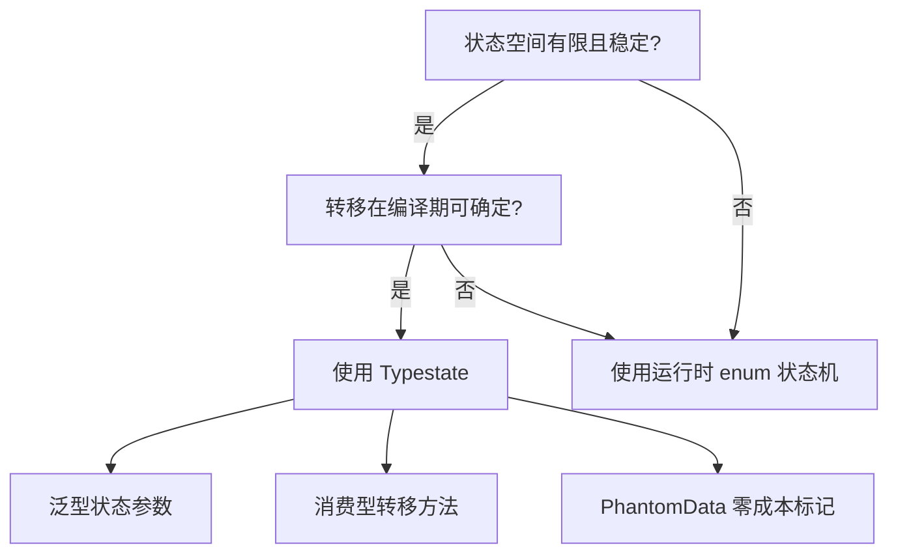
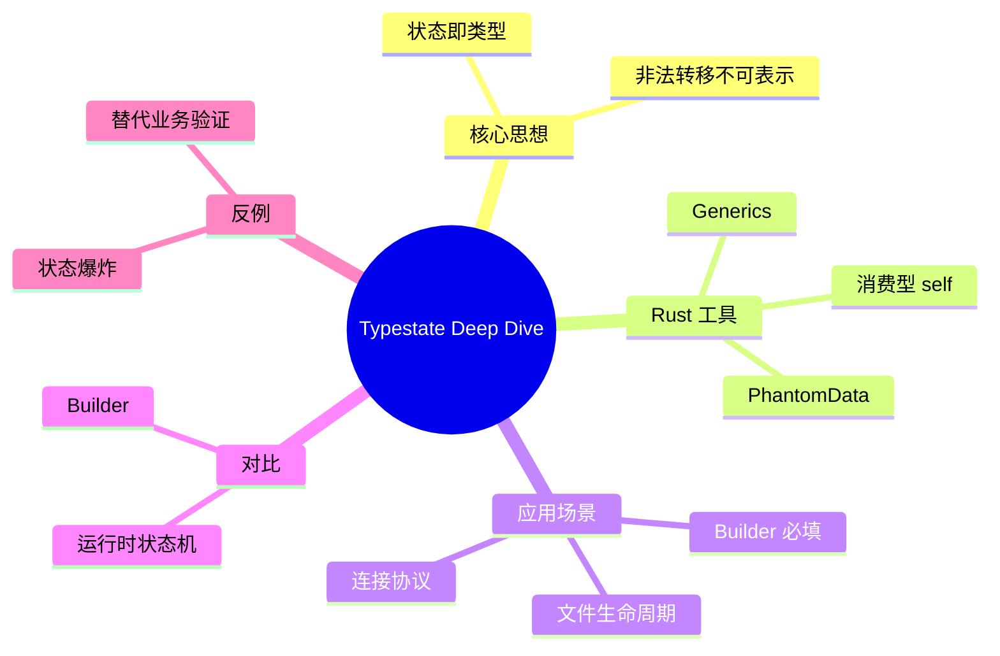

> **内容分级**: [专家级]

# 类型状态模式深度剖析（Typestate Deep Dive）

**EN**: Typestate Pattern Deep Dive
**Summary**: Encode protocol states as types so that illegal state transitions become compile-time errors, leveraging Rust's ownership and generics.

> **Rust 版本**: 1.97.0+ (Edition 2024)
> **Bloom 层级**: L3-L5
> **权威来源**: 本文件为 `concept/` 权威页。
> **定位**: 在 `01_patterns.md` 与 `02_idioms_spectrum.md` 的 Typestate 基础上，提供更系统的形式化定义、变型控制、与运行时状态机的对比，以及生产级实现策略。
> **前置概念**: [Type System](../../01_foundation/02_type_system/01_type_system.md) · [Generics](../../02_intermediate/01_generics/01_generics.md) · [PhantomData](../../02_intermediate/01_generics/03_type_level_programming.md) · [Ownership](../../01_foundation/01_ownership_borrow_lifetime/01_ownership.md) · [Language Semantic Model Matrix](../../05_comparative/00_paradigms/05_language_semantic_model_matrix.md)
> **后置概念**: [Builder](01_patterns.md) · [State Machine](01_patterns.md) · [Idioms Spectrum](02_idioms_spectrum.md)

---

> **来源 / Provenance**:
> [Strom & Yemini 1986 — Typestate: A Programming Language Concept for Enhancing Software Reliability](https://doi.org/10.1145/512644.512659) ·
> [Rust Design Patterns — Typestate](https://rust-unofficial.github.io/patterns/typestate.html) ·
> [Wikipedia — Typestate analysis](https://en.wikipedia.org/wiki/Typestate_analysis) ·
> [TRPL §10 — Generic Types](https://doc.rust-lang.org/book/ch10-00-generics.html)

---

## 一、权威定义

**Typestate（类型状态）**: 将对象的可接受状态空间编码进类型参数；状态转移只能通过返回新类型实例的方法完成。非法转移在编译期被拒绝。

形式化：设对象 `O<S>` 的状态集合为 `S ∈ {S₁, S₂, ..., Sₙ}`，合法转移为偏函数 `δ: O<Sᵢ> → O<Sⱼ>`。未定义的 `δ` 对应的方法不存在，因此调用非法转移会在类型检查阶段失败。

> **来源**: [Strom & Yemini 1986](https://doi.org/10.1145/512644.512659) · [Rust Design Patterns — Typestate](https://rust-unofficial.github.io/patterns/typestate.html)

---

## 二、属性矩阵

| 维度 | Typestate | 运行时状态机 |
|:---|:---|:---|
| **状态检查时机** | 编译期 | 运行期 |
| **运行时开销** | 零成本 | 分支/查表开销 |
| **状态空间大小** | 适合中小型（<20） | 可任意大 |
| **错误反馈** | `E0599` 等方法不存在错误 | panic / 返回 Err |
| **典型 Rust 工具** | 泛型 + `PhantomData` + 消费型 `self` | `enum` + `match` |
| **动态多态** | 不支持（静态分发） | 支持 `dyn State` |

---

## 三、Rust 实现

### 3.1 基础 Typestate

```rust
struct Disconnected;
struct Connected;

struct TcpClient<State> {
    addr: String,
    _state: std::marker::PhantomData<State>,
}

impl TcpClient<Disconnected> {
    pub fn new(addr: impl Into<String>) -> Self {
        Self { addr: addr.into(), _state: std::marker::PhantomData }
    }

    pub fn connect(self) -> TcpClient<Connected> {
        TcpClient {
            addr: self.addr,
            _state: std::marker::PhantomData,
        }
    }
}

impl TcpClient<Connected> {
    pub fn send(&self, msg: &[u8]) {
        // 发送逻辑
    }

    pub fn disconnect(self) -> TcpClient<Disconnected> {
        TcpClient {
            addr: self.addr,
            _state: std::marker::PhantomData,
        }
    }
}

fn main() {
    let client = TcpClient::new("127.0.0.1:8080");
    let client = client.connect();
    client.send(b"hello");
    let _ = client.disconnect();
    // client.send(b"world"); // ❌ 编译错误：Disconnected 状态无 send 方法
}
```

### 3.2 带可变性的 Typestate

```rust,ignore
struct Open;
struct Closed;

struct FileHandle<State> {
    path: String,
    _state: std::marker::PhantomData<State>,
}

impl FileHandle<Closed> {
    fn open(path: &str) -> FileHandle<Open> {
        FileHandle { path: path.into(), _state: std::marker::PhantomData }
    }
}

impl FileHandle<Open> {
    fn read(&mut self) -> Vec<u8> { vec![] }
    fn close(self) -> FileHandle<Closed> {
        FileHandle { path: self.path, _state: std::marker::PhantomData }
    }
}
```

---

## 四、关系

- **Typestate ↔ Builder**: 类型状态 Builder 是 Typestate 最常见的应用；必填字段通过状态类型强制。
- **Typestate ↔ State Machine**: Typestate 是编译期状态机；当状态数量大或需要动态插件时，应改用运行时 `enum` 状态机。
- **Typestate ↔ PhantomData**: `PhantomData` 携带状态信息而不占内存，是 Typestate 的零成本基石。

---

## 五、反例与边界

### 反例：状态爆炸

```rust,ignore
// ❌ 错误：把 50 个业务状态全部编码为类型参数
struct Order<S1, S2, S3, S4, S5, S6, S7, S8, S9, S10>;
```

**修正**: 当状态数量超过 15-20 或转移图高度动态时，改用运行时状态机。

### 边界：Typestate 不替代验证

Typestate 保证「不可调用非法转移方法」，但不能替代业务值的运行时验证（如金额 > 0）。

---

## 六、决策树



---

## 七、思维导图



---

## 八、权威来源索引

- Strom, R. E. & Yemini, S. "Typestate: A Programming Language Concept for Enhancing Software Reliability." *IEEE TSE 1986*. [https://doi.org/10.1145/512644.512659](https://doi.org/10.1145/512644.512659)
- [Rust Design Patterns — Typestate](https://rust-unofficial.github.io/patterns/typestate.html)
- [Wikipedia — Typestate analysis](https://en.wikipedia.org/wiki/Typestate_analysis)
- Klabnik, S. & Nichols, C. *The Rust Programming Language*, Ch. 10. [https://doc.rust-lang.org/book/ch10-00-generics.html](https://doc.rust-lang.org/book/ch10-00-generics.html)

> **文档版本**: 1.0 ｜ **最后更新**: 2026-07-31 ｜ **状态**: ✅ 新建权威页

## 国际化权威来源补充（International Authority Sources）

- https://dl.acm.org/doi/book/10.5555/186897
