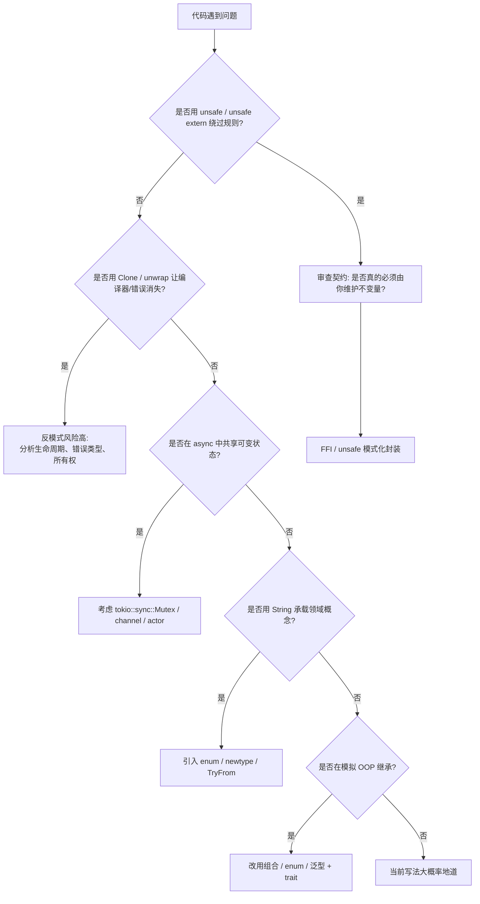

> **内容分级**: [进阶]
>
> **EN**: Rust Anti-patterns
> **Summary**: Common Rust anti-patterns and their idiomatic alternatives: clone-to-silence-borrow-checker, OOP emulation, stringly-typed APIs, unwrap cascades, mutex-guard-across-await, premature async, and shared mutable global state.
>
> **Rust 版本**: 1.97.0+ (Edition 2024)
> **受众**: [进阶]
> **Bloom 层级**: L3-L5
> **权威来源**: 本文件为 `concept/` 权威页。
> **定位**: 系统梳理 Rust 生态中常见**反模式（anti-patterns）**——它们能编译、能短期解决问题，但会引入性能、可维护性或正确性债务；每个反模式都给出地道替代方案与可编译的“反例 → 正例”对照。
>
> **前置概念**: [Idioms Spectrum](02_idioms_spectrum.md) · [Ownership](../../01_foundation/01_ownership_borrow_lifetime/01_ownership.md) · [Traits](../../02_intermediate/00_traits/01_traits.md) · [Async](../../03_advanced/01_async/01_async.md)
> **后置概念**: [API Design Patterns](18_api_design_patterns.md) · [FFI Patterns](../../03_advanced/04_ffi/07_ffi_patterns.md)

---

> **来源**:
> [Rust Design Patterns — Anti-patterns](https://rust-unofficial.github.io/patterns/anti_patterns/) ·
> [Rust API Guidelines](https://rust-lang.github.io/api-guidelines/) ·
> [The Rust Programming Language](https://doc.rust-lang.org/book/title-page.html) ·
> [Rustonomicon](https://doc.rust-lang.org/nomicon/index.html) ·
> [Clippy Lints](https://rust-lang.github.io/rust-clippy/master/index.html)

---

## 📑 目录

- [📑 目录](#-目录)
- [一、认知地图：为什么反模式值得系统学习](#一认知地图为什么反模式值得系统学习)
- [二、反模式速查表](#二反模式速查表)
- [三、用 `Clone` 消除借用检查错误](#三用-clone-消除借用检查错误)
  - [定义](#定义)
  - [为什么有问题](#为什么有问题)
  - [地道替代](#地道替代)
  - [反例 ❌](#反例-)
  - [正例 ✅](#正例-)
  - [进阶：用 `mem::take` 替换“克隆后清空”](#进阶用-memtake-替换克隆后清空)
- [四、把 Rust 当 OOP 使用](#四把-rust-当-oop-使用)
  - [定义](#定义-1)
  - [为什么有问题](#为什么有问题-1)
  - [地道替代](#地道替代-1)
  - [反例 ❌：无处不在的 trait object](#反例-无处不在的-trait-object)
  - [正例 ✅：enum 表达封闭集合](#正例-enum-表达封闭集合)
  - [反例 ❌：用 `Deref` 模拟继承](#反例-用-deref-模拟继承)
  - [正例 ✅：显式组合](#正例-显式组合)
- [五、Stringly Typed / `String` 滥用](#五stringly-typed--string-滥用)
  - [定义](#定义-2)
  - [为什么有问题](#为什么有问题-2)
  - [地道替代](#地道替代-2)
  - [反例 ❌](#反例--1)
  - [正例 ✅](#正例--1)
- [六、`unwrap()` 级联而非 `?` 传播](#六unwrap-级联而非--传播)
  - [定义](#定义-3)
  - [为什么有问题](#为什么有问题-3)
  - [地道替代](#地道替代-3)
  - [反例 ❌](#反例--2)
  - [正例 ✅](#正例--2)
  - [进阶：用 `let-else` 做早期退出](#进阶用-let-else-做早期退出)
- [七、在 `await` 点持有 `MutexGuard`（async）](#七在-await-点持有-mutexguardasync)
  - [定义](#定义-4)
  - [为什么有问题](#为什么有问题-4)
  - [地道替代](#地道替代-4)
  - [反例 ❌](#反例--3)
  - [正例 ✅：缩短锁作用域](#正例-缩短锁作用域)
  - [正例 ✅：使用 `tokio::sync::Mutex`](#正例-使用-tokiosyncmutex)
- [八、过早使用 `async`](#八过早使用-async)
  - [定义](#定义-5)
  - [为什么有问题](#为什么有问题-5)
  - [地道替代](#地道替代-5)
  - [反例 ❌](#反例--4)
  - [正例 ✅](#正例--3)
- [九、通过 `static mut` 共享可变全局状态](#九通过-static-mut-共享可变全局状态)
  - [定义](#定义-6)
  - [为什么有问题](#为什么有问题-6)
  - [地道替代](#地道替代-6)
  - [反例 ❌](#反例--5)
  - [正例 ✅：使用 `Mutex` + `LazyLock`](#正例-使用-mutex--lazylock)
  - [正例 ✅：线程本地状态](#正例-线程本地状态)
- [十、决策树：这是反模式吗？](#十决策树这是反模式吗)
- [十一、反模式与 Clippy 的对应](#十一反模式与-clippy-的对应)
- [十二、权威来源与延伸阅读](#十二权威来源与延伸阅读)

---

## 一、认知地图：为什么反模式值得系统学习

**反模式**是“能工作但会制造更多问题的习惯性解法”。Rust 的强类型系统、所有权（Ownership）和生命周期（Lifetimes）会把很多潜在问题推到编译期；当开发者用反模式绕过这些信号时，问题并不会消失，而是转移到运行时、性能或维护成本中。

本页覆盖的七类反模式可归纳为三条主线：

| 主线 | 涉及的反模式 | 核心风险 |
|:---|:---|:---|
| **借用与所有权误用** | 滥用 `Clone`、`unwrap()` 级联 | 隐藏性能开销、运行时 panic、错误上下文丢失 |
| **类型系统误用** | OOP 模拟、Stringly Typed API | 丢失编译期保证、API 难以演进 |
| **并发/异步误用** | `MutexGuard` 跨 `await`、过早 `async`、`static mut` | 编译错误、数据竞争、未定义行为（UB） |

> **学习原则**：先识别“为什么这是反模式”，再记住“地道写法是什么”。没有银弹——某些场景下反模式是合理的（如原型、性能不敏感脚本），但必须是**有意识的选择**，而不是对编译器提示的应激反应。

---

## 二、反模式速查表

| 反模式 | 一句话问题 | 地道替代 |
|:---|:---|:---|
| `Clone` 消除借用错误 | 隐藏 O(n)/堆分配成本，制造状态不同步 | 重新借用、临时提取、`Rc`/`Arc`、`mem::take` |
| OOP 式继承/无处不在的 trait object | 丢失静态分发、类型推导与编译期检查 | 组合、`enum` 代数数据类型、泛型 + trait bound |
| Stringly Typed | 运行时解析、拼写错误、非法状态可表示 | Newtype、`enum`、`TryFrom` |
| `unwrap()` 级联 | 任意点 panic，错误上下文不可恢复 | `?`、`map_err`、`let-else`、`Result` 链 |
| `MutexGuard` 跨 `await` | `std::sync::MutexGuard` 非 `Send`，阻塞运行时 | `tokio::sync::Mutex`、缩短锁作用域、消息传递 |
| 过早 `async` | 引入运行时依赖、调试复杂度、无并发收益 | 同步 API + `spawn_blocking` 或线程池 |
| `static mut` 共享状态 | 数据竞争、UB、与现代 Rust 并发模型冲突 | `Mutex`/`RwLock` + `LazyLock`、`thread_local`、channel |

---

## 三、用 `Clone` 消除借用检查错误

### 定义

当编译器报错“cannot borrow `x` as mutable because it is also borrowed as immutable”时，**第一反应不是分析生命周期，而是直接 `.clone()` 让错误消失**。

### 为什么有问题

1. **性能债务**：`Clone` 可能是深拷贝（`Vec`、`String`、`HashMap`），带来 O(n) 或堆分配开销。
2. **语义不同步**：克隆后修改的是副本，原变量不变；若业务期望原变量被修改，则引入逻辑错误。
3. **掩盖真正的设计问题**：借用冲突往往说明所有权/生命周期划分不合理，应优先重构而非克隆。

### 地道替代

- 用**只读迭代**替代克隆后遍历。
- 用 `std::mem::take` / `std::mem::replace` 把值临时取出再归还。
- 若确实需要共享所有权，使用 `Rc<T>`（单线程）或 `Arc<T>`（多线程）。

### 反例 ❌

```rust
fn process(items: &mut Vec<i32>, out: &mut Vec<i32>) {
    // 为了让下面能同时修改 items，先克隆一份
    for item in items.clone() {
        out.push(item * 2);
    }
    // 原意：继续向 items 追加
    items.push(42);
}

fn main() {
    let mut src = vec![1, 2, 3];
    let mut dst = Vec::new();
    process(&mut src, &mut dst);
    assert_eq!(dst, vec![2, 4, 6]);
    assert_eq!(src, vec![1, 2, 3, 42]);
}
```

### 正例 ✅

```rust
fn process(items: &mut Vec<i32>, out: &mut Vec<i32>) {
    // 先用不可变借用遍历，不与后面的 &mut 冲突
    out.extend(items.iter().map(|&x| x * 2));
    items.push(42);
}

fn main() {
    let mut src = vec![1, 2, 3];
    let mut dst = Vec::new();
    process(&mut src, &mut dst);
    assert_eq!(dst, vec![2, 4, 6]);
    assert_eq!(src, vec![1, 2, 3, 42]);
}
```

### 进阶：用 `mem::take` 替换“克隆后清空”

```rust
fn drain_and_process(items: &mut Vec<i32>) -> Vec<i32> {
    // 零成本：把 Vec 的所有权临时取出，留下空 Vec
    let taken = std::mem::take(items);
    taken.into_iter().map(|x| x * 2).collect()
}

fn main() {
    let mut src = vec![1, 2, 3];
    let out = drain_and_process(&mut src);
    assert_eq!(out, vec![2, 4, 6]);
    assert!(src.is_empty());
}
```

---

## 四、把 Rust 当 OOP 使用

### 定义

用**深继承层次**、**无处不在的 trait object** 或 **`Deref` 模拟子类型多态**来组织代码，把 Rust 写成“带借用检查器的 Java/C++”。

### 为什么有问题

1. **静态分发优势被浪费**：泛型 + trait bound 可在编译期单态化，零成本抽象；`dyn Trait` 有虚表和运行时开销。
2. **类型推导与编译期检查变弱**：`dyn Animal` 不再携带具体类型，编译器无法利用具体类型的不变量。
3. **`Deref` 多态是隐式且令人惊讶的**：`Deref` 本意是智能指针透明解引用，不是继承替代物；它还会破坏 trait bound 推导。
4. **封闭式集合用 enum 更自然**：Rust 的 `enum` 是带数据的代数数据类型，配合 `match` 穷尽性检查。

### 地道替代

- **组合优于继承**：`struct Car { engine: Engine }` 并显式暴露 `engine()` 方法。
- **封闭类型集合用 `enum`**；开放扩展用 trait + 泛型。
- 需要运行时多态时，局部、少量地使用 `dyn Trait`，并明确其生命周期边界。

### 反例 ❌：无处不在的 trait object

```rust
trait Animal {
    fn speak(&self);
}

struct Dog;
struct Cat;

impl Animal for Dog {
    fn speak(&self) { println!("woof"); }
}
impl Animal for Cat {
    fn speak(&self) { println!("meow"); }
}

// 所有地方都走动态分发，丢失了具体类型信息
fn greet_all(animals: &[Box<dyn Animal>]) {
    for a in animals {
        a.speak();
    }
}

fn main() {
    let animals: Vec<Box<dyn Animal>> = vec![Box::new(Dog), Box::new(Cat)];
    greet_all(&animals);
}
```

### 正例 ✅：enum 表达封闭集合

```rust
enum Animal {
    Dog { name: String },
    Cat { name: String },
}

impl Animal {
    fn speak(&self) {
        match self {
            Animal::Dog { name } => println!("{name}: woof"),
            Animal::Cat { name } => println!("{name}: meow"),
        }
    }
}

fn greet_all(animals: &[Animal]) {
    for a in animals {
        a.speak();
    }
}

fn main() {
    let animals = vec![
        Animal::Dog { name: "Bella".into() },
        Animal::Cat { name: "Luna".into() },
    ];
    greet_all(&animals);
}
```

### 反例 ❌：用 `Deref` 模拟继承

```rust,ignore
struct Engine;
impl Engine { fn start(&self) { println!("engine start"); } }

struct Car { engine: Engine }

impl std::ops::Deref for Car {
    type Target = Engine;
    fn deref(&self) -> &Engine { &self.engine }
}

fn main() {
    let car = Car { engine: Engine };
    car.start(); // 隐式：通过 Deref 调用 Engine 的方法
}
```

> 该代码能编译，但违反 Rust API Guidelines 的 [C-DEREF](https://rust-lang.github.io/api-guidelines/predictability.html#c-deref)。

### 正例 ✅：显式组合

```rust
struct Engine;
impl Engine { fn start(&self) { println!("engine start"); } }

struct Car { engine: Engine }

impl Car {
    pub fn engine(&self) -> &Engine { &self.engine }
}

fn main() {
    let car = Car { engine: Engine };
    car.engine().start(); // 显式、可预测
}
```

---

## 五、Stringly Typed / `String` 滥用

### 定义

用裸 `String`/`&str` 承载领域概念（用户 ID、命令名称、状态、URL），而不是用强类型表达。

### 为什么有问题

1. **非法状态可表示**：`"foobar"` 可以作为用户 ID、命令名或状态，运行时才能发现错误。
2. **无编译期帮助**：拼写错误、`to_lowercase` 不一致、单位混淆要到运行时暴露。
3. **API 自文档性差**：函数签名 `fn handle(cmd: &str)` 无法说明合法取值集合。

### 地道替代

- **Newtype**：`struct UserId(u64)` / `struct Email(String)`。
- **枚举**：`enum Command { Start, Stop, Restart }`。
- **Parse, don't validate**：构造器返回 `Result<T, E>`，确保“构造即有效”。

### 反例 ❌

```rust
fn dispatch(action: &str, target: &str) {
    match action {
        "start" => println!("start {target}"),
        "stop" => println!("stop {target}"),
        _ => panic!("unknown action"),
    }
}

fn main() {
    dispatch("stert", "svc"); // 运行时 panic，编译器无能为力
}
```

### 正例 ✅

```rust
use std::convert::TryFrom;

#[derive(Debug, Clone, Copy)]
enum Action {
    Start,
    Stop,
    Restart,
}

impl TryFrom<&str> for Action {
    type Error = &'static str;
    fn try_from(s: &str) -> Result<Self, Self::Error> {
        match s {
            "start" => Ok(Action::Start),
            "stop" => Ok(Action::Stop),
            "restart" => Ok(Action::Restart),
            _ => Err("unknown action"),
        }
    }
}

#[derive(Debug, Clone)]
struct ServiceName(String);

impl ServiceName {
    fn new(s: &str) -> Result<Self, &'static str> {
        if s.is_empty() || s.contains(' ') {
            return Err("invalid service name");
        }
        Ok(Self(s.to_string()))
    }
}

fn dispatch(action: Action, target: &ServiceName) {
    println!("{:?} {}", action, target.0);
}

fn main() {
    let action = Action::try_from("start").unwrap();
    let target = ServiceName::new("svc").unwrap();
    dispatch(action, &target);
}
```

---

## 六、`unwrap()` 级联而非 `?` 传播

### 定义

在可能失败的调用链中大量使用 `.unwrap()` 或 `.expect("...")`，把 `Result`/`Option` 强转为值，遇到失败即 panic。

### 为什么有问题

1. **不可恢复**：panic 会中断当前线程，无法让调用方基于错误类型做决策。
2. **错误上下文丢失**：底层错误被 `.unwrap()` 吞掉，日志里只有 panic 位置，没有原因。
3. **维护困难**：新增失败点后需要逐个检查 `unwrap`。

### 地道替代

- 函数返回 `Result<T, E>`，使用 `?` 自动传播。
- 用 `thiserror`/`anyhow` 给错误添加上下文。
- 在真正不可失败的位置（如单元测试、已知非空的常量）才使用 `unwrap()`/`expect()`。

### 反例 ❌

```rust
use std::fs::File;
use std::io::{self, Read};

fn read_config(path: &str) -> String {
    let mut file = File::open(path).unwrap();            // 可能 panic
    let mut contents = String::new();
    file.read_to_string(&mut contents).unwrap();         // 可能 panic
    contents
}

fn main() {
    let cfg = read_config("/etc/app.conf");
    println!("{cfg}");
}
```

### 正例 ✅

```rust
use std::fs::File;
use std::io::{self, Read};

fn read_config(path: &str) -> Result<String, io::Error> {
    let mut file = File::open(path)?;
    let mut contents = String::new();
    file.read_to_string(&mut contents)?;
    Ok(contents)
}

fn main() {
    match read_config("/etc/app.conf") {
        Ok(cfg) => println!("{cfg}"),
        Err(e) => eprintln!("failed to read config: {e}"),
    }
}
```

### 进阶：用 `let-else` 做早期退出

```rust
use std::fs::File;
use std::io::{self, Read};

fn main() -> Result<(), io::Error> {
    let path = std::env::args().nth(1);
    let Some(path) = path else {
        return Err(io::Error::new(io::ErrorKind::InvalidInput, "missing path"));
    };

    let mut file = File::open(path)?;
    let mut contents = String::new();
    file.read_to_string(&mut contents)?;
    println!("{contents}");
    Ok(())
}
```

---

## 七、在 `await` 点持有 `MutexGuard`（async）

### 定义

在 `async fn` 中使用 `std::sync::Mutex`，并在持有 `MutexGuard` 的状态下调用 `.await`。

### 为什么有问题

1. **编译错误**：`std::sync::MutexGuard` 不实现 `Send`（受平台实现限制），而多数异步运行时要求 Future 跨线程 `Send`。
2. **阻塞运行时线程**：`std::sync::Mutex` 是 OS 锁，持有期间若发生任务切换，会阻塞当前执行器线程，降低并发效率。
3. **死锁风险**：若 `.await` 内部再次尝试获取同一把锁，会导致死锁。

### 地道替代

- 使用异步感知的锁，如 `tokio::sync::Mutex` 或 `async-lock`。
- 尽量**缩小锁作用域**：在 `.await` 前 `drop(guard)`。
- 把状态访问重构为 actor/消息通道，避免在 async 任务中直接共享可变状态。

### 反例 ❌

```rust,ignore
use std::sync::{Arc, Mutex};

async fn work(state: Arc<Mutex<Vec<u32>>>) {
    let mut guard = state.lock().unwrap();
    guard.push(1);
    some_io().await; // ❌ MutexGuard 被持有跨越 await 点
    guard.push(2);
}

async fn some_io() { /* ... */ }
```

> 在需要 `Send` 的 Future 中，该代码通常触发 `std::sync::MutexGuard` 不是 `Send` 的编译错误。

### 正例 ✅：缩短锁作用域

```rust,ignore
use std::sync::{Arc, Mutex};

async fn work(state: Arc<Mutex<Vec<u32>>>) {
    {
        let mut guard = state.lock().unwrap();
        guard.push(1);
    } // guard 在这里 drop
    some_io().await;
    {
        let mut guard = state.lock().unwrap();
        guard.push(2);
    }
}

async fn some_io() { /* ... */ }
```

### 正例 ✅：使用 `tokio::sync::Mutex`

```rust,ignore
use std::sync::Arc;
use tokio::sync::Mutex;

async fn work(state: Arc<Mutex<Vec<u32>>>) {
    let mut guard = state.lock().await; // guard 是 Send 的
    guard.push(1);
    some_io().await;
    guard.push(2);
}

async fn some_io() { /* ... */ }
```

---

## 八、过早使用 `async`

### 定义

在没有真正并发需求、没有 I/O 等待、没有事件驱动需求的场景下使用 `async`/`await`，把简单同步代码异步化。

### 为什么有问题

1. **运行时依赖**：需要 Tokio/async-std 等运行时，增加二进制体积、依赖图和调试复杂度。
2. **传染性**：一个 `async fn` 会强制所有调用点变成 async 或 `block_on`。
3. **性能收益为负**：纯计算型任务在 async 运行时中反而增加上下文切换与状态机开销。

### 地道替代

- **先做同步实现**：如果函数只有计算或同步 I/O，保持同步签名。
- **需要并发时再包装**：用 `tokio::task::spawn_blocking` / `rayon` 把同步工作交给专用线程池。
- **区分“并行”与“异步”**：并行计算用线程池/rayon；网络 I/O 才适合 async。

### 反例 ❌

```rust,ignore
async fn add(a: i32, b: i32) -> i32 {
    a + b
}

async fn sum(numbers: &[i32]) -> i32 {
    numbers.iter().sum()
}
```

### 正例 ✅

```rust
fn add(a: i32, b: i32) -> i32 {
    a + b
}

fn sum(numbers: &[i32]) -> i32 {
    numbers.iter().sum()
}
```

```rust,ignore
// 当且仅当需要在 async 环境中并发执行重计算时
async fn parallel_sum(numbers: Vec<i32>) -> i32 {
    tokio::task::spawn_blocking(move || numbers.iter().sum::<i32>())
        .await
        .unwrap()
}
```

---

## 九、通过 `static mut` 共享可变全局状态

### 定义

使用 `static mut FOO: T = ...` 并在 `unsafe` 块中直接读写，作为线程间或任务间共享可变状态的手段。

### 为什么有问题

1. **数据竞争**：多个线程同时读写 `static mut` 会破坏 Rust 的内存安全保证，导致 UB。
2. **`unsafe` 债务放大**：每次访问都需要 `unsafe`，且无法通过编译器验证访问顺序。
3. **可维护性差**：全局可变状态隐藏依赖关系，测试与并发推理困难。

### 地道替代

| 场景 | 推荐方案 |
|:---|:---|
| 多线程共享可变状态 | `static COUNTER: Mutex<u32> = Mutex::new(0);` 或 `LazyLock<Mutex<T>>` |
| 读多写少 | `RwLock` / `arc-swap` |
| 线程本地状态 | `thread_local!` |
| 任务间通信 | `mpsc` / `tokio::sync` channel |

### 反例 ❌

```rust,ignore
use std::thread;

static mut COUNTER: u32 = 0;

fn main() {
    let mut handles = Vec::new();
    for _ in 0..10 {
        handles.push(thread::spawn(|| {
            for _ in 0..1000 {
                unsafe { COUNTER += 1 }; // 数据竞争！
            }
        }));
    }
    for h in handles { h.join().unwrap(); }
    unsafe { println!("{}", COUNTER); } // 结果大概率不是 10000
}
```

### 正例 ✅：使用 `Mutex` + `LazyLock`

```rust
use std::sync::{LazyLock, Mutex};
use std::thread;

static COUNTER: LazyLock<Mutex<u32>> = LazyLock::new(|| Mutex::new(0));

fn main() {
    let mut handles = Vec::new();
    for _ in 0..10 {
        handles.push(thread::spawn(|| {
            for _ in 0..1000 {
                let mut guard = COUNTER.lock().unwrap();
                *guard += 1;
            }
        }));
    }
    for h in handles { h.join().unwrap(); }
    println!("{}", *COUNTER.lock().unwrap()); // 10000
}
```

### 正例 ✅：线程本地状态

```rust
use std::cell::RefCell;
use std::thread;

thread_local! {
    static COUNTER: RefCell<u32> = const { RefCell::new(0) };
}

fn main() {
    let handles: Vec<_> = (0..10)
        .map(|_| thread::spawn(|| {
            COUNTER.with(|c| {
                let mut guard = c.borrow_mut();
                *guard += 1;
            });
        }))
        .collect();
    for h in handles { h.join().unwrap(); }
    COUNTER.with(|c| println!("main thread: {}", c.borrow()));
}
```

---

## 十、决策树：这是反模式吗？



> **使用建议**：把此决策树作为代码审查的 check-list。若路径最终指向某个反模式，先尝试重构到“正例”；只有在有明确性能/接口理由时，才保留反模式并加注释说明。

---

## 十一、反模式与 Clippy 的对应

| 反模式 | 相关 Clippy lint | 说明 |
|:---|:---|:---|
| `Clone` 滥用 | `clone_on_copy`, `redundant_clone` | 指出可避免的克隆 |
| `unwrap()` 级联 | `unwrap_used`, `expect_used` | 建议用 `?` 或错误处理 |
| Stringly Typed | `ptr_arg`, `string_lit_as_bytes` 等 | 提示更精确的类型 |
| OOP `Deref` | `deref_addrof`, 社区约定 | API Guidelines C-DEREF |
| async 中 `std::sync::Mutex` | 编译器 `Send` 错误 | 通常由 `Future` 跨线程要求触发 |
| `static mut` | 无直接 lint，但属 `unsafe` | 代码审查重点 |

---

## 十二、权威来源与延伸阅读

- **P0 官方**: [The Rust Programming Language](https://doc.rust-lang.org/book/title-page.html)
- **P0 官方**: [Rust API Guidelines](https://rust-lang.github.io/api-guidelines/)
- **P1 生态**: [Rust Design Patterns — Anti-patterns](https://rust-unofficial.github.io/patterns/anti_patterns/)
  - [Clone to satisfy the borrow checker](https://rust-unofficial.github.io/patterns/anti_patterns/borrow_clone.html)
  - [Deref Polymorphism](https://rust-unofficial.github.io/patterns/anti_patterns/deref.html)
- **P1 生态**: [Rustonomicon](https://doc.rust-lang.org/nomicon/index.html)
- **P1 生态**: [Clippy Lints](https://rust-lang.github.io/rust-clippy/master/index.html)
- **P1 书籍**: [Effective Rust](https://www.effective-rust.com/)
- **P1 书籍**: [Rust for Rustaceans](https://rust-for-rustaceans.com/)

---

> **权威来源**: [Rust Design Patterns — Anti-patterns](https://rust-unofficial.github.io/patterns/anti_patterns/)
> **状态**: ✅ 概念文件创建完成
> **最后更新**: 2026-07-31
